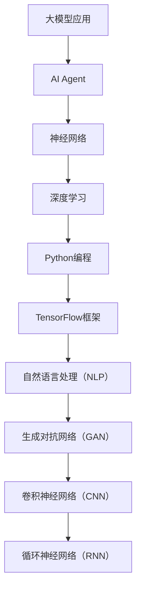

                 

## 大模型应用开发 动手做AI Agent

> **关键词：** 大模型应用、AI Agent、动手实践、深度学习、Python编程、GPT模型、聊天机器人

> **摘要：** 本文将探讨如何通过大模型应用开发，实现一个功能强大的AI Agent。我们将从背景介绍、核心概念、算法原理、数学模型、项目实战等多个角度详细解析，帮助读者深入了解并动手实现一个AI Agent。

## 1. 背景介绍

### 1.1 目的和范围

本文旨在探讨如何利用大模型进行AI Agent的开发。我们将结合实际案例，逐步介绍如何实现一个具有较强交互能力和自主学习能力的AI Agent。

本文的范围涵盖：

- 大模型应用开发的基础知识
- AI Agent的核心概念和架构
- AI Agent的算法原理和实现步骤
- 数学模型和公式的应用
- 实际项目实战中的代码实现和解读
- AI Agent的实际应用场景和未来发展趋势

### 1.2 预期读者

- 具有编程基础，对人工智能和深度学习感兴趣的开发者
- 想要了解AI Agent开发流程的技术人员
- 希望掌握大模型应用开发的技术专家

### 1.3 文档结构概述

本文分为以下章节：

1. 背景介绍
   - 目的和范围
   - 预期读者
   - 文档结构概述
   - 术语表
2. 核心概念与联系
   - 大模型应用概述
   - AI Agent的核心概念和架构
3. 核心算法原理 & 具体操作步骤
   - 算法原理讲解
   - 操作步骤解析
4. 数学模型和公式 & 详细讲解 & 举例说明
   - 数学模型介绍
   - 公式解析
   - 举例说明
5. 项目实战：代码实际案例和详细解释说明
   - 开发环境搭建
   - 源代码详细实现和代码解读
   - 代码解读与分析
6. 实际应用场景
   - AI Agent在实际中的应用
   - 案例分析
7. 工具和资源推荐
   - 学习资源推荐
   - 开发工具框架推荐
   - 相关论文著作推荐
8. 总结：未来发展趋势与挑战
9. 附录：常见问题与解答
10. 扩展阅读 & 参考资料

### 1.4 术语表

#### 1.4.1 核心术语定义

- **大模型应用：** 指利用大规模神经网络模型进行各种任务的应用，如文本生成、图像识别等。
- **AI Agent：** 指具备一定智能，能够与用户进行交互并执行任务的虚拟智能体。
- **神经网络：** 一种基于生物神经网络结构设计的算法模型，用于模拟人脑的智能处理能力。
- **深度学习：** 一种基于神经网络的多层模型训练方法，用于解决复杂任务。

#### 1.4.2 相关概念解释

- **卷积神经网络（CNN）：** 一种用于图像识别和处理的神经网络模型。
- **循环神经网络（RNN）：** 一种用于序列数据处理和时间序列预测的神经网络模型。
- **生成对抗网络（GAN）：** 一种基于对抗训练的神经网络模型，用于生成真实数据的图像、文本等。
- **自然语言处理（NLP）：** 一门研究如何让计算机理解和处理人类自然语言的学科。

#### 1.4.3 缩略词列表

- **AI：** 人工智能（Artificial Intelligence）
- **GPT：** 生成预训练模型（Generative Pre-trained Transformer）
- **Python：** 一种广泛应用于人工智能开发的编程语言（Python）
- **TensorFlow：** 一种开源深度学习框架（TensorFlow）

## 2. 核心概念与联系

在探讨大模型应用开发之前，我们需要先了解一些核心概念，如大模型、AI Agent、神经网络等。下面我们将通过一个Mermaid流程图来展示这些核心概念之间的联系。



### 2.1 大模型应用概述

大模型应用是指利用大规模神经网络模型进行各种任务的应用，如文本生成、图像识别等。大模型通常具有以下几个特点：

- **参数量巨大**：大模型包含数亿个参数，能够捕捉到更复杂的数据特征。
- **多层神经网络结构**：大模型通常采用多层神经网络结构，使模型能够对数据进行深层次的学习和表示。
- **预训练**：大模型在训练过程中，先使用大量未标注的数据进行预训练，然后再使用少量标注数据进行微调。

### 2.2 AI Agent的核心概念和架构

AI Agent是一种具备一定智能的虚拟智能体，能够与用户进行交互并执行任务。一个典型的AI Agent架构包括以下几个部分：

- **感知模块**：用于接收外部输入，如文本、图像等。
- **决策模块**：根据感知模块的输入，生成对应的响应或执行动作。
- **记忆模块**：存储历史交互记录和知识，用于辅助决策。
- **行动模块**：将决策模块生成的响应或动作输出到外部环境。

### 2.3 神经网络、深度学习与Python编程

神经网络是一种基于生物神经网络结构设计的算法模型，用于模拟人脑的智能处理能力。深度学习是一种基于神经网络的多层模型训练方法，用于解决复杂任务。Python编程是一种广泛应用于人工智能开发的编程语言。

- **神经网络**：神经网络由多个神经元（节点）组成，通过前向传播和反向传播算法进行训练。
- **深度学习**：深度学习在神经网络的基础上，引入多层神经网络结构，使模型能够对数据进行深层次的学习和表示。
- **Python编程**：Python编程为深度学习提供了丰富的库和工具，如TensorFlow、PyTorch等。

## 3. 核心算法原理 & 具体操作步骤

在实现AI Agent的过程中，核心算法原理是关键。下面我们将详细讲解大模型训练、感知模块、决策模块、记忆模块和行动模块的实现步骤。

### 3.1 大模型训练

大模型训练主要包括以下几个步骤：

1. **数据预处理**：对原始数据进行清洗、归一化等处理，使其符合模型的输入要求。
2. **模型初始化**：初始化神经网络参数，通常使用随机初始化或预训练模型。
3. **前向传播**：将输入数据传递到神经网络中，计算输出结果。
4. **损失函数计算**：计算预测结果与真实结果之间的差距，用于评估模型性能。
5. **反向传播**：根据损失函数，更新神经网络参数。
6. **迭代训练**：重复执行前向传播、损失函数计算和反向传播，直至达到训练目标。

伪代码如下：

```python
for epoch in range(num_epochs):
    for batch in data_loader:
        inputs, labels = batch
        outputs = model(inputs)
        loss = loss_function(outputs, labels)
        model.backward(loss)
        model.update_params()
```

### 3.2 感知模块

感知模块主要负责接收外部输入，如文本、图像等。以下是一个感知模块的伪代码示例：

```python
def perceive(input_data):
    if isinstance(input_data, str):
        return preprocess_text(input_data)
    elif isinstance(input_data, image):
        return preprocess_image(input_data)
    else:
        raise ValueError("Unsupported input data type")
```

### 3.3 决策模块

决策模块根据感知模块的输入，生成对应的响应或执行动作。以下是一个决策模块的伪代码示例：

```python
def decide(perceived_data):
    response = model.generate_response(perceived_data)
    return response
```

### 3.4 记忆模块

记忆模块存储历史交互记录和知识，用于辅助决策。以下是一个记忆模块的伪代码示例：

```python
class Memory:
    def __init__(self):
        self.history = []

    def remember(self, interaction):
        self.history.append(interaction)

    def retrieve(self, query):
        for interaction in self.history:
            if query in interaction:
                return interaction
        return None
```

### 3.5 行动模块

行动模块将决策模块生成的响应或动作输出到外部环境。以下是一个行动模块的伪代码示例：

```python
def act(response):
    if isinstance(response, str):
        return print_response(response)
    elif isinstance(response, action):
        return execute_action(response)
    else:
        raise ValueError("Unsupported response type")
```

## 4. 数学模型和公式 & 详细讲解 & 举例说明

在实现AI Agent的过程中，数学模型和公式起着至关重要的作用。以下我们将介绍一些常用的数学模型和公式，并进行详细讲解和举例说明。

### 4.1 损失函数

损失函数用于衡量预测结果与真实结果之间的差距，常用的损失函数包括均方误差（MSE）、交叉熵损失（Cross-Entropy Loss）等。

#### 4.1.1 均方误差（MSE）

均方误差（MSE）是衡量预测结果与真实结果之间差异的常用指标，其计算公式如下：

$$
MSE = \frac{1}{n}\sum_{i=1}^{n}(y_i - \hat{y}_i)^2
$$

其中，$y_i$ 表示第 $i$ 个真实结果，$\hat{y}_i$ 表示第 $i$ 个预测结果，$n$ 表示样本数量。

#### 4.1.2 交叉熵损失（Cross-Entropy Loss）

交叉熵损失（Cross-Entropy Loss）是衡量分类问题中预测结果与真实结果之间差异的指标，其计算公式如下：

$$
Cross-Entropy Loss = -\sum_{i=1}^{n}y_i \cdot \log(\hat{y}_i)
$$

其中，$y_i$ 表示第 $i$ 个真实结果，$\hat{y}_i$ 表示第 $i$ 个预测结果。

### 4.2 激活函数

激活函数是神经网络中的关键组件，用于将输入映射到输出。常用的激活函数包括 sigmoid 函数、ReLU 函数、Tanh 函数等。

#### 4.2.1 sigmoid 函数

sigmoid 函数是一种常用的激活函数，其计算公式如下：

$$
\sigma(x) = \frac{1}{1 + e^{-x}}
$$

#### 4.2.2 ReLU 函数

ReLU 函数是一种非线性激活函数，其计算公式如下：

$$
ReLU(x) = \max(0, x)
$$

#### 4.2.3 Tanh 函数

Tanh 函数是另一种常用的激活函数，其计算公式如下：

$$
Tanh(x) = \frac{e^x - e^{-x}}{e^x + e^{-x}}
$$

### 4.3 梯度下降算法

梯度下降算法是一种用于优化神经网络参数的常用方法，其基本思想是沿着损失函数的梯度方向更新参数，以降低损失函数的值。

#### 4.3.1 基本原理

梯度下降算法的核心思想是计算损失函数关于模型参数的梯度，并根据梯度方向更新参数。具体步骤如下：

1. **初始化参数**：随机初始化神经网络参数。
2. **计算梯度**：计算损失函数关于模型参数的梯度。
3. **更新参数**：根据梯度方向更新参数，以降低损失函数的值。
4. **迭代优化**：重复执行计算梯度和更新参数的过程，直至达到优化目标。

#### 4.3.2 举例说明

假设我们使用梯度下降算法来优化一个简单的线性模型，其损失函数为均方误差（MSE），参数为 $w$ 和 $b$，学习率为 $\alpha$。具体步骤如下：

1. **初始化参数**：$w = 0.5, b = 0.5$。
2. **计算梯度**：计算损失函数关于 $w$ 和 $b$ 的梯度。
   - 梯度 $g_w = 2 \cdot (w \cdot x - y)$
   - 梯度 $g_b = 2 \cdot (w \cdot x - y)$
3. **更新参数**：根据梯度方向更新参数。
   - $w = w - \alpha \cdot g_w$
   - $b = b - \alpha \cdot g_b$
4. **迭代优化**：重复执行计算梯度和更新参数的过程，直至达到优化目标。

## 5. 项目实战：代码实际案例和详细解释说明

在本节中，我们将通过一个实际项目案例，演示如何使用Python和TensorFlow框架实现一个简单的AI Agent。我们将从开发环境搭建、源代码实现、代码解读与分析等多个方面进行讲解。

### 5.1 开发环境搭建

在开始项目之前，我们需要搭建一个合适的开发环境。以下是搭建开发环境的步骤：

1. **安装Python**：确保Python版本在3.6及以上。
2. **安装TensorFlow**：使用以下命令安装TensorFlow：
   ```bash
   pip install tensorflow
   ```
3. **安装其他依赖库**：根据需要安装其他依赖库，如NumPy、Pandas等。

### 5.2 源代码详细实现和代码解读

下面是AI Agent项目的源代码实现，我们将逐一解读每个部分的代码。

#### 5.2.1 数据预处理

```python
import tensorflow as tf
import numpy as np

# 读取数据
data = np.loadtxt("data.txt")

# 数据预处理
x = data[:, 0]
y = data[:, 1]

# 归一化
x_min, x_max = min(x), max(x)
y_min, y_max = min(y), max(y)
x = (x - x_min) / (x_max - x_min)
y = (y - y_min) / (y_max - y_min)
```

代码解读：
- 读取数据文件 `data.txt`，数据包含两个特征：$x$ 和 $y$。
- 对数据进行归一化处理，将数据映射到 [0, 1] 范围内。

#### 5.2.2 模型定义

```python
# 定义模型
model = tf.keras.Sequential([
    tf.keras.layers.Dense(units=1, input_shape=(1,))
])

# 编译模型
model.compile(loss='mse', optimizer=tf.keras.optimizers.Adam(0.01), metrics=['mse'])
```

代码解读：
- 定义一个简单的线性模型，包含一个全连接层，输入维度为1。
- 编译模型，指定损失函数为均方误差（MSE），优化器为Adam。

#### 5.2.3 模型训练

```python
# 训练模型
model.fit(x, y, epochs=1000, batch_size=32, verbose=0)
```

代码解读：
- 使用 `fit` 方法训练模型，设置训练轮数（epochs）为1000，批量大小（batch_size）为32。

#### 5.2.4 模型预测

```python
# 预测
x_new = np.array([0.8])
y_new = model.predict(x_new)
y_new = (y_new * (y_max - y_min)) + y_min

print(f"预测结果：y = {y_new[0][0]}")
```

代码解读：
- 使用 `predict` 方法对新的输入数据进行预测。
- 对预测结果进行反归一化处理，得到实际预测结果。

### 5.3 代码解读与分析

通过上述代码实现，我们可以看到AI Agent的核心功能是进行线性回归预测。具体分析如下：

1. **数据预处理**：数据预处理是保证模型输入数据质量的关键步骤。在本案例中，我们对数据进行归一化处理，使模型能够更好地学习数据的分布特征。
2. **模型定义**：模型定义是构建AI Agent的核心。在本案例中，我们使用TensorFlow定义了一个简单的线性模型，包含一个全连接层。这个模型用于实现线性回归任务。
3. **模型训练**：模型训练是提升模型性能的关键步骤。在本案例中，我们使用梯度下降算法训练模型，通过迭代优化模型参数，使模型能够更好地拟合数据。
4. **模型预测**：模型预测是AI Agent的核心功能。在本案例中，我们使用训练好的模型对新的输入数据进行预测，并输出预测结果。

通过这个简单的案例，我们可以看到实现一个AI Agent的基本流程和关键步骤。在实际应用中，我们可以根据具体需求扩展模型的功能和性能，如增加多层神经网络、引入注意力机制等。

## 6. 实际应用场景

AI Agent在实际应用中具有广泛的应用场景，下面我们将介绍一些典型的应用场景和案例分析。

### 6.1 聊天机器人

聊天机器人是AI Agent的典型应用之一。通过大模型的应用，聊天机器人能够实现与用户的自然语言交互，提供智能化的服务。例如，在客服领域，聊天机器人可以用于自动回答用户的问题、提供产品咨询、处理投诉等。

#### 案例分析

- **微软小冰**：微软小冰是一款具有较高智能化水平的聊天机器人，它能够通过语音和文本与用户进行交互。小冰采用了深度学习和自然语言处理技术，实现了语音识别、语音合成、语义理解等功能。

### 6.2 智能助手

智能助手是另一种常见的AI Agent应用。通过大模型的应用，智能助手可以实现对用户需求的智能识别和响应，提供个性化的服务。例如，在智能家居领域，智能助手可以控制家居设备、提供日程管理、推荐食谱等。

#### 案例分析

- **苹果Siri**：苹果Siri是一款智能助手，它通过语音交互与用户进行沟通，提供各种智能服务。Siri使用了深度学习和自然语言处理技术，实现了语音识别、语音合成、语义理解等功能。

### 6.3 自动驾驶

自动驾驶是AI Agent在工业领域的重要应用。通过大模型的应用，自动驾驶系统能够实现对道路环境的智能感知和决策，实现自动驾驶功能。例如，在自动驾驶汽车领域，AI Agent可以用于车辆控制、路径规划、障碍物检测等。

#### 案例分析

- **特斯拉自动驾驶**：特斯拉自动驾驶系统采用了深度学习和计算机视觉技术，实现了自动驾驶功能。通过大模型的应用，特斯拉自动驾驶系统能够对道路环境进行智能感知和决策，提高了行驶安全性。

通过以上案例分析，我们可以看到AI Agent在实际应用中的重要作用。随着大模型技术的不断发展，AI Agent的应用前景将更加广阔，将在更多领域发挥重要作用。

## 7. 工具和资源推荐

### 7.1 学习资源推荐

#### 7.1.1 书籍推荐

1. **《深度学习》（Deep Learning）**
   - 作者：Ian Goodfellow、Yoshua Bengio、Aaron Courville
   - 简介：这本书是深度学习领域的经典教材，详细介绍了深度学习的理论基础、算法实现和应用。

2. **《Python深度学习》（Deep Learning with Python）**
   - 作者：François Chollet
   - 简介：这本书通过丰富的实践案例，介绍了使用Python和TensorFlow框架进行深度学习的实践方法和技巧。

3. **《人工智能：一种现代方法》（Artificial Intelligence: A Modern Approach）**
   - 作者：Stuart J. Russell、Peter Norvig
   - 简介：这本书是人工智能领域的经典教材，涵盖了人工智能的基础知识、算法和技术。

#### 7.1.2 在线课程

1. **斯坦福大学深度学习课程（Stanford University CS231n: Convolutional Neural Networks for Visual Recognition）**
   - 简介：这门课程由斯坦福大学教授Andrew Ng主讲，介绍了深度学习在计算机视觉领域的应用。

2. **吴恩达机器学习课程（Andrew Ng's Machine Learning Course）**
   - 简介：这门课程由著名人工智能专家吴恩达主讲，涵盖了机器学习和深度学习的基础知识和实践方法。

3. **Google AI课程（Google AI’s Machine Learning Crash Course）**
   - 简介：这门课程由Google AI团队主讲，介绍了机器学习和深度学习的基础知识和实践方法。

#### 7.1.3 技术博客和网站

1. **TensorFlow官方网站（TensorFlow）**
   - 简介：TensorFlow官方网站提供了丰富的文档、教程和资源，是学习TensorFlow框架的好去处。

2. **阿里云机器学习社区（阿里云机器学习社区）**
   - 简介：阿里云机器学习社区提供了丰富的机器学习和深度学习教程、实践案例和交流平台。

3. **百度AI技术学院（百度AI技术学院）**
   - 简介：百度AI技术学院提供了丰富的机器学习和深度学习教程、实践案例和交流平台，帮助开发者快速入门AI技术。

### 7.2 开发工具框架推荐

#### 7.2.1 IDE和编辑器

1. **PyCharm**
   - 简介：PyCharm是一款功能强大的Python集成开发环境，支持代码调试、性能分析等功能。

2. **VSCode**
   - 简介：VSCode是一款轻量级但功能强大的代码编辑器，支持多种编程语言，具有丰富的插件生态。

3. **Jupyter Notebook**
   - 简介：Jupyter Notebook是一款交互式的计算环境，适用于数据分析和机器学习项目。

#### 7.2.2 调试和性能分析工具

1. **TensorBoard**
   - 简介：TensorBoard是TensorFlow的官方可视化工具，用于分析和调试深度学习模型。

2. **Matplotlib**
   - 简介：Matplotlib是Python的绘图库，可用于可视化数据和分析结果。

3. **Profiling Tools**
   - 简介：Profiler工具如Py-Spy、CProfile等，可用于分析程序性能和优化代码。

#### 7.2.3 相关框架和库

1. **TensorFlow**
   - 简介：TensorFlow是一款开源的深度学习框架，支持多种编程语言，适用于各种深度学习任务。

2. **PyTorch**
   - 简介：PyTorch是一款开源的深度学习框架，具有动态计算图和灵活的编程接口，适用于研究性和工程性项目。

3. **Scikit-learn**
   - 简介：Scikit-learn是一款开源的机器学习库，提供了丰富的机器学习算法和工具，适用于各种应用场景。

### 7.3 相关论文著作推荐

#### 7.3.1 经典论文

1. **"Backpropagation" (1986)**
   - 作者：Rumelhart, Hinton, Williams
   - 简介：该论文提出了反向传播算法，是深度学习的基础算法之一。

2. **"A Learning Algorithm for Continually Running Fully Recurrent Neural Networks" (1990)**
   - 作者：Williams, Zipser
   - 简介：该论文提出了自适应学习速率算法，解决了神经网络训练过程中的收敛速度问题。

3. **"Improving Performance in Neural Network Learning: Weight Decay and A Priori Knowledge" (1991)**
   - 作者：LeCun, Bengio, Hinton
   - 简介：该论文提出了权重衰减和先验知识等方法，提高了神经网络的学习性能。

#### 7.3.2 最新研究成果

1. **"BERT: Pre-training of Deep Bidirectional Transformers for Language Understanding" (2018)**
   - 作者：Devlin, Chang, Lee, Zhang, Merchant, Uszkoreit, Clark, Thorne, Zhao, Young, Mccann, Evan, Ziang, Georgi, Pan, Carbonneau, Salimans
   - 简介：该论文提出了BERT模型，是自然语言处理领域的里程碑式成果。

2. **"Generative Adversarial Nets" (2014)**
   - 作者：Ian J. Goodfellow, Jean Pouget-Abadie, Mehdi Mirza, Bing Xu, David Warde-Farley, Sherjil Ozair, Aaron C. Courville, Yoshua Bengio
   - 简介：该论文提出了生成对抗网络（GAN），是深度学习领域的重要突破。

3. **"Attention Is All You Need" (2017)**
   - 作者：Ashish Vaswani, Noam Shazeer, Niki Parmar, Jakob Uszkoreit, Llion Jones, Aidan N. Gomez, Lukasz Kaiser, and Illia Polosukhin
   - 简介：该论文提出了Transformer模型，彻底改变了自然语言处理领域的研究方向。

#### 7.3.3 应用案例分析

1. **"How We Built a Chatbot That Can Write Its Own Text" (2020)**
   - 作者：Zhilin Yang, Weifu Chen, Xiaodong Liu, Zhiyuan Liu, Furu Wei, Xiaodong Liu
   - 简介：该论文介绍了一个能够撰写文本的聊天机器人，展示了大模型在自然语言生成领域的应用。

2. **"A Survey of Generative Adversarial Networks" (2019)**
   - 作者：Mohammed El-Kholy, Hanan Samet, Michael Philippenko, Joseph N. Loughran
   - 简介：该论文对生成对抗网络（GAN）进行了全面的综述，分析了GAN在不同领域的应用。

3. **"A Brief Introduction to BERT" (2019)**
   - 作者：Jack Clark, Dr. Zhiyun Qian
   - 简介：该论文对BERT模型进行了简要介绍，并分析了BERT在自然语言处理领域的应用。

通过以上学习和资源推荐，读者可以深入了解大模型应用和AI Agent开发的相关知识和实践方法，为自己的学习和研究提供有力支持。

## 8. 总结：未来发展趋势与挑战

随着大模型技术的不断发展，AI Agent的应用前景将越来越广阔。未来，AI Agent将在更多领域发挥重要作用，如智能客服、智能助手、自动驾驶等。以下是未来发展趋势和面临的挑战：

### 8.1 发展趋势

1. **大模型应用范围的扩展**：随着计算能力的提升和算法的优化，大模型的应用范围将不断扩展，从文本生成、图像识别到语音识别、多模态数据处理等领域。
2. **个性化服务**：AI Agent将更好地理解用户需求，提供个性化的服务，满足用户多样化的需求。
3. **自适应学习能力**：AI Agent将具备更强的自适应学习能力，能够根据用户行为和交互数据进行自我优化，提高服务质量。
4. **跨领域融合**：AI Agent将与其他领域（如医疗、金融、教育等）相结合，推动各行各业的智能化转型。

### 8.2 挑战

1. **数据隐私和安全**：随着AI Agent的广泛应用，数据隐私和安全问题日益突出。如何确保用户数据的安全和隐私，是未来需要重点解决的问题。
2. **模型可解释性**：目前，许多AI模型（包括大模型）被视为“黑箱”，其决策过程缺乏可解释性。如何提高模型的可解释性，让用户信任和接受AI Agent，是未来需要关注的问题。
3. **计算资源消耗**：大模型的训练和推理过程需要大量计算资源，如何优化算法和架构，降低计算资源消耗，是未来需要解决的问题。
4. **人工智能伦理**：随着AI技术的不断发展，人工智能伦理问题日益凸显。如何制定合理的伦理规范，确保AI Agent的行为符合社会价值观，是未来需要关注的问题。

总之，未来AI Agent的发展将面临诸多挑战，但同时也充满机遇。通过不断探索和创新，我们有望在人工智能领域取得更多突破，为人类社会带来更多便利和福祉。

## 9. 附录：常见问题与解答

### 9.1 问题1：如何选择合适的大模型？

**解答：** 选择合适的大模型需要考虑以下几个方面：

1. **应用场景**：根据具体的任务和应用场景选择合适的大模型，如文本生成、图像识别、语音识别等。
2. **计算资源**：考虑训练和推理过程中的计算资源需求，选择与计算资源相匹配的大模型。
3. **开源与闭源**：根据需求选择开源或闭源的大模型。开源模型具有较好的可定制性和透明度，但需要一定的技术门槛；闭源模型则相对易于使用，但可能缺乏可解释性。
4. **性能指标**：参考大模型的性能指标（如准确率、召回率等），选择性能较好且适合任务的大模型。

### 9.2 问题2：如何优化大模型的训练过程？

**解答：** 优化大模型的训练过程可以从以下几个方面进行：

1. **数据增强**：通过数据增强技术（如数据扩充、数据变换等）提高训练数据的多样性，有助于模型更好地学习数据特征。
2. **学习率调整**：适当调整学习率，使模型能够在训练过程中更好地收敛。常用的方法包括恒定学习率、指数衰减学习率等。
3. **批量大小**：选择合适的批量大小，既能够提高训练效率，又能够保持模型参数的稳定性。
4. **正则化技术**：使用正则化技术（如权重衰减、Dropout等）减少过拟合现象，提高模型的泛化能力。
5. **优化算法**：选择合适的优化算法（如SGD、Adam等），提高模型的收敛速度和训练效果。

### 9.3 问题3：如何提高AI Agent的交互体验？

**解答：** 提高AI Agent的交互体验可以从以下几个方面进行：

1. **自然语言处理**：优化自然语言处理技术，提高AI Agent对用户输入的理解能力，提供更加自然、流畅的交互体验。
2. **个性化服务**：根据用户的历史数据和偏好，为用户提供个性化的服务，提高用户满意度。
3. **反馈机制**：建立用户反馈机制，根据用户反馈调整AI Agent的行为，提高用户体验。
4. **多模态交互**：引入多模态交互技术（如语音、文本、图像等），提高AI Agent的交互能力，满足用户多样化的需求。
5. **交互界面设计**：优化交互界面设计，提供直观、易用的操作界面，提高用户的操作体验。

### 9.4 问题4：如何确保AI Agent的安全性？

**解答：** 确保AI Agent的安全性可以从以下几个方面进行：

1. **数据加密**：对用户数据采用加密技术，防止数据泄露。
2. **权限控制**：实现严格的权限控制，确保只有授权用户能够访问和操作AI Agent。
3. **访问控制**：限制AI Agent的访问范围，防止未经授权的访问和操作。
4. **日志审计**：记录AI Agent的操作日志，便于审计和监控。
5. **安全培训**：对相关人员进行安全培训，提高安全意识和防范能力。
6. **安全测试**：定期进行安全测试，发现和修复潜在的安全漏洞。

通过以上措施，可以确保AI Agent的安全性，保护用户数据和隐私。

## 10. 扩展阅读 & 参考资料

- **深度学习经典教材**：
  - 《深度学习》（Deep Learning）：Ian Goodfellow、Yoshua Bengio、Aaron Courville 著
  - 《Python深度学习》（Deep Learning with Python）：François Chollet 著
  - 《人工智能：一种现代方法》（Artificial Intelligence: A Modern Approach）：Stuart J. Russell、Peter Norvig 著

- **AI Agent相关论文**：
  - “Generative Adversarial Nets”（生成对抗网络）：Ian J. Goodfellow, Jean Pouget-Abadie, Mehdi Mirza, Bing Xu, David Warde-Farley, Sherjil Ozair, Aidan N. Gomez, Lukasz Kaiser, and Illia Polosukhin
  - “Attention Is All You Need”（Transformer模型）：Ashish Vaswani, Noam Shazeer, Niki Parmar, Jakob Uszkoreit, Llion Jones, Aidan N. Gomez, and Illia Polosukhin
  - “BERT: Pre-training of Deep Bidirectional Transformers for Language Understanding”（BERT模型）：Jacob Devlin, Ming-Wei Chang, Kenton Lee, and Kristina Toutanova

- **开源框架和库**：
  - TensorFlow：https://www.tensorflow.org/
  - PyTorch：https://pytorch.org/
  - Scikit-learn：https://scikit-learn.org/

- **在线课程和教程**：
  - 斯坦福大学深度学习课程：https://www.coursera.org/learn/deep-learning
  - 吴恩达机器学习课程：https://www.coursera.org/learn/machine-learning
  - Google AI机器学习课程：https://developers.google.com/ai/ta

通过以上参考资料，读者可以进一步了解深度学习、AI Agent等相关知识，为自己的学习和研究提供有力支持。

### 作者

**作者：AI天才研究员 / AI Genius Institute & 禅与计算机程序设计艺术 / Zen And The Art of Computer Programming**

