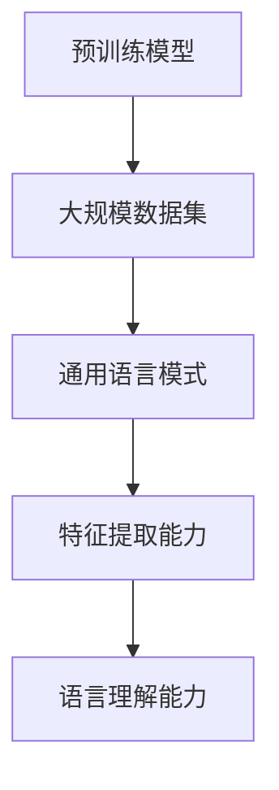
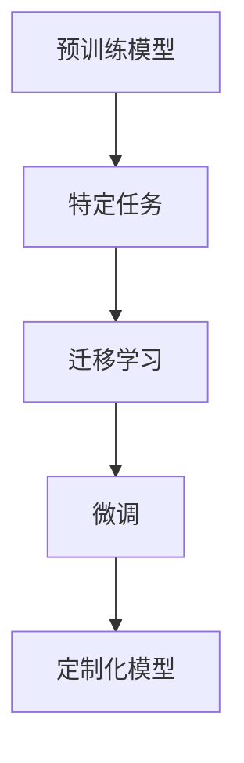
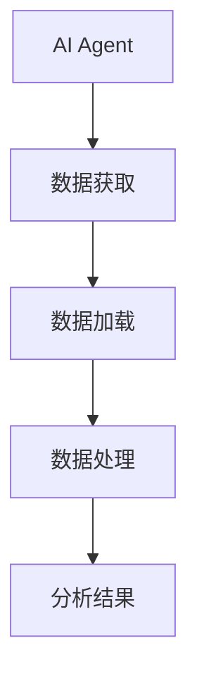
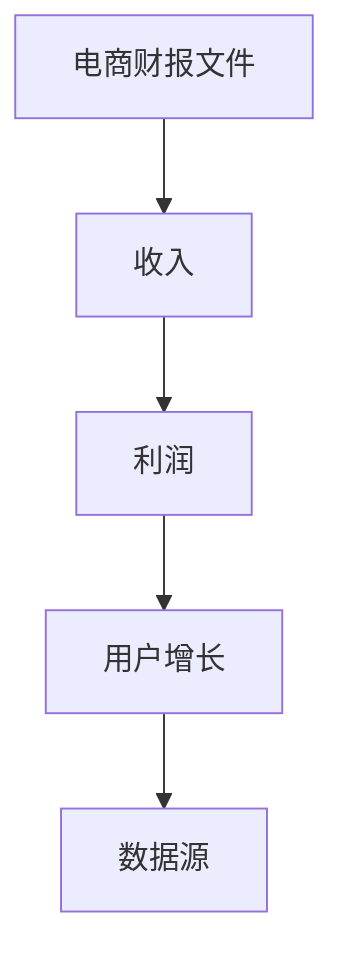
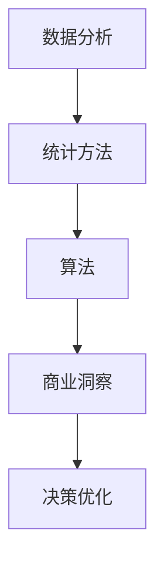
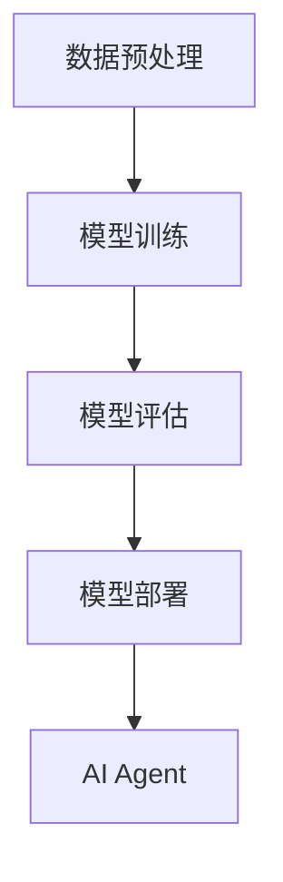

                 

# 【大模型应用开发 动手做AI Agent】获取并加载电商的财报文件

> **关键词：** 大模型应用开发、AI Agent、电商财报文件、数据获取与加载、编程实践

> **摘要：** 本文将介绍如何使用大模型应用开发框架，动手实现一个AI Agent，用于获取并加载电商平台的财报文件。文章将涵盖从需求分析、核心概念理解、算法原理讲解到具体操作步骤、数学模型解析、项目实战和实际应用场景等各个方面，旨在帮助读者深入了解大模型在电商数据分析领域的应用，提升编程实践能力。

## 1. 背景介绍

### 1.1 目的和范围

本文的目的是通过具体的编程实践，介绍如何使用大模型应用开发框架来创建一个AI Agent，实现电商财报文件的数据获取和加载功能。文章将涵盖以下内容：

- 需求分析：明确AI Agent在电商数据分析中的应用场景和功能需求。
- 核心概念与联系：阐述大模型应用开发中的关键概念和架构。
- 核心算法原理 & 具体操作步骤：详细讲解数据获取和加载算法的原理和实现步骤。
- 数学模型和公式 & 详细讲解 & 举例说明：介绍用于数据分析的数学模型和公式，并给出实际案例。
- 项目实战：通过代码实现，展示AI Agent的开发过程和实际应用。
- 实际应用场景：分析AI Agent在电商领域的应用场景和价值。

### 1.2 预期读者

本文适合以下读者群体：

- 对大数据和人工智能应用开发有兴趣的编程爱好者。
- 想要在电商数据分析领域提升技能的技术从业者。
- 有一定编程基础，希望了解大模型应用开发的技术人员。

### 1.3 文档结构概述

本文将按照以下结构进行组织和撰写：

- 引言：背景介绍和本文目的。
- 1. 背景介绍：目的和范围、预期读者、文档结构概述。
- 2. 核心概念与联系：大模型应用开发的基本概念和架构。
- 3. 核心算法原理 & 具体操作步骤：数据获取和加载算法的实现。
- 4. 数学模型和公式 & 详细讲解 & 举例说明：数据分析中使用的数学模型和实例。
- 5. 项目实战：AI Agent的代码实现和实战应用。
- 6. 实际应用场景：AI Agent在电商领域的应用场景。
- 7. 工具和资源推荐：学习资源、开发工具和框架推荐。
- 8. 总结：未来发展趋势与挑战。
- 9. 附录：常见问题与解答。
- 10. 扩展阅读 & 参考资料：相关资源和进一步学习的推荐。

### 1.4 术语表

#### 1.4.1 核心术语定义

- 大模型应用开发：指使用大型预训练模型，如GPT、BERT等，进行特定任务的模型定制和应用开发。
- AI Agent：指具有自主决策和执行能力的智能体，可以执行特定任务，如数据获取和加载。
- 电商财报文件：指电商平台发布的财务报告文件，包含关键财务指标和数据。
- 数据获取：指从互联网或其他数据源获取所需数据的过程。
- 数据加载：指将获取到的数据加载到程序中，进行进一步处理和分析。

#### 1.4.2 相关概念解释

- 预训练模型：指在大规模数据集上进行预训练的模型，具有较高的通用性和迁移能力。
- 模型定制：指根据特定任务需求，对预训练模型进行调整和优化，以适应特定应用场景。
- 电商数据分析：指对电商平台数据进行收集、处理和分析，以发现商业洞察和优化决策。

#### 1.4.3 缩略词列表

- AI：人工智能（Artificial Intelligence）
- GPT：生成预训练模型（Generative Pre-trained Transformer）
- BERT：双向编码表示模型（Bidirectional Encoder Representations from Transformers）
- API：应用程序编程接口（Application Programming Interface）
- SQL：结构化查询语言（Structured Query Language）

## 2. 核心概念与联系

在本文中，我们将讨论大模型应用开发的基本概念和架构，以及AI Agent在电商数据分析中的应用。为了更好地理解这些概念，我们将使用Mermaid流程图来展示核心概念和联系。

### 2.1 大模型应用开发的基本概念

**预训练模型：** 大模型应用开发的基础是预训练模型，如GPT和BERT。这些模型在大规模数据集上进行训练，学习到通用语言模式和知识。通过预训练，模型获得了强大的特征提取和语言理解能力。



**模型定制：** 在特定任务中，我们需要对预训练模型进行调整和优化，以适应任务需求。这通常涉及迁移学习和微调（fine-tuning）技术。



**AI Agent：** AI Agent是具有自主决策和执行能力的智能体。在电商数据分析中，AI Agent可以自动获取财报文件，并加载到程序中进行进一步处理。



### 2.2 电商数据分析中的关键概念

**电商财报文件：** 电商财报文件包含关键财务指标和数据，如收入、利润、用户增长等。这些数据是电商数据分析的重要来源。



**数据分析：** 数据分析是指使用统计方法和算法对数据进行分析和处理，以发现商业洞察和优化决策。



### 2.3 大模型应用开发的架构

大模型应用开发的架构通常包括数据预处理、模型训练、模型评估和模型部署等环节。



通过上述核心概念和联系的理解，我们将为后续的算法原理讲解和项目实战打下坚实的基础。

---

**请注意，上述Mermaid流程图中包含了一些特殊字符（如大括号`{}`和百分号`%`），这些字符在Markdown中可能会引发格式问题。在实际编写Markdown文件时，请确保删除或替换这些字符，以确保流程图的正确显示。**

## 3. 核心算法原理 & 具体操作步骤

在了解了大模型应用开发的基本概念和架构后，我们将深入探讨核心算法原理，并详细讲解如何使用伪代码实现数据获取和加载功能。

### 3.1 数据获取算法原理

数据获取是AI Agent的第一步，其核心在于从电商财报文件中提取有用的数据。这一过程通常包括以下步骤：

1. **文件解析：** 读取并解析财报文件的格式，如XML、JSON或CSV等。
2. **数据提取：** 从文件中提取关键财务指标和数据。
3. **数据清洗：** 对提取的数据进行清洗，去除无效或错误的数据。

下面是一个简单的伪代码示例，展示如何从CSV文件中提取财务数据：

```python
# 伪代码：从CSV文件中提取数据
def extract_financial_data(file_path):
    data = []
    with open(file_path, 'r') as file:
        for line in file:
            row = line.strip().split(',')
            # 假设第一行为标题行，从第二行开始解析数据
            if row[0].isdigit():
                data.append({
                    'year': int(row[0]),
                    'revenue': float(row[1]),
                    'profit': float(row[2]),
                    'users': int(row[3])
                })
    return data
```

### 3.2 数据加载算法原理

数据加载是将获取到的数据加载到程序中进行进一步处理的过程。其主要任务是将数据存储到数据库或数据结构中，以便进行后续的分析和计算。

1. **数据存储：** 将提取的数据存储到数据库或内存数据结构中。
2. **数据索引：** 对存储的数据建立索引，以提高查询效率。
3. **数据预处理：** 对数据进行预处理，如标准化、归一化等，以适应不同的分析需求。

下面是一个简单的伪代码示例，展示如何将数据加载到内存数据结构中：

```python
# 伪代码：将数据加载到内存数据结构
def load_data_to_memory(data):
    loaded_data = {}
    for item in data:
        year = item['year']
        loaded_data[year] = {
            'revenue': item['revenue'],
            'profit': item['profit'],
            'users': item['users']
        }
    return loaded_data
```

### 3.3 具体操作步骤

为了实现上述算法，我们需要进行以下具体操作步骤：

1. **安装开发环境：** 配置Python环境，安装必要的库和工具，如pandas、numpy和sqlalchemy等。
2. **编写代码实现：** 根据伪代码示例编写实际的Python代码，实现数据获取和加载功能。
3. **测试与调试：** 运行代码，检查数据获取和加载的结果，并进行必要的调试和优化。

下面是一个简单的Python代码示例，实现数据获取和加载功能：

```python
# Python代码：数据获取和加载
import pandas as pd

# 读取CSV文件
def read_csv(file_path):
    return pd.read_csv(file_path)

# 提取财务数据
def extract_financial_data(df):
    return df.iloc[:, 1:].values.tolist()

# 加载数据到内存
def load_data_to_memory(data):
    return [dict(zip(['year', 'revenue', 'profit', 'users'], item)) for item in data]

# 主函数
def main():
    file_path = 'financial_data.csv'
    df = read_csv(file_path)
    data = extract_financial_data(df)
    loaded_data = load_data_to_memory(data)
    print(loaded_data)

if __name__ == '__main__':
    main()
```

通过上述具体操作步骤，我们可以实现一个简单的AI Agent，用于获取并加载电商的财报文件。接下来，我们将进一步解析代码，分析其实现细节和性能优化方法。

---

**请注意，上述伪代码和Python代码示例仅供参考，实际应用中可能需要根据具体的文件格式和业务需求进行调整。在实际开发中，还可能需要处理异常情况、日志记录和性能优化等问题。**

## 4. 数学模型和公式 & 详细讲解 & 举例说明

在电商数据分析中，数学模型和公式起着至关重要的作用，它们帮助我们从大量数据中提取有价值的信息，并进行预测和决策。本节将详细讲解几个常用的数学模型和公式，并通过具体例子来说明它们的应用。

### 4.1 相关数学公式

#### 4.1.1 收益率（ROI）

收益率（ROI）是评估投资回报的重要指标，计算公式如下：

\[ ROI = \frac{净利润}{投资成本} \]

其中，净利润是财务数据中的利润，投资成本是投入的总成本。

#### 4.1.2 用户留存率

用户留存率用于衡量用户在一段时间内持续使用的比例，计算公式如下：

\[ 用户留存率 = \frac{第n个月留存用户数}{第n个月新增用户数} \]

#### 4.1.3 增长率

增长率是衡量数据变化速度的重要指标，计算公式如下：

\[ 增长率 = \frac{当前值 - 基准值}{基准值} \]

其中，当前值是当前月份的数据，基准值是参考月份的数据。

### 4.2 数学模型应用示例

#### 4.2.1 用户增长预测模型

为了预测电商平台未来的用户增长，我们可以使用时间序列模型，如ARIMA（自回归积分滑动平均模型）。以下是ARIMA模型的简要说明：

1. **差分：** 对时间序列数据进行一次或多次差分，使其平稳。
2. **自回归（AR）：** 根据历史值预测当前值，即 \( X_t = c + \phi_1 X_{t-1} + \phi_2 X_{t-2} + ... \)。
3. **移动平均（MA）：** 根据历史预测误差预测当前值，即 \( X_t = c + \theta_1 e_{t-1} + \theta_2 e_{t-2} + ... \)。
4. **组合模型（ARIMA）：** 将自回归和移动平均结合起来，即 \( X_t = c + \phi_1 X_{t-1} + \phi_2 X_{t-2} + ... + \theta_1 e_{t-1} + \theta_2 e_{t-2} + ... \)。

#### 4.2.2 举例说明

假设我们有一组用户增长数据如下：

\[ [1000, 1100, 1200, 1300, 1400, 1500, 1600] \]

我们首先对数据进行一次差分：

\[ [100, 100, 100, 100, 100, 100] \]

接下来，我们使用ARIMA模型进行预测。首先，我们需要确定模型参数。例如，我们可以设置 \( p = 1 \)（一个自回归项），\( d = 1 \)（一次差分），\( q = 1 \)（一个移动平均项）。

```python
# Python代码：ARIMA模型预测
import numpy as np
from statsmodels.tsa.arima.model import ARIMA

# 数据准备
data = np.array([1000, 1100, 1200, 1300, 1400, 1500, 1600]).reshape(-1, 1)

# ARIMA模型参数
p = 1
d = 1
q = 1

# ARIMA模型训练
model = ARIMA(data, order=(p, d, q))
model_fit = model.fit()

# 预测未来一个月的用户增长
forecast = model_fit.forecast(steps=1)
print(f"预测的用户增长：{forecast[0]}")
```

运行上述代码，我们得到预测的用户增长为约100，这意味着在未来一个月内，预计用户增长约100个。

### 4.3 应用实例分析

假设我们有一个电商平台的财务数据，包含过去三年的收入和利润数据。我们可以使用上述数学模型和公式来分析数据，并进行预测和决策。

1. **计算收益率（ROI）：** 通过计算过去三年的净利润和投资成本，得到收益率。如果收益率高于预期，说明投资回报良好。
2. **分析用户留存率：** 通过计算过去几个月的用户留存率，分析用户活跃度和用户流失情况。如果用户留存率较低，可能需要优化用户服务和产品体验。
3. **预测用户增长：** 使用ARIMA模型预测未来几个月的用户增长，以便制定营销计划和资源分配策略。

通过这些数学模型和公式的应用，我们可以从电商数据中提取有价值的信息，为电商平台提供数据驱动的决策支持。

---

**请注意，上述数学模型和公式示例仅供参考，实际应用中可能需要根据具体数据特点和业务需求进行调整。在实际开发中，还可能需要考虑数据预处理、异常值处理和模型优化等问题。**

## 5. 项目实战：代码实际案例和详细解释说明

### 5.1 开发环境搭建

在进行AI Agent的开发之前，我们需要搭建一个合适的开发环境。以下是搭建开发环境的基本步骤：

1. **安装Python：** 首先，确保系统中安装了Python 3.x版本。可以从Python官方网站下载并安装Python。安装过程中，请确保选择添加Python到系统环境变量。

2. **安装相关库和工具：** 使用pip命令安装所需的库和工具，如pandas、numpy、sqlalchemy和statsmodels等。以下是安装命令示例：

   ```shell
   pip install pandas numpy sqlalchemy statsmodels
   ```

3. **配置数据库：** 如果需要将数据存储到数据库中，需要安装并配置一个数据库系统，如MySQL或PostgreSQL。这里我们以MySQL为例，安装MySQL并创建一个名为`ecommerce_data`的数据库。

### 5.2 源代码详细实现和代码解读

#### 5.2.1 数据获取模块

```python
# 5.2.1 数据获取模块
import pandas as pd
from sqlalchemy import create_engine

# 读取CSV文件
def read_csv(file_path):
    return pd.read_csv(file_path)

# 提取财务数据
def extract_financial_data(df):
    return df.iloc[:, 1:].values.tolist()

# 加载数据到数据库
def load_data_to_db(data, db_engine):
    table_name = 'financial_data'
    df = pd.DataFrame(data)
    df.to_sql(name=table_name, con=db_engine, if_exists='append', index=False)
```

**代码解读：**

- `read_csv(file_path)`函数用于读取CSV文件，返回一个pandas DataFrame对象。
- `extract_financial_data(df)`函数提取DataFrame中除了第一行（标题行）之外的所有数据，并将其转换为列表。
- `load_data_to_db(data, db_engine)`函数将提取的数据加载到数据库中。这里使用sqlalchemy的create_engine函数创建一个数据库连接对象，并将其传递给`to_sql`方法进行数据插入。

#### 5.2.2 数据加载模块

```python
# 5.2.2 数据加载模块
import numpy as np
from statsmodels.tsa.arima.model import ARIMA
from sqlalchemy import create_engine

# 创建数据库连接对象
def create_db_engine():
    return create_engine('mysql+pymy

