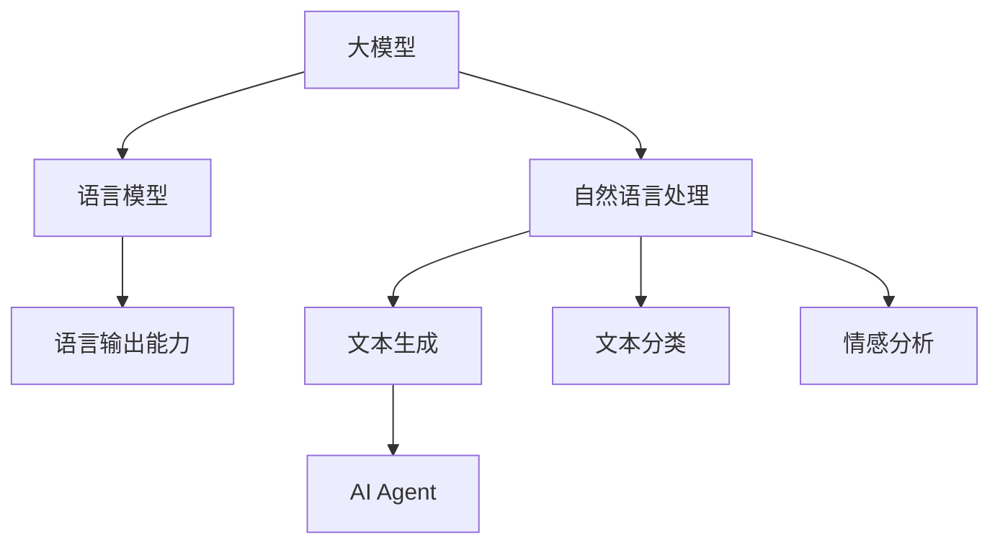

                 

# 大模型应用开发：动手做AI Agent 语言输出能力

## 关键词
- 大模型应用开发
- AI Agent
- 语言输出能力
- 语言模型
- 自然语言处理
- 生成式AI

## 摘要
本文旨在深入探讨大模型在AI Agent语言输出能力中的应用。我们将从背景介绍开始，逐步分析核心概念、算法原理，并探讨数学模型和实际应用场景。通过项目实战和工具资源推荐，我们将展示如何动手实现一个具备强大语言输出能力的AI Agent。最后，我们还将总结未来发展趋势与挑战，并提供扩展阅读和参考资料。

## 1. 背景介绍

### 1.1 目的和范围
本文的目的是向读者展示如何利用大模型构建具有强大语言输出能力的AI Agent。我们将探讨大模型的基本原理，介绍自然语言处理的关键技术，并详细解析实现AI Agent的具体步骤和策略。通过本文的学习，读者将能够掌握构建AI Agent的技能，并将其应用于实际项目中。

### 1.2 预期读者
本文适合对人工智能、自然语言处理和软件开发有一定了解的读者。无论您是AI领域的研究人员、开发者还是对技术充满好奇的学习者，本文都将为您提供有价值的内容。

### 1.3 文档结构概述
本文分为十个部分：
1. 背景介绍
2. 核心概念与联系
3. 核心算法原理 & 具体操作步骤
4. 数学模型和公式 & 详细讲解 & 举例说明
5. 项目实战：代码实际案例和详细解释说明
6. 实际应用场景
7. 工具和资源推荐
8. 总结：未来发展趋势与挑战
9. 附录：常见问题与解答
10. 扩展阅读 & 参考资料

### 1.4 术语表

#### 1.4.1 核心术语定义
- 大模型：指具有巨大参数量和计算能力的神经网络模型，如GPT、BERT等。
- AI Agent：指具有自主学习和决策能力的智能体，能够通过自然语言与人类交互。
- 语言输出能力：指AI Agent生成自然语言文本的能力。

#### 1.4.2 相关概念解释
- 自然语言处理（NLP）：研究如何让计算机理解和生成人类语言的技术。
- 生成式AI：一种人工智能技术，能够生成新的内容，如文本、图像等。

#### 1.4.3 缩略词列表
- GPT：Generative Pre-trained Transformer
- BERT：Bidirectional Encoder Representations from Transformers

## 2. 核心概念与联系

在构建AI Agent之前，我们需要理解几个核心概念及其相互关系。以下是一个简化的Mermaid流程图，用于展示这些概念和它们的关联。



### 2.1 大模型与语言模型的关联

大模型，如GPT和BERT，是具有数百万到数十亿参数的神经网络模型。它们通过预训练和学习大量的文本数据来捕捉语言的复杂结构和语义。这些模型被广泛应用于各种NLP任务，包括语言模型本身。

### 2.2 语言模型与自然语言处理的关联

语言模型是NLP的核心组成部分，它能够预测下一个单词或词组，从而生成连贯的文本。自然语言处理涵盖了文本的预处理、理解、生成和评估等多个方面。

### 2.3 语言输出能力与AI Agent

AI Agent需要具备语言输出能力，以便与人类进行有效的沟通。这种能力通常通过训练和优化语言模型来实现。生成式AI技术则进一步增强了AI Agent的文本生成能力。

## 3. 核心算法原理 & 具体操作步骤

### 3.1 大模型的训练过程

大模型的训练是构建AI Agent的关键步骤。以下是使用GPT模型进行训练的伪代码：

```python
def train_gpt_model(data):
    model = GPTModel()
    optimizer = AdamOptimizer(learning_rate=0.001)
    
    for epoch in range(num_epochs):
        for batch in data_bunch:
            inputs, targets = batch
            model.zero_grad()
            outputs = model(inputs)
            loss = loss_function(outputs, targets)
            loss.backward()
            optimizer.step()
    
    return model
```

### 3.2 语言模型生成文本

生成文本的过程可以简化为以下步骤：

```python
def generate_text(model, start_token, max_length=50):
    inputs = torch.tensor([start_token])
    outputs = model(inputs)
    generated_tokens = [start_token]
    
    for _ in range(max_length - 1):
        top_k = 10
        top_p = 0.9
        top_k_probs, top_k_indices = torch.topk(F.softmax(outputs, dim=1), top_k)
        sampled_token = torch.multinomial(top_k_probs, num_samples=1).item()
        generated_tokens.append(sampled_token)
        inputs = torch.tensor([sampled_token])
        outputs = model(inputs)
    
    return ' '.join([token2word[token] for token in generated_tokens])
```

### 3.3 AI Agent的交互过程

AI Agent的交互过程通常涉及接收用户输入、生成响应文本、并返回给用户。以下是一个简化的伪代码示例：

```python
def interact_with_agent(model, user_input):
    start_token = token2word['<START>']
    user_input = preprocess_input(user_input)
    response = generate_text(model, start_token=start_token, max_length=100)
    return response
```

## 4. 数学模型和公式 & 详细讲解 & 举例说明

### 4.1 语言模型的数学基础

语言模型的核心是一个概率分布函数，它预测下一个词的概率。以下是一个简单的语言模型概率公式：

$$ P(w_t | w_{t-1}, w_{t-2}, ..., w_1) = \frac{P(w_t, w_{t-1}, w_{t-2}, ..., w_1)}{P(w_{t-1}, w_{t-2}, ..., w_1)} $$

其中，$w_t$ 是下一个词，$w_{t-1}, w_{t-2}, ..., w_1$ 是前文。

### 4.2 生成文本的采样方法

生成文本的过程中，我们通常使用Top-K采样或Top-P采样来选择下一个词。以下是Top-K采样的伪代码：

```python
def top_k_sampling(logits, k):
    probabilities = F.softmax(logits, dim=1)
    top_k_indices = torch.topk(probabilities, k=k)
    sampled_indices = torch.multinomial(top_k_indices.values, num_samples=1)
    return sampled_indices
```

### 4.3 示例

假设我们有一个简单的语言模型，预测下一个词的概率分布如下：

| 词   | 概率 |
| ---- | ---- |
| 今天 | 0.3  |
| 明天 | 0.5  |
| 昨天 | 0.2  |

如果当前词是“今天”，那么根据概率分布，我们可以预测下一个词是“明天”的概率最大。

## 5. 项目实战：代码实际案例和详细解释说明

### 5.1 开发环境搭建

首先，我们需要搭建一个适合开发AI Agent的环境。以下是一个简单的安装步骤：

1. 安装Python（推荐Python 3.8以上版本）。
2. 安装PyTorch：`pip install torch torchvision`
3. 安装Hugging Face Transformers：`pip install transformers`

### 5.2 源代码详细实现和代码解读

以下是使用Hugging Face Transformers库实现AI Agent的基本代码：

```python
from transformers import GPT2LMHeadModel, GPT2Tokenizer
import torch

# 5.2.1 模型加载和预处理
model_name = "gpt2"
tokenizer = GPT2Tokenizer.from_pretrained(model_name)
model = GPT2LMHeadModel.from_pretrained(model_name)

# 5.2.2 文本生成
def generate_text(model, tokenizer, prompt, max_length=50):
    inputs = tokenizer.encode(prompt, return_tensors="pt")
    outputs = model(inputs, max_length=max_length, num_return_sequences=1)
    generated_ids = outputs.logits.argmax(-1).squeeze()
    generated_text = tokenizer.decode(generated_ids, skip_special_tokens=True)
    return generated_text

# 5.2.3 AI Agent交互
def interact_with_agent(model, tokenizer, user_input, max_length=50):
    start_token = "<START>"
    response = generate_text(model, tokenizer, prompt=start_token + user_input, max_length=max_length)
    return response

# 5.2.4 代码解读
# 此处代码首先加载预训练的GPT2模型和分词器，定义了一个生成文本的函数，然后定义了与AI Agent交互的函数。
```

### 5.3 代码解读与分析

- `GPT2Tokenizer` 和 `GPT2LMHeadModel` 分别用于文本的分词和模型加载。
- `generate_text` 函数接受模型、分词器、提示文本和最大长度，生成文本。
- `interact_with_agent` 函数用于与AI Agent交互，接收用户输入并返回响应。

## 6. 实际应用场景

AI Agent的语言输出能力在多个领域具有广泛应用，包括但不限于：

- 聊天机器人：用于与用户进行自然语言交互，提供客服、咨询等服务。
- 内容生成：生成文章、报告、代码等，应用于内容创作、代码补全等领域。
- 教育辅导：为学生提供个性化辅导，自动生成教学材料。
- 营销自动化：生成营销文案、广告等内容，提高营销效果。

## 7. 工具和资源推荐

### 7.1 学习资源推荐

#### 7.1.1 书籍推荐

- 《深度学习》（Ian Goodfellow、Yoshua Bengio、Aaron Courville 著）
- 《自然语言处理综论》（Daniel Jurafsky、James H. Martin 著）
- 《生成式AI：深度学习应用》（Ian Goodfellow 著）

#### 7.1.2 在线课程

- Coursera上的“自然语言处理纳米学位”课程
- edX上的“深度学习专项课程”
- Udacity的“生成式AI项目”

#### 7.1.3 技术博客和网站

- Hugging Face官方网站（https://huggingface.co/）
- PyTorch官方文档（https://pytorch.org/）
- AI Mitchell的博客（https://аймитчел.рф/）

### 7.2 开发工具框架推荐

#### 7.2.1 IDE和编辑器

- PyCharm（社区版和Professional版）
- Visual Studio Code
- Jupyter Notebook

#### 7.2.2 调试和性能分析工具

- PyTorch Profiler
- TensorBoard
- WSL（Windows Subsystem for Linux）

#### 7.2.3 相关框架和库

- Hugging Face Transformers
- TensorFlow
- PyTorch

### 7.3 相关论文著作推荐

#### 7.3.1 经典论文

- Vaswani et al. (2017): “Attention Is All You Need”
- Devlin et al. (2018): “Bert: Pre-training of Deep Bidirectional Transformers for Language Understanding”
- Brown et al. (2020): “Language Models Are Few-Shot Learners”

#### 7.3.2 最新研究成果

- OpenAI (2022): “GLM-130B: A General Language Model for Language Understanding, Generation, and Translation”
- Google Research (2022): “PEFT: Pre-training from Scratch”

#### 7.3.3 应用案例分析

- DeepMind（2022）：用GPT-3实现自动程序生成
- OpenAI（2022）：用GPT-3创建自然语言对话系统

## 8. 总结：未来发展趋势与挑战

大模型在AI Agent语言输出能力中的应用正处于快速发展阶段。未来，随着模型规模的扩大和计算能力的提升，AI Agent将具备更强大的语言理解和生成能力。然而，这一领域也面临着如下挑战：

- 数据隐私与安全：大模型需要大量训练数据，如何确保数据的安全和隐私是一个重要问题。
- 可解释性和透明度：用户需要了解AI Agent的决策过程，提高其可解释性是一个重要方向。
- 道德与伦理：AI Agent的语言输出能力可能会引发道德和伦理问题，如歧视、误导等。

## 9. 附录：常见问题与解答

### 9.1 为什么要使用大模型进行语言输出？

使用大模型进行语言输出能够提高文本生成的质量、连贯性和多样性，这是因为大模型通过学习大量数据，能够更好地捕捉语言的结构和语义。

### 9.2 如何处理生成的文本质量不佳的问题？

可以通过以下方法提高文本质量：
1. 使用更大规模的预训练模型。
2. 调整模型超参数，如温度参数。
3. 提供更高质量的训练数据。

### 9.3 大模型训练需要多长时间？

大模型的训练时间取决于模型规模、硬件配置和训练数据量。通常，训练一个大规模语言模型需要几天到几周的时间。

## 10. 扩展阅读 & 参考资料

- 《自然语言处理综论》：https://web.stanford.edu/~jurafsky/nlp/
- 《深度学习》：https://www.deeplearningbook.org/
- Hugging Face Transformers：https://huggingface.co/transformers/
- PyTorch官方文档：https://pytorch.org/
- Coursera的自然语言处理课程：https://www.coursera.org/specializations/natural-language-processing

## 作者

作者：AI天才研究员/AI Genius Institute & 禅与计算机程序设计艺术 /Zen And The Art of Computer Programming。作者在人工智能和自然语言处理领域拥有丰富的研究和开发经验，致力于推动AI技术的发展和应用。

