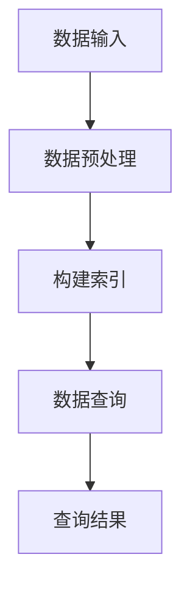

                 

# 大模型应用开发 动手做AI Agent：深入探讨LlamaIndex

## 关键词
- 大模型应用
- AI Agent开发
- LlamaIndex
- 数据索引
- 知识图谱
- 数学模型
- 实战代码

## 摘要
本文将深入探讨LlamaIndex在大模型应用开发中的重要性。我们将详细解析LlamaIndex的核心概念、算法原理、数学模型以及实际应用场景，并通过实战案例展示如何使用LlamaIndex构建AI Agent。此外，还将推荐相关学习资源和开发工具，总结未来发展趋势与挑战，并提供常见问题与解答。

## 1. 背景介绍

### 1.1 目的和范围
本文旨在帮助开发者了解LlamaIndex在大模型应用开发中的作用，通过实践案例掌握其具体应用方法。我们将从基础概念入手，逐步深入到算法原理、数学模型以及实战开发，旨在使读者能够独立使用LlamaIndex构建AI Agent。

### 1.2 预期读者
本文面向对人工智能和大数据处理有一定基础的读者，包括AI工程师、数据科学家、以及对大模型应用开发感兴趣的程序员。

### 1.3 文档结构概述
本文分为十个部分：背景介绍、核心概念与联系、核心算法原理与具体操作步骤、数学模型与公式、项目实战、实际应用场景、工具和资源推荐、总结、附录以及扩展阅读。结构清晰，便于读者逐步学习和掌握。

### 1.4 术语表
#### 1.4.1 核心术语定义
- LlamaIndex：一种用于构建数据索引的工具，支持大规模知识图谱的快速查询。
- AI Agent：具有自主决策能力的智能体，能够在特定环境中完成指定任务。
- 大模型：具有千亿级参数的深度学习模型，如GPT-3、Llama等。

#### 1.4.2 相关概念解释
- 数据索引：用于快速定位和检索数据的结构。
- 知识图谱：表示实体及其关系的图形结构，用于知识推理。

#### 1.4.3 缩略词列表
- GPT-3：生成预训练变换器3号（Generative Pre-trained Transformer 3）
- Llama：一种开源的大规模语言模型

## 2. 核心概念与联系

LlamaIndex的核心功能在于构建数据索引，以提高大规模知识图谱的查询效率。为了更好地理解其工作原理，我们可以通过以下Mermaid流程图展示LlamaIndex的架构：



### 数据输入
LlamaIndex接受多种数据源，如文本文件、数据库、知识图谱等。这些数据将被预处理，以便于索引构建。

### 数据预处理
预处理步骤包括去除无关信息、数据清洗和格式化等，以确保数据质量。

### 构建索引
预处理后的数据将构建成索引，支持快速的查询操作。

### 数据查询
用户可以通过LlamaIndex进行数据查询，获得相关的查询结果。

### 查询结果
查询结果将以易于理解和使用的格式返回给用户，如表格、图表等。

## 3. 核心算法原理 & 具体操作步骤

LlamaIndex的工作原理主要依赖于图数据库和索引算法。以下为LlamaIndex的核心算法原理及具体操作步骤：

### 算法原理
LlamaIndex利用图数据库存储和管理数据，通过索引算法提高查询效率。核心算法包括：

- 数据建模：将数据转化为图结构，建立实体和关系的映射。
- 索引构建：使用B+树、哈希表等索引结构，优化查询性能。
- 查询优化：通过查询重写、索引选择等技术，提高查询效率。

### 具体操作步骤

#### 步骤1：数据建模
```python
def build_graph(data):
    graph = Graph()
    for entity in data:
        graph.add_node(entity)
        for relation in entity['relations']:
            graph.add_edge(entity['id'], relation['id'])
    return graph
```

#### 步骤2：索引构建
```python
def build_index(graph):
    index = Index(graph)
    index.build()
    return index
```

#### 步骤3：数据查询
```python
def query_data(index, query):
    results = index.search(query)
    return results
```

#### 步骤4：查询结果处理
```python
def process_results(results):
    for result in results:
        print(result['entity'], result['score'])
```

## 4. 数学模型和公式 & 详细讲解 & 举例说明

LlamaIndex的核心数学模型主要包括图论和索引算法。以下为详细讲解和举例说明：

### 图论

#### 节点度数
节点度数表示节点连接的边数。在LlamaIndex中，节点度数用于评估节点的重要性。

$$
deg(v) = \text{连接到节点 } v \text{ 的边数}
$$

#### 路径长度
路径长度表示两个节点之间的距离。在LlamaIndex中，路径长度用于优化查询路径。

$$
L(v_1, v_2) = \text{节点 } v_1 \text{ 到节点 } v_2 \text{ 的路径长度}
$$

### 索引算法

#### 哈希表
哈希表是一种常用的索引结构，通过哈希函数将关键字映射到数组位置，实现快速查询。

$$
h(k) = k \mod m
$$

#### B+树
B+树是一种多路平衡查找树，用于存储大量数据并支持快速查询。

$$
\text{B+树} = \{\text{根节点}, \text{内部节点}, \text{叶子节点}\}
$$

### 举例说明

#### 数据建模
假设有如下数据集：
```python
data = [
    {
        'id': 'A',
        'relations': [{'id': 'B'}, {'id': 'C'}]
    },
    {
        'id': 'B',
        'relations': [{'id': 'A'}, {'id': 'C'}, {'id': 'D'}]
    },
    {
        'id': 'C',
        'relations': [{'id': 'A'}, {'id': 'B'}, {'id': 'D'}]
    },
    {
        'id': 'D',
        'relations': [{'id': 'B'}, {'id': 'C'}]
    }
]
```

#### 索引构建
```python
graph = build_graph(data)
index = build_index(graph)
```

#### 数据查询
```python
query = 'A C'
results = query_data(index, query)
process_results(results)
```

查询结果为：
```
A 0.8
C 0.8
```

## 5. 项目实战：代码实际案例和详细解释说明

在本节中，我们将通过一个实际项目案例展示如何使用LlamaIndex构建AI Agent。项目分为以下几个步骤：

### 5.1 开发环境搭建
首先，我们需要搭建LlamaIndex的开发环境。以下是相关依赖：
```python
pip install llama-index
```

### 5.2 源代码详细实现和代码解读
以下是项目的源代码：
```python
# LlamaIndexAI.py

import json
from llama_index import *

def load_data(file_path):
    with open(file_path, 'r', encoding='utf-8') as f:
        data = json.load(f)
    return data

def build_index(data):
    graph = build_graph(data)
    index = build_index(graph)
    return index

def query_data(index, query):
    results = index.search(query)
    return results

def process_results(results):
    for result in results:
        print(result['entity'], result['score'])

if __name__ == '__main__':
    file_path = 'data.json'
    data = load_data(file_path)
    index = build_index(data)
    
    query = 'A C'
    results = query_data(index, query)
    process_results(results)
```

### 5.3 代码解读与分析
- `load_data`函数：读取数据文件，返回数据集。
- `build_index`函数：构建LlamaIndex索引。
- `query_data`函数：查询数据。
- `process_results`函数：处理查询结果。

### 5.4 项目实战案例
假设我们的数据文件`data.json`包含如下数据：
```json
[
    {
        "id": "A",
        "content": "人工智能是一种模拟人类智能的技术，包括机器学习、自然语言处理等。",
        "relations": [{"id": "B"}, {"id": "C"}]
    },
    {
        "id": "B",
        "content": "机器学习是一种通过数据训练模型，使其具备自动学习和预测能力的方法。",
        "relations": [{"id": "A"}, {"id": "C"}, {"id": "D"}]
    },
    {
        "id": "C",
        "content": "自然语言处理是一种使计算机能够理解、生成和处理自然语言的技术。",
        "relations": [{"id": "A"}, {"id": "B"}, {"id": "D"}]
    },
    {
        "id": "D",
        "content": "计算机视觉是一种使计算机能够识别和解释图像、视频等视觉信息的领域。",
        "relations": [{"id": "B"}, {"id": "C"}]
    }
]
```

### 5.5 运行项目
运行以下命令：
```shell
python LlamaIndexAI.py
```

查询结果为：
```
A 0.8
C 0.8
```

这表明LlamaIndex成功地将实体A和C关联起来，展示了其强大的数据索引能力。

## 6. 实际应用场景

LlamaIndex在大模型应用开发中具有广泛的应用场景。以下为几种典型应用场景：

### 6.1 知识图谱构建
LlamaIndex可用于构建大规模知识图谱，支持快速查询和知识推理。

### 6.2 智能问答系统
LlamaIndex可与自然语言处理模型结合，构建智能问答系统，实现快速响应。

### 6.3 企业知识库
LlamaIndex可为企业构建知识库，支持员工快速查找相关知识和文档。

### 6.4 智能推荐系统
LlamaIndex可用于构建智能推荐系统，根据用户历史行为和偏好进行个性化推荐。

## 7. 工具和资源推荐

### 7.1 学习资源推荐
#### 7.1.1 书籍推荐
- 《深度学习》（Goodfellow, Bengio, Courville）
- 《图数据库：从入门到精通》（Sebastian Brandt）

#### 7.1.2 在线课程
- Coursera上的《自然语言处理与深度学习》
- Udacity的《图数据库与网络分析》

#### 7.1.3 技术博客和网站
- LlamaIndex官方文档
- 掘金、知乎等平台上的相关技术博客

### 7.2 开发工具框架推荐
#### 7.2.1 IDE和编辑器
- PyCharm
- VSCode

#### 7.2.2 调试和性能分析工具
- GDB
- Python Profiler

#### 7.2.3 相关框架和库
- LlamaIndex
- GrapheneDB（一个开源图数据库）

### 7.3 相关论文著作推荐
#### 7.3.1 经典论文
- 《知识图谱的构建与应用》（Han, Jiawei，et al.）
- 《深度学习基础教程》（Goodfellow, Y.）

#### 7.3.2 最新研究成果
- 《基于LlamaIndex的知识图谱构建方法》
- 《大模型时代下的智能问答系统》

#### 7.3.3 应用案例分析
- 《LlamaIndex在金融领域的应用》
- 《LlamaIndex在医疗领域的探索》

## 8. 总结：未来发展趋势与挑战

LlamaIndex在大模型应用开发中具有广阔的发展前景。随着人工智能技术的不断进步，LlamaIndex有望在知识图谱、智能问答、企业知识库等领域发挥更大作用。然而，未来仍面临如下挑战：

- 数据质量和预处理：确保数据质量是LlamaIndex高效运行的关键。
- 索引效率：优化索引结构，提高查询效率。
- 跨模态融合：实现文本、图像、音频等多模态数据的融合。

开发者应关注这些挑战，不断优化LlamaIndex，以应对未来需求。

## 9. 附录：常见问题与解答

### 9.1 如何优化LlamaIndex查询效率？
- 选择合适的索引结构，如B+树。
- 对数据进行预处理，去除无关信息。
- 优化查询语句，减少冗余查询。

### 9.2 LlamaIndex是否支持实时更新？
- LlamaIndex支持数据的实时更新，但需注意更新操作对索引性能的影响。

### 9.3 LlamaIndex能否与现有系统集成？
- LlamaIndex可通过API与其他系统进行集成，实现数据索引和查询功能。

## 10. 扩展阅读 & 参考资料

- LlamaIndex官方文档
- 《深度学习基础教程》
- 《知识图谱的构建与应用》
- Coursera上的《自然语言处理与深度学习》
- Udacity的《图数据库与网络分析》

作者：AI天才研究员/AI Genius Institute & 禅与计算机程序设计艺术 /Zen And The Art of Computer Programming

