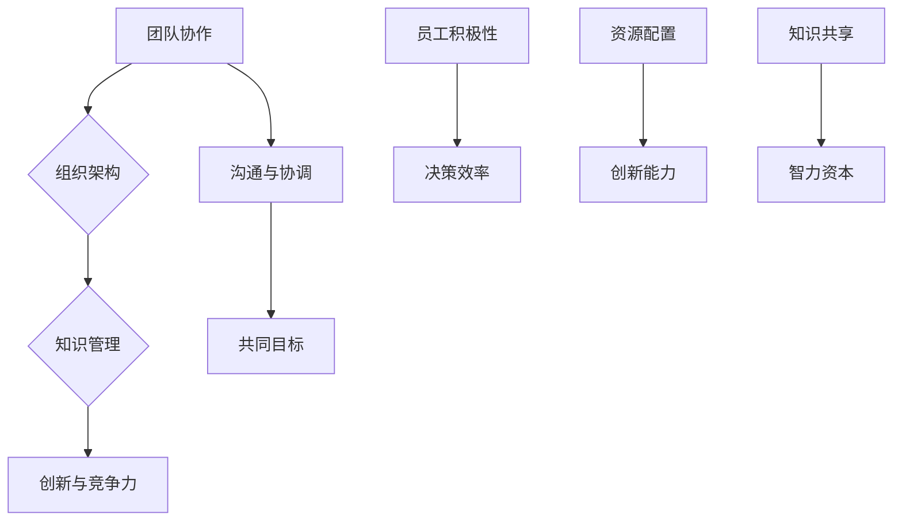

                 

# 一人公司到团队企业：平稳过渡的策略

> 关键词：企业扩张、团队管理、组织转型、人员配置、领导力发展

> 摘要：本文将探讨从一人公司向团队企业平稳过渡的策略。首先介绍一人公司的特点及其发展到团队企业的必要性。接着分析团队企业的优势和挑战，并提出具体的组织建设、人员配置、领导力培养等策略，帮助企业在扩张过程中保持稳定与高效。最后，讨论未来发展趋势与挑战，为企业持续发展提供参考。

## 1. 背景介绍

### 1.1 目的和范围

本文旨在探讨从一人公司向团队企业的过渡策略。这一过程对于许多初创公司来说至关重要，因为它关系到企业的成长与可持续发展。本文将围绕以下方面展开讨论：

1. 一人公司的特点及其发展到团队企业的必要性。
2. 团队企业的优势和挑战。
3. 平稳过渡的具体策略，包括组织建设、人员配置和领导力培养。
4. 实际应用场景和工具推荐。
5. 未来发展趋势与挑战。

### 1.2 预期读者

本文主要面向初创企业创始人、创业者以及企业管理者。如果您正在考虑企业扩张或已经进入团队建设阶段，本文将为您提供有价值的参考和指导。

### 1.3 文档结构概述

本文结构如下：

1. 引言：介绍背景和目的。
2. 背景介绍：详细说明一人公司到团队企业的转变。
3. 核心概念与联系：介绍团队企业的核心概念和架构。
4. 核心算法原理与操作步骤：阐述团队企业建设的关键算法和操作步骤。
5. 数学模型与公式：解释团队企业运作的数学模型和公式。
6. 项目实战：提供实际代码案例和详细解释。
7. 实际应用场景：探讨团队企业的应用场景。
8. 工具和资源推荐：推荐学习资源、开发工具和论文著作。
9. 总结：总结未来发展趋势与挑战。
10. 附录：常见问题与解答。
11. 扩展阅读：提供更多参考资料。

### 1.4 术语表

#### 1.4.1 核心术语定义

- **一人公司**：指由一个创始人独立运营的企业。
- **团队企业**：指由多个成员组成的、具有明确分工和协作机制的企业。
- **组织建设**：指企业为适应团队运作而进行的组织结构调整和优化。
- **人员配置**：指根据企业需求为不同岗位配备合适的人才。
- **领导力培养**：指提升企业领导者的管理和领导能力。

#### 1.4.2 相关概念解释

- **团队协作**：指团队成员为实现共同目标而进行的协同工作。
- **组织架构**：指企业内部各部门、岗位之间的组织关系和协作机制。
- **知识管理**：指企业通过获取、共享、整合和应用知识，提高整体竞争力的过程。

#### 1.4.3 缩略词列表

- **SaaS**：Software as a Service（软件即服务）
- **PaaS**：Platform as a Service（平台即服务）
- **IaaS**：Infrastructure as a Service（基础设施即服务）
- **HR**：Human Resources（人力资源）

## 2. 核心概念与联系

团队企业是一个复杂的社会系统，其核心概念和联系可以概括为以下几个方面：

### 2.1 团队协作

团队协作是团队企业的核心，它决定了企业能否高效运作。团队协作的关键在于沟通、协调和共同目标。团队成员之间需要保持密切的沟通，及时解决问题和调整工作方向。为了实现共同目标，团队成员需要相互信任、支持和鼓励。

### 2.2 组织架构

组织架构是团队企业的骨架，决定了企业的组织关系和运作效率。合理的组织架构能够优化资源配置、提高决策效率和员工积极性。常见的组织架构包括职能型、事业部型、矩阵型和网络型等。

### 2.3 知识管理

知识管理是团队企业的灵魂，它决定了企业的创新能力和竞争力。知识管理包括知识获取、共享、整合和应用等环节。企业需要建立有效的知识管理体系，鼓励员工分享知识和经验，提高整个团队的智力资本。

### 2.4 Mermaid 流程图

以下是一个简单的 Mermaid 流程图，展示了团队企业的核心概念和联系：



## 3. 核心算法原理与具体操作步骤

团队企业建设的关键在于算法原理的掌握和应用。以下是团队企业建设的核心算法原理和具体操作步骤：

### 3.1 算法原理

团队企业建设算法主要包括以下几个方面：

1. **人员配置算法**：根据企业需求为不同岗位配备合适的人才。
2. **组织架构优化算法**：通过分析企业运营数据，优化组织架构，提高效率。
3. **知识管理算法**：通过知识获取、共享、整合和应用，提高企业创新能力。
4. **团队协作算法**：通过沟通、协调和共同目标，提高团队协作效率。

### 3.2 具体操作步骤

1. **人员配置算法**：

   ```python
   def assign_employee(employees, positions):
       assigned_employees = []
       for position in positions:
           suitable_employee = select_employee(employees, position)
           assigned_employees.append(suitable_employee)
           remove_employee(employees, suitable_employee)
       return assigned_employees
   ```

   其中，`employees` 是员工列表，`positions` 是岗位列表。`select_employee` 函数用于选择符合岗位要求的员工，`remove_employee` 函数用于从员工列表中移除已分配的员工。

2. **组织架构优化算法**：

   ```python
   def optimize_organization(organization_data):
       optimized_organization = {}
       for department in organization_data:
           optimized_department = optimize_department(department)
           optimized_organization[department] = optimized_department
       return optimized_organization
   ```

   其中，`organization_data` 是企业组织架构数据，`optimize_department` 函数用于优化部门架构。

3. **知识管理算法**：

   ```python
   def knowledge_management(knowledge_base, new_knowledge):
       updated_knowledge_base = merge_knowledge(knowledge_base, new_knowledge)
       return updated_knowledge_base
   ```

   其中，`knowledge_base` 是知识库，`new_knowledge` 是新增的知识。`merge_knowledge` 函数用于合并知识库。

4. **团队协作算法**：

   ```python
   def team_collaboration(team_members, task):
       completed_task = assign_task_to_members(team_members, task)
       return completed_task
   ```

   其中，`team_members` 是团队成员列表，`task` 是任务。`assign_task_to_members` 函数用于为团队成员分配任务。

## 4. 数学模型和公式

在团队企业建设中，数学模型和公式可以用来分析和优化企业的运作。以下是一些常见的数学模型和公式：

### 4.1 成本效益分析

成本效益分析是评估企业项目或决策的可行性。其基本公式为：

$$
\text{成本效益比} = \frac{\text{收益}}{\text{成本}}
$$

其中，收益和成本可以通过以下公式计算：

$$
\text{收益} = \text{销售额} \times \text{利润率}
$$

$$
\text{成本} = \text{固定成本} + \text{变动成本}
$$

### 4.2 人员配置优化

人员配置优化是团队企业建设的关键。其基本公式为：

$$
\text{人员配置效率} = \frac{\text{实际工作量}}{\text{理论工作量}}
$$

其中，实际工作量可以通过以下公式计算：

$$
\text{实际工作量} = \text{员工实际完成的工作量}
$$

理论工作量可以通过以下公式计算：

$$
\text{理论工作量} = \text{员工标准工作量} \times \text{员工人数}
$$

### 4.3 知识管理效益

知识管理效益是评估企业知识管理效果的指标。其基本公式为：

$$
\text{知识管理效益} = \text{知识创造价值} - \text{知识管理成本}
$$

其中，知识创造价值可以通过以下公式计算：

$$
\text{知识创造价值} = \text{知识应用效益} \times \text{知识利用率}
$$

知识应用效益可以通过以下公式计算：

$$
\text{知识应用效益} = \text{知识应用收益} - \text{知识应用成本}
$$

知识利用率可以通过以下公式计算：

$$
\text{知识利用率} = \frac{\text{知识应用次数}}{\text{知识总量}}
$$

## 5. 项目实战：代码实际案例和详细解释说明

为了更好地理解团队企业建设的算法原理和操作步骤，以下是一个简单的代码实际案例，用于展示人员配置和知识管理的过程。

### 5.1 开发环境搭建

假设我们使用 Python 作为编程语言，搭建一个简单的开发环境。安装 Python 和必要的库（如 NumPy 和 Pandas）后，即可开始编写代码。

### 5.2 源代码详细实现和代码解读

```python
import numpy as np
import pandas as pd

# 人员配置算法
def assign_employee(employees, positions):
    assigned_employees = []
    for position in positions:
        suitable_employee = select_employee(employees, position)
        assigned_employees.append(suitable_employee)
        remove_employee(employees, suitable_employee)
    return assigned_employees

# 选择符合岗位要求的员工
def select_employee(employees, position):
    suitable_employees = [employee for employee in employees if employee['skills'] == position]
    if suitable_employees:
        return np.random.choice(suitable_employees)
    else:
        return None

# 从员工列表中移除已分配的员工
def remove_employee(employees, employee):
    employees.remove(employee)

# 组织架构优化算法
def optimize_organization(organization_data):
    optimized_organization = {}
    for department in organization_data:
        optimized_department = optimize_department(department)
        optimized_organization[department] = optimized_department
    return optimized_organization

# 优化部门架构
def optimize_department(department):
    department['employees'] = assign_employee(department['employees'], department['required_skills'])
    return department

# 知识管理算法
def knowledge_management(knowledge_base, new_knowledge):
    updated_knowledge_base = merge_knowledge(knowledge_base, new_knowledge)
    return updated_knowledge_base

# 合并知识库
def merge_knowledge(knowledge_base, new_knowledge):
    knowledge_base.update(new_knowledge)
    return knowledge_base

# 团队协作算法
def team_collaboration(team_members, task):
    completed_task = assign_task_to_members(team_members, task)
    return completed_task

# 为团队成员分配任务
def assign_task_to_members(team_members, task):
    assigned_members = []
    for member in team_members:
        if member['available']:
            member['available'] = False
            assigned_members.append(member)
            break
    return assigned_members
```

### 5.3 代码解读与分析

1. **人员配置算法**：

   `assign_employee` 函数用于根据岗位需求为员工进行配置。首先遍历岗位列表，选择符合岗位需求的员工，并将其从员工列表中移除。这样，每个岗位都会分配到一位合适的员工。

2. **组织架构优化算法**：

   `optimize_organization` 函数用于优化部门架构。它遍历部门列表，调用 `optimize_department` 函数对每个部门进行优化。`optimize_department` 函数首先调用 `assign_employee` 函数为部门内岗位配置员工，然后更新部门数据。

3. **知识管理算法**：

   `knowledge_management` 函数用于合并知识库。它将新知识添加到原有知识库中，从而实现知识库的更新。

4. **团队协作算法**：

   `team_collaboration` 函数用于为团队成员分配任务。它遍历团队成员，查找可用成员，并将任务分配给第一个可用成员。

通过上述代码示例，我们可以看到团队企业建设过程中的关键算法和操作步骤。在实际应用中，可以根据具体需求对这些算法进行扩展和优化。

## 6. 实际应用场景

团队企业建设在许多实际应用场景中都具有重要作用，以下是一些典型的应用场景：

### 6.1 企业数字化转型

随着数字化时代的到来，企业需要迅速适应新的商业模式和技术环境。团队企业建设有助于企业实现数字化转型，提高运营效率和创新能力。

### 6.2 项目管理

团队企业建设在项目管理中发挥着关键作用。通过合理的组织架构和团队协作，企业可以高效地完成项目任务，确保项目按时交付。

### 6.3 创新研发

团队企业建设有助于企业创新研发。通过知识管理和团队协作，企业可以快速整合内外部资源，推动技术创新和产品开发。

### 6.4 跨界合作

团队企业建设有助于企业实现跨界合作。通过构建多元化的团队，企业可以充分发挥不同领域的专业优势，实现资源互补和共赢发展。

### 6.5 企业并购

在企业并购过程中，团队企业建设有助于整合双方资源和业务，实现平稳过渡。通过合理的组织架构和人员配置，企业可以迅速融合双方团队，确保并购成功。

## 7. 工具和资源推荐

在团队企业建设过程中，以下工具和资源可提供有力支持：

### 7.1 学习资源推荐

#### 7.1.1 书籍推荐

1. 《团队协作的艺术》（The Art of Teamwork）
2. 《领导者的语言》（The Language of Leaders）
3. 《敏捷开发实践指南》（Agile Project Management）

#### 7.1.2 在线课程

1. Coursera 上的《团队领导力》
2. edX 上的《项目管理基础》
3. Udemy 上的《敏捷开发与团队协作》

#### 7.1.3 技术博客和网站

1. https://www.linkedin.com/
2. https://www.ted.com/
3. https://www.scientificamerican.com/

### 7.2 开发工具框架推荐

#### 7.2.1 IDE和编辑器

1. Visual Studio Code
2. IntelliJ IDEA
3. PyCharm

#### 7.2.2 调试和性能分析工具

1. Firebase Performance Monitor
2. New Relic
3. AppDynamics

#### 7.2.3 相关框架和库

1. Flask（Python Web 框架）
2. React（JavaScript 库）
3. Spring Boot（Java 框架）

### 7.3 相关论文著作推荐

#### 7.3.1 经典论文

1. "The Wisdom of Crowds"（《群体的智慧》）
2. "The Five Disciplines of Execution"（《执行五要素》）
3. "Knowledge Management in Organizations"（《企业知识管理》）

#### 7.3.2 最新研究成果

1. "AI-Driven Team Collaboration"（《人工智能驱动的团队协作》）
2. "The Future of Work: Automation and Its Impact on Employment"（《未来工作：自动化与就业影响》）
3. "Designing Organizations for Resilience"（《为韧性设计组织》）

#### 7.3.3 应用案例分析

1. "How Airbnb Built a Resilient Team Culture"（《Airbnb 如何构建韧性团队文化》）
2. "The Google Way: Team Collaboration and Leadership"（《谷歌之道：团队协作与领导力》）
3. "Redesigning Organizations for the Digital Age"（《为数字时代重新设计组织》）

## 8. 总结：未来发展趋势与挑战

随着数字化时代的到来，团队企业建设面临着前所未有的机遇和挑战。以下是一些未来发展趋势与挑战：

### 8.1 发展趋势

1. **人工智能与自动化**：人工智能和自动化技术将逐渐融入团队企业建设，提高工作效率和决策能力。
2. **跨界合作**：企业将更加注重跨界合作，通过构建多元化团队实现资源互补和共赢发展。
3. **数字化转型**：企业将加快数字化转型，通过团队企业建设提高运营效率和创新能力。
4. **敏捷管理**：敏捷管理理念将逐渐渗透到团队企业建设中，提高团队协作效率和项目交付能力。

### 8.2 挑战

1. **人才短缺**：随着企业扩张，人才短缺问题将日益严重，企业需要制定有效的人才引进和培养策略。
2. **组织架构优化**：团队企业建设需要不断优化组织架构，以适应企业发展的需求。
3. **知识管理**：企业需要建立有效的知识管理体系，鼓励员工分享知识和经验，提高整体智力资本。
4. **领导力培养**：领导力培养将是团队企业建设的重要任务，企业需要不断提升领导者的管理能力和领导水平。

总之，团队企业建设在未来发展中将面临诸多挑战，但同时也充满机遇。企业需要紧跟发展趋势，积极应对挑战，通过不断创新和优化，实现持续发展。

## 9. 附录：常见问题与解答

### 9.1 问题一：如何选择合适的团队协作工具？

**解答**：选择合适的团队协作工具需要考虑以下几个方面：

1. **团队成员的技能和习惯**：选择团队成员熟悉且习惯使用的工具，以提高协作效率。
2. **功能需求**：根据团队的具体需求选择具有相应功能的工具，如文档共享、项目管理、日程安排等。
3. **安全性**：确保协作工具具有足够的安全性，以保护企业信息和数据。
4. **易用性**：工具应具备简洁直观的界面和易用性，便于团队成员快速上手。

### 9.2 问题二：如何培养团队协作精神？

**解答**：培养团队协作精神可以从以下几个方面入手：

1. **明确团队目标**：确保团队成员了解并认同团队目标，增强协作意识。
2. **建立沟通机制**：建立有效的沟通机制，鼓励团队成员分享意见和反馈，增进了解和信任。
3. **培训与指导**：定期组织团队协作培训，提高团队成员的协作技能和沟通能力。
4. **激励机制**：制定合理的激励机制，鼓励团队成员积极参与团队协作，提高团队凝聚力。

### 9.3 问题三：如何评估团队企业的运营效率？

**解答**：评估团队企业的运营效率可以从以下几个方面入手：

1. **项目交付能力**：评估项目交付的时间、质量和成本，判断团队的整体运营效率。
2. **团队协作效果**：通过团队协作工具的数据分析，评估团队成员的协作效果和团队整体协作效率。
3. **员工满意度**：调查员工对团队协作和工作环境的满意度，了解团队运营中存在的问题和改进方向。
4. **企业业绩**：关注企业的业绩指标，如销售额、利润率等，判断团队运营对企业业绩的贡献。

### 9.4 问题四：如何应对企业扩张过程中的组织架构调整？

**解答**：企业扩张过程中的组织架构调整可以从以下几个方面入手：

1. **分析业务需求**：根据企业扩张后的业务需求，合理调整组织架构，确保各部门的职责和协作关系清晰明确。
2. **优化部门职责**：对各部门的职责进行优化，确保职责划分合理、避免重复和冲突。
3. **领导力培养**：加强对新任领导者的培养，提高其管理能力和领导水平，确保组织架构调整的顺利进行。
4. **沟通与协调**：加强各部门之间的沟通与协调，确保组织架构调整过程中各部门的协作顺畅。

## 10. 扩展阅读 & 参考资料

本文从一人公司到团队企业的平稳过渡策略进行了详细探讨，涵盖了核心概念、算法原理、数学模型、实际应用场景、工具和资源推荐等多个方面。以下是一些扩展阅读和参考资料，供读者进一步学习：

1. **书籍**：
   - 《团队协作的艺术》：详细介绍了团队协作的理论和实践，对团队企业建设具有指导意义。
   - 《领导者的语言》：探讨了领导力在团队企业建设中的关键作用，对领导者具有启示作用。
   - 《敏捷开发实践指南》：介绍了敏捷开发方法在团队企业建设中的应用，有助于提高团队协作效率。

2. **在线课程**：
   - Coursera 上的《团队领导力》：系统介绍了团队领导力的发展和实践方法。
   - edX 上的《项目管理基础》：涵盖了项目管理的基本理论和实践方法。
   - Udemy 上的《敏捷开发与团队协作》：详细介绍了敏捷开发方法和团队协作技巧。

3. **技术博客和网站**：
   - https://www.linkedin.com/：提供丰富的团队协作和管理资源。
   - https://www.ted.com/：包含许多关于团队协作和领导力的演讲和文章。
   - https://www.scientificamerican.com/：涵盖科学、技术和企业管理的相关内容。

4. **论文和著作**：
   - "The Wisdom of Crowds"（《群体的智慧》）：探讨群体智慧在团队企业建设中的应用。
   - "The Five Disciplines of Execution"（《执行五要素》）：介绍了实现目标的关键因素。
   - "Knowledge Management in Organizations"（《企业知识管理》）：详细分析了知识管理在企业中的作用。

通过以上扩展阅读和参考资料，读者可以进一步了解团队企业建设的理论和实践，提高自身在企业管理和技术创新方面的能力。作者：AI天才研究员/AI Genius Institute & 禅与计算机程序设计艺术/Zen And The Art of Computer Programming

