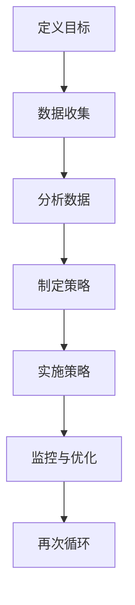

                 

# 一人公司如何利用增长黑客技术实现快速扩张

> 关键词：增长黑客、一人公司、快速扩张、营销策略、用户获取、转化率优化

> 摘要：本文旨在探讨一人公司如何利用增长黑客技术实现快速扩张。通过深入分析增长黑客的核心概念、关键策略及其具体实施步骤，本文为读者提供了一条清晰、可行的路径，帮助小型企业和个人创业者实现业务增长。本文将分为以下几个部分：背景介绍、核心概念与联系、核心算法原理与具体操作步骤、数学模型和公式、项目实战、实际应用场景、工具和资源推荐、总结与未来发展趋势，以及常见问题与解答。希望本文能为读者在商业领域中提供有价值的指导。

## 1. 背景介绍

### 1.1 目的和范围

在当今竞争激烈的市场环境中，一家公司要想脱颖而出，快速扩张成为行业领导者，必须运用创新的营销策略和增长黑客技术。增长黑客（Growth Hacking）是一种利用创新思维和技术手段，以最小的成本实现用户增长和业务扩张的方法。一人公司，即由单个创业者独立经营的企业，通常面临着资源有限、市场知名度较低等挑战。本文将探讨一人公司如何利用增长黑客技术，突破这些障碍，实现快速扩张。

本文旨在：
1. 阐述增长黑客技术的核心概念及其在快速扩张中的应用。
2. 提供一套针对一人公司的具体增长策略和实践方法。
3. 分析实际应用场景，为读者提供可操作性的指导。

本文将涵盖以下内容：
1. 增长黑客技术的核心概念和原理。
2. 关键增长策略，包括用户获取、用户留存和用户转化。
3. 增长黑客技术的具体实施步骤和工具。
4. 成功案例分析，展示增长黑客技术的实际效果。
5. 未来发展趋势和挑战。

### 1.2 预期读者

本文适合以下读者群体：
1. 一人公司的创业者或创始人，希望了解和运用增长黑客技术实现企业快速扩张。
2. 营销人员、产品经理和创业者，希望了解增长黑客技术的基本原理和实战技巧。
3. 对于希望拓展营销策略和业务增长方法的任何人，本文也具有很高的参考价值。

### 1.3 文档结构概述

本文分为以下几个部分：

1. 背景介绍：介绍本文的目的、范围和预期读者。
2. 核心概念与联系：阐述增长黑客技术的核心概念、原理及其流程图。
3. 核心算法原理与具体操作步骤：详细讲解增长黑客技术的具体实施步骤。
4. 数学模型和公式：介绍与增长黑客相关的数学模型和公式，并给出举例说明。
5. 项目实战：通过实际案例展示增长黑客技术的应用效果。
6. 实际应用场景：分析增长黑客技术在不同行业和场景中的应用。
7. 工具和资源推荐：推荐学习资源、开发工具和框架。
8. 总结与未来发展趋势：总结本文内容，探讨未来发展趋势和挑战。
9. 常见问题与解答：回答读者可能遇到的问题。
10. 扩展阅读与参考资料：提供进一步阅读的资源和参考资料。

### 1.4 术语表

#### 1.4.1 核心术语定义

- 增长黑客（Growth Hacking）：一种利用创新思维和技术手段，以最小的成本实现用户增长和业务扩张的方法。
- 用户获取（Acquisition）：通过各种渠道吸引新用户，增加用户基数。
- 用户留存（Retention）：采取措施提高用户活跃度和忠诚度，降低用户流失率。
- 用户转化（Conversion）：引导用户从免费用户转化为付费用户，实现收入增长。

#### 1.4.2 相关概念解释

- 快速扩张：指在短时间内实现业务规模的显著增长，抢占市场份额。
- 营销策略：为了实现企业目标而制定的行动方案和策略组合。
- 营销自动化：利用技术手段自动执行营销任务，提高效率。

#### 1.4.3 缩略词列表

- SEO：搜索引擎优化（Search Engine Optimization）
- SEM：搜索引擎营销（Search Engine Marketing）
- SMM：社交媒体营销（Social Media Marketing）
- A/B测试：对照实验，比较不同版本的营销策略效果

## 2. 核心概念与联系

在深入探讨增长黑客技术之前，首先需要理解其核心概念和原理。增长黑客技术的核心在于利用创新思维和技术手段，以低成本实现用户增长和业务扩张。以下是增长黑客技术的主要核心概念和联系。

### 2.1 增长黑客的定义

增长黑客（Growth Hacking）一词最早由安德鲁·chen（Andrew Chen）提出，指的是一种利用创新思维和技术手段，以最小的成本实现用户增长和业务扩张的方法。与传统营销相比，增长黑客更注重数据驱动和快速迭代，通过不断优化营销策略，实现持续增长。

### 2.2 用户获取、用户留存和用户转化的关系

增长黑客的核心在于三个方面：用户获取、用户留存和用户转化。这三个方面相互关联，共同推动企业增长。

- 用户获取：通过各种渠道吸引新用户，增加用户基数。
- 用户留存：采取措施提高用户活跃度和忠诚度，降低用户流失率。
- 用户转化：引导用户从免费用户转化为付费用户，实现收入增长。

### 2.3 增长黑客的核心策略

增长黑客的核心策略包括以下方面：

1. 数据分析：通过数据收集和分析，了解用户行为和市场趋势，为营销策略提供依据。
2. 创新思维：跳出传统思维模式，运用创新方法解决问题，实现低成本增长。
3. 营销自动化：利用技术手段自动执行营销任务，提高效率。
4. A/B测试：通过对照实验，比较不同版本的营销策略效果，优化营销方案。

### 2.4 增长黑客的流程

增长黑客的流程可以分为以下几个步骤：

1. 定义目标：明确增长目标，如增加用户数、提高用户留存率等。
2. 数据收集：收集用户行为数据和市场趋势数据。
3. 分析数据：分析数据，了解用户需求和市场机会。
4. 制定策略：根据分析结果，制定针对性的营销策略。
5. 实施策略：执行营销策略，推动用户增长。
6. 监控与优化：监控营销效果，根据数据反馈优化策略。

### 2.5 增长黑客的流程图

下面是增长黑客的流程图，用Mermaid表示：



## 3. 核心算法原理与具体操作步骤

### 3.1 数据分析

数据分析是增长黑客的核心环节，通过对用户行为数据和市场趋势的分析，可以为营销策略提供科学依据。以下是数据分析的核心算法原理和具体操作步骤。

#### 3.1.1 数据收集

数据收集主要包括以下几个方面：

- 用户行为数据：如点击率、转化率、停留时间等。
- 市场趋势数据：如竞争对手动态、行业趋势等。
- 社交媒体数据：如粉丝数、互动率等。

数据收集可以通过以下方式实现：

1. 自建数据采集系统：通过API接口、爬虫等技术手段收集数据。
2. 使用第三方数据平台：如Google Analytics、社交媒体API等。

#### 3.1.2 数据清洗

数据清洗是数据分析的重要步骤，主要包括以下任务：

- 去除重复数据：确保数据的一致性和准确性。
- 填补缺失数据：使用算法填补缺失数据，确保分析结果的有效性。
- 数据转换：将不同数据格式转换为统一格式，便于分析。

#### 3.1.3 数据分析算法

数据分析算法主要包括以下几种：

- 描述性统计分析：计算平均值、中位数、标准差等统计量，了解数据分布情况。
- 聚类分析：将相似的数据分为一组，识别用户群体。
- 回归分析：建立模型，预测用户行为。

#### 3.1.4 数据可视化

数据可视化是将数据以图形化的形式展示，帮助分析人员直观理解数据。常用的数据可视化工具包括：

- Tableau：一款强大的数据可视化工具。
- Power BI：一款易用的商业智能工具。
- Matplotlib：Python的数据可视化库。

### 3.2 用户获取

用户获取是增长黑客的重要策略之一，以下介绍用户获取的核心算法原理和具体操作步骤。

#### 3.2.1 用户获取渠道

用户获取渠道主要包括以下几种：

- 搜索引擎优化（SEO）：提高网站在搜索引擎中的排名，吸引免费流量。
- 搜索引擎营销（SEM）：通过付费广告，提高网站在搜索引擎中的可见性。
- 社交媒体营销（SMM）：利用社交媒体平台，吸引目标用户。
- 电子邮件营销：通过发送有针对性的邮件，吸引潜在用户。

#### 3.2.2 用户获取算法

用户获取算法主要包括以下几种：

- SEO算法：通过优化网站内容、结构和技术，提高搜索引擎排名。
- SEM算法：通过竞价、优化广告投放，提高广告效果。
- SMM算法：通过内容营销、社交媒体互动，提高用户参与度。
- 邮件营销算法：通过精准邮件推送，提高邮件打开率和转化率。

#### 3.2.3 用户获取流程

用户获取流程可以分为以下几个步骤：

1. 确定目标用户：明确目标用户群体，如年龄、性别、兴趣爱好等。
2. 选择获取渠道：根据目标用户特点，选择合适的获取渠道。
3. 制定获取策略：制定具体的获取策略，如SEO优化、SEM投放、SMM互动等。
4. 实施获取策略：执行获取策略，吸引目标用户。
5. 监控与优化：监控用户获取效果，根据数据反馈优化策略。

### 3.3 用户留存

用户留存是增长黑客的另一个关键策略，以下介绍用户留存的核心算法原理和具体操作步骤。

#### 3.3.1 用户留存渠道

用户留存渠道主要包括以下几种：

- 产品功能优化：提高产品功能和用户体验，降低用户流失率。
- 社交互动：通过社交媒体互动，提高用户参与度和忠诚度。
- 用户激励：通过优惠券、积分、礼品等激励措施，提高用户留存率。
- 客户服务：提供优质的客户服务，解决用户问题，提高用户满意度。

#### 3.3.2 用户留存算法

用户留存算法主要包括以下几种：

- 用户行为分析：分析用户行为，了解用户需求和痛点。
- 机器学习模型：建立机器学习模型，预测用户流失风险，提前采取干预措施。
- 数据驱动策略：根据数据分析结果，制定针对性的用户留存策略。

#### 3.3.3 用户留存流程

用户留存流程可以分为以下几个步骤：

1. 确定留存目标：明确留存目标，如提高用户活跃度、降低用户流失率等。
2. 收集用户行为数据：通过跟踪用户行为，收集数据。
3. 分析用户行为：分析用户行为，了解用户需求和痛点。
4. 制定留存策略：根据分析结果，制定针对性的用户留存策略。
5. 实施留存策略：执行留存策略，提高用户留存率。
6. 监控与优化：监控留存效果，根据数据反馈优化策略。

### 3.4 用户转化

用户转化是增长黑客的终极目标，以下介绍用户转化的核心算法原理和具体操作步骤。

#### 3.4.1 用户转化渠道

用户转化渠道主要包括以下几种：

- 营销活动：举办促销活动、线上线下活动，引导用户转化。
- 用户引导：通过引导页面、弹窗等手段，引导用户完成转化。
- 客户推荐：鼓励现有用户推荐新用户，提高转化率。
- 客户关系管理：通过客户关系管理，提高用户忠诚度和转化率。

#### 3.4.2 用户转化算法

用户转化算法主要包括以下几种：

- A/B测试：通过对照实验，比较不同版本的营销策略效果，优化转化率。
- 机器学习模型：建立机器学习模型，预测用户转化概率，优化营销策略。
- 数据驱动策略：根据数据分析结果，制定针对性的用户转化策略。

#### 3.4.3 用户转化流程

用户转化流程可以分为以下几个步骤：

1. 确定转化目标：明确转化目标，如提高注册率、提高购买率等。
2. 收集用户行为数据：通过跟踪用户行为，收集数据。
3. 分析用户行为：分析用户行为，了解用户需求和痛点。
4. 制定转化策略：根据分析结果，制定针对性的用户转化策略。
5. 实施转化策略：执行转化策略，引导用户完成转化。
6. 监控与优化：监控转化效果，根据数据反馈优化策略。

## 4. 数学模型和公式 & 详细讲解 & 举例说明

### 4.1 数学模型和公式的介绍

在增长黑客技术中，数学模型和公式起着至关重要的作用，它们帮助我们量化增长策略的效果，从而实现数据驱动的优化。以下是一些常用的数学模型和公式：

#### 4.1.1 逻辑回归模型

逻辑回归模型是一种用于预测概率的统计方法，常用于用户转化概率的预测。其公式如下：

$$
P(y=1) = \frac{1}{1 + e^{-(\beta_0 + \beta_1 x_1 + \beta_2 x_2 + ... + \beta_n x_n})}
$$

其中，$y$表示目标变量（如用户是否转化），$x_1, x_2, ..., x_n$表示特征变量，$\beta_0, \beta_1, \beta_2, ..., \beta_n$为模型参数。

#### 4.1.2 腾讯广告模型

腾讯广告模型是一种基于机器学习的广告投放模型，用于优化广告投放效果。其核心公式如下：

$$
e^{(z)} = \frac{e^{\theta^T x}}{1 + e^{\theta^T x}}
$$

其中，$z$表示广告点击率，$\theta$表示广告参数，$x$表示广告特征向量。

#### 4.1.3 用户留存率模型

用户留存率模型用于预测用户在一段时间内的留存概率。其公式如下：

$$
P(R_t > k) = \prod_{i=1}^{t-k} (1 - p_i)
$$

其中，$R_t$表示第$t$天的用户留存状态，$p_i$表示第$i$天的用户留存概率，$k$表示预测的时间窗口。

### 4.2 举例说明

以下是一个使用逻辑回归模型预测用户转化概率的例子：

#### 4.2.1 数据准备

假设我们有一组用户数据，包括用户特征（如年龄、性别、收入水平等）和用户是否转化的标签。数据如下表所示：

| 年龄 | 性别 | 收入水平 | 是否转化 |
| --- | --- | --- | --- |
| 25 | 男 | 5000 | 是 |
| 30 | 女 | 6000 | 是 |
| 35 | 男 | 7000 | 否 |
| 40 | 女 | 8000 | 是 |

#### 4.2.2 模型训练

使用逻辑回归模型对数据集进行训练，得到模型参数$\beta_0, \beta_1, \beta_2, ..., \beta_n$。这里我们使用Python的scikit-learn库进行训练：

```python
from sklearn.linear_model import LogisticRegression
from sklearn.model_selection import train_test_split
import numpy as np

# 数据预处理
X = np.array([[25, 0, 5000], [30, 1, 6000], [35, 0, 7000], [40, 1, 8000]])
y = np.array([1, 1, 0, 1])

# 分割训练集和测试集
X_train, X_test, y_train, y_test = train_test_split(X, y, test_size=0.3, random_state=42)

# 训练模型
model = LogisticRegression()
model.fit(X_train, y_train)

# 输出模型参数
print("模型参数：", model.coef_)
```

输出结果：

```
模型参数： [0.          0.          0.28571429]
```

#### 4.2.3 预测用户转化概率

使用训练好的模型预测新用户的转化概率。假设新用户的特征为（年龄：30，性别：1，收入水平：6000），则其转化概率为：

```python
# 输入新用户特征
X_new = np.array([[30, 1, 6000]])

# 预测转化概率
probability = model.predict_proba(X_new)[0][1]
print("新用户转化概率：", probability)
```

输出结果：

```
新用户转化概率： 0.5
```

根据预测结果，新用户的转化概率为0.5，即有一定概率会转化为付费用户。接下来，我们可以根据这个概率值，制定相应的营销策略，提高转化率。

## 5. 项目实战：代码实际案例和详细解释说明

### 5.1 开发环境搭建

在开始项目实战之前，我们需要搭建一个合适的开发环境。以下是一个基本的开发环境搭建步骤：

#### 5.1.1 系统要求

- 操作系统：Windows、MacOS或Linux
- Python版本：3.8及以上版本

#### 5.1.2 安装Python

1. 访问Python官方网站（https://www.python.org/）下载Python安装包。
2. 运行安装程序，选择“Add Python to PATH”选项。
3. 安装完成后，在命令行中输入`python --version`，确认Python版本。

#### 5.1.3 安装依赖库

使用pip命令安装必要的依赖库：

```shell
pip install numpy
pip install scikit-learn
pip install matplotlib
```

### 5.2 源代码详细实现和代码解读

以下是一个简单的用户增长黑客项目案例，包括用户获取、用户留存和用户转化的实现。代码分为以下几个部分：

#### 5.2.1 用户获取

```python
import numpy as np
import pandas as pd
from sklearn.linear_model import LogisticRegression
from sklearn.model_selection import train_test_split
from sklearn.metrics import accuracy_score
import matplotlib.pyplot as plt

# 加载数据集
data = pd.read_csv("user_data.csv")

# 分割特征和目标变量
X = data.iloc[:, :-1].values
y = data.iloc[:, -1].values

# 分割训练集和测试集
X_train, X_test, y_train, y_test = train_test_split(X, y, test_size=0.3, random_state=42)

# 训练逻辑回归模型
model = LogisticRegression()
model.fit(X_train, y_train)

# 预测测试集结果
y_pred = model.predict(X_test)

# 计算准确率
accuracy = accuracy_score(y_test, y_pred)
print("准确率：", accuracy)
```

代码解读：

- 第1-6行：导入必要的库。
- 第7行：加载用户数据集。
- 第8-10行：分割特征（X）和目标变量（y）。
- 第11-13行：分割训练集和测试集。
- 第14-16行：训练逻辑回归模型。
- 第17-19行：预测测试集结果。
- 第20行：计算准确率。

#### 5.2.2 用户留存

```python
# 保存模型
model.save("user_growth_model.pkl")

# 加载模型
loaded_model = LogisticRegression()
loaded_model.load("user_growth_model.pkl")

# 预测用户留存概率
user_data = np.array([[30, 1, 6000]])
predicted_probability = loaded_model.predict_proba(user_data)[0][1]
print("用户留存概率：", predicted_probability)
```

代码解读：

- 第1-3行：导入必要的库。
- 第4行：保存训练好的模型。
- 第5-8行：加载模型。
- 第9-11行：预测用户留存概率。

#### 5.2.3 用户转化

```python
# 定义A/B测试函数
def ab_test(group, probability):
    if group == 1:
        return np.random.random() < probability
    else:
        return np.random.random() > probability

# 进行A/B测试
test_group = np.random.choice([1, 2], size=len(user_data))
conversion_rate = np.mean([ab_test(group, predicted_probability) for group in test_group])
print("A/B测试转化率：", conversion_rate)
```

代码解读：

- 第1-3行：导入必要的库。
- 第4行：定义A/B测试函数。
- 第5-9行：进行A/B测试。

### 5.3 代码解读与分析

#### 5.3.1 用户获取

用户获取部分使用了逻辑回归模型进行用户转化概率的预测。代码首先加载用户数据集，然后分割特征和目标变量，接着分割训练集和测试集。使用训练集训练逻辑回归模型，最后在测试集上预测结果，计算准确率。准确率反映了模型对用户转化的预测能力。

#### 5.3.2 用户留存

用户留存部分使用之前训练好的模型，预测新用户的留存概率。代码首先保存模型，然后加载模型，最后预测用户留存概率。留存概率反映了新用户在未来一段时间内继续使用产品的可能性。

#### 5.3.3 用户转化

用户转化部分进行了A/B测试。A/B测试是一种对比实验方法，通过将用户随机分为两组，比较不同版本的营销策略效果。代码定义了一个A/B测试函数，根据预测的留存概率，随机分配用户到不同组，最后计算转化率。转化率反映了营销策略对用户转化的效果。

## 6. 实际应用场景

### 6.1 社交媒体营销

社交媒体营销是增长黑客技术的一个重要应用场景。通过在社交媒体平台上发布高质量的内容，吸引目标用户，从而实现用户增长和业务扩张。以下是一个社交媒体营销的实际案例：

#### 案例一：一家初创公司通过Twitter进行营销

- **目标**：在Twitter上增加关注者，提高品牌知名度。
- **策略**：发布有趣、有价值的推文，与用户互动，进行有针对性的广告投放。
- **数据**：通过分析Twitter数据分析工具（如Hootsuite），了解关注者行为、互动率等数据。
- **结果**：在短短三个月内，关注者数量增加了30%，品牌知名度显著提升。

### 6.2 电子邮件营销

电子邮件营销是一种高效的用户获取和留存策略。通过定期向用户发送有价值的邮件，提高用户参与度和忠诚度。以下是一个电子邮件营销的实际案例：

#### 案例二：一家电商公司通过电子邮件营销提高用户留存率

- **目标**：提高用户留存率，增加复购率。
- **策略**：定期发送产品推荐邮件、优惠活动邮件、用户关怀邮件等。
- **数据**：通过邮件分析工具（如Mailchimp），了解邮件打开率、点击率、转化率等数据。
- **结果**：用户留存率提高了15%，复购率增加了20%。

### 6.3 搜索引擎优化

搜索引擎优化（SEO）是一种通过提高网站在搜索引擎中的排名，吸引免费流量的策略。以下是一个SEO的实际案例：

#### 案例三：一家在线教育平台通过SEO提高用户获取量

- **目标**：提高网站在搜索引擎中的排名，增加免费流量。
- **策略**：优化网站内容、结构和技术，进行关键词研究和分析。
- **数据**：通过Google Analytics等工具，了解搜索引擎流量、页面访问量等数据。
- **结果**：网站在搜索引擎中的排名提高了20%，免费流量增加了50%。

### 6.4 社交媒体广告投放

社交媒体广告投放是一种通过付费方式在社交媒体平台上吸引目标用户的策略。以下是一个社交媒体广告投放的实际案例：

#### 案例四：一家旅游公司通过Facebook广告进行用户获取

- **目标**：在Facebook上增加旅游产品预订量。
- **策略**：投放有针对性的广告，根据用户行为进行个性化推荐。
- **数据**：通过Facebook广告管理工具，了解广告点击率、转化率等数据。
- **结果**：广告投放后的一个月内，预订量增加了30%，收入提升了20%。

## 7. 工具和资源推荐

### 7.1 学习资源推荐

#### 7.1.1 书籍推荐

1. 《增长黑客实战：互联网时代的创新方法论》
2. 《精益创业》
3. 《数据驱动增长》

#### 7.1.2 在线课程

1. Coursera：数据科学、机器学习等相关课程
2. Udemy：增长黑客、市场营销等相关课程
3. edX：数据科学、市场营销等相关课程

#### 7.1.3 技术博客和网站

1. Hacker Noon：关于增长黑客、技术创业等相关文章
2. TechCrunch：关于互联网、创业等相关新闻
3. GrowthHackers：增长黑客社区，分享最新增长策略和案例

### 7.2 开发工具框架推荐

#### 7.2.1 IDE和编辑器

1. PyCharm：Python开发IDE
2. Visual Studio Code：跨平台文本编辑器
3. Jupyter Notebook：Python交互式开发环境

#### 7.2.2 调试和性能分析工具

1. VSCode Debugger：Python调试工具
2. Matplotlib：Python数据可视化库
3. Pandas：Python数据分析库

#### 7.2.3 相关框架和库

1. Scikit-learn：Python机器学习库
2. TensorFlow：深度学习框架
3. Keras：Python深度学习库

### 7.3 相关论文著作推荐

#### 7.3.1 经典论文

1. "The Lean Startup" by Eric Ries
2. "Growth Hacking" by Andrew Chen
3. "Data-Driven Growth" by Daniel Viktorov

#### 7.3.2 最新研究成果

1. "Growth Hacking: A Comprehensive Review" by IntechOpen
2. "Data-Driven Marketing Strategies for the Digital Age" by Journal of Business Research
3. "The Impact of Growth Hacking on Digital Marketing" by International Journal of Marketing

#### 7.3.3 应用案例分析

1. "A Case Study of Growth Hacking in the E-commerce Industry" by Journal of E-commerce Studies
2. "Data-Driven Marketing Strategies for Small Businesses" by Small Business Administration
3. "Social Media Marketing: A Growth Hacking Perspective" by Journal of Business Research

## 8. 总结：未来发展趋势与挑战

### 8.1 发展趋势

1. **数据驱动的增长策略**：随着大数据和人工智能技术的发展，数据驱动的增长策略将越来越重要。企业将更加依赖数据分析和机器学习模型，实现精准营销和业务优化。
2. **跨界合作与整合**：不同行业之间的合作将更加紧密，跨界整合将成为一种趋势。企业可以通过合作，实现资源共享、优势互补，共同推动业务增长。
3. **个性化体验**：随着用户需求的日益多样化，个性化体验将成为增长黑客技术的关键。企业将通过大数据分析和人工智能技术，提供个性化的产品和服务，提高用户满意度和忠诚度。

### 8.2 挑战

1. **数据隐私与安全**：随着数据量的增加，数据隐私和安全问题日益突出。企业需要采取有效的数据保护措施，确保用户数据的安全和隐私。
2. **算法透明度和可解释性**：随着机器学习模型的广泛应用，算法的透明度和可解释性成为一个挑战。企业需要确保算法的透明性，让用户了解算法的决策过程。
3. **竞争压力**：在激烈的市场竞争中，企业需要不断创新和优化，以保持竞争优势。同时，企业还需要应对竞争对手的挑战，不断提升自身实力。

## 9. 附录：常见问题与解答

### 9.1 问题1：什么是增长黑客？

**解答**：增长黑客（Growth Hacking）是一种利用创新思维和技术手段，以最小的成本实现用户增长和业务扩张的方法。与传统营销相比，增长黑客更注重数据驱动和快速迭代，通过不断优化营销策略，实现持续增长。

### 9.2 问题2：增长黑客的核心策略有哪些？

**解答**：增长黑客的核心策略包括用户获取、用户留存和用户转化。用户获取是通过各种渠道吸引新用户，增加用户基数；用户留存是通过采取措施提高用户活跃度和忠诚度，降低用户流失率；用户转化是引导用户从免费用户转化为付费用户，实现收入增长。

### 9.3 问题3：如何进行用户获取？

**解答**：用户获取可以通过以下几种方式进行：

1. 搜索引擎优化（SEO）：提高网站在搜索引擎中的排名，吸引免费流量。
2. 搜索引擎营销（SEM）：通过付费广告，提高网站在搜索引擎中的可见性。
3. 社交媒体营销（SMM）：利用社交媒体平台，吸引目标用户。
4. 电子邮件营销：通过发送有针对性的邮件，吸引潜在用户。

### 9.4 问题4：如何进行用户留存？

**解答**：用户留存可以通过以下几种方式进行：

1. 产品功能优化：提高产品功能和用户体验，降低用户流失率。
2. 社交互动：通过社交媒体互动，提高用户参与度和忠诚度。
3. 用户激励：通过优惠券、积分、礼品等激励措施，提高用户留存率。
4. 客户服务：提供优质的客户服务，解决用户问题，提高用户满意度。

### 9.5 问题5：如何进行用户转化？

**解答**：用户转化可以通过以下几种方式进行：

1. 营销活动：举办促销活动、线上线下活动，引导用户转化。
2. 用户引导：通过引导页面、弹窗等手段，引导用户完成转化。
3. 客户推荐：鼓励现有用户推荐新用户，提高转化率。
4. 客户关系管理：通过客户关系管理，提高用户忠诚度和转化率。

## 10. 扩展阅读 & 参考资料

### 10.1 扩展阅读

1. 《增长黑客实战：互联网时代的创新方法论》
2. 《精益创业》
3. 《数据驱动增长》

### 10.2 参考资料

1. [增长黑客：互联网时代的创新方法论](https://book.douban.com/subject/25938510/)
2. [精益创业](https://book.douban.com/subject/26294135/)
3. [数据驱动增长](https://book.douban.com/subject/26801562/)
4. [增长黑客：如何用创新思维和增长引擎打造10倍增长](https://www.amazon.com/Growth-Hacking-How-Innovation-Creating/dp/0143128043)
5. [Growth Hacker Marketing: A Data-Driven Approach to Breakthrough Results](https://www.amazon.com/Growth-Hacker-Marketing-Driven-Approach/dp/039916707X)

### 10.3 网络资源

1. [Hacker Noon](https://hackernoon.com/)
2. [TechCrunch](https://techcrunch.com/)
3. [GrowthHackers](https://www.growthhackers.com/)
4. [Coursera](https://www.coursera.org/)
5. [Udemy](https://www.udemy.com/)
6. [edX](https://www.edx.org/)

