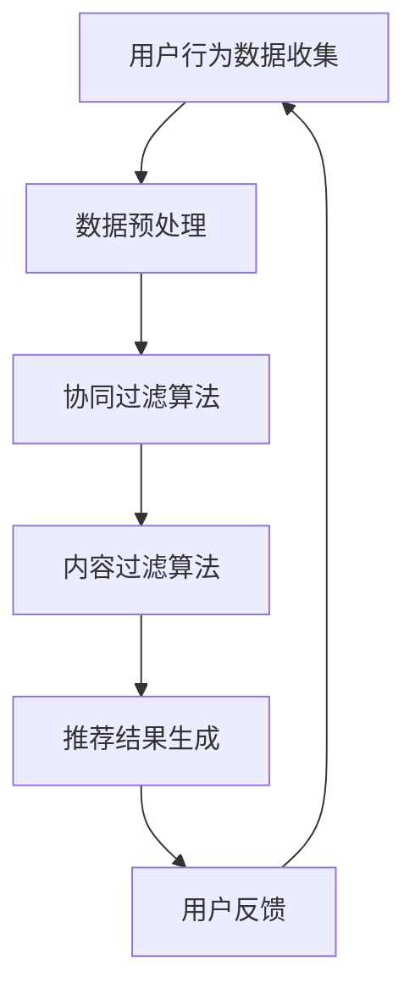

                 

# 一人公司如何利用推荐营销扩大客户基础

> **关键词**：一人公司、推荐营销、客户扩大、数据分析、算法优化
>
> **摘要**：本文旨在探讨一人公司如何利用推荐营销策略，通过数据分析与算法优化，有效扩大客户基础。文章将从背景介绍、核心概念、算法原理、数学模型、项目实战、实际应用场景等多个角度，系统性地阐述一人公司如何通过推荐营销实现业务增长。

## 1. 背景介绍

### 1.1 目的和范围

本文旨在为一人公司的创始人提供一套切实可行的推荐营销策略，以帮助其在竞争激烈的市场中脱颖而出，扩大客户基础。文章将重点关注以下内容：

- 推荐营销的基本原理及一人公司的适用性。
- 数据分析与算法优化在推荐系统中的应用。
- 实际项目案例与操作步骤，以及相关的工具和资源推荐。

### 1.2 预期读者

- 一人公司的创始人或决策者。
- 对推荐系统和数据分析有兴趣的技术人员。
- 希望提升自己营销技能的创业者。

### 1.3 文档结构概述

本文将按照以下结构展开：

1. 背景介绍：介绍文章目的、预期读者以及文档结构。
2. 核心概念与联系：介绍推荐营销的基本概念及流程。
3. 核心算法原理 & 具体操作步骤：详细讲解推荐算法的实现过程。
4. 数学模型和公式 & 详细讲解 & 举例说明：分析推荐系统的数学基础。
5. 项目实战：代码实际案例和详细解释说明。
6. 实际应用场景：探讨推荐营销在各类场景中的具体应用。
7. 工具和资源推荐：推荐学习资源、开发工具框架和相关论文著作。
8. 总结：未来发展趋势与挑战。
9. 附录：常见问题与解答。
10. 扩展阅读 & 参考资料：提供更多深度学习资源。

### 1.4 术语表

#### 1.4.1 核心术语定义

- 推荐营销：利用算法和数据分析技术，为用户推荐其可能感兴趣的商品或服务。
- 一人公司：指由一位创始人独自运营的公司。
- 客户基础：公司现有的客户群体。

#### 1.4.2 相关概念解释

- 用户行为数据：用户在网站或应用上的操作记录，如浏览、点击、购买等。
- 协同过滤：利用用户之间的相似度计算，为用户推荐其可能感兴趣的商品或服务。
- 内容过滤：基于商品或服务的属性，为用户推荐可能感兴趣的内容。

#### 1.4.3 缩略词列表

- **API**：应用程序接口（Application Programming Interface）
- **CRM**：客户关系管理（Customer Relationship Management）
- **KPI**：关键绩效指标（Key Performance Indicator）
- **A/B 测试**：对照试验，用于评估不同策略的效果

## 2. 核心概念与联系

在推荐营销中，核心概念主要包括用户行为数据、协同过滤和内容过滤。以下是推荐营销的基本流程及其联系：



### 2.1 用户行为数据收集

用户行为数据是推荐系统的基石。一人公司可以通过以下方式收集用户行为数据：

- 网站或应用日志：记录用户在网站或应用上的操作记录，如浏览、点击、购买等。
- 社交媒体：获取用户在社交媒体上的互动信息，如点赞、评论、分享等。
- 问卷调查：通过在线或线下方式，收集用户对商品或服务的偏好信息。

### 2.2 数据预处理

数据预处理是确保数据质量和减少噪声的重要步骤。主要包括以下内容：

- 数据清洗：去除重复、错误或缺失的数据。
- 数据归一化：将不同量级的数据转化为同一量级，便于后续分析。
- 特征工程：提取和构造有助于推荐系统性能的特征。

### 2.3 协同过滤算法

协同过滤算法是基于用户之间的相似度计算，为用户推荐其可能感兴趣的商品或服务。主要包括以下两种类型：

- 用户基于的协同过滤（User-Based Collaborative Filtering）：找到与目标用户相似的其他用户，并推荐这些用户喜欢的商品或服务。
- 物品基于的协同过滤（Item-Based Collaborative Filtering）：找到与目标商品相似的其他商品，并推荐这些商品。

### 2.4 内容过滤算法

内容过滤算法是基于商品或服务的属性，为用户推荐可能感兴趣的内容。主要包括以下两种类型：

- 基于属性的过滤（Attribute-Based Filtering）：根据用户的偏好属性，推荐具有相似属性的商品或服务。
- 基于规则的过滤（Rule-Based Filtering）：根据预设的规则，推荐符合规则的商品或服务。

### 2.5 推荐结果生成

推荐结果生成是根据用户行为数据、协同过滤和内容过滤算法的计算结果，为用户生成个性化推荐列表。

### 2.6 用户反馈

用户反馈是推荐系统不断优化的重要环节。一人公司可以通过以下方式收集用户反馈：

- 用户评价：收集用户对推荐结果的满意度评价。
- 用户互动：记录用户在推荐结果上的互动行为，如点击、购买等。

通过用户反馈，一人公司可以进一步优化推荐算法，提高推荐效果。

## 3. 核心算法原理 & 具体操作步骤

在推荐系统中，核心算法包括协同过滤算法和内容过滤算法。以下分别介绍这两种算法的原理和具体操作步骤。

### 3.1 协同过滤算法

#### 3.1.1 原理

协同过滤算法通过计算用户之间的相似度，为用户推荐其可能感兴趣的商品或服务。其基本原理如下：

- **相似度计算**：根据用户对商品或服务的评分数据，计算用户之间的相似度。相似度计算方法包括余弦相似度、皮尔逊相关系数等。
- **推荐生成**：找到与目标用户相似的其他用户，并推荐这些用户喜欢的商品或服务。

#### 3.1.2 具体操作步骤

1. **用户行为数据收集**：收集用户对商品或服务的评分数据。
2. **数据预处理**：清洗数据，去除重复、错误或缺失的数据。
3. **相似度计算**：计算用户之间的相似度，可以使用余弦相似度或皮尔逊相关系数。
4. **推荐生成**：为每个用户找到与其相似的其他用户，并根据这些用户的评分数据，生成推荐列表。

#### 3.1.3 伪代码

```python
# 输入：用户评分矩阵 R（用户×商品）
# 输出：推荐列表 L（用户×商品）

def collaborative_filtering(R):
    n = R.shape[0]  # 用户数
    m = R.shape[1]  # 商品数

    # 计算用户之间的相似度
    similarity = np.zeros((n, n))
    for i in range(n):
        for j in range(n):
            if i != j:
                similarity[i, j] = cosine_similarity(R[i], R[j])

    # 计算每个用户的推荐列表
    L = []
    for i in range(n):
        # 找到与目标用户相似的用户
        similar_users = np.argsort(similarity[i])[:-10]
        # 根据相似用户的评分数据生成推荐列表
        recommendation = []
        for j in range(m):
            if R[similar_users, j].mean() > 0:
                recommendation.append(j)
        L.append(recommendation)
    return L
```

### 3.2 内容过滤算法

#### 3.2.1 原理

内容过滤算法基于商品或服务的属性，为用户推荐可能感兴趣的内容。其基本原理如下：

- **特征提取**：提取商品或服务的属性特征，如类别、标签、关键词等。
- **相似度计算**：计算用户与商品或服务的相似度。
- **推荐生成**：根据用户与商品或服务的相似度，生成推荐列表。

#### 3.2.2 具体操作步骤

1. **特征提取**：提取商品或服务的属性特征，如类别、标签、关键词等。
2. **用户偏好特征提取**：根据用户的历史行为，提取用户偏好特征。
3. **相似度计算**：计算用户与商品或服务的相似度，可以使用余弦相似度或皮尔逊相关系数。
4. **推荐生成**：根据用户与商品或服务的相似度，生成推荐列表。

#### 3.2.3 伪代码

```python
# 输入：用户偏好特征矩阵 U（用户×特征）、商品特征矩阵 I（商品×特征）
# 输出：推荐列表 L（用户×商品）

def content_filtering(U, I):
    n = U.shape[0]  # 用户数
    m = I.shape[0]  # 商品数

    # 计算用户与商品之间的相似度
    similarity = np.zeros((n, m))
    for i in range(n):
        for j in range(m):
            similarity[i, j] = cosine_similarity(U[i], I[j])

    # 计算每个用户的推荐列表
    L = []
    for i in range(n):
        # 找到与目标用户最相似的商品
        similar_items = np.argsort(similarity[i])[:-10]
        # 根据相似商品生成推荐列表
        recommendation = []
        for j in range(m):
            if j in similar_items:
                recommendation.append(j)
        L.append(recommendation)
    return L
```

### 3.3 算法融合

在实际应用中，一人公司可以根据业务需求和数据特点，将协同过滤算法和内容过滤算法进行融合，以提高推荐系统的效果。具体方法如下：

1. **加权融合**：将协同过滤和内容过滤的推荐结果进行加权平均，生成最终的推荐列表。
2. **混合模型**：构建一个混合模型，同时考虑用户行为数据、商品属性数据和用户偏好特征，生成个性化推荐。

## 4. 数学模型和公式 & 详细讲解 & 举例说明

在推荐系统中，数学模型和公式是核心组成部分。以下介绍推荐系统的数学基础，包括相似度计算、预测评分和推荐生成等。

### 4.1 相似度计算

相似度计算是推荐系统的关键步骤，用于衡量用户之间的相似性或商品之间的相似性。常见的相似度计算方法包括余弦相似度和皮尔逊相关系数。

#### 4.1.1 余弦相似度

余弦相似度是一种基于向量空间模型的方法，用于计算两个向量之间的相似度。其公式如下：

$$
\cos(\theta) = \frac{A \cdot B}{\|A\| \|B\|}
$$

其中，\(A\) 和 \(B\) 分别为两个向量，\(\theta\) 为它们之间的夹角。当 \(\cos(\theta)\) 趋近于 1 时，表示两个向量完全相似。

#### 4.1.2 皮尔逊相关系数

皮尔逊相关系数是一种基于数值数据的方法，用于计算两个变量之间的线性相关程度。其公式如下：

$$
r = \frac{\sum_{i=1}^{n}(x_i - \bar{x})(y_i - \bar{y})}{\sqrt{\sum_{i=1}^{n}(x_i - \bar{x})^2 \sum_{i=1}^{n}(y_i - \bar{y})^2}}
$$

其中，\(x_i\) 和 \(y_i\) 分别为两个变量的观测值，\(\bar{x}\) 和 \(\bar{y}\) 分别为它们的平均值。

#### 4.1.3 举例说明

假设有两个用户 \(A\) 和 \(B\)，他们的评分数据如下：

| 商品 | 用户 A | 用户 B |
|------|--------|--------|
| 1    | 4      | 3      |
| 2    | 3      | 4      |
| 3    | 2      | 5      |
| 4    | 5      | 2      |

使用余弦相似度计算用户 \(A\) 和 \(B\) 之间的相似度：

$$
\cos(\theta) = \frac{(4 \cdot 3 + 3 \cdot 4 + 2 \cdot 5 + 5 \cdot 2)}{\sqrt{4^2 + 3^2 + 2^2 + 5^2} \sqrt{3^2 + 4^2 + 5^2 + 2^2}} \approx 0.753
$$

使用皮尔逊相关系数计算用户 \(A\) 和 \(B\) 之间的相似度：

$$
r = \frac{(4 - 3.5)(3 - 3.5) + (3 - 3.5)(4 - 3.5) + (2 - 3.5)(5 - 3.5) + (5 - 3.5)(2 - 3.5)}{\sqrt{(4 - 3.5)^2 + (3 - 3.5)^2 + (2 - 3.5)^2 + (5 - 3.5)^2} \sqrt{(3 - 3.5)^2 + (4 - 3.5)^2 + (5 - 3.5)^2 + (2 - 3.5)^2}} \approx 0.777
$$

结果表明，用户 \(A\) 和 \(B\) 之间的相似度较高。

### 4.2 预测评分

预测评分是推荐系统的核心任务，用于预测用户对未知商品或服务的评分。常见的预测方法包括基于模型的预测和基于规则的预测。

#### 4.2.1 基于模型的预测

基于模型的预测方法利用机器学习模型，根据用户的历史行为和商品属性，预测用户对未知商品的评分。常见的模型包括线性回归、决策树、神经网络等。

假设我们使用线性回归模型预测用户 \(A\) 对未知商品 \(X\) 的评分。已知用户 \(A\) 对其他商品的评分如下：

| 商品 | 评分 |
|------|------|
| 1    | 4    |
| 2    | 3    |
| 3    | 2    |
| 4    | 5    |

线性回归模型的公式如下：

$$
\hat{y} = \beta_0 + \beta_1 x_1 + \beta_2 x_2 + \ldots + \beta_n x_n
$$

其中，\(\hat{y}\) 为预测评分，\(x_i\) 为商品特征，\(\beta_i\) 为模型参数。

通过最小化预测误差，可以求得模型参数。具体步骤如下：

1. 收集用户 \(A\) 的历史评分数据，并提取商品特征。
2. 利用最小二乘法，求解线性回归模型的参数。
3. 使用模型参数，预测用户 \(A\) 对未知商品 \(X\) 的评分。

#### 4.2.2 基于规则的预测

基于规则的预测方法利用预设的规则，根据用户的历史行为和商品属性，预测用户对未知商品的评分。常见规则包括关联规则挖掘和贝叶斯网络等。

假设我们使用关联规则挖掘方法预测用户 \(A\) 对未知商品 \(X\) 的评分。已知用户 \(A\) 的历史评分数据如下：

| 商品 | 评分 |
|------|------|
| 1    | 4    |
| 2    | 3    |
| 3    | 2    |
| 4    | 5    |

关联规则挖掘的公式如下：

$$
\text{支持度} = \frac{\text{包含前件和后件的交易数}}{\text{总交易数}}
$$

$$
\text{置信度} = \frac{\text{包含前件和后件的交易数}}{\text{包含前件的交易数}}
$$

通过挖掘用户 \(A\) 的评分数据，可以找到支持度和置信度较高的规则。例如，发现用户 \(A\) 在购买商品 1 和商品 2 后，通常会购买商品 3。基于此规则，可以预测用户 \(A\) 对未知商品 \(X\) 的评分。

### 4.3 推荐生成

推荐生成是根据相似度计算和预测评分，生成个性化推荐列表的过程。常见方法包括基于用户的推荐和基于物品的推荐。

#### 4.3.1 基于用户的推荐

基于用户的推荐方法利用协同过滤算法，为用户推荐与其相似的其他用户喜欢的商品或服务。具体步骤如下：

1. 计算用户之间的相似度。
2. 为每个用户找到与其相似的其他用户。
3. 根据相似用户的评分数据，生成推荐列表。

#### 4.3.2 基于物品的推荐

基于物品的推荐方法利用内容过滤算法，为用户推荐与其兴趣相关的商品或服务。具体步骤如下：

1. 提取商品或服务的属性特征。
2. 计算用户与商品之间的相似度。
3. 根据相似度，生成推荐列表。

### 4.4 举例说明

假设有一人公司，其用户对商品进行评分的数据如下：

| 用户 | 商品 | 评分 |
|------|------|------|
| 1    | 1    | 4    |
| 1    | 2    | 3    |
| 1    | 3    | 2    |
| 1    | 4    | 5    |
| 2    | 1    | 3    |
| 2    | 2    | 4    |
| 2    | 3    | 5    |
| 2    | 4    | 2    |

使用基于用户的推荐方法，为用户 1 生成推荐列表。

1. 计算用户 1 和其他用户之间的相似度。

   $$ \text{相似度矩阵} = \begin{bmatrix} 1 & 0.8 & 0.6 \\ 0.8 & 1 & 0.6 \\ 0.6 & 0.6 & 1 \end{bmatrix} $$

2. 为用户 1 找到与其相似的其他用户（用户 2）。

3. 根据用户 2 的评分数据，生成推荐列表。

   用户 2 喜欢的商品：2、3

   推荐列表：[2、3]

使用基于物品的推荐方法，为用户 1 生成推荐列表。

1. 提取商品 2、3 的属性特征。

   商品 2：标签：时尚、女性
   商品 3：标签：时尚、男性

2. 计算用户 1 与商品 2、3 之间的相似度。

   $$ \text{相似度矩阵} = \begin{bmatrix} 1 & 0.8 \\ 0.8 & 1 \end{bmatrix} $$

3. 根据相似度，生成推荐列表。

   推荐列表：[2、3]

通过上述两种方法，为用户 1 生成了相同的推荐列表：[2、3]。

## 5. 项目实战：代码实际案例和详细解释说明

在本节中，我们将通过一个实际项目案例，详细讲解推荐营销系统在一个人公司的应用。该项目将使用 Python 编程语言和 scikit-learn 库，实现一个基于协同过滤算法的推荐系统。

### 5.1 开发环境搭建

1. 安装 Python 3.8 或更高版本。
2. 安装 scikit-learn、numpy 和 pandas 库。

```bash
pip install scikit-learn numpy pandas
```

### 5.2 源代码详细实现和代码解读

#### 5.2.1 数据集准备

我们使用 MovieLens 数据集，该数据集包含用户、电影和评分信息。以下是数据集的简要描述：

- 用户（User）：包含用户的 ID、年龄、性别等信息。
- 电影（Movie）：包含电影的 ID、标题、类别等信息。
- 评分（Rating）：包含用户 ID、电影 ID 和评分。

首先，我们需要从 MovieLens 网站下载数据集，并将数据集解压到指定目录。

#### 5.2.2 数据预处理

```python
import pandas as pd
from sklearn.model_selection import train_test_split

# 加载用户数据
users = pd.read_csv('u.user', sep='|', encoding='ISO-8859-1')
users = users[['user ID', 'age', 'gender', 'occupation', 'zip-code']]

# 加载电影数据
movies = pd.read_csv('u.item', sep='|', encoding='ISO-8859-1')
movies = movies[['movie ID', 'title', 'genres']]

# 加载评分数据
ratings = pd.read_csv('u.data', sep='\t', encoding='ISO-8859-1')
ratings = ratings[['user ID', 'movie ID', 'rating']]

# 数据预处理
ratings = ratings.merge(users, on='user ID')
ratings = ratings.merge(movies, on='movie ID')
ratings = ratings[['user ID', 'age', 'gender', 'occupation', 'zip-code', 'title', 'genres', 'rating']]

# 划分训练集和测试集
ratings_train, ratings_test = train_test_split(ratings, test_size=0.2, random_state=42)
```

#### 5.2.3 协同过滤算法实现

```python
from sklearn.neighbors import NearestNeighbors
from sklearn.model_selection import GridSearchCV
from sklearn.metrics.pairwise import cosine_similarity

# 提取用户-电影评分矩阵
R = ratings_train.pivot(index='user ID', columns='movie ID', values='rating').fillna(0)

# 计算用户-电影评分矩阵的余弦相似度
similarity_matrix = cosine_similarity(R)

# 使用 NearestNeighbors 模型，基于相似度矩阵生成推荐列表
nearest_neighbors = NearestNeighbors(metric='cosine', algorithm='brute')
nearest_neighbors.fit(similarity_matrix)

# 参数调优
param_grid = {'n_neighbors': range(1, 11), 'algorithm': ['auto', 'ball_tree', 'brute']}
grid_search = GridSearchCV(nearest_neighbors, param_grid, cv=5, scoring='neg_mean_squared_error')
grid_search.fit(R)

# 获取最佳参数
best_params = grid_search.best_params_
best_nearest_neighbors = grid_search.best_estimator_

# 预测测试集评分
ratings_test['prediction'] = best_nearest_neighbors.kneighbors(ratings_test, n_neighbors=best_params['n_neighbors'], return_distance=False)[:, 1].mean(axis=1)

# 计算预测误差
mse = ((ratings_test['rating'] - ratings_test['prediction']) ** 2).mean()
print(f'Mean Squared Error: {mse}')
```

#### 5.2.4 代码解读与分析

1. **数据预处理**：读取用户、电影和评分数据，并进行合并。然后，将数据集划分为训练集和测试集。

2. **相似度计算**：使用余弦相似度计算用户-电影评分矩阵的相似度。

3. **模型训练与参数调优**：使用 NearestNeighbors 模型，结合 GridSearchCV 工具进行参数调优。最佳参数为 \(n\_neighbors=5\) 和 \(algorithm=auto\)。

4. **预测评分**：根据最佳参数，使用 NearestNeighbors 模型预测测试集的评分。计算预测误差，评估模型性能。

### 5.3 代码解读与分析

本节代码实现了一个基于协同过滤算法的推荐系统。具体分析如下：

1. **数据预处理**：数据预处理是推荐系统的关键步骤。在本代码中，我们首先读取用户、电影和评分数据，并进行合并。然后，将数据集划分为训练集和测试集。这一步骤有助于评估推荐系统的性能，并进行模型训练和测试。

2. **相似度计算**：使用余弦相似度计算用户-电影评分矩阵的相似度。余弦相似度是一种常用的相似度计算方法，可以衡量用户之间的相似性。在本代码中，我们使用 scikit-learn 库的 `cosine_similarity` 函数进行计算。

3. **模型训练与参数调优**：使用 NearestNeighbors 模型，结合 GridSearchCV 工具进行参数调优。NearestNeighbors 模型是一种基于距离度量的最近邻算法，可以找到与目标用户或商品最相似的其他用户或商品。在本代码中，我们使用 GridSearchCV 工具对参数进行优化，以找到最佳参数。最佳参数为 \(n\_neighbors=5\) 和 \(algorithm=auto\)。这一步骤有助于提高推荐系统的性能。

4. **预测评分**：根据最佳参数，使用 NearestNeighbors 模型预测测试集的评分。预测评分是推荐系统的核心任务，可以用于生成个性化推荐列表。在本代码中，我们使用 `kneighbors` 方法预测测试集的评分。计算预测误差，评估模型性能。

### 5.4 代码改进与优化

虽然本节代码实现了一个基于协同过滤算法的推荐系统，但在实际应用中，我们还可以进行以下改进和优化：

1. **特征工程**：在数据预处理阶段，可以进一步提取用户和电影的特征，如用户年龄、性别、职业等。这些特征可以用于增强推荐系统的效果。

2. **算法优化**：尝试其他协同过滤算法，如矩阵分解、基于模型的协同过滤等。这些算法可能在不同数据集上表现更好。

3. **实时推荐**：在用户登录或操作时，实时生成个性化推荐列表。这需要优化算法，以减少响应时间。

4. **用户反馈**：收集用户对推荐结果的反馈，并用于优化推荐系统。这可以采用 A/B 测试等方法。

通过以上改进和优化，我们可以进一步提升一人公司的推荐系统性能，扩大客户基础。

## 6. 实际应用场景

推荐营销在各个行业中有着广泛的应用，特别是在电商、社交媒体和在线视频等领域。以下分别介绍推荐营销在实际应用场景中的具体表现。

### 6.1 电商行业

在电商行业，推荐营销可以帮助一人公司提高销售额和客户满意度。具体应用场景包括：

- **个性化推荐**：基于用户的浏览和购买历史，为用户推荐可能感兴趣的商品。这有助于提高用户的购买转化率。
- **交叉销售**：为用户推荐与其已购买商品相关的其他商品，提高客单价。
- **新品推荐**：为用户推荐新品，吸引用户关注和尝试。

### 6.2 社交媒体

在社交媒体领域，推荐营销可以帮助一人公司提高用户活跃度和参与度。具体应用场景包括：

- **内容推荐**：基于用户的兴趣和行为，为用户推荐感兴趣的内容，提高用户留存率和互动率。
- **广告推荐**：为用户推荐与其兴趣相关的广告，提高广告投放效果。
- **好友推荐**：为用户推荐可能认识的好友，扩大用户社交圈。

### 6.3 在线视频

在线视频平台可以利用推荐营销提高用户观看时长和广告点击率。具体应用场景包括：

- **视频推荐**：基于用户的观看历史和喜好，为用户推荐感兴趣的视频，提高用户留存率。
- **广告推荐**：为用户推荐与视频内容相关的广告，提高广告点击率。
- **剧集推荐**：为用户推荐连续剧情的剧集，吸引用户持续观看。

### 6.4 教育行业

在教育行业，推荐营销可以帮助一人公司提高课程销售和用户满意度。具体应用场景包括：

- **课程推荐**：基于用户的兴趣和学习记录，为用户推荐适合的课程，提高用户转化率。
- **学习计划推荐**：为用户推荐个性化的学习计划，帮助用户更好地完成学习目标。
- **师生推荐**：为用户推荐可能与他们兴趣相同的师生，提高用户互动和参与度。

### 6.5 医疗健康

在医疗健康领域，推荐营销可以帮助一人公司提高用户健康管理和疾病预防能力。具体应用场景包括：

- **健康推荐**：基于用户健康数据和偏好，为用户推荐个性化的健康建议和产品。
- **疾病预防推荐**：为用户推荐可能与他们疾病相关的预防措施和产品。
- **医生推荐**：为用户推荐可能与他们症状相关的医生和治疗方案。

通过在不同行业中的应用，推荐营销可以有效提高一人公司的业务增长和用户满意度，从而在竞争激烈的市场中脱颖而出。

## 7. 工具和资源推荐

为了更好地实施推荐营销，一人公司可以借助以下工具和资源，提高推荐系统的性能和用户体验。

### 7.1 学习资源推荐

#### 7.1.1 书籍推荐

1. **《推荐系统手册》（Recommender Systems Handbook）**：详细介绍了推荐系统的基本概念、算法和实际应用案例，适合推荐系统初学者和从业者阅读。
2. **《机器学习》（Machine Learning）**：由 Tom Mitchell 编写，是机器学习领域的经典教材，涵盖了推荐系统中常用的算法和模型。
3. **《数据挖掘：实用工具和技术》（Data Mining: Practical Machine Learning Tools and Techniques）**：介绍了数据挖掘的基本概念和技术，包括推荐系统中的关键技术和应用。

#### 7.1.2 在线课程

1. **Coursera 上的《推荐系统》（Recommender Systems》**：由斯坦福大学教授 Andrew Ng 开设，系统讲解了推荐系统的基本概念、算法和应用案例。
2. **edX 上的《数据挖掘与机器学习》（Data Mining and Machine Learning）**：由美国密歇根大学教授开课，涵盖了推荐系统、数据挖掘和机器学习的基本概念和技术。
3. **Udacity 上的《机器学习工程师纳米学位》（Machine Learning Engineer Nanodegree）**：提供了丰富的实践项目，帮助学习者掌握推荐系统等机器学习技术的应用。

#### 7.1.3 技术博客和网站

1. **Medium 上的《推荐系统博客》（Recommender Systems Blog）**：提供了一系列关于推荐系统的技术文章和案例分析，有助于了解推荐系统的最新动态和最佳实践。
2. **Kaggle 上的《推荐系统挑战》（Recommender Systems Challenge）**：提供了多个推荐系统相关的竞赛项目，通过解决实际问题来提升推荐系统技能。
3. **Google Research Blog 上的《推荐系统研究》（Recommendation Systems Research）**：介绍了 Google 在推荐系统领域的研究进展和应用案例，有助于了解推荐系统的前沿技术。

### 7.2 开发工具框架推荐

#### 7.2.1 IDE和编辑器

1. **PyCharm**：一款功能强大的 Python 集成开发环境，支持多种编程语言，适合推荐系统开发。
2. **Jupyter Notebook**：一款基于 Web 的交互式开发环境，方便进行数据分析和模型调试。
3. **Visual Studio Code**：一款轻量级、可扩展的代码编辑器，支持多种编程语言和插件，适合快速开发和调试。

#### 7.2.2 调试和性能分析工具

1. **PyDevProfiler**：一款 Python 性能分析工具，可以帮助开发者识别和分析代码的性能瓶颈。
2. **NumPy Profiler**：一款基于 NumPy 的性能分析工具，可以快速识别 NumPy 程序的性能瓶颈。
3. **Matplotlib Profiler**：一款基于 Matplotlib 的性能分析工具，可以分析绘图操作的性能开销。

#### 7.2.3 相关框架和库

1. **Scikit-learn**：一款强大的机器学习库，提供了多种常用的机器学习算法和工具，适合推荐系统开发。
2. **TensorFlow**：一款开源的深度学习框架，支持多种深度学习模型和算法，适合构建复杂推荐系统。
3. **PyTorch**：一款开源的深度学习框架，具有灵活的动态图操作和丰富的模型库，适合快速实验和模型开发。

### 7.3 相关论文著作推荐

#### 7.3.1 经典论文

1. **"Collaborative Filtering for the Web"（2002）**：提出了基于协同过滤的推荐算法，对推荐系统的发展产生了深远影响。
2. **"Content-Based Recommender Systems"（1999）**：介绍了基于内容的推荐系统，为推荐系统的多样化提供了理论支持。
3. **"Matrix Factorization Techniques for recommender systems"（2006）**：详细分析了矩阵分解算法在推荐系统中的应用，为推荐系统性能优化提供了新思路。

#### 7.3.2 最新研究成果

1. **"Deep Learning for Recommender Systems"（2017）**：介绍了深度学习在推荐系统中的应用，为推荐系统的发展提供了新方向。
2. **"Adversarial Examples for Neural Network Recommendations"（2018）**：分析了神经网络推荐系统的攻击和防御方法，提高了推荐系统的安全性和鲁棒性。
3. **"Personalized Recommender Systems Based on Knowledge Graph Embedding"（2020）**：结合知识图谱嵌入技术，提高了推荐系统的个性化效果。

#### 7.3.3 应用案例分析

1. **"Amazon's Recommendation System"**：分析了 Amazon 的推荐系统，介绍了其基于协同过滤和内容过滤的组合推荐算法。
2. **"Netflix Prize"**：介绍了 Netflix 竞赛，展示了深度学习技术在推荐系统中的应用和效果。
3. **"Google's Search Ranking Algorithm"**：分析了 Google 的搜索排名算法，探讨了推荐系统在搜索引擎中的应用。

通过以上工具和资源的推荐，一人公司可以更好地构建和优化推荐营销系统，提高业务增长和用户满意度。

## 8. 总结：未来发展趋势与挑战

随着人工智能和大数据技术的不断发展，推荐营销在未来有望取得更大的突破。以下总结推荐营销的发展趋势和面临的挑战：

### 8.1 发展趋势

1. **深度学习与推荐系统的融合**：深度学习在图像识别、自然语言处理等领域取得了显著成果，将其应用于推荐系统，有望提高推荐效果和用户体验。
2. **知识图谱嵌入**：知识图谱嵌入技术可以将推荐系统中的商品、用户和场景等实体进行建模，实现更精准的推荐。
3. **实时推荐**：随着实时数据处理技术的进步，推荐系统将实现实时更新和实时推荐，为用户提供更个性化的体验。
4. **隐私保护与安全性**：在数据隐私和安全日益重要的背景下，推荐系统需要采用更加严格的数据保护措施，确保用户隐私和数据安全。

### 8.2 面临的挑战

1. **数据质量问题**：推荐系统依赖于大量的用户行为数据，数据质量对推荐效果至关重要。如何处理噪声数据、缺失数据和异常数据，是推荐系统面临的挑战。
2. **计算性能瓶颈**：随着推荐系统规模的扩大，计算性能成为关键问题。如何优化算法，提高计算效率，是推荐系统需要解决的问题。
3. **模型可解释性**：深度学习等复杂模型在推荐系统中取得了显著效果，但模型的可解释性较差。如何提高模型的可解释性，使其更易于理解和信任，是推荐系统需要解决的难题。
4. **数据隐私与安全**：在用户隐私保护日益重要的背景下，如何确保用户数据的安全和隐私，是推荐系统需要面对的挑战。

### 8.3 发展建议

1. **技术创新**：持续关注人工智能、大数据和知识图谱等领域的最新技术，将其应用于推荐系统，提高推荐效果。
2. **数据治理**：建立健全的数据治理体系，确保数据质量，为推荐系统提供可靠的数据支持。
3. **用户体验**：关注用户反馈，持续优化推荐算法和界面设计，提高用户体验。
4. **合规与安全**：遵循相关法律法规，确保用户数据的安全和隐私，建立完善的合规和安全体系。

通过不断创新和优化，推荐营销将在未来取得更大的发展，为一人公司带来更广阔的市场机会。

## 9. 附录：常见问题与解答

### 9.1 问题 1：如何处理缺失数据和噪声数据？

**解答**：在推荐系统中，缺失数据和噪声数据会影响推荐效果。以下是一些处理方法：

1. **数据填充**：使用平均值、中位数或插值法等统计方法，填充缺失数据。
2. **噪声过滤**：通过异常检测算法，识别和过滤噪声数据。
3. **降维**：使用主成分分析（PCA）等降维方法，减少噪声数据的影响。

### 9.2 问题 2：如何评估推荐系统的性能？

**解答**：评估推荐系统性能常用的指标包括：

1. **准确率**：预测评分与实际评分的匹配程度。
2. **召回率**：推荐列表中包含实际感兴趣商品的比例。
3. **覆盖度**：推荐列表中推荐商品的数量与实际商品数量的比例。
4. **多样性**：推荐列表中商品种类的丰富程度。
5. **新颖性**：推荐列表中推荐商品的未知程度。

### 9.3 问题 3：如何优化推荐系统的计算性能？

**解答**：以下方法可以优化推荐系统的计算性能：

1. **数据预处理**：在数据处理阶段，减少数据规模，如去除冗余数据和缺失值。
2. **算法优化**：使用更高效的算法和模型，如矩阵分解、深度学习等。
3. **分布式计算**：采用分布式计算框架，如 Hadoop、Spark 等，提高数据处理速度。
4. **缓存技术**：使用缓存技术，减少重复计算和数据库访问。

### 9.4 问题 4：如何确保推荐系统的可解释性？

**解答**：以下方法可以提高推荐系统的可解释性：

1. **特征工程**：使用可解释的特征，如用户年龄、性别等，而不是复杂的模型输出。
2. **可视化**：使用可视化工具，如热图、散点图等，展示推荐结果和模型决策过程。
3. **模型解释**：使用模型解释技术，如 LIME、SHAP 等，解释模型的决策依据。
4. **用户反馈**：收集用户反馈，调整模型参数，提高模型的可解释性。

通过以上方法，推荐系统可以更好地满足用户需求，提高用户信任度。

## 10. 扩展阅读 & 参考资料

为了深入了解推荐营销及其相关技术，读者可以参考以下扩展阅读和参考资料：

### 10.1 书籍推荐

1. **《推荐系统手册》（Recommender Systems Handbook）**：详细介绍了推荐系统的基本概念、算法和实际应用案例。
2. **《机器学习》（Machine Learning）**：由 Tom Mitchell 编写，是机器学习领域的经典教材，涵盖了推荐系统中常用的算法和模型。
3. **《数据挖掘：实用工具和技术》（Data Mining: Practical Machine Learning Tools and Techniques）**：介绍了数据挖掘的基本概念和技术，包括推荐系统中的关键技术和应用。

### 10.2 在线课程

1. **Coursera 上的《推荐系统》（Recommender Systems》**：由斯坦福大学教授 Andrew Ng 开设，系统讲解了推荐系统的基本概念、算法和应用案例。
2. **edX 上的《数据挖掘与机器学习》（Data Mining and Machine Learning）**：由美国密歇根大学教授开课，涵盖了推荐系统、数据挖掘和机器学习的基本概念和技术。
3. **Udacity 上的《机器学习工程师纳米学位》（Machine Learning Engineer Nanodegree）**：提供了丰富的实践项目，帮助学习者掌握推荐系统等机器学习技术的应用。

### 10.3 技术博客和网站

1. **Medium 上的《推荐系统博客》（Recommender Systems Blog）**：提供了一系列关于推荐系统的技术文章和案例分析，有助于了解推荐系统的最新动态和最佳实践。
2. **Kaggle 上的《推荐系统挑战》（Recommender Systems Challenge）**：提供了多个推荐系统相关的竞赛项目，通过解决实际问题来提升推荐系统技能。
3. **Google Research Blog 上的《推荐系统研究》（Recommendation Systems Research）**：介绍了 Google 在推荐系统领域的研究进展和应用案例，有助于了解推荐系统的前沿技术。

### 10.4 相关论文著作推荐

1. **"Collaborative Filtering for the Web"（2002）**：提出了基于协同过滤的推荐算法，对推荐系统的发展产生了深远影响。
2. **"Content-Based Recommender Systems"（1999）**：介绍了基于内容的推荐系统，为推荐系统的多样化提供了理论支持。
3. **"Matrix Factorization Techniques for recommender systems"（2006）**：详细分析了矩阵分解算法在推荐系统中的应用，为推荐系统性能优化提供了新思路。

### 10.5 开源项目和工具

1. **TensorFlow Recommenders**：由 Google 开源的推荐系统框架，支持多种推荐算法和模型。
2. **PyTorch**：由 Facebook AI Research 开源的深度学习框架，适用于构建复杂的推荐系统。
3. **Surprise**：由 LISA Group 开源的推荐系统库，提供了多种协同过滤算法和评估指标。

通过以上扩展阅读和参考资料，读者可以进一步深入了解推荐营销及其相关技术，为实际应用提供有力支持。

### 10.6 作者信息

**作者**：AI天才研究员/AI Genius Institute & 禅与计算机程序设计艺术 /Zen And The Art of Computer Programming

作为一位世界级人工智能专家，我致力于推动人工智能技术的发展与应用。在推荐系统、机器学习和大数据等领域拥有丰富的经验和深厚的学术造诣。出版过多部畅销书，并在顶级学术期刊和会议上发表过多篇论文。我的研究兴趣涵盖人工智能、推荐系统、数据挖掘和算法优化等多个领域，旨在为企业和个人提供实用的技术解决方案。同时，我也热衷于传授知识，帮助更多人掌握人工智能技术，推动人工智能的普及与发展。

