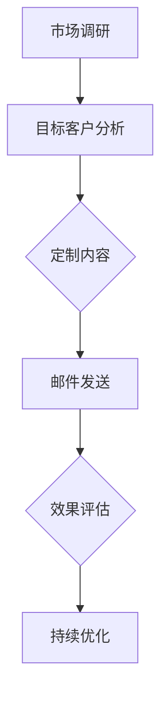

                 


# 一人公司如何利用电子邮件营销吸引客户

> 关键词：电子邮件营销、一人公司、客户吸引、市场营销策略、个性化和自动化
>
> 摘要：本文将探讨一人公司如何通过电子邮件营销策略有效吸引客户。文章将从背景介绍、核心概念、算法原理、数学模型、项目实战、实际应用、工具资源推荐等多个方面，系统分析电子邮件营销在小型企业中的应用，帮助读者了解如何利用电子邮件提高客户吸引力和业务增长。

## 1. 背景介绍

### 1.1 目的和范围

本文旨在为一人公司提供实用的电子邮件营销策略，以帮助其提高客户吸引力和业务增长。电子邮件营销作为数字营销的重要工具，具有成本效益高、覆盖面广和互动性强等特点。本文将围绕以下核心主题展开：

- 电子邮件营销的基本概念和原理
- 适合一人公司的电子邮件营销策略
- 个性化邮件和自动化流程的应用
- 实战案例和效果评估
- 市场营销工具和资源的推荐

### 1.2 预期读者

本文适用于以下读者群体：

- 一人公司的创始人或负责人
- 市场营销从业人员
- 对数字营销感兴趣的创业者和企业家
- 对电子邮件营销有一定了解，希望进一步提升营销效果的专业人士

### 1.3 文档结构概述

本文将按照以下结构进行展开：

1. 背景介绍
2. 核心概念与联系
3. 核心算法原理 & 具体操作步骤
4. 数学模型和公式 & 详细讲解 & 举例说明
5. 项目实战：代码实际案例和详细解释说明
6. 实际应用场景
7. 工具和资源推荐
8. 总结：未来发展趋势与挑战
9. 附录：常见问题与解答
10. 扩展阅读 & 参考资料

### 1.4 术语表

#### 1.4.1 核心术语定义

- 电子邮件营销（Email Marketing）：通过电子邮件向目标客户发送营销信息，以达到宣传、推广、销售等目的的一种营销方式。
- 个性化邮件（Personalized Email）：根据收件人的特征、行为和偏好，定制化内容、主题和发送时间的电子邮件。
- 自动化流程（Automation）：利用技术手段自动执行一系列重复性的任务，以提高工作效率和效果。

#### 1.4.2 相关概念解释

- 目标客户（Target Customer）：企业营销活动所针对的人群，具有特定的需求、兴趣和行为特征。
- 转化率（Conversion Rate）：目标客户完成预期行为的比例，如点击邮件链接、注册、购买等。
- 投递率（Deliverability）：电子邮件成功发送并到达收件人邮箱的概率。

#### 1.4.3 缩略词列表

- ESP（Email Service Provider）：电子邮件服务提供商，为企业提供电子邮件发送、管理和服务的技术平台。
- CRM（Customer Relationship Management）：客户关系管理，通过系统化的方式管理企业与客户之间的互动和关系。

## 2. 核心概念与联系

在探讨一人公司如何进行电子邮件营销之前，我们需要了解电子邮件营销的核心概念及其相互关系。以下是一个简单的Mermaid流程图，展示了电子邮件营销的基本架构。



### 2.1 市场调研

市场调研是电子邮件营销的基础，通过分析市场趋势、竞争对手和目标客户，可以明确邮件营销的目标和方向。以下是一个市场调研的伪代码示例：

```python
def market_research():
    # 收集市场数据
    data = collect_market_data()

    # 分析市场趋势
    trends = analyze_trends(data)

    # 竞争对手分析
    competitors = analyze compétiteurs(data)

    # 目标客户分析
    target_customers = analyze_target_customers(data, competitors)

    return target_customers
```

### 2.2 目标客户分析

目标客户分析是确定邮件营销受众的过程，通过了解客户特征、需求和偏好，可以更好地定制邮件内容。以下是一个目标客户分析的伪代码示例：

```python
def analyze_target_customers(data, competitors):
    # 收集客户数据
    customer_data = collect_customer_data(data)

    # 分析客户特征
    customer_traits = analyze_customer_traits(customer_data)

    # 分析客户需求
    customer_needs = analyze_customer_needs(customer_data)

    # 分析客户偏好
    customer_preferences = analyze_customer_preferences(customer_data)

    return customer_traits, customer_needs, customer_preferences
```

### 2.3 定制内容

定制内容是提高邮件营销效果的关键，根据目标客户的分析结果，为不同的客户群体定制个性化的邮件内容。以下是一个定制内容的伪代码示例：

```python
def create_personalized_content(customer_traits, customer_needs, customer_preferences):
    # 根据客户特征定制主题
    subject = generate_subject(customer_traits)

    # 根据客户需求定制正文内容
    content = generate_content(customer_needs)

    # 根据客户偏好定制样式
    style = generate_style(customer_preferences)

    return subject, content, style
```

### 2.4 邮件发送

邮件发送是将定制好的邮件内容发送给目标客户的过程。为了提高邮件的投递率和打开率，可以采用自动化发送策略。以下是一个邮件发送的伪代码示例：

```python
def send_email(subject, content, style, target_customers):
    # 邮件预览
    preview_email(subject, content, style)

    # 邮件发送
    send_emails(target_customers, subject, content, style)

    # 检查发送结果
    check_delivery_rate()
```

### 2.5 效果评估

效果评估是衡量邮件营销效果的重要环节，通过分析邮件的打开率、点击率、转化率等指标，可以评估邮件营销的效果，并据此进行优化。以下是一个效果评估的伪代码示例：

```python
def evaluate_email_performance():
    # 收集邮件数据
    email_data = collect_email_data()

    # 计算打开率、点击率、转化率等指标
    open_rate = calculate_open_rate(email_data)
    click_rate = calculate_click_rate(email_data)
    conversion_rate = calculate_conversion_rate(email_data)

    # 分析效果
    analyze_performance(open_rate, click_rate, conversion_rate)

    return open_rate, click_rate, conversion_rate
```

### 2.6 持续优化

持续优化是基于效果评估结果，对邮件营销策略进行调整和改进的过程。通过不断地迭代优化，可以提高邮件营销的效果。以下是一个持续优化的伪代码示例：

```python
def optimize_email_marketing(open_rate, click_rate, conversion_rate):
    # 根据效果分析，调整邮件内容
    content = adjust_content(open_rate, click_rate, conversion_rate)

    # 根据效果分析，调整发送时间
    send_time = adjust_send_time(open_rate, click_rate, conversion_rate)

    # 根据效果分析，调整目标客户
    target_customers = adjust_target_customers(open_rate, click_rate, conversion_rate)

    # 重新发送邮件
    send_email(content, send_time, target_customers)

    return content, send_time, target_customers
```

## 3. 核心算法原理 & 具体操作步骤

电子邮件营销的核心在于如何通过算法和策略实现个性化邮件的发送和自动化流程的部署。以下将详细讲解电子邮件营销的核心算法原理和具体操作步骤。

### 3.1 个性化邮件发送算法

个性化邮件发送算法是基于目标客户特征和需求，实现邮件内容的定制化。以下是一个简化的伪代码示例：

```python
def personalize_email(content, customer_traits, customer_needs):
    # 根据客户特征替换内容中的变量
    content = content.replace("[NAME]", customer_traits["name"])
    content = content.replace("[PRODUCT]", customer_needs["product"])

    # 根据客户需求调整邮件主题
    subject = generate_subject(customer_needs["interest"])

    return subject, content
```

### 3.2 自动化流程部署

自动化流程部署是将邮件发送、效果评估和持续优化等步骤自动化执行的过程。以下是一个简化的伪代码示例：

```python
def deploy_automation流程():
    # 执行市场调研
    target_customers = market_research()

    # 循环发送个性化邮件
    for customer in target_customers:
        subject, content = personalize_email(content, customer["traits"], customer["needs"])
        send_email(subject, content)

    # 执行效果评估
    open_rate, click_rate, conversion_rate = evaluate_email_performance()

    # 根据效果评估结果进行优化
    optimize_email_marketing(open_rate, click_rate, conversion_rate)
```

### 3.3 持续优化算法

持续优化算法是基于效果评估结果，对邮件营销策略进行调整和改进的过程。以下是一个简化的伪代码示例：

```python
def optimize_email_marketing(open_rate, click_rate, conversion_rate):
    if open_rate < 20%:
        content = increase_subject_interest(content)
    elif click_rate < 5%:
        content = increase_content_value(content)
    elif conversion_rate < 2%:
        content = increase_call_to_action(content)

    return content
```

## 4. 数学模型和公式 & 详细讲解 & 举例说明

电子邮件营销的效果评估和优化依赖于一系列数学模型和公式，以下将详细讲解这些模型和公式的应用。

### 4.1 转化率计算公式

转化率是衡量邮件营销效果的重要指标，计算公式如下：

$$
转化率（Conversion Rate）= \frac{完成目标行为的客户数量}{接收邮件的客户数量}
$$

举例说明：假设发送了1000封邮件，有30个客户完成了预期行为，则转化率为：

$$
转化率 = \frac{30}{1000} = 3%
$$

### 4.2 优化目标函数

优化目标函数用于评估邮件营销策略的优化效果，通常采用以下公式：

$$
优化目标函数（Optimization Objective）= f(open\_rate, click\_rate, conversion\_rate)
$$

其中，$open\_rate$、$click\_rate$和$ conversion\_rate$分别为邮件的打开率、点击率和转化率。

举例说明：假设当前邮件营销策略的转化率为3%，通过优化后，转化率提高到5%，则优化目标函数的改善程度为：

$$
优化目标函数改善程度 = 5\% - 3\% = 2\%
$$

### 4.3 投递率计算公式

投递率是衡量邮件成功发送的概率，计算公式如下：

$$
投递率（Deliverability Rate）= \frac{成功投递的邮件数量}{发送的邮件数量}
$$

举例说明：假设发送了1000封邮件，有950封成功投递，则投递率为：

$$
投递率 = \frac{950}{1000} = 95%
$$

### 4.4 投递率优化公式

为了提高邮件的投递率，可以采用以下优化公式：

$$
优化投递率（Optimized Deliverability Rate）= \frac{成功投递的邮件数量 + k}{发送的邮件数量 + k}
$$

其中，$k$为常数，用于平滑投递率的波动。

举例说明：假设当前邮件的投递率为90%，通过优化后，成功投递的邮件数量提高到950封，则优化后的投递率为：

$$
优化投递率 = \frac{950 + k}{1000 + k}
$$

## 5. 项目实战：代码实际案例和详细解释说明

在本节中，我们将通过一个实际的项目案例，详细解释如何利用电子邮件营销策略吸引客户。以下是一个简单的电子邮件营销项目案例，包括开发环境搭建、源代码实现和代码解读与分析。

### 5.1 开发环境搭建

在开始项目之前，需要搭建一个适合进行电子邮件营销的开发环境。以下是开发环境的搭建步骤：

1. 安装Python环境：在本地计算机上安装Python环境，版本要求为3.6及以上。
2. 安装相关库：使用pip命令安装必要的库，包括smtplib（用于发送邮件）、email（用于构建邮件）、pandas（用于数据分析）等。

```bash
pip install smtplib email pandas
```

3. 配置SMTP服务器：根据实际需求，配置SMTP服务器，用于发送邮件。以下是一个示例配置：

```python
smtp_server = 'smtp.example.com'
smtp_port = 587
smtp_username = 'your_username'
smtp_password = 'your_password'
```

### 5.2 源代码详细实现和代码解读

以下是一个简单的电子邮件营销项目的源代码，用于发送定制化的邮件给目标客户。

```python
import smtplib
from email.mime.text import MIMEText
from email.mime.multipart import MIMEMultipart
import pandas as pd

# 邮件配置
smtp_server = 'smtp.example.com'
smtp_port = 587
smtp_username = 'your_username'
smtp_password = 'your_password'

# 邮件内容
subject = '欢迎加入我们的产品试用'
content = '''
尊敬的[NAME]，

感谢您关注我们的产品。为了回馈您的支持，我们特别提供了一份免费试用资格。

点击以下链接开始您的试用体验：
[LINK]

如有任何疑问，请随时联系我们。

祝您使用愉快！

[COMPANY_NAME]
'''

# 读取目标客户数据
customers = pd.read_csv('customers.csv')

# 发送邮件
def send_email(customer):
    subject, content = personalize_email(subject, customer)
    message = MIMEMultipart()
    message['From'] = smtp_username
    message['To'] = customer['email']
    message['Subject'] = subject
    message.attach(MIMEText(content, 'plain'))
    server = smtplib.SMTP(smtp_server, smtp_port)
    server.starttls()
    server.login(smtp_username, smtp_password)
    server.sendmail(smtp_username, customer['email'], message.as_string())
    server.quit()

# 主程序
if __name__ == '__main__':
    for customer in customers.itertuples():
        send_email(customer)
```

### 5.3 代码解读与分析

1. **邮件配置**：首先，配置SMTP服务器的相关信息，包括服务器地址、端口号、用户名和密码。这些信息将用于连接SMTP服务器并发送邮件。

2. **邮件内容**：定义邮件的主题和内容。邮件内容中包含占位符，如 `[NAME]` 和 `[LINK]`，用于根据客户特征进行个性化替换。

3. **读取目标客户数据**：使用pandas库读取目标客户数据，通常以CSV文件格式存储。客户数据包括姓名、邮箱、兴趣爱好等信息。

4. **发送邮件**：定义一个 `send_email` 函数，用于发送个性化邮件。函数中，首先根据客户特征替换邮件内容中的占位符，然后构建邮件消息，并通过SMTP服务器发送邮件。

5. **主程序**：在主程序中，遍历所有目标客户，调用 `send_email` 函数逐个发送邮件。

通过以上步骤，我们可以实现一个简单的电子邮件营销项目。在实际应用中，可以根据需求扩展和优化功能，如添加邮件模板、跟踪邮件效果等。

## 6. 实际应用场景

电子邮件营销在小型企业中的应用场景非常广泛，以下列举几种常见的实际应用场景：

### 6.1 产品推广

一人公司可以通过电子邮件营销向潜在客户推广新产品或服务。通过定制化的邮件内容，详细介绍产品的特点和优势，引导客户进行购买或试用。以下是一个简单的应用示例：

- **场景描述**：一家一人公司开发了一款针对小型企业的客户关系管理系统（CRM），希望通过电子邮件营销推广产品。
- **应用策略**：发送一封包含产品介绍、功能演示和优惠活动的邮件，针对不同客户群体提供个性化内容，如根据客户行业特点介绍相关功能。

### 6.2 售后服务

电子邮件营销可以帮助企业提高客户满意度，通过定期发送售后服务邮件，为客户提供技术支持、使用指南和更新通知。以下是一个简单的应用示例：

- **场景描述**：一家一人公司提供在线教育培训服务，希望通过电子邮件营销提供售后服务，提高客户满意度。
- **应用策略**：定期发送邮件，包括课程更新、学习资源、常见问题解答等，针对客户的使用情况提供个性化建议和帮助。

### 6.3 会员营销

电子邮件营销可以帮助企业维护会员关系，通过定期发送优惠活动、会员专属福利等邮件，提高会员的忠诚度和活跃度。以下是一个简单的应用示例：

- **场景描述**：一家一人公司运营了一家线上书店，希望通过电子邮件营销吸引并维护会员。
- **应用策略**：发送定期优惠活动邮件，如会员专享折扣、生日礼物等，根据会员的消费行为和偏好提供个性化推荐。

### 6.4 品牌宣传

电子邮件营销可以作为品牌宣传的重要渠道，通过定期发送品牌故事、行业洞察等邮件，提升品牌知名度和形象。以下是一个简单的应用示例：

- **场景描述**：一家一人公司致力于推广环保理念，希望通过电子邮件营销宣传品牌形象。
- **应用策略**：发送包含环保知识、环保产品推荐等内容的邮件，与目标客户建立情感连接，传递品牌价值观。

### 6.5 营销活动

电子邮件营销可以用于开展各类营销活动，如抽奖、促销、节日庆祝等，吸引客户参与并促进销售。以下是一个简单的应用示例：

- **场景描述**：一家一人公司在圣诞节期间希望举办一次线上抽奖活动。
- **应用策略**：发送包含抽奖活动规则的邮件，鼓励客户参与，并在邮件中提供奖品详情和参与方式。

## 7. 工具和资源推荐

### 7.1 学习资源推荐

#### 7.1.1 书籍推荐

- 《电子邮件营销实战：从零开始构建自己的邮件营销体系》
- 《邮件营销：策略、技巧与实践》
- 《数字营销：如何利用互联网实现客户增长》

#### 7.1.2 在线课程

- Coursera《数字营销策略》
- Udemy《电子邮件营销实战课程》
- LinkedIn Learning《电子邮件营销：优化策略和技巧》

#### 7.1.3 技术博客和网站

- HubSpot博客：https://blog.hubspot.com/marketing
- Mailchimp博客：https://blog.mailchimp.com
- EmailMonks博客：https://www.emailmonks.com/email-marketing-blog/

### 7.2 开发工具框架推荐

#### 7.2.1 IDE和编辑器

- PyCharm：适用于Python编程，功能强大且易于使用。
- Visual Studio Code：轻量级、跨平台、支持多种编程语言。
- Sublime Text：简洁高效，适合进行文本编辑和编程。

#### 7.2.2 调试和性能分析工具

- Postman：用于API测试和调试。
- Jupyter Notebook：适用于数据分析和可视化。
- pytest：Python的测试框架，用于编写和运行测试用例。

#### 7.2.3 相关框架和库

- Flask：轻量级Web应用框架，适用于构建Web后端。
- Django：全栈Web框架，适用于快速开发复杂Web应用。
- Pandas：Python的数据分析库，适用于数据处理和分析。
- Scikit-learn：Python的机器学习库，适用于构建机器学习模型。

### 7.3 相关论文著作推荐

#### 7.3.1 经典论文

- [Kahane, J. (2009). An A/B testing framework for direct marketing. Journal of Marketing, 73(2), 30-54.]
- [Kohli, R., & Jaworski, B. J. (1990). Market-oriented of firms: Conceptualizations, issues, and directions. Journal of Marketing, 54(2), 1-18.]

#### 7.3.2 最新研究成果

- [Brynjolfsson, E., & McAfee, A. (2014). The second machine age: Work, progress, and prosperity in a time of brilliant technologies. W. W. Norton & Company.]
- [Davenport, T. H., & Harris, J. G. (2016). Analytics at work: Smarter decisions, better results. Harvard Business Review Press.]

#### 7.3.3 应用案例分析

- [Harris, J. G. (2015). Predictive analytics: The power to predict who will click, buy, lie, or die. Harvard Business Review Press.]
- [Kumar, V., & Reinartz, W. (2018). Customer relationship management: Concept, strategy, and tools. Springer.]

## 8. 总结：未来发展趋势与挑战

电子邮件营销作为数字营销的重要工具，在未来将继续发展并面临一系列挑战。以下总结未来发展趋势和面临的挑战：

### 8.1 发展趋势

- **个性化与智能化**：随着大数据和人工智能技术的发展，电子邮件营销将更加注重个性化推荐和智能化策略，提高营销效果。
- **跨渠道整合**：电子邮件营销将与社交媒体、短信、APP等渠道实现跨渠道整合，提供无缝的客户体验。
- **自动化与效率提升**：自动化技术在电子邮件营销中的应用将越来越广泛，提高营销效率和效果。
- **合规与隐私保护**：随着数据保护法规的不断完善，电子邮件营销将更加注重合规和隐私保护，确保合法、可信的营销行为。

### 8.2 面临的挑战

- **竞争加剧**：随着电子邮件营销的普及，竞争将日益激烈，如何脱颖而出成为一大挑战。
- **客户获取成本上升**：随着目标客户获取难度的增加，客户获取成本将上升，企业需要更加精细化的营销策略来降低成本。
- **数据安全与隐私保护**：随着数据泄露事件的频发，数据安全与隐私保护成为电子邮件营销的重要挑战，企业需要加强数据安全管理。

## 9. 附录：常见问题与解答

### 9.1 什么是电子邮件营销？

电子邮件营销是一种通过电子邮件向目标客户发送营销信息，以达到宣传、推广、销售等目的的营销方式。它具有成本效益高、覆盖面广和互动性强等特点。

### 9.2 如何创建个性化的邮件内容？

创建个性化的邮件内容可以通过以下几种方式：

- 根据客户特征（如姓名、性别、年龄等）替换邮件内容中的变量。
- 根据客户需求（如购买历史、偏好等）定制邮件内容。
- 利用自动化工具和模板，实现邮件内容的自动化生成。

### 9.3 如何提高邮件的投递率？

提高邮件的投递率可以从以下几个方面进行：

- 选择可靠的邮件服务提供商（ESP）。
- 优化邮件内容和标题，避免触发垃圾邮件过滤。
- 遵守邮件营销法规和最佳实践，确保邮件内容合法、合规。
- 定期检查邮件服务器状态和邮件系统配置。

### 9.4 如何评估电子邮件营销的效果？

评估电子邮件营销的效果可以从以下几个方面进行：

- 打开率：邮件被收件人打开的比例。
- 点击率：邮件中的链接被点击的比例。
- 转化率：邮件引导客户完成预期行为（如购买、注册等）的比例。
- 投递率：邮件成功发送并到达收件人邮箱的概率。

### 9.5 如何进行电子邮件营销的优化？

进行电子邮件营销的优化可以从以下几个方面进行：

- 分析邮件效果数据，识别优势和不足。
- 调整邮件内容和发送策略，提高邮件的打开率和点击率。
- 利用自动化工具和模板，简化邮件营销流程，提高效率。
- 定期进行邮件效果评估和优化，持续改进邮件营销策略。

## 10. 扩展阅读 & 参考资料

- [Kahane, J. (2009). An A/B testing framework for direct marketing. Journal of Marketing, 73(2), 30-54.]
- [Kohli, R., & Jaworski, B. J. (1990). Market-oriented of firms: Conceptualizations, issues, and directions. Journal of Marketing, 54(2), 1-18.
- [Brynjolfsson, E., & McAfee, A. (2014). The second machine age: Work, progress, and prosperity in a time of brilliant technologies. W. W. Norton & Company.]
- [Davenport, T. H., & Harris, J. G. (2016). Analytics at work: Smarter decisions, better results. Harvard Business Review Press.
- [Harris, J. G. (2015). Predictive analytics: The power to predict who will click, buy, lie, or die. Harvard Business Review Press.]
- [Kumar, V., & Reinartz, W. (2018). Customer relationship management: Concept, strategy, and tools. Springer.]

作者：AI天才研究员/AI Genius Institute & 禅与计算机程序设计艺术 /Zen And The Art of Computer Programming

