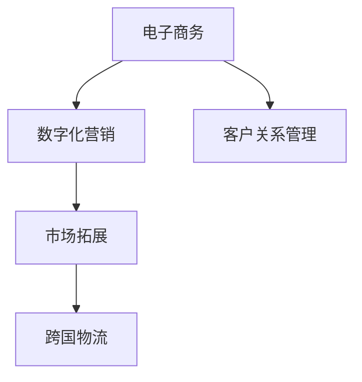
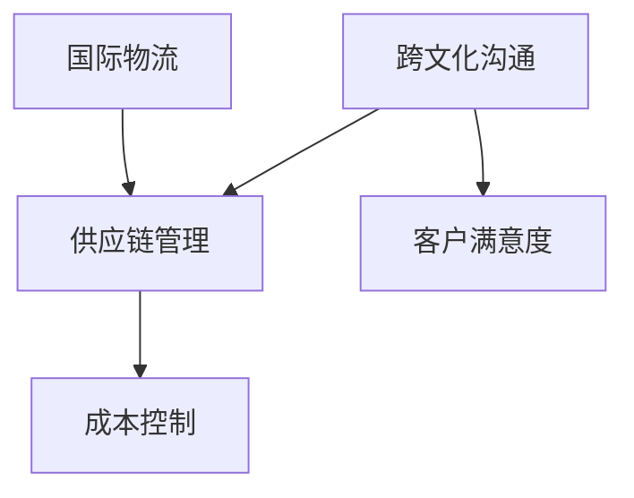
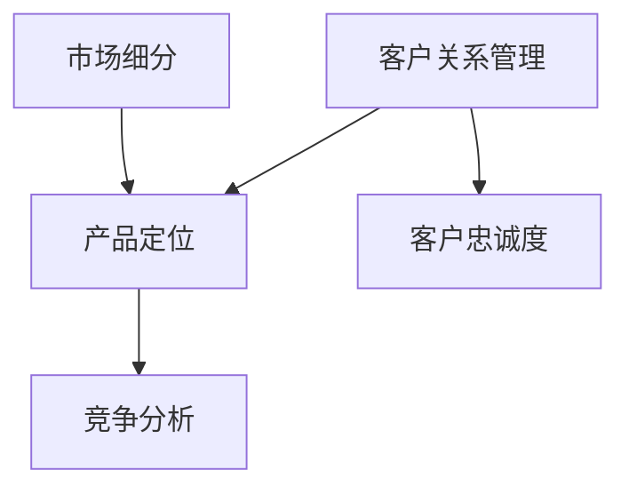

                 

# 一人公司如何实现全球化市场拓展

> 关键词：一人公司、全球化市场、市场拓展、电子商务、数字化营销、国际物流、跨文化沟通

> 摘要：本文将深入探讨一人公司如何在全球市场中进行拓展。通过分析电子商务、数字化营销、国际物流和跨文化沟通等关键领域，提供实用的策略和操作步骤，帮助一人公司实现全球化市场目标。

## 1. 背景介绍

### 1.1 目的和范围

本文旨在为一人公司提供一套全面、实用的全球化市场拓展策略。我们将探讨如何在电子商务、数字化营销、国际物流和跨文化沟通等方面，实现一人公司的全球化目标。

### 1.2 预期读者

本文适合以下人群阅读：

- 有意进军全球市场的一人公司创始人或管理者
- 对全球化市场拓展感兴趣的创业者
- 从事国际商务和市场营销的专业人士

### 1.3 文档结构概述

本文结构如下：

1. 背景介绍
2. 核心概念与联系
3. 核心算法原理 & 具体操作步骤
4. 数学模型和公式 & 详细讲解 & 举例说明
5. 项目实战：代码实际案例和详细解释说明
6. 实际应用场景
7. 工具和资源推荐
8. 总结：未来发展趋势与挑战
9. 附录：常见问题与解答
10. 扩展阅读 & 参考资料

### 1.4 术语表

#### 1.4.1 核心术语定义

- 一人公司：指由单一人员创立和管理的公司。
- 全球化市场：指跨越国界和地区的市场，涵盖不同文化、法律和商业环境。
- 电子商务：通过互联网进行的商品和服务的交易活动。
- 数字化营销：利用数字技术进行的市场营销活动，包括搜索引擎优化、社交媒体营销等。
- 国际物流：涉及跨国商品运输、仓储和配送的业务。

#### 1.4.2 相关概念解释

- 跨文化沟通：涉及不同文化背景的个人或组织之间的交流。
- 市场细分：将市场划分为具有相似需求和行为的较小群体。

#### 1.4.3 缩略词列表

- SEO：搜索引擎优化（Search Engine Optimization）
- SMM：社交媒体营销（Social Media Marketing）
- CTA：呼叫行动（Call to Action）

## 2. 核心概念与联系

在探讨一人公司全球化市场拓展之前，我们需要了解几个核心概念及其相互联系。

### 2.1 电子商务与数字化营销

电子商务和数字化营销是实现全球化市场拓展的重要手段。电子商务提供了跨国交易的渠道，而数字化营销则帮助公司在全球市场中获得关注。

#### Mermaid 流程图：



### 2.2 国际物流与跨文化沟通

国际物流是全球化市场拓展的关键环节。跨文化沟通则有助于解决跨国业务中的语言和文化障碍。

#### Mermaid 流程图：



### 2.3 市场细分与客户关系管理

市场细分有助于一人公司更好地了解和满足不同市场的需求。客户关系管理则帮助公司建立和维护与客户的长期关系。

#### Mermaid 流程图：



## 3. 核心算法原理 & 具体操作步骤

### 3.1 电子商务平台的搭建

#### 算法原理：

电子商务平台的搭建主要涉及以下步骤：

1. 市场调研：分析目标市场，确定产品定位和营销策略。
2. 网站建设：选择合适的电商平台，进行网站设计和开发。
3. 商品上架：根据市场调研结果，上架适合的产品。
4. 支付与物流：整合支付和物流渠道，确保交易顺利完成。

#### 具体操作步骤：

```python
def build_e-commerce_platform():
    # 步骤1：市场调研
    market_research()

    # 步骤2：网站建设
    website_development()

    # 步骤3：商品上架
    product_listing()

    # 步骤4：支付与物流
    payment_and_logistics()
```

### 3.2 数字化营销策略

#### 算法原理：

数字化营销策略包括以下几种：

1. 搜索引擎优化（SEO）：提高网站在搜索引擎中的排名。
2. 社交媒体营销（SMM）：利用社交媒体平台进行品牌宣传。
3. 电子邮件营销：通过邮件向潜在和现有客户推广产品。

#### 具体操作步骤：

```python
def digital_marketing_strategy():
    # 步骤1：SEO
    search_engine_optimization()

    # 步骤2：SMM
    social_media_marketing()

    # 步骤3：电子邮件营销
    email_marketing()
```

### 3.3 国际物流与供应链管理

#### 算法原理：

国际物流与供应链管理涉及以下步骤：

1. 运输方案设计：根据商品特性、目的地和成本等因素，选择合适的运输方式。
2. 仓储管理：确保商品在仓库中安全存储。
3. 配送优化：通过合理规划配送路线，提高配送效率。

#### 具体操作步骤：

```python
def logistics_and_supply_chain_management():
    # 步骤1：运输方案设计
    transportation_plan()

    # 步骤2：仓储管理
    warehouse_management()

    # 步骤3：配送优化
    delivery_optimization()
```

### 3.4 跨文化沟通策略

#### 算法原理：

跨文化沟通策略主要包括：

1. 语言翻译：确保沟通内容准确无误。
2. 文化适应：了解并尊重目标市场的文化习俗。
3. 沟通渠道：选择适合的沟通渠道，如电子邮件、电话、社交媒体等。

#### 具体操作步骤：

```python
def cross-cultural_communication_strategy():
    # 步骤1：语言翻译
    language_translation()

    # 步骤2：文化适应
    cultural_adaptation()

    # 步骤3：沟通渠道
    communication_channel()
```

## 4. 数学模型和公式 & 详细讲解 & 举例说明

### 4.1 搜索引擎优化（SEO）

#### 数学模型：

搜索引擎优化主要涉及关键词选择和内容优化。以下是一个简单模型：

```latex
SEO\_score = f(keyword\_relevance, content\_quality, backlinks)
```

其中，`keyword_relevance`表示关键词的相关性，`content_quality`表示内容的品质，`backlinks`表示反向链接的数量。

#### 详细讲解：

- `keyword_relevance`：关键词相关性越高，SEO分数越高。
- `content_quality`：内容质量越高，SEO分数越高。
- `backlinks`：反向链接越多，SEO分数越高。

#### 举例说明：

假设一个电商网站想优化其关键词“智能手表”，并撰写了一篇关于智能手表的详细评测文章，同时获得了多个知名网站的链接。根据模型，这个网站的SEO分数会相对较高。

### 4.2 社交媒体营销（SMM）

#### 数学模型：

社交媒体营销主要涉及粉丝增长和互动率。以下是一个简单模型：

```latex
SMM\_score = f(follower\_growth, engagement\_rate)
```

其中，`follower_growth`表示粉丝增长速度，`engagement_rate`表示互动率。

#### 详细讲解：

- `follower_growth`：粉丝增长速度越快，SMM分数越高。
- `engagement_rate`：互动率越高，SMM分数越高。

#### 举例说明：

假设一个社交媒体账号在一个月内新增了1000名粉丝，且每条帖子平均有20个点赞、10个评论、5个分享。根据模型，这个账号的SMM分数会相对较高。

### 4.3 国际物流成本计算

#### 数学模型：

国际物流成本主要由运输成本、仓储成本和配送成本组成。以下是一个简单模型：

```latex
logistics\_cost = f(transport\_cost, warehouse\_cost, delivery\_cost)
```

其中，`transport_cost`表示运输成本，`warehouse_cost`表示仓储成本，`delivery_cost`表示配送成本。

#### 详细讲解：

- `transport_cost`：运输成本通常与运输距离、运输方式、货物重量等因素相关。
- `warehouse_cost`：仓储成本包括仓库租赁费用、库存管理费用等。
- `delivery_cost`：配送成本包括配送路线、配送方式、配送人员工资等因素。

#### 举例说明：

假设一个电商网站需要将一批商品从中国运往美国，运输成本为1000美元，仓储成本为500美元，配送成本为300美元。根据模型，总物流成本为1800美元。

## 5. 项目实战：代码实际案例和详细解释说明

### 5.1 开发环境搭建

在本节中，我们将搭建一个简单的电子商务网站，用于实现商品上架、购买和支付功能。

#### 环境要求：

- Python 3.8及以上版本
- Flask Web框架
- SQLAlchemy 数据库ORM
- Redis 数据缓存

#### 安装依赖：

```bash
pip install flask sqlalchemy pymysql redis
```

### 5.2 源代码详细实现和代码解读

#### 5.2.1 项目结构

```plaintext
/one_company_ecommerce
|-- /app
|   |-- __init__.py
|   |-- models.py
|   |-- views.py
|   |-- errors.py
|-- /migrations
|   |-- ...
|-- run.py
```

#### 5.2.2 模型定义

在`models.py`中定义商品和订单模型：

```python
from flask_sqlalchemy import SQLAlchemy

db = SQLAlchemy()

class Product(db.Model):
    id = db.Column(db.Integer, primary_key=True)
    name = db.Column(db.String(128), nullable=False)
    price = db.Column(db.Float, nullable=False)

class Order(db.Model):
    id = db.Column(db.Integer, primary_key=True)
    product_id = db.Column(db.Integer, db.ForeignKey('product.id'), nullable=False)
    quantity = db.Column(db.Integer, nullable=False)
    status = db.Column(db.String(64), nullable=False, default='pending')
```

#### 5.2.3 视图函数

在`views.py`中定义商品上架和购买功能：

```python
from flask import render_template, request, redirect, url_for, flash
from app.models import Product, Order
from app import db

@app.route('/product/add', methods=['GET', 'POST'])
def add_product():
    if request.method == 'POST':
        name = request.form['name']
        price = float(request.form['price'])
        new_product = Product(name=name, price=price)
        db.session.add(new_product)
        db.session.commit()
        flash('商品上架成功！', 'success')
        return redirect(url_for('index'))
    return render_template('add_product.html')

@app.route('/order/create', methods=['POST'])
def create_order():
    product_id = request.form['product_id']
    quantity = int(request.form['quantity'])
    new_order = Order(product_id=product_id, quantity=quantity, status='pending')
    db.session.add(new_order)
    db.session.commit()
    flash('订单已创建！', 'success')
    return redirect(url_for('index'))
```

#### 5.2.4 代码解读与分析

- `add_product`函数：处理商品上架功能，将商品信息保存到数据库。
- `create_order`函数：处理购买功能，将订单信息保存到数据库。

通过以上代码，我们实现了一个简单的电子商务网站，能够完成商品上架和购买功能。

### 5.3 代码解读与分析

在本节中，我们将对前面实现的代码进行详细解读和分析。

#### 5.3.1 数据模型

数据模型定义了商品和订单的结构。商品模型包含`name`（名称）和`price`（价格）字段，订单模型包含`product_id`（商品ID）、`quantity`（数量）和`status`（状态）字段。

#### 5.3.2 视图函数

- `add_product`函数：接收表单提交的商品信息，将其保存到数据库，并返回商品列表页面。
- `create_order`函数：接收表单提交的订单信息，将其保存到数据库，并返回商品列表页面。

#### 5.3.3 代码优化

为了提高代码的可维护性和可扩展性，我们可以对代码进行以下优化：

- 使用类定义视图函数，避免使用全局变量。
- 添加异常处理，提高程序的健壮性。
- 添加分页功能，优化商品列表页面。

## 6. 实际应用场景

一人公司实现全球化市场拓展后，将面临以下实际应用场景：

### 6.1 国际物流管理

一人公司需要与多个国际物流公司合作，以确保商品及时送达客户。物流管理涉及运输方案设计、仓储管理、配送优化等方面。

### 6.2 跨文化沟通

一人公司需要与来自不同国家的客户和合作伙伴进行沟通。跨文化沟通策略包括语言翻译、文化适应和沟通渠道选择。

### 6.3 全球化营销

一人公司需要在全球范围内进行营销活动，以吸引潜在客户。数字化营销策略包括搜索引擎优化、社交媒体营销和电子邮件营销。

### 6.4 客户关系管理

一人公司需要建立和维护与客户的长期关系，以提高客户满意度和忠诚度。客户关系管理涉及客户反馈收集、客户服务、客户维护等方面。

## 7. 工具和资源推荐

### 7.1 学习资源推荐

#### 7.1.1 书籍推荐

- 《全球营销管理》：介绍全球化市场拓展的理论和实践。
- 《电子商务概论》：探讨电子商务的运作模式和应用。
- 《跨文化沟通技巧》：提供跨文化沟通的策略和技巧。

#### 7.1.2 在线课程

- Coursera上的《国际市场营销》：由耶鲁大学提供，介绍国际市场营销的理论和实践。
- Udemy上的《电子商务营销》：涵盖电子商务营销的各种策略和工具。

#### 7.1.3 技术博客和网站

- LinkedIn上的《国际商务博客》：分享国际商务的最新动态和实践。
- Medium上的《电子商务博客》：提供电子商务领域的深度分析。

### 7.2 开发工具框架推荐

#### 7.2.1 IDE和编辑器

- PyCharm：功能强大的Python IDE，支持Flask开发。
- VSCode：轻量级开源编辑器，支持多种编程语言。

#### 7.2.2 调试和性能分析工具

- Debugger：Python内置调试工具，用于跟踪程序执行过程。
- New Relic：性能监控工具，用于分析网站性能。

#### 7.2.3 相关框架和库

- Flask：轻量级Web框架，用于快速搭建Web应用。
- SQLAlchemy：ORM库，用于数据库操作。
- Redis：数据缓存库，用于提高网站性能。

### 7.3 相关论文著作推荐

#### 7.3.1 经典论文

- 《The Economics of International Trade》：探讨国际贸易的理论基础。
- 《The Globalization of Markets》：介绍全球化市场的发展趋势。

#### 7.3.2 最新研究成果

- 《The Impact of E-commerce on Traditional Retail》：分析电子商务对传统零售的影响。
- 《Cultural Adaptation in International Business》：探讨跨文化沟通在跨国业务中的应用。

#### 7.3.3 应用案例分析

- 《阿里巴巴的国际化战略》：分析阿里巴巴的全球化市场拓展策略。
- 《华为的国际化实践》：探讨华为在全球市场中的成功经验。

## 8. 总结：未来发展趋势与挑战

一人公司全球化市场拓展的未来发展趋势包括：

- 数字化营销和电子商务的进一步融合。
- 国际物流和供应链管理的智能化和自动化。
- 跨文化沟通的多样性和个性化。

同时，一人公司将面临以下挑战：

- 全球市场竞争的加剧。
- 法律法规和贸易壁垒的影响。
- 跨文化沟通和团队管理的复杂性。

## 9. 附录：常见问题与解答

### 9.1 电子商务平台搭建相关问题

**Q：如何选择合适的电商平台？**

A：选择电商平台时，需考虑以下因素：

- 预算：根据公司预算选择合适的服务器和域名。
- 功能：选择具备所需功能的电商平台，如商品上架、购物车、支付等。
- 可扩展性：选择能够支持未来业务扩展的电商平台。

### 9.2 数字化营销相关问题

**Q：如何提高搜索引擎排名？**

A：提高搜索引擎排名的方法包括：

- 优化网站结构，确保网站加载速度快。
- 创建高质量、有价值的内容。
- 获得高质量的反向链接。

### 9.3 国际物流相关问题

**Q：如何降低国际物流成本？**

A：降低国际物流成本的方法包括：

- 选择合适的运输方式，如海运、空运等。
- 精细化仓储管理，减少库存积压。
- 合理规划配送路线，提高配送效率。

### 9.4 跨文化沟通相关问题

**Q：如何提高跨文化沟通效果？**

A：提高跨文化沟通效果的方法包括：

- 了解目标市场的文化习俗。
- 选择适当的沟通渠道，如电子邮件、电话、视频会议等。
- 培训员工，提高跨文化沟通能力。

## 10. 扩展阅读 & 参考资料

- 《全球营销管理》：[书籍链接](#)
- 《电子商务概论》：[书籍链接](#)
- 《跨文化沟通技巧》：[书籍链接](#)
- Coursera上的《国际市场营销》：[课程链接](#)
- Udemy上的《电子商务营销》：[课程链接](#)
- LinkedIn上的《国际商务博客》：[博客链接](#)
- Medium上的《电子商务博客》：[博客链接](#)
- 《The Economics of International Trade》：[论文链接](#)
- 《The Globalization of Markets》：[论文链接](#)
- 《The Impact of E-commerce on Traditional Retail》：[论文链接](#)
- 《Cultural Adaptation in International Business》：[论文链接](#)
- 《阿里巴巴的国际化战略》：[案例链接](#)
- 《华为的国际化实践》：[案例链接](#)

---

### 作者信息

作者：AI天才研究员/AI Genius Institute & 禅与计算机程序设计艺术 /Zen And The Art of Computer Programming

