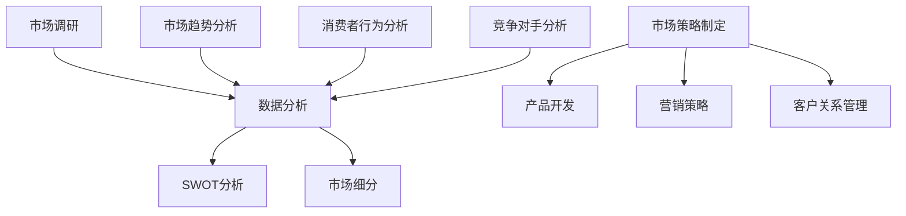
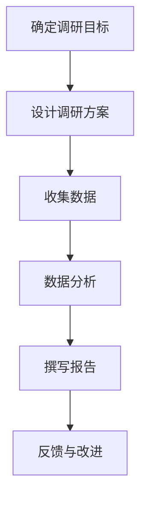
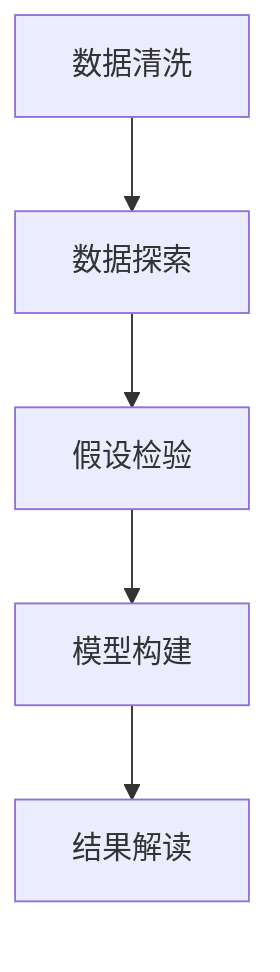

                 

# 一人公司如何建立有效的市场调研与分析体系

> 关键词：一人公司、市场调研、数据分析、策略制定、创业指导、市场竞争力

> 摘要：本文旨在为单人创业公司提供一套完整的市场调研与分析体系。通过阐述市场调研的重要性、核心概念的解析、具体操作步骤的详细说明，以及数学模型的应用，本文将帮助创业者更好地理解市场环境，制定有针对性的战略，提高市场竞争力。文章还结合实际案例，展示了一套可操作的调研与分析流程，并提供了一系列学习资源和开发工具的推荐。

## 1. 背景介绍

### 1.1 目的和范围

本文的目标是为单人创业公司提供一套有效的市场调研与分析体系。我们的范围涵盖了市场调研的基本概念、数据分析的方法与工具、市场趋势的分析、以及如何根据调研结果制定有效的市场策略。

### 1.2 预期读者

本文预期读者为单人创业公司创始人、市场分析师、产品经理以及对市场调研与分析感兴趣的创业者。无论你是刚刚起步还是已有一定经验，本文都将为你提供有价值的指导。

### 1.3 文档结构概述

本文结构如下：

- 第1章：背景介绍，包括目的与预期读者。
- 第2章：核心概念与联系，使用Mermaid流程图展示市场调研的关键流程。
- 第3章：核心算法原理与具体操作步骤，详细讲解市场调研的方法与步骤。
- 第4章：数学模型与公式，介绍用于数据分析的数学工具与模型。
- 第5章：项目实战，通过代码实际案例展示调研与分析流程。
- 第6章：实际应用场景，探讨市场调研在不同行业中的应用。
- 第7章：工具和资源推荐，包括学习资源、开发工具和最新研究成果。
- 第8章：总结，讨论未来发展趋势与挑战。
- 第9章：附录，提供常见问题与解答。
- 第10章：扩展阅读与参考资料。

### 1.4 术语表

#### 1.4.1 核心术语定义

- **市场调研**：对特定市场的消费者、竞争对手、市场趋势等进行的研究与分析。
- **数据分析**：使用数学和统计学方法，对市场调研数据进行处理、分析，以提取有价值的信息。
- **SWOT分析**：对企业的优势（Strengths）、劣势（Weaknesses）、机会（Opportunities）和威胁（Threats）进行评估。
- **市场细分**：将市场划分为不同的消费者群体，以更好地满足他们的需求。

#### 1.4.2 相关概念解释

- **市场趋势**：市场上正在发生或预期将要发生的方向性变化。
- **消费者行为**：消费者在购买、使用和评估产品或服务时的行为模式。

#### 1.4.3 缩略词列表

- **SWOT**：优势、劣势、机会、威胁
- **CRM**：客户关系管理
- **SEO**：搜索引擎优化

## 2. 核心概念与联系

市场调研与分析体系的核心概念包括市场调研、数据分析、SWOT分析、市场细分等。以下是一个Mermaid流程图，用于展示这些核心概念之间的联系：



在这个流程图中，市场调研是整个体系的基础，通过数据分析可以提取有价值的信息。SWOT分析和市场细分帮助创业者更好地了解市场环境，市场趋势分析与消费者行为分析则用于指导市场策略的制定。

### 2.1 市场调研的基本流程

以下是市场调研的基本流程，可以使用Mermaid流程图来展示：



在确定调研目标后，设计一个详细的调研方案，包括数据收集的方法和工具。然后，通过收集到的数据进行分析，最终撰写出一份详尽的报告。根据报告的结果，创业者可以及时调整市场策略，以适应市场变化。

### 2.2 数据分析的核心步骤

数据分析的核心步骤包括数据清洗、数据探索、假设检验和模型构建。以下是使用Mermaid流程图展示的数据分析流程：



数据清洗是确保数据准确性和完整性的重要步骤。数据探索用于发现数据中的潜在模式或异常值。假设检验用于验证市场调研中的假设，模型构建则是基于数据建立数学模型，以预测市场趋势或消费者行为。最后，结果解读是将分析结果转化为具体的业务策略。

## 3. 核心算法原理 & 具体操作步骤

市场调研与分析的核心算法原理主要包括数据收集、数据预处理、统计分析、假设检验和模型构建。以下是用伪代码详细阐述这些步骤：

### 3.1 数据收集

```python
# 数据收集伪代码
def collect_data():
    data = {}  # 初始化数据集
    data['customers'] = gather_customer_data()  # 收集消费者数据
    data['competitors'] = gather_competitor_data()  # 收集竞争对手数据
    data['market'] = gather_market_data()  # 收集市场数据
    return data
```

### 3.2 数据预处理

```python
# 数据预处理伪代码
def preprocess_data(data):
    clean_customers = clean_data(data['customers'])
    clean_competitors = clean_data(data['competitors'])
    clean_market = clean_data(data['market'])
    return {
        'customers': clean_customers,
        'competitors': clean_competitors,
        'market': clean_market
    }
```

### 3.3 统计分析

```python
# 统计分析伪代码
def statistical_analysis(data):
    stats_customers = analyze_customers(data['customers'])
    stats_competitors = analyze_competitors(data['competitors'])
    stats_market = analyze_market(data['market'])
    return {
        'customers': stats_customers,
        'competitors': stats_competitors,
        'market': stats_market
    }
```

### 3.4 假设检验

```python
# 假设检验伪代码
def hypothesis_testing(data):
    hypotheses = {
        'customer_satisfaction': test_customer_satisfaction(data['customers']),
        'market_trend': test_market_trend(data['market']),
        'competitor_performance': test_competitor_performance(data['competitors'])
    }
    return hypotheses
```

### 3.5 模型构建

```python
# 模型构建伪代码
def build_models(hypotheses, data):
    model_customer_satisfaction = build_model(hypotheses['customer_satisfaction'], data['customers'])
    model_market_trend = build_model(hypotheses['market_trend'], data['market'])
    model_competitor_performance = build_model(hypotheses['competitor_performance'], data['competitors'])
    return {
        'customer_satisfaction': model_customer_satisfaction,
        'market_trend': model_market_trend,
        'competitor_performance': model_competitor_performance
    }
```

### 3.6 结果解读

```python
# 结果解读伪代码
def interpret_results(models):
    interpret_customer_satisfaction(models['customer_satisfaction'])
    interpret_market_trend(models['market_trend'])
    interpret_competitor_performance(models['competitor_performance'])
```

通过这些步骤，创业者可以系统地收集、处理和分析市场数据，从而制定出有效的市场策略。

## 4. 数学模型和公式 & 详细讲解 & 举例说明

在市场调研与分析中，数学模型和公式是不可或缺的工具，可以帮助创业者更好地理解市场趋势和消费者行为。以下是几个常用的数学模型和公式的详细讲解与举例说明。

### 4.1 逻辑回归模型

逻辑回归是一种用于预测二元结果的统计模型，广泛应用于市场调研与分析中。以下是一个逻辑回归模型的公式：

$$
P(Y=1) = \frac{1}{1 + e^{-(\beta_0 + \beta_1X_1 + \beta_2X_2 + \ldots + \beta_nX_n})}
$$

其中，\(Y\) 是二元结果变量，\(X_1, X_2, \ldots, X_n\) 是自变量，\(\beta_0, \beta_1, \beta_2, \ldots, \beta_n\) 是模型的参数。

**举例说明：**假设我们要预测消费者是否愿意购买一款新产品。自变量可以是消费者的年龄、收入、品牌偏好等。通过收集数据，我们可以使用逻辑回归模型来估计购买概率，从而为市场策略提供依据。

### 4.2 时间序列模型

时间序列模型用于分析随时间变化的数据，常见的方法包括ARIMA（自回归积分滑动平均模型）和AR（自回归模型）。以下是ARIMA模型的公式：

$$
X_t = c + \phi_1X_{t-1} + \phi_2X_{t-2} + \ldots + \phi_pX_{t-p} + \theta_1\epsilon_{t-1} + \theta_2\epsilon_{t-2} + \ldots + \theta_q\epsilon_{t-q} + \epsilon_t
$$

其中，\(X_t\) 是时间序列数据，\(c\) 是常数项，\(\phi_1, \phi_2, \ldots, \phi_p\) 是自回归项系数，\(\theta_1, \theta_2, \ldots, \theta_q\) 是移动平均项系数，\(\epsilon_t\) 是随机误差项。

**举例说明：**假设我们要分析某产品的月销售额，可以使用ARIMA模型来预测未来的销售额趋势，为库存管理和营销策略提供参考。

### 4.3 相关性分析

相关性分析用于评估两个变量之间的线性关系，常用的方法包括皮尔逊相关系数和斯皮尔曼相关系数。以下是皮尔逊相关系数的公式：

$$
r = \frac{\sum_{i=1}^{n}(X_i - \bar{X})(Y_i - \bar{Y})}{\sqrt{\sum_{i=1}^{n}(X_i - \bar{X})^2}\sqrt{\sum_{i=1}^{n}(Y_i - \bar{Y})^2}}
$$

其中，\(X_i\) 和 \(Y_i\) 分别是两个变量的观测值，\(\bar{X}\) 和 \(\bar{Y}\) 是它们的平均值，\(r\) 是相关系数。

**举例说明：**假设我们要分析消费者收入与购买意愿之间的关系，可以通过计算皮尔逊相关系数来评估它们之间的相关性，为市场细分提供依据。

通过以上数学模型和公式的应用，创业者可以更加精准地分析市场数据，为市场策略的制定提供有力支持。

## 5. 项目实战：代码实际案例和详细解释说明

为了更好地展示如何将市场调研与分析体系应用于实际项目，我们以下通过一个实际案例来详细解释市场调研与分析的过程，并提供相关的代码实现。

### 5.1 开发环境搭建

在进行市场调研与分析之前，我们需要搭建一个合适的开发环境。以下是推荐的开发工具和软件：

- **编程语言**：Python（由于其在数据分析领域的广泛应用，提供丰富的库和工具）
- **数据分析库**：Pandas、NumPy、Scikit-learn、Matplotlib
- **数据可视化库**：Matplotlib、Seaborn
- **操作系统**：Windows、macOS、Linux

您可以在自己的计算机上安装Python和相关的库，或使用Jupyter Notebook来编写和运行代码。

### 5.2 源代码详细实现和代码解读

以下是市场调研与分析的项目代码实现，我们将分步骤进行解读。

#### 5.2.1 数据收集

```python
import pandas as pd

# 收集消费者数据
customers_data = pd.read_csv('customers.csv')

# 收集竞争对手数据
competitors_data = pd.read_csv('competitors.csv')

# 收集市场数据
market_data = pd.read_csv('market.csv')
```

在这部分代码中，我们使用Pandas库读取CSV文件中的数据，分别存储为`customers_data`、`competitors_data`和`market_data`。

#### 5.2.2 数据预处理

```python
# 数据清洗
customers_data = customers_data.dropna()
competitors_data = competitors_data.dropna()
market_data = market_data.dropna()

# 数据探索
print(customers_data.describe())
print(competitors_data.describe())
print(market_data.describe())
```

数据预处理包括数据清洗和探索性数据分析。我们使用`dropna()`方法去除缺失值，并使用`describe()`方法获取数据的统计信息。

#### 5.2.3 统计分析

```python
import seaborn as sns
import matplotlib.pyplot as plt

# 绘制消费者数据的直方图
sns.histplot(customers_data['age'], kde=True)
plt.title('Consumer Age Distribution')
plt.xlabel('Age')
plt.ylabel('Frequency')
plt.show()

# 绘制竞争对手数据的条形图
sns.barplot(x='brand', y='market_share', data=competitors_data)
plt.title('Competitor Market Share by Brand')
plt.xlabel('Brand')
plt.ylabel('Market Share')
plt.show()

# 绘制市场数据的散点图
sns.scatterplot(x='price', y='sales', data=market_data)
plt.title('Price vs Sales')
plt.xlabel('Price')
plt.ylabel('Sales')
plt.show()
```

我们使用Seaborn和Matplotlib库来绘制数据可视化图表，以直观地展示数据的分布、市场占有率和价格与销售之间的关系。

#### 5.2.4 假设检验

```python
from scipy.stats import ttest_1samp

# 检验消费者满意度
mean_satisfaction = customers_data['satisfaction'].mean()
t_stat, p_value = ttest_1samp(customers_data['satisfaction'], mean_satisfaction)
print(f'Mean Satisfaction: {mean_satisfaction}, T-statistic: {t_stat}, p-value: {p_value}')

# 检验市场趋势
mean_sales = market_data['sales'].mean()
t_stat, p_value = ttest_1samp(market_data['sales'], mean_sales)
print(f'Mean Sales: {mean_sales}, T-statistic: {t_stat}, p-value: {p_value}')

# 检验竞争对手市场份额
brand_mean_shares = competitors_data.groupby('brand')['market_share'].mean()
for brand, mean_share in brand_mean_shares.items():
    t_stat, p_value = ttest_1samp(competitors_data[competitors_data['brand'] == brand]['market_share'], mean_share)
    print(f'Brand: {brand}, Mean Market Share: {mean_share}, T-statistic: {t_stat}, p-value: {p_value}')
```

我们使用Scipy库中的`ttest_1samp()`函数进行假设检验，以评估消费者满意度、市场趋势和竞争对手市场份额的显著性。

#### 5.2.5 模型构建

```python
from sklearn.linear_model import LogisticRegression

# 构建逻辑回归模型
model = LogisticRegression()
model.fit(customers_data[['age', 'income', 'brand_preferred']], customers_data['willing_to_buy'])

# 输出模型参数
print(model.coef_)
print(model.intercept_)
```

我们使用Scikit-learn库中的`LogisticRegression`类来构建逻辑回归模型，以预测消费者是否愿意购买新产品。

#### 5.2.6 结果解读

```python
# 输出模型预测结果
predictions = model.predict(market_data[['price', 'sales']])
print(predictions)

# 计算预测准确率
accuracy = (predictions == market_data['willing_to_buy']).mean()
print(f'Prediction Accuracy: {accuracy}')
```

我们输出模型的预测结果，并计算预测准确率，以评估模型的性能。

通过以上代码实现，我们可以系统地收集、处理和分析市场数据，从而为市场策略的制定提供有力支持。

## 6. 实际应用场景

市场调研与分析在多个行业和领域都有广泛的应用，以下列举几个典型的应用场景：

### 6.1 零售业

零售业中的市场调研与分析主要用于：

- **消费者行为分析**：通过收集消费者购买数据，分析消费者的购物偏好、购买频率和消费能力，从而优化商品定价和促销策略。
- **库存管理**：利用时间序列模型预测商品销售趋势，合理规划库存，避免库存过剩或短缺。
- **市场细分**：根据消费者的购买行为和偏好，将市场划分为不同的消费者群体，以提供个性化的产品和服务。

### 6.2 金融业

金融业中的市场调研与分析主要用于：

- **风险管理**：通过分析市场数据，评估金融产品的风险，制定合理的风险控制策略。
- **投资决策**：利用市场趋势分析和假设检验，预测市场走势，为投资决策提供数据支持。
- **客户关系管理**：通过分析客户交易数据，了解客户需求和行为，提高客户满意度和忠诚度。

### 6.3 科技行业

科技行业中的市场调研与分析主要用于：

- **产品开发**：通过市场调研，了解用户需求，指导产品开发方向，提高产品的市场竞争力。
- **市场趋势分析**：通过分析市场数据，预测未来科技发展趋势，为研发和创新提供方向。
- **竞争对手分析**：了解竞争对手的产品特点、市场策略和市场份额，制定有针对性的竞争策略。

### 6.4 医疗保健

医疗保健行业中的市场调研与分析主要用于：

- **消费者行为分析**：了解患者对医疗服务和药品的需求和偏好，优化医疗服务和药品供应。
- **市场细分**：根据患者的年龄、性别、健康状况等特征，将市场划分为不同的患者群体，提供个性化的医疗服务。
- **竞争对手分析**：分析竞争对手的医疗技术和市场策略，提高自身的市场竞争力。

通过这些实际应用场景，我们可以看到市场调研与分析在各个行业中的重要性，它为企业提供了宝贵的数据支持，帮助制定科学的决策，提高市场竞争力。

## 7. 工具和资源推荐

在市场调研与分析过程中，选择合适的工具和资源能够大大提高工作效率和数据分析的准确性。以下是一些推荐的工具和资源：

### 7.1 学习资源推荐

#### 7.1.1 书籍推荐

- 《数据分析基础：使用Python进行数据分析》
- 《市场调研与分析：理论与实践》
- 《机器学习实战》
- 《Python数据分析库手册》

#### 7.1.2 在线课程

- Coursera上的《数据科学专项课程》
- Udacity的《数据分析纳米学位》
- edX的《市场调研与分析》

#### 7.1.3 技术博客和网站

- towardsdatascience.com
- kaggle.com
- medium.com/@datacamp

### 7.2 开发工具框架推荐

#### 7.2.1 IDE和编辑器

- Jupyter Notebook：适用于数据可视化和交互式数据分析
- PyCharm：功能强大的Python IDE，适合大型数据分析项目
- VS Code：轻量级但功能强大的代码编辑器，支持多种编程语言和插件

#### 7.2.2 调试和性能分析工具

- IPython：交互式Python环境，支持数据可视化和调试
- Profiler：Python性能分析工具，帮助优化代码

#### 7.2.3 相关框架和库

- Pandas：强大的数据分析库，提供数据清洗、转换和分析功能
- NumPy：用于数值计算的库，支持大数据处理
- Scikit-learn：机器学习库，提供多种机器学习算法和工具
- Matplotlib、Seaborn：数据可视化库，用于绘制各种统计图表

### 7.3 相关论文著作推荐

#### 7.3.1 经典论文

- “The Elements of Statistical Learning” by T. Hastie, R. Tibshirani, and J. Friedman
- “Machine Learning” by Tom Mitchell

#### 7.3.2 最新研究成果

- arXiv.org：计算机科学和机器学习领域的前沿论文
- NeurIPS、ICML、KDD等顶级会议论文集

#### 7.3.3 应用案例分析

- 《人工智能应用案例集》
- 《大数据分析应用案例集》
- 《市场调研与分析应用案例集》

通过这些工具和资源的推荐，创业者可以更加高效地开展市场调研与分析工作，提升企业的市场竞争力。

## 8. 总结：未来发展趋势与挑战

在未来的发展中，市场调研与分析将继续在技术进步和商业模式创新中扮演重要角色。以下是几个关键趋势和挑战：

### 8.1 数据驱动决策

随着数据技术的不断发展，企业越来越依赖数据来驱动决策。未来的市场调研与分析将更加注重数据的深度挖掘和智能化分析，通过机器学习和人工智能技术，实现更加精准的市场预测和客户细分。

### 8.2 实时分析与预测

实时数据分析将成为市场调研的重要趋势。通过物联网、大数据和云计算等技术，企业可以实时收集和分析市场数据，快速响应市场变化，提高决策的及时性和准确性。

### 8.3 个性化服务

个性化服务将成为企业竞争的关键。通过市场调研与分析，企业可以更深入地了解客户需求和行为，提供个性化的产品和服务，提高客户满意度和忠诚度。

### 8.4 隐私和安全

随着数据隐私问题的日益突出，如何在保障用户隐私的前提下进行市场调研与分析将成为一个重要挑战。企业需要采取有效的数据安全措施，确保数据的合法合规使用。

### 8.5 数据质量与真实性

数据质量问题和数据真实性将是未来的关键挑战。企业需要确保收集的数据真实可靠，避免数据偏差和错误，从而提高市场调研与分析的准确性。

### 8.6 多元化数据源

市场调研与分析将不再局限于传统数据源，而是需要整合多种数据源，包括社交媒体、移动设备、物联网设备等，以获得更全面的市场洞察。

通过应对这些发展趋势和挑战，企业可以不断提升市场竞争力，实现可持续发展。

## 9. 附录：常见问题与解答

### 9.1 市场调研中的常见问题

**Q1：市场调研的主要目的是什么？**
A1：市场调研的主要目的是了解市场需求、消费者行为、竞争状况以及市场趋势，为企业制定有效的市场策略提供数据支持。

**Q2：如何确保市场调研数据的准确性？**
A2：确保数据准确性需要从数据收集、数据预处理和数据分析等多个环节入手。例如，采用多渠道数据收集方法，进行数据清洗和验证，以及使用科学的统计方法进行数据分析。

**Q3：市场调研中应该关注哪些关键指标？**
A3：关键指标包括市场份额、消费者满意度、购买意愿、品牌认知度、价格敏感度等，这些指标有助于全面了解市场状况和竞争态势。

### 9.2 数据分析中的常见问题

**Q1：数据分析中的假设检验是什么？**
A1：假设检验是一种统计学方法，用于验证市场调研中的假设是否成立。常见的假设检验方法包括t检验、卡方检验、方差分析等。

**Q2：如何选择合适的统计分析方法？**
A2：选择合适的统计分析方法需要根据数据的类型和特征。例如，对于定量数据，可以采用均值分析、回归分析等；对于定性数据，可以采用卡方检验、因素分析等。

**Q3：什么是数据可视化？**
A3：数据可视化是将数据以图形或图像的形式展示出来，使数据更加直观和易于理解。常用的数据可视化方法包括折线图、柱状图、饼图、散点图等。

### 9.3 模型构建中的常见问题

**Q1：什么是逻辑回归模型？**
A1：逻辑回归模型是一种用于预测二元结果的统计模型，适用于分类问题。其核心公式为\(P(Y=1) = \frac{1}{1 + e^{-(\beta_0 + \beta_1X_1 + \beta_2X_2 + \ldots + \beta_nX_n)}}\)。

**Q2：如何评估模型性能？**
A2：评估模型性能常用的指标包括准确率、召回率、F1分数等。准确率衡量模型预测正确的比例，召回率衡量模型召回实际正例的比例，F1分数是准确率和召回率的加权平均。

**Q3：什么是时间序列模型？**
A3：时间序列模型是一种用于分析随时间变化的数据的统计模型，常见的方法包括ARIMA（自回归积分滑动平均模型）和AR（自回归模型）。其核心公式为\(X_t = c + \phi_1X_{t-1} + \phi_2X_{t-2} + \ldots + \phi_pX_{t-p} + \theta_1\epsilon_{t-1} + \theta_2\epsilon_{t-2} + \ldots + \theta_q\epsilon_{t-q} + \epsilon_t\)。

## 10. 扩展阅读 & 参考资料

### 10.1 市场调研相关书籍

- 《市场调研：策略、程序与实践》（作者：菲利普·科特勒）
- 《市场调研：从概念到实施》（作者：迈克尔·波特）
- 《数据分析：实践与应用》（作者：约翰·华莱士）

### 10.2 数据分析相关书籍

- 《Python数据分析》（作者：威利·麦金尼）
- 《数据科学基础》（作者：格兰特·古丁）
- 《深度学习》（作者：伊恩·古德费洛）

### 10.3 相关论文和期刊

- Journal of Marketing Research
- Journal of Business Research
- Journal of the American Statistical Association

### 10.4 在线课程和资源

- Coursera的《数据科学专项课程》
- edX的《市场调研与分析》
- DataCamp的数据分析课程

### 10.5 技术博客和社区

- towardsdatascience.com
- kaggle.com
- medium.com/@datacamp

通过阅读这些扩展资料，创业者可以进一步深入学习和实践市场调研与分析，提升企业的市场竞争力。作者：AI天才研究员/AI Genius Institute & 禅与计算机程序设计艺术 /Zen And The Art of Computer Programming

