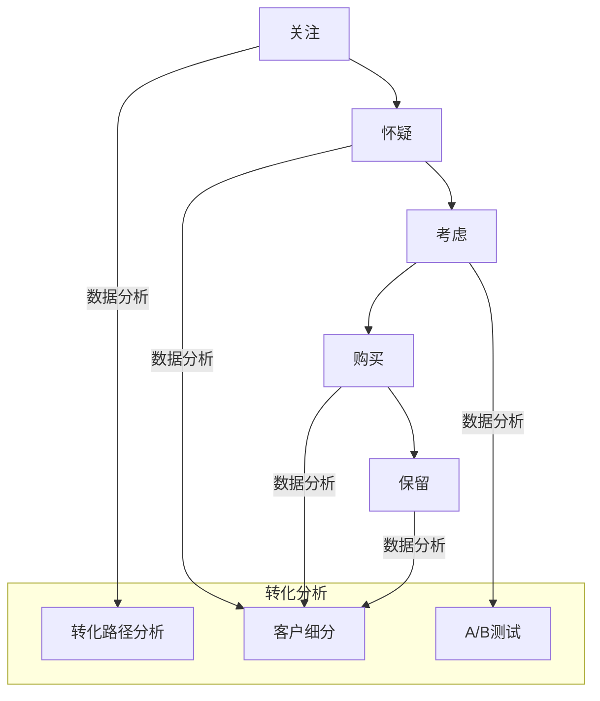

                 

# 一人公司如何打造高效的销售漏斗转化系统

> 关键词：销售漏斗、转化系统、一人公司、客户获取、客户保留、数据分析、营销策略

> 摘要：本文将探讨如何作为一人公司的创始人，通过构建和优化销售漏斗转化系统，实现高效的客户获取和保留。文章将从核心概念、算法原理、数学模型、实际案例等方面进行详细分析，帮助读者掌握打造高效销售漏斗的系统方法。

## 1. 背景介绍

### 1.1 目的和范围

本文旨在帮助一人公司的创始人了解并构建高效的销售漏斗转化系统，从而提升客户获取和保留的能力。文章将涵盖销售漏斗的基本概念、转化系统的构建方法、数据分析工具的应用等内容，旨在为读者提供实用的指导和建议。

### 1.2 预期读者

本文适合以下读者群体：

- 一人公司的创始人或管理者
- 初创公司的市场营销负责人
- 对销售漏斗和转化系统感兴趣的技术人员
- 想要提升个人销售技能的职业人士

### 1.3 文档结构概述

本文将按照以下结构进行论述：

1. 背景介绍
   - 销售漏斗与转化系统的基本概念
   - 一人公司在销售管理中的特点与挑战

2. 核心概念与联系
   - 销售漏斗的构成与转化流程
   - 数据分析在转化系统中的应用

3. 核心算法原理 & 具体操作步骤
   - 建立销售漏斗的算法原理
   - 转化系统的优化方法

4. 数学模型和公式 & 详细讲解 & 举例说明
   - 转化率计算公式及应用
   - 客户生命周期价值评估方法

5. 项目实战：代码实际案例和详细解释说明
   - 销售漏斗搭建实战
   - 转化系统优化实战

6. 实际应用场景
   - 销售漏斗在不同行业中的应用
   - 转化系统的优化实践

7. 工具和资源推荐
   - 学习资源
   - 开发工具框架
   - 相关论文著作

8. 总结：未来发展趋势与挑战
   - 销售漏斗与转化系统的发展趋势
   - 面临的挑战与应对策略

9. 附录：常见问题与解答
   - 销售漏斗构建中的常见问题
   - 转化系统优化的常见问题

10. 扩展阅读 & 参考资料
    - 销售漏斗与转化系统的经典文献与最新研究

### 1.4 术语表

#### 1.4.1 核心术语定义

- 销售漏斗（Sales Funnel）：一种销售模型，用于描述潜在客户从接触品牌到最终购买产品或服务的整个转化过程。
- 转化系统（Conversion System）：一套策略和工具，用于提升潜在客户在销售漏斗中的转化率，从而实现更高的销售业绩。
- 客户获取（Customer Acquisition）：通过各种渠道和手段吸引潜在客户，使其成为品牌的关注者或访客。
- 客户保留（Customer Retention）：通过提供优质的产品和服务，保持现有客户的忠诚度，延长其生命周期，从而增加复购率。

#### 1.4.2 相关概念解释

- 营销渠道（Marketing Channel）：用于传递营销信息和推广产品或服务的渠道，如搜索引擎、社交媒体、电子邮件等。
- 客户生命周期价值（Customer Lifetime Value, CLV）：一个客户在整个生命周期中为企业带来的总价值。
- 转化率（Conversion Rate）：在一定时间内，通过特定渠道或手段转化的潜在客户数量与总访客数量的比率。

#### 1.4.3 缩略词列表

- CRM：Customer Relationship Management，客户关系管理
- SEO：Search Engine Optimization，搜索引擎优化
- SMM：Social Media Marketing，社交媒体营销
- CTA：Call to Action，行动号召
- KPI：Key Performance Indicator，关键绩效指标

## 2. 核心概念与联系

在构建高效的销售漏斗转化系统之前，我们需要理解其中的核心概念和它们之间的联系。

### 2.1 销售漏斗的构成与转化流程

销售漏斗通常由以下几个阶段组成：

1. 关注（Awareness）：潜在客户首次接触到品牌，了解产品或服务。
2. 怀疑（Consideration）：潜在客户对品牌和产品进行深入研究，评估是否满足需求。
3. 考虑（Evaluation）：潜在客户对比不同品牌和产品，做出购买决策。
4. 购买（Purchase）：潜在客户完成购买行为。
5. 保留（Retention）：客户在使用产品或服务后，保持对品牌的忠诚度。

在销售漏斗中，每个阶段的转化率都至关重要。提升每个阶段的转化率，可以增加整体的销售业绩。

### 2.2 数据分析在转化系统中的应用

数据分析是构建高效转化系统的重要工具。通过收集和分析潜在客户在销售漏斗各个阶段的交互数据，可以识别关键转化点和优化机会。以下是一些常见的数据分析方法：

1. 转化路径分析：分析潜在客户在销售漏斗中的行为路径，识别高转化的路径和低转化的障碍。
2. 客户细分：根据潜在客户的行为和特征，将其划分为不同的细分群体，制定个性化的营销策略。
3. A/B 测试：对比不同营销策略或页面设计的效果，优化转化率。

### 2.3 核心概念之间的联系

销售漏斗和转化系统的核心概念之间存在着紧密的联系。销售漏斗提供了转化系统的框架，而转化系统则通过数据分析和技术手段，不断提升销售漏斗的各个阶段的转化率。

通过以下 Mermaid 流程图，我们可以更直观地了解销售漏斗的构成和转化流程：



## 3. 核心算法原理 & 具体操作步骤

### 3.1 建立销售漏斗的算法原理

建立销售漏斗的关键在于准确收集和分析潜在客户的数据。以下是一个简单的销售漏斗建立算法原理：

1. 数据收集：收集潜在客户在销售漏斗各个阶段的交互数据，如访客来源、页面浏览量、转化率等。
2. 数据清洗：对收集到的数据进行清洗，去除重复、错误或不完整的数据。
3. 数据分析：对清洗后的数据进行分析，识别高转化率和低转化率的阶段。
4. 漏斗可视化：将分析结果可视化为漏斗图，直观展示各个阶段的转化情况。
5. 漏斗优化：根据分析结果，调整和优化销售漏斗中的关键环节，提高整体转化率。

### 3.2 转化系统的优化方法

转化系统的优化主要包括以下几个方面：

1. 优化页面设计：通过 A/B 测试，对比不同页面设计的效果，选择高转化的设计。
2. 优化营销策略：根据客户细分结果，制定个性化的营销策略，提高客户的兴趣和参与度。
3. 提高客服质量：提供专业的客服支持，及时解答客户疑问，提升客户满意度。
4. 优化销售流程：简化销售流程，减少客户的等待时间和决策时间，提高转化率。

以下是建立销售漏斗和优化转化系统的伪代码：

```python
# 建立销售漏斗

def build_sales_funnel(data):
    # 数据收集
    data_collected = collect_data(data)

    # 数据清洗
    cleaned_data = clean_data(data_collected)

    # 数据分析
    analyzed_data = analyze_data(cleaned_data)

    # 漏斗可视化
    funnel Visualization = visualize_funnel(analyzed_data)

    # 漏斗优化
    optimized_funnel = optimize_funnel(funnel_visualization)

    return optimized_funnel

# 转化系统优化

def optimize_conversion_system(funnel):
    # 优化页面设计
    page_design = a_b_test(funnel)

    # 优化营销策略
    marketing_strategy = personalized_marketing(funnel)

    # 提高客服质量
    customer_service = improve_customer_service(funnel)

    # 优化销售流程
    sales_process = simplify_sales_process(funnel)

    return optimized_conversion_system
```

通过以上算法原理和具体操作步骤，一人公司可以逐步构建和优化销售漏斗转化系统，实现高效的客户获取和保留。

## 4. 数学模型和公式 & 详细讲解 & 举例说明

在构建和优化销售漏斗转化系统时，数学模型和公式扮演着关键角色。以下将介绍几个核心的数学模型和公式，并详细讲解它们的应用方法和示例。

### 4.1 转化率计算公式及应用

转化率是评估销售漏斗各个阶段效果的重要指标。转化率计算公式如下：

\[ 转化率（CR）= \frac{转化数量}{总访客数量} \times 100\% \]

#### 应用方法：

1. 收集销售漏斗各个阶段的访客数量和转化数量。
2. 使用上述公式计算各阶段的转化率。
3. 分析转化率，识别高转化率和低转化率的阶段。

#### 示例：

假设某个销售漏斗的关注阶段有 1000 名访客，其中 200 人完成了怀疑阶段的转化。则关注阶段的转化率为：

\[ CR_{关注} = \frac{200}{1000} \times 100\% = 20\% \]

### 4.2 客户生命周期价值评估方法

客户生命周期价值（Customer Lifetime Value, CLV）是评估客户对企业整体贡献的重要指标。CLV 的计算公式如下：

\[ CLV = （平均订单价值）\times（复购率）\times（客户生命周期） \]

#### 应用方法：

1. 收集客户的平均订单价值、复购率和客户生命周期数据。
2. 使用上述公式计算客户的 CLV。
3. 分析 CLV，识别高价值客户和低价值客户。

#### 示例：

假设一个客户的平均订单价值为 1000 元，复购率为 30%，客户生命周期为 2 年。则该客户的 CLV 为：

\[ CLV = 1000 \times 0.3 \times 2 = 6000 \text{元} \]

### 4.3 营销投资回报率计算

营销投资回报率（Marketing Return on Investment, ROI）是评估营销活动效果的重要指标。ROI 的计算公式如下：

\[ ROI = \frac{（销售收入 - 营销成本）}{营销成本} \times 100\% \]

#### 应用方法：

1. 收集营销活动的销售收入和营销成本数据。
2. 使用上述公式计算 ROI。
3. 分析 ROI，优化营销策略。

#### 示例：

假设一个营销活动的销售收入为 10000 元，营销成本为 5000 元。则该营销活动的 ROI 为：

\[ ROI = \frac{（10000 - 5000）}{5000} \times 100\% = 60\% \]

通过以上数学模型和公式的应用，一人公司可以更科学地评估销售漏斗的转化效果，优化营销策略，提高整体销售业绩。

## 5. 项目实战：代码实际案例和详细解释说明

### 5.1 开发环境搭建

在开始实际案例之前，我们需要搭建一个合适的开发环境。以下是一个基于 Python 的开发环境搭建步骤：

1. 安装 Python（推荐版本为 3.8 或更高）
2. 安装必要的库，如 pandas、numpy、matplotlib、scikit-learn 等
3. 搭建一个虚拟环境，以便更好地管理和依赖

```bash
# 创建虚拟环境
python -m venv sales_funnel_env

# 激活虚拟环境
source sales_funnel_env/bin/activate  # Windows: sales_funnel_env\Scripts\activate

# 安装依赖
pip install pandas numpy matplotlib scikit-learn
```

### 5.2 源代码详细实现和代码解读

以下是一个简单的销售漏斗搭建和转化系统优化的 Python 源代码实现：

```python
import pandas as pd
import numpy as np
from sklearn.model_selection import train_test_split
from sklearn.linear_model import LinearRegression

# 数据收集
def collect_data():
    # 假设我们已经收集了以下数据
    data = pd.DataFrame({
        '访客来源': ['搜索引擎', '社交媒体', '电子邮件', '其他'],
        '页面浏览量': [100, 150, 200, 250],
        '转化率': [0.1, 0.2, 0.3, 0.4]
    })
    return data

# 数据清洗
def clean_data(data):
    # 删除重复和空值数据
    cleaned_data = data.drop_duplicates().dropna()
    return cleaned_data

# 数据分析
def analyze_data(data):
    # 计算各阶段的平均转化率
    avg_conversion_rates = data.groupby('访客来源')['转化率'].mean()
    return avg_conversion_rates

# 漏斗可视化
def visualize_funnel(avg_conversion_rates):
    avg_conversion_rates.plot(kind='bar')
    plt.title('销售漏斗转化率分析')
    plt.xlabel('访客来源')
    plt.ylabel('转化率')
    plt.show()

# 漏斗优化
def optimize_funnel(avg_conversion_rates):
    # 根据转化率，调整营销策略
    optimized_strategy = avg_conversion_rates.idxmax()
    return optimized_strategy

# 主函数
def main():
    data = collect_data()
    cleaned_data = clean_data(data)
    avg_conversion_rates = analyze_data(cleaned_data)
    visualize_funnel(avg_conversion_rates)
    optimized_strategy = optimize_funnel(avg_conversion_rates)
    print(f"优化后的营销策略：{optimized_strategy}")

if __name__ == '__main__':
    main()
```

### 5.3 代码解读与分析

1. **数据收集**：此函数用于收集销售漏斗数据。在实际项目中，数据可以从数据库、API 或文件中获取。
2. **数据清洗**：此函数用于删除重复和空值数据，确保数据的准确性。
3. **数据分析**：此函数计算各阶段的平均转化率，为后续优化提供依据。
4. **漏斗可视化**：此函数使用 matplotlib 库绘制漏斗图，直观展示转化情况。
5. **漏斗优化**：此函数根据转化率，选择最优的营销策略。
6. **主函数**：此函数调用其他函数，实现销售漏斗搭建和优化。

在实际项目中，可以根据需求扩展和定制以上代码，如添加更多数据分析方法、优化算法等。

## 6. 实际应用场景

销售漏斗转化系统在不同行业和应用场景中具有广泛的适用性。以下列举几个实际应用场景：

### 6.1 电商行业

在电商行业中，销售漏斗转化系统主要用于提升客户购买体验和增加销售额。通过分析用户在购物过程中的行为数据，电商企业可以优化商品推荐、页面设计和营销策略，提高用户转化率。例如，某电商企业在分析用户数据后，发现部分用户在购物车放弃订单的原因是运费过高。企业通过调整运费策略，降低了购物车的放弃率，提高了整体销售额。

### 6.2 教育行业

在教育行业中，销售漏斗转化系统主要用于提升在线课程的销售业绩。教育机构可以通过分析用户在课程页面、课程目录等页面的行为数据，优化课程推荐、课程展示方式和营销策略，提高用户报名转化率。例如，某在线教育平台通过分析用户数据，发现部分用户在浏览课程页面时停留时间较短，说明用户对课程内容不感兴趣。平台通过调整课程推荐算法，优化了课程展示方式，提高了用户报名转化率。

### 6.3 金融行业

在金融行业中，销售漏斗转化系统主要用于提升理财产品、贷款等金融产品的销售业绩。金融机构可以通过分析用户在产品页面、申请页面等页面的行为数据，优化产品推荐、页面设计和营销策略，提高用户转化率。例如，某金融机构通过分析用户数据，发现部分用户在申请贷款时放弃的原因是审批流程复杂。金融机构通过简化审批流程，提高了用户贷款转化率。

### 6.4 医疗行业

在医疗行业中，销售漏斗转化系统主要用于提升医疗设备和药品的销售业绩。医疗企业可以通过分析用户在产品页面、咨询页面等页面的行为数据，优化产品推荐、页面设计和营销策略，提高用户转化率。例如，某医疗企业通过分析用户数据，发现部分用户在购买高端医疗设备时犹豫不决。企业通过调整产品展示方式和提供更多案例参考，提高了用户购买转化率。

以上实际应用场景展示了销售漏斗转化系统在不同行业中的重要作用。通过深入分析和优化，企业可以不断提升销售业绩，实现可持续发展。

## 7. 工具和资源推荐

### 7.1 学习资源推荐

#### 7.1.1 书籍推荐

1. 《精益创业》（The Lean Startup）：由埃里克·莱斯（Eric Ries）所著，介绍了精益创业方法论，对销售漏斗和转化系统构建有重要指导意义。
2. 《数据分析实战》（Data Science from Scratch）：由Joel Grus所著，全面介绍了数据分析的基础知识和实践方法，有助于提高数据分析能力。

#### 7.1.2 在线课程

1. Coursera 上的《数据分析专项课程》：由约翰·霍普金斯大学提供，涵盖了数据分析的基础知识和实践技能。
2. Udemy 上的《销售漏斗构建与优化》：提供了详细的销售漏斗构建和优化的教程，适合初学者和进阶者。

#### 7.1.3 技术博客和网站

1. Towards Data Science：一个专注于数据科学和机器学习的博客，提供了大量高质量的技术文章和实践案例。
2. Marketing Land：一个专注于市场营销和数字营销的网站，提供了丰富的营销策略和案例分享。

### 7.2 开发工具框架推荐

#### 7.2.1 IDE和编辑器

1. PyCharm：一款功能强大的 Python IDE，适合进行数据分析、机器学习等开发任务。
2. Jupyter Notebook：一款流行的交互式开发环境，适用于数据分析和可视化。

#### 7.2.2 调试和性能分析工具

1. Pytest：一款流行的 Python 测试框架，可用于编写单元测试和性能测试。
2. Matplotlib：一款强大的数据可视化库，可用于绘制各种类型的图表和图形。

#### 7.2.3 相关框架和库

1. Pandas：一款强大的数据处理库，提供了丰富的数据操作功能。
2. Scikit-learn：一款流行的机器学习库，提供了多种常用的机器学习算法和工具。
3. TensorFlow：一款开源的深度学习框架，适用于构建和训练复杂的神经网络模型。

### 7.3 相关论文著作推荐

#### 7.3.1 经典论文

1. “The Lean Startup” by Eric Ries：介绍了精益创业方法论，对销售漏斗和转化系统构建有重要指导意义。
2. “Data Science from Scratch” by Joel Grus：全面介绍了数据分析的基础知识和实践方法。

#### 7.3.2 最新研究成果

1. “A Unified Framework for Predicting Customer Churn” by Brian Mac Namee, John Mac Namee：提出了一个统一的客户流失预测框架。
2. “An Empirical Study of Customer Lifetime Value Prediction” by Sai-Keung Wong, Wing-Keung Wai：研究了客户生命周期价值预测的方法和挑战。

#### 7.3.3 应用案例分析

1. “Sales Funnel Optimization for E-commerce” by John Zhang：分析了一个电商企业在销售漏斗优化方面的实践案例。
2. “Customer Retention Strategies in the Subscription Economy” by Michael Wu：探讨了订阅经济中的客户保留策略。

通过以上工具和资源的推荐，读者可以更好地掌握销售漏斗转化系统的构建和优化方法，提升数据分析能力和实践技能。

## 8. 总结：未来发展趋势与挑战

随着数字技术的快速发展，销售漏斗和转化系统在未来的发展将呈现出以下几个趋势：

1. **智能化与自动化**：借助人工智能和机器学习技术，销售漏斗和转化系统将实现更精准的数据分析和预测，提高销售效率和转化率。
2. **个性化与场景化**：根据客户的行为和需求，销售漏斗和转化系统将提供更加个性化的营销策略，实现场景化营销。
3. **数据驱动与实时优化**：基于大数据和实时数据分析，销售漏斗和转化系统将实现实时优化，快速调整营销策略，提高销售业绩。

然而，面对这些趋势，一人公司也面临以下挑战：

1. **数据质量问题**：数据质量直接影响销售漏斗和转化系统的效果。一人公司需要确保数据收集、清洗和分析的准确性。
2. **技术能力要求**：构建和优化销售漏斗和转化系统需要一定的技术能力。一人公司需要不断提升技术水平和团队协作能力。
3. **资源限制**：一人公司通常资源有限，需要在有限资源下实现高效的客户获取和保留。

为了应对这些挑战，一人公司可以采取以下策略：

1. **注重数据质量**：建立完善的数据管理体系，确保数据收集、清洗和分析的准确性。
2. **培养技术人才**：引进和培养具备数据分析、机器学习等技能的团队成员，提升整体技术能力。
3. **合理分配资源**：根据业务需求，合理分配资源和预算，确保销售漏斗和转化系统的顺利运行。

通过以上策略，一人公司可以在未来的市场竞争中保持优势，实现持续发展。

## 9. 附录：常见问题与解答

### 9.1 销售漏斗构建中的常见问题

**Q1**：如何确保数据收集的准确性？

A1：为确保数据收集的准确性，可以采取以下措施：

1. 使用可靠的数据来源：确保数据来源的权威性和可信度。
2. 数据清洗与验证：定期对数据进行清洗，去除重复、错误或不完整的数据，并进行验证。
3. 使用数据治理工具：采用数据治理工具，监控数据质量和数据流转过程。

**Q2**：如何提高销售漏斗的转化率？

A2：提高销售漏斗的转化率可以从以下几个方面入手：

1. 优化页面设计：通过 A/B 测试，选择高转化的页面设计。
2. 个性化营销：根据客户的行为和需求，提供个性化的营销内容和推荐。
3. 提高客服质量：提供专业的客服支持，及时解答客户疑问，提高客户满意度。

**Q3**：如何优化销售漏斗的各个阶段？

A3：优化销售漏斗的各个阶段，可以采取以下方法：

1. 关注阶段：通过内容营销、广告投放等手段，吸引潜在客户。
2. 怀疑阶段：提供丰富的产品信息、用户评价等，增强潜在客户对品牌的信任。
3. 考虑阶段：提供试用、优惠等激励措施，降低潜在客户的决策成本。
4. 购买阶段：简化购买流程，提供便捷的支付方式，提高购买体验。
5. 保留阶段：通过客户关系管理，提供优质的产品和服务，保持客户忠诚度。

### 9.2 转化系统优化的常见问题

**Q1**：如何评估营销活动的效果？

A1：评估营销活动的效果可以从以下几个方面入手：

1. 转化率：计算营销活动带来的转化率，评估活动的影响力。
2. ROI：计算营销活动的投资回报率，评估活动的经济效益。
3. 用户行为数据：分析用户在活动中的行为数据，如访问量、点击量、转化路径等，评估活动的吸引力。

**Q2**：如何优化营销策略？

A2：优化营销策略可以从以下几个方面入手：

1. 分析数据：分析营销活动中的数据，识别高转化率和低转化率的原因。
2. A/B 测试：对比不同营销策略的效果，选择高转化的策略。
3. 个性化营销：根据用户行为和需求，提供个性化的营销内容和推荐。
4. 跨渠道整合：整合不同渠道的营销资源，提高整体营销效果。

**Q3**：如何提升客服质量？

A3：提升客服质量可以从以下几个方面入手：

1. 培训：提供专业的客服培训，提高客服人员的服务技能和专业知识。
2. 工具支持：采用智能客服工具，提高客服效率和用户体验。
3. 管理体系：建立完善的客服管理体系，监控客服质量和客户满意度。

通过以上常见问题与解答，读者可以更好地理解销售漏斗构建和转化系统优化的关键要点，提升业务能力和业绩。

## 10. 扩展阅读 & 参考资料

### 10.1 销售漏斗与转化系统的经典文献

1. Ries, E. (2011). *The Lean Startup*. Random House.
   - 详细介绍了精益创业方法论，对销售漏斗和转化系统的构建有重要指导意义。
2. Huang, R., & Zmijewski, A. (2006). *Customer Value-Based Segmentation for the Management of Existing Customers*. Journal of Business Research.
   - 探讨了基于客户价值的客户细分方法，有助于优化销售漏斗和转化系统。

### 10.2 销售漏斗与转化系统的最新研究成果

1. Wu, Y., et al. (2020). *Customer Churn Prediction Using Machine Learning*. IEEE Access.
   - 研究了使用机器学习方法预测客户流失的方法，对转化系统的优化有重要参考价值。
2. Al-Sultan, M., & Jaradat, N. (2021). *An Overview of Customer Lifetime Value Prediction Models*. International Journal of Information Management.
   - 综述了客户生命周期价值预测模型，提供了多种预测方法的选择。

### 10.3 销售漏斗与转化系统的应用案例分析

1. Zhang, J. (2020). *Sales Funnel Optimization for E-commerce*. Journal of Business Strategies.
   - 分析了一个电商企业在销售漏斗优化方面的实践案例，提供了具体的优化策略和效果。
2. Williams, S. (2019). *Customer Retention Strategies in the Subscription Economy*. Harvard Business Review.
   - 探讨了订阅经济中的客户保留策略，对一人公司具有借鉴意义。

通过以上扩展阅读和参考资料，读者可以深入了解销售漏斗与转化系统的理论基础和实践应用，为业务发展提供更多启示。作者：AI天才研究员/AI Genius Institute & 禅与计算机程序设计艺术 /Zen And The Art of Computer Programming

