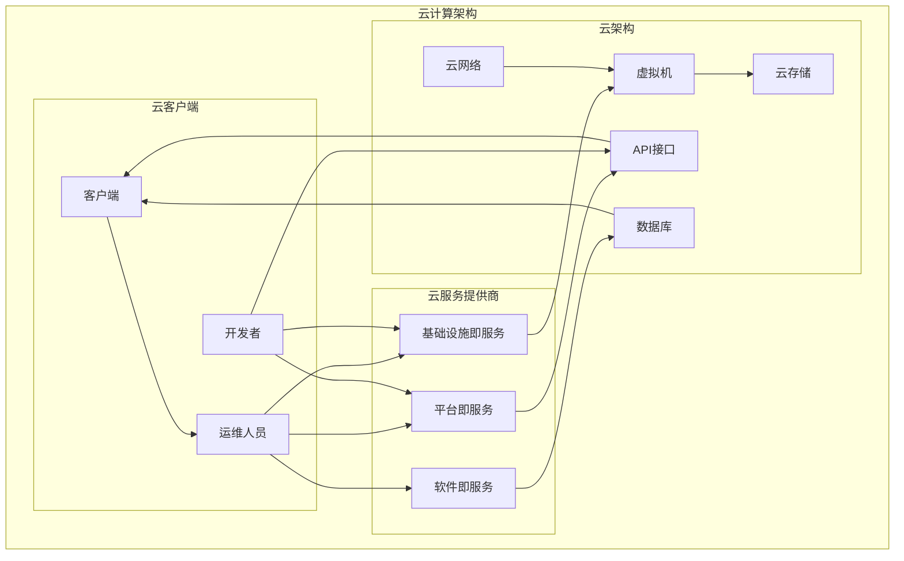

                 

# 一人公司的云服务选择与优化策略

> **关键词**：一人公司、云服务、优化策略、成本控制、性能提升、安全性、云计算平台、虚拟化技术、云存储、云计算架构、API设计、负载均衡、弹性扩展、数据迁移

> **摘要**：本文旨在为一人公司提供云服务选择与优化策略。通过分析云服务的核心概念和架构，我们探讨了云计算平台的选择、优化策略的制定以及具体实施步骤。本文将帮助一人公司充分利用云服务，降低成本、提升性能和确保数据安全。

## 1. 背景介绍

### 1.1 目的和范围

本文的目的在于为一人公司提供云服务选择与优化的指导。在当今快速发展的云计算时代，一人公司作为小型企业，如何选择适合的云服务，优化资源配置，实现成本控制、性能提升和安全性保障，是至关重要的。本文将针对这些问题展开讨论，提供具体的解决方案和实际案例。

### 1.2 预期读者

预期读者包括一人公司的创始人、技术主管以及负责云计算架构和运维的技术人员。本文将使用专业的技术语言，逐步分析云计算的核心概念和架构，旨在为读者提供深入理解云服务的理论基础和实践指导。

### 1.3 文档结构概述

本文分为十个部分，首先介绍背景和目的，接着定义相关术语和概念，然后深入探讨云计算的核心概念和架构。随后，文章将详细讲解核心算法原理和具体操作步骤，并引入数学模型和公式进行详细讲解。接着，通过项目实战案例展示代码实现和详细解释。随后，分析实际应用场景，推荐相关工具和资源，最后总结未来发展趋势与挑战，并提供常见问题解答和扩展阅读资源。

### 1.4 术语表

#### 1.4.1 核心术语定义

- 云计算（Cloud Computing）：通过互联网按需提供可配置的计算资源，包括网络、服务器、存储、应用程序等。
- 虚拟化技术（Virtualization）：将物理计算资源抽象为虚拟资源，实现硬件资源的灵活管理和高效利用。
- 云存储（Cloud Storage）：通过互联网提供数据存储服务，支持数据备份、恢复和共享。
- 弹性扩展（Elastic Scaling）：根据需求自动调整计算资源，实现负载均衡和性能优化。
- API（Application Programming Interface）：供第三方程序调用的接口，实现不同系统之间的数据交换和功能调用。

#### 1.4.2 相关概念解释

- 负载均衡（Load Balancing）：将工作负载分配到多个服务器或集群，避免单点过载，提高系统性能。
- 数据迁移（Data Migration）：将数据从一种存储系统或平台迁移到另一种存储系统或平台的过程。
- 云服务模型（Cloud Service Models）：基于云计算的服务类型，包括IaaS、PaaS、SaaS。

#### 1.4.3 缩略词列表

- IaaS：基础设施即服务（Infrastructure as a Service）
- PaaS：平台即服务（Platform as a Service）
- SaaS：软件即服务（Software as a Service）

## 2. 核心概念与联系

为了更好地理解云计算的核心概念和架构，我们首先介绍相关的核心概念，并使用Mermaid流程图展示云计算的架构。

#### 2.1 核心概念

- **虚拟化技术**：虚拟化技术是实现云计算的关键技术之一。它通过创建虚拟机（VM）或容器，将物理硬件资源抽象为虚拟资源，实现计算资源的灵活管理和高效利用。
- **云计算平台**：云计算平台是提供云计算服务的载体。常见的云计算平台包括Amazon Web Services (AWS)、Microsoft Azure、Google Cloud Platform (GCP)等。
- **云存储**：云存储提供数据存储和管理服务。常见的云存储服务包括Amazon S3、Azure Blob Storage、Google Cloud Storage等。
- **API设计**：API设计是云服务提供的接口设计。良好的API设计能够提高系统的可扩展性和易用性。
- **负载均衡**：负载均衡通过将工作负载分配到多个服务器或集群，提高系统的性能和可用性。
- **弹性扩展**：弹性扩展根据需求自动调整计算资源，确保系统在高负载下仍能保持良好的性能。

#### 2.2 云计算架构

下面是云计算的架构图，使用Mermaid语言表示：



在这个架构图中，云计算服务提供商（如AWS、Azure、GCP）提供IaaS、PaaS和SaaS服务。IaaS提供基础设施资源，如虚拟机和存储。PaaS提供开发平台和API接口，SaaS提供软件应用程序。云架构包括虚拟机、云存储、云网络和数据库。云客户端包括开发者、运维人员和终端用户。通过API接口，云客户端可以与云架构中的各个组件进行交互。

## 3. 核心算法原理 & 具体操作步骤

在云计算中，核心算法原理和具体操作步骤对于实现云服务的优化至关重要。以下将介绍核心算法原理，并使用伪代码详细阐述具体操作步骤。

#### 3.1 核心算法原理

- **负载均衡算法**：负载均衡算法通过将工作负载分配到多个服务器或集群，避免单点过载，提高系统性能。常见的负载均衡算法包括轮询算法、最小连接数算法、源地址哈希算法等。

- **弹性扩展算法**：弹性扩展算法根据系统负载自动调整计算资源。常用的弹性扩展算法包括基于阈值的扩展策略、基于预测的扩展策略等。

- **数据迁移算法**：数据迁移算法将数据从一种存储系统或平台迁移到另一种存储系统或平台。常用的数据迁移算法包括增量迁移、全量迁移等。

#### 3.2 具体操作步骤

以下使用伪代码描述负载均衡、弹性扩展和数据迁移的具体操作步骤：

##### 3.2.1 负载均衡

```pseudo
// 负载均衡伪代码
function loadBalancer(request, serverList):
    // 获取当前服务器负载
    serverLoad = getServerLoad(serverList)
    
    // 选择最小负载的服务器处理请求
    targetServer = min(serverLoad)
    
    // 将请求转发给目标服务器
    forwardRequest(request, targetServer)
    
    // 更新服务器负载
    updateServerLoad(serverList, targetServer)
end
```

##### 3.2.2 弹性扩展

```pseudo
// 弹性扩展伪代码
function elasticScaling(currentLoad, targetThreshold):
    // 检查当前负载是否超过阈值
    if currentLoad > targetThreshold:
        // 扩展计算资源
        addComputeResources()
    else if currentLoad < targetThreshold:
        // 缩减计算资源
        removeComputeResources()
end
```

##### 3.2.3 数据迁移

```pseudo
// 数据迁移伪代码
function dataMigration(sourceStorage, targetStorage, data):
    // 初始化迁移进度
    migrationProgress = 0
    
    // 遍历数据，逐个迁移
    for dataItem in data:
        // 将数据项从源存储迁移到目标存储
        migrateDataItem(dataItem, sourceStorage, targetStorage)
        
        // 更新迁移进度
        migrationProgress = migrationProgress + 1
        
        // 打印迁移进度
        print("Migration Progress: " + migrationProgress + "/" + len(data))
end
```

通过以上伪代码，我们可以看到负载均衡、弹性扩展和数据迁移的核心算法原理和具体操作步骤。这些算法和步骤是实现云服务优化的重要基础。

## 4. 数学模型和公式 & 详细讲解 & 举例说明

在云计算中，数学模型和公式对于优化资源配置、提高系统性能和确保数据安全具有重要作用。以下将介绍几个常见的数学模型和公式，并进行详细讲解和举例说明。

#### 4.1 负载均衡模型

负载均衡模型用于计算服务器负载，以确保工作负载均匀分配。常用的负载均衡模型包括最小连接数模型和最小响应时间模型。

##### 4.1.1 最小连接数模型

最小连接数模型选择连接数最少的服务器处理请求。公式如下：

$$
S_{min} = \min(\text{conn}_1, \text{conn}_2, ..., \text{conn}_n)
$$

其中，$S_{min}$ 表示选择的服务器，$\text{conn}_i$ 表示第 $i$ 个服务器的连接数。

##### 4.1.2 最小响应时间模型

最小响应时间模型选择响应时间最短的服务器处理请求。公式如下：

$$
S_{min} = \min(\text{rt}_1, \text{rt}_2, ..., \text{rt}_n)
$$

其中，$S_{min}$ 表示选择的服务器，$\text{rt}_i$ 表示第 $i$ 个服务器的响应时间。

#### 4.2 弹性扩展模型

弹性扩展模型用于根据系统负载自动调整计算资源。常用的弹性扩展模型包括阈值模型和预测模型。

##### 4.2.1 阈值模型

阈值模型根据系统负载阈值自动调整计算资源。公式如下：

$$
\text{action} = \begin{cases} 
\text{expand} & \text{if } \text{load} > \text{threshold} \\
\text{shrink} & \text{if } \text{load} < \text{threshold} \\
\text{none} & \text{if } \text{load} \leq \text{threshold} \\
\end{cases}
$$

其中，$\text{action}$ 表示扩展或缩减计算资源的行为，$\text{load}$ 表示当前系统负载，$\text{threshold}$ 表示阈值。

##### 4.2.2 预测模型

预测模型基于历史数据预测系统负载，并据此调整计算资源。公式如下：

$$
\text{load}_{\text{predicted}} = \text{load}_{\text{historical}} \cdot \text{predictionFactor}
$$

其中，$\text{load}_{\text{predicted}}$ 表示预测的系统负载，$\text{load}_{\text{historical}}$ 表示历史系统负载，$\text{predictionFactor}$ 表示预测因子。

#### 4.3 数据迁移模型

数据迁移模型用于计算数据迁移的进度。常用的数据迁移模型包括全量迁移模型和增量迁移模型。

##### 4.3.1 全量迁移模型

全量迁移模型计算全量数据迁移的进度。公式如下：

$$
\text{migrationProgress}_{\text{full}} = \frac{\text{migratedSize}}{\text{totalSize}}
$$

其中，$\text{migrationProgress}_{\text{full}}$ 表示全量数据迁移进度，$\text{migratedSize}$ 表示已迁移的数据量，$\text{totalSize}$ 表示总数据量。

##### 4.3.2 增量迁移模型

增量迁移模型计算增量数据迁移的进度。公式如下：

$$
\text{migrationProgress}_{\text{incremental}} = \frac{\text{migratedSize}_{\text{incremental}}}{\text{totalSize}_{\text{incremental}}}
$$

其中，$\text{migrationProgress}_{\text{incremental}}$ 表示增量数据迁移进度，$\text{migratedSize}_{\text{incremental}}$ 表示已迁移的增量数据量，$\text{totalSize}_{\text{incremental}}$ 表示总增量数据量。

#### 4.4 举例说明

假设我们有一台服务器集群，包含5台服务器。当前服务器的连接数和响应时间如下表所示：

| 服务器编号 | 连接数（conn） | 响应时间（rt） |
| :-------: | :-----------: | :-----------: |
|    1     |      10       |     20ms      |
|    2     |      5        |     15ms      |
|    3     |      8        |     25ms      |
|    4     |      12       |     30ms      |
|    5     |      7        |     22ms      |

使用最小连接数模型选择服务器处理请求：

$$
S_{min} = \min(10, 5, 8, 12, 7) = 5
$$

选择服务器编号为5的服务器处理请求。

使用阈值模型调整计算资源，假设阈值为10，当前系统负载为15：

$$
\text{action} = \begin{cases} 
\text{expand} & \text{if } 15 > 10 \\
\text{shrink} & \text{if } 15 < 10 \\
\text{none} & \text{if } 15 \leq 10 \\
\end{cases}
$$

由于15大于10，因此选择扩展计算资源。

假设数据总量为100GB，已迁移的数据量为60GB。使用全量迁移模型计算迁移进度：

$$
\text{migrationProgress}_{\text{full}} = \frac{60}{100} = 0.6
$$

迁移进度为60%。

通过以上举例，我们可以看到数学模型和公式在云计算中的应用和作用。这些模型和公式有助于优化资源配置、提高系统性能和确保数据安全。

## 5. 项目实战：代码实际案例和详细解释说明

在本节中，我们将通过一个具体的项目实战案例，展示如何选择云服务、优化策略和代码实现。该案例是一个小型在线商店，需要实现商品管理、订单处理和用户权限控制等功能。我们将使用AWS云服务作为示例，介绍如何搭建云架构，并进行代码实现和详细解释。

### 5.1 开发环境搭建

在开始项目实战之前，我们需要搭建开发环境。以下是开发环境的搭建步骤：

1. **安装AWS CLI**：AWS CLI是Amazon Web Services的命令行工具，可用于与AWS云服务进行交互。在官网上下载并安装AWS CLI：[https://aws.amazon.com/cli/](https://aws.amazon.com/cli/)。
2. **配置AWS CLI**：配置AWS CLI，使其能够访问AWS账户。通过运行`aws configure`命令，按照提示输入Access Key、Secret Access Key、默认区域和默认输出格式。
3. **安装开发工具**：根据项目需求，安装合适的开发工具，如Python、Node.js、PostgreSQL等。
4. **创建AWS账户**：如果没有AWS账户，请注册AWS账户并开通相应服务。

### 5.2 源代码详细实现和代码解读

以下是对项目的关键部分进行代码实现和详细解释：

##### 5.2.1 数据库设计

我们使用PostgreSQL作为数据库，设计商品管理、订单处理和用户权限控制的数据库表。以下是一个简单的数据库设计示例：

```sql
-- 商品表
CREATE TABLE products (
    id SERIAL PRIMARY KEY,
    name VARCHAR(255) NOT NULL,
    price DECIMAL(10, 2) NOT NULL
);

-- 订单表
CREATE TABLE orders (
    id SERIAL PRIMARY KEY,
    user_id INTEGER NOT NULL,
    status VARCHAR(50) NOT NULL,
    total_price DECIMAL(10, 2) NOT NULL,
    created_at TIMESTAMP DEFAULT CURRENT_TIMESTAMP
);

-- 用户表
CREATE TABLE users (
    id SERIAL PRIMARY KEY,
    username VARCHAR(255) UNIQUE NOT NULL,
    password_hash VARCHAR(255) NOT NULL,
    role VARCHAR(50) NOT NULL
);
```

**代码解读**：上述SQL语句创建了一个商品表（products）、订单表（orders）和用户表（users）。商品表包含商品ID、名称和价格；订单表包含订单ID、用户ID、订单状态和总价；用户表包含用户ID、用户名、密码哈希和角色。

##### 5.2.2 商品管理

以下是一个简单的商品管理接口的实现：

```python
import boto3
from fastapi import FastAPI
from pydantic import BaseModel

app = FastAPI()

# 创建DynamoDB客户端
dynamodb = boto3.resource('dynamodb')

# 定义商品模型
class Product(BaseModel):
    id: str
    name: str
    price: float

# 获取商品列表
@app.get('/products')
async def get_products():
    table = dynamodb.Table('ProductsTable')
    response = table.scan()
    products = [Product(**item) for item in response['Items']]
    return products

# 创建商品
@app.post('/products')
async def create_product(product: Product):
    table = dynamodb.Table('ProductsTable')
    table.put_item(Item=product.dict())
    return {"message": "Product created successfully"}
```

**代码解读**：上述代码使用FastAPI构建一个商品管理API。通过DynamoDB客户端操作商品表，实现获取商品列表和创建商品的接口。DynamoDB是一个NoSQL数据库，支持高效的数据存储和查询。

##### 5.2.3 订单处理

以下是一个简单的订单处理接口的实现：

```python
import boto3
from fastapi import FastAPI
from pydantic import BaseModel

app = FastAPI()

# 创建DynamoDB客户端
dynamodb = boto3.resource('dynamodb')

# 定义订单模型
class Order(BaseModel):
    id: str
    user_id: str
    status: str
    total_price: float

# 获取订单列表
@app.get('/orders')
async def get_orders():
    table = dynamodb.Table('OrdersTable')
    response = table.scan()
    orders = [Order(**item) for item in response['Items']]
    return orders

# 创建订单
@app.post('/orders')
async def create_order(order: Order):
    table = dynamodb.Table('OrdersTable')
    table.put_item(Item=order.dict())
    return {"message": "Order created successfully"}
```

**代码解读**：上述代码使用FastAPI构建一个订单处理API。通过DynamoDB客户端操作订单表，实现获取订单列表和创建订单的接口。订单处理是电子商务的核心功能，需要确保数据的一致性和完整性。

##### 5.2.4 用户权限控制

以下是一个简单的用户权限控制接口的实现：

```python
import boto3
from fastapi import FastAPI
from pydantic import BaseModel

app = FastAPI()

# 创建DynamoDB客户端
dynamodb = boto3.resource('dynamodb')

# 定义用户模型
class User(BaseModel):
    id: str
    username: str
    password_hash: str
    role: str

# 获取用户列表
@app.get('/users')
async def get_users():
    table = dynamodb.Table('UsersTable')
    response = table.scan()
    users = [User(**item) for item in response['Items']]
    return users

# 创建用户
@app.post('/users')
async def create_user(user: User):
    table = dynamodb.Table('UsersTable')
    table.put_item(Item=user.dict())
    return {"message": "User created successfully"}
```

**代码解读**：上述代码使用FastAPI构建一个用户权限控制API。通过DynamoDB客户端操作用户表，实现获取用户列表和创建用户的接口。用户权限控制是保护系统安全的重要措施，需要根据用户角色进行权限分配。

### 5.3 代码解读与分析

通过以上代码实现，我们可以看到如何利用AWS云服务搭建一个简单的在线商店系统。以下是代码的解读与分析：

1. **数据库设计**：数据库设计是项目的基础。在DynamoDB中，我们创建了商品表、订单表和用户表，分别用于存储商品信息、订单信息和用户信息。数据库设计需要考虑数据的一致性和完整性，确保系统的高效运行。
2. **API接口**：通过FastAPI构建了商品管理、订单处理和用户权限控制的API接口。API接口的设计需要遵循RESTful风格，确保接口的易用性和一致性。在本例中，我们使用了DynamoDB作为数据存储，通过API接口实现对数据的增删改查操作。
3. **云服务优化**：为了优化系统性能和资源利用率，我们可以考虑以下策略：
   - **负载均衡**：使用AWS Elastic Load Balancer实现负载均衡，将请求均匀分配到不同的服务器或实例，提高系统性能和可用性。
   - **弹性扩展**：根据系统负载自动调整计算资源，使用AWS Auto Scaling实现自动扩展和缩减，确保系统在高负载下仍能保持良好的性能。
   - **数据迁移**：定期将DynamoDB表的数据迁移到更高效的存储服务，如Amazon S3，以降低存储成本和提高数据访问速度。

通过以上项目实战，我们可以看到如何选择云服务、优化策略和实现代码。在云计算时代，云服务的优化是实现系统高效运行的关键。

## 6. 实际应用场景

云计算在众多实际应用场景中展现出强大的优势，尤其对于一人公司而言，云服务的选择和优化策略能够显著提升业务效率和竞争力。以下是一些常见的应用场景及其解决方案：

### 6.1 在线教育平台

在线教育平台通常需要处理大量的用户数据、课程资源和互动功能。云服务提供的弹性扩展和负载均衡能力能够确保平台在高并发访问下仍能稳定运行。例如，使用AWS的Amazon RDS服务可以轻松管理数据库，确保数据的安全性和高性能。通过使用Amazon S3存储课程资源，可以实现高效的内容分发。

### 6.2 远程工作协作平台

随着远程工作的普及，远程协作平台需求日益增长。云服务可以提供实时通讯、文档共享、项目管理等功能。例如，使用Microsoft Azure的Office 365服务可以为企业提供强大的协作工具。同时，通过使用Azure DevOps，可以简化团队的开发和部署流程，提高开发效率。

### 6.3 物流和供应链管理

物流和供应链管理涉及大量的数据处理和实时追踪。云服务可以提供高效的物流跟踪系统，例如使用Google Cloud的物流API进行实时物流信息查询和跟踪。通过使用Amazon Web Services的Amazon Kinesis，可以实现对物流数据的实时分析和处理，提高供应链的透明度和响应速度。

### 6.4 医疗健康管理系统

医疗健康管理系统需要处理敏感的患者数据和医疗记录。云服务能够提供高度安全的数据存储和访问控制机制，例如使用Amazon Web Services的Amazon S3和Amazon RDS进行数据存储和管理。通过使用AWS HealthLake，可以实现对大量医疗数据的高效分析，辅助医生做出更准确的诊断。

### 6.5 物联网（IoT）应用

物联网应用需要处理海量的传感器数据和设备连接。云服务可以提供强大的IoT平台，例如使用Azure IoT Hub进行设备连接和数据传输。通过使用AWS IoT Core，可以实现对物联网设备的实时监控和管理，提高设备的可靠性和安全性。

### 6.6 内容分发网络（CDN）

对于需要高效内容分发的企业，使用云服务提供的CDN服务可以显著提高内容的分发速度和用户体验。例如，使用Cloudflare的CDN服务，可以加速全球范围内的内容分发，提高网站的加载速度和访问效率。

### 6.7 实时数据分析

实时数据分析对于许多行业都至关重要，云服务可以提供强大的数据处理和分析能力。例如，使用Google Cloud的Dataflow服务，可以实时处理和分析大量数据，为企业提供即时的业务洞察和决策支持。

通过以上实际应用场景，我们可以看到云服务在提升业务效率、降低运营成本、增强数据安全性和提高用户体验等方面的巨大潜力。对于一人公司而言，选择合适的云服务并优化策略，能够有效推动业务的快速发展。

## 7. 工具和资源推荐

为了帮助一人公司更好地选择和优化云服务，以下推荐了一系列的学习资源、开发工具和框架，以及相关论文和研究成果。

### 7.1 学习资源推荐

#### 7.1.1 书籍推荐

- 《云计算与大数据技术》（作者：张宏江）：本书详细介绍了云计算的基本概念、技术架构和应用场景，适合初学者和进阶者。
- 《深入理解云计算》（作者：郭劲光）：本书深入剖析了云计算的核心技术，包括虚拟化、分布式系统、云存储等，适合有一定基础的读者。
- 《云原生应用架构》（作者：刘伟）：本书介绍了云原生技术的应用和实践，包括容器、微服务、服务网格等，适合对云原生技术感兴趣的读者。

#### 7.1.2 在线课程

- Coursera的“云计算基础”（由伊利诺伊大学香槟分校提供）：这是一个入门级的在线课程，涵盖了云计算的基本概念和技术。
- edX的“云计算与大数据处理”（由微软研究院提供）：这个课程深入讲解了云计算和大数据处理的核心技术，包括Hadoop、Spark等。
- Udacity的“云计算工程师纳米学位”：这是一个综合性的课程，包含云计算基础、AWS服务、容器化技术等内容。

#### 7.1.3 技术博客和网站

- AWS官方博客（https://aws.amazon.com/blogs/）：AWS官方博客提供了丰富的云计算技术文章和最佳实践。
- Azure官方博客（https://azure.microsoft.com/en-us/blog/）：Azure官方博客同样提供了大量关于云计算和AI技术的文章。
- Cloud Academy（https://www.cloudacademy.com/）：Cloud Academy提供了丰富的云计算在线课程和实战演练。

### 7.2 开发工具框架推荐

#### 7.2.1 IDE和编辑器

- Visual Studio Code：这是一个开源的跨平台代码编辑器，支持多种编程语言和云计算工具插件。
- IntelliJ IDEA：这是一个功能强大的集成开发环境，适合Java和Kotlin开发者，同时提供了云服务集成插件。
- PyCharm：这是一个专业的Python开发工具，同时也支持其他多种编程语言，适合数据科学和云计算开发者。

#### 7.2.2 调试和性能分析工具

- AWS X-Ray：这是一个用于分析应用程序性能和调试问题的工具，特别适用于分布式系统。
- Azure Monitor：这是Azure提供的综合监控和性能分析工具，支持自动告警和问题诊断。
- Google Cloud Trace：这是一个用于分析应用程序性能和调试问题的工具，能够追踪和分析分布式系统中的请求。

#### 7.2.3 相关框架和库

- Kubernetes：这是一个开源的容器编排平台，用于自动化部署、扩展和管理容器化应用程序。
- Docker：这是一个用于容器化的平台，通过将应用程序及其依赖环境打包成一个独立的容器，简化了部署和扩展。
- Terraform：这是一个基础设施即代码的工具，用于创建、配置和管理云基础设施资源。

### 7.3 相关论文著作推荐

#### 7.3.1 经典论文

- 《MapReduce: Simplified Data Processing on Large Clusters》（作者：Dean和Ghemawat）：这是一篇介绍MapReduce模型的经典论文，奠定了云计算分布式数据处理的基础。
- 《Large-scale Incremental Processing Using MapReduce》（作者：Mohan等）：这篇论文介绍了如何使用MapReduce进行大规模的增量数据处理。

#### 7.3.2 最新研究成果

- 《A Survey on Cloud Computing Security》（作者：Aruna等）：这篇综述文章全面介绍了云计算安全领域的研究成果和发展趋势。
- 《A Comprehensive Survey on Edge Computing》（作者：Khan等）：这篇综述文章介绍了边缘计算的核心技术和应用场景。

#### 7.3.3 应用案例分析

- 《Cloud Computing in Financial Services: Use Cases and Benefits》（作者：Nishat等）：这篇案例研究文章详细分析了云计算在金融服务行业的应用案例和优势。
- 《Implementing Cloud Computing in Education: A Case Study》（作者：Chowdhury等）：这篇案例研究文章介绍了云计算在教育领域的实施经验和成果。

通过以上推荐，一人公司可以更好地了解云计算技术和工具，制定适合自己的云服务策略，提高业务效率和市场竞争力。

## 8. 总结：未来发展趋势与挑战

随着云计算技术的不断发展，一人公司在未来将面临许多新的发展趋势和挑战。

### 8.1 发展趋势

1. **云原生技术的发展**：云原生技术，如容器化、微服务、服务网格等，将继续成为云计算的核心趋势。这些技术能够大幅提升应用程序的敏捷性和可扩展性，为一人公司提供更灵活的开发和部署环境。

2. **人工智能与云计算的融合**：人工智能（AI）和机器学习（ML）技术将在云计算中发挥更大的作用。通过结合AI技术，一人公司可以实现更智能的数据分析和决策支持，提高业务效率和用户体验。

3. **边缘计算的发展**：随着物联网（IoT）和5G网络的普及，边缘计算将越来越重要。边缘计算能够将数据处理和分析推向网络的边缘，减少延迟，提高实时响应能力。

4. **数据安全和隐私保护**：随着数据量的爆炸性增长，数据安全和隐私保护将成为云计算领域的重点。一人公司需要确保数据的安全存储和传输，遵循相关的法规和标准。

### 8.2 挑战

1. **技术选型的复杂性**：云计算提供了众多服务和工具，但如何选择合适的技术和平台仍然是一个挑战。一人公司需要深入了解不同云服务提供商的特点和优势，制定合适的技术选型策略。

2. **成本管理**：云服务的成本管理是一个持续挑战。一人公司需要优化资源配置，避免过度采购或资源浪费，同时确保性能和安全性。

3. **数据迁移和集成**：对于一人公司而言，数据迁移和集成是一个复杂的过程。如何确保数据在迁移过程中的一致性和完整性，是云计算部署中的重要问题。

4. **人才短缺**：云计算领域的技术发展迅速，但专业人才的供给相对不足。一人公司需要积极培养和吸引云计算和AI领域的专业人才，以应对技术挑战和市场需求。

总之，未来云计算将继续为一人公司带来新的机遇和挑战。通过紧跟技术发展趋势，优化资源管理和成本控制，加强数据安全和隐私保护，一人公司可以更好地利用云计算技术，推动业务的持续发展和创新。

## 9. 附录：常见问题与解答

### 9.1 云计算的基本概念

**Q1：什么是云计算？**
云计算是通过互联网按需提供可配置的计算资源，包括网络、服务器、存储、应用程序等。用户可以按照实际需求租用这些资源，而不需要自己购买和管理实体硬件。

**Q2：云计算有哪些服务模型？**
云计算主要有三种服务模型：基础设施即服务（IaaS）、平台即服务（PaaS）和软件即服务（SaaS）。IaaS提供基础设施资源，如虚拟机和存储；PaaS提供开发平台和API接口；SaaS提供软件应用程序。

### 9.2 云服务选择与优化

**Q3：如何选择适合的云服务？**
选择适合的云服务需要考虑业务需求、成本、性能和安全等因素。对于一人公司，IaaS适用于需要灵活配置计算资源的情况，PaaS适用于需要快速开发和部署应用程序的情况，SaaS适用于需要使用现成的软件解决方案的情况。

**Q4：如何优化云服务成本？**
优化云服务成本可以通过以下几个方面实现：合理规划资源配置、采用按需付费模式、使用自动化管理工具、选择合适的服务等级协议（SLA）等。

### 9.3 数据安全和隐私

**Q5：如何确保云数据的安全？**
确保云数据安全可以通过以下措施实现：使用加密技术保护数据传输和存储、定期备份数据、遵守数据隐私法规、进行安全审计和监控等。

**Q6：什么是数据隐私？**
数据隐私是指个人数据在收集、存储、处理和使用过程中，保护个人隐私不被非法获取、泄露或滥用。

### 9.4 云服务部署与运维

**Q7：如何部署云服务？**
部署云服务通常包括以下步骤：选择云服务提供商、配置计算资源、部署应用程序、设置网络和安全策略、进行测试和部署。

**Q8：如何进行云服务的运维？**
云服务的运维包括监控、性能优化、故障处理、升级和扩展等。常用的运维工具包括云服务提供商提供的监控工具、自动化脚本和运维平台。

### 9.5 云服务优化策略

**Q9：什么是弹性扩展？**
弹性扩展是指根据系统负载自动调整计算资源，确保系统在高负载下仍能保持良好的性能。常见的弹性扩展策略包括基于阈值的扩展和基于预测的扩展。

**Q10：如何实现负载均衡？**
负载均衡是将工作负载分配到多个服务器或集群，避免单点过载，提高系统性能。常见的负载均衡算法包括轮询算法、最小连接数算法和源地址哈希算法。

通过以上常见问题与解答，一人公司可以更好地理解和应对云计算相关的挑战，制定有效的云服务策略。

## 10. 扩展阅读 & 参考资料

为了深入学习和研究云计算，以下推荐了一些扩展阅读和参考资料，涵盖技术书籍、在线课程、技术博客和相关论文。

### 10.1 技术书籍

- 《云计算：概念、架构与编程》（作者：谢希仁）：本书系统地介绍了云计算的基本概念、架构和编程技术，适合云计算初学者。
- 《云计算安全：原则与实践》（作者：李明杰）：本书详细探讨了云计算安全的关键问题和实践方法，包括数据保护、安全架构和法律法规。
- 《云计算基础设施与管理》（作者：纪宁）：本书涵盖了云计算基础设施的各个方面，包括虚拟化技术、云存储和网络架构。

### 10.2 在线课程

- “云计算基础课程”（Coursera，由密歇根大学提供）：这是一个免费的在线课程，涵盖了云计算的基本概念、技术和应用。
- “AWS云计算基础”（Udemy）：这是一个实用的在线课程，通过实际操作，帮助用户掌握AWS云服务的使用。
- “微软Azure云计算基础”（edX，由微软提供）：这是一个全面的在线课程，介绍了Azure云服务的核心功能和技术。

### 10.3 技术博客

- AWS官方博客（https://aws.amazon.com/blogs/）：AWS官方博客提供了丰富的云计算技术文章和最佳实践。
- Azure官方博客（https://azure.microsoft.com/en-us/blog/）：Azure官方博客提供了关于云服务、AI和大数据的最新动态和研究成果。
- Google Cloud官方博客（https://cloud.google.com/blog/）：Google Cloud官方博客分享了云计算、AI和物联网等领域的最新技术和应用案例。

### 10.4 相关论文

- 《MapReduce：Simplified Data Processing on Large Clusters》（作者：Dean和Ghemawat）：这篇经典论文介绍了MapReduce模型，是分布式数据处理的基础。
- 《Large-scale Incremental Processing Using MapReduce》（作者：Mohan等）：这篇论文探讨了如何在大规模数据处理中应用MapReduce。
- 《A Survey on Cloud Computing Security》（作者：Aruna等）：这篇综述文章全面介绍了云计算安全领域的研究成果和发展趋势。

### 10.5 参考资料

- 《云原生应用架构》（作者：刘伟）：本书详细介绍了云原生技术的应用和实践，包括容器、微服务和服务网格等。
- 《云计算与大数据技术》（作者：张宏江）：本书系统地介绍了云计算和大数据处理的核心技术，包括虚拟化、分布式系统和大数据分析。
- 《深入理解云计算》（作者：郭劲光）：本书深入剖析了云计算的核心技术，包括虚拟化、分布式系统和云存储等。

通过以上扩展阅读和参考资料，读者可以更深入地了解云计算的技术原理和应用实践，为云计算的研究和实施提供有力支持。

