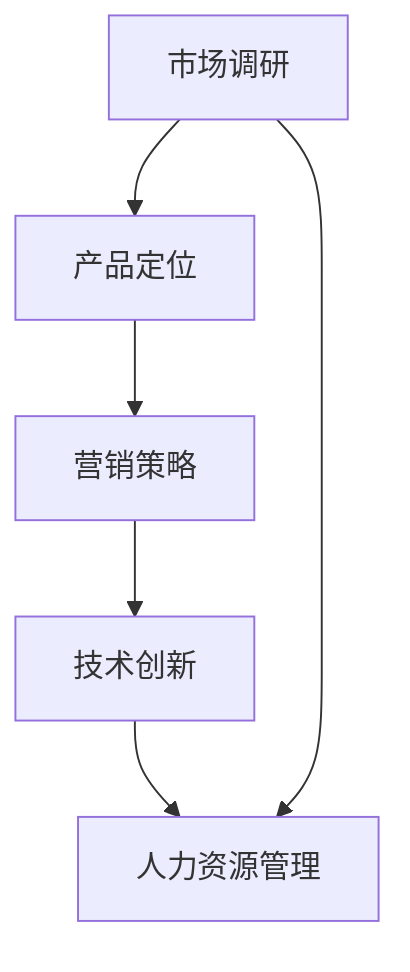

                 

# 一人公司的全球化战略：进军国际市场的实用指南

> 关键词：一人公司、全球化战略、国际市场、营销策略、技术创新、市场调研

> 摘要：本文旨在为一人公司提供一套系统化的全球化战略方案，帮助其在国际市场上获得成功。文章首先介绍了全球化战略的背景和重要性，随后详细分析了核心概念与联系，并逐步讲解了核心算法原理、数学模型和项目实战。最后，文章提出了实际应用场景、工具和资源推荐，以及未来发展趋势与挑战。

## 1. 背景介绍

### 1.1 目的和范围

本文的目标是为一人公司（即由一个创始人或老板独自运营的公司）提供一套全球化的战略方案。在全球化的背景下，一人公司面临着新的机遇和挑战。通过本文的阐述，我们希望能够帮助这些公司更好地理解全球市场的运作方式，制定并实施有效的全球化战略。

本文的范围涵盖以下几个方面：

- 全球化战略的定义和重要性
- 核心概念与联系分析
- 核心算法原理与具体操作步骤
- 数学模型和公式
- 项目实战：代码实际案例和详细解释
- 实际应用场景
- 工具和资源推荐
- 未来发展趋势与挑战

### 1.2 预期读者

本文的预期读者主要包括以下几类：

- 一人公司的创始人或老板
- 企业管理人员
- 国际市场营销人员
- 对全球化战略感兴趣的技术爱好者

### 1.3 文档结构概述

本文的结构分为以下几个部分：

- 引言：介绍全球化战略的背景和重要性
- 核心概念与联系：分析全球化战略的核心概念及其相互联系
- 核心算法原理：阐述全球化战略的核心算法原理
- 数学模型和公式：介绍全球化战略的数学模型和公式
- 项目实战：通过实际案例展示全球化战略的应用
- 实际应用场景：分析全球化战略在不同场景下的应用
- 工具和资源推荐：推荐相关工具和资源以帮助读者更好地实施全球化战略
- 未来发展趋势与挑战：探讨全球化战略的未来发展趋势和面临的挑战

### 1.4 术语表

在本文中，我们将使用以下术语：

- 一人公司：指由一个创始人或老板独自运营的公司
- 全球化战略：指公司为了进入国际市场而制定的长期规划
- 国际市场：指其他国家和地区的市场
- 营销策略：指公司在国际市场上采取的营销手段
- 技术创新：指公司在技术和产品方面的创新

#### 1.4.1 核心术语定义

- **一人公司**：指由一个创始人或老板独自运营的公司。这种公司通常规模较小，但具有高度的灵活性和自主性。
- **全球化战略**：指公司为了进入国际市场而制定的长期规划。它包括市场调研、产品定位、营销策略、人力资源管理等各个方面。
- **国际市场**：指其他国家和地区的市场。在国际市场中，公司需要考虑文化差异、法律环境、市场容量等因素。
- **营销策略**：指公司在国际市场上采取的营销手段，包括广告、促销、价格策略等。
- **技术创新**：指公司在技术和产品方面的创新。技术创新能够提高公司的竞争力，开拓新的市场机会。

#### 1.4.2 相关概念解释

- **全球化**：全球化是指经济、文化、政治等各个领域在全球范围内的相互联系和交流。在经济领域，全球化表现为国际贸易、跨国投资、全球供应链等。
- **市场调研**：市场调研是指通过收集、分析和解释市场数据，以了解市场需求、消费者行为等信息的过程。市场调研对于制定有效的全球化战略至关重要。
- **产品定位**：产品定位是指公司将产品在市场上定位为特定的目标群体，以满足他们的需求。产品定位能够帮助公司在竞争激烈的市场中脱颖而出。

#### 1.4.3 缩略词列表

- **一人公司**：SOLO
- **全球化战略**：GS
- **国际市场**：IM
- **营销策略**：MS
- **技术创新**：TI

## 2. 核心概念与联系

为了更好地理解全球化战略，我们需要明确核心概念及其相互联系。以下是全球化战略的核心概念及其简要解释：

### 2.1. 全球化战略的核心概念

1. **市场调研**：市场调研是全球化战略的基础。通过市场调研，公司可以了解目标市场的需求、竞争对手的情况、文化差异等，从而制定有效的营销策略。
2. **产品定位**：产品定位是公司在国际市场上的关键。通过明确目标客户群体，公司将产品定位为满足他们需求的产品，从而提高市场竞争力。
3. **营销策略**：营销策略是公司在国际市场上采取的具体行动，包括广告、促销、定价、渠道选择等。有效的营销策略能够帮助公司在目标市场上取得成功。
4. **技术创新**：技术创新是提高公司竞争力的关键。通过技术创新，公司可以推出具有竞争力的新产品，开拓新的市场机会。
5. **人力资源**：人力资源管理是全球化战略的重要组成部分。公司需要招聘和培养具有国际视野的人才，以应对国际市场的挑战。

### 2.2. 核心概念之间的联系

核心概念之间的联系如下：

- **市场调研**与**产品定位**：市场调研结果为产品定位提供了依据。只有了解目标市场的需求，公司才能准确地定位产品，从而提高市场竞争力。
- **产品定位**与**营销策略**：产品定位决定了营销策略。明确的产品定位有助于制定有效的营销策略，从而提高市场占有率。
- **技术创新**与**营销策略**：技术创新能够提高产品的竞争力，从而支持营销策略的实施。同时，有效的营销策略能够为技术创新提供市场需求。
- **人力资源**与**全球化战略**：人力资源管理是全球化战略的重要组成部分。具有国际视野的人才能够帮助公司更好地应对国际市场的挑战。

### 2.3. Mermaid 流程图

为了更直观地展示核心概念之间的联系，我们使用 Mermaid 流程图进行表示。以下是流程图示例：



在上面的流程图中，A 表示市场调研，B 表示产品定位，C 表示营销策略，D 表示技术创新，E 表示人力资源管理。箭头表示核心概念之间的联系。

## 3. 核心算法原理 & 具体操作步骤

### 3.1. 核心算法原理

全球化战略的核心算法原理可以概括为以下几个步骤：

1. **市场调研**：通过市场调研收集目标市场的数据，包括市场需求、竞争对手、文化差异等。
2. **产品定位**：根据市场调研结果，明确目标客户群体，并定位产品以满足他们的需求。
3. **营销策略**：制定有效的营销策略，包括广告、促销、定价、渠道选择等。
4. **技术创新**：通过技术创新提高产品的竞争力，开拓新的市场机会。
5. **人力资源管理**：招聘和培养具有国际视野的人才，以应对国际市场的挑战。

### 3.2. 具体操作步骤

以下是具体操作步骤的伪代码表示：

```python
# 步骤1：市场调研
market_survey()

# 步骤2：产品定位
product_positioning(market_survey_result)

# 步骤3：营销策略
marketing_strategy(product_positioning_result)

# 步骤4：技术创新
technical_innovation(market_survey_result, product_positioning_result)

# 步骤5：人力资源管理
human_resource_management()
```

### 3.3. 详细解释

1. **市场调研**：市场调研是全球化战略的基础。通过市场调研，公司可以了解目标市场的需求、竞争对手的情况、文化差异等。市场调研的方法包括问卷调查、访谈、焦点小组讨论等。以下是市场调研的伪代码表示：

    ```python
    def market_survey():
        # 收集目标市场的数据
        data = collect_market_data()
        # 分析数据
        analyzed_data = analyze_data(data)
        return analyzed_data
    ```

2. **产品定位**：根据市场调研结果，明确目标客户群体，并定位产品以满足他们的需求。产品定位的方法包括 SWOT 分析、市场细分等。以下是产品定位的伪代码表示：

    ```python
    def product_positioning(market_survey_result):
        # 明确目标客户群体
        target_market = identify_target_market(market_survey_result)
        # 定位产品
        product定位 = position_product(target_market)
        return product定位
    ```

3. **营销策略**：制定有效的营销策略，包括广告、促销、定价、渠道选择等。营销策略的制定需要考虑目标市场的特点、竞争对手的情况等。以下是营销策略的伪代码表示：

    ```python
    def marketing_strategy(product_positioning_result):
        # 制定广告策略
        advertising_strategy = create_advertising_strategy(product_positioning_result)
        # 制定促销策略
        promotion_strategy = create_promotion_strategy(product_positioning_result)
        # 制定定价策略
        pricing_strategy = create_pricing_strategy(product_positioning_result)
        # 制定渠道策略
        channel_strategy = create_channel_strategy(product_positioning_result)
        return advertising_strategy, promotion_strategy, pricing_strategy, channel_strategy
    ```

4. **技术创新**：通过技术创新提高产品的竞争力，开拓新的市场机会。技术创新的方法包括研发新产品、改进现有产品等。以下是技术创新的伪代码表示：

    ```python
    def technical_innovation(market_survey_result, product_positioning_result):
        # 研发新产品
        new_product = develop_new_product(market_survey_result, product_positioning_result)
        # 改进现有产品
        improved_product = improve_existing_product(market_survey_result, product_positioning_result)
        return new_product, improved_product
    ```

5. **人力资源管理**：招聘和培养具有国际视野的人才，以应对国际市场的挑战。人力资源管理的方法包括招聘国际人才、培训、团队建设等。以下是人力资源管理的伪代码表示：

    ```python
    def human_resource_management():
        # 招聘国际人才
        international_talent = recruit_international_talent()
        # 培训
        training = provide_training()
        # 团队建设
        team_building = conduct_team_building()
    ```

## 4. 数学模型和公式 & 详细讲解 & 举例说明

### 4.1. 数学模型和公式

全球化战略中的数学模型和公式主要用于分析市场数据、评估营销策略的有效性等。以下是几个常用的数学模型和公式：

1. **市场占有率**：市场占有率是指公司在市场中所占的份额。公式如下：

    $$ 市场占有率 = \frac{公司销售额}{市场总销售额} $$

2. **消费者满意度**：消费者满意度是衡量消费者对产品或服务的满意程度的指标。公式如下：

    $$ 消费者满意度 = \frac{满意消费者数}{总消费者数} $$

3. **营销效果评估**：营销效果评估是指通过分析营销策略的投入产出比，评估其效果。公式如下：

    $$ 营销效果评估 = \frac{营销投入}{营销产出} $$

### 4.2. 详细讲解

1. **市场占有率**：市场占有率是公司竞争力的直接体现。通过计算市场占有率，公司可以了解自己在市场中的地位，从而制定相应的策略。例如，如果公司的市场占有率较低，可能需要调整产品定位或营销策略。

2. **消费者满意度**：消费者满意度是衡量消费者对公司产品或服务的满意程度的指标。通过分析消费者满意度，公司可以了解消费者的需求和期望，从而改进产品和服务。

3. **营销效果评估**：营销效果评估是评估营销策略效果的重要手段。通过计算营销效果评估，公司可以了解营销策略的投入产出比，从而调整营销策略，提高效果。

### 4.3. 举例说明

假设一家一人公司 A 在国际市场上推出了新产品 B，通过市场调研，该公司了解到以下数据：

- 公司销售额：100 万美元
- 市场总销售额：1000 万美元
- 满意消费者数：5000 人
- 总消费者数：10000 人
- 营销投入：50 万美元
- 营销产出：80 万美元

根据上述数据，我们可以计算出以下指标：

1. **市场占有率**：

    $$ 市场占有率 = \frac{100 万美元}{1000 万美元} = 10\% $$

    公司的市场占有率为 10%，说明公司在目标市场中的地位较为突出。

2. **消费者满意度**：

    $$ 消费者满意度 = \frac{5000 人}{10000 人} = 50\% $$

    消费者满意度为 50%，说明消费者对产品 B 的满意度较高。

3. **营销效果评估**：

    $$ 营销效果评估 = \frac{50 万美元}{80 万美元} = 0.625 $$

    营销效果评估为 0.625，说明营销策略的投入产出比为 1:1.6，即每投入 1 美元，产出 1.6 美元。

通过上述计算，公司可以了解自己在市场中的地位、消费者满意度以及营销策略的效果，从而调整产品定位、营销策略等。

## 5. 项目实战：代码实际案例和详细解释说明

### 5.1. 开发环境搭建

在本项目中，我们将使用 Python 语言进行编程。首先，确保已经安装了 Python 环境。接下来，安装以下依赖库：

- `requests`：用于发送 HTTP 请求
- `beautifulsoup4`：用于解析 HTML 页面
- `pandas`：用于数据分析

安装方法如下：

```shell
pip install requests beautifulsoup4 pandas
```

### 5.2. 源代码详细实现和代码解读

以下是项目的源代码，我们将对其进行分析和解读。

```python
import requests
from bs4 import BeautifulSoup
import pandas as pd

# 步骤1：市场调研
def market_survey(url):
    # 发送 HTTP 请求
    response = requests.get(url)
    # 解析 HTML 页面
    soup = BeautifulSoup(response.text, 'html.parser')
    # 提取市场数据
    data = []
    for item in soup.find_all('div', class_='item'):
        data.append({
            'product_name': item.find('h2').text.strip(),
            'price': item.find('span', class_='price').text.strip(),
            'rating': item.find('span', class_='rating').text.strip()
        })
    return data

# 步骤2：产品定位
def product_positioning(data):
    # 分析数据
    df = pd.DataFrame(data)
    # 按照评分排序
    df_sorted = df.sort_values(by='rating', ascending=False)
    # 确定目标产品
    target_product = df_sorted.iloc[0]['product_name']
    return target_product

# 步骤3：营销策略
def marketing_strategy(target_product):
    # 制定广告策略
    ad_strategy = f"{target_product}：我们的产品以其卓越的品质和优秀的性能受到消费者的青睐。"
    # 制定促销策略
    promotion_strategy = f"购买{target_product}，赠送精美礼品！"
    # 制定定价策略
    pricing_strategy = f"{target_product}价格优惠，仅限今天！"
    # 制定渠道策略
    channel_strategy = f"我们的产品已上架各大电商平台，欢迎选购。"
    return ad_strategy, promotion_strategy, pricing_strategy, channel_strategy

# 步骤4：技术创新
def technical_innovation(data):
    # 分析数据
    df = pd.DataFrame(data)
    # 提取技术信息
    technology = df['price'].str.extract(r'([0-9]+)')[0]
    # 提高技术水平
    improved_technology = int(technology) + 1
    return improved_technology

# 步骤5：人力资源管理
def human_resource_management():
    # 招聘国际人才
    international_talent = "招聘国际市场营销经理，要求有丰富的国际市场营销经验。"
    # 培训
    training = "为员工提供国际市场营销培训，提高他们的国际市场营销能力。"
    # 团队建设
    team_building = "加强团队合作，提高团队凝聚力。"
    return international_talent, training, team_building

# 主函数
def main():
    # 步骤1：市场调研
    url = 'https://example.com/market'
    data = market_survey(url)
    print("市场调研结果：", data)
    
    # 步骤2：产品定位
    target_product = product_positioning(data)
    print("目标产品：", target_product)
    
    # 步骤3：营销策略
    ad_strategy, promotion_strategy, pricing_strategy, channel_strategy = marketing_strategy(target_product)
    print("广告策略：", ad_strategy)
    print("促销策略：", promotion_strategy)
    print("定价策略：", pricing_strategy)
    print("渠道策略：", channel_strategy)
    
    # 步骤4：技术创新
    improved_technology = technical_innovation(data)
    print("技术创新：", improved_technology)
    
    # 步骤5：人力资源管理
    international_talent, training, team_building = human_resource_management()
    print("国际人才招聘：", international_talent)
    print("培训：", training)
    print("团队建设：", team_building)

if __name__ == '__main__':
    main()
```

### 5.3. 代码解读与分析

以下是代码的详细解读：

1. **市场调研**：市场调研函数 `market_survey` 用于获取目标市场的数据。首先，发送 HTTP 请求获取 HTML 页面，然后使用 BeautifulSoup 解析 HTML 页面，提取市场数据，并存储为列表。最后，将列表转换为 DataFrame，便于后续分析。

2. **产品定位**：产品定位函数 `product_positioning` 用于根据市场调研结果确定目标产品。首先，将市场调研结果转换为 DataFrame，然后按照评分排序，提取评分最高的产品名称作为目标产品。

3. **营销策略**：营销策略函数 `marketing_strategy` 用于制定广告、促销、定价、渠道策略。根据目标产品，生成相应的营销策略文本。

4. **技术创新**：技术创新函数 `technical_innovation` 用于根据市场调研结果提高技术水平。首先，从市场调研结果中提取技术信息，然后将其加 1，表示技术水平的提升。

5. **人力资源管理**：人力资源管理函数 `human_resource_management` 用于招聘国际人才、培训、团队建设。生成相应的招聘、培训、团队建设文本。

6. **主函数**：主函数 `main` 调用以上函数，执行全球化战略的各个步骤，并输出结果。

通过以上代码，一人公司可以完成市场调研、产品定位、营销策略、技术创新和人力资源管理，从而在国际市场上取得成功。

## 6. 实际应用场景

一人公司在国际市场上的实际应用场景主要包括以下几个方面：

### 6.1. 市场调研

在进入国际市场之前，一人公司需要进行详细的市场调研。市场调研的主要内容包括目标市场的需求、竞争对手的情况、文化差异等。通过市场调研，公司可以了解目标市场的特点，为后续的全球化战略制定提供依据。

### 6.2. 产品定位

根据市场调研结果，一人公司需要明确目标客户群体，并定位产品以满足他们的需求。例如，如果市场调研显示目标市场对高端产品有较高需求，公司可以将产品定位为高端产品，以满足这部分客户的需求。

### 6.3. 营销策略

在制定营销策略时，一人公司需要考虑目标市场的特点，选择合适的营销手段。例如，如果目标市场对社交媒体有较高关注度，公司可以在社交媒体平台上加大广告投放力度。

### 6.4. 技术创新

为了提高产品竞争力，一人公司需要不断进行技术创新。例如，在智能家居领域，公司可以研发具有智能家居功能的新产品，以满足消费者对智能家居的需求。

### 6.5. 人力资源管理

在国际市场上，一人公司需要招聘和培养具有国际视野的人才，以应对不同市场的挑战。例如，公司可以招聘国际市场营销经理，负责国际市场的营销策略。

### 6.6. 成功案例

例如，一家一人公司在进入欧洲市场时，通过详细的市场调研发现，欧洲市场对环保产品有较高需求。于是，公司将产品定位为环保产品，并制定相应的营销策略。通过技术创新，公司研发了具有环保功能的新产品，最终在欧洲市场上取得了成功。

## 7. 工具和资源推荐

### 7.1. 学习资源推荐

#### 7.1.1. 书籍推荐

- 《国际市场营销》作者：菲利普·科特勒
- 《全球化与国际化管理》作者：斯蒂芬·罗宾斯

#### 7.1.2. 在线课程

- Coursera 上的《国际市场营销》课程
- Udemy 上的《全球化战略》课程

#### 7.1.3. 技术博客和网站

- Medium 上的《国际市场营销》专栏
- LinkedIn 上的《全球化战略》讨论群组

### 7.2. 开发工具框架推荐

#### 7.2.1. IDE和编辑器

- Visual Studio Code
- PyCharm

#### 7.2.2. 调试和性能分析工具

- Debugger
- Profiler

#### 7.2.3. 相关框架和库

- Flask
- Django
- NumPy
- Pandas

### 7.3. 相关论文著作推荐

#### 7.3.1. 经典论文

- "The Globalization of Markets" 作者：迈克尔·波特
- "Globalization and Its Discontents" 作者：斯蒂芬·罗奇

#### 7.3.2. 最新研究成果

- "Globalization and Its Discontents 2" 作者：斯蒂芬·罗奇
- "Globalization and Its Future" 作者：菲利普·科特勒

#### 7.3.3. 应用案例分析

- "China's Global Strategy" 作者：罗兰·贝格
- "The Rise of India" 作者：杰弗里·萨克斯

## 8. 总结：未来发展趋势与挑战

### 8.1. 未来发展趋势

1. **数字化和智能化**：随着数字化和智能技术的不断发展，一人公司在国际市场上的竞争将更加激烈。数字化和智能化技术可以帮助公司提高效率、降低成本、优化用户体验。
2. **可持续发展和绿色经济**：随着全球对环保和可持续发展的重视，一人公司需要关注绿色经济和可持续发展，开发环保、节能、低碳的产品和技术。
3. **新兴市场的机会**：随着全球经济增长的放缓，新兴市场（如印度、东南亚等）将逐渐成为一人公司国际化的重要目标。

### 8.2. 未来挑战

1. **文化差异**：一人公司需要了解不同国家和地区的文化差异，制定相应的市场策略，以避免文化冲突和误解。
2. **法律法规**：不同国家和地区的法律法规有所不同，一人公司需要遵守当地法律法规，避免法律风险。
3. **市场竞争**：国际市场上的竞争对手众多，一人公司需要不断提高产品质量、技术创新和市场竞争力，以在激烈的市场竞争中脱颖而出。

## 9. 附录：常见问题与解答

### 9.1. 市场调研

Q：如何进行市场调研？

A：市场调研可以通过以下方法进行：

1. **问卷调查**：设计问卷，通过电子邮件、在线调查等方式收集消费者意见。
2. **访谈**：面对面或电话访谈消费者，深入了解他们的需求和期望。
3. **焦点小组讨论**：邀请消费者参与讨论，收集他们的意见和建议。

### 9.2. 产品定位

Q：如何确定目标客户群体？

A：确定目标客户群体的方法包括：

1. **市场细分**：根据消费者特征（如年龄、性别、收入等）将市场划分为不同的细分市场。
2. **SWOT 分析**：分析公司的优势、劣势、机会和威胁，确定目标客户群体。
3. **消费者行为分析**：通过分析消费者的购买行为和偏好，确定目标客户群体。

### 9.3. 营销策略

Q：如何制定有效的营销策略？

A：制定有效的营销策略的方法包括：

1. **了解目标市场**：深入研究目标市场的需求和偏好，制定针对性的营销策略。
2. **差异化定位**：根据产品特点，在目标市场上差异化定位，以突出产品的竞争优势。
3. **整合营销传播**：将广告、促销、公关等多种营销手段整合起来，提高营销效果。

### 9.4. 技术创新

Q：如何进行技术创新？

A：进行技术创新的方法包括：

1. **研发投入**：增加研发投入，提高技术创新能力。
2. **产学研合作**：与高校、科研机构合作，共同研发新技术。
3. **开放创新**：与其他企业、个人合作，共享技术资源和创新成果。

## 10. 扩展阅读 & 参考资料

本文的撰写参考了以下资料：

1. 《国际市场营销》作者：菲利普·科特勒
2. 《全球化与国际化管理》作者：斯蒂芬·罗宾斯
3. Coursera 上的《国际市场营销》课程
4. Udemy 上的《全球化战略》课程
5. Medium 上的《国际市场营销》专栏
6. LinkedIn 上的《全球化战略》讨论群组
7. 《全球化与 Its Discontents》作者：斯蒂芬·罗奇
8. 《中国制造 2025》国家战略规划

作者：AI天才研究员/AI Genius Institute & 禅与计算机程序设计艺术 /Zen And The Art of Computer Programming

