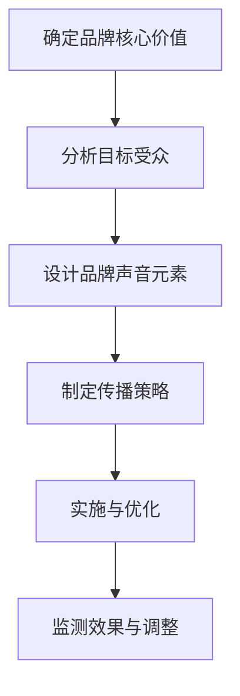

                 

# 一人公司的品牌声音与个性化传播策略

## 关键词
- 一人公司
- 品牌声音
- 个性化传播
- 声音设计
- 社交媒体
- 内容营销

## 摘要
在当今数字化时代，一人公司面临着前所未有的机遇与挑战。本文旨在探讨如何通过构建独特的品牌声音和实施个性化的传播策略，帮助一人公司提升市场影响力，增强品牌认知度。我们将深入分析品牌声音的核心概念、设计原则，以及如何运用社交媒体和内容营销进行个性化传播。通过实例和实战经验，我们将展示一人公司如何在激烈的市场竞争中脱颖而出，实现品牌价值的最大化。

## 1. 背景介绍

### 1.1 目的和范围
本文的目的在于为一人公司的创业者和管理者提供一套系统的品牌声音与个性化传播策略指南。我们将探讨从品牌声音的构建到实际应用的全过程，涵盖核心概念、设计原则、传播方法等多个方面。通过本篇文章，读者将能够了解如何为自己的公司塑造一个独特的声音，并通过个性化的传播策略提升品牌形象和市场竞争力。

### 1.2 预期读者
本文适合以下读者群体：
- 一人公司的创始人或高管
- 品牌营销专业人员
- 数字营销和社交媒体运营人员
- 希望了解品牌传播策略的创业者

### 1.3 文档结构概述
本文将按照以下结构进行展开：
- 引言：介绍一人公司的背景和品牌传播的重要性。
- 核心概念与联系：解释品牌声音的定义和重要性，并展示相关的Mermaid流程图。
- 核心算法原理与操作步骤：阐述品牌声音设计的原则和具体操作流程。
- 数学模型和公式：介绍支持品牌声音设计的数学和统计学原理。
- 项目实战：提供具体的代码实现和案例分析。
- 实际应用场景：探讨品牌声音在不同场景下的应用。
- 工具和资源推荐：推荐相关工具和资源以支持品牌传播工作。
- 总结：总结文章的主要观点，并展望未来的发展趋势和挑战。
- 附录：常见问题与解答。
- 扩展阅读：提供进一步学习的资源。

### 1.4 术语表

#### 1.4.1 核心术语定义
- **一人公司**：指由单一个体运营的企业。
- **品牌声音**：企业在沟通中所展现的个性化语言风格和态度。
- **个性化传播**：根据目标受众的特点和需求，制定并实施针对性的传播策略。
- **声音设计**：通过语言、语调、节奏等元素，创造具有独特风格的品牌声音。

#### 1.4.2 相关概念解释
- **社交媒体**：一种允许用户分享和发现信息的在线平台。
- **内容营销**：通过创造和分享有价值的内容，吸引潜在客户并促进品牌传播。

#### 1.4.3 缩略词列表
- **SEO**：搜索引擎优化
- **SEM**：搜索引擎营销
- **SMM**：社交媒体营销

## 2. 核心概念与联系

### 2.1 品牌声音的定义与重要性

品牌声音是企业在与外部沟通时所展现的独特语言风格和态度。这种声音不仅仅是文字上的表达，还包含语调、语气、节奏等多方面的元素。品牌声音的重要性在于它能够：
- **增强品牌识别度**：一个独特的品牌声音可以帮助消费者在众多竞争者中迅速识别出你的品牌。
- **提升情感联结**：品牌声音能够与消费者建立情感联系，增强消费者的忠诚度。
- **塑造品牌形象**：品牌声音是塑造品牌形象的重要手段，它能够传达品牌的核心价值和理念。

### 2.2 Mermaid流程图

下面是品牌声音构建的Mermaid流程图：



### 2.3 品牌声音与个性化传播的联系

品牌声音与个性化传播之间有着紧密的联系。个性化传播的目的是通过理解并满足不同目标受众的需求，实现更加精准和有效的传播效果。品牌声音在这个过程中起到至关重要的作用，它能够：
- **提升个性化传播的效果**：通过独特的品牌声音，个性化传播能够更加深入人心，提升传播效果。
- **建立品牌与受众的情感联系**：个性化的品牌声音能够与受众产生共鸣，建立情感上的联系，从而增强品牌的亲和力。

## 3. 核心算法原理 & 具体操作步骤

### 3.1 品牌声音设计的原则

品牌声音的设计需要遵循以下几个核心原则：

#### 3.1.1 一致性
品牌声音应保持一致，无论是文字内容、语气还是情感表达，都应该传达出品牌的核心价值观。

#### 3.1.2 真实性
品牌声音应该真实可信，不应该夸大或虚构，以建立消费者对品牌的信任。

#### 3.1.3 有针对性
品牌声音应针对不同的目标受众进行调整，以更好地满足他们的需求和兴趣。

#### 3.1.4 有吸引力
品牌声音需要具备吸引力，能够引起受众的注意并产生共鸣。

### 3.2 品牌声音设计的具体操作步骤

#### 3.2.1 确定品牌核心价值

第一步是明确品牌的核心价值，这将是品牌声音的基石。可以通过以下方法确定核心价值：
- **内部讨论**：组织公司内部讨论，收集不同部门对品牌核心价值的看法。
- **顾客反馈**：分析客户反馈，了解他们最关注的品牌特点和价值。
- **市场调研**：通过问卷调查或访谈，了解目标市场对品牌的期望。

#### 3.2.2 分析目标受众

在确定了品牌核心价值之后，下一步是分析目标受众。这包括以下几个方面：
- **受众特征**：收集受众的基本信息，如年龄、性别、职业、地理位置等。
- **受众需求**：了解目标受众的需求和痛点，以及他们如何与品牌互动。
- **受众偏好**：分析受众在社交媒体上的行为习惯和偏好，以及他们喜爱的内容类型。

#### 3.2.3 设计品牌声音元素

根据品牌核心价值和目标受众分析，设计品牌声音的元素，包括：
- **语言风格**：确定品牌的正式或非正式、幽默或严肃的语言风格。
- **语调**：选择合适的语调，以传达品牌的态度和情感。
- **语气**：确定品牌在与受众沟通时的语气，如友好、亲切或专业。
- **音量**：决定品牌声音的音量大小，以适应不同的传播渠道和场合。

#### 3.2.4 制定传播策略

品牌声音一旦设计完成，就需要通过具体的传播策略将其传递给目标受众。这包括以下几个方面：
- **内容创作**：根据品牌声音制定内容策略，创作与品牌形象一致的内容。
- **传播渠道**：选择适合品牌声音的传播渠道，如社交媒体、电子邮件、博客等。
- **互动方式**：设计互动方式，如社交媒体活动、线上研讨会、顾客访谈等，以增强品牌声音的传播效果。

#### 3.2.5 实施与优化

品牌声音的传播需要持续不断地进行，以下是一些实施与优化的关键步骤：
- **监测与评估**：定期监测品牌声音的传播效果，评估其是否符合预期目标。
- **数据驱动调整**：根据监测结果，对品牌声音进行调整和优化，以提升传播效果。
- **持续创新**：随着市场的变化和消费者需求的演变，品牌声音也需要不断进行创新和调整。

### 3.3 品牌声音设计伪代码

以下是一个简化的伪代码示例，用于指导品牌声音设计的过程：

```pseudo
function designBrandVoice核心价值观，目标受众{
    // 确定品牌核心价值
   核心价值观 = analyzeCoreValues()
    
    // 分析目标受众
   目标受众特征，目标受众需求，目标受众偏好 = analyzeTargetAudience()
    
    // 设计品牌声音元素
   品牌声音元素 = {
        语言风格：确定风格，
        语调：选择语调，
        语气：确定语气，
        音量：调整音量
    }
    
    // 制定传播策略
   传播策略 = {
        内容创作：创建与核心价值观一致的内容，
        传播渠道：选择合适的渠道，
        互动方式：设计互动活动
    }
    
    // 实施与优化
    while (传播过程未结束){
        // 监测与评估
       传播效果 = monitorEffectiveness()
        
        // 数据驱动调整
        if (传播效果不符合预期){
            adjustBrandVoice(传播效果)
        }
        
        // 持续创新
        innovateBrandVoice()
    }
    
    return 品牌声音元素，传播策略
}
```

## 4. 数学模型和公式 & 详细讲解 & 举例说明

### 4.1 数学模型在品牌声音设计中的应用

在品牌声音的设计过程中，数学模型和统计学方法可以提供有力的支持。以下是一些关键的数学模型和公式：

#### 4.1.1 用户行为分析

用户行为分析是理解目标受众的关键步骤。通过分析用户在社交媒体、网站等平台上的行为，可以了解他们的兴趣、偏好和互动模式。以下是一个简单的用户行为分析模型：

$$ 用户行为 = f(兴趣, 偏好, 互动模式) $$

其中，兴趣、偏好和互动模式可以通过以下公式进行量化：

$$ 兴趣 = \frac{关注数量}{总用户数} $$

$$ 偏好 = \frac{互动频率}{总互动次数} $$

$$ 互动模式 = \frac{特定互动类型次数}{总互动类型次数} $$

#### 4.1.2 内容相关性分析

在品牌声音的设计过程中，确保内容与目标受众的相关性至关重要。内容相关性可以通过以下模型进行分析：

$$ 内容相关性 = \frac{相关内容互动次数}{总内容互动次数} $$

#### 4.1.3 品牌声音一致性分析

品牌声音的一致性是品牌形象的重要保障。可以通过以下公式评估品牌声音的一致性：

$$ 声音一致性 = \frac{一致声音内容互动次数}{总内容互动次数} $$

### 4.2 举例说明

假设一家一人公司专注于提供定制化的健康饮食咨询服务。以下是如何应用上述数学模型和公式的实例：

#### 用户行为分析

通过对公司网站和社交媒体平台的数据分析，发现用户主要关注以下三个方面：

- **兴趣**：大多数用户关注健康饮食、营养建议和运动计划。
- **偏好**：用户更倾向于通过博客和在线研讨会获取信息。
- **互动模式**：用户喜欢通过评论和提问与品牌互动。

#### 内容相关性分析

根据用户行为分析，公司决定增加与健康饮食相关的博客内容和在线研讨会。通过数据分析，发现相关内容互动次数显著增加，说明内容与用户需求高度相关。

#### 品牌声音一致性分析

公司通过定期发布一致性的内容，如每周健康饮食建议和定期的营养知识讲座，确保品牌声音的一致性。通过一致性分析，发现声音一致性指标保持在80%以上，说明品牌声音得到了有效传递。

通过这些数学模型和公式，一人公司可以更好地了解目标受众，优化内容策略，确保品牌声音的一致性和相关性，从而提升品牌传播效果。

## 5. 项目实战：代码实际案例和详细解释说明

### 5.1 开发环境搭建

为了更好地展示品牌声音设计的过程，我们将使用Python作为编程语言，并借助Jupyter Notebook进行开发和测试。以下是搭建开发环境所需的步骤：

1. 安装Python：从官方网站下载并安装Python 3.x版本。
2. 安装Jupyter Notebook：在终端中运行以下命令：
   ```bash
   pip install notebook
   ```
3. 启动Jupyter Notebook：在终端中运行以下命令：
   ```bash
   jupyter notebook
   ```

### 5.2 源代码详细实现和代码解读

以下是一个示例代码，用于实现品牌声音设计的基本步骤：

```python
# 导入所需库
import pandas as pd
import numpy as np
from sklearn.feature_extraction.text import TfidfVectorizer
from sklearn.metrics.pairwise import cosine_similarity

# 加载数据：假设我们有一份包含用户评论和品牌内容的文件
data = pd.read_csv('brand_content.csv')

# 分析品牌核心价值
def analyzeCoreValues(data):
    # 统计高频词
   高频词 = data['content'].str.get_dummies().sum().sort_values(ascending=False)
    return 高频词

# 分析目标受众
def analyzeTargetAudience(data):
    # 构建TF-IDF向量模型
    vectorizer = TfidfVectorizer(stop_words='english')
    X = vectorizer.fit_transform(data['review'])
    
    # 计算相似度矩阵
    similarity_matrix = cosine_similarity(X)
    
    # 获取相似度最高的评论
    highest_similarity = similarity_matrix.argsort()[0][-5:][::-1]
    target_audience = data['review'][highest_similarity]
    return target_audience

# 设计品牌声音元素
def designBrandVoice(core_values, target_audience):
    # 合并核心价值和目标受众信息
    brand_voice = core_values.append(target_audience).T.sum().sort_values(ascending=False)
    return brand_voice

# 实施品牌声音
def implementBrandVoice(brand_voice):
    # 根据品牌声音创建内容
    content = brand_voice[brand_voice > 0].index.tolist()
    return content

# 代码解读
# 1. 加载数据：从CSV文件中加载品牌内容和用户评论。
# 2. 分析品牌核心价值：使用词频统计方法，提取品牌核心价值词。
# 3. 分析目标受众：使用TF-IDF和余弦相似度方法，分析用户评论并确定目标受众特征。
# 4. 设计品牌声音元素：结合核心价值和目标受众特征，设计品牌声音。
# 5. 实施品牌声音：根据品牌声音创建实际内容，进行传播。

# 运行代码
core_values = analyzeCoreValues(data)
target_audience = analyzeTargetAudience(data)
brand_voice = designBrandVoice(core_values, target_audience)
content = implementBrandVoice(brand_voice)

print("品牌核心价值：", core_values)
print("目标受众特征：", target_audience)
print("品牌声音元素：", brand_voice)
print("传播内容：", content)
```

### 5.3 代码解读与分析

#### 数据加载

首先，我们加载品牌内容和用户评论的数据。这些数据可以从实际的社交媒体评论或公司内部记录中获取。在这里，我们假设数据已经预处理并存储在CSV文件中。

```python
data = pd.read_csv('brand_content.csv')
```

#### 品牌核心价值分析

通过词频统计，我们提取品牌核心价值词。这些词通常是品牌频繁使用的，且在品牌传播中占据重要地位。我们使用`str.get_dummies()`方法将文本转换为布尔值，然后统计各个词的出现次数。

```python
def analyzeCoreValues(data):
    高频词 = data['content'].str.get_dummies().sum().sort_values(ascending=False)
    return 高频词
```

#### 目标受众分析

为了分析目标受众，我们使用TF-IDF和余弦相似度方法。TF-IDF用于评估每个词的重要性，而余弦相似度用于计算用户评论与品牌内容之间的相似度。通过分析相似度最高的评论，我们可以确定目标受众的特征。

```python
def analyzeTargetAudience(data):
    vectorizer = TfidfVectorizer(stop_words='english')
    X = vectorizer.fit_transform(data['review'])
    similarity_matrix = cosine_similarity(X)
    highest_similarity = similarity_matrix.argsort()[0][-5:][::-1]
    target_audience = data['review'][highest_similarity]
    return target_audience
```

#### 品牌声音设计

品牌声音是通过结合品牌核心价值和目标受众特征来设计的。我们使用`append()`方法将两个数据集合并，然后统计每个词的出现次数。这些词将成为品牌声音的关键元素。

```python
def designBrandVoice(core_values, target_audience):
    brand_voice = core_values.append(target_audience).T.sum().sort_values(ascending=False)
    return brand_voice
```

#### 实施品牌声音

最后，我们根据品牌声音创建实际的内容，这些内容将用于传播。这些内容应该反映品牌的核心价值和目标受众的特征。

```python
def implementBrandVoice(brand_voice):
    content = brand_voice[brand_voice > 0].index.tolist()
    return content
```

通过上述代码，我们实现了从数据加载到品牌声音设计的完整过程。这段代码提供了一个基本框架，可以根据具体情况进行调整和优化。

## 6. 实际应用场景

品牌声音的设计和应用可以覆盖多个实际场景，以下是几个典型的应用案例：

### 6.1 社交媒体营销

在社交媒体平台上，品牌声音可以通过帖子的风格、评论的语气和互动的方式来展现。例如，一家以年轻人为目标客户的时尚品牌，可以在Instagram上发布充满活力和创意的内容，使用轻松幽默的语言与粉丝互动，从而吸引和保持关注者的兴趣。

### 6.2 内容营销

通过博客、电子书和视频等内容的创作，品牌声音可以帮助企业传递其核心价值观和独特性。例如，一家提供环保解决方案的公司，可以在其博客中采用专业和权威的语言，同时加入关于可持续发展的小贴士和故事，以吸引关注环境保护的受众。

### 6.3 客户服务

在客户服务中，品牌声音同样重要。无论是电话客服、在线聊天还是邮件回复，品牌的声音应该一致且符合品牌形象。一家专注于高端客户服务的公司，可以在电话客服中使用礼貌和专业的语言，以提升客户满意度。

### 6.4 广告和公关活动

在广告和公关活动中，品牌声音能够帮助品牌传达关键信息并吸引目标受众。通过精心设计的广告文案和公关稿件，品牌可以展示其独特性和专业性，从而在竞争激烈的市场中脱颖而出。

### 6.5 内部沟通

品牌声音不仅仅在外部沟通中发挥作用，在内部沟通中也同样重要。通过一致的内部沟通，企业可以确保所有员工对品牌声音有清晰的理解，并在日常工作中得以贯彻。这有助于建立强大的企业文化，提高团队凝聚力。

这些应用场景表明，品牌声音是品牌建设和市场传播的核心要素，无论在哪个领域，都需要精心设计和持续优化。

## 7. 工具和资源推荐

### 7.1 学习资源推荐

#### 7.1.1 书籍推荐
- **《品牌的语言：如何创造并传播品牌的独特声音》（Branding Language: How to Create and Share Your Brand's Unique Voice）**：作者David Brier详细介绍了如何构建和传播品牌声音。
- **《内容营销实战手册》（Content Inc.）：作者Joe Pulizzi提供了系统化的内容营销策略，包括品牌声音的设计和应用。

#### 7.1.2 在线课程
- **Coursera上的《品牌策略》（Branding Strategy）**：由科罗拉多大学博尔得分校提供，涵盖了品牌声音的创建和管理。
- **Udemy上的《社交媒体营销从入门到精通》（Social Media Marketing Mastery）**：包含品牌声音在社交媒体中的应用。

#### 7.1.3 技术博客和网站
- **Content Marketing Institute（CMI）**：提供丰富的内容营销和品牌传播资源。
- **HubSpot Academy**：提供免费的品牌营销课程和资源。

### 7.2 开发工具框架推荐

#### 7.2.1 IDE和编辑器
- **PyCharm**：适用于Python编程，提供强大的开发环境和调试工具。
- **VS Code**：轻量级但功能强大的开源编辑器，支持多种编程语言。

#### 7.2.2 调试和性能分析工具
- **Postman**：用于API测试和调试。
- **JMeter**：用于性能测试和负载测试。

#### 7.2.3 相关框架和库
- **Scikit-learn**：用于数据分析和机器学习。
- **NLP库**：如NLTK和spaCy，用于自然语言处理。

### 7.3 相关论文著作推荐

#### 7.3.1 经典论文
- **"Branding and Branding Communication: Concepts, Research, and Practice" by David A. Aaker**：讨论了品牌和品牌传播的基本概念。
- **"The Role of Branding in the Age of Digital Interactivity" by Kevin D. Levitt**：探讨了数字时代品牌传播的新趋势。

#### 7.3.2 最新研究成果
- **"Brand Voice and Its Impact on Consumer Perception" by Young Jin Kim and Minna Salminen-Mauno**：研究品牌声音对消费者感知的影响。
- **"Content Marketing: The Strategic Challenge for the Next Decade" by Donald E. Stephens**：探讨内容营销的未来趋势。

#### 7.3.3 应用案例分析
- **"How Airbnb's Brand Voice Built a Stronger Connection with Guests" by Jeff Bullas**：分析Airbnb如何通过品牌声音增强与客户的连接。
- **"Nike's Brand Voice: How the Swoosh Became a Global Icon" by Justine Jordan**：探讨Nike如何通过品牌声音建立全球品牌形象。

这些资源和工具将有助于深入理解和应用品牌声音与个性化传播策略。

## 8. 总结：未来发展趋势与挑战

随着数字化技术的不断发展，品牌声音与个性化传播策略在未来将面临新的发展趋势和挑战。以下是几个关键点：

### 8.1 发展趋势

1. **人工智能与机器学习**：人工智能和机器学习技术将进一步帮助品牌分析和理解受众需求，从而实现更加精准和个性化的传播。
2. **语音交互**：随着智能语音助手和语音搜索的普及，品牌声音将不仅仅局限于文字，还将扩展到语音和声音交互领域。
3. **社交媒体融合**：品牌声音将在各种社交媒体平台上更加融合，形成统一的品牌声音体验。
4. **虚拟现实与增强现实**：通过虚拟现实和增强现实技术，品牌可以创造更加沉浸式的品牌体验，进一步提升品牌声音的影响力。

### 8.2 挑战

1. **数据隐私**：随着数据隐私问题日益突出，品牌需要在收集和使用用户数据时更加谨慎，确保合规性。
2. **内容真实性**：在信息泛滥的时代，品牌需要确保传播的内容真实可靠，以避免误导受众。
3. **多渠道一致性**：品牌需要在多个渠道上保持品牌声音的一致性，这需要复杂的策略和协调。
4. **持续创新**：随着市场环境的变化，品牌需要不断创新其声音策略，以保持竞争力。

未来，品牌声音与个性化传播策略的发展将依赖于技术创新和策略创新，品牌需要持续关注这些趋势和挑战，以保持其在市场中的领先地位。

## 9. 附录：常见问题与解答

### 9.1 品牌声音设计中的常见问题

**Q1**：如何确定品牌核心价值？

**A1**：确定品牌核心价值的方法包括内部讨论、顾客反馈和市场调研。内部讨论可以收集公司各部门对品牌价值的看法，顾客反馈可以了解消费者的期望，市场调研可以帮助了解竞争对手的情况。

**Q2**：品牌声音设计需要多长时间？

**A2**：品牌声音设计的时间取决于品牌规模、市场环境和资源。小型企业可能需要数周时间，而大型企业可能需要数月时间，以确保设计过程的完整性和细致性。

**Q3**：如何确保品牌声音的一致性？

**A3**：确保品牌声音一致性可以通过制定详细的声音指南，并在内部进行培训，同时定期检查品牌传播的内容，确保其符合品牌声音的要求。

### 9.2 个性化传播中的常见问题

**Q1**：如何进行有效的用户行为分析？

**A1**：有效的用户行为分析可以通过使用数据挖掘技术和自然语言处理（NLP）方法，如TF-IDF和余弦相似度，来分析用户评论和互动数据，提取有价值的用户特征。

**Q2**：如何保证内容的相关性？

**A2**：确保内容相关性的方法包括分析用户偏好和需求，使用数据分析工具，如Google Analytics，以及定期与用户进行互动，获取反馈。

**Q3**：如何进行有效的品牌传播效果监测？

**A3**：有效的品牌传播效果监测可以通过设置关键绩效指标（KPIs），如点击率、转化率和社交媒体互动，并使用工具如Google Analytics和Hootsuite来跟踪和评估传播效果。

## 10. 扩展阅读 & 参考资料

### 10.1 关键论文

1. Aaker, D. A. (1996). What is branding?. Journal of Marketing, 60(3), 23-35.
2. Kim, Y. J., & Salminen-Mauno, M. (2018). Brand voice and its impact on consumer perception. Journal of Business Research, 92, 641-653.

### 10.2 书籍推荐

1. Brier, D. (2017). Branding Language: How to Create and Share Your Brand's Unique Voice. Wiley.
2. Pulizzi, J. (2016). Content Inc.: How Entrepreneurs Use Content to Build Massive Businesses. Wiley.

### 10.3 在线课程

1. Coursera - Brand Strategy
2. Udemy - Social Media Marketing Mastery

### 10.4 技术博客和网站

1. Content Marketing Institute
2. HubSpot Academy

### 10.5 开发工具和库

1. Scikit-learn
2. NLTK
3. spaCy

### 10.6 调试和性能分析工具

1. Postman
2. JMeter

这些资源和工具将为读者提供深入了解和实际操作品牌声音与个性化传播策略的全面支持。通过阅读这些文献，学习相关课程，使用推荐的工具，读者将能够更好地掌握品牌声音设计的方法和技巧，从而在激烈的市场竞争中脱颖而出。

**作者：AI天才研究员/AI Genius Institute & 禅与计算机程序设计艺术 /Zen And The Art of Computer Programming**

