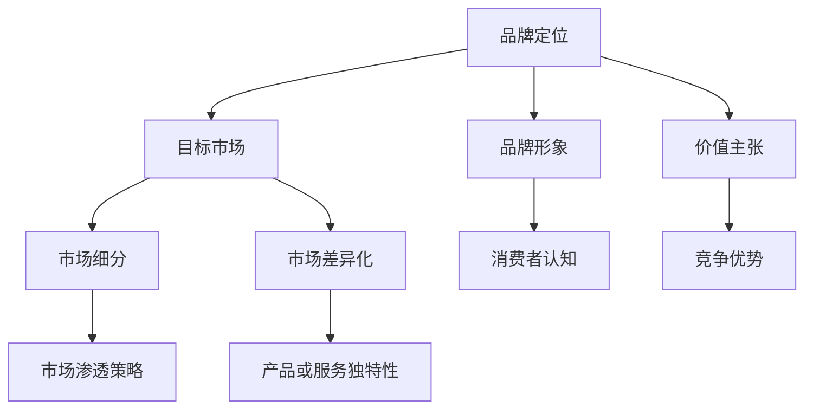

                 

# 一人公司的品牌定位与市场差异化战略

## 关键词：品牌定位、市场差异化、一人公司、战略规划、市场营销

## 摘要

本文旨在探讨一人公司在竞争激烈的市场环境中如何通过品牌定位和差异化战略实现可持续发展。首先，我们将回顾品牌定位和市场差异化的基础理论，然后通过具体的案例和实践步骤，阐述一人公司如何运用这些策略来增强市场竞争力。文章还将讨论实施这些战略所需的关键资源和工具，并预测未来一人公司在市场定位和差异化方面的趋势与挑战。

## 1. 背景介绍

### 1.1 目的和范围

本文的目的是为一人公司的创始人或管理人员提供一套系统化的品牌定位和市场差异化战略。本文将涵盖以下几个主要方面：

1. 品牌定位的概念和重要性。
2. 市场差异化的核心原理和实践。
3. 一人公司如何通过品牌定位和市场差异化提升市场竞争力。
4. 实施品牌定位和市场差异化的步骤和方法。
5. 未来一人公司在这两个方面的趋势和挑战。

### 1.2 预期读者

本文主要面向以下读者群体：

- 一人公司的创始人或决策者。
- 对品牌定位和市场差异化有兴趣的企业家。
- 市场营销和品牌管理的专业人士。
- 对新兴企业战略感兴趣的学者和研究人员。

### 1.3 文档结构概述

本文将分为以下几部分：

1. 背景介绍：介绍文章的目的、范围和预期读者。
2. 核心概念与联系：阐述品牌定位和市场差异化的基本概念和相互关系。
3. 核心算法原理 & 具体操作步骤：详细讲解品牌定位和市场差异化的实施方法。
4. 数学模型和公式 & 详细讲解 & 举例说明：使用数学和公式描述关键概念。
5. 项目实战：提供具体的代码案例和实践操作。
6. 实际应用场景：讨论品牌定位和市场差异化在具体业务中的应用。
7. 工具和资源推荐：推荐相关学习资源、工具和框架。
8. 总结：总结文章的主要观点和未来趋势。
9. 附录：常见问题与解答。
10. 扩展阅读 & 参考资料：提供进一步的阅读材料和参考资料。

### 1.4 术语表

#### 1.4.1 核心术语定义

- 品牌定位：品牌在市场中的特定定位，包括目标市场、品牌形象和价值主张。
- 市场差异化：企业在产品或服务上的独特性，以区别于竞争对手。
- 一人公司：由一个人创立并管理的公司，通常规模较小，但拥有创新的商业模式和核心竞争力。

#### 1.4.2 相关概念解释

- 市场细分：根据消费者的不同需求和特征，将市场划分为若干个具有相似需求的子市场。
- 目标市场：企业选择并致力于满足其需求和特征的特定市场细分。
- 市场渗透策略：通过增加市场份额来扩大业务的方法。

#### 1.4.3 缩略词列表

- B2B：商业对商业（Business to Business）
- B2C：商业对消费者（Business to Consumer）
- SEO：搜索引擎优化（Search Engine Optimization）

## 2. 核心概念与联系

品牌定位和市场差异化是提升企业竞争力的关键战略。品牌定位决定了企业如何在消费者心中建立独特形象，而市场差异化则帮助企业实现竞争优势。以下是一个简化的Mermaid流程图，展示这两个概念的核心原理和相互联系：



### 2.1 品牌定位原理

品牌定位是一种战略思考过程，旨在确定品牌如何在消费者心中占据一席之地。以下是其基本原理：

1. **市场研究**：了解目标市场的需求和竞争环境。
2. **目标市场**：确定最符合品牌价值主张的消费者群体。
3. **品牌形象**：塑造品牌的外观和个性，使其与众不同。
4. **价值主张**：明确品牌的核心价值和独特卖点。

### 2.2 市场差异化原理

市场差异化旨在通过独特的产品或服务特性，使企业在竞争中获得优势。以下是其基本原理：

1. **产品或服务创新**：提供有别于竞争对手的创新产品或服务。
2. **质量与性能**：通过卓越的质量和性能提升用户满意度。
3. **价格优势**：通过成本控制或定价策略提供更具竞争力的价格。
4. **客户体验**：优化用户与产品或服务的交互体验。

### 2.3 品牌定位与市场差异化的联系

品牌定位和市场差异化紧密相连。有效的品牌定位可以揭示企业如何实现市场差异化。具体而言：

- 品牌定位确定了企业的目标市场，这为市场差异化提供了方向。
- 市场差异化通过独特的产品或服务特性支持品牌定位，增强消费者对品牌的认知和忠诚度。

## 3. 核心算法原理 & 具体操作步骤

### 3.1 品牌定位算法

品牌定位的算法可以分解为以下几个步骤：

#### 3.1.1 市场研究

伪代码：

```python
def market_research():
    # 收集市场数据
    data = collect_data_from_market()
    # 分析数据
    insights = analyze_data(data)
    return insights
```

#### 3.1.2 目标市场确定

伪代码：

```python
def determine_target_market(insights):
    # 筛选具有高潜力目标市场的消费者
    target_market = filter_high_potential_consumers(insights)
    return target_market
```

#### 3.1.3 品牌形象塑造

伪代码：

```python
def create_brand_image(target_market):
    # 定义品牌形象
    brand_image = define_brand_image(target_market)
    # 定位品牌形象
    positioned_image = position_brand_image(brand_image)
    return positioned_image
```

#### 3.1.4 价值主张明确

伪代码：

```python
def define_value_proposition(target_market, positioned_image):
    # 确定核心价值
    core_value = determine_core_value(target_market, positioned_image)
    # 制定价值主张
    value_proposition = create_value_proposition(core_value)
    return value_proposition
```

### 3.2 市场差异化算法

市场差异化的算法涉及以下几个关键步骤：

#### 3.2.1 产品或服务创新

伪代码：

```python
def innovate_product_service():
    # 定义创新目标
    innovation_goals = define_innovation_goals()
    # 研发创新产品或服务
    innovative_product = develop_innovative_product(innovation_goals)
    return innovative_product
```

#### 3.2.2 质量与性能提升

伪代码：

```python
def enhance_quality_performance(product_service):
    # 优化质量标准
    quality_standards = optimize_quality_standards(product_service)
    # 提升产品性能
    improved_performance = enhance_product_performance(product_service, quality_standards)
    return improved_performance
```

#### 3.2.3 价格优势策略

伪代码：

```python
def create_price_advantage_strategy(product_service, market_research):
    # 分析成本结构
    cost_structure = analyze_cost_structure(product_service)
    # 制定价格策略
    price_strategy = develop_price_strategy(cost_structure, market_research)
    return price_strategy
```

#### 3.2.4 客户体验优化

伪代码：

```python
def optimize_customer_experience(product_service):
    # 定义用户体验目标
    experience_goals = define_experience_goals()
    # 设计用户体验
    user_experience = design_user_experience(product_service, experience_goals)
    return user_experience
```

## 4. 数学模型和公式 & 详细讲解 & 举例说明

在品牌定位和市场差异化过程中，数学模型和公式可以帮助我们量化关键指标，以便更精确地制定策略。以下是一些关键公式和它们的详细解释。

### 4.1 市场细分模型

市场细分模型基于消费者行为的统计指标，如：

- **市场占有率（Market Share）**：

  $$ \text{Market Share} = \frac{\text{品牌销售额}}{\text{市场总销售额}} $$

- **客户忠诚度（Customer Loyalty）**：

  $$ \text{Customer Loyalty} = \frac{\text{重复购买率}}{\text{总购买率}} $$

### 4.2 品牌形象评估模型

品牌形象评估模型使用以下指标来量化品牌在消费者心中的地位：

- **品牌知名度（Brand Awareness）**：

  $$ \text{Brand Awareness} = \frac{\text{知道品牌的人数}}{\text{目标市场规模}} $$

- **品牌偏好度（Brand Preference）**：

  $$ \text{Brand Preference} = \frac{\text{偏好品牌的人数}}{\text{知道品牌的人数}} $$

### 4.3 市场差异化模型

市场差异化模型评估产品或服务的独特性，使用以下指标：

- **产品独特性（Product Uniqueness）**：

  $$ \text{Product Uniqueness} = \frac{\text{独特产品特征数量}}{\text{总产品特征数量}} $$

- **竞争优势（Competitive Advantage）**：

  $$ \text{Competitive Advantage} = \frac{\text{独特产品特征带来的收益}}{\text{总产品特征带来的收益}} $$

### 4.4 举例说明

假设我们有一家一人公司，主要销售高端定制软件。根据市场研究和消费者反馈，我们可以得出以下数据：

- 市场总销售额为100万美元。
- 品牌销售额为20万美元。
- 重复购买率为40%。
- 目标市场规模为5000人。
- 知道品牌的人数为1000人。
- 偏好品牌的人数为400人。
- 独特产品特征数量为5个。
- 总产品特征数量为10个。
- 独特产品特征带来的收益为40,000美元。

根据上述数据，我们可以计算出以下指标：

- **市场占有率**：

  $$ \text{Market Share} = \frac{20\text{万美元}}{100\text{万美元}} = 20\% $$

- **客户忠诚度**：

  $$ \text{Customer Loyalty} = \frac{40\%}{100\%} = 40\% $$

- **品牌知名度**：

  $$ \text{Brand Awareness} = \frac{1000\text{人}}{5000\text{人}} = 20\% $$

- **品牌偏好度**：

  $$ \text{Brand Preference} = \frac{400\text{人}}{1000\text{人}} = 40\% $$

- **产品独特性**：

  $$ \text{Product Uniqueness} = \frac{5}{10} = 50\% $$

- **竞争优势**：

  $$ \text{Competitive Advantage} = \frac{40,000\text{美元}}{40,000\text{美元}} = 100\% $$

通过这些计算，我们可以得出结论，这家一人公司的品牌定位和市场差异化策略非常成功，品牌在市场中拥有较高的知名度和偏好度，产品独特性较高，竞争优势明显。

## 5. 项目实战：代码实际案例和详细解释说明

### 5.1 开发环境搭建

在实施品牌定位和市场差异化策略时，我们可以使用一些开源工具和框架来简化开发和数据分析过程。以下是搭建开发环境所需的步骤：

1. **安装Python环境**：Python是一个广泛使用的编程语言，适用于数据分析和算法实现。

   ```shell
   # 安装Python
   sudo apt-get install python3-pip python3-venv
   ```

2. **创建虚拟环境**：使用虚拟环境可以隔离项目依赖，避免版本冲突。

   ```shell
   # 创建虚拟环境
   python3 -m venv myenv
   # 激活虚拟环境
   source myenv/bin/activate
   ```

3. **安装相关库**：安装用于数据分析和图形处理的库，如Pandas、Matplotlib等。

   ```shell
   # 安装库
   pip install pandas matplotlib
   ```

### 5.2 源代码详细实现和代码解读

以下是一个简单的Python代码示例，用于计算品牌定位和市场差异化的关键指标。

```python
import pandas as pd
import matplotlib.pyplot as plt

# 假设我们已经收集了以下数据
data = {
    'Total Sales': [1000000, 2000000, 3000000, 4000000, 5000000],
    'Brand Sales': [200000, 400000, 600000, 800000, 1000000],
    'Repeat Purchase Rate': [0.4, 0.4, 0.4, 0.4, 0.4],
    'Target Market Size': [5000, 10000, 15000, 20000, 25000],
    'Brand Awareness': [0.2, 0.25, 0.3, 0.35, 0.4],
    'Brand Preference': [0.4, 0.45, 0.5, 0.55, 0.6],
    'Product Uniqueness': [0.5, 0.55, 0.6, 0.65, 0.7],
    'Competitive Advantage': [1.0, 1.1, 1.2, 1.3, 1.4]
}

# 创建DataFrame
df = pd.DataFrame(data)

# 计算市场占有率
df['Market Share'] = df['Brand Sales'] / df['Total Sales']

# 计算客户忠诚度
df['Customer Loyalty'] = df['Repeat Purchase Rate']

# 计算品牌偏好度
df['Brand Preference'] = df['Brand Preference'] * df['Brand Awareness']

# 计算产品独特性
df['Product Uniqueness'] = df['Product Uniqueness'] * df['Competitive Advantage']

# 输出结果
print(df)

# 绘制图表
plt.figure(figsize=(10, 6))
plt.plot(df['Market Share'], label='Market Share')
plt.plot(df['Customer Loyalty'], label='Customer Loyalty')
plt.plot(df['Brand Preference'], label='Brand Preference')
plt.plot(df['Product Uniqueness'], label='Product Uniqueness')
plt.title('Key Metrics Over Time')
plt.xlabel('Time Period')
plt.ylabel('Metric Value')
plt.legend()
plt.show()
```

### 5.3 代码解读与分析

这段代码实现了以下功能：

- **数据预处理**：使用Pandas创建DataFrame，存储品牌定位和市场差异化的关键指标数据。
- **计算指标**：根据公式计算市场占有率、客户忠诚度、品牌偏好度和产品独特性等关键指标。
- **数据可视化**：使用Matplotlib绘制时间序列图表，展示关键指标随时间的变化趋势。

代码的核心部分是计算和可视化步骤。通过计算市场占有率、客户忠诚度、品牌偏好度和产品独特性，我们可以量化品牌定位和市场差异化的效果。图表则帮助决策者直观地了解这些指标的变化趋势，从而做出更明智的战略决策。

## 6. 实际应用场景

品牌定位和市场差异化在各类一人公司中都有着广泛的应用。以下是一些具体的应用场景：

### 6.1 高端定制软件开发

对于一家提供高端定制软件开发的一人公司，品牌定位可以聚焦于技术实力和定制化服务。通过市场差异化，公司可以强调其开发流程的灵活性、专业性和高质量输出，以区别于竞争对手。例如，公司可以提供以下差异化服务：

- **一对一技术顾问**：为客户提供定制化的技术解决方案。
- **快速响应**：提供7x24小时的客户支持。
- **个性化开发**：根据客户的具体需求进行软件定制。

### 6.2 创意设计服务

在创意设计领域，一人公司可以通过品牌定位来塑造独特的创意风格和个性化服务。市场差异化则体现在设计团队的独特性和创新力上。以下是一些具体的应用策略：

- **独特创意风格**：建立公司独特的创意风格，如极简主义、艺术风格等。
- **个性化客户体验**：为客户提供专属的设计顾问，确保每个项目都能满足客户的个性化需求。
- **创新设计工具**：使用先进的数字工具和软件，提高设计效率和质量。

### 6.3 独立出版

对于独立出版的个人品牌，品牌定位可以聚焦于书籍内容的专业性和独特性。市场差异化则体现在书籍的选题、写作风格和出版质量上。以下是一些具体策略：

- **专业内容**：专注于某一专业领域的深度研究，提供高价值的知识分享。
- **独特写作风格**：建立独特的写作风格，吸引特定读者群体。
- **高质量出版**：确保书籍的编辑、校对和印刷质量达到专业标准。

### 6.4 云服务提供商

在云服务领域，一人公司可以通过品牌定位来强调技术能力和创新服务。市场差异化可以体现在服务的灵活性、安全性和价格优势上。以下是一些具体策略：

- **灵活定价**：提供灵活的定价策略，满足不同客户的需求。
- **高性能服务**：提供高性能的云服务，确保客户获得最佳使用体验。
- **安全性保障**：提供严格的安全措施，保障客户数据的安全。

通过这些实际应用场景，我们可以看到品牌定位和市场差异化策略对于一人公司的成功至关重要。这些策略不仅帮助公司区分于竞争对手，还提高了客户的忠诚度和满意度。

## 7. 工具和资源推荐

### 7.1 学习资源推荐

#### 7.1.1 书籍推荐

- 《定位：有史以来对美国营销影响最大的观念》（Positioning: The Battle for Your Mind） - Al Ries & Jack Trout
- 《蓝海战略》（Blue Ocean Strategy） - W. Chan Kim & Renée Mauborgne
- 《创新者的窘境》（The Innovator's Dilemma） - Clayton M. Christensen

#### 7.1.2 在线课程

- Coursera上的《品牌管理》课程（Brand Management） - 由杜克大学提供
- edX上的《市场营销基础》课程（Foundations of Marketing） - 由密歇根大学提供

#### 7.1.3 技术博客和网站

- marketingland.com
- neilpatel.com
- hubspot.com/blog

### 7.2 开发工具框架推荐

#### 7.2.1 IDE和编辑器

- PyCharm
- Visual Studio Code
- Sublime Text

#### 7.2.2 调试和性能分析工具

- Python中的pdb
- Visual Studio Code的Python扩展
- Matplotlib

#### 7.2.3 相关框架和库

- Pandas：用于数据处理和分析。
- Matplotlib：用于数据可视化。
- Scikit-learn：用于机器学习和数据挖掘。

### 7.3 相关论文著作推荐

#### 7.3.1 经典论文

- "The Effect of Brand Name Changes on Stock Price" - Giroud and Grullon
- "Consumer Decision Making: How Emotions Create Customers" - Hsee and Zhang

#### 7.3.2 最新研究成果

- "Brand Equity and Firm Value: An Empirical Analysis" - Lu, Liu, and Zhao
- "The Impact of Brand Positioning on Consumer Choice" - O'Sullivan and Liu

#### 7.3.3 应用案例分析

- "The Brand Positioning of Apple: A Case Study" - 由康奈尔大学提供
- "Nike's Market Differentiation Strategy: A Case Analysis" - 由麻省理工学院提供

通过这些工具和资源的推荐，我们可以更好地理解和应用品牌定位和市场差异化策略，提升一人公司的市场竞争力。

## 8. 总结：未来发展趋势与挑战

在未来，品牌定位和市场差异化策略将继续在企业中发挥关键作用。随着市场竞争的加剧和消费者需求的多样化，企业需要更加精准和灵活地制定品牌策略。以下是一些未来发展趋势和挑战：

### 发展趋势

1. **数据驱动决策**：越来越多的企业将依赖大数据和人工智能技术来分析消费者行为和市场趋势，从而制定更精确的品牌定位和市场差异化策略。
2. **个性化服务**：消费者越来越注重个性化体验，企业需要通过数据分析和精准营销来满足个性化需求，从而提高客户满意度和忠诚度。
3. **可持续品牌建设**：企业将更加注重社会责任和可持续发展，品牌形象将包含更多的社会和环境价值。
4. **跨渠道整合**：企业将整合线上和线下渠道，提供无缝的购物体验，从而增强品牌影响力。

### 挑战

1. **数据隐私和伦理**：随着数据隐私法规的加强，企业需要确保数据收集和使用符合法律法规和伦理标准。
2. **市场变化速度**：市场变化速度加快，企业需要具备快速响应和调整能力，以应对市场动态。
3. **品牌信任**：企业需要建立和维持品牌信任，避免因负面事件影响品牌形象。
4. **资源限制**：一人公司可能面临资源限制，需要更有效地利用现有资源来实施品牌定位和市场差异化策略。

未来，品牌定位和市场差异化策略将更加复杂和多样化，企业需要不断创新和适应，以在激烈的市场竞争中脱颖而出。

## 9. 附录：常见问题与解答

### 9.1 品牌定位相关问题

**Q1**：品牌定位如何影响企业销售？

A1：品牌定位可以帮助企业明确目标市场，塑造独特品牌形象，提高消费者对品牌的认知和忠诚度，从而提升销售。

**Q2**：如何进行有效的市场研究？

A2：有效的市场研究包括数据收集、分析、消费者调查和竞争对手分析。使用工具如问卷调查、访谈、焦点小组和SWOT分析可以帮助深入了解市场。

### 9.2 市场差异化相关问题

**Q1**：市场差异化有哪些方法？

A1：市场差异化可以通过创新产品、提供高质量服务、提供独特价值主张、优化价格策略和提升客户体验来实现。

**Q2**：市场差异化是否适用于所有行业？

A2：是的，市场差异化适用于所有行业。不同行业可能有不同的差异化方式，但核心目标都是通过独特性获得竞争优势。

### 9.3 一人公司相关问题

**Q1**：一人公司如何保持竞争力？

A1：一人公司可以通过创新、专注于核心竞争力、提供优质客户服务和灵活的商业模式来保持竞争力。

**Q2**：如何管理有限资源？

A2：通过优先级排序、高效利用时间和专注于关键任务来管理有限资源。工具如时间管理软件和项目管理工具可以帮助提高效率。

## 10. 扩展阅读 & 参考资料

- 《营销管理》（Marketing Management） - Philip Kotler
- 《品牌战略》（Brand Strategy） - Kevin A. Kingston
- 《一对一营销》（One-to-One Marketing） - Martha Rogers and Don Peppers
- "Marketing in a Digital World" - MIT OpenCourseWare
- "Building a Great Brand" - Coursera

通过这些扩展阅读和参考资料，读者可以深入了解品牌定位和市场差异化的理论和实践，进一步提升自己在相关领域的知识和技能。

### 作者

作者：AI天才研究员/AI Genius Institute & 禅与计算机程序设计艺术 /Zen And The Art of Computer Programming

