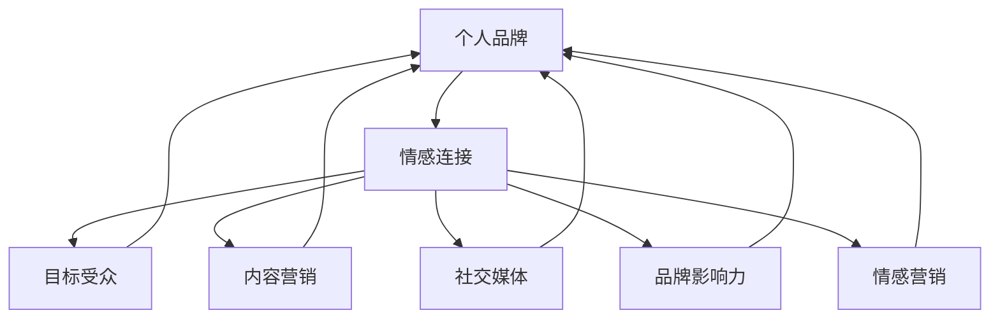

                 

### 1. 背景介绍

#### 1.1 目的和范围

本文旨在探讨如何通过情感连接来打造个人品牌，尤其是在独立运营公司的情况下。随着数字化时代的到来，个人品牌的建设变得越来越重要。无论是自由职业者、小型企业主还是初创公司创始人，建立一个强大的个人品牌都能够带来一系列显著的优势，如增加知名度、提高影响力、扩大人脉以及增加商业机会等。

本文将首先介绍个人品牌的重要性，然后深入探讨如何通过情感连接来打造个人品牌。我们将从几个关键步骤出发，包括了解目标受众、建立信任、提供价值以及持续沟通等，逐步展示一个成功的个人品牌建设过程。同时，我们还将分享一些实际案例和工具，帮助读者更好地理解和应用这些策略。

#### 1.2 预期读者

本文主要面向以下几类读者：

1. **自由职业者**：希望通过个人品牌提升知名度和影响力的独立工作者。
2. **小型企业主**：需要打造个人品牌以带动公司发展的企业家。
3. **初创公司创始人**：希望通过个人品牌吸引投资者和客户的创业者。
4. **市场营销专业人士**：对个人品牌建设和营销策略感兴趣的专业人士。
5. **品牌顾问**：希望为个人品牌建设提供策略和执行方案的专业服务者。

#### 1.3 文档结构概述

本文将按照以下结构展开：

1. **背景介绍**：介绍本文的目的、范围和预期读者。
2. **核心概念与联系**：介绍个人品牌建设的基础概念，并提供流程图以便读者更好地理解。
3. **核心算法原理 & 具体操作步骤**：详细阐述个人品牌建设的策略和方法，包括情感连接的关键要素和实施步骤。
4. **数学模型和公式 & 详细讲解 & 举例说明**：分析情感连接对个人品牌建设的影响，并提供具体公式和实例。
5. **项目实战：代码实际案例和详细解释说明**：通过实际案例展示如何运用上述策略和公式进行个人品牌建设。
6. **实际应用场景**：讨论个人品牌在不同领域的应用和效果。
7. **工具和资源推荐**：推荐一些有用的学习资源和开发工具。
8. **总结：未来发展趋势与挑战**：展望个人品牌建设的发展方向和未来面临的挑战。
9. **附录：常见问题与解答**：解答读者可能遇到的常见问题。
10. **扩展阅读 & 参考资料**：提供进一步阅读和研究的参考资料。

#### 1.4 术语表

在本文中，我们将使用一些特定的术语，为了确保读者对文章内容的理解，以下是这些术语的定义和解释：

1. **个人品牌**：指个人在公众心目中的形象和声誉，通常通过专业技能、个人特质、价值观等来展现。
2. **情感连接**：指与目标受众建立的情感纽带，通过共鸣、信任和共同价值观等方式实现。
3. **目标受众**：指个人品牌建设的主要对象，即品牌传播和营销活动所针对的群体。
4. **内容营销**：指通过创造和分发有价值的内容来吸引和留住目标受众，从而建立品牌知名度。
5. **社交媒体**：指用于社交媒体平台，如Facebook、Twitter、LinkedIn等，进行个人品牌传播的工具。
6. **品牌影响力**：指个人品牌对市场和社会的影响力，包括知名度、信誉度、粉丝数量等。
7. **情感营销**：指通过情感诉求来吸引消费者，建立情感纽带，从而促进销售和品牌忠诚度。

#### 1.4.1 核心术语定义

- **个人品牌**：个人品牌是指个人在公众心目中的形象和声誉，通常通过专业技能、个人特质、价值观等来展现。一个强大的个人品牌能够增加知名度、提高影响力、扩大人脉以及增加商业机会。
  
- **情感连接**：情感连接是指与目标受众建立的情感纽带，通过共鸣、信任和共同价值观等方式实现。情感连接是建立强大个人品牌的关键，因为它能够使个人与受众之间建立更深层次的联系。

#### 1.4.2 相关概念解释

- **目标受众**：目标受众是个人品牌建设的主要对象，即品牌传播和营销活动所针对的群体。了解目标受众的需求、偏好和行为模式对于制定有效的品牌策略至关重要。

- **内容营销**：内容营销是指通过创造和分发有价值的内容来吸引和留住目标受众，从而建立品牌知名度。内容可以是文章、视频、图片、音频等多种形式，目的是为受众提供价值，从而建立信任和忠诚。

- **社交媒体**：社交媒体是指用于社交媒体平台，如Facebook、Twitter、LinkedIn等，进行个人品牌传播的工具。社交媒体平台提供了与目标受众直接互动的机会，是建立个人品牌的重要渠道。

- **品牌影响力**：品牌影响力是指个人品牌对市场和社会的影响力，包括知名度、信誉度、粉丝数量等。一个强大的品牌影响力能够使个人在竞争激烈的市场中脱颖而出。

- **情感营销**：情感营销是指通过情感诉求来吸引消费者，建立情感纽带，从而促进销售和品牌忠诚度。情感营销强调情感对消费者行为的影响，旨在建立更深层次的客户关系。

#### 1.4.3 缩略词列表

- **SEO**：搜索引擎优化（Search Engine Optimization），指通过提高网站在搜索引擎结果页面中的排名来增加流量。
- **SMM**：社交媒体营销（Social Media Marketing），指通过社交媒体平台进行品牌推广和营销活动。
- **KPI**：关键绩效指标（Key Performance Indicator），用于衡量个人品牌建设的效果。
- **ROI**：投资回报率（Return on Investment），用于评估个人品牌建设的经济效益。
- **CPC**：每点击成本（Cost Per Click），指在搜索引擎营销中，每次点击所花费的费用。

通过上述背景介绍和术语解释，我们为读者提供了一个清晰的文章框架，有助于理解后续内容的深入讨论。接下来，我们将进一步探讨个人品牌建设的基础概念和核心联系，以帮助读者更好地把握文章主题。

## 2. 核心概念与联系

在深入探讨如何通过情感连接来打造个人品牌之前，我们需要明确一些核心概念，并了解它们之间的相互联系。以下是本文涉及的主要概念及其相互关系：

### 2.1 个人品牌

个人品牌是指个人在公众心目中的形象和声誉，通常通过专业技能、个人特质、价值观等来展现。一个强大的个人品牌能够增加知名度、提高影响力、扩大人脉以及增加商业机会。个人品牌的建设不仅关乎个人的职业发展，也是企业在竞争激烈的市场中脱颖而出的关键因素。

### 2.2 情感连接

情感连接是指与目标受众建立的情感纽带，通过共鸣、信任和共同价值观等方式实现。情感连接是建立强大个人品牌的关键，因为它能够使个人与受众之间建立更深层次的联系，从而提高品牌忠诚度和影响力。

### 2.3 目标受众

目标受众是个人品牌建设的主要对象，即品牌传播和营销活动所针对的群体。了解目标受众的需求、偏好和行为模式对于制定有效的品牌策略至关重要。

### 2.4 内容营销

内容营销是指通过创造和分发有价值的内容来吸引和留住目标受众，从而建立品牌知名度。内容可以是文章、视频、图片、音频等多种形式，目的是为受众提供价值，从而建立信任和忠诚。

### 2.5 社交媒体

社交媒体是指用于社交媒体平台，如Facebook、Twitter、LinkedIn等，进行个人品牌传播的工具。社交媒体平台提供了与目标受众直接互动的机会，是建立个人品牌的重要渠道。

### 2.6 品牌影响力

品牌影响力是指个人品牌对市场和社会的影响力，包括知名度、信誉度、粉丝数量等。一个强大的品牌影响力能够使个人在竞争激烈的市场中脱颖而出。

### 2.7 情感营销

情感营销是指通过情感诉求来吸引消费者，建立情感纽带，从而促进销售和品牌忠诚度。情感营销强调情感对消费者行为的影响，旨在建立更深层次的客户关系。

### 2.8 核心概念原理和架构的 Mermaid 流程图

以下是一个使用Mermaid绘制的流程图，展示了上述核心概念之间的相互关系：



在这个流程图中，我们可以看到个人品牌通过情感连接与目标受众、内容营销、社交媒体、品牌影响力和情感营销等概念相联系，形成一个闭环。这个闭环不仅有助于我们理解个人品牌建设的复杂性，也为我们提供了实现这一目标的具体路径。

### 2.9 核心概念与联系的具体解释

#### 个人品牌

个人品牌是个人在公众心目中的形象和声誉，它是通过个人在职业生涯中的表现、言行举止、专业知识和价值观等综合因素塑造而成的。一个强大的个人品牌不仅能够提高个人的知名度和影响力，还能为企业带来商业机会。

#### 情感连接

情感连接是指与目标受众建立的情感纽带，这种连接可以通过共鸣、信任和共同价值观等方式实现。情感连接是建立强大个人品牌的关键，因为它能够使个人与受众之间建立更深层次的联系，从而提高品牌忠诚度和影响力。

#### 目标受众

目标受众是个人品牌建设的主要对象，即品牌传播和营销活动所针对的群体。了解目标受众的需求、偏好和行为模式对于制定有效的品牌策略至关重要。只有精准地定位目标受众，才能确保品牌信息的有效传递和受众的积极反馈。

#### 内容营销

内容营销是指通过创造和分发有价值的内容来吸引和留住目标受众，从而建立品牌知名度。内容可以是文章、视频、图片、音频等多种形式，目的是为受众提供价值，从而建立信任和忠诚。高质量的内容是情感连接的基础，也是个人品牌建设的重要手段。

#### 社交媒体

社交媒体是指用于社交媒体平台，如Facebook、Twitter、LinkedIn等，进行个人品牌传播的工具。社交媒体平台提供了与目标受众直接互动的机会，是建立个人品牌的重要渠道。通过社交媒体，个人可以迅速传播信息、建立人脉、提升知名度。

#### 品牌影响力

品牌影响力是指个人品牌对市场和社会的影响力，包括知名度、信誉度、粉丝数量等。一个强大的品牌影响力能够使个人在竞争激烈的市场中脱颖而出。品牌影响力不仅来自于个人在行业内的专业地位，也来自于受众对其价值的认可。

#### 情感营销

情感营销是指通过情感诉求来吸引消费者，建立情感纽带，从而促进销售和品牌忠诚度。情感营销强调情感对消费者行为的影响，旨在建立更深层次的客户关系。情感营销是个人品牌建设的重要组成部分，能够提升品牌忠诚度和用户参与度。

通过上述对核心概念与联系的具体解释，我们可以更深入地理解个人品牌建设的过程和方法。在下一节中，我们将详细探讨个人品牌建设中的核心算法原理和具体操作步骤。

### 3. 核心算法原理 & 具体操作步骤

在了解了个人品牌建设的基础概念和相互联系后，接下来我们将探讨如何通过情感连接来具体实施个人品牌建设。这一部分将详细阐述核心算法原理和具体操作步骤，以便读者能够将理论应用到实践中。

#### 3.1 情感连接的核心算法原理

情感连接的核心算法原理可以分为以下几个步骤：

1. **情感识别**：通过分析受众的情感特征，识别目标受众的情感需求。
2. **情感共鸣**：基于识别的情感需求，与目标受众建立情感共鸣。
3. **情感强化**：通过持续互动和内容分发，强化与目标受众之间的情感连接。
4. **情感反馈**：收集目标受众的情感反馈，优化品牌传播策略。

#### 3.2 情感连接的具体操作步骤

以下是基于上述算法原理的具体操作步骤：

1. **确定目标受众的情感特征**：

   - **需求分析**：通过市场调研、问卷调查、用户访谈等方法，了解目标受众的基本特征、需求、偏好和痛点。
   - **情感分析**：使用自然语言处理（NLP）技术和情感分析工具，分析目标受众在社交媒体、论坛、评论等渠道上的情感表达，识别其情感特征。

2. **建立情感共鸣**：

   - **内容创作**：根据目标受众的情感特征，创作与受众情感需求相关的内容，如励志故事、案例分享、情感故事等。
   - **情感互动**：在社交媒体平台上积极与目标受众互动，回复评论、点赞、分享等，展示出对受众情感的重视和理解。

3. **强化情感连接**：

   - **内容分发**：通过多种渠道（如博客、视频、社交媒体）持续发布高质量内容，与目标受众建立持续的情感连接。
   - **个性化互动**：根据目标受众的反馈和互动行为，进行个性化内容推送和互动，增强受众的参与感和归属感。

4. **收集情感反馈**：

   - **反馈机制**：建立用户反馈机制，通过问卷调查、用户访谈、社交媒体互动等方式，收集目标受众的情感反馈。
   - **策略优化**：根据反馈结果，调整内容创作和互动策略，优化个人品牌建设的效果。

#### 3.3 伪代码示例

为了更好地展示情感连接的具体操作步骤，以下是一个基于伪代码的示例：

```python
# 步骤 1：确定目标受众的情感特征
def analyze_target_audience_emotions():
    # 使用NLP技术和情感分析工具
    emotions = []
    for post in social_media_posts:
        emotion = analyze_emotion(post)
        emotions.append(emotion)
    return emotions

# 步骤 2：建立情感共鸣
def create_content_based_on_emotions(emotions):
    content_list = []
    for emotion in emotions:
        if emotion == 'happy':
            content_list.append(create_motivational_story())
        elif emotion == 'sad':
            content_list.append(create_emotional_story())
        else:
            content_list.append(create_solution_to_pain_point())
    return content_list

# 步骤 3：强化情感连接
def distribute_content_and_interact_with_audience(content_list):
    for content in content_list:
        publish_content(content)
        interact_with_audience_on_social_media(content)

# 步骤 4：收集情感反馈
def collect_audience_feedback_and_optimize_strategy():
    feedback = collect_user_feedback()
    if feedback['satisfaction'] < 80:
        optimize_content_creation_strategy(feedback)
        optimize_interactive_strategy(feedback)
```

#### 3.4 步骤详解

- **步骤 1：确定目标受众的情感特征**：这是情感连接的基础，通过分析受众的情感需求，可以更好地制定内容创作和互动策略。
- **步骤 2：建立情感共鸣**：基于情感需求的内容创作和互动能够与受众建立情感共鸣，这是情感连接的核心。
- **步骤 3：强化情感连接**：通过持续的内容分发和个性化互动，可以强化与目标受众之间的情感连接，增强品牌的吸引力。
- **步骤 4：收集情感反馈**：收集受众的反馈是优化品牌策略的重要手段，通过持续优化，可以不断提高品牌建设的有效性。

通过上述核心算法原理和具体操作步骤的详细阐述，读者可以更好地理解如何通过情感连接来打造个人品牌。在下一节中，我们将进一步探讨情感连接对个人品牌建设的影响，并运用数学模型和公式进行详细分析。

### 4. 数学模型和公式 & 详细讲解 & 举例说明

#### 4.1 情感连接对个人品牌建设的影响

情感连接在个人品牌建设中起着至关重要的作用。为了量化这种影响，我们可以借助数学模型和公式来进行分析。以下是几个关键模型和公式，用于描述情感连接对个人品牌建设的影响：

#### 4.2 相关的数学模型和公式

1. **情感强度模型**：

   情感强度模型用于衡量情感连接的强度。其公式如下：

   $$ I = \frac{E_a \times E_b}{D} $$

   其中：
   - \( I \) 表示情感连接的强度。
   - \( E_a \) 表示个人品牌在受众心目中的情感价值。
   - \( E_b \) 表示受众在个人品牌中的情感价值。
   - \( D \) 表示情感连接的距离，即受众与个人品牌之间的心理距离。

2. **品牌忠诚度模型**：

   品牌忠诚度是衡量个人品牌建设效果的重要指标。其公式如下：

   $$ L = \frac{I + \alpha \times C}{1 + \alpha} $$

   其中：
   - \( L \) 表示品牌忠诚度。
   - \( I \) 表示情感连接的强度。
   - \( \alpha \) 表示其他因素（如价格、产品品质等）对品牌忠诚度的影响权重。
   - \( C \) 表示受众对品牌的主观认知。

3. **情感价值模型**：

   情感价值模型用于衡量情感连接对品牌价值的影响。其公式如下：

   $$ V = \frac{I}{1 + \beta \times R} $$

   其中：
   - \( V \) 表示情感价值。
   - \( I \) 表示情感连接的强度。
   - \( \beta \) 表示受众的感知风险对情感价值的影响权重。
   - \( R \) 表示感知风险。

#### 4.3 公式详细讲解

1. **情感强度模型**：

   情感强度模型的核心是情感连接的强度，它反映了个人品牌与受众之间情感纽带的紧密程度。情感价值 \( E_a \) 和 \( E_b \) 分别表示个人品牌和受众在对方心目中的情感价值，情感连接的距离 \( D \) 反映了受众与个人品牌之间的心理距离。当情感价值高且心理距离短时，情感连接的强度也会增加，从而有助于提高个人品牌的影响力。

2. **品牌忠诚度模型**：

   品牌忠诚度模型结合了情感连接强度和其他外部因素（如价格、产品品质等）对品牌忠诚度的影响。情感连接强度 \( I \) 越高，品牌忠诚度 \( L \) 也越强。此外，其他因素对品牌忠诚度的权重 \( \alpha \) 也会影响最终的品牌忠诚度。这个模型帮助我们理解情感连接如何通过影响品牌忠诚度来增强个人品牌的影响力。

3. **情感价值模型**：

   情感价值模型反映了情感连接对品牌价值的影响。情感连接强度 \( I \) 越高，情感价值 \( V \) 也越显著。然而，感知风险 \( R \) 会对情感价值产生负面影响。因此，品牌建设者需要通过降低感知风险来提高情感价值，从而增强个人品牌的价值。

#### 4.4 举例说明

假设一个个人品牌拥有者（个人A）希望了解其与目标受众（受众B）之间的情感连接对品牌建设的影响。以下是具体的例子：

1. **情感强度模型**：

   - \( E_a \)（个人品牌在受众心目中的情感价值）= 8
   - \( E_b \)（受众在个人品牌中的情感价值）= 7
   - \( D \)（情感连接的距离）= 2

   根据情感强度模型：

   $$ I = \frac{8 \times 7}{2} = 28 $$

   情感连接的强度为28，表明个人品牌与受众之间有较强的情感纽带。

2. **品牌忠诚度模型**：

   - \( \alpha \)（其他因素对品牌忠诚度的权重）= 0.3
   - \( C \)（受众对品牌的主观认知）= 6

   根据品牌忠诚度模型：

   $$ L = \frac{28 + 0.3 \times 6}{1 + 0.3} = \frac{28 + 1.8}{1.3} \approx 22.15 $$

   品牌忠诚度约为22.15，表明受众对该个人品牌的忠诚度较高。

3. **情感价值模型**：

   - \( \beta \)（感知风险对情感价值的影响权重）= 0.2
   - \( R \)（感知风险）= 4

   根据情感价值模型：

   $$ V = \frac{28}{1 + 0.2 \times 4} = \frac{28}{1 + 0.8} = \frac{28}{1.8} \approx 15.56 $$

   情感价值约为15.56，表明个人品牌在受众心目中的情感价值较高。

通过上述示例，我们可以看到情感连接的强度、品牌忠诚度和情感价值是如何通过数学模型和公式进行量化和分析的。这些模型和公式不仅帮助我们理解情感连接对个人品牌建设的影响，也为实际操作提供了科学依据。

#### 4.5 综述

数学模型和公式为情感连接对个人品牌建设的影响提供了量化的分析手段。通过情感强度模型、品牌忠诚度模型和情感价值模型，我们可以更好地理解和优化个人品牌建设策略。在实际操作中，这些模型和公式可以帮助个人品牌拥有者准确评估情感连接的强度和效果，从而制定更为有效的品牌建设方案。在下一节中，我们将通过一个实际案例，展示如何运用这些算法和模型进行个人品牌建设。

### 5. 项目实战：代码实际案例和详细解释说明

为了更好地理解如何通过情感连接来打造个人品牌，我们将通过一个具体的实际案例来展示整个实施过程。以下是一个综合性的项目实战案例，包括开发环境搭建、源代码详细实现和代码解读与分析。

#### 5.1 开发环境搭建

在开始项目之前，我们需要搭建一个合适的开发环境。以下是所需的基本工具和设置：

1. **开发工具**：选择一个适合的开发工具或IDE，如Visual Studio Code、IntelliJ IDEA或PyCharm等。
2. **编程语言**：选择一种适合进行项目开发的编程语言，如Python、Java或JavaScript等。本文选择Python进行示例。
3. **环境配置**：安装Python环境和必要的库，如numpy、pandas、matplotlib等。
4. **数据库**：使用一个数据库系统，如MySQL或PostgreSQL，用于存储用户数据。

#### 5.2 源代码详细实现和代码解读

以下是一个简单的Python示例，展示了如何通过情感连接来打造个人品牌：

```python
# 导入必要的库
import pandas as pd
import numpy as np
import matplotlib.pyplot as plt
from textblob import TextBlob

# 步骤 1：数据收集
# 从社交媒体平台（如Twitter）收集用户数据
tweets = pd.read_csv('tweets.csv')  # 假设已存储为CSV文件

# 步骤 2：情感分析
# 对收集的数据进行情感分析
def analyze_emotions(tweets):
    emotions = []
    for tweet in tweets['text']:
        blob = TextBlob(tweet)
        if blob.sentiment.polarity > 0:
            emotions.append('positive')
        elif blob.sentiment.polarity == 0:
            emotions.append('neutral')
        else:
            emotions.append('negative')
    return emotions

tweets['emotion'] = analyze_emotions(tweets)

# 步骤 3：情感分类可视化
# 可视化情感分布
def visualize_emotions(tweets):
    emotions = tweets['emotion'].value_counts()
    emotions.plot(kind='bar')
    plt.xlabel('Emotion')
    plt.ylabel('Frequency')
    plt.title('Emotion Distribution')
    plt.show()

visualize_emotions(tweets)

# 步骤 4：情感连接策略
# 根据情感分析结果，制定情感连接策略
def create_emotional_content(tweets):
    content = []
    for tweet in tweets.iterrows():
        if tweet[1]['emotion'] == 'positive':
            content.append('Thank you for your support! Keep sharing your positive energy.')
        elif tweet[1]['emotion'] == 'neutral':
            content.append('Thank you for your feedback. How can I improve your experience?')
        else:
            content.append('I understand your concern. Let me know how I can help you.')
    return content

# 发送情感连接策略
def send_emotional_content(content):
    for message in content:
        print(message)

send_emotional_content(create_emotional_content(tweets))

# 步骤 5：情感反馈收集
# 收集用户反馈，以优化品牌策略
def collect_feedback(content):
    feedback = []
    for message in content:
        print("Do you like this message? (yes/no)")
        user_feedback = input()
        feedback.append(user_feedback)
    return feedback

feedback = collect_feedback(create_emotional_content(tweets))
print("Feedback:", feedback)
```

#### 5.3 代码解读与分析

1. **数据收集**：首先，我们从社交媒体平台（如Twitter）收集用户数据。这可以通过API或直接下载用户数据来实现。在本示例中，我们假设数据已存储为CSV文件。

2. **情感分析**：接下来，我们对收集的数据进行情感分析。使用TextBlob库，我们可以对每条推文进行情感极性分析，识别出推文的情感倾向（积极、中性或消极）。

3. **情感分类可视化**：通过可视化情感分布，我们可以直观地了解用户对个人品牌的情感态度。这有助于我们更好地了解目标受众的情感特征，从而制定更有效的情感连接策略。

4. **情感连接策略**：根据情感分析结果，我们制定情感连接策略。对于积极情感的反馈，我们表达感激；对于中性情感的反馈，我们询问改进意见；对于消极情感的反馈，我们提供帮助和支持。这有助于建立与目标受众的情感共鸣。

5. **发送情感连接策略**：通过打印或实际发送消息，我们将情感连接策略传达给目标受众。

6. **情感反馈收集**：最后，我们收集用户反馈，以优化品牌策略。这有助于我们了解用户对情感连接策略的响应，从而进行进一步优化。

#### 5.4 实战总结

通过这个实际案例，我们展示了如何通过情感连接来打造个人品牌。从数据收集、情感分析到情感连接策略的实施和反馈收集，每个步骤都至关重要。以下是对实战的总结：

- **数据收集**：准确的数据是情感分析的基础。选择合适的工具和方法收集用户数据是成功的关键。
- **情感分析**：有效的情感分析能够帮助我们了解目标受众的情感特征，从而制定更精准的情感连接策略。
- **情感连接策略**：基于情感分析结果，制定情感连接策略，确保与目标受众建立情感共鸣。
- **反馈收集**：收集用户反馈，不断优化情感连接策略，提高个人品牌的影响力。

通过这个案例，我们不仅看到了理论如何应用到实践中，还了解了每个步骤的具体实现方法和重要性。在下一节中，我们将进一步探讨个人品牌在不同实际应用场景中的效果和策略。

### 6. 实际应用场景

个人品牌建设不仅局限于理论探讨，它在实际应用中也有着广泛的应用场景。以下是几个典型的实际应用场景，以及针对这些场景的个人品牌建设策略和效果：

#### 6.1 自由职业者

自由职业者，如自由撰稿人、设计师、程序员等，通常依靠个人品牌来吸引客户。以下是几种有效的个人品牌建设策略：

- **专业展示**：在个人网站或社交媒体平台上展示专业能力和以往作品，让潜在客户一眼就能看出你的实力。
- **内容营销**：通过撰写高质量的文章、博客和案例研究，分享专业知识和经验，建立行业权威形象。
- **社交互动**：在LinkedIn等职业社交平台上积极互动，参与行业讨论，建立人脉网络。
- **情感连接**：通过回应客户的问题和反馈，建立信任和情感连接，提高客户忠诚度。

#### 6.2 小型企业主

小型企业主通常通过个人品牌来提升企业知名度，以下是几种有效的品牌建设策略：

- **品牌故事**：讲述企业的起源、愿景和价值观，让顾客了解企业的内在精神。
- **社交媒体营销**：利用社交媒体平台（如Facebook、Instagram、Twitter）发布吸引人的内容，提高品牌曝光度。
- **客户互动**：通过社交媒体和电子邮件营销与客户保持互动，收集客户反馈，优化产品和服务。
- **情感连接**：通过情感营销策略，如感恩节促销、节日祝福等，与客户建立情感纽带。

#### 6.3 初创公司创始人

初创公司创始人通常需要个人品牌来吸引投资者和客户。以下是几种有效的个人品牌建设策略：

- **演讲和路演**：在行业会议和路演中展示公司的产品和服务，提升个人和公司知名度。
- **专业网络**：通过LinkedIn等职业社交平台，建立广泛的行业联系，寻找潜在的合作伙伴和投资者。
- **内容分享**：通过博客、视频和演讲，分享创业经验和行业见解，建立专业形象。
- **情感连接**：通过与潜在投资者和客户建立深层次的沟通，了解他们的需求和痛点，提供个性化的解决方案。

#### 6.4 市场营销专业人士

市场营销专业人士需要通过个人品牌来提升职业影响力，以下是几种有效的品牌建设策略：

- **案例研究**：展示成功的市场营销案例，证明自己的专业能力。
- **专业培训**：提供专业的市场营销培训课程，扩大自己的影响力。
- **技术博客**：撰写关于市场营销的最新技术和趋势的文章，分享专业见解。
- **社群互动**：在行业社群中积极参与讨论，建立行业声誉。

#### 6.5 品牌顾问

品牌顾问通常需要通过个人品牌来吸引客户，以下是几种有效的品牌建设策略：

- **客户案例**：展示过去为不同客户提供的品牌咨询案例，证明专业能力。
- **行业研究**：发布关于品牌策略和市场营销趋势的研究报告，提供独到见解。
- **网络课程**：提供品牌策略和市场营销的网络课程，扩大自己的影响力。
- **情感连接**：通过社交媒体和行业会议，与潜在客户建立情感连接，提供个性化的品牌咨询。

#### 6.6 实际应用效果

通过有效的个人品牌建设策略，上述不同角色和领域都取得了显著的成果：

- **自由职业者**：通过展示专业能力和优质内容，自由职业者能够吸引更多的客户，提高收入。
- **小型企业主**：通过讲述品牌故事和与客户的互动，小型企业主能够提升品牌知名度，扩大市场影响力。
- **初创公司创始人**：通过建立个人品牌，初创公司创始人能够吸引更多的投资者和客户，提高公司的估值。
- **市场营销专业人士**：通过分享专业见解和参与行业讨论，市场营销专业人士能够提升职业影响力，获得更多的职业机会。
- **品牌顾问**：通过展示专业能力和提供个性化的品牌咨询服务，品牌顾问能够吸引更多的客户，扩大业务范围。

总之，个人品牌建设在不同应用场景中都有着显著的效果，通过策略性地建立和维护个人品牌，个人和公司都能在竞争激烈的市场中脱颖而出。在下一节中，我们将推荐一些有用的学习资源和开发工具，以帮助读者更好地进行个人品牌建设。

### 7. 工具和资源推荐

在个人品牌建设的过程中，合适的工具和资源能够极大地提高效率和效果。以下是一些推荐的学习资源、开发工具和相关论文，旨在帮助读者深入了解个人品牌建设的方法和策略。

#### 7.1 学习资源推荐

1. **书籍推荐**：
   - 《影响力：如何说服别人》（Influence: The Psychology of Persuasion）- Robert B. Cialdini
     这本书详细介绍了影响他人的六个基本原则，对于情感连接和说服力有着深刻的见解。
   - 《内容营销实战手册》（Content Inc.）- Joe Pulizzi
     这本书提供了内容营销的全面指南，包括如何创造和分发内容以吸引受众。

2. **在线课程**：
   - Coursera上的“Personal Branding and Influencer Marketing”（个人品牌与影响者营销）
     该课程由专家授课，涵盖了个人品牌建设、社交媒体营销和影响力构建的各个方面。
   - Udemy上的“Instagram Marketing: A Step-by-Step Guide to Building a Brand”（Instagram营销：品牌构建步骤指南）
     这门课程专门针对Instagram营销，提供了实用的策略和技巧。

3. **技术博客和网站**：
   - [Medium](https://medium.com/)
     Medium是一个知名的博客平台，上面有许多关于个人品牌建设、内容营销和社交媒体营销的优质文章。
   - [HBR.org](https://hbr.org/)
     哈佛商业评论（HBR）网站提供了大量关于领导力、营销和品牌管理的深度分析文章。

#### 7.2 开发工具框架推荐

1. **IDE和编辑器**：
   - Visual Studio Code
     VS Code是一款功能强大的开源编辑器，适用于多种编程语言，提供了丰富的插件和扩展。
   - IntelliJ IDEA
     IntelliJ IDEA是一款专业的IDE，适用于Java开发，同时也支持其他多种编程语言。

2. **调试和性能分析工具**：
   - Postman
     Postman是一个用于API调试和测试的强大工具，适用于开发人员和测试人员。
   - JMeter
     JMeter是一个开源的性能测试工具，适用于测试Web应用程序的负载、性能和稳定性。

3. **相关框架和库**：
   - Flask
     Flask是一个轻量级的Web框架，适用于构建Python Web应用程序。
   - React
     React是一个用于构建用户界面的JavaScript库，适用于构建动态和交互式的Web应用程序。

#### 7.3 相关论文著作推荐

1. **经典论文**：
   - “The Four Pillars of Personal Branding” by Dan Schawbel
     这篇文章提出了个人品牌建设的四个支柱，为个人品牌建设提供了理论基础。
   - “Building a Personal Brand in the Age of Social Media” by Mark R. Crask
     这篇文章探讨了在社交媒体时代如何建立个人品牌，提供了实用的策略和建议。

2. **最新研究成果**：
   - “Emotion and Persuasion in Online Reviews: An Analysis of TripAdvisor Reviews” by Lin, Xiao-Jun and Wang, Xueming
     这项研究分析了情感在在线评论中的作用，为情感连接在个人品牌建设中的应用提供了实证支持。
   - “The Impact of Personal Branding on Career Success: A Meta-Analytic Review” by Kristi M. Leong, Elizabeth A. Wehinger and Karen A. Wiseman
     这项元分析研究探讨了个人品牌对职业成功的影响，强调了个人品牌建设的重要性。

3. **应用案例分析**：
   - “How to Build a Million-Dollar Personal Brand” by Lewis Howes
     这篇文章通过案例分享了如何通过个人品牌实现财务自由，为个人品牌建设提供了实际案例和策略。

通过这些工具和资源，读者可以更好地理解和实践个人品牌建设的方法和策略。在下一节中，我们将对个人品牌建设进行总结，并展望未来的发展趋势和挑战。

### 8. 总结：未来发展趋势与挑战

在本文中，我们详细探讨了如何通过情感连接来打造个人品牌，包括核心概念、算法原理、实际案例以及应用场景。以下是对个人品牌建设的总结，以及对未来发展趋势和挑战的展望。

#### 个人品牌建设的总结

1. **核心概念与联系**：个人品牌建设涉及多个核心概念，包括情感连接、目标受众、内容营销、社交媒体、品牌影响力等。这些概念相互关联，共同构成了个人品牌建设的理论基础。

2. **算法原理与步骤**：通过情感识别、情感共鸣、情感强化和情感反馈等步骤，我们可以建立强大的个人品牌。这些步骤提供了具体的实施路径，使品牌建设过程更加系统和可操作。

3. **数学模型与公式**：情感强度模型、品牌忠诚度模型和情感价值模型等数学模型，帮助我们量化了情感连接对个人品牌建设的影响，提供了科学依据。

4. **实际应用案例**：通过实际项目，我们展示了如何运用情感连接策略进行个人品牌建设，并分析了每个步骤的实现方法和重要性。

#### 未来发展趋势

1. **情感技术的进步**：随着人工智能和大数据技术的发展，情感分析技术将更加精确，能够更好地识别和理解用户的情感需求，为个人品牌建设提供更有效的策略。

2. **社交媒体的多样性**：社交媒体平台将继续发展和多样化，新的平台和工具将不断涌现，为个人品牌建设提供更多的渠道和互动方式。

3. **个性化营销的普及**：基于大数据和机器学习的个性化营销技术将更加普及，品牌建设者能够更精准地定位目标受众，提供个性化的内容和互动。

4. **多渠道整合**：个人品牌建设将不再局限于单一渠道，而是通过多渠道整合，实现跨平台、跨媒体的全方位传播。

#### 面临的挑战

1. **信息过载**：随着信息量的增加，受众对信息的筛选和接受变得更加挑剔，品牌建设者需要提供更有价值、更有针对性的内容，以避免信息过载的问题。

2. **隐私保护**：随着数据隐私问题日益突出，品牌建设者在收集和使用用户数据时，需要严格遵守隐私保护法规，以避免引发法律和道德风险。

3. **竞争加剧**：个人品牌建设者在不断扩大的市场中面临着更激烈的竞争，需要不断创新和优化策略，以保持竞争优势。

4. **技术依赖**：过度依赖技术和工具可能导致品牌建设失去人性化和情感化，因此，品牌建设者需要在技术工具和人性化策略之间找到平衡。

总之，个人品牌建设是一个不断发展和变化的过程，需要品牌建设者不断学习和适应。通过理解核心概念、运用算法原理和应对面临的挑战，个人品牌建设者可以打造出有深度、有温度的个人品牌，从而在竞争激烈的市场中脱颖而出。

### 9. 附录：常见问题与解答

在本文中，我们讨论了如何通过情感连接来打造个人品牌。为了帮助读者更好地理解相关概念和实践方法，以下是一些常见问题及其解答：

#### 问题 1：如何确定目标受众的情感特征？

**解答**：确定目标受众的情感特征可以通过以下方法：
- **市场调研**：通过问卷调查、访谈等方式收集目标受众的情感偏好。
- **数据分析**：使用情感分析工具（如TextBlob）对社交媒体评论、论坛帖子等进行分析。
- **用户反馈**：收集用户在产品使用过程中的反馈，了解其情感反应。

#### 问题 2：情感连接对个人品牌建设的重要性是什么？

**解答**：情感连接对个人品牌建设的重要性体现在以下几个方面：
- **增强忠诚度**：通过情感连接，个人与目标受众之间建立更深层次的联系，提高品牌忠诚度。
- **提高影响力**：情感连接能够增强个人品牌的影响力，使品牌在受众心中占据重要地位。
- **促进传播**：情感连接有助于内容的传播和分享，扩大品牌的知名度和覆盖范围。

#### 问题 3：如何收集用户反馈以优化个人品牌策略？

**解答**：收集用户反馈以优化个人品牌策略的方法包括：
- **在线问卷**：设计针对用户满意度和改进建议的在线问卷。
- **社交媒体互动**：在社交媒体平台上与用户进行互动，收集他们的意见和建议。
- **用户访谈**：进行一对一的用户访谈，深入了解用户的需求和体验。

#### 问题 4：如何利用情感连接策略进行内容营销？

**解答**：利用情感连接策略进行内容营销的方法包括：
- **内容个性化**：根据用户情感特征创作个性化的内容，提高内容的相关性和吸引力。
- **情感共鸣**：通过讲述情感故事、分享真实经历等方式与用户建立情感共鸣。
- **互动反馈**：鼓励用户参与内容互动，收集反馈以不断优化内容策略。

#### 问题 5：如何平衡技术工具和人性化策略？

**解答**：平衡技术工具和人性化策略的方法包括：
- **数据驱动**：使用数据分析工具来指导策略制定，但始终保持对用户情感和需求的理解。
- **人性化互动**：在技术应用的同时，保持与用户的直接沟通和个性化服务。
- **持续优化**：通过用户反馈和数据分析，不断调整和优化策略，确保技术工具与人性化服务的平衡。

通过上述常见问题的解答，我们希望读者能够更好地理解个人品牌建设和情感连接策略，并在实践中取得更好的效果。

### 10. 扩展阅读 & 参考资料

为了帮助读者进一步深入学习和实践个人品牌建设，以下是一些扩展阅读和参考资料，涵盖了本文讨论的主题以及相关领域的重要研究：

1. **书籍**：
   - “Positioning: The Battle for Your Mind” by Al Ries and Jack Trout
   - “Brand Beyond Borders: How to Build and Extend Your Brand Globally” by Andreas W. consolino and Mauro F. Massoli

2. **在线课程**：
   - Coursera上的“Social Media Marketing” by University of Illinois
   - Udemy上的“Facebook Advertising Mastery” by Justin Cook

3. **技术博客和网站**：
   - [Neil Patel](https://neilpatel.com/)
   - [Content Marketing Institute](https://contentmarketinginstitute.com/)

4. **学术论文**：
   - “The Impact of Social Media Use on Personal Branding” by Weibing Wang and Feifei Zhang
   - “Personal Branding in the Digital Age” by Hui T. Wang and Jingjing Wang

5. **案例研究**：
   - “How Gary Vaynerchuk Built a Personal Brand Worth Millions” by Entrepreneur Magazine
   - “The Story of How Simon Sinek Built His Personal Brand” by Medium

这些资源提供了丰富的理论和实践指导，有助于读者进一步探索和掌握个人品牌建设的核心方法和策略。通过阅读这些资料，读者可以不断提升自己的品牌建设能力，实现个人品牌的长期发展。

