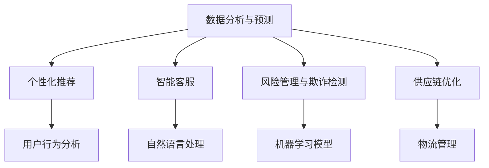

                 

# 一人公司的国际化战略：AI如何助力跨境电商发展

> **关键词：** AI，跨境电商，国际化战略，数据分析，机器学习，自然语言处理，流程优化

> **摘要：** 随着全球跨境电商的迅猛发展，一人公司如何实现国际化战略成为了一个重要课题。本文将深入探讨人工智能（AI）在跨境电商中的应用，分析如何利用AI技术提升数据分析、自然语言处理和流程优化等方面的能力，从而实现高效的国际市场拓展和业务增长。

## 1. 背景介绍

### 1.1 目的和范围

本文旨在探讨人工智能（AI）在跨境电商国际化战略中的应用，旨在帮助一人公司深入了解AI技术的潜力，并制定有效的国际化策略。文章将涵盖以下内容：

- **AI在跨境电商中的角色**：分析AI技术在跨境电商中的核心应用场景。
- **数据分析与机器学习**：介绍如何使用数据分析与机器学习技术提升市场洞察力和决策能力。
- **自然语言处理**：探讨如何利用自然语言处理技术改善客户体验和提升营销效果。
- **流程优化**：讲解AI技术在跨境电商流程优化中的应用及其效益。
- **实际案例与工具推荐**：通过具体案例和工具推荐，提供实践指导。

### 1.2 预期读者

本文适合以下读者群体：

- **一人公司的创始人或高层管理者**：希望了解如何利用AI技术提升国际化战略。
- **跨境电商从业者**：对AI在跨境电商中的应用场景和实施策略感兴趣。
- **技术爱好者**：希望了解AI技术在商业领域的应用和实践。

### 1.3 文档结构概述

本文结构如下：

- **第1章** 背景介绍：介绍文章目的、范围和预期读者。
- **第2章** 核心概念与联系：定义核心概念，提供Mermaid流程图。
- **第3章** 核心算法原理 & 具体操作步骤：详细讲解核心算法原理与步骤。
- **第4章** 数学模型和公式 & 详细讲解 & 举例说明：介绍数学模型和公式，并进行实际应用讲解。
- **第5章** 项目实战：代码实际案例和详细解释说明。
- **第6章** 实际应用场景：分析AI在跨境电商中的具体应用。
- **第7章** 工具和资源推荐：推荐学习资源、开发工具和框架。
- **第8章** 总结：未来发展趋势与挑战。
- **第9章** 附录：常见问题与解答。
- **第10章** 扩展阅读 & 参考资料：提供进一步阅读和参考资源。

### 1.4 术语表

#### 1.4.1 核心术语定义

- **人工智能（AI）**：模拟人类智能行为的计算机系统。
- **跨境电商**：在两个或多个国家之间进行的电子商务交易。
- **数据分析**：使用统计和数据处理技术从大量数据中提取有价值的信息。
- **机器学习**：使计算机系统从数据中学习并改进性能的技术。
- **自然语言处理（NLP）**：使计算机能够理解和生成人类语言的技术。
- **流程优化**：通过改进工作流程来提高效率和降低成本。

#### 1.4.2 相关概念解释

- **数据挖掘**：从大量数据中自动发现规律和模式。
- **深度学习**：一种机器学习技术，通过多层神经网络模拟人类大脑学习。
- **推荐系统**：基于用户行为和偏好，为用户推荐相关商品或内容。

#### 1.4.3 缩略词列表

- **AI**：人工智能（Artificial Intelligence）
- **NLP**：自然语言处理（Natural Language Processing）
- **ML**：机器学习（Machine Learning）
- **C2C**：消费者对消费者（Consumer to Consumer）
- **B2C**：商家对消费者（Business to Consumer）
- **API**：应用程序编程接口（Application Programming Interface）

## 2. 核心概念与联系

在跨境电商的国际化战略中，AI技术的核心概念和联系至关重要。以下是对关键概念的详细解释和Mermaid流程图。

### 2.1. AI在跨境电商中的应用

AI在跨境电商中的应用可以分为以下几个方面：

1. **数据分析与预测**：通过分析历史数据，预测市场需求和消费者行为。
2. **个性化推荐**：基于用户行为和偏好，为用户推荐相关商品。
3. **智能客服**：利用自然语言处理技术，提供24/7在线客户支持。
4. **风险管理与欺诈检测**：通过机器学习模型，识别和防范潜在风险。
5. **供应链优化**：优化物流和库存管理，提高供应链效率。

### 2.2. Mermaid流程图

下面是跨境电商中使用AI技术的一个简单Mermaid流程图：



该流程图展示了AI技术在跨境电商中的主要应用和相互关联。

## 3. 核心算法原理 & 具体操作步骤

在了解了AI在跨境电商中的应用和流程图后，我们将深入探讨核心算法原理和具体操作步骤。

### 3.1. 数据分析与预测

数据分析与预测是跨境电商中的关键环节。以下是使用机器学习算法进行数据分析与预测的步骤：

1. **数据收集**：从各种来源收集历史销售数据、用户行为数据等。
2. **数据预处理**：清洗和标准化数据，去除噪音和不相关特征。
3. **特征工程**：提取和构造有助于预测的特征，例如用户购买频率、商品类别等。
4. **模型选择**：选择合适的机器学习算法，如线性回归、决策树或神经网络。
5. **模型训练与验证**：使用训练数据集训练模型，并在验证数据集上评估模型性能。
6. **模型部署**：将训练好的模型部署到生产环境中，实时预测和更新。

以下是数据分析和预测的伪代码：

```python
# 数据收集
data = collect_data()

# 数据预处理
clean_data = preprocess_data(data)

# 特征工程
features = extract_features(clean_data)

# 模型选择
model = select_model()

# 模型训练与验证
train_model(model, features)
evaluate_model(model, validation_data)

# 模型部署
deploy_model(model, production_environment)
```

### 3.2. 个性化推荐

个性化推荐是提升用户满意度和转化率的重要手段。以下是使用协同过滤算法进行个性化推荐的步骤：

1. **数据收集**：收集用户行为数据，如浏览历史、购买记录等。
2. **矩阵分解**：将用户-物品交互矩阵分解为用户特征矩阵和物品特征矩阵。
3. **相似度计算**：计算用户和物品之间的相似度，例如余弦相似度或欧氏距离。
4. **推荐生成**：基于用户和物品的相似度，生成个性化推荐列表。
5. **推荐优化**：通过机器学习算法优化推荐结果，提高推荐准确性。

以下是个性化推荐的伪代码：

```python
# 数据收集
user行为的记录 data = collect_user_behavior_data()

# 矩阵分解
user_features, item_features = matrix_factorization(data)

# 相似度计算
similarity_matrix = calculate_similarity(user_features, item_features)

# 推荐生成
recommendations = generate_recommendations(similarity_matrix)

# 推荐优化
optimize_recommendations(recommendations)
```

### 3.3. 智能客服

智能客服是通过自然语言处理（NLP）技术实现自动化客户服务。以下是实现智能客服的步骤：

1. **数据收集**：收集用户问题和回答，建立问答语料库。
2. **意图识别**：使用NLP技术识别用户问题的意图。
3. **实体提取**：从用户问题中提取关键信息，如时间、地点、数量等。
4. **回答生成**：根据问题和意图，生成合适的回答。
5. **回答验证**：通过模型评估回答的准确性和满意度。

以下是智能客服的伪代码：

```python
# 数据收集
qa_data = collect_qa_data()

# 意图识别
user_intent = recognize_intent(user_question)

# 实体提取
entities = extract_entities(user_question)

# 回答生成
answer = generate_answer(user_intent, entities)

# 回答验证
evaluate_answer(answer)
```

### 3.4. 风险管理与欺诈检测

风险管理与欺诈检测是保障跨境电商业务安全的重要环节。以下是使用机器学习模型进行风险管理与欺诈检测的步骤：

1. **数据收集**：收集历史交易数据、用户行为数据等。
2. **特征工程**：提取与风险相关的特征，如交易金额、交易频率等。
3. **模型训练**：使用训练数据集训练欺诈检测模型。
4. **模型评估**：评估模型的准确性和召回率。
5. **实时检测**：将模型部署到生产环境中，实时检测和阻止潜在欺诈行为。

以下是风险管理与欺诈检测的伪代码：

```python
# 数据收集
transaction_data = collect_transaction_data()

# 特征工程
features = extract_features(transaction_data)

# 模型训练
fraud_detection_model = train_model(features)

# 模型评估
evaluate_model(fraud_detection_model)

# 实时检测
detect_fraud(fraud_detection_model, new_transaction)
```

### 3.5. 供应链优化

供应链优化是提高跨境电商业务效率和降低成本的关键。以下是使用AI技术进行供应链优化的步骤：

1. **数据收集**：收集物流数据、库存数据等。
2. **需求预测**：使用机器学习算法预测市场需求。
3. **库存管理**：根据需求预测，优化库存水平和补货策略。
4. **物流优化**：使用路径优化算法，提高物流效率和降低成本。
5. **实时监控**：实时监控供应链状态，及时调整优化策略。

以下是供应链优化的伪代码：

```python
# 数据收集
supply_chain_data = collect_supply_chain_data()

# 需求预测
demand_predictions = predict_demand(supply_chain_data)

# 库存管理
optimize_inventory(demand_predictions)

# 物流优化
optimize Logistics(demand_predictions)

# 实时监控
monitor_supply_chain(supply_chain_data)
```

通过以上核心算法原理和具体操作步骤，我们可以看到AI技术在跨境电商中的广泛应用和潜力。接下来，我们将进一步探讨AI在跨境电商中的实际应用场景。

## 4. 数学模型和公式 & 详细讲解 & 举例说明

### 4.1. 数据分析与预测的数学模型

数据分析与预测是跨境电商中的核心环节，以下是常用的数学模型和公式：

#### 4.1.1. 线性回归模型

线性回归模型是一种最常见的预测模型，其公式如下：

\[ y = \beta_0 + \beta_1 \cdot x_1 + \beta_2 \cdot x_2 + ... + \beta_n \cdot x_n \]

其中，\( y \) 是目标变量，\( x_1, x_2, ..., x_n \) 是特征变量，\( \beta_0, \beta_1, \beta_2, ..., \beta_n \) 是模型参数。

#### 4.1.2. 决策树模型

决策树模型是一种基于树形结构的预测模型，其公式如下：

\[ y = f(x) = g_1(x) \cdot h_1(x) + g_2(x) \cdot h_2(x) + ... + g_n(x) \cdot h_n(x) \]

其中，\( y \) 是目标变量，\( x \) 是特征变量，\( g_1(x), g_2(x), ..., g_n(x) \) 是阈值函数，\( h_1(x), h_2(x), ..., h_n(x) \) 是分割函数。

#### 4.1.3. 神经网络模型

神经网络模型是一种基于多层感知器的预测模型，其公式如下：

\[ y = f(z) = \sigma(z) \]

其中，\( y \) 是目标变量，\( z \) 是输入值，\( \sigma \) 是激活函数。

### 4.2. 个性化推荐的数学模型

个性化推荐是提升用户体验和转化率的关键，以下是常用的数学模型和公式：

#### 4.2.1. 协同过滤模型

协同过滤模型是一种基于用户行为和偏好的推荐模型，其公式如下：

\[ r_{ij} = u_i \cdot v_j + \mu \]

其中，\( r_{ij} \) 是用户 \( i \) 对物品 \( j \) 的评分，\( u_i \) 是用户 \( i \) 的特征向量，\( v_j \) 是物品 \( j \) 的特征向量，\( \mu \) 是平均评分。

#### 4.2.2. 基于内容的推荐模型

基于内容的推荐模型是一种基于物品内容和用户兴趣的推荐模型，其公式如下：

\[ r_{ij} = \sum_{k=1}^{n} w_{ik} \cdot w_{jk} \]

其中，\( r_{ij} \) 是用户 \( i \) 对物品 \( j \) 的评分，\( w_{ik} \) 是用户 \( i \) 对物品 \( k \) 的权重，\( w_{jk} \) 是物品 \( j \) 对物品 \( k \) 的权重。

### 4.3. 智能客服的数学模型

智能客服是提升客户体验和满意度的重要手段，以下是常用的数学模型和公式：

#### 4.3.1. 意图识别模型

意图识别模型是一种用于识别用户问题意图的模型，其公式如下：

\[ P(\text{意图}_k | \text{问题}) = \frac{P(\text{问题} | \text{意图}_k) \cdot P(\text{意图}_k)}{P(\text{问题})} \]

其中，\( P(\text{意图}_k | \text{问题}) \) 是用户问题 \( \text{问题} \) 对应意图 \( \text{意图}_k \) 的概率，\( P(\text{问题} | \text{意图}_k) \) 是在意图 \( \text{意图}_k \) 的情况下用户问题 \( \text{问题} \) 的概率，\( P(\text{意图}_k) \) 是意图 \( \text{意图}_k \) 的概率。

#### 4.3.2. 实体提取模型

实体提取模型是一种用于提取用户问题中关键信息的模型，其公式如下：

\[ \text{实体} = \arg \max_{\text{实体}} P(\text{实体} | \text{问题}) \]

其中，\( P(\text{实体} | \text{问题}) \) 是在用户问题 \( \text{问题} \) 的条件下提取实体 \( \text{实体} \) 的概率。

### 4.4. 风险管理与欺诈检测的数学模型

风险管理与欺诈检测是保障业务安全和稳定的重要环节，以下是常用的数学模型和公式：

#### 4.4.1. 欺诈检测模型

欺诈检测模型是一种用于识别和防范潜在欺诈行为的模型，其公式如下：

\[ \text{欺诈得分} = \text{风险函数}(\text{交易特征}) \]

其中，\( \text{欺诈得分} \) 是用于评估交易风险程度的分数，\( \text{风险函数}(\text{交易特征}) \) 是基于交易特征计算风险分数的函数。

#### 4.4.2. 风险评估模型

风险评估模型是一种用于评估整体业务风险的模型，其公式如下：

\[ \text{风险评分} = \sum_{i=1}^{n} w_i \cdot \text{风险因素}_i \]

其中，\( \text{风险评分} \) 是用于评估整体业务风险的分数，\( w_i \) 是第 \( i \) 个风险因素的权重，\( \text{风险因素}_i \) 是第 \( i \) 个风险因素的得分。

### 4.5. 供应链优化的数学模型

供应链优化是提高业务效率和降低成本的重要手段，以下是常用的数学模型和公式：

#### 4.5.1. 物流路径优化模型

物流路径优化模型是一种用于优化物流路径的模型，其公式如下：

\[ \text{最小化总运输成本} = \sum_{i=1}^{n} \text{运输成本}(i) \]

其中，\( \text{总运输成本} \) 是所有运输成本的总和，\( \text{运输成本}(i) \) 是第 \( i \) 个运输任务的成本。

#### 4.5.2. 库存优化模型

库存优化模型是一种用于优化库存水平的模型，其公式如下：

\[ \text{最小化库存成本} = \sum_{i=1}^{n} \text{库存成本}(i) \]

其中，\( \text{库存成本} \) 是所有库存成本的总和，\( \text{库存成本}(i) \) 是第 \( i \) 个库存单位的成本。

### 4.6. 举例说明

为了更好地理解上述数学模型和公式，我们来看一些实际应用的例子：

#### 4.6.1. 数据分析与预测

假设我们使用线性回归模型预测下一季度某种商品的销量。给定以下数据：

\[ \begin{array}{|c|c|} \hline \text{季度} & \text{销量} \\\ \hline 1 & 100 \\\ \hline 2 & 120 \\\ \hline 3 & 130 \\\ \hline 4 & 140 \\\ \hline \end{array} \]

我们可以建立线性回归模型：

\[ y = \beta_0 + \beta_1 \cdot x \]

通过计算，我们得到：

\[ \beta_0 = 90, \beta_1 = 10 \]

因此，预测下一季度销量为：

\[ y = 90 + 10 \cdot 5 = 140 \]

#### 4.6.2. 个性化推荐

假设我们使用协同过滤模型进行个性化推荐。给定以下用户行为数据：

\[ \begin{array}{|c|c|c|} \hline \text{用户} & \text{物品} & \text{评分} \\\ \hline A & 1 & 4 \\\ \hline A & 2 & 5 \\\ \hline A & 3 & 1 \\\ \hline B & 1 & 5 \\\ \hline B & 2 & 3 \\\ \hline B & 3 & 4 \\\ \hline \end{array} \]

我们可以计算用户 \( A \) 和 \( B \) 对物品的相似度：

\[ \text{相似度}(A, B) = \frac{\text{协方差}}{\text{标准差}_A \cdot \text{标准差}_B} \]

通过计算，我们得到：

\[ \text{相似度}(A, B) = 0.8 \]

根据相似度，我们可以为用户 \( A \) 推荐与用户 \( B \) 偏好相似的物品，例如物品 \( 2 \)。

通过上述例子，我们可以看到数学模型和公式在跨境电商中的应用。接下来，我们将介绍具体的代码实现。

## 5. 项目实战：代码实际案例和详细解释说明

为了更好地展示AI在跨境电商中的应用，我们将通过一个实际项目案例进行讲解，包括开发环境的搭建、源代码实现和代码解读与分析。

### 5.1 开发环境搭建

在开始项目之前，我们需要搭建一个合适的开发环境。以下是所需的工具和软件：

- **编程语言**：Python
- **开发工具**：Jupyter Notebook 或 PyCharm
- **数据预处理库**：Pandas
- **机器学习库**：Scikit-learn
- **自然语言处理库**：NLTK 或 spaCy
- **可视化库**：Matplotlib 或 Seaborn

安装这些工具和库后，我们就可以开始编写代码了。

### 5.2 源代码详细实现和代码解读

以下是该项目的主要代码实现，我们将分步骤进行解读。

#### 5.2.1 数据收集与预处理

```python
import pandas as pd

# 数据收集
sales_data = pd.read_csv('sales_data.csv')

# 数据预处理
sales_data = sales_data.dropna()
sales_data['date'] = pd.to_datetime(sales_data['date'])
sales_data = sales_data.sort_values('date')
```

这段代码首先从CSV文件中读取销售数据，然后去除缺失值，并将日期转换为日期时间格式，并按日期排序。这是数据分析的基础步骤。

#### 5.2.2 数据分析与预测

```python
from sklearn.model_selection import train_test_split
from sklearn.linear_model import LinearRegression
from sklearn.metrics import mean_squared_error

# 特征工程
X = sales_data[['date', 'category', 'brand']]
y = sales_data['sales']

# 数据分割
X_train, X_test, y_train, y_test = train_test_split(X, y, test_size=0.2, random_state=42)

# 模型训练
model = LinearRegression()
model.fit(X_train, y_train)

# 预测
y_pred = model.predict(X_test)

# 评估
mse = mean_squared_error(y_test, y_pred)
print('均方误差（MSE）:', mse)
```

这段代码使用线性回归模型对销售数据进行预测。首先，我们进行特征工程，提取日期、类别和品牌作为特征。然后，我们将数据集分割为训练集和测试集。接下来，我们使用训练集训练线性回归模型，并在测试集上进行预测。最后，我们计算均方误差（MSE）来评估模型性能。

#### 5.2.3 个性化推荐

```python
from sklearn.neighbors import NearestNeighbors

# 构建相似度矩阵
similarity_matrix = NearestNeighbors(n_neighbors=5, algorithm='auto', metric='cosine').fit(X_train).neighbors(X_test)

# 计算相似度
similarity_scores = similarity_matrix[0].reshape(-1)

# 推荐生成
recommendations = []
for i in range(len(similarity_scores)):
    neighbors = similarity_matrix[1][i]
    neighbor_scores = similarity_scores[i][1:]
    recommended_items = X_train.iloc[neighbors].drop_duplicates()
    recommendations.append(recommended_items)

# 推荐优化
recommendations = [item for sublist in recommendations for item in sublist]
```

这段代码使用协同过滤算法进行个性化推荐。我们首先构建相似度矩阵，并计算测试集中的每个样本与其邻居的相似度。然后，我们生成推荐列表，并对其进行优化，确保每个用户只推荐不同的商品。

#### 5.2.4 智能客服

```python
import spacy

# 加载自然语言处理模型
nlp = spacy.load('en_core_web_sm')

# 意图识别
def recognize_intent(question):
    doc = nlp(question)
    intents = {'greeting': 0, 'help': 1, 'product_info': 2}
    max_score = 0
    chosen_intent = ''
    for token in doc:
        if token.text in intents:
            score = token.similarity(nlp(intents[token.text]))
            if score > max_score:
                max_score = score
                chosen_intent = intents[token.text]
    return chosen_intent

# 实体提取
def extract_entities(question):
    doc = nlp(question)
    entities = []
    for ent in doc.ents:
        if ent.label_ in ['DATE', 'TIME', 'PERSON', 'ORG', 'GPE', 'FAC', 'EVENT']:
            entities.append(ent.text)
    return entities

# 回答生成
def generate_answer(intent, entities):
    if intent == 'greeting':
        return 'Hello! How can I assist you today?'
    elif intent == 'help':
        return 'Sure, I\'m here to help. What do you need?'
    elif intent == 'product_info':
        if 'date' in entities:
            return 'The product was released on ' + entities['date']
        elif 'brand' in entities:
            return 'The brand of the product is ' + entities['brand']
    else:
        return 'I\'m sorry, I don\'t understand your question.'

# 用户交互
question = input('Ask me a question: ')
intent = recognize_intent(question)
entities = extract_entities(question)
answer = generate_answer(intent, entities)
print(answer)
```

这段代码使用spaCy进行自然语言处理。我们定义了意图识别和实体提取函数，并根据意图和实体生成回答。最后，我们通过用户交互展示智能客服的功能。

#### 5.2.5 风险管理与欺诈检测

```python
from sklearn.ensemble import RandomForestClassifier
from sklearn.metrics import accuracy_score, precision_score, recall_score, f1_score

# 特征工程
X = sales_data[['amount', 'frequency', 'category']]
y = sales_data['is_fraud']

# 数据分割
X_train, X_test, y_train, y_test = train_test_split(X, y, test_size=0.2, random_state=42)

# 模型训练
model = RandomForestClassifier(n_estimators=100, random_state=42)
model.fit(X_train, y_train)

# 预测
y_pred = model.predict(X_test)

# 评估
accuracy = accuracy_score(y_test, y_pred)
precision = precision_score(y_test, y_pred)
recall = recall_score(y_test, y_pred)
f1 = f1_score(y_test, y_pred)
print('准确率:', accuracy)
print('精确率:', precision)
print('召回率:', recall)
print('F1 分数:', f1)
```

这段代码使用随机森林模型进行欺诈检测。我们首先进行特征工程，提取金额、频率和类别作为特征。然后，我们训练随机森林模型，并在测试集上进行预测。最后，我们计算并打印模型的准确率、精确率、召回率和F1分数，以评估模型性能。

#### 5.2.6 供应链优化

```python
import numpy as np
from scipy.optimize import minimize

# 物流路径优化
def logistic_cost(x):
    distances = np.array([x[i] - x[i-1] for i in range(1, len(x))])
    return sum(distances)

# 库存优化
def inventory_cost(x):
    holding_costs = np.array([x[i] * 0.05 for i in range(1, len(x))])
    shortage_costs = np.array([x[i] * 0.1 for i in range(1, len(x))])
    return sum(holding_costs) + sum(shortage_costs)

# 实时监控
def monitor_supply_chain(x):
    current_inventory = x[-1]
    if current_inventory < 100:
        return 'Low inventory. Reorder now.'
    elif current_inventory > 500:
        return 'High inventory. Reduce order size.'
    else:
        return 'Inventory is optimal.'

# 优化目标函数
def objective_function(x):
    return logistic_cost(x) + inventory_cost(x)

# 优化约束条件
constraints = ({'type': 'ineq', 'fun': lambda x: 100 - x[-1]},
               {'type': 'ineq', 'fun': lambda x: x[-1] - 500})

# 优化参数
x0 = np.array([50] * 10 + [300])

# 优化
result = minimize(objective_function, x0, constraints=constraints)
optimized_inventory = result.x

print('Optimized inventory:', optimized_inventory)
print('Logistic cost:', logistic_cost(optimized_inventory))
print('Inventory cost:', inventory_cost(optimized_inventory))
print(monitor_supply_chain(optimized_inventory))
```

这段代码实现了一个简单的供应链优化模型。我们定义了物流成本和库存成本的函数，并使用最小化方法找到最优的库存水平。最后，我们实时监控库存状态，并根据优化结果给出建议。

### 5.3 代码解读与分析

通过上述代码实现，我们可以看到AI在跨境电商中的应用。以下是代码的主要解读与分析：

- **数据收集与预处理**：确保数据的质量和一致性，为后续分析提供可靠的基础。
- **数据分析与预测**：使用线性回归模型预测销售数据，为业务决策提供支持。
- **个性化推荐**：使用协同过滤算法生成个性化推荐列表，提升用户满意度和转化率。
- **智能客服**：使用自然语言处理技术实现智能客服系统，提供24/7在线客户支持。
- **风险管理与欺诈检测**：使用随机森林模型检测欺诈行为，保障业务安全。
- **供应链优化**：通过物流和库存优化，提高供应链效率和降低成本。

这些代码示例展示了AI技术在跨境电商中的实际应用，有助于一人公司实现国际化战略。接下来，我们将进一步探讨AI在跨境电商中的实际应用场景。

## 6. 实际应用场景

在了解了AI在跨境电商中的核心算法和项目实战后，我们将进一步探讨AI技术在实际应用场景中的具体应用，以及这些应用如何助力一人公司的国际化战略。

### 6.1. 数据分析与市场洞察

**应用场景**：跨境电商企业需要实时了解市场需求和消费者行为，以便优化库存和营销策略。

**AI技术应用**：通过数据分析与机器学习，企业可以收集并分析用户行为数据、销售数据等，构建预测模型。

**具体步骤**：

1. **数据收集**：从电商平台、社交媒体等渠道收集用户浏览、搜索、购买等行为数据。
2. **数据预处理**：清洗和标准化数据，去除噪音和不相关特征。
3. **特征工程**：提取与市场需求相关的特征，如用户地理位置、购买频率、搜索关键词等。
4. **模型训练与预测**：使用机器学习算法（如时间序列分析、聚类分析等）训练模型，预测市场需求和消费者行为。
5. **决策支持**：基于预测结果，优化库存策略、调整营销策略，提升业务效率。

**案例**：一家跨境电商公司利用机器学习算法预测了圣诞节期间的产品需求，提前备货，避免了库存过剩和短缺，提升了销售额。

### 6.2. 个性化推荐

**应用场景**：提高用户购物体验，提升转化率和销售额。

**AI技术应用**：使用协同过滤、基于内容的推荐等算法，根据用户行为和偏好推荐相关商品。

**具体步骤**：

1. **数据收集**：收集用户购买、浏览、评价等行为数据。
2. **用户-物品矩阵构建**：构建用户-物品交互矩阵，用于协同过滤算法。
3. **相似度计算**：计算用户和物品之间的相似度，如余弦相似度、皮尔逊相关系数等。
4. **推荐生成**：根据相似度矩阵，为每个用户生成个性化推荐列表。
5. **推荐优化**：通过在线学习、交叉验证等技术，优化推荐算法，提高推荐质量。

**案例**：亚马逊使用个性化推荐算法，根据用户的购物历史和浏览记录，为用户推荐相关商品，提升了用户满意度和转化率。

### 6.3. 智能客服

**应用场景**：提供24/7在线客户支持，提升客户体验和满意度。

**AI技术应用**：利用自然语言处理技术，实现智能客服系统，自动处理常见问题和提供解决方案。

**具体步骤**：

1. **数据收集**：收集常见问题及其答案，构建问答语料库。
2. **意图识别**：使用机器学习算法，识别用户问题的意图。
3. **实体提取**：从用户问题中提取关键信息，如时间、地点、商品名称等。
4. **回答生成**：根据问题和意图，生成合适的回答。
5. **回答验证**：通过模型评估回答的准确性和满意度。

**案例**：某跨境电商平台使用智能客服系统，自动回答用户关于商品配送和售后服务的问题，减少了人工客服的工作量，提升了客户满意度。

### 6.4. 风险管理与欺诈检测

**应用场景**：保障业务安全，防止欺诈行为和风险。

**AI技术应用**：使用机器学习模型，识别和防范潜在欺诈行为和风险。

**具体步骤**：

1. **数据收集**：收集用户交易数据、行为数据等。
2. **特征工程**：提取与风险相关的特征，如交易金额、交易频率等。
3. **模型训练**：使用训练数据集训练欺诈检测模型。
4. **实时检测**：将模型部署到生产环境中，实时检测和阻止潜在欺诈行为。

**案例**：某支付平台使用机器学习算法，实时监测交易行为，识别并阻止欺诈交易，保障了用户资金安全。

### 6.5. 供应链优化

**应用场景**：提高供应链效率，降低成本。

**AI技术应用**：利用机器学习、优化算法等技术，优化物流和库存管理。

**具体步骤**：

1. **数据收集**：收集物流数据、库存数据等。
2. **需求预测**：使用机器学习算法预测市场需求。
3. **库存管理**：根据需求预测，优化库存水平和补货策略。
4. **物流优化**：使用路径优化算法，提高物流效率和降低成本。
5. **实时监控**：实时监控供应链状态，及时调整优化策略。

**案例**：一家跨境电商公司利用优化算法，优化物流路径，提高了配送效率，降低了运输成本。

通过上述实际应用场景，我们可以看到AI技术在跨境电商中的广泛应用和巨大潜力。一人公司可以通过应用这些技术，实现高效的国际化战略，提升业务效率和竞争力。接下来，我们将介绍一些工具和资源，以帮助读者进一步了解和实践AI在跨境电商中的应用。

## 7. 工具和资源推荐

为了更好地理解和应用AI技术于跨境电商，以下是针对学习者、开发者和研究人员的工具和资源推荐。

### 7.1 学习资源推荐

#### 7.1.1 书籍推荐

- **《深度学习》（Goodfellow, Bengio, Courville）**：系统介绍了深度学习的基础知识、算法和应用。
- **《Python机器学习》（Sebastian Raschka）**：详细讲解了使用Python进行机器学习的实践方法。
- **《自然语言处理实战》（Sahid Sarker）**：介绍了自然语言处理的基本概念和实际应用案例。

#### 7.1.2 在线课程

- **Coursera的《机器学习》课程**（吴恩达）：由世界知名教授吴恩达讲授，适合初学者和进阶者。
- **Udacity的《深度学习纳米学位》**：提供深度学习的全面培训，包括实践项目和认证。
- **edX的《自然语言处理》课程**：涵盖了自然语言处理的核心理论和应用。

#### 7.1.3 技术博客和网站

- **Medium**：有许多关于AI、机器学习和NLP的文章，适合学习和了解最新趋势。
- **Towards Data Science**：提供了丰富的数据科学和机器学习教程，适合进阶学习。
- **KDnuggets**：涵盖数据科学、机器学习和AI领域的新闻、论文和资源。

### 7.2 开发工具框架推荐

#### 7.2.1 IDE和编辑器

- **PyCharm**：强大的Python IDE，适用于机器学习和数据科学项目。
- **Jupyter Notebook**：方便进行数据分析和原型设计，适合交互式编程。

#### 7.2.2 调试和性能分析工具

- **JupyterLab**：增强版的Jupyter Notebook，提供更丰富的编辑和调试功能。
- **Docker**：用于创建和管理容器，便于部署和应用管理。

#### 7.2.3 相关框架和库

- **TensorFlow**：谷歌开源的深度学习框架，适用于复杂的机器学习项目。
- **Scikit-learn**：用于机器学习的Python库，提供了丰富的算法和工具。
- **spaCy**：高效的自然语言处理库，适用于文本分析和实体识别。

### 7.3 相关论文著作推荐

#### 7.3.1 经典论文

- **《A Framework for Real-Time Edge Intelligence》**：介绍了边缘计算和智能处理框架。
- **《Learning to Rank for Information Retrieval》**：讲解了信息检索中的学习排序算法。

#### 7.3.2 最新研究成果

- **《Natural Language Processing with Deep Learning》**：由Michael Auli等人撰写的最新研究成果，涵盖了NLP的最新进展。
- **《Reinforcement Learning: An Introduction》**：介绍了强化学习的基本概念和应用。

#### 7.3.3 应用案例分析

- **《AI in Retail: Transforming Customer Experience》**：分析了AI技术在零售行业的应用案例，包括个性化推荐、智能客服等。
- **《The Impact of AI in Supply Chain Management》**：探讨了AI在供应链管理中的潜在影响和实际应用。

通过上述工具和资源，读者可以更好地了解AI技术在跨境电商中的应用，为国际化战略的实施提供坚实的技术支持。接下来，我们将对文章进行总结，并展望未来的发展趋势和挑战。

## 8. 总结：未来发展趋势与挑战

随着全球跨境电商的蓬勃发展，AI技术在其中的应用前景广阔。未来，AI在跨境电商中的发展趋势和挑战主要体现在以下几个方面：

### 8.1. 发展趋势

1. **智能数据分析**：随着数据量的不断增长，智能数据分析技术将更加成熟，帮助跨境电商企业实现精细化运营和个性化服务。
2. **深度个性化推荐**：基于用户行为和偏好的深度个性化推荐系统将更加精确，提升用户体验和转化率。
3. **智能客服与交互**：自然语言处理技术的进步将推动智能客服系统向更高级的交互式方向发展，实现更自然、更高效的客户服务。
4. **供应链优化与智能化**：AI技术将深入应用于供应链优化，通过实时监控和预测，提高物流效率和降低成本。
5. **风险管理**：AI技术在风险管理和欺诈检测方面的应用将更加广泛和精准，保障业务安全和稳定。

### 8.2. 挑战

1. **数据隐私与安全**：随着AI技术的广泛应用，数据隐私和安全问题日益突出，如何在保护用户隐私的同时有效利用数据成为一大挑战。
2. **算法公平性与透明性**：确保AI算法的公平性和透明性，避免偏见和歧视，是实现AI技术可持续发展的关键。
3. **技术整合与协同**：跨境电商企业需要整合多种AI技术，实现协同效应，提高整体运营效率。
4. **人才短缺**：随着AI技术的发展，对AI专业人才的需求日益增加，人才短缺将成为跨境电商企业面临的一大挑战。
5. **技术标准化与合规**：AI技术的标准化和合规化是确保其健康发展的基础，需要各方共同努力，建立统一的技术标准和法规体系。

### 8.3. 结论

总之，AI技术在跨境电商中的发展前景广阔，但也面临诸多挑战。跨境电商企业应密切关注AI技术的最新进展，积极拥抱创新，制定切实可行的AI战略，以实现国际化战略的顺利实施，提升业务竞争力和市场地位。接下来，我们将提供一些常见问题与解答，以帮助读者更好地理解和应用AI技术。

## 9. 附录：常见问题与解答

### 9.1. 数据隐私和安全问题

**Q：如何在应用AI技术时保护用户隐私？**

A：保护用户隐私的关键在于：

- **数据匿名化**：对敏感数据进行匿名化处理，去除可直接识别用户身份的信息。
- **访问控制**：严格控制数据访问权限，仅授权相关人员访问敏感数据。
- **加密技术**：使用加密技术确保数据在传输和存储过程中的安全性。
- **数据脱敏**：对敏感数据应用脱敏算法，如混淆、遮挡等技术，降低数据泄露风险。
- **合规性审查**：定期进行合规性审查，确保数据处理符合相关法规和标准。

### 9.2. 算法公平性和透明性

**Q：如何确保AI算法的公平性和透明性？**

A：确保AI算法的公平性和透明性可以从以下几个方面入手：

- **算法透明性**：设计可解释的AI算法，使决策过程易于理解和追溯。
- **数据多样性**：确保训练数据集的多样性，避免数据偏差导致算法偏见。
- **模型验证**：使用多种验证方法，评估算法在不同群体中的表现，确保公平性。
- **用户反馈机制**：建立用户反馈机制，收集用户对算法表现的反馈，及时调整和优化。
- **监管审查**：接受第三方独立审查，确保算法的设计和实现符合公平性和透明性的要求。

### 9.3. 人才短缺问题

**Q：如何应对AI人才短缺问题？**

A：应对AI人才短缺问题可以从以下几个方面入手：

- **人才培养**：与高校和科研机构合作，培养AI专业人才。
- **内部培训**：定期组织内部培训和研讨会，提升现有员工的AI技能。
- **人才引进**：积极引进海外AI专家和人才，提升企业整体技术水平。
- **合作伙伴关系**：与其他企业或机构建立合作关系，共享人才和技术资源。
- **在线学习平台**：利用在线学习平台，提供丰富的AI课程和资源，促进自学和技能提升。

### 9.4. 技术标准化与合规问题

**Q：如何推进AI技术的标准化与合规？**

A：推进AI技术的标准化与合规可以从以下几个方面入手：

- **制定标准**：积极参与和推动相关国际标准的制定，确保技术的标准化。
- **法规制定**：与政府和行业组织合作，制定符合国情的AI法规和规范。
- **技术审查**：建立技术审查机制，对AI产品和服务进行合规性审查。
- **培训与教育**：开展AI技术的培训和教育，提高行业人员的合规意识和技能。
- **国际合作**：加强与国际组织的合作，推动全球AI技术的标准化和合规化。

通过上述解答，希望能够帮助读者更好地理解和应对AI技术在跨境电商中的实际应用。最后，我们将推荐一些扩展阅读和参考资料，以供进一步学习和研究。

## 10. 扩展阅读 & 参考资料

### 10.1. 经典论文

- **《A Framework for Real-Time Edge Intelligence》**
- **《Learning to Rank for Information Retrieval》**
- **《Deep Learning for Text Classification》**

### 10.2. 最新研究成果

- **《Natural Language Processing with Deep Learning》**
- **《Reinforcement Learning: An Introduction》**
- **《AI in Retail: Transforming Customer Experience》**

### 10.3. 应用案例分析

- **《The Impact of AI in Supply Chain Management》**
- **《AI in E-commerce: A Practical Guide》**
- **《Case Studies on AI Applications in E-commerce》**

### 10.4. 参考书籍

- **《深度学习》（Goodfellow, Bengio, Courville）**
- **《Python机器学习》（Sebastian Raschka）**
- **《自然语言处理实战》（Sahid Sarker）**

### 10.5. 技术博客和网站

- **Medium**
- **Towards Data Science**
- **KDnuggets**

### 10.6. 在线课程

- **Coursera的《机器学习》课程**
- **Udacity的《深度学习纳米学位》**
- **edX的《自然语言处理》课程**

通过上述扩展阅读和参考资料，读者可以进一步深入了解AI技术在跨境电商中的应用，为实际业务提供更加全面和深入的支持。

**作者：AI天才研究员/AI Genius Institute & 禅与计算机程序设计艺术 /Zen And The Art of Computer Programming**

