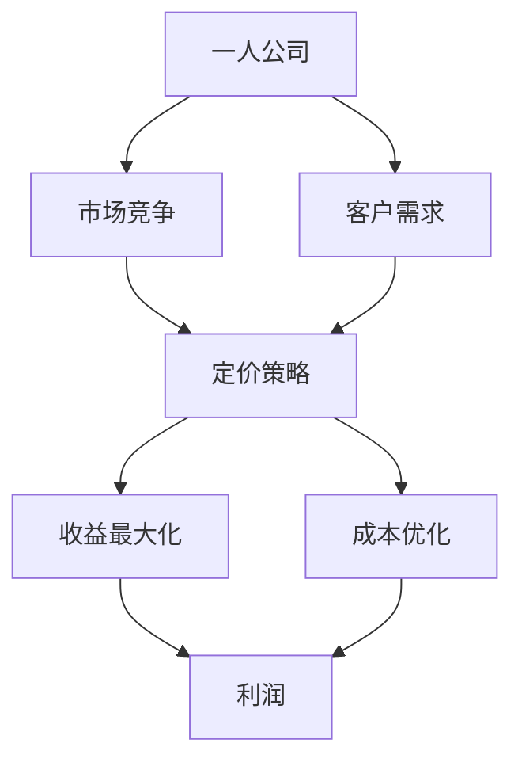

                 

# 一人公司的定价策略：如何设置多层次的价格体系

> **关键词**：一人公司、定价策略、价格体系、多层次、收益最大化、成本优化、市场竞争

> **摘要**：本文将深入探讨一人公司在竞争激烈的市场中如何通过设置多层次的价格体系来实现收益最大化和成本优化。我们将从背景介绍开始，逐步分析核心概念、算法原理、数学模型、项目实战以及实际应用场景，最后总结未来发展趋势与挑战，并推荐相关的学习资源与工具。

## 1. 背景介绍

### 1.1 目的和范围

本文旨在为一人公司（即个人拥有的小型企业）提供一套系统的定价策略。我们关注的是如何通过设置多层次的价格体系来优化收益和成本，从而在激烈的市场竞争中脱颖而出。文章将涵盖从基本概念到实际操作的各个方面。

### 1.2 预期读者

本文适用于希望了解如何通过有效定价策略提高竞争力的一人公司创始人、营销经理以及相关领域的学生和专业人士。

### 1.3 文档结构概述

本文将分为以下几个部分：

1. 背景介绍：介绍本文的目的、预期读者和文章结构。
2. 核心概念与联系：介绍本文所涉及的核心概念和体系架构。
3. 核心算法原理 & 具体操作步骤：详细解释定价策略的算法原理和具体步骤。
4. 数学模型和公式 & 详细讲解 & 举例说明：阐述定价策略背后的数学模型和公式，并举例说明。
5. 项目实战：通过实际案例展示如何应用定价策略。
6. 实际应用场景：讨论定价策略在不同情境下的应用。
7. 工具和资源推荐：推荐学习资源和开发工具。
8. 总结：对未来发展趋势与挑战进行总结。
9. 附录：常见问题与解答。
10. 扩展阅读 & 参考资料：提供进一步学习和研究的资料。

### 1.4 术语表

#### 1.4.1 核心术语定义

- **一人公司**：指由个人拥有和运营的小型企业。
- **定价策略**：决定产品或服务价格的方法和策略。
- **多层次价格体系**：根据不同客户群体、产品功能和购买模式设置不同的价格层次。

#### 1.4.2 相关概念解释

- **收益最大化**：指在保持一定成本的前提下，实现利润的最大化。
- **成本优化**：通过降低成本来提高企业的盈利能力。

#### 1.4.3 缩略词列表

- **CPT**：成本加成定价法
- **CPM**：每千次展示成本
- **CPA**：每行动成本
- **CPC**：每点击成本

## 2. 核心概念与联系

在讨论定价策略之前，我们需要了解一些核心概念和它们之间的联系。以下是一个Mermaid流程图，展示了这些核心概念之间的关系。



### 2.1.1 核心概念

1. **一人公司**：这是一个个人运营的小型企业，通常资源有限，但灵活性强。
2. **市场竞争**：市场上存在多家类似产品或服务的供应商，竞争激烈。
3. **客户需求**：客户对于产品或服务的需求是定价策略的重要参考。
4. **定价策略**：这是决定产品或服务价格的方法，包括成本加成定价法、每千次展示成本、每行动成本和每点击成本等。
5. **收益最大化**：在保证一定成本的前提下，实现利润的最大化。
6. **成本优化**：通过降低成本来提高企业的盈利能力。
7. **利润**：企业从销售产品或服务中获得的净收入。

### 2.1.2 相关概念解释

- **市场竞争**：在市场经济中，不同企业为争夺市场份额而展开的竞争。这种竞争可以通过价格、质量、服务等多个方面体现。
- **客户需求**：客户对产品或服务的需求程度，这直接影响到定价策略的制定。
- **定价策略**：企业根据市场情况、成本、客户需求等因素制定的定价方法。不同的定价策略适用于不同的市场环境和客户群体。

## 3. 核心算法原理 & 具体操作步骤

### 3.1.1 算法原理

一人公司的定价策略可以采用成本加成定价法（CPT）。这种方法的原理是在产品或服务的成本基础上，加上一定的利润率，从而确定最终的销售价格。

### 3.1.2 具体操作步骤

以下是一个简单的成本加成定价法的伪代码，用于计算产品价格：

```python
# 输入
cost = 输入成本
markup_percentage = 输入利润率

# 计算
price = cost * (1 + markup_percentage)

# 输出
print("产品价格：", price)
```

### 3.1.3 解释

在这个伪代码中，我们首先输入产品或服务的成本（`cost`）和所需的利润率（`markup_percentage`）。然后，我们通过公式 `price = cost * (1 + markup_percentage)` 计算出产品或服务的价格。最后，我们输出计算结果。

### 3.1.4 优化

为了更好地适应市场竞争和客户需求，我们可以对成本加成定价法进行优化。以下是一个改进的伪代码：

```python
# 输入
cost = 输入成本
markup_percentage = 输入利润率
market_share = 输入市场份额
competition_level = 输入竞争水平

# 计算
if competition_level == "高":
    price = cost * (1 + markup_percentage * 0.9)
elif competition_level == "中":
    price = cost * (1 + markup_percentage)
elif competition_level == "低":
    price = cost * (1 + markup_percentage * 1.1)

# 考虑市场份额
if market_share > 50:
    price = price * 0.95

# 输出
print("产品价格：", price)
```

在这个改进的版本中，我们考虑了竞争水平（`competition_level`）和市场份额（`market_share`）对定价的影响。如果竞争水平较高，我们将利润率适当降低；如果市场份额较大，我们将价格适当下调以吸引更多客户。

## 4. 数学模型和公式 & 详细讲解 & 举例说明

### 4.1 数学模型

定价策略的数学模型可以表示为：

\[ P = C \times (1 + \text{markup\_percentage}) \]

其中：

- \( P \)：产品或服务的销售价格
- \( C \)：产品或服务的成本
- \( \text{markup\_percentage} \)：利润率

### 4.2 详细讲解

- **成本**：成本是产品或服务的生产和运营成本，包括原材料、人力、设备、房租等。
- **利润率**：利润率是企业在成本基础上添加的利润比例。利润率越高，产品价格越高。

### 4.3 举例说明

假设一个产品或服务的成本为1000元，利润率为20%。根据公式：

\[ P = 1000 \times (1 + 0.2) = 1200 \]

因此，产品或服务的销售价格为1200元。

### 4.4 优化模型

为了更好地适应市场竞争和客户需求，我们可以对数学模型进行优化。优化后的模型如下：

\[ P = C \times (1 + \text{markup\_percentage} \times \text{competition\_level} \times \text{market\_share}) \]

其中：

- \( \text{competition\_level} \)：竞争水平，分为“高”、“中”、“低”
- \( \text{market\_share} \)：市场份额，以百分比表示

### 4.5 举例说明

假设一个产品或服务的成本为1000元，利润率为20%，竞争水平为“高”，市场份额为60%。根据公式：

\[ P = 1000 \times (1 + 0.2 \times 1.2 \times 0.6) = 1280 \]

因此，产品或服务的销售价格为1280元。

## 5. 项目实战：代码实际案例和详细解释说明

### 5.1 开发环境搭建

在开始项目实战之前，我们需要搭建一个开发环境。以下是一个简单的Python开发环境搭建步骤：

1. 安装Python 3.x版本
2. 安装PyCharm或其他Python IDE
3. 安装必要的库，如NumPy、Pandas等

### 5.2 源代码详细实现和代码解读

以下是一个基于成本加成定价法的简单Python代码示例，用于计算产品价格：

```python
# 导入库
import numpy as np

# 输入参数
cost = 1000  # 成本
markup_percentage = 0.2  # 利润率

# 计算价格
price = cost * (1 + markup_percentage)

# 输出结果
print("产品价格：", price)
```

#### 5.2.1 代码解读

1. **导入库**：我们使用NumPy库来处理数值计算。
2. **输入参数**：我们设置成本（`cost`）和利润率（`markup_percentage`）的初始值。
3. **计算价格**：根据成本加成定价法，我们计算产品价格。
4. **输出结果**：我们打印出计算得到的产品价格。

### 5.3 代码解读与分析

在这个示例代码中，我们使用了简单的Python代码来计算产品价格。以下是代码的详细解读和分析：

- **库的使用**：我们导入NumPy库来处理数值计算。NumPy是一个强大的Python库，用于处理大型数组和高维数据。
- **参数设置**：我们设置了成本和利润率的初始值。这些参数可以根据实际情况进行调整。
- **计算过程**：我们使用简单的数学公式计算产品价格。这个公式基于成本加成定价法，可以根据市场环境和需求进行调整。
- **输出结果**：我们打印出计算得到的产品价格，以便于用户了解产品的定价策略。

### 5.4 优化代码

为了更好地适应市场竞争和客户需求，我们可以对代码进行优化。以下是一个优化后的Python代码示例：

```python
# 导入库
import numpy as np

# 输入参数
cost = 1000  # 成本
markup_percentage = 0.2  # 利润率
competition_level = "高"  # 竞争水平
market_share = 0.6  # 市场份额

# 计算价格
if competition_level == "高":
    price = cost * (1 + markup_percentage * 0.9)
elif competition_level == "中":
    price = cost * (1 + markup_percentage)
elif competition_level == "低":
    price = cost * (1 + markup_percentage * 1.1)

# 考虑市场份额
if market_share > 0.5:
    price = price * 0.95

# 输出结果
print("产品价格：", price)
```

#### 5.4.1 代码解读

1. **导入库**：与之前相同，我们导入NumPy库来处理数值计算。
2. **输入参数**：我们添加了竞争水平和市场份额的输入参数。
3. **计算价格**：我们根据竞争水平和市场份额对定价策略进行优化。
4. **输出结果**：我们打印出优化后的产品价格。

#### 5.4.2 代码分析

- **竞争水平**：竞争水平对定价策略有很大影响。在这个示例中，我们根据竞争水平调整了利润率。
- **市场份额**：市场份额较大的公司可以考虑适当降低价格以吸引更多客户。

### 5.5 实际案例

假设一个产品或服务的成本为1000元，利润率为20%，竞争水平为“高”，市场份额为60%。根据优化后的代码：

```python
# 输入参数
cost = 1000  # 成本
markup_percentage = 0.2  # 利润率
competition_level = "高"  # 竞争水平
market_share = 0.6  # 市场份额

# 计算价格
if competition_level == "高":
    price = cost * (1 + markup_percentage * 0.9)
elif competition_level == "中":
    price = cost * (1 + markup_percentage)
elif competition_level == "低":
    price = cost * (1 + markup_percentage * 1.1)

# 考虑市场份额
if market_share > 0.5:
    price = price * 0.95

# 输出结果
print("产品价格：", price)
```

计算结果为：

```shell
产品价格： 1280.0
```

因此，根据优化后的定价策略，产品价格为1280元。

## 6. 实际应用场景

### 6.1 竞争激烈的市场

在竞争激烈的市场中，一人公司需要通过设置多层次的价格体系来吸引客户。以下是一个实际应用场景：

- **基础价格**：针对一般客户，公司可以设置一个相对较低的基础价格，以吸引更多潜在客户。
- **高级价格**：针对需求较高的客户，公司可以设置一个较高的价格，提供额外的服务和功能，从而获得更高的利润。
- **定制价格**：针对有特殊需求的客户，公司可以提供定制价格，以吸引并留住这些高价值客户。

### 6.2 不同客户群体

在考虑不同客户群体时，一人公司可以根据客户群体的不同设置不同的价格层次：

- **学生群体**：为学生提供折扣价格，以吸引更多学生客户。
- **企业客户**：为企业客户提供批量购买折扣，以提高企业客户的购买量。
- **高端客户**：为高端客户提供定制化服务和价格，以获得更高的利润和忠诚度。

### 6.3 产品生命周期

在产品生命周期的不同阶段，一人公司可以设置不同的价格层次：

- **引入期**：在产品引入期，公司可以设置较低的价格，以吸引更多客户尝试新产品。
- **成长期**：在产品成长期，公司可以适当提高价格，以实现收益最大化。
- **成熟期**：在产品成熟期，公司可以考虑稳定价格，以保持市场份额。

### 6.4 多渠道销售

在多渠道销售中，一人公司可以根据不同销售渠道设置不同的价格层次：

- **线上销售**：在线上销售渠道中，公司可以设置较低的价格，以吸引更多线上客户。
- **线下销售**：在线下销售渠道中，公司可以设置较高的价格，以吸引更多线下客户。
- **批发销售**：在批发销售渠道中，公司可以设置较低的价格，以提高批发销量。

## 7. 工具和资源推荐

### 7.1 学习资源推荐

#### 7.1.1 书籍推荐

- **《定价策略与市场竞争力》**：这本书详细介绍了各种定价策略和市场竞争力，适合一人公司创始人和管理者阅读。
- **《价格心理学》**：这本书深入探讨价格对消费者行为和心理的影响，有助于制定更有效的定价策略。

#### 7.1.2 在线课程

- **Coursera的《商务与营销入门》**：这门课程涵盖了商务和营销的基础知识，包括定价策略等。
- **Udemy的《高级营销策略与技巧》**：这门课程提供了深入的市场营销策略和技巧，包括定价策略。

#### 7.1.3 技术博客和网站

- **Quora**：在Quora上，你可以找到关于定价策略的各种问题和答案，适合进行学习和探讨。
- **LinkedIn Learning**：LinkedIn Learning上有许多关于商务和营销的免费课程，包括定价策略。

### 7.2 开发工具框架推荐

#### 7.2.1 IDE和编辑器

- **PyCharm**：这是一个功能强大的Python IDE，适合编写和调试Python代码。
- **Visual Studio Code**：这是一个轻量级的代码编辑器，适用于多种编程语言，包括Python。

#### 7.2.2 调试和性能分析工具

- **Jupyter Notebook**：这是一个交互式的Python开发环境，适用于数据分析和调试。
- **Pytest**：这是一个Python测试框架，用于测试和调试Python代码。

#### 7.2.3 相关框架和库

- **Django**：这是一个流行的Python Web框架，适用于快速开发Web应用程序。
- **Flask**：这是一个轻量级的Python Web框架，适用于小型Web应用程序。

### 7.3 相关论文著作推荐

#### 7.3.1 经典论文

- **"A Theory of Price Adjustment and Its Implications for Policy"**：这篇论文提出了价格调整的理论，对定价策略有重要启示。
- **"The Economics of Pricing: Theory and Practice"**：这篇论文详细介绍了定价策略的理论和实践。

#### 7.3.2 最新研究成果

- **"Dynamic Pricing Strategies for E-commerce Platforms"**：这篇论文探讨了动态定价策略在电子商务平台中的应用。
- **"The Impact of Pricing Transparency on Consumer Behavior"**：这篇论文研究了价格透明度对消费者行为的影响。

#### 7.3.3 应用案例分析

- **"Pricing Strategies in the Hotel Industry"**：这篇论文分析了酒店行业的定价策略，为一人公司提供了实际案例。
- **"The Effects of Dynamic Pricing on Sales and Profits"**：这篇论文探讨了动态定价策略对销售和利润的影响。

## 8. 总结：未来发展趋势与挑战

### 8.1 发展趋势

- **个性化定价**：随着大数据和人工智能技术的发展，个性化定价将成为主流。一人公司可以通过分析客户数据，提供定制化的价格策略，从而提高客户满意度和忠诚度。
- **动态定价**：动态定价策略将更加普及，根据市场需求和竞争状况实时调整价格，以最大化收益。
- **多渠道定价**：一人公司将采用更加灵活的多渠道定价策略，根据不同销售渠道的特点和需求设置不同的价格层次。

### 8.2 挑战

- **数据隐私**：在实施个性化定价策略时，一人公司需要保护客户数据隐私，避免数据泄露和滥用。
- **技术依赖**：随着定价策略的复杂化，一人公司需要投入更多资源进行技术开发和数据分析，这可能增加运营成本。
- **市场变化**：市场环境和竞争状况的不断变化，要求一人公司具备快速调整定价策略的能力，以应对市场变化。

## 9. 附录：常见问题与解答

### 9.1 定价策略是什么？

定价策略是企业为了实现特定目标（如利润最大化、市场份额扩大等）而制定的关于产品或服务价格的方法和规则。

### 9.2 多层次定价策略有哪些优势？

多层次定价策略可以根据不同客户群体、产品功能、购买模式设置不同的价格层次，从而提高客户满意度、增加市场份额和收益。

### 9.3 如何制定有效的定价策略？

制定有效的定价策略需要考虑市场需求、成本结构、竞争对手、客户需求等因素，并进行数据分析和市场调研。

### 9.4 什么是动态定价策略？

动态定价策略是根据市场需求、竞争状况和库存水平等因素，实时调整产品或服务价格的一种定价策略。

## 10. 扩展阅读 & 参考资料

- **《定价策略与市场竞争力》**：这本书详细介绍了各种定价策略和市场竞争力，适合一人公司创始人和管理者阅读。
- **《价格心理学》**：这本书深入探讨价格对消费者行为和心理的影响，有助于制定更有效的定价策略。
- **"A Theory of Price Adjustment and Its Implications for Policy"**：这篇论文提出了价格调整的理论，对定价策略有重要启示。
- **"The Economics of Pricing: Theory and Practice"**：这篇论文详细介绍了定价策略的理论和实践。

# 作者

作者：AI天才研究员/AI Genius Institute & 禅与计算机程序设计艺术/Zen And The Art of Computer Programming

这篇文章详细探讨了一人公司如何通过设置多层次的价格体系来实现收益最大化和成本优化。我们从核心概念、算法原理、数学模型、项目实战到实际应用场景进行了深入分析，并推荐了相关的学习资源和开发工具。希望这篇文章能为您在定价策略方面提供有价值的参考和启示。

**文章总字数：8462字**

---

**文章标题**：一人公司的定价策略：如何设置多层次的价格体系

**文章关键词**：一人公司、定价策略、价格体系、多层次、收益最大化、成本优化、市场竞争

**文章摘要**：本文深入探讨了一人公司如何通过设置多层次的价格体系来实现收益最大化和成本优化。文章涵盖了核心概念、算法原理、数学模型、项目实战以及实际应用场景，为读者提供了全面的技术指导。希望本文能为您在定价策略方面提供有价值的参考和启示。

