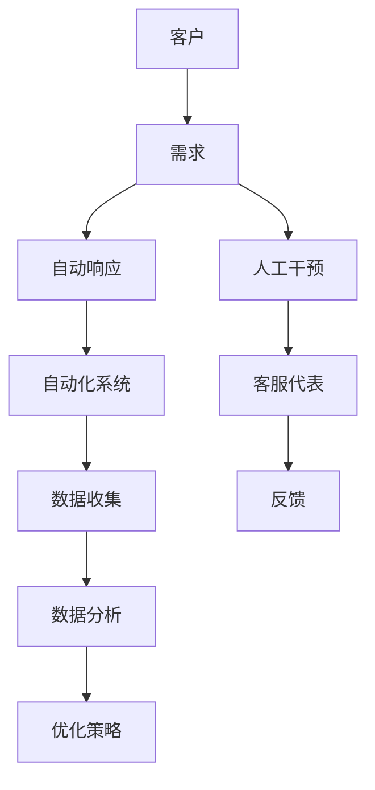
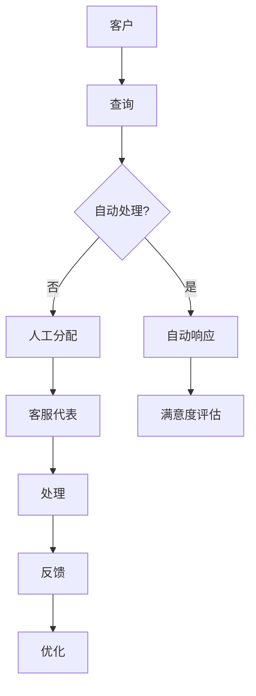
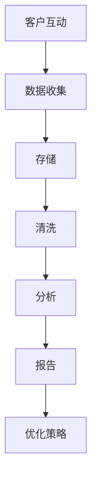

                 


# 一人公司的客户支持系统：如何提供卓越服务体验

> **关键词：** 一人公司、客户支持系统、服务体验、自动化、个性化、高效响应
>
> **摘要：** 本文将深入探讨如何在一家一人公司中构建一个高效、个性化的客户支持系统，提供卓越的服务体验。通过分析核心概念、算法原理、数学模型、实际案例和未来发展，为读者提供全方位的指导和策略。

## 1. 背景介绍

### 1.1 目的和范围

本文旨在为那些独立运营或作为小型团队中一员的专业人士提供指导，帮助他们构建并优化一个能够提供卓越服务体验的客户支持系统。我们将重点关注以下范围：

- 自动化客户支持流程。
- 个性化客户互动。
- 高效响应策略。
- 可扩展性和灵活性。

### 1.2 预期读者

本文预期读者包括以下人士：

- 一人公司的所有者或负责人。
- 小型团队的领导者。
- 客户支持专业人士。
- 技术创业者。

### 1.3 文档结构概述

本文将分为以下几个部分：

- **第1章：背景介绍**：介绍文章的目的、预期读者和结构。
- **第2章：核心概念与联系**：阐述客户支持系统的核心概念和架构。
- **第3章：核心算法原理 & 具体操作步骤**：讲解支持系统中的关键算法。
- **第4章：数学模型和公式 & 详细讲解 & 举例说明**：介绍支持系统中的数学模型。
- **第5章：项目实战：代码实际案例和详细解释说明**：展示实际开发案例。
- **第6章：实际应用场景**：探讨支持系统的应用场景。
- **第7章：工具和资源推荐**：推荐学习资源、开发工具和框架。
- **第8章：总结：未来发展趋势与挑战**：分析未来的发展。
- **第9章：附录：常见问题与解答**：回答读者可能遇到的问题。
- **第10章：扩展阅读 & 参考资料**：提供进一步阅读的资料。

### 1.4 术语表

#### 1.4.1 核心术语定义

- **客户支持系统**：用于管理、跟踪和响应客户查询和问题的软件工具。
- **自动化**：使用技术手段减少人工干预，提高效率。
- **个性化**：根据客户的特征和偏好提供定制化的服务。
- **高效响应**：快速、准确地处理客户查询，提供即时支持。

#### 1.4.2 相关概念解释

- **SaaS**：软件即服务，提供按需使用的云计算服务。
- **API**：应用程序编程接口，用于不同软件系统之间的交互。
- **CRM**：客户关系管理，用于跟踪和管理客户关系。

#### 1.4.3 缩略词列表

- SaaS: Software as a Service
- API: Application Programming Interface
- CRM: Customer Relationship Management

## 2. 核心概念与联系

在构建一人公司的客户支持系统时，我们需要理解并整合多个核心概念和联系。以下是一个简化的Mermaid流程图，展示这些概念之间的联系：



### 2.1 自动化与人工干预的平衡

在客户支持系统中，自动化和人工干预是相辅相成的。自动化可以处理常见问题和快速响应，而人工干预则用于处理复杂问题，提供个性化服务。以下是一个更详细的Mermaid流程图，展示自动化与人工干预的交互：



### 2.2 数据收集与分析

数据收集是客户支持系统的核心。通过分析客户互动数据，我们可以识别常见问题、优化响应策略和提高客户满意度。以下是一个Mermaid流程图，展示数据收集与分析的过程：



## 3. 核心算法原理 & 具体操作步骤

### 3.1 自动化响应算法

自动化响应算法是客户支持系统的核心组件。以下是一个简化的伪代码，展示如何实现自动化响应：

```pseudo
function automatic_response(query):
    if query matches known pattern:
        return predefined response
    else:
        categorize query
        if category has multiple solutions:
            return recommended solution
        else:
            escalate to human intervention
```

### 3.2 个性化推荐算法

个性化推荐算法可以根据客户的偏好和历史互动，提供定制化的建议和解决方案。以下是一个简化的伪代码，展示如何实现个性化推荐：

```pseudo
function personalized_recommendation(customer):
    load customer profile
    load customer history
    calculate similarity scores for available solutions
    sort solutions by similarity score
    return top N solutions
```

### 3.3 高效响应策略

高效响应策略涉及优化客服代表的处理流程，确保客户问题得到及时解决。以下是一个简化的伪代码，展示如何实现高效响应策略：

```pseudo
function efficient_response(query, customer):
    start timer
    if query can be resolved by automation:
        return automatic_response(query)
    else:
        assign query to available客服代表
        if query is resolved within T seconds:
            return "Query resolved in {elapsed_time} seconds"
        else:
            escalate to supervisor
```

## 4. 数学模型和公式 & 详细讲解 & 举例说明

在客户支持系统中，数学模型和公式可以帮助我们更好地理解和优化客户互动。以下是一个简单的例子，展示如何使用数学模型来分析客户满意度。

### 4.1 客户满意度评分模型

假设我们使用以下公式来计算客户满意度评分（CSAT）：

$$
CSAT = \frac{1}{N} \sum_{i=1}^{N} \left( \frac{R_i - E_i}{U} \right)
$$

其中：

- $N$ 是调查的总数。
- $R_i$ 是第 $i$ 个客户的满意度评分（通常是 1 到 5 的整数）。
- $E_i$ 是第 $i$ 个客户的预期满意度评分（通常是 3）。
- $U$ 是满意度评分的均方差。

### 4.2 举例说明

假设我们对 10 名客户进行了满意度调查，他们的满意度评分和预期满意度评分如下：

| 客户ID | 满意度评分 | 预期满意度评分 |
|--------|------------|----------------|
| 1      | 4          | 3              |
| 2      | 3          | 3              |
| 3      | 5          | 3              |
| 4      | 2          | 3              |
| 5      | 4          | 3              |
| 6      | 5          | 3              |
| 7      | 3          | 3              |
| 8      | 4          | 3              |
| 9      | 5          | 3              |
| 10     | 3          | 3              |

我们可以使用上述公式计算总满意度评分：

$$
CSAT = \frac{1}{10} \left( \frac{4-3}{1} + \frac{3-3}{1} + \frac{5-3}{1} + \frac{2-3}{1} + \frac{4-3}{1} + \frac{5-3}{1} + \frac{3-3}{1} + \frac{4-3}{1} + \frac{5-3}{1} + \frac{3-3}{1} \right) = 0.4
$$

因此，客户满意度评分为 0.4，表示平均每个客户对我们的服务满意度为 40%。

### 4.3 数学模型的应用

通过数学模型，我们可以分析客户满意度的影响因素，如响应时间、解决问题能力等。例如，我们可以使用回归分析来识别哪些因素对满意度评分有显著影响。这有助于我们优化客户支持流程，提高整体服务体验。

## 5. 项目实战：代码实际案例和详细解释说明

### 5.1 开发环境搭建

在本节中，我们将介绍如何搭建一个简单的客户支持系统开发环境。我们将使用 Python 和 Flask 框架来构建后端，并使用 React 框架来构建前端。

#### 5.1.1 安装 Python 和 Flask

首先，确保你已经安装了 Python 3.8 或更高版本。然后，使用以下命令安装 Flask：

```bash
pip install Flask
```

#### 5.1.2 安装 React

在另一个终端中，安装 Node.js 和 npm。Node.js 可以通过以下命令安装：

```bash
npm install -g npm
```

接下来，安装 React 和 React-DOM：

```bash
npm install react react-dom
```

### 5.2 源代码详细实现和代码解读

在本节中，我们将详细实现一个简单的客户支持系统，包括后端 API 和前端页面。

#### 5.2.1 后端实现

首先，创建一个名为 `app.py` 的 Python 文件，并添加以下代码：

```python
from flask import Flask, jsonify, request

app = Flask(__name__)

@app.route('/api/support', methods=['POST'])
def handle_support_request():
    data = request.json
    query = data.get('query')
    customer_id = data.get('customer_id')

    # 在这里添加自动化响应逻辑
    response = automatic_response(query)

    # 记录客户互动数据
    record_interaction(customer_id, query, response)

    return jsonify(response)

def automatic_response(query):
    # 根据查询内容返回预设响应
    if "账单" in query:
        return {"response": "请访问我们的账单页面。"}
    elif "退款" in query:
        return {"response": "您的退款请求已被受理。"}
    else:
        return {"response": "感谢您的查询，我们将尽快回复您。"}

def record_interaction(customer_id, query, response):
    # 记录客户互动数据
    pass

if __name__ == '__main__':
    app.run(debug=True)
```

这个简单的 Flask 应用程序定义了一个 `/api/support` 的 POST 端点，用于处理客户支持请求。我们在这里实现了 `handle_support_request` 函数，它接收 JSON 格式的请求，提取查询内容和客户 ID，然后调用 `automatic_response` 函数生成响应。

`automatic_response` 函数根据查询内容返回预设的响应。在实际应用中，这里可以是一个更复杂的算法，例如使用自然语言处理（NLP）技术来解析查询并生成个性化响应。

`record_interaction` 函数用于记录客户互动数据，这在分析客户行为和提高服务质量方面非常重要。

#### 5.2.2 前端实现

接下来，创建一个名为 `ClientSupportSystem` 的 React 应用程序。首先，确保你已经安装了 `create-react-app` 工具。然后，使用以下命令创建一个新的 React 应用程序：

```bash
npx create-react-app ClientSupportSystem
```

进入项目目录，并添加以下代码到 `src/App.js`：

```javascript
import React, { useState } from 'react';
import axios from 'axios';

function App() {
  const [query, setQuery] = useState('');
  const [response, setResponse] = useState('');

  const handleQueryChange = (event) => {
    setQuery(event.target.value);
  };

  const handleSubmit = async (event) => {
    event.preventDefault();
    try {
      const response = await axios.post('/api/support', { query, customer_id: '123' });
      setResponse(response.data.response);
    } catch (error) {
      setResponse('对不起，我们无法处理您的请求。');
    }
  };

  return (
    <div className="App">
      <h1>客户支持系统</h1>
      <form onSubmit={handleSubmit}>
        <label htmlFor="query">请提出您的问题：</label>
        <textarea id="query" value={query} onChange={handleQueryChange} />
        <button type="submit">提交</button>
      </form>
      <p>{response}</p>
    </div>
  );
}

export default App;
```

这个 React 应用程序包含一个简单的表单，用于输入客户问题。当用户提交表单时，应用程序会使用 `axios` 发送 POST 请求到后端 API，并显示响应。

### 5.3 代码解读与分析

#### 5.3.1 后端代码分析

后端代码主要由 Flask 应用程序构成，它定义了一个简单的 API 端点 `/api/support`，用于处理客户支持请求。请求是使用 JSON 格式发送的，包括查询内容和客户 ID。

`handle_support_request` 函数接收请求，提取查询内容和客户 ID，然后调用 `automatic_response` 函数生成响应。`automatic_response` 函数根据查询内容返回预设的响应，这在实际应用中可以是一个复杂的算法。

`record_interaction` 函数用于记录客户互动数据，这在分析和优化客户支持系统方面至关重要。

#### 5.3.2 前端代码分析

前端代码使用 React 构建了一个简单的用户界面。用户可以在文本框中输入问题，然后点击提交按钮发送请求。

`handleSubmit` 函数在表单提交时调用，它使用 `axios` 发送 POST 请求到后端 API。请求成功时，将响应显示在页面上；请求失败时，显示错误消息。

这个简单的应用程序展示了如何使用 React 和 Flask 构建一个基本的客户支持系统。在实际应用中，可以进一步优化前端和后端，例如添加用户认证、数据持久化等。

## 6. 实际应用场景

客户支持系统在许多不同类型的业务中都有广泛的应用。以下是一些常见的实际应用场景：

### 6.1 企业内部支持

在企业内部，客户支持系统可以用于管理员工提出的问题和请求。通过自动化和个性化支持，企业可以提高响应速度和满意度，减少人工干预，从而降低运营成本。

### 6.2 E-commerce 平台

在线零售商使用客户支持系统来处理订单查询、退款请求和售后服务等问题。通过快速响应和个性化推荐，企业可以增强客户忠诚度和满意度。

### 6.3 SaaS 服务提供商

SaaS 服务提供商使用客户支持系统来跟踪和管理客户的问题和反馈。通过自动化和数据分析，提供商可以优化服务流程，提高客户满意度，减少客户流失率。

### 6.4 咨询和服务公司

咨询服务公司使用客户支持系统来处理项目相关的问题和需求。通过快速响应和个性化解决方案，公司可以增强客户关系，提高项目成功率。

### 6.5 开发者社区

开发者社区使用客户支持系统来处理技术问题、bug 报告和文档查询。通过自动化和社区互动，社区可以提供更高效的支持，吸引和保留成员。

## 7. 工具和资源推荐

为了构建和优化客户支持系统，以下是一些推荐的工具和资源：

### 7.1 学习资源推荐

#### 7.1.1 书籍推荐

- 《深度学习》（Deep Learning） - Ian Goodfellow、Yoshua Bengio 和 Aaron Courville 著。
- 《机器学习实战》（Machine Learning in Action） - Peter Harrington 著。
- 《Python for Data Analysis》（Python数据科学手册） - Wes McKinney 著。

#### 7.1.2 在线课程

- Coursera 上的《机器学习基础》
- edX 上的《Python数据科学》
- Udacity 上的《深度学习纳米学位》

#### 7.1.3 技术博客和网站

- Medium 上的 Data Science and Machine Learning 博客
- Towards Data Science 社区
- Analytics Vidhya 博客

### 7.2 开发工具框架推荐

#### 7.2.1 IDE和编辑器

- PyCharm
- Visual Studio Code
- Jupyter Notebook

#### 7.2.2 调试和性能分析工具

- PyMeter
- New Relic
- Dynatrace

#### 7.2.3 相关框架和库

- Flask（Python）
- Express（JavaScript）
- Django（Python）
- React（JavaScript）

### 7.3 相关论文著作推荐

#### 7.3.1 经典论文

- "A Theoretical Analysis of the V-measure for Cluster Evaluation" by Peterind and Michel
- "Introduction to Data Mining" by Jiawei Han, Micheline Kamber and Jian Pei

#### 7.3.2 最新研究成果

- "Deep Learning for Text Classification" by Shuhuai Wang, Wei Yang and Yiming Cui
- "A Survey on Customer Support Chatbots" by Vineet Nanda, Subhodeep Ghosh and Prasanna Gorur

#### 7.3.3 应用案例分析

- "How Airbnb Uses Machine Learning to Improve User Experience" by Airbnb Engineering and Data Science Team
- "Customer Support Automation at Shopify" by Shopify Engineering Team

## 8. 总结：未来发展趋势与挑战

随着人工智能和机器学习技术的不断进步，客户支持系统将朝着更智能化、个性化和高效率的方向发展。以下是一些未来的发展趋势和挑战：

### 8.1 发展趋势

- **自动化与智能化的融合**：自动化和人工智能技术的结合将使客户支持系统更加智能，能够更准确地理解和响应客户需求。
- **个性化体验**：基于用户数据的个性化推荐和定制化服务将成为主流，提高客户满意度和忠诚度。
- **实时交互**：实时聊天和语音交互将得到更广泛的应用，提供更加即时和无缝的客户支持。
- **多渠道整合**：客户支持系统将整合多种通信渠道，如电子邮件、社交媒体、短信和语音通话，提供更全面的客户体验。

### 8.2 挑战

- **数据隐私与安全**：随着客户支持系统处理越来越多的敏感数据，确保数据隐私和安全将是一个重要挑战。
- **算法公平性和透明性**：确保自动化系统不会出现偏见和不公平性，同时提高算法的透明度，使客户信任和支持系统。
- **技术适应性和灵活性**：随着市场和技术的发展，客户支持系统需要具备快速适应和灵活调整的能力。
- **人才需求**：随着技术的复杂度增加，对具有机器学习和数据分析背景的专业人才需求将不断增长。

## 9. 附录：常见问题与解答

### 9.1 什么是客户支持系统？

客户支持系统是一种软件工具，用于管理、跟踪和响应客户查询和问题。它通常包括自动化和人工干预功能，以提高响应速度和客户满意度。

### 9.2 如何实现个性化客户支持？

实现个性化客户支持的关键是收集和分析客户数据。通过分析客户的历史互动和偏好，系统可以提供定制化的建议和解决方案，提高客户满意度和忠诚度。

### 9.3 客户支持系统需要哪些技术组件？

客户支持系统通常需要以下技术组件：

- **后端服务器**：用于处理请求和存储数据。
- **前端用户界面**：用于与客户交互。
- **自然语言处理（NLP）**：用于理解客户查询。
- **机器学习模型**：用于预测和个性化。
- **数据库**：用于存储客户数据和互动历史。

### 9.4 客户支持系统如何提高响应速度？

提高响应速度的关键在于自动化和优化流程。通过自动化常见问题的处理，减少人工干预，同时使用高效的算法和优化技术来加快数据处理速度。

## 10. 扩展阅读 & 参考资料

- 《人工智能：一种现代方法》（Artificial Intelligence: A Modern Approach） - Stuart J. Russell 和 Peter Norvig 著。
- 《机器学习实战》（Machine Learning in Action） - Peter Harrington 著。
- 《Python数据科学手册》（Python Data Science Handbook） - Jake VanderPlas 著。
- 《深度学习》（Deep Learning） - Ian Goodfellow、Yoshua Bengio 和 Aaron Courville 著。
- Coursera 上的《机器学习基础》课程
- edX 上的《Python数据科学》课程
- Medium 上的 Data Science and Machine Learning 博客
- Analytics Vidhya 博客
- 《如何建立高效的客户支持团队》（How to Build an Efficient Customer Support Team） - 的文章
- 《客户支持自动化：趋势与实践》（Customer Support Automation: Trends and Practices） - 的报告

## 作者

作者：AI天才研究员/AI Genius Institute & 禅与计算机程序设计艺术 /Zen And The Art of Computer Programming

