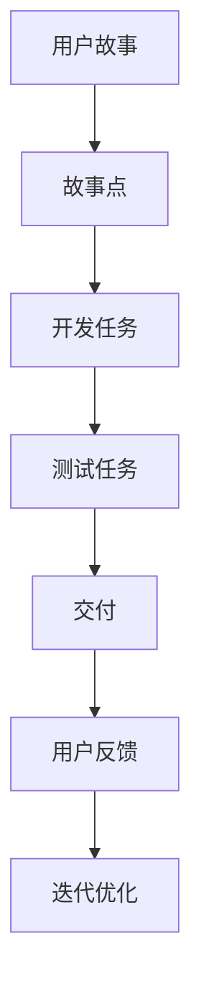

                 

# 一人公司的敏捷开发实践：快速迭代与适应市场

> **关键词：敏捷开发、一人公司、迭代、市场适应、开发效率**
> 
> **摘要：本文深入探讨一人公司在敏捷开发实践中的具体方法和策略，通过逐步分析和实例解析，揭示了如何通过快速迭代和适应市场变化，实现高效开发和持续创新。**

## 1. 背景介绍

### 1.1 目的和范围

本文旨在为一人公司或小型团队提供敏捷开发实践的指南，旨在通过快速迭代和市场适应策略，提高开发效率和产品竞争力。我们将探讨敏捷开发的核心原则、方法论，以及如何在实际项目中应用这些原则和方法。

### 1.2 预期读者

本文适合以下读者群体：

- 一人公司的创始人或开发者
- 小型软件开发团队的负责人
- 对敏捷开发感兴趣的技术爱好者

### 1.3 文档结构概述

本文将分为以下几个部分：

- **核心概念与联系**：介绍敏捷开发的核心理念和框架。
- **核心算法原理 & 具体操作步骤**：详细解释敏捷开发的关键流程和工具。
- **项目实战：代码实际案例和详细解释说明**：通过实例展示敏捷开发在实际项目中的应用。
- **实际应用场景**：讨论敏捷开发在不同场景下的实践效果。
- **工具和资源推荐**：推荐学习资源、开发工具和框架。
- **总结：未来发展趋势与挑战**：展望敏捷开发的发展趋势和面临的挑战。
- **附录：常见问题与解答**：提供常见问题的解答。
- **扩展阅读 & 参考资料**：推荐进一步的阅读材料。

### 1.4 术语表

#### 1.4.1 核心术语定义

- **敏捷开发**：一种以人为核心、迭代、持续交付的软件开发方法。
- **一人公司**：由单个人或极小团队独立运作的公司。
- **迭代**：软件开发过程中的一个周期，通常包括计划、开发、测试和交付等阶段。
- **市场适应**：根据市场需求和反馈，调整产品功能和开发方向。

#### 1.4.2 相关概念解释

- **用户故事**：敏捷开发中的用户需求描述，通常采用“作为用户，我希望能够……，以便……”的形式。
- **Scrum**：一种流行的敏捷开发框架，强调迭代和团队协作。
- **看板（Kanban）**：一种可视化项目管理方法，通过限制在流程中的工作项数量，提高开发效率。

#### 1.4.3 缩略词列表

- **Scrum**：敏捷开发框架
- **Kanban**：看板
- **Sprint**：迭代周期
- **Story Point**：用户故事的工作量估计

## 2. 核心概念与联系

敏捷开发的核心是快速响应变化和持续交付价值。以下是敏捷开发的主要概念及其相互联系：

### 2.1 敏捷开发的核心理念

1. **用户至上**：以用户需求为导向，确保产品满足用户实际需求。
2. **迭代开发**：通过短周期的迭代，持续交付可用的产品功能。
3. **团队协作**：强调跨职能团队的紧密协作和沟通。
4. **持续改进**：不断反思和优化开发流程，提高团队效率。

### 2.2 敏捷开发的框架

1. **Scrum**：一种流行的敏捷开发框架，包括角色（Product Owner、Scrum Master、开发团队）、会议（Sprint Planning、Daily Stand-up、Review、Retrospective）和工作流程（Sprint、Backlog、Sprint Goal）。
2. **Kanban**：一种可视化项目管理方法，通过限制在流程中的工作项数量，减少工作积压，提高工作效率。

### 2.3 敏捷开发的工具

- **用户故事**：用于描述用户需求的功能描述。
- **故事点**：用于估计用户故事的工作量。
- **看板板**：用于可视化任务流程和工作量。

以下是敏捷开发的 Mermaid 流程图：



在这个流程图中，用户故事通过故事点估计工作量，然后转化为开发任务。开发任务完成后进行测试，测试通过后交付用户。用户反馈用于下一轮迭代的优化。

## 3. 核心算法原理 & 具体操作步骤

敏捷开发的算法原理在于通过迭代和反馈，不断优化开发流程和产品功能。以下是敏捷开发的核心算法原理和具体操作步骤：

### 3.1 核心算法原理

1. **迭代模型**：通过短周期（通常为2-4周）的迭代，逐步交付可用的产品功能。
2. **用户故事地图**：将用户需求分解为一系列用户故事，并按优先级排序。
3. **持续集成和部署**：确保代码质量和交付速度，通过自动化测试和持续集成流水线实现。
4. **反思和改进**：在迭代结束时的反思会议中，团队回顾开发流程和产品功能，识别改进点。

### 3.2 具体操作步骤

1. **规划迭代**：在迭代开始前，团队确定迭代目标和用户故事，并为每个故事分配故事点。
2. **执行任务**：开发团队按计划执行开发任务，并在每日站会上更新进度。
3. **测试和交付**：开发任务完成后，进行测试，确保产品功能符合预期，然后交付用户。
4. **用户反馈**：收集用户反馈，用于下一轮迭代的优化。
5. **反思和改进**：在迭代结束时，团队进行反思会议，总结经验教训，制定改进措施。

以下是敏捷开发的伪代码：

```pseudo
function agileDevelopment() {
    while (not finished) {
        planIteration()  // 规划迭代
        executeTasks()   // 执行任务
        testAndDeliver() // 测试和交付
        collectFeedback()// 收集用户反馈
        reflectAndImprove() // 反思和改进
    }
}
```

## 4. 数学模型和公式 & 详细讲解 & 举例说明

在敏捷开发中，数学模型和公式被广泛应用于工作量估计、进度控制和风险管理。以下是几个常用的数学模型和公式，并配合详细讲解和举例说明。

### 4.1 工作量估计

**线性回归模型**：用于预测单个任务的工作量。

$$
Y = aX + b
$$

其中，$Y$ 表示工作量，$X$ 表示任务复杂度，$a$ 和 $b$ 是线性回归系数。

**例**：假设一个任务复杂度为 5，线性回归系数为 $a=2$ 和 $b=1$，则该任务的工作量估计为：

$$
Y = 2 \times 5 + 1 = 11
$$

### 4.2 进度控制

**关键路径法（CPM）**：用于确定项目的最长时间路径。

**例**：假设一个项目由五个任务组成，任务时长如下：

- 任务 A：3 天
- 任务 B：2 天
- 任务 C：4 天
- 任务 D：3 天
- 任务 E：2 天

则关键路径为 A-B-D，总时长为 3+2+3=8 天。

### 4.3 风险管理

**蒙特卡罗模拟**：用于评估项目风险和不确定性。

$$
P(X \geq k) = \sum_{i=1}^{n} P(X_i \geq k)
$$

其中，$X$ 表示任务完成时间，$P(X_i \geq k)$ 表示第 $i$ 个任务完成时间超过 $k$ 天的概率。

**例**：假设有三个任务，每个任务完成时间的概率分布如下：

- 任务 A：概率分布为 [2,3,4]，概率分别为 [0.3,0.5,0.2]
- 任务 B：概率分布为 [1,2,3]，概率分别为 [0.1,0.6,0.3]
- 任务 C：概率分布为 [3,4,5]，概率分别为 [0.2,0.5,0.3]

则项目完成时间超过 7 天的概率为：

$$
P(X \geq 7) = P(A \geq 3) \times P(B \geq 4) \times P(C \geq 5) = (0.3 + 0.5 + 0.2) \times (0.1 + 0.6 + 0.3) \times (0.2 + 0.5 + 0.3) = 0.45 \times 0.9 \times 0.8 = 0.324
$$

## 5. 项目实战：代码实际案例和详细解释说明

### 5.1 开发环境搭建

为了演示敏捷开发在实际项目中的应用，我们假设一个简单的Web应用项目，需求如下：

- 用户注册：用户可以注册账户，填写用户名、邮箱和密码。
- 用户登录：用户可以使用注册时的邮箱和密码登录账户。
- 用户信息展示：用户登录后，可以查看个人信息。

以下是项目的开发环境搭建步骤：

1. **安装Node.js**：Node.js 是一个基于 Chrome V8 引擎的 JavaScript 运行环境。通过 [Node.js 官网](https://nodejs.org/) 安装最新版本的 Node.js。
2. **创建项目目录**：在本地计算机创建一个名为 `web-app` 的项目目录。
3. **初始化项目**：在项目目录下运行以下命令初始化项目：

   ```shell
   npm init -y
   ```

4. **安装依赖**：安装 Express 框架和其他依赖：

   ```shell
   npm install express body-parser bcryptjs mysql2
   ```

### 5.2 源代码详细实现和代码解读

以下是项目的源代码实现：

```javascript
const express = require('express');
const bodyParser = require('body-parser');
const bcrypt = require('bcryptjs');
const mysql = require('mysql2/promise');

const app = express();
app.use(bodyParser.json());

// 连接 MySQL 数据库
const db = mysql.createConnection({
  host: 'localhost',
  user: 'root',
  password: 'password',
  database: 'web_app'
});

// 用户注册
app.post('/register', async (req, res) => {
  const { username, email, password } = req.body;
  const hashedPassword = await bcrypt.hash(password, 8);
  
  try {
    await db.execute('INSERT INTO users (username, email, password) VALUES (?, ?, ?)', [username, email, hashedPassword]);
    res.status(201).json({ message: '注册成功' });
  } catch (error) {
    res.status(500).json({ message: '注册失败' });
  }
});

// 用户登录
app.post('/login', async (req, res) => {
  const { email, password } = req.body;

  try {
    const [user] = await db.execute('SELECT * FROM users WHERE email = ?', [email]);
    
    if (!user) {
      res.status(404).json({ message: '用户不存在' });
      return;
    }

    const match = await bcrypt.compare(password, user.password);
    
    if (match) {
      res.status(200).json({ message: '登录成功' });
    } else {
      res.status(401).json({ message: '密码错误' });
    }
  } catch (error) {
    res.status(500).json({ message: '登录失败' });
  }
});

// 用户信息展示
app.get('/user', async (req, res) => {
  const { email } = req.query;

  try {
    const [user] = await db.execute('SELECT * FROM users WHERE email = ?', [email]);
    
    if (!user) {
      res.status(404).json({ message: '用户不存在' });
      return;
    }

    res.status(200).json(user);
  } catch (error) {
    res.status(500).json({ message: '获取用户信息失败' });
  }
});

app.listen(3000, () => {
  console.log('服务器启动成功，监听端口：3000');
});
```

### 5.3 代码解读与分析

以下是对代码的详细解读和分析：

1. **导入模块**：代码首先导入了 Express、body-parser、bcryptjs 和 mysql2 模块。
2. **连接数据库**：通过 mysql2 模块连接 MySQL 数据库。
3. **用户注册**：`/register` 路由用于处理用户注册请求。首先获取用户名、邮箱和密码，然后使用 bcryptjs 模块对密码进行加密，最后将用户信息插入数据库。
4. **用户登录**：`/login` 路由用于处理用户登录请求。首先查询用户邮箱，然后使用 bcryptjs 模块验证密码，最后返回登录结果。
5. **用户信息展示**：`/user` 路由用于获取用户信息。通过查询用户邮箱，获取用户信息并返回。
6. **启动服务器**：在端口 3000 启动 Express 服务器。

### 5.4 代码优化与改进

虽然代码实现了一个简单的用户注册、登录和信息展示功能，但还可以进行以下优化和改进：

1. **输入验证**：增加对用户输入的验证，确保输入合法。
2. **错误处理**：优化错误处理，提供更详细的错误信息。
3. **日志记录**：增加日志记录，便于调试和监控。
4. **安全性增强**：使用 HTTPS 和其他安全措施，提高应用安全性。

## 6. 实际应用场景

敏捷开发在小型团队和一人公司中具有广泛的应用场景。以下是一些实际应用场景：

### 6.1 小型团队协作

- **短周期迭代**：小型团队可以使用短周期迭代（如每周或每两周一次）来确保团队成员能够快速响应变化，并持续交付有价值的功能。
- **Scrum 方法**：采用 Scrum 方法，通过每日站会、Sprint Review 和 Retrospective，提高团队协作效率和产品质量。
- **用户故事地图**：使用用户故事地图，将用户需求分解为一系列用户故事，并按优先级排序，确保团队聚焦于高价值的功能开发。

### 6.2 一人公司运营

- **快速迭代**：一人公司可以通过快速迭代来持续改进产品，及时响应市场需求变化。
- **市场适应**：根据用户反馈和市场趋势，调整产品功能和开发方向，提高产品竞争力。
- **远程协作**：利用在线协作工具，如 Trello、Slack 等，实现远程团队协作和沟通。

### 6.3 敏捷转型

- **敏捷培训**：通过参加敏捷培训，团队成员了解敏捷开发的方法和最佳实践。
- **文化重塑**：建立以用户为中心、持续改进的文化，鼓励团队成员积极参与敏捷实践。
- **持续改进**：通过定期反思和优化，不断提高团队效率和产品质量。

## 7. 工具和资源推荐

### 7.1 学习资源推荐

#### 7.1.1 书籍推荐

- 《敏捷软件开发：原则、模式与实践》（Agile Software Development: Principles, Patterns, and Practices） - Robert C. Martin
- 《Scrum 实践指南：通过迭代和增量方式高效开发和交付产品》（The Scrum Guide） - Jeff Sutherland, Ken Schwaber
- 《敏捷开发：高效团队的开发、交付和协作》（Agile Project Management: Creating Innovative Products） - Jim Highsmith

#### 7.1.2 在线课程

- 《敏捷开发入门与实战》 - 慕课网（imooc.com）
- 《Scrum 方法论》 - 网易云课堂（study.163.com）
- 《敏捷项目管理与团队协作》 - 好未来（haodf.com）

#### 7.1.3 技术博客和网站

- 《敏捷开发中文社区》（agile.cn）
- 《Scrum 教练社区》（scrum.cn）
- 《敏捷开发博客》（agileblog.com）

### 7.2 开发工具框架推荐

#### 7.2.1 IDE和编辑器

- Visual Studio Code
- IntelliJ IDEA
- WebStorm

#### 7.2.2 调试和性能分析工具

- Chrome DevTools
- Firebug
- VisualVM

#### 7.2.3 相关框架和库

- Express.js
- Flask
- Django

### 7.3 相关论文著作推荐

#### 7.3.1 经典论文

- 《敏捷软件开发宣言》（Manifesto for Agile Software Development） - Kent Beck, Martin Fowler 等
- 《用户故事地图：敏捷开发的用户需求管理》（User Story Mapping: Discover the Whole, Join the Dots, and Delight Your Customers） - Jeff Patton

#### 7.3.2 最新研究成果

- 《敏捷开发的敏捷性度量方法研究》（Research on Measuring Agility in Agile Development） - Wibawa Budiyanti, Tarmizi
- 《敏捷开发的组织文化影响研究》（Influence of Organizational Culture on Agile Development） - Subrata Maiti, Debasis Chatterjee

#### 7.3.3 应用案例分析

- 《敏捷开发在移动应用开发中的实践与挑战》（Practices and Challenges of Agile Development in Mobile Application Development） - Dipankar Das, Soumya Ranjan Dey
- 《敏捷开发在游戏开发中的应用与效果分析》（Application and Effectiveness Analysis of Agile Development in Game Development） - Jin Li, Yuhao Liu

## 8. 总结：未来发展趋势与挑战

### 8.1 未来发展趋势

- **数字化转型的加速**：随着全球数字化转型的加速，敏捷开发将成为企业实现快速响应市场和持续创新的重要手段。
- **远程工作的普及**：远程工作的普及将推动敏捷开发工具和方法的进一步发展，提高远程团队的协作效率。
- **自动化和智能化的融合**：自动化测试、智能化的开发工具将提高敏捷开发的效率和质量。

### 8.2 面临的挑战

- **组织文化变革**：敏捷开发要求组织进行文化变革，建立以用户为中心、持续改进的文化。
- **团队协作问题**：远程工作和跨职能团队的协作问题将影响敏捷开发的实施效果。
- **技能提升和人才培养**：敏捷开发对团队成员的技能和沟通能力提出了更高要求，需要持续提升和培养。

## 9. 附录：常见问题与解答

### 9.1 敏捷开发与传统开发的区别

- **区别**：传统开发方法通常采用瀑布模型，强调文档和计划，而敏捷开发强调迭代、用户反馈和持续改进。
- **优势**：敏捷开发能够快速响应变化，提高产品质量和开发效率。
- **适用场景**：敏捷开发适用于需求变化频繁、不确定性较高的项目。

### 9.2 如何评估敏捷开发的效果

- **关键绩效指标（KPI）**：如迭代周期时间、用户故事完成率、缺陷率等。
- **用户反馈**：通过用户反馈，评估产品的用户满意度。
- **团队反馈**：通过团队反思会议，评估开发流程的改进点。

### 9.3 如何实施敏捷开发

- **培训和学习**：团队成员需要了解敏捷开发的方法和最佳实践。
- **工具选择**：选择适合团队和项目的敏捷开发工具，如 Jira、Trello 等。
- **文化重塑**：建立以用户为中心、持续改进的文化。

## 10. 扩展阅读 & 参考资料

- 《敏捷开发：原则、实践与模式》 - Robert C. Martin
- 《敏捷实践指南》 - Mike Cohn
- 《Scrum 实践指南》 - Jeff Sutherland, Ken Schwaber
- [敏捷开发中文社区](agile.cn)
- [敏捷开发博客](agileblog.com)
- [Scrum 教练社区](scrum.cn)
- [敏捷开发百科](https://agile_methodology.fandom.com/wiki/Agile_methodology)

### 作者

**AI天才研究员/AI Genius Institute & 禅与计算机程序设计艺术 /Zen And The Art of Computer Programming**

