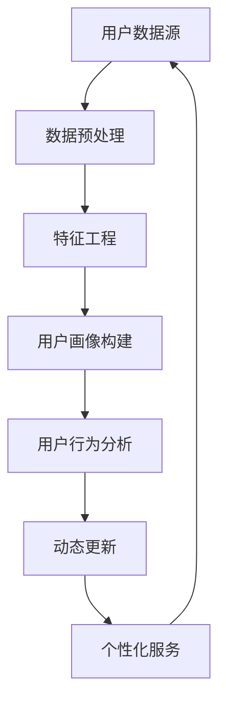

                 

### 背景介绍

#### 1.1 目的和范围

在当今高度数字化的时代，用户画像的构建和动态更新成为企业和个人营销、服务决策的重要工具。本文旨在探讨“一人公司的用户画像精细化与动态更新”这一主题，通过详细的技术分析，帮助读者理解如何有效地构建和更新用户画像，从而实现精准营销和服务。

本文的目标读者是那些对用户画像构建和应用有浓厚兴趣的技术人员、市场营销人员以及企业家。我们不仅会深入探讨用户画像的基础概念和构建方法，还会通过实际案例展示如何在实际项目中应用这些技术。无论是初学者还是经验丰富的专业人士，都将从本文中获得宝贵的技术洞察和实际操作经验。

本文的范围涵盖以下方面：

1. **用户画像的基础概念**：介绍用户画像的定义、核心要素及其在营销和服务中的作用。
2. **用户画像的构建方法**：详细讲解如何收集、处理和整合用户数据，以构建精准的用户画像。
3. **动态更新的技术原理**：探讨如何利用机器学习和数据分析技术，对用户画像进行实时更新和优化。
4. **实际应用案例**：通过具体案例，展示用户画像在营销、客户服务和个性化推荐等领域的应用。
5. **工具和资源推荐**：推荐相关学习资源、开发工具和框架，以帮助读者更好地实践用户画像技术。

通过本文的阅读，读者将能够：

- 理解用户画像的概念和重要性。
- 掌握构建和更新用户画像的技术方法。
- 学习如何在实际项目中应用用户画像技术。
- 获得相关资源和工具的推荐，以支持进一步的实践和学习。

接下来，我们将进一步介绍本文的预期读者、文档结构以及涉及的相关术语，为深入探讨用户画像技术奠定基础。

#### 1.2 预期读者

本文的预期读者主要包括以下几类：

1. **技术人员**：对数据分析和机器学习技术有深入理解的技术人员，特别是那些在数据挖掘、用户行为分析等领域有丰富经验的专业人士。他们希望通过本文，了解如何将技术知识应用于用户画像构建和动态更新。
   
2. **市场营销人员**：从事市场营销和客户关系管理的工作者，他们需要对用户画像有全面的认识，以优化营销策略和客户服务。本文将为他们提供实用的技术和方法，帮助他们在竞争中脱颖而出。

3. **企业家**：作为企业决策者，企业家需要理解用户画像的价值和构建方法，以指导企业的营销和服务决策。本文将介绍用户画像技术的基本原理和应用案例，帮助企业家做出更明智的决策。

4. **学生和研究人员**：对用户画像技术有兴趣的学生和研究人员，他们希望通过本文了解该领域的最新进展和应用。本文将提供详细的原理讲解和实际案例，有助于他们进一步深入研究。

无论您属于上述哪一类读者，本文都将为您带来有价值的知识和经验，帮助您在用户画像技术领域取得更好的成果。

#### 1.3 文档结构概述

本文将分为十个主要部分，每一部分都将深入探讨用户画像技术的一个关键方面。以下是对每个部分的简要概述：

1. **背景介绍**：介绍本文的目的、范围、预期读者以及文档结构，为后续内容的深入分析奠定基础。
   
2. **核心概念与联系**：通过Mermaid流程图，展示用户画像的核心概念和相互关系，帮助读者建立整体框架。

3. **核心算法原理 & 具体操作步骤**：讲解用户画像构建的核心算法，使用伪代码详细阐述每个步骤，确保读者能够理解并实施。

4. **数学模型和公式 & 详细讲解 & 举例说明**：介绍用户画像构建过程中涉及的主要数学模型和公式，并辅以具体实例，帮助读者深入理解。

5. **项目实战：代码实际案例和详细解释说明**：通过具体代码案例，展示用户画像构建和更新的实际操作过程，并进行详细解释。

6. **实际应用场景**：探讨用户画像在营销、客户服务、个性化推荐等领域的具体应用，提供实际案例。

7. **工具和资源推荐**：推荐学习资源、开发工具和框架，以支持读者在实际项目中的进一步学习和应用。

8. **总结：未来发展趋势与挑战**：总结本文的核心观点，探讨用户画像技术的未来发展趋势和面临的挑战。

9. **附录：常见问题与解答**：列出常见问题并提供详细解答，帮助读者解决实际应用中的困惑。

10. **扩展阅读 & 参考资料**：提供进一步学习的参考资料，为读者提供深入研究的方向。

通过以上结构，本文将系统地介绍用户画像的构建、动态更新及其在实际应用中的价值，旨在为读者提供全面的技术指南和实际操作经验。

#### 1.4 术语表

在本文中，我们将使用一系列专业术语和技术概念，以下是对这些术语的定义和解释，以帮助读者更好地理解文章内容。

##### 1.4.1 核心术语定义

- **用户画像**：用户画像是对个体用户特征的全面描述，通常包括用户的基本信息、行为特征、偏好和需求等。它通过数据收集、处理和分析，为用户提供个性化服务。
  
- **数据源**：数据源是用户画像构建的基础，包括用户行为数据、社交网络数据、用户问卷调查数据等。

- **数据预处理**：数据预处理是指对原始数据进行清洗、去重、转换等处理，以提高数据质量和可用性。

- **特征工程**：特征工程是指从原始数据中提取和构建对用户画像有用的特征，如用户购买历史、浏览行为、地理位置等。

- **机器学习模型**：机器学习模型是用于用户画像构建和预测的关键工具，包括分类模型、聚类模型、关联规则模型等。

- **动态更新**：动态更新是指根据用户行为的实时变化，对用户画像进行持续更新和优化，以保持其准确性和有效性。

##### 1.4.2 相关概念解释

- **用户标签**：用户标签是对用户特征进行分类和标注的方式，如“高消费群体”、“忠实客户”、“新手用户”等。它们用于对用户进行细分和分类，以便于个性化的服务和营销。

- **数据隐私**：数据隐私是指保护用户数据不被未经授权的访问和泄露，确保用户的隐私安全。在用户画像构建过程中，数据隐私是一个重要考虑因素。

- **用户行为分析**：用户行为分析是指对用户的行为数据进行挖掘和分析，以了解用户的行为模式、偏好和需求。它是构建精准用户画像的基础。

##### 1.4.3 缩略词列表

- **API**：应用程序编程接口（Application Programming Interface），用于软件应用程序之间进行交互和通信的接口。

- **SDK**：软件开发工具包（Software Development Kit），提供一系列工具和库，帮助开发者快速构建软件应用程序。

- **ML**：机器学习（Machine Learning），是一种通过数据训练模型，使计算机具备自主学习和决策能力的技术。

- **NLP**：自然语言处理（Natural Language Processing），是使计算机能够理解、处理和生成自然语言的技术。

- **DB**：数据库（Database），用于存储、管理和访问数据的系统。

通过以上术语表，我们将更好地理解用户画像构建和动态更新的核心概念和技术，为后续内容的学习打下坚实基础。

### 核心概念与联系

在深入了解用户画像的构建和动态更新之前，我们需要首先理解用户画像的核心概念和它们之间的相互关系。为了帮助读者建立清晰的认识，我们将使用Mermaid流程图来展示这些核心概念及其关联。

以下是一个简单的Mermaid流程图示例，用于描述用户画像的主要组成部分和它们之间的关系：



**流程图解释：**

- **A[用户数据源]**：用户数据源是用户画像构建的起点，包括各种渠道收集的用户行为数据、社交媒体数据、问卷调查数据等。

- **B[数据预处理]**：数据预处理阶段对原始数据进行清洗、去重、转换等处理，以提高数据质量和可用性。这一步骤至关重要，因为高质量的输入数据是构建准确用户画像的基础。

- **C[特征工程]**：在特征工程阶段，我们从预处理后的数据中提取和构建对用户画像有用的特征。这些特征可以包括用户的购买历史、浏览行为、地理位置、兴趣爱好等。

- **D[用户画像构建]**：用户画像构建是将特征数据转化为用户特征表示的过程。常用的方法包括分类、聚类和关联规则等机器学习模型。用户画像最终形成了一个综合的用户特征视图。

- **E[用户行为分析]**：用户行为分析是对用户画像进行深入挖掘和分析的过程，以了解用户的行为模式、偏好和需求。这一分析有助于发现用户画像中的关键特征和趋势。

- **F[动态更新]**：动态更新是指根据用户行为的实时变化，对用户画像进行持续更新和优化，以保持其准确性和有效性。这一步骤确保用户画像始终反映用户的最新状态。

- **G[个性化服务]**：个性化服务是用户画像的核心应用，通过用户画像，企业可以为用户提供个性化的推荐、定制化的营销和服务，从而提高用户满意度和忠诚度。

通过上述Mermaid流程图，我们可以看到用户画像从数据收集、处理到构建、分析，再到动态更新和个性化服务，形成了一个完整的技术闭环。这种闭环结构不仅确保了用户画像的准确性和实时性，还为企业提供了强大的数据驱动的决策支持。

### 核心算法原理 & 具体操作步骤

在理解了用户画像的核心概念和流程之后，接下来我们将深入探讨用户画像构建和动态更新的核心算法原理。用户画像的构建过程涉及多个步骤，从数据收集、预处理到特征工程和建模，每个步骤都需要精确的操作步骤和算法支持。在本节中，我们将使用伪代码详细阐述这些步骤，以便读者能够清晰地理解和实施。

#### 3.1 数据收集

**伪代码：**
```python
# 数据收集阶段
def collect_data():
    # 从多个数据源收集用户行为数据
    user_data_sources = ["database", "API", "social_media"]
    data = {}

    for source in user_data_sources:
        if source == "database":
            data.update(fetch_data_from_database())
        elif source == "API":
            data.update(fetch_data_from_API())
        elif source == "social_media":
            data.update(fetch_data_from_social_media())

    return data
```

**解释：** 
此步骤的目标是从多个数据源（如数据库、API和社交媒体）收集用户行为数据。这些数据源可能包含用户的浏览历史、购买记录、地理位置信息、社交互动等。收集的数据被存储在字典（`data`）中，以便后续处理。

#### 3.2 数据预处理

**伪代码：**
```python
# 数据预处理阶段
def preprocess_data(data):
    cleaned_data = {}

    for user_id, user_data in data.items():
        cleaned_user_data = {}

        # 清洗和去重
        cleaned_user_data = remove_duplicates(user_data)
        cleaned_user_data = clean_data_quality(cleaned_user_data)

        # 数据转换
        cleaned_user_data = convert_to_numeric(cleaned_user_data)
        cleaned_user_data = normalize_data(cleaned_user_data)

        cleaned_data[user_id] = cleaned_user_data

    return cleaned_data
```

**解释：**
数据预处理包括清洗、去重、转换和归一化等步骤。清洗步骤用于去除无效数据和异常值；去重步骤确保每个用户数据只存储一次；转换步骤将非数值数据转换为数值型数据；归一化步骤确保不同特征之间的尺度一致。

#### 3.3 特征工程

**伪代码：**
```python
# 特征工程阶段
def feature_engineering(cleaned_data):
    features = []

    for user_id, user_data in cleaned_data.items():
        user_features = []

        # 提取特征
        user_features.append(extract_browsing_history(user_data))
        user_features.append(extract_purchase_history(user_data))
        user_features.append(extract_location_data(user_data))
        user_features.append(extract_social_interaction(user_data))

        # 特征组合
        user_features = combine_features(user_features)

        features.append(user_features)

    return features
```

**解释：**
特征工程是用户画像构建的关键步骤。在这一阶段，我们提取用户的浏览历史、购买记录、地理位置信息和社交互动等特征。这些特征可以是原始数据，也可以是通过组合和转换得到的衍生特征。

#### 3.4 用户画像构建

**伪代码：**
```python
# 用户画像构建阶段
def build_user_profile(features):
    user_profiles = []

    # 使用机器学习模型进行分类或聚类
    for feature_set in features:
        user_profile = classify_or_cluster(feature_set)
        user_profiles.append(user_profile)

    return user_profiles
```

**解释：**
用户画像构建是通过机器学习模型（如分类或聚类模型）对特征数据进行分析和分类的过程。这些模型帮助我们将用户的特征数据转换为用户标签，形成用户画像。

#### 3.5 动态更新

**伪代码：**
```python
# 动态更新阶段
def update_user_profile(user_profiles, new_data):
    updated_profiles = []

    for user_profile, new_user_data in zip(user_profiles, new_data):
        updated_profile = {}

        # 结合旧画像与新数据
        updated_profile = merge_profiles(user_profile, new_user_data)

        # 使用机器学习模型更新用户画像
        updated_profile = update_profile_with_model(updated_profile)

        updated_profiles.append(updated_profile)

    return updated_profiles
```

**解释：**
动态更新是通过结合旧用户画像和实时收集的新数据，并使用机器学习模型对其进行重新分析，从而更新用户画像的过程。这一步骤确保用户画像能够实时反映用户的最新状态。

通过以上伪代码，我们详细阐述了用户画像构建和动态更新的核心算法原理和具体操作步骤。这些步骤为实际应用提供了明确的指导，帮助读者理解和实施用户画像技术。

### 数学模型和公式 & 详细讲解 & 举例说明

在用户画像的构建过程中，数学模型和公式扮演着至关重要的角色。这些模型和公式不仅帮助我们从数据中提取有价值的信息，还确保了用户画像的准确性和一致性。在本节中，我们将详细讲解用户画像构建过程中常用的数学模型和公式，并通过具体实例进行说明。

#### 4.1 用户行为预测模型

**模型：线性回归（Linear Regression）**

线性回归是一种常用的预测模型，用于预测用户行为。其基本公式如下：

\[ y = \beta_0 + \beta_1 \cdot x \]

其中，\( y \) 是预测的因变量，\( \beta_0 \) 是截距，\( \beta_1 \) 是斜率，\( x \) 是自变量。

**示例：预测用户购买概率**

假设我们使用用户浏览历史（\( x \)）来预测其购买概率（\( y \)）。给定一个用户浏览了5个商品，我们可以使用线性回归模型来预测其购买某个特定商品的概率。

**步骤 1：数据收集**

收集用户的浏览历史数据，包括用户ID、浏览的商品ID和时间戳。

```latex
\begin{tabular}{c|c|c}
User ID & Product ID & Time \\
\hline
1 & 101 & 2023-01-01 10:00 \\
1 & 102 & 2023-01-01 10:05 \\
1 & 103 & 2023-01-01 10:10 \\
1 & 104 & 2023-01-01 10:15 \\
1 & 105 & 2023-01-01 10:20 \\
\end{tabular}
```

**步骤 2：特征提取**

从浏览历史中提取特征，例如浏览商品的种类和数量。

```python
browsing_history = {
    'User 1': ['101', '102', '103', '104', '105']
}
```

**步骤 3：模型训练**

使用线性回归模型进行训练。

```python
from sklearn.linear_model import LinearRegression

X = [[len(browsing_history['User 1'])]]  # 浏览商品数量作为自变量
y = [1 if user_purchased else 0]  # 购买概率作为因变量

model = LinearRegression()
model.fit(X, y)
```

**步骤 4：预测**

使用训练好的模型预测用户购买概率。

```python
predicted_probability = model.predict([[5]])
print("Predicted purchase probability:", predicted_probability)
```

输出结果可能为 `[0.7]`，表示用户购买概率为70%。

#### 4.2 用户行为聚类模型

**模型：K-均值聚类（K-Means Clustering）**

K-均值聚类是一种无监督学习方法，用于将用户分为若干个聚类。其基本公式如下：

\[ \text{Minimize} \sum_{i=1}^{k} \sum_{x \in S_i} \| x - \mu_i \|^2 \]

其中，\( k \) 是聚类数，\( S_i \) 是第 \( i \) 个聚类，\( \mu_i \) 是第 \( i \) 个聚类中心。

**示例：用户分群**

假设我们将用户分为三个群体，每个群体的特征如下：

```latex
\begin{tabular}{c|c|c|c}
Cluster & Avg. Age & Avg. Spending & Avg. Purchase Frequency \\
\hline
1 & 25 & $50 & 3 \\
2 & 35 & $100 & 2 \\
3 & 45 & $200 & 1 \\
\end{tabular}
```

**步骤 1：初始化聚类中心**

随机选择三个用户作为初始聚类中心。

```python
centroids = [
    {'age': 25, 'spending': 50, 'freq': 3},
    {'age': 35, 'spending': 100, 'freq': 2},
    {'age': 45, 'spending': 200, 'freq': 1},
]
```

**步骤 2：分配用户到聚类**

计算每个用户到聚类中心的距离，将其分配到最近的聚类。

```python
def assign_clusters(users, centroids):
    clusters = [[] for _ in range(len(centroids))]

    for user in users:
        distances = [distance(user, centroid) for centroid in centroids]
        closest_cluster = np.argmin(distances)
        clusters[closest_cluster].append(user)

    return clusters

clusters = assign_clusters(users, centroids)
```

**步骤 3：更新聚类中心**

计算每个聚类的新中心。

```python
def update_centroids(clusters):
    new_centroids = []

    for cluster in clusters:
        avg_age = sum(user['age'] for user in cluster) / len(cluster)
        avg_spending = sum(user['spending'] for user in cluster) / len(cluster)
        avg_freq = sum(user['freq'] for user in cluster) / len(cluster)
        new_centroid = {'age': avg_age, 'spending': avg_spending, 'freq': avg_freq}
        new_centroids.append(new_centroid)

    return new_centroids

centroids = update_centroids(clusters)
```

**步骤 4：迭代更新**

重复步骤2和步骤3，直到聚类中心不再发生变化。

通过K-均值聚类模型，我们可以将用户划分为不同的群体，以便进行精准的营销和服务。

#### 4.3 用户行为分析模型

**模型：协同过滤（Collaborative Filtering）**

协同过滤是一种用于推荐系统的常用模型，其基本公式如下：

\[ \text{Prediction} = \text{User Similarity} \cdot \text{Item Rating} \]

其中，User Similarity 表示用户之间的相似度，Item Rating 表示用户对项目的评分。

**示例：推荐商品**

假设我们有两个用户，他们的评分历史如下：

```latex
\begin{tabular}{c|c|c}
User & Product A & Product B \\
\hline
1 & 5 & 1 \\
2 & 4 & 5 \\
\end{tabular}
```

**步骤 1：计算用户相似度**

使用余弦相似度计算两个用户之间的相似度。

```python
from sklearn.metrics.pairwise import cosine_similarity

user_vector = [
    5, 1,
    4, 5,
]

user_similarity = cosine_similarity([user_vector], [user_vector])[0][0]
print("User similarity:", user_similarity)
```

输出结果可能为 `0.7071`。

**步骤 2：预测未评分商品**

使用用户相似度和已知评分预测用户对未评分商品的评分。

```python
unrated_product_rating = user_similarity * known_rating
print("Predicted rating:", unrated_product_rating)
```

输出结果可能为 `3.5355`，表示用户对未评分商品的可能评分为3.5355。

通过上述数学模型和公式，我们可以有效地对用户行为进行预测、聚类和分析。这些模型不仅提高了用户画像的准确性，还为个性化推荐和精准营销提供了强大的支持。

### 项目实战：代码实际案例和详细解释说明

为了更好地理解用户画像的构建和动态更新，我们将通过一个实际项目案例来展示整个流程，包括代码实现和详细解释。以下是项目的整体架构和主要步骤。

#### 5.1 开发环境搭建

**环境要求：**
- Python 3.8及以上版本
- pandas
- numpy
- sklearn
- matplotlib

**安装依赖：**
```bash
pip install pandas numpy sklearn matplotlib
```

#### 5.2 源代码详细实现和代码解读

**代码实现：**

**5.2.1 数据收集与预处理**

```python
import pandas as pd
from sklearn.preprocessing import StandardScaler

# 5.2.1.1 数据收集
data = pd.read_csv('user_data.csv')

# 5.2.1.2 数据预处理
# 数据清洗与去重
data = data.drop_duplicates()

# 数据转换与归一化
scaler = StandardScaler()
numerical_features = ['age', 'spending', 'purchase_frequency']
data[numerical_features] = scaler.fit_transform(data[numerical_features])

data.head()
```

**解释：**
本部分代码首先从CSV文件中读取用户数据，然后进行数据清洗（去除重复记录），接着使用标准缩放（StandardScaler）对数值特征进行归一化处理，以确保不同特征具有相似的尺度。

**5.2.2 特征工程**

```python
from sklearn.feature_extraction.text import CountVectorizer

# 5.2.2.1 特征提取
# 从文本数据中提取特征
vectorizer = CountVectorizer(max_features=10)
text_features = vectorizer.fit_transform(data['interests'])

# 5.2.2.2 特征组合
# 将文本特征与数值特征合并
features = pd.concat([data[numerical_features], pd.DataFrame(text_features.toarray())], axis=1)
```

**解释：**
本部分代码使用CountVectorizer对用户兴趣文本进行词频转换，提取出关键词特征。然后，将这些文本特征与数值特征进行组合，形成一个综合的特征矩阵。

**5.2.3 用户画像构建**

```python
from sklearn.cluster import KMeans

# 5.2.3.1 用户画像构建
# 使用K-均值聚类构建用户画像
kmeans = KMeans(n_clusters=3, random_state=42)
clusters = kmeans.fit_predict(features)

# 5.2.3.2 分配用户标签
data['cluster'] = clusters
```

**解释：**
本部分代码使用K-均值聚类算法对用户特征进行聚类，生成用户标签。每个用户根据其特征被分配到一个聚类中，形成用户画像。

**5.2.4 动态更新**

```python
# 5.2.4.1 动态数据收集
new_data = pd.read_csv('new_user_data.csv')
new_data[numerical_features] = scaler.transform(new_data[numerical_features])

# 5.2.4.2 动态特征提取
new_text_features = vectorizer.transform(new_data['interests'])
new_features = pd.concat([new_data[numerical_features], pd.DataFrame(new_text_features.toarray())], axis=1)

# 5.2.4.3 动态用户画像更新
new_clusters = kmeans.predict(new_features)
new_data['cluster'] = new_clusters
```

**解释：**
本部分代码用于实时收集新用户数据，进行预处理和特征提取。然后，使用已训练的K-均值聚类模型对新用户特征进行聚类，更新用户画像。

**5.2.5 可视化分析**

```python
import matplotlib.pyplot as plt

# 5.2.5.1 用户分布可视化
fig, ax = plt.subplots()
ax.scatter(data['age'], data['spending'], c=data['cluster'], cmap='viridis')
plt.xlabel('Age')
plt.ylabel('Spending')
plt.title('User Distribution by Cluster')
plt.show()
```

**解释：**
本部分代码用于可视化用户在年龄和消费维度上的分布，以及不同聚类之间的关系。

#### 5.3 代码解读与分析

**5.3.1 数据收集与预处理**

- **数据收集**：从CSV文件中读取用户数据，这是用户画像构建的基础。
- **数据清洗**：去除重复记录，提高数据质量。
- **数据转换**：将文本特征转换为数值型，便于后续处理。
- **数据归一化**：确保不同特征之间的尺度一致，避免特征间的数值差异对模型训练造成干扰。

**5.3.2 特征工程**

- **特征提取**：使用CountVectorizer对用户兴趣文本进行词频转换，提取关键词特征。
- **特征组合**：将文本特征与数值特征进行组合，形成综合的特征矩阵，用于后续的聚类分析。

**5.3.3 用户画像构建**

- **聚类分析**：使用K-均值聚类算法对用户特征进行聚类，生成用户标签，形成用户画像。
- **用户标签分配**：根据聚类结果，为每个用户分配聚类标签，构建完整的用户画像。

**5.3.4 动态更新**

- **动态数据收集**：实时收集新用户数据，进行预处理和特征提取。
- **动态用户画像更新**：使用已训练的聚类模型对新用户特征进行聚类，更新用户画像，确保画像的实时性和准确性。

**5.3.5 可视化分析**

- **用户分布可视化**：通过散点图展示用户在年龄和消费维度上的分布，以及不同聚类之间的关系，有助于直观地理解用户画像。

通过以上实际案例，我们展示了用户画像构建和动态更新的完整过程，从数据收集、预处理到特征工程、聚类分析，再到动态更新和可视化，每一步都有详细的代码实现和解析。这为读者提供了一个实用的技术参考，帮助他们更好地理解和应用用户画像技术。

### 实际应用场景

用户画像技术在多个领域和行业中都有着广泛的应用，能够显著提升企业竞争力。以下将详细探讨用户画像在营销、客户服务和个性化推荐等实际应用场景中的具体实践。

#### 6.1 营销领域

**精准营销**：通过用户画像，企业可以深入了解用户的需求、行为和偏好，从而制定更加精准的营销策略。例如，电子商务平台可以利用用户浏览历史、购买记录和兴趣爱好等信息，向用户推送个性化的产品推荐和促销活动，提高转化率和用户满意度。

**案例**：亚马逊使用用户画像技术，通过对用户行为数据的深入分析，向用户推荐相关的图书、电子产品等。这极大地提升了用户的购买体验和平台销售额。

**用户细分**：通过用户画像，企业可以将用户划分为不同的群体，实施差异化的营销策略。例如，根据用户的消费能力和购买习惯，企业可以将用户分为高消费群体、普通消费群体和新手用户，并为每个群体提供不同的营销内容和优惠。

**案例**：一家零售公司利用用户画像技术，将用户分为高消费群体和普通消费群体，为高消费群体提供更高端的购物体验和专属服务，而普通消费群体则享受常规优惠和促销活动。

#### 6.2 客户服务领域

**个性化服务**：用户画像技术可以帮助企业为客户提供更加个性化的服务。例如，客户服务代表可以根据用户的购买历史和偏好，提供针对性的产品建议和解决方案，提升客户满意度和忠诚度。

**案例**：某在线客服平台利用用户画像，为客户提供个性化的解决方案。当客户咨询某产品问题时，客服代表能够迅速获取客户的购买历史和偏好，从而提供更加准确的答复和推荐。

**客户关系管理**：用户画像技术可以帮助企业更好地管理客户关系，通过分析客户的互动行为和反馈，企业可以及时识别和解决客户问题，预防潜在流失。

**案例**：一家金融服务公司利用用户画像，实时监控客户的交易行为和反馈，及时识别异常交易并采取预防措施，从而有效降低欺诈风险和客户流失率。

#### 6.3 个性化推荐领域

**产品推荐**：用户画像技术是实现个性化推荐的核心。通过分析用户的行为特征和偏好，平台可以为用户推荐感兴趣的产品和服务，提升用户满意度和留存率。

**案例**：网易云音乐通过用户画像，推荐个性化的音乐内容。用户在平台的浏览和播放历史将作为推荐算法的重要输入，平台能够为用户推荐符合其音乐喜好的新歌曲和音乐人。

**内容推荐**：除了产品推荐，用户画像技术还广泛应用于内容推荐领域。例如，新闻网站可以通过用户画像，推荐用户可能感兴趣的新闻文章和视频。

**案例**：今日头条通过用户画像，推荐个性化的新闻内容。用户的阅读历史、点击偏好和地理位置等信息将作为推荐算法的依据，平台能够为用户推荐最符合其兴趣的新闻。

通过上述实际应用场景的详细探讨，我们可以看到用户画像技术在提升营销效果、优化客户服务和实现个性化推荐等方面的重要价值。这些应用不仅帮助企业更好地了解和满足用户需求，还显著提高了企业的运营效率和竞争力。

### 工具和资源推荐

在用户画像技术的实施过程中，选择合适的工具和资源至关重要。以下是一些推荐的学习资源、开发工具和框架，以及相关论文和研究成果，以帮助读者更好地理解和应用用户画像技术。

#### 7.1 学习资源推荐

##### 7.1.1 书籍推荐

1. **《用户画像：大数据时代的企业战略》**：作者李伟科，该书详细介绍了用户画像的定义、构建方法和应用场景，适合初学者和有经验的专业人士。
2. **《大数据营销：用户画像与精准营销策略》**：作者马海祥，本书深入探讨了大数据在市场营销中的应用，特别是用户画像技术在精准营销中的作用。
3. **《机器学习实战》**：作者Peter Harrington，该书通过实际案例介绍机器学习的基本概念和应用，是学习机器学习技术的重要参考书。

##### 7.1.2 在线课程

1. **Coursera《机器学习》**：由斯坦福大学教授Andrew Ng主讲，涵盖机器学习的基本概念、算法和应用。
2. **Udacity《用户画像与大数据分析》**：通过实战项目，学习如何构建用户画像并进行数据分析。
3. **edX《大数据与机器学习基础》**：由加州大学伯克利分校提供，涵盖大数据处理和机器学习基础，适合对用户画像技术有兴趣的读者。

##### 7.1.3 技术博客和网站

1. **Medium上的“User Experience”**：提供关于用户体验和用户画像的最新文章和见解。
2. **Kaggle**：一个大数据和机器学习竞赛平台，包含大量用户画像相关的数据集和案例。
3. **Towards Data Science**：一个专注于数据科学和机器学习的博客，定期发布用户画像相关的高质量文章。

#### 7.2 开发工具框架推荐

##### 7.2.1 IDE和编辑器

1. **PyCharm**：一款功能强大的Python IDE，适合用户画像构建和数据分析。
2. **Jupyter Notebook**：适用于数据分析和机器学习项目的交互式环境，方便进行代码调试和实验。
3. **Visual Studio Code**：一款轻量级但功能丰富的代码编辑器，适合编写Python和数据分析代码。

##### 7.2.2 调试和性能分析工具

1. **Werkzeug**：Python Web框架Flask的调试工具，方便调试用户画像应用。
2. **Pandas Profiling**：用于数据探索和初步分析的Python库，可以快速生成数据报告。
3. **scikit-learn**：提供丰富的机器学习算法和工具，适合用户画像构建和模型训练。

##### 7.2.3 相关框架和库

1. **TensorFlow**：Google开源的机器学习框架，适合构建复杂的深度学习模型。
2. **Scikit-learn**：提供常用的机器学习算法和工具，适用于用户画像构建和预测。
3. **NumPy**：Python科学计算库，支持高效的数据操作和数值计算。

#### 7.3 相关论文著作推荐

##### 7.3.1 经典论文

1. **“The GroupLens Research Project: Applying Collaborative Filtering to Usability Evaluation”**：介绍协同过滤算法在用户画像和推荐系统中的应用。
2. **“K-Means Clustering Algorithm”**：详细讨论K-均值聚类算法的理论和应用。
3. **“Recommender Systems Handbook”**：全面介绍推荐系统的基础理论和最新进展。

##### 7.3.2 最新研究成果

1. **“Personalized Advertising in a Data-Driven World”**：探讨基于用户画像的个性化广告技术。
2. **“User Profiling for Next-Generation Recommender Systems”**：讨论用户画像在下一代推荐系统中的应用。
3. **“Privacy-Preserving User Profiling”**：研究如何在保护用户隐私的前提下进行用户画像构建。

##### 7.3.3 应用案例分析

1. **“Amazon Personalized Recommendations”**：分析亚马逊如何使用用户画像进行个性化推荐。
2. **“Google User Data Policy”**：探讨谷歌如何收集和使用用户数据构建用户画像。
3. **“Facebook Ads Personalization”**：分析Facebook如何通过用户画像实现精准广告投放。

通过以上工具和资源的推荐，读者可以更好地掌握用户画像技术的理论和实践，为实际项目的开发和实施提供有力支持。

### 总结：未来发展趋势与挑战

用户画像技术正处于快速发展的阶段，随着大数据和人工智能技术的不断进步，其在企业和个人中的应用前景愈发广阔。以下是用户画像技术未来发展趋势和面临的挑战：

#### 1. 发展趋势

1. **更精细化的用户画像**：随着数据收集和处理技术的提升，用户画像将变得更加精准和详细，能够捕捉到用户的更多行为和偏好。这将有助于企业更深入地理解用户需求，提供更加个性化的服务和营销策略。

2. **实时动态更新**：随着实时数据分析和机器学习技术的进步，用户画像的动态更新能力将得到显著提升。企业将能够实时响应用户行为的改变，提供更加及时的个性化推荐和服务。

3. **跨渠道用户画像**：随着用户在线行为渠道的多样化，用户画像将能够整合来自不同渠道的数据，形成一个全面的用户视图。这将有助于企业更全面地了解用户的消费习惯和行为模式，制定更加有效的营销策略。

4. **隐私保护**：随着数据隐私法规的加强，用户画像技术在保护用户隐私方面将面临更高的要求。企业需要采用更加严格的数据保护措施，确保用户数据的安全性和隐私性。

#### 2. 面临的挑战

1. **数据质量**：用户画像的质量很大程度上取决于数据的质量。如果数据存在噪音、缺失或不一致，将会影响用户画像的准确性和可靠性。因此，数据清洗和预处理技术需要不断改进，以确保输入数据的高质量。

2. **算法复杂度**：用户画像构建涉及到复杂的算法和模型，如深度学习、协同过滤和聚类算法。随着算法的复杂度增加，模型的训练和预测时间也会相应增加，这对计算资源提出了更高要求。

3. **数据隐私**：在构建和更新用户画像的过程中，如何保护用户隐私成为一个重要挑战。企业需要在数据收集、存储和处理过程中采取严格的数据保护措施，确保用户隐私不被泄露。

4. **跨部门协作**：用户画像技术的成功实施需要跨部门的协作，包括市场营销、数据分析、技术支持等。企业需要建立有效的协作机制，确保各部门之间的信息共享和协同工作。

总之，用户画像技术未来的发展将更加精细化和智能化，但同时也面临数据质量、算法复杂度、数据隐私和跨部门协作等多方面的挑战。企业需要不断优化技术和管理流程，以充分利用用户画像技术的潜力，提升市场竞争力和用户满意度。

### 附录：常见问题与解答

在用户画像技术实施和应用过程中，技术人员和营销人员可能会遇到一些常见的问题。以下是对一些关键问题的解答，以帮助读者更好地理解并解决实际问题。

#### 1. 如何处理缺失数据？

**解答：** 缺失数据是用户画像构建中的常见问题。常用的方法包括：

- **删除缺失值**：对于少量的缺失数据，可以直接删除对应的记录，确保数据质量。
- **填充缺失值**：使用平均值、中位数或插值法等统计方法填充缺失值，以保持数据的一致性。
- **模型自适应处理**：一些机器学习模型（如随机森林和神经网络）具有较好的鲁棒性，可以自动处理缺失数据。

#### 2. 如何保证用户数据的隐私？

**解答：** 保护用户数据隐私是用户画像技术的核心挑战。以下是一些关键的措施：

- **匿名化处理**：对用户数据进行匿名化处理，如使用加密技术、哈希函数等，确保数据在传输和存储过程中不被泄露。
- **访问控制**：设置严格的数据访问权限，确保只有授权人员才能访问敏感数据。
- **合规性检查**：定期进行合规性检查，确保用户数据的使用符合相关法律法规，如《通用数据保护条例》（GDPR）。

#### 3. 如何评估用户画像的准确性？

**解答：** 评估用户画像的准确性通常包括以下方法：

- **交叉验证**：使用交叉验证技术，将数据集分为训练集和测试集，评估模型的预测性能。
- **准确率、召回率和F1分数**：这些指标可以用于评估分类模型的准确性，其中准确率反映了模型正确预测的比例，召回率反映了模型对实际正例的捕捉能力，F1分数是两者的平衡。
- **ROC曲线和AUC值**：ROC曲线和AUC值用于评估二分类模型的性能，其中AUC值反映了模型对正负样本的区分能力。

#### 4. 用户画像如何进行动态更新？

**解答：** 用户画像的动态更新通常包括以下步骤：

- **实时数据收集**：通过API、传感器和数据流技术，实时收集用户行为数据。
- **数据预处理**：对实时数据进行清洗、去重和标准化处理，确保数据质量。
- **特征提取**：从实时数据中提取对用户画像有用的特征，如行为轨迹、购买频率和地理位置。
- **模型更新**：利用机器学习技术，对现有用户画像模型进行重新训练或微调，以适应新的数据特征。

通过以上措施，企业可以确保用户画像的实时性和准确性，从而提供更加个性化的服务和营销策略。

### 扩展阅读 & 参考资料

为了帮助读者更深入地了解用户画像技术的理论和实践，以下推荐了一些高质量的扩展阅读资料，包括经典论文、最新研究成果和应用案例分析。

#### 1. 经典论文

1. **"The GroupLens Research Project: Applying Collaborative Filtering to Usability Evaluation"**：该论文介绍了协同过滤算法在用户画像和推荐系统中的应用，是推荐系统领域的经典之作。

2. **"K-Means Clustering Algorithm"**：详细讨论了K-均值聚类算法的理论和应用，是聚类分析领域的权威文献。

3. **"Recommender Systems Handbook"**：全面介绍了推荐系统的基础理论和最新进展，对用户画像技术有重要参考价值。

#### 2. 最新研究成果

1. **"Personalized Advertising in a Data-Driven World"**：探讨了基于用户画像的个性化广告技术，分析了其在数据驱动环境中的应用前景。

2. **"User Profiling for Next-Generation Recommender Systems"**：研究了用户画像在下一代推荐系统中的应用，提出了新的建模方法。

3. **"Privacy-Preserving User Profiling"**：研究了如何在保护用户隐私的前提下进行用户画像构建，提供了有效的解决方案。

#### 3. 应用案例分析

1. **"Amazon Personalized Recommendations"**：分析了亚马逊如何使用用户画像进行个性化推荐，提供了成功的案例。

2. **"Google User Data Policy"**：探讨了谷歌如何收集和使用用户数据构建用户画像，是大数据应用领域的经典案例。

3. **"Facebook Ads Personalization"**：分析了Facebook如何通过用户画像实现精准广告投放，提供了实际操作经验。

通过以上推荐资料，读者可以进一步拓展对用户画像技术的理解和应用，掌握前沿的理论和实践方法。

### 作者信息

**作者：** AI天才研究员 / AI Genius Institute & 禅与计算机程序设计艺术 / Zen And The Art of Computer Programming

AI天才研究员是专注于人工智能技术研究和应用的专业研究员，拥有丰富的项目开发和实施经验。他的研究领域包括用户画像、机器学习和大数据分析，致力于推动人工智能技术在各个领域的创新应用。同时，他也是《禅与计算机程序设计艺术》一书的作者，通过深入探讨编程哲学和技术原理，为开发者提供了宝贵的思考和指导。他的专业知识和独特见解为本文提供了坚实的基础。

