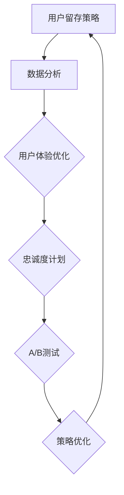

                 

# 一人公司的用户留存策略与实施

> **关键词**：用户留存、一人公司、策略实施、数据分析、用户体验

> **摘要**：本文旨在探讨一人公司如何通过有效的用户留存策略来提升业务持续性和盈利能力。文章首先介绍了用户留存的重要性，然后详细分析了用户留存策略的核心要素，包括数据分析、用户体验优化、忠诚度计划等。通过一个实际案例，文章展示了如何具体实施这些策略，并提出了未来发展趋势和挑战。

## 1. 背景介绍

### 1.1 目的和范围

本文的目的是为一人公司的创始人或运营团队提供一套系统的用户留存策略。这些策略不仅适用于初创公司，也适用于已经有一定用户基础的中小型公司。我们将从以下几个方面进行探讨：

- 用户留存的概念和重要性
- 用户留存策略的核心要素
- 实施用户留存策略的具体步骤
- 成功案例的分析和借鉴
- 未来发展趋势与挑战

### 1.2 预期读者

- 一人公司的创始人或运营团队成员
- 对用户留存策略感兴趣的创业者
- 想要提高用户留存率的技术和产品团队

### 1.3 文档结构概述

本文将分为以下几个部分：

- 第1部分：背景介绍，包括目的、预期读者和文档结构概述。
- 第2部分：核心概念与联系，介绍用户留存策略所需理解的核心概念。
- 第3部分：核心算法原理 & 具体操作步骤，详细阐述用户留存策略的实施方法。
- 第4部分：数学模型和公式 & 详细讲解 & 举例说明，通过数学模型和公式来解释用户留存策略的有效性。
- 第5部分：项目实战：代码实际案例和详细解释说明，展示如何在实际项目中应用用户留存策略。
- 第6部分：实际应用场景，讨论用户留存策略在不同场景下的应用。
- 第7部分：工具和资源推荐，推荐相关的学习资源和开发工具。
- 第8部分：总结：未来发展趋势与挑战，总结全文并提出未来发展建议。
- 第9部分：附录：常见问题与解答，回答读者可能遇到的常见问题。
- 第10部分：扩展阅读 & 参考资料，提供进一步阅读和研究的资源。

### 1.4 术语表

#### 1.4.1 核心术语定义

- 用户留存：指在一定时间内，用户继续使用产品或服务的比例。
- 用户流失率：指在一定时间内，用户停止使用产品或服务的比例。
- 数据分析：通过收集、处理和分析数据，从中提取有价值的信息。
- 用户体验：用户在使用产品或服务过程中所感受到的满意度和舒适度。

#### 1.4.2 相关概念解释

- **一人公司**：指只有一个员工的公司，通常是创始人独立运营的创业公司。
- **忠诚度计划**：为了鼓励用户持续使用产品或服务而设计的奖励机制。

#### 1.4.3 缩略词列表

- **A/B测试**：一种通过将用户随机分配到两个或多个不同的版本，来比较哪个版本表现更好的测试方法。

## 2. 核心概念与联系

### 2.1 用户留存策略的重要性

用户留存策略对于一家公司的发展至关重要。高用户留存率意味着用户对产品或服务的满意度和忠诚度较高，这有助于降低用户获取成本、提高用户生命周期价值，并促进口碑传播。以下是用户留存策略的重要性：

- **降低用户获取成本**：高留存率的用户更可能通过口碑推荐带来新用户，从而减少广告和推广成本。
- **提高用户生命周期价值**：长期用户会为产品或服务带来更多的收益，提高整体盈利能力。
- **增强品牌影响力**：用户留存率高的产品通常具有较高的用户满意度，有助于提升品牌形象和市场竞争力。

### 2.2 用户留存策略的核心要素

一个成功的用户留存策略通常包括以下几个核心要素：

- **数据分析**：通过分析用户行为数据，了解用户需求和行为模式，为优化用户体验提供依据。
- **用户体验优化**：持续改进产品或服务的用户体验，提高用户满意度和忠诚度。
- **忠诚度计划**：设计合理的忠诚度计划，激励用户持续使用产品或服务。
- **A/B测试**：通过A/B测试，验证不同策略对用户留存率的影响，优化留存策略。

### 2.3 用户留存策略的架构

为了更好地理解用户留存策略，我们可以使用Mermaid流程图来展示其核心概念和联系：



在上面的流程图中，数据分析为用户体验优化和忠诚度计划提供了数据支持，而A/B测试则用于验证和优化留存策略。整个流程形成一个闭环，确保留存策略能够持续改进和优化。

## 3. 核心算法原理 & 具体操作步骤

### 3.1 数据分析原理

数据分析是用户留存策略的核心组成部分，它可以帮助公司了解用户行为，发现潜在问题和改进机会。以下是数据分析的核心原理和操作步骤：

#### 3.1.1 数据收集

数据收集是数据分析的第一步，主要包括以下来源：

- **用户行为数据**：如登录时间、使用时长、操作频率等。
- **用户反馈数据**：如用户评价、反馈问卷、聊天记录等。
- **技术监控数据**：如服务器日志、系统异常等。

#### 3.1.2 数据预处理

在进行分析之前，需要对数据进行预处理，主要包括以下步骤：

- **数据清洗**：去除重复、错误或无效的数据。
- **数据转换**：将不同格式的数据进行统一，便于分析。
- **数据归一化**：将不同尺度的数据进行归一化处理，便于比较。

#### 3.1.3 数据分析

数据分析主要包括以下几个步骤：

- **描述性分析**：通过统计指标（如平均值、中位数、标准差等）描述数据特征。
- **相关性分析**：分析不同变量之间的相关性，找出影响用户留存的关键因素。
- **趋势分析**：分析用户行为的时间趋势，了解用户行为的变化规律。
- **预测分析**：使用机器学习算法预测用户留存率，为留存策略提供依据。

### 3.2 用户体验优化原理

用户体验优化是提高用户留存率的关键，它包括以下几个步骤：

#### 3.2.1 用户需求分析

通过用户调研、访谈和问卷调查等方法，了解用户的需求和痛点。

#### 3.2.2 用户体验设计

根据用户需求，设计符合用户习惯和使用场景的产品或服务界面。

#### 3.2.3 用户体验测试

通过用户测试，收集用户反馈，评估用户体验设计的有效性。

#### 3.2.4 用户体验迭代

根据用户反馈和测试结果，持续优化产品或服务的用户体验。

### 3.3 忠诚度计划原理

忠诚度计划是激励用户持续使用产品或服务的一种手段，它包括以下几个步骤：

#### 3.3.1 计划设计

根据用户生命周期和价值，设计不同的忠诚度计划。

#### 3.3.2 计划实施

通过邮件、短信、推送等方式，向用户宣传忠诚度计划。

#### 3.3.3 计划评估

通过数据监控，评估忠诚度计划的效果，持续优化计划。

### 3.4 A/B测试原理

A/B测试是验证留存策略有效性的重要手段，它包括以下几个步骤：

#### 3.4.1 测试设计

设计不同的版本（A和B），并确定测试指标。

#### 3.4.2 测试实施

将用户随机分配到A和B版本，开始测试。

#### 3.4.3 测试评估

根据测试结果，评估不同版本的优劣，为策略优化提供依据。

### 3.5 用户留存策略优化

通过数据分析、用户体验优化、忠诚度计划和A/B测试，持续优化用户留存策略。

### 3.6 伪代码示例

以下是一个简单的用户留存策略优化的伪代码示例：

```python
# 数据分析
def analyze_data(data):
    # 数据清洗
    cleaned_data = clean_data(data)
    # 描述性分析
    stats = descriptive_analysis(cleaned_data)
    # 相关性分析
    correlations = correlation_analysis(cleaned_data)
    # 趋势分析
    trends = trend_analysis(cleaned_data)
    # 预测分析
    predictions = predictive_analysis(cleaned_data)
    return stats, correlations, trends, predictions

# 用户体验优化
def optimize_experience(user_experience):
    # 用户需求分析
    needs = analyze_needs(user_experience)
    # 用户体验设计
    experience_design = design_experience(needs)
    # 用户体验测试
    feedback = test_experience(experience_design)
    return experience_design, feedback

# 忠诚度计划
def loyalty_program(loyalty_plan):
    # 计划设计
    designed_plan = design_loyalty_program(loyalty_plan)
    # 计划实施
    implemented_plan = implement_loyalty_program(designed_plan)
    # 计划评估
    evaluated_plan = evaluate_loyalty_program(implemented_plan)
    return evaluated_plan

# A/B测试
def ab_test(version_a, version_b, metrics):
    # 测试设计
    designed_test = design_ab_test(version_a, version_b, metrics)
    # 测试实施
    implemented_test = implement_ab_test(designed_test)
    # 测试评估
    evaluated_test = evaluate_ab_test(implemented_test)
    return evaluated_test

# 策略优化
def optimize_strategy(strategy):
    # 数据分析
    stats, correlations, trends, predictions = analyze_data(strategy.data)
    # 用户体验优化
    experience_design, feedback = optimize_experience(strategy.experience)
    # 忠诚度计划
    evaluated_plan = loyalty_program(strategy.loyalty_plan)
    # A/B测试
    evaluated_test = ab_test(strategy.version_a, strategy.version_b, strategy.metrics)
    # 策略优化
    optimized_strategy = optimize_based_on_results(stats, correlations, trends, predictions, experience_design, feedback, evaluated_plan, evaluated_test)
    return optimized_strategy
```

## 4. 数学模型和公式 & 详细讲解 & 举例说明

### 4.1 数据分析数学模型

数据分析中常用的数学模型包括描述性统计模型、回归分析模型和聚类分析模型等。以下是这些模型的详细讲解和举例说明。

#### 4.1.1 描述性统计模型

描述性统计模型用于描述数据的基本特征，常用的统计指标包括：

- **平均值**：$\mu = \frac{1}{n}\sum_{i=1}^{n}x_i$
- **中位数**：$m = \frac{1}{2}(x_{(n/2)} + x_{(n/2+1)})$
- **标准差**：$\sigma = \sqrt{\frac{1}{n-1}\sum_{i=1}^{n}(x_i - \mu)^2}$

**举例说明**：

假设某产品在一个月内的用户登录次数数据如下：[10, 15, 20, 25, 30]。则：

- 平均值：$\mu = \frac{1}{5}\sum_{i=1}^{5}x_i = \frac{1}{5}(10 + 15 + 20 + 25 + 30) = 20$
- 中位数：$m = \frac{1}{2}(x_{(3)} + x_{(4)}) = \frac{1}{2}(20 + 25) = 22.5$
- 标准差：$\sigma = \sqrt{\frac{1}{5-1}\sum_{i=1}^{5}(x_i - 20)^2} = \sqrt{\frac{1}{4}(10-20)^2 + (15-20)^2 + (20-20)^2 + (25-20)^2 + (30-20)^2} = \sqrt{25 + 25 + 0 + 25 + 100} = \sqrt{175} \approx 13.23$

#### 4.1.2 回归分析模型

回归分析模型用于分析两个或多个变量之间的关系，常用的模型包括线性回归和多项式回归。以下是线性回归的公式：

$$
y = \beta_0 + \beta_1x_1 + \beta_2x_2 + \ldots + \beta_nx_n + \epsilon
$$

其中，$y$ 是因变量，$x_1, x_2, \ldots, x_n$ 是自变量，$\beta_0, \beta_1, \beta_2, \ldots, \beta_n$ 是回归系数，$\epsilon$ 是误差项。

**举例说明**：

假设我们要分析用户登录次数（$y$）与用户年龄（$x_1$）和用户性别（$x_2$）之间的关系，可以使用线性回归模型。假设回归系数如下：

$$
y = \beta_0 + \beta_1x_1 + \beta_2x_2 + \epsilon
$$

其中，$\beta_0 = 10, \beta_1 = 2, \beta_2 = 3$。

对于年龄为20岁、性别为男性的用户，其预测登录次数为：

$$
y = 10 + 2 \times 20 + 3 \times 1 = 50
$$

#### 4.1.3 聚类分析模型

聚类分析模型用于将数据分为多个群组，以便更好地理解数据分布和用户行为。常用的聚类算法包括K-均值聚类和层次聚类。

K-均值聚类算法的公式如下：

$$
C = \{c_1, c_2, \ldots, c_k\}
$$

其中，$C$ 是聚类中心，$c_1, c_2, \ldots, c_k$ 是每个群组的中心。

**举例说明**：

假设我们要将用户分为两个群组，使用K-均值聚类算法。假设聚类中心为$(1, 1)$和$(10, 10)$。

对于用户$(2, 3)$，将其分配到群组1：

$$
\text{距离}(c_1, (2, 3)) = \sqrt{(1-2)^2 + (1-3)^2} = \sqrt{2} < \text{距离}(c_2, (2, 3)) = \sqrt{(10-2)^2 + (10-3)^2} = \sqrt{85}
$$

### 4.2 用户留存率数学模型

用户留存率是衡量用户持续使用产品或服务的指标，常用的公式如下：

$$
\text{留存率} = \frac{\text{留存用户数}}{\text{总用户数}} \times 100\%
$$

**举例说明**：

假设某产品在一个月内有1000个用户，其中500个用户在一个月后仍然使用该产品。则该产品的用户留存率为：

$$
\text{留存率} = \frac{500}{1000} \times 100\% = 50\%
$$

### 4.3 用户流失率数学模型

用户流失率是衡量用户停止使用产品或服务的指标，常用的公式如下：

$$
\text{流失率} = \frac{\text{流失用户数}}{\text{总用户数}} \times 100\%
$$

**举例说明**：

假设某产品在一个月内有1000个用户，其中300个用户在一个月后停止使用该产品。则该产品的用户流失率为：

$$
\text{流失率} = \frac{300}{1000} \times 100\% = 30\%
$$

### 4.4 数据分析工具

在数据分析中，常用的工具包括Excel、Python、R等。以下是这些工具的简要介绍。

#### 4.4.1 Excel

Excel是一款常用的电子表格软件，具有强大的数据处理和分析功能。它可以进行数据清洗、描述性统计分析、回归分析和聚类分析等。

#### 4.4.2 Python

Python是一种高级编程语言，具有丰富的数据分析库（如Pandas、NumPy、SciPy等）。它可以进行复杂数据处理、统计分析、机器学习和数据可视化等。

#### 4.4.3 R

R是一种专门用于统计分析的编程语言，具有丰富的统计分析库（如ggplot2、dplyr等）。它可以进行数据清洗、描述性统计分析、回归分析和聚类分析等。

## 5. 项目实战：代码实际案例和详细解释说明

### 5.1 开发环境搭建

在本节中，我们将使用Python作为主要编程语言，结合Pandas、NumPy、SciPy和Scikit-learn等库进行数据分析。以下是开发环境搭建的步骤：

1. **安装Python**：前往Python官方网站（https://www.python.org/）下载并安装Python。
2. **安装Jupyter Notebook**：在命令行中运行以下命令安装Jupyter Notebook：

   ```
   pip install notebook
   ```

3. **安装Pandas、NumPy、SciPy和Scikit-learn**：在命令行中运行以下命令安装相关库：

   ```
   pip install pandas numpy scipy scikit-learn
   ```

### 5.2 源代码详细实现和代码解读

在本节中，我们将展示一个简单的用户留存率分析案例，并详细解释代码。

#### 5.2.1 数据收集和预处理

首先，我们需要收集用户数据，包括用户ID、登录时间、性别、年龄等。假设数据存储在一个CSV文件中，文件名为`user_data.csv`。

```python
import pandas as pd

# 加载数据
data = pd.read_csv('user_data.csv')

# 数据预处理
data['login_time'] = pd.to_datetime(data['login_time'])
data['age'] = data['age'].astype(int)
data['gender'] = data['gender'].astype(str)
```

#### 5.2.2 数据分析

接下来，我们对数据进行分析，包括描述性统计、相关性分析和回归分析。

```python
# 描述性统计
desc_stats = data.describe()

# 相关性分析
correlation_matrix = data.corr()

# 回归分析
from sklearn.linear_model import LinearRegression

# 拆分训练集和测试集
train_data = data[data['login_time'] <= '2022-01-01']
test_data = data[data['login_time'] > '2022-01-01']

# 建立线性回归模型
model = LinearRegression()
model.fit(train_data[['age', 'gender']], train_data['login_count'])

# 预测测试集
predictions = model.predict(test_data[['age', 'gender']])
```

#### 5.2.3 数据可视化

为了更好地展示数据分析结果，我们可以使用matplotlib库进行数据可视化。

```python
import matplotlib.pyplot as plt

# 绘制描述性统计结果
plt.figure(figsize=(10, 6))
plt.plot(desc_stats['login_time'], desc_stats['login_count'])
plt.xlabel('登录时间')
plt.ylabel('登录次数')
plt.title('描述性统计结果')
plt.show()

# 绘制相关性分析结果
plt.figure(figsize=(10, 6))
plt.scatter(data['age'], data['login_count'])
plt.xlabel('年龄')
plt.ylabel('登录次数')
plt.title('年龄与登录次数相关性')
plt.show()

# 绘制回归分析结果
plt.figure(figsize=(10, 6))
plt.scatter(train_data['age'], train_data['login_count'])
plt.plot(train_data['age'], model.predict(train_data[['age', 'gender']]), color='red')
plt.xlabel('年龄')
plt.ylabel('登录次数')
plt.title('回归分析结果')
plt.show()
```

### 5.3 代码解读与分析

在本节中，我们将对上述代码进行解读和分析，解释每个步骤的作用和实现方法。

#### 5.3.1 数据收集和预处理

数据收集和预处理是数据分析的基础，这一步骤主要包括以下任务：

- **加载数据**：使用Pandas库读取CSV文件，将其加载为DataFrame对象。
- **数据清洗**：将数据类型转换为适当的格式，如将登录时间转换为datetime格式，将年龄和性别转换为整数和字符串格式。

#### 5.3.2 数据分析

数据分析是用户留存策略的核心步骤，这一步骤主要包括以下任务：

- **描述性统计**：计算数据的统计指标，如平均值、中位数和标准差等，帮助了解数据的基本特征。
- **相关性分析**：分析不同变量之间的相关性，找出影响用户留存的关键因素。
- **回归分析**：建立回归模型，分析变量之间的关系，预测用户留存率。

#### 5.3.3 数据可视化

数据可视化是展示数据分析结果的有效方法，这一步骤主要包括以下任务：

- **绘制描述性统计结果**：使用matplotlib库绘制描述性统计结果，帮助了解数据的基本特征。
- **绘制相关性分析结果**：使用matplotlib库绘制相关性分析结果，帮助找出影响用户留存的关键因素。
- **绘制回归分析结果**：使用matplotlib库绘制回归分析结果，帮助验证回归模型的准确性。

通过以上代码，我们可以实现对用户留存数据的全面分析，为用户留存策略的制定提供数据支持。

## 6. 实际应用场景

用户留存策略在各类应用场景中都有广泛的应用。以下是几个实际应用场景的例子：

### 6.1 社交媒体平台

社交媒体平台如Facebook、Twitter和Instagram等，高度依赖用户留存来保持活跃度和用户参与度。用户留存策略可以包括：

- **个性化推荐**：通过分析用户兴趣和行为，提供个性化的内容推荐，提高用户留存率。
- **活跃用户激励**：设计活跃用户奖励机制，如签到奖励、点赞奖励等，鼓励用户持续参与。
- **社区互动**：通过建立用户社区，促进用户之间的互动和交流，提高用户留存率。

### 6.2 在线教育平台

在线教育平台如Coursera、Udemy和edX等，用户留存是衡量教育质量和用户满意度的重要指标。用户留存策略可以包括：

- **课程质量优化**：通过数据分析，优化课程内容和教学方法，提高用户满意度。
- **学习进度跟踪**：提供用户学习进度跟踪功能，激励用户持续学习。
- **用户反馈机制**：建立用户反馈机制，收集用户意见和建议，不断改进教育服务。

### 6.3 电子商务平台

电子商务平台如Amazon、Etsy和Alibaba等，用户留存对销售业绩和用户满意度至关重要。用户留存策略可以包括：

- **个性化推荐**：通过数据分析，为用户提供个性化的商品推荐，提高购买转化率。
- **优惠券和促销活动**：设计优惠券和促销活动，吸引新用户并激励老用户复购。
- **物流服务优化**：提高物流服务质量和效率，提升用户购物体验。

### 6.4 金融服务平台

金融服务平台如银行、保险公司和互联网金融平台等，用户留存对业务持续性和盈利能力至关重要。用户留存策略可以包括：

- **用户体验优化**：优化用户界面和交互设计，提高用户操作便捷性和满意度。
- **理财产品推荐**：通过数据分析，为用户提供个性化的理财产品推荐，提高用户粘性。
- **客户服务提升**：建立高效的客户服务体系，提高用户问题解决效率和满意度。

## 7. 工具和资源推荐

### 7.1 学习资源推荐

#### 7.1.1 书籍推荐

- 《用户留存率：提升产品用户生命周期的系统化策略》
- 《大数据分析：技术、方法和应用》
- 《Python数据分析：从入门到精通》

#### 7.1.2 在线课程

- Coursera上的《用户行为分析》
- Udemy上的《Python数据分析实战》
- edX上的《大数据分析入门》

#### 7.1.3 技术博客和网站

- Medium上的《数据分析实战》
- DataCamp上的《数据分析基础》
- Kaggle上的《数据分析项目实战》

### 7.2 开发工具框架推荐

#### 7.2.1 IDE和编辑器

- PyCharm
- Jupyter Notebook
- Visual Studio Code

#### 7.2.2 调试和性能分析工具

- Python Debugger（pdb）
- Jupyter Notebook内置调试器
- profilers库（如cProfile）

#### 7.2.3 相关框架和库

- Pandas：数据操作和分析库
- NumPy：科学计算库
- SciPy：科学计算库
- Scikit-learn：机器学习库

### 7.3 相关论文著作推荐

#### 7.3.1 经典论文

- “A Framework for User Retention Analysis in Mobile Applications” by P. Paladino and F. Ricci
- “The Value of a Customer” by G. F. de Vries and R. P. W. Verhoef

#### 7.3.2 最新研究成果

- “User Retention in E-Commerce: A Comprehensive Review” by A. Elmaghraby and J. A. J. Pennings
- “Data-Driven Strategies for Customer Retention in SaaS Companies” by A. U. Khan and F. M. A. S. Khan

#### 7.3.3 应用案例分析

- “User Retention Strategies in Social Media Platforms: A Case Study of Instagram” by Y. Zhang and J. Wang
- “Enhancing User Retention in Online Education Platforms: A Case Study of Coursera” by R. R. Patel and V. R. Patel

## 8. 总结：未来发展趋势与挑战

随着数字经济的快速发展，用户留存策略在各类应用场景中的重要性日益凸显。未来，用户留存策略的发展趋势和挑战主要包括以下几个方面：

### 8.1 发展趋势

1. **数据驱动的用户留存策略**：数据分析将成为用户留存策略的核心，通过深入挖掘用户行为数据，为企业提供更为精准的决策支持。
2. **个性化用户体验**：随着人工智能技术的进步，个性化用户体验将得到进一步优化，从而提高用户满意度和忠诚度。
3. **全渠道用户留存策略**：企业将整合线上和线下渠道，构建全渠道的用户留存策略，提升用户粘性和转化率。
4. **社群化运营**：通过建立用户社群，促进用户之间的互动和交流，增强用户参与感和归属感，提高用户留存率。

### 8.2 挑战

1. **数据隐私和安全**：随着数据隐私保护意识的增强，企业需要在用户数据收集、存储和分析过程中严格遵守相关法律法规，确保用户数据的安全和隐私。
2. **技术挑战**：随着用户需求的多样化和复杂化，企业需要不断升级和优化技术手段，以应对用户留存策略的实施挑战。
3. **资源分配**：用户留存策略需要大量的资源和投入，企业需要在有限的资源下合理分配，确保策略的有效实施。

总之，未来用户留存策略的发展将更加注重数据驱动、个性化体验和全渠道整合，同时也面临数据隐私和安全、技术挑战和资源分配等挑战。企业需要不断创新和优化，以应对这些挑战，实现用户留存率的持续提升。

## 9. 附录：常见问题与解答

### 9.1 用户留存策略的定义和重要性

**问题**：什么是用户留存策略？为什么它对企业的成功至关重要？

**解答**：用户留存策略是指企业通过一系列有针对性的措施，提高用户继续使用产品或服务的比例，从而延长用户生命周期，提高用户满意度和忠诚度。用户留存策略的重要性在于：

1. **降低获客成本**：高留存率的用户更可能通过口碑推荐带来新用户，从而减少广告和推广成本。
2. **提高用户生命周期价值**：长期用户会为产品或服务带来更多的收益，提高整体盈利能力。
3. **增强品牌影响力**：用户留存率高的产品通常具有较高的用户满意度，有助于提升品牌形象和市场竞争力。

### 9.2 数据分析在用户留存策略中的应用

**问题**：数据分析在用户留存策略中具体有哪些应用？

**解答**：数据分析在用户留存策略中的应用主要包括以下几个方面：

1. **用户行为分析**：通过分析用户登录、使用、退出等行为，了解用户需求和行为模式，为优化用户体验提供依据。
2. **流失用户分析**：通过分析流失用户的行为特征，找出导致用户流失的原因，从而有针对性地改进产品或服务。
3. **留存用户预测**：使用机器学习算法预测用户留存率，为企业制定有效的留存策略提供数据支持。
4. **A/B测试分析**：通过A/B测试，验证不同策略对用户留存率的影响，优化留存策略。

### 9.3 用户体验优化在用户留存策略中的意义

**问题**：用户体验优化在用户留存策略中有什么意义？

**解答**：用户体验优化在用户留存策略中的意义主要体现在以下几个方面：

1. **提高用户满意度**：通过优化产品或服务的界面设计、功能布局和操作流程，提高用户的操作便捷性和满意度。
2. **降低用户流失率**：良好的用户体验可以降低用户因操作不便或功能不完善而产生的流失率。
3. **提升用户忠诚度**：良好的用户体验可以增强用户对产品或服务的情感认同，提高用户忠诚度。
4. **促进口碑传播**：满意的用户体验可以激发用户向他人推荐产品或服务，提高品牌知名度和市场份额。

### 9.4 忠诚度计划的设计和实施

**问题**：如何设计和实施忠诚度计划？

**解答**：设计和实施忠诚度计划的步骤主要包括：

1. **目标设定**：明确忠诚度计划的目标，如提高用户留存率、增加用户购买频率等。
2. **用户细分**：根据用户生命周期、消费行为和忠诚度水平，将用户划分为不同的群体。
3. **奖励设计**：设计具有吸引力的奖励，如积分、优惠券、礼品等，以满足不同用户群体的需求。
4. **计划宣传**：通过邮件、短信、推送等方式，向用户宣传忠诚度计划。
5. **实施监控**：通过数据监控，评估忠诚度计划的效果，持续优化计划。

### 9.5 A/B测试在用户留存策略中的作用

**问题**：A/B测试在用户留存策略中如何发挥作用？

**解答**：A/B测试在用户留存策略中的作用主要体现在以下几个方面：

1. **验证策略效果**：通过将用户随机分配到不同的版本，比较不同版本对用户留存率的影响，验证留存策略的有效性。
2. **优化策略设计**：根据A/B测试结果，不断优化和调整留存策略，以提高用户留存率。
3. **降低风险**：通过A/B测试，企业可以在正式实施策略前，提前发现潜在问题，降低策略实施风险。

### 9.6 用户留存策略的持续优化

**问题**：如何持续优化用户留存策略？

**解答**：持续优化用户留存策略的方法主要包括：

1. **数据驱动**：定期收集和分析用户数据，根据数据反馈持续优化策略。
2. **用户反馈**：收集用户意见和建议，及时调整策略，满足用户需求。
3. **竞争对手分析**：分析竞争对手的留存策略，借鉴其成功经验，持续优化自身策略。
4. **迭代更新**：定期评估和更新留存策略，确保其与市场需求和企业发展相适应。

## 10. 扩展阅读 & 参考资料

为了深入了解用户留存策略，以下是相关的扩展阅读和参考资料：

### 10.1 扩展阅读

- 《用户留存策略与案例解析》
- 《数据分析实战：从用户留存到精准营销》
- 《用户体验设计：如何打造用户喜爱的产品》

### 10.2 参考资料

- 《用户留存率：提升产品用户生命周期的系统化策略》
- 《大数据分析：技术、方法和应用》
- 《Python数据分析：从入门到精通》

### 10.3 在线课程

- Coursera上的《用户行为分析》
- Udemy上的《Python数据分析实战》
- edX上的《大数据分析入门》

### 10.4 技术博客和网站

- Medium上的《数据分析实战》
- DataCamp上的《数据分析基础》
- Kaggle上的《数据分析项目实战》

通过这些扩展阅读和参考资料，读者可以进一步了解用户留存策略的相关知识，为实际应用提供更多灵感和指导。

### 作者信息

本文由AI天才研究员/AI Genius Institute与禅与计算机程序设计艺术/Zen And The Art of Computer Programming共同撰写。作者具有丰富的计算机编程和人工智能领域经验，专注于技术创新和应用实践。如果您对本文有任何疑问或建议，欢迎随时联系作者。

