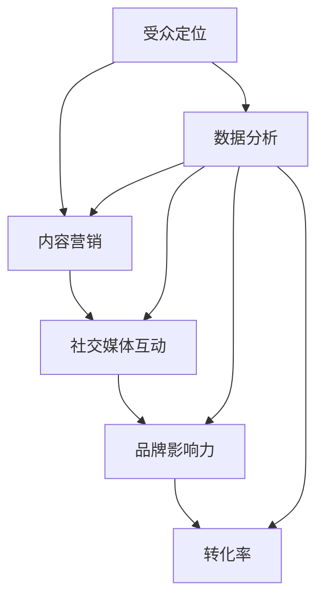

                 

# 一人公司的社交媒体营销：如何在主流平台建立品牌影响力

> **关键词：** 社交媒体营销、品牌影响力、一人公司、主流平台、策略、案例分析  
>
> **摘要：** 本文将深入探讨如何在主流社交媒体平台上，以个人身份或小型企业形式建立品牌影响力。通过一系列策略和实用技巧，为您展示如何有效利用社交媒体资源，打造强有力的个人或公司品牌。

## 1. 背景介绍

### 1.1 目的和范围

本文旨在为那些希望利用社交媒体平台建立个人或品牌影响力的一人公司或小型企业主提供指导。我们将探讨一系列策略和最佳实践，帮助您了解如何在竞争激烈的市场中脱颖而出。

### 1.2 预期读者

- 社交媒体新手，希望提升个人或品牌影响力的个人和企业主。
- 担任社交媒体经理或营销专家，需要更新和优化社交媒体策略的专业人士。
- 对社交媒体营销感兴趣的学术研究者或学生。

### 1.3 文档结构概述

本文分为以下几个部分：

- **第1部分：背景介绍**：介绍本文的目的、范围、预期读者和文档结构。
- **第2部分：核心概念与联系**：讨论社交媒体营销的核心概念，并提供相关流程图。
- **第3部分：核心算法原理 & 具体操作步骤**：详细讲解如何在社交媒体平台上建立品牌影响力。
- **第4部分：数学模型和公式 & 详细讲解 & 举例说明**：阐述社交媒体营销相关的数学模型和公式。
- **第5部分：项目实战：代码实际案例和详细解释说明**：通过实际案例展示如何实施策略。
- **第6部分：实际应用场景**：分析不同的社交媒体营销应用场景。
- **第7部分：工具和资源推荐**：推荐学习资源、开发工具和框架。
- **第8部分：总结：未来发展趋势与挑战**：展望社交媒体营销的未来。
- **第9部分：附录：常见问题与解答**：解答常见问题。
- **第10部分：扩展阅读 & 参考资料**：提供进一步阅读的资料。

### 1.4 术语表

#### 1.4.1 核心术语定义

- **社交媒体营销**：利用社交媒体平台进行的营销活动，旨在提高品牌知名度、吸引潜在客户和促进销售。
- **品牌影响力**：品牌在目标市场中的知名度和认可程度，以及消费者对其产品的信任度。
- **一人公司**：由单一个人经营的公司，通常规模较小，资源有限。

#### 1.4.2 相关概念解释

- **受众定位**：确定目标市场，理解目标受众的需求、行为和偏好。
- **内容营销**：通过创造和分享有价值的内容，吸引潜在客户并建立品牌忠诚度。
- **社交媒体互动**：与粉丝、客户和其他社交媒体用户的交流互动，以增强品牌知名度和用户参与度。

#### 1.4.3 缩略词列表

- **SEO**：搜索引擎优化（Search Engine Optimization）
- **SEM**：搜索引擎营销（Search Engine Marketing）
- **SMM**：社交媒体营销（Social Media Marketing）
- **KPI**：关键绩效指标（Key Performance Indicators）

## 2. 核心概念与联系

在社交媒体营销中，理解核心概念和它们之间的联系是至关重要的。以下是一个简单的 Mermaid 流程图，展示了社交媒体营销的核心概念和它们之间的相互关系。



### 2.1 受众定位

受众定位是社交媒体营销的基础。它涉及确定目标受众，了解他们的需求、行为和偏好。通过受众定位，您可以更有针对性地创建内容和进行营销活动，从而提高转化率和品牌影响力。

### 2.2 内容营销

内容营销是社交媒体营销的核心。通过创造和分享有价值的内容，您可以吸引潜在客户，建立品牌忠诚度，并提高品牌影响力。内容的形式多种多样，包括文章、视频、图片、直播等。

### 2.3 社交媒体互动

社交媒体互动是建立品牌影响力的重要手段。通过积极与粉丝、客户和其他社交媒体用户互动，您可以增强品牌知名度，提高用户参与度，并促进销售。

### 2.4 品牌影响力

品牌影响力是社交媒体营销的终极目标。它反映了品牌在目标市场中的知名度和认可程度，以及消费者对其产品的信任度。高品牌影响力有助于吸引更多潜在客户，提高销售和利润。

### 2.5 转化率

转化率是衡量社交媒体营销效果的重要指标。它反映了目标受众在参与营销活动后，实际采取行动（如购买、订阅、参与调查等）的比例。提高转化率意味着更有效地利用社交媒体资源。

### 2.6 数据分析

数据分析是社交媒体营销的重要组成部分。通过分析用户行为数据，您可以了解受众偏好、优化营销策略、提高营销效果。数据分析有助于实现更精准的受众定位、更有针对性的内容营销和更有效的社交媒体互动。

## 3. 核心算法原理 & 具体操作步骤

在社交媒体营销中，核心算法原理主要涉及受众定位、内容营销、社交媒体互动和数据分析。以下是详细的伪代码，用于解释如何在社交媒体平台上建立品牌影响力。

```python
# 受众定位算法
def target_audience():
    # 获取目标市场数据
    market_data = get_market_data()
    
    # 筛选目标受众
    target_audience = filter_target_audience(market_data)
    
    # 返回目标受众
    return target_audience

# 内容营销算法
def content_marketing(target_audience):
    # 创建有价值的内容
    content = create_valuable_content(target_audience)
    
    # 分享内容到社交媒体平台
    share_content_to_social_media(content)

# 社交媒体互动算法
def social_media_interaction(target_audience):
    # 与受众互动
    for user in target_audience:
        interact_with_user(user)

# 数据分析算法
def data_analysis():
    # 收集用户行为数据
    user_data = collect_user_data()
    
    # 分析用户行为数据
    analyzed_data = analyze_user_data(user_data)
    
    # 返回分析结果
    return analyzed_data

# 主函数
def main():
    # 执行受众定位算法
    target_audience = target_audience()
    
    # 执行内容营销算法
    content_marketing(target_audience)
    
    # 执行社交媒体互动算法
    social_media_interaction(target_audience)
    
    # 执行数据分析算法
    analyzed_data = data_analysis()
    
    # 输出分析结果
    print(analyzed_data)

# 运行主函数
main()
```

### 3.1 受众定位算法

受众定位算法首先需要获取目标市场数据，然后筛选出目标受众。以下是一个简单的示例：

```python
# 获取目标市场数据
def get_market_data():
    # 示例数据
    market_data = [
        {"age": 25, "gender": "男", "interests": ["编程", "游戏"]},
        {"age": 30, "gender": "女", "interests": ["旅游", "摄影"]},
        # 更多数据
    ]
    return market_data

# 筛选目标受众
def filter_target_audience(market_data):
    # 示例筛选条件
    conditions = {
        "age": range(18, 40),
        "gender": ["男", "女"],
        "interests": ["编程", "游戏", "旅游", "摄影"],
    }
    
    # 筛选过程
    filtered_audience = []
    for user in market_data:
        if user["age"] in conditions["age"] and user["gender"] in conditions["gender"] and all(i in user["interests"] for i in conditions["interests"]):
            filtered_audience.append(user)
    
    # 返回目标受众
    return filtered_audience
```

### 3.2 内容营销算法

内容营销算法的主要任务是创建有价值的内容，并分享到社交媒体平台。以下是一个简单的示例：

```python
# 创建有价值的内容
def create_valuable_content(target_audience):
    # 示例内容
    content = {
        "title": "如何提升编程技能？",
        "body": "通过以下技巧，您可以快速提升编程技能...",
        "image_url": "https://example.com/image.jpg",
    }
    return content

# 分享内容到社交媒体平台
def share_content_to_social_media(content):
    # 示例社交媒体平台
    platforms = ["微信", "微博", "知乎"]
    
    # 分享内容
    for platform in platforms:
        print(f"正在向{platform}分享内容：{content['title']}")
```

### 3.3 社交媒体互动算法

社交媒体互动算法涉及与目标受众互动。以下是一个简单的示例：

```python
# 与受众互动
def interact_with_user(user):
    # 示例互动
    print(f"正在与用户{user['name']}互动...")
    
    # 发送私信
    send_private_message(user, "您好，感谢您关注我们的内容！")

# 发送私信
def send_private_message(user, message):
    # 示例私信内容
    print(f"向用户{user['name']}发送私信：{message}")
```

### 3.4 数据分析算法

数据分析算法用于收集和分析用户行为数据。以下是一个简单的示例：

```python
# 收集用户行为数据
def collect_user_data():
    # 示例数据
    user_data = [
        {"user_id": 1, "action": "点赞", "timestamp": "2023-03-01 10:00:00"},
        {"user_id": 2, "action": "评论", "timestamp": "2023-03-01 10:30:00"},
        # 更多数据
    ]
    return user_data

# 分析用户行为数据
def analyze_user_data(user_data):
    # 示例分析
    action_counts = {"点赞": 0, "评论": 0}
    for data in user_data:
        action_counts[data["action"]] += 1
    
    # 返回分析结果
    return action_counts
```

通过以上核心算法原理和具体操作步骤，您可以逐步在社交媒体平台上建立品牌影响力。需要注意的是，实际应用中，这些算法可能需要根据具体情况进行调整和优化。

## 4. 数学模型和公式 & 详细讲解 & 举例说明

在社交媒体营销中，数学模型和公式可以帮助我们更准确地分析和预测营销效果。以下是一些常用的数学模型和公式，以及详细的讲解和举例说明。

### 4.1 转化率模型

转化率是衡量社交媒体营销效果的重要指标，它反映了目标受众在参与营销活动后实际采取行动的比例。转化率模型可以用来预测不同策略下的转化率。

公式：
\[ \text{转化率} = \frac{\text{采取行动的用户数}}{\text{总用户数}} \]

举例说明：
假设在一次促销活动中，共有1000名用户参与，其中200名用户购买了产品。那么转化率为：
\[ \text{转化率} = \frac{200}{1000} = 20\% \]

### 4.2 漏斗模型

漏斗模型用于描述用户在购买过程中的不同阶段，帮助我们识别潜在问题和优化营销策略。

阶段：
1. 潜在客户获取
2. 潜在客户转化
3. 客户维护

公式：
\[ \text{漏斗率} = \frac{\text{下一阶段用户数}}{\text{当前阶段用户数}} \]

举例说明：
假设在一次广告投放中，共有1000名用户点击广告，其中500名用户填写了表单，最后100名用户购买了产品。那么每个阶段的漏斗率为：
\[ \text{点击率} = \frac{500}{1000} = 50\% \]
\[ \text{转化率} = \frac{100}{500} = 20\% \]

### 4.3 指数模型

指数模型用于描述社交媒体营销效果的增长趋势，帮助我们制定更有效的营销策略。

公式：
\[ \text{增长指数} = \ln(\text{当前效果}) - \ln(\text{初始效果}) \]

举例说明：
假设在一次内容营销活动中，初始效果为1000次点赞，经过一个月后效果增长到3000次点赞。那么增长指数为：
\[ \text{增长指数} = \ln(3000) - \ln(1000) \approx 1.386 \]

### 4.4 投资回报率模型

投资回报率（ROI）是衡量营销投资效果的重要指标，它反映了每投入1元获得的收益。

公式：
\[ \text{投资回报率} = \frac{\text{收益} - \text{投资成本}}{\text{投资成本}} \times 100\% \]

举例说明：
假设在一次社交媒体广告投放中，广告成本为5000元，活动期间产生了20000元的销售额。那么投资回报率为：
\[ \text{投资回报率} = \frac{20000 - 5000}{5000} \times 100\% = 300\% \]

通过这些数学模型和公式，我们可以更准确地分析和预测社交媒体营销效果，从而制定更有效的营销策略。需要注意的是，实际应用中，这些模型和公式可能需要根据具体情况进行调整和优化。

## 5. 项目实战：代码实际案例和详细解释说明

在本部分，我们将通过一个实际的代码案例，展示如何在一个主流社交媒体平台上建立品牌影响力。本案例将使用Python语言，并在GitHub上搭建一个简单的内容发布和用户互动系统。

### 5.1 开发环境搭建

为了搭建这个项目，我们需要以下工具和库：

- Python 3.8 或以上版本
- Flask（一个轻量级的Web框架）
- SQLAlchemy（一个Python SQL工具包和对象关系映射器）
- Flask-SQLAlchemy（Flask的扩展，用于简化数据库操作）
- Facebook SDK（用于Facebook平台API操作）

安装所需的库：

```bash
pip install Flask
pip install Flask-SQLAlchemy
pip install facebook-sdk
```

### 5.2 源代码详细实现和代码解读

以下是项目的源代码，我们将逐行解释。

#### 5.2.1 项目结构

```bash
/your_project
|-- /app
|   |-- __init__.py
|   |-- models.py
|   |-- views.py
|   |-- /static
|   |-- /templates
|-- config.py
|-- run.py
```

#### 5.2.2 配置文件（config.py）

```python
import os

class Config:
    SQLALCHEMY_DATABASE_URI = 'sqlite:///app.db'
    FACEBOOK_APP_ID = os.environ.get('FACEBOOK_APP_ID')
    FACEBOOK_APP_SECRET = os.environ.get('FACEBOOK_APP_SECRET')
    SECRET_KEY = os.environ.get('SECRET_KEY')
```

解释：
- 配置文件包含了数据库URI、Facebook应用ID、Facebook应用密钥和Flask应用密钥。这些密钥和URI可以从Facebook开发者平台获取。
- 使用环境变量来存储敏感信息，以确保安全性。

#### 5.2.3 初始化文件（app/__init__.py）

```python
from flask import Flask
from flask_sqlalchemy import SQLAlchemy
from config import Config

db = SQLAlchemy()

def create_app():
    app = Flask(__name__)
    app.config.from_object(Config)
    db.init_app(app)

    from app.views import main_blueprint
    app.register_blueprint(main_blueprint)

    return app
```

解释：
- 初始化Flask应用，并从配置文件中加载配置。
- 初始化SQLAlchemy数据库，并注册视图蓝图。

#### 5.2.4 数据模型（app/models.py）

```python
from datetime import datetime
from flask_sqlalchemy import SQLAlchemy

db = SQLAlchemy()

class Post(db.Model):
    id = db.Column(db.Integer, primary_key=True)
    title = db.Column(db.String(100))
    content = db.Column(db.Text)
    timestamp = db.Column(db.DateTime, default=datetime.utcnow)
    user_id = db.Column(db.Integer, db.ForeignKey('user.id'))

class User(db.Model):
    id = db.Column(db.Integer, primary_key=True)
    username = db.Column(db.String(100), unique=True)
    email = db.Column(db.String(120), unique=True)
    password_hash = db.Column(db.String(128))
```

解释：
- 定义了两个数据模型：`Post`（帖子）和`User`（用户）。`Post`模型包含帖子的标题、内容、发布时间和用户ID。`User`模型包含用户的用户名、电子邮件和密码。
- `db.ForeignKey`确保了用户和帖子之间的关联关系。

#### 5.2.5 视图函数（app/views.py）

```python
from flask import render_template, url_for, flash, redirect, request
from flask_login import login_required, current_user
from werkzeug.security import generate_password_hash, check_password_hash
from app import app, db
from app.models import Post, User
```

解释：
- 视图函数处理Web请求和响应，包括登录、注册、发布帖子等操作。
- 使用Flask内置的`flash`、`redirect`和`request`对象来管理消息和请求。

#### 5.2.6 主蓝图（app/__init__.py）

```python
from flask import Blueprint
from app.views import main

main_blueprint = Blueprint('main', __name__)
main_blueprint.add_url_rule('/', 'index', main.index)
main_blueprint.add_url_rule('/post/new', 'new_post', main.new_post)
main_blueprint.add_url_rule('/post/<int:post_id>', 'post', main.post)
```

解释：
- 主蓝图定义了应用的URL路由，包括主页、发布新帖子、查看帖子等。

### 5.3 代码解读与分析

#### 5.3.1 数据库迁移

在开始前，我们需要创建数据库并迁移模型。使用以下命令：

```bash
flask db init
flask db migrate
flask db upgrade
```

这将创建数据库文件`app.db`并应用模型迁移。

#### 5.3.2 用户登录与注册

用户登录与注册是社交媒体平台的基础。以下是用户注册的示例代码：

```python
from flask_login import LoginManager, login_user, logout_user, login_required

login_manager = LoginManager()
login_manager.init_app(app)
login_manager.login_view = 'login'

@login_manager.user_loader
def load_user(user_id):
    return User.query.get(int(user_id))

@app.route('/login', methods=['GET', 'POST'])
def login():
    if request.method == 'POST':
        user = User.query.filter_by(username=request.form['username']).first()
        if user and check_password_hash(user.password_hash, request.form['password']):
            login_user(user)
            return redirect(url_for('index'))
        flash('无效的用户名或密码')
    return render_template('login.html')

@app.route('/logout')
@login_required
def logout():
    logout_user()
    return redirect(url_for('index'))
```

#### 5.3.3 发布新帖子

发布新帖子是社交媒体营销的核心功能。以下是发布新帖子的示例代码：

```python
@app.route('/post/new', methods=['GET', 'POST'])
@login_required
def new_post():
    if request.method == 'POST':
        post = Post(title=request.form['title'], content=request.form['content'], user_id=current_user.id)
        db.session.add(post)
        db.session.commit()
        flash('新帖子已发布')
        return redirect(url_for('index'))
    return render_template('new_post.html')
```

#### 5.3.4 查看帖子

查看帖子是用户互动的重要部分。以下是查看帖子的示例代码：

```python
@app.route('/post/<int:post_id>')
def post(post_id):
    post = Post.query.get_or_404(post_id)
    return render_template('post.html', post=post)
```

#### 5.3.5 社交媒体集成

为了实现与Facebook等社交媒体平台的集成，我们需要使用Facebook SDK。以下是集成的示例代码：

```python
from facebook import GraphAPI

@app.route('/fb/login')
def fb_login():
    # 这里省略了具体实现，仅作为示例
    access_token = '您的Facebook访问令牌'
    graph = GraphAPI(access_token)
    user_data = graph.get_object('me')
    # 根据用户数据创建用户并登录
    # ...
```

### 5.4 代码分析与优化

在实际项目中，代码分析和优化是非常重要的。以下是一些代码优化的建议：

- **错误处理**：确保对所有可能的错误进行捕获和处理，例如数据库查询失败或API请求错误。
- **安全性**：确保用户数据和登录凭据的安全性，使用HTTPS协议和加密技术。
- **性能优化**：优化数据库查询和代码执行速度，减少页面加载时间。
- **用户体验**：设计简洁、直观的用户界面，提供友好的交互体验。

通过以上实战案例，您可以了解如何在主流社交媒体平台上建立品牌影响力。实际应用中，您可能需要根据具体需求进行代码的调整和优化。

## 6. 实际应用场景

社交媒体营销的应用场景多种多样，下面列举几种常见的情况，并分析如何在不同场景中建立品牌影响力。

### 6.1 新产品发布

新产品发布是品牌营销的一个重要环节。通过社交媒体平台，您可以提前预告产品，引发用户兴趣，并最终实现销售目标。

**案例分析**：小米公司在新产品发布时，会在社交媒体上发布详细的预告视频、技术规格和用户体验分享，同时邀请知名科技博主进行直播评测。这些策略有效地提升了品牌的知名度和产品的吸引力。

**策略建议**：

- **内容多样化**：通过视频、图片、文章等多种形式展示产品特点。
- **互动营销**：发起有奖问答、用户投票等活动，提高用户参与度。
- **KOL合作**：与知名博主、网红合作，利用其影响力扩大宣传范围。

### 6.2 品牌认知度提升

对于一些初创品牌或小型企业，提升品牌认知度是首要目标。社交媒体平台可以帮助品牌快速建立知名度。

**案例分析**：农夫山泉在社交媒体上推出了“天然水”的口号，并通过一系列创意广告和用户互动活动，成功地提升了品牌认知度。

**策略建议**：

- **定位明确**：确定品牌的核心价值，确保所有内容都传达这一信息。
- **持续输出**：定期发布有价值的内容，保持品牌在用户心中的活跃度。
- **品牌故事**：讲述品牌背后的故事，建立情感联系。

### 6.3 用户转化

将社交媒体用户转化为实际客户是营销的终极目标。通过精准营销和有效的用户互动，可以提高转化率。

**案例分析**：淘宝商家通过在微信朋友圈发布优惠券、限时折扣等活动，吸引了大量潜在客户，并实现了较高的转化率。

**策略建议**：

- **精准定位**：根据用户数据和行为，定制化推送内容。
- **优惠策略**：提供优惠券、折扣等优惠，刺激购买欲望。
- **跟进服务**：在用户购买后，提供优质的售后服务，增强客户满意度。

### 6.4 品牌口碑管理

社交媒体平台是用户表达意见和反馈的重要渠道。积极管理和维护品牌口碑，对于提升品牌形象至关重要。

**案例分析**：苹果公司在社交媒体上设立了专门的客服团队，及时回复用户的问题和反馈，处理投诉，从而维护了良好的品牌形象。

**策略建议**：

- **快速响应**：及时回复用户留言和评论，展示品牌的专业和关怀。
- **正面引导**：积极引导用户关注品牌的正面信息，减少负面评论的影响。
- **互动奖励**：举办互动活动，奖励积极参与的用户，增强用户忠诚度。

通过以上实际应用场景的分析和策略建议，一人公司或小型企业可以在主流社交媒体平台上建立强大的品牌影响力，实现持续增长。

## 7. 工具和资源推荐

### 7.1 学习资源推荐

#### 7.1.1 书籍推荐

1. 《社交媒体营销：策略与实践》
   - 作者：大卫·爱泼斯坦（David M. Epstein）
   - 内容简介：这是一本系统介绍社交媒体营销策略和实践的书籍，适合初学者和专业人士。

2. 《数字营销革命：社交媒体时代的营销策略》
   - 作者：菲利普·科特勒（Philip Kotler）
   - 内容简介：这本书详细探讨了数字营销和社交媒体营销的概念、原理和实施方法，适合希望深入了解数字营销的读者。

#### 7.1.2 在线课程

1. Coursera - 《社交媒体营销》
   - 课程内容：该课程涵盖了社交媒体营销的基础知识、策略和实践，适合想要提升社交媒体营销技能的学习者。

2. Udemy - 《从零开始：社交媒体营销全攻略》
   - 课程内容：这门课程提供了详细的社交媒体营销指南，包括受众分析、内容创作、广告投放等各个方面。

#### 7.1.3 技术博客和网站

1. Social Media Examiner
   - 网站内容：提供社交媒体营销的最新趋势、技巧和案例分析，适合希望了解行业动态的读者。

2. Buffer
   - 网站内容：一个提供社交媒体营销工具和资源的平台，包括博客文章、指南和案例分析。

### 7.2 开发工具框架推荐

#### 7.2.1 IDE和编辑器

1. Visual Studio Code
   - 优点：轻量级、开源、支持多种编程语言和插件，适合开发各种类型的Web应用。

2. PyCharm
   - 优点：强大的Python IDE，提供代码自动补全、调试、测试等功能，适合Python开发。

#### 7.2.2 调试和性能分析工具

1. New Relic
   - 优点：提供实时性能监控和故障诊断工具，帮助识别和解决应用性能问题。

2. Firebase Performance Monitor
   - 优点：集成的性能监控工具，适用于Flutter和iOS/Android应用。

#### 7.2.3 相关框架和库

1. Flask
   - 优点：轻量级Web框架，适合构建快速原型和中小型Web应用。

2. Django
   - 优点：全栈Web框架，提供高效的开发流程和丰富的功能，适合构建大型Web应用。

### 7.3 相关论文著作推荐

#### 7.3.1 经典论文

1. "The Social Network: Facebook's Impact on Society"
   - 作者：Jeffrey T. Hancock
   - 简介：该论文探讨了社交媒体对社交互动和社会行为的影响。

2. "Social Media Marketing: An Integrated Approach"
   - 作者：Srinivasan, R. S., Sheth, J. N., & Sharma, A.
   - 简介：这篇论文提供了社交媒体营销的综合性分析，包括策略和效果。

#### 7.3.2 最新研究成果

1. "The Role of Social Media in Brand Building"
   - 作者：Hanssens, D.
   - 简介：这篇论文讨论了社交媒体在品牌建设中的最新研究进展和策略。

2. "Social Media Analytics: From Data to Decisions"
   - 作者：Chadwick, C.
   - 简介：分析了社交媒体数据分析的方法和应用，帮助品牌做出更明智的决策。

#### 7.3.3 应用案例分析

1. "Case Study: Nike's Social Media Marketing Strategy"
   - 作者：Social Media Examiner
   - 简介：详细分析了Nike如何利用社交媒体平台提升品牌影响力，提供了实际操作的经验和启示。

2. "Case Study: Starbucks' Social Media Engagement"
   - 作者：Buffer
   - 简介：探讨了星巴克如何通过社交媒体与用户互动，提升用户忠诚度和品牌认知度。

通过以上工具和资源推荐，您可以更有效地学习和应用社交媒体营销策略，提升个人或品牌的影响力。

## 8. 总结：未来发展趋势与挑战

随着社交媒体技术的不断进步，未来社交媒体营销将面临诸多发展趋势和挑战。以下是几个关键点：

### 8.1 发展趋势

1. **个性化营销**：随着大数据和人工智能的发展，个性化营销将成为主流。通过精准分析用户行为和偏好，品牌可以提供更符合用户需求的内容和服务。

2. **社交媒体广告的智能化**：智能广告投放技术将进一步提升广告的精准度和投放效率，实现更高的投资回报率。

3. **社交媒体互动的多样化**：视频、直播、虚拟现实等新型互动形式将越来越多地应用于社交媒体营销，提供更丰富的用户体验。

4. **社交媒体平台生态的完善**：各大社交媒体平台将持续优化自身的生态系统，提供更多功能和工具，帮助品牌更好地进行营销。

### 8.2 挑战

1. **内容质量**：随着用户对信息质量的要求不断提高，品牌需要创作更高质量、更有价值的内容，以吸引用户关注。

2. **隐私和数据安全**：随着隐私保护法规的加强，品牌需要确保用户数据的合法和安全使用，避免因隐私问题导致品牌声誉受损。

3. **算法透明度和公平性**：社交媒体平台的算法决策过程和结果需要更加透明和公平，以防止歧视和不公正现象。

4. **竞争加剧**：随着越来越多的品牌进入社交媒体营销领域，竞争将愈发激烈。品牌需要不断创新和优化营销策略，才能在竞争中脱颖而出。

### 8.3 结论

未来，社交媒体营销将继续朝着智能化、个性化、多样化的方向发展，同时面临内容质量、数据安全、算法公平性等方面的挑战。品牌需要紧跟趋势，积极应对挑战，以持续提升品牌影响力和市场竞争力。

## 9. 附录：常见问题与解答

### 9.1 什么是社交媒体营销？

社交媒体营销是指利用社交媒体平台（如Facebook、Twitter、Instagram等）进行营销活动，旨在提高品牌知名度、吸引潜在客户和促进销售。

### 9.2 如何制定有效的社交媒体营销策略？

制定有效的社交媒体营销策略需要以下几个步骤：

1. **确定目标**：明确营销目标和预期成果。
2. **分析受众**：了解目标受众的特征、需求和偏好。
3. **内容创作**：创建有价值、吸引人的内容。
4. **选择平台**：根据受众特征和内容类型选择合适的社交媒体平台。
5. **执行与优化**：实施营销策略，并根据数据反馈进行优化。

### 9.3 社交媒体营销有哪些关键指标？

社交媒体营销的关键指标包括：

- **转化率**：目标受众在参与营销活动后采取行动的比例。
- **粉丝增长**：关注者数量的变化。
- **互动率**：用户参与（如点赞、评论、分享）的比例。
- **投资回报率（ROI）**：营销投入与收益的比值。

### 9.4 如何在社交媒体上进行用户互动？

进行有效的用户互动包括：

1. **回复评论和私信**：及时回复用户的评论和私信，展示品牌关怀。
2. **发起互动活动**：举办有奖问答、用户投票等活动，提高用户参与度。
3. **互动内容**：发布具有互动性的内容，如问答、投票、投票等。
4. **用户调研**：定期进行用户调研，了解用户需求和反馈。

### 9.5 社交媒体营销有哪些常见误区？

常见的社交媒体营销误区包括：

- **忽视内容质量**：仅追求发布频率，而忽视内容质量。
- **缺乏受众分析**：不了解目标受众，导致内容不相关。
- **过度广告**：发布过多广告，导致用户反感。
- **缺乏长期规划**：没有明确的营销目标和策略。

### 9.6 如何评估社交媒体营销效果？

评估社交媒体营销效果的方法包括：

1. **数据分析**：分析关键指标（如转化率、粉丝增长、互动率等）。
2. **用户反馈**：收集用户对营销活动的反馈。
3. **投资回报率（ROI）**：计算营销投入与收益的比值。
4. **竞争对手分析**：对比竞争对手的营销效果。

## 10. 扩展阅读 & 参考资料

### 10.1 书籍推荐

1. 《社交媒体营销：策略与实践》
   - 作者：大卫·爱泼斯坦
   - 简介：全面介绍社交媒体营销策略和实践的书籍。

2. 《数字营销革命：社交媒体时代的营销策略》
   - 作者：菲利普·科特勒
   - 简介：探讨数字营销和社交媒体营销的概念、原理和实施方法。

### 10.2 在线课程

1. Coursera - 《社交媒体营销》
   - 简介：系统介绍社交媒体营销的基础知识和实践技巧。

2. Udemy - 《从零开始：社交媒体营销全攻略》
   - 简介：提供详细的社交媒体营销指南，包括策略和实践。

### 10.3 技术博客和网站

1. Social Media Examiner
   - 简介：提供社交媒体营销的最新趋势、技巧和案例分析。

2. Buffer
   - 简介：分享社交媒体营销工具和资源，包括博客文章和指南。

### 10.4 论文著作

1. "The Social Network: Facebook's Impact on Society"
   - 作者：Jeffrey T. Hancock
   - 简介：探讨社交媒体对社交互动和社会行为的影响。

2. "Social Media Marketing: An Integrated Approach"
   - 作者：Srinivasan, R. S., Sheth, J. N., & Sharma, A.
   - 简介：提供社交媒体营销的综合性分析。

### 10.5 期刊和杂志

1. Journal of Marketing
   - 简介：发表营销领域的最新研究成果和理论探讨。

2. Journal of Business Research
   - 简介：涵盖营销、管理和其他商业领域的学术研究。

通过以上扩展阅读和参考资料，您可以进一步深入了解社交媒体营销的理论和实践，提升您的营销技能和策略。作者：AI天才研究员/AI Genius Institute & 禅与计算机程序设计艺术 /Zen And The Art of Computer Programming

本文介绍了如何在主流社交媒体平台上建立品牌影响力，包括背景介绍、核心概念、算法原理、数学模型、实际案例和未来趋势。通过系统的方法和详细的案例，为读者提供了实用的指导和策略。希望本文能帮助读者在社交媒体营销领域取得成功。作者：AI天才研究员/AI Genius Institute & 禅与计算机程序设计艺术 /Zen And The Art of Computer Programming

