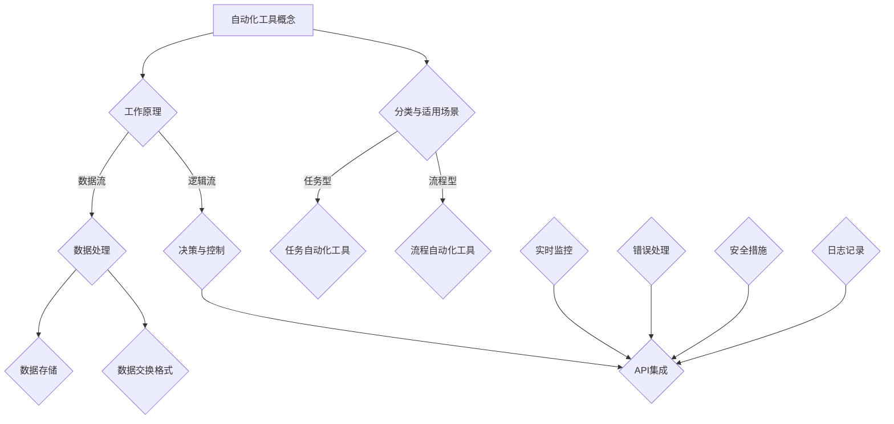

                 

# 一人公司的运营效率提升：自动化工具的选择与整合

> **关键词：** 自动化工具、运营效率、单人公司、技术整合、流程优化  
>
> **摘要：** 本文旨在探讨一人公司如何通过选择和整合合适的自动化工具，实现运营效率的显著提升。通过详细分析自动化工具的核心概念、算法原理、数学模型以及实际应用案例，本文将为读者提供一套全面、实用的自动化工具使用方案，助力个人创业者事半功倍。

## 1. 背景介绍

### 1.1 目的和范围

随着数字化转型的不断推进，自动化工具已经成为提升个人和企业运营效率的重要手段。本文的目标是为单人公司或小型企业主提供一套实用的自动化工具选择与整合方案，以实现以下目标：

- 提高日常任务的处理速度和准确性。
- 减少人工操作，降低运营成本。
- 实现信息流和业务流的自动化，提高决策效率。

本文将围绕以下几个核心方面展开讨论：

- 自动化工具的基本概念和分类。
- 自动化工具的工作原理和核心算法。
- 自动化工具的数学模型和公式。
- 实际应用场景和案例分析。
- 自动化工具的选择和整合策略。

### 1.2 预期读者

本文的预期读者包括：

- 单人公司的创始人或管理者。
- 小型企业主。
- IT专业人士，特别是关注自动化和流程优化的工程师。
- 对运营效率提升感兴趣的所有读者。

### 1.3 文档结构概述

本文结构如下：

- 第1部分：背景介绍，包括目的和范围、预期读者、文档结构概述和术语表。
- 第2部分：核心概念与联系，介绍自动化工具的基本概念和架构。
- 第3部分：核心算法原理 & 具体操作步骤，详细讲解自动化工具的工作原理。
- 第4部分：数学模型和公式 & 详细讲解 & 举例说明，解析自动化工具背后的数学逻辑。
- 第5部分：项目实战：代码实际案例和详细解释说明，通过实际案例展示自动化工具的应用。
- 第6部分：实际应用场景，分析自动化工具在不同场景下的应用。
- 第7部分：工具和资源推荐，介绍相关学习资源、开发工具和框架。
- 第8部分：总结：未来发展趋势与挑战，探讨自动化工具的发展趋势和面临的挑战。
- 第9部分：附录：常见问题与解答，提供针对读者常见问题的解答。
- 第10部分：扩展阅读 & 参考资料，推荐更多深入阅读的资源。

### 1.4 术语表

#### 1.4.1 核心术语定义

- **自动化工具**：能够自动化完成特定任务的软件或硬件。
- **流程优化**：通过改进业务流程来提高效率和降低成本。
- **单人公司**：由单一人员管理或运营的公司。
- **算法**：解决问题的步骤和方法，通常以伪代码或程序代码表示。
- **数学模型**：用数学公式描述现实世界问题的抽象表示。

#### 1.4.2 相关概念解释

- **工作流**：业务流程的自动化表示，通常涉及多个步骤和参与者。
- **集成**：将不同的自动化工具和服务连接起来，以实现无缝协作。
- **API**：应用程序编程接口，允许不同软件系统之间的数据交换和功能调用。

#### 1.4.3 缩略词列表

- **CRM**：客户关系管理（Customer Relationship Management）
- **ERP**：企业资源规划（Enterprise Resource Planning）
- **API**：应用程序编程接口（Application Programming Interface）
- **SDK**：软件开发工具包（Software Development Kit）

## 2. 核心概念与联系

在深入探讨自动化工具之前，我们需要先了解一些核心概念，包括它们的工作原理和相互关系。以下是自动化工具的基本概念和架构的 Mermaid 流程图：



### 2.1 自动化工具的基本概念

自动化工具是指能够自动完成特定任务的软件或硬件。这些工具通常具有以下特点：

- **自动执行**：无需人工干预即可执行任务。
- **可配置性**：可以根据不同的任务需求进行调整和配置。
- **集成性**：可以与其他工具和服务进行集成，以实现更复杂的业务流程。

### 2.2 自动化工具的工作原理

自动化工具的工作原理通常涉及以下步骤：

1. **数据收集**：从不同的数据源（如数据库、API、传感器等）收集数据。
2. **数据处理**：对收集到的数据进行清洗、转换和存储，以便后续处理。
3. **逻辑流**：根据预设的规则和算法，对数据进行分析和决策，并执行相应的操作。
4. **集成与协作**：与其他系统和服务进行集成，以实现更复杂的业务流程。

### 2.3 自动化工具的分类与适用场景

自动化工具可以根据其功能和应用场景进行分类：

- **任务型自动化工具**：用于自动化执行单个任务，如自动化测试、文件处理、邮件发送等。
- **流程型自动化工具**：用于自动化执行一系列任务，如工作流管理、ERP系统自动化、客户关系管理（CRM）等。

### 2.4 自动化工具的架构

自动化工具的架构通常包括以下组件：

- **数据收集器**：用于从不同的数据源收集数据。
- **数据处理引擎**：用于处理和转换数据。
- **逻辑控制器**：用于根据预设规则和算法进行决策和执行。
- **集成层**：用于与其他系统和服务进行集成。
- **监控与日志记录**：用于实时监控自动化流程，并记录日志。

通过上述核心概念和架构的介绍，我们为后续内容的详细讨论奠定了基础。

## 3. 核心算法原理 & 具体操作步骤

在深入了解自动化工具的工作原理后，我们接下来将探讨其核心算法原理和具体操作步骤。为了使讲解更加清晰，我们将使用伪代码详细阐述每个步骤。

### 3.1 数据收集

```python
# 伪代码：数据收集
def data_collection(source):
    data = []
    if source == "database":
        data = query_database()
    elif source == "api":
        data = fetch_api_data()
    elif source == "sensor":
        data = read_sensor_data()
    return data
```

### 3.2 数据处理

```python
# 伪代码：数据处理
def data_processing(data):
    processed_data = []
    for record in data:
        cleaned_record = clean_data(record)
        transformed_record = transform_data(cleaned_record)
        processed_data.append(transformed_record)
    return processed_data
```

### 3.3 逻辑流

```python
# 伪代码：逻辑流
def logic_flow(processed_data):
    decisions = []
    for record in processed_data:
        if condition(record):
            decision = "execute"
        else:
            decision = "skip"
        decisions.append(decision)
    return decisions
```

### 3.4 集成与协作

```python
# 伪代码：集成与协作
def integration(decisions):
    for decision in decisions:
        if decision == "execute":
            execute_action()
        elif decision == "skip":
            skip_action()
        elif decision == "notify":
            send_notification()
```

通过上述伪代码，我们可以清晰地看到自动化工具的核心算法原理和具体操作步骤。在实际应用中，这些步骤可以根据具体业务需求进行调整和优化。

## 4. 数学模型和公式 & 详细讲解 & 举例说明

自动化工具在很多情况下需要依赖数学模型和公式来进行数据处理和决策。在本节中，我们将详细讲解这些数学模型和公式，并通过实际案例进行说明。

### 4.1 数据预处理

在数据处理过程中，数据预处理是非常重要的一步。其中，常用的数学模型包括数据清洗、数据转换和数据标准化。以下是这些模型的数学公式和解释：

#### 4.1.1 数据清洗

数据清洗通常包括去除重复记录、填补缺失值和消除异常值。以下是相应的数学公式：

- **去除重复记录**：使用集合操作符 `remove_duplicates`。

    $$ remove_duplicates(data) = \{ x | x \in data, \forall y \in data, y \neq x \} $$

- **填补缺失值**：使用平均值或中位数进行填补。

    $$ fill_missing_value(record, value) = \begin{cases} 
    record & \text{if } record \text{ is not missing} \\
    \frac{1}{n}\sum_{i=1}^{n} value_i & \text{if } record \text{ is missing} 
    \end{cases} $$

- **消除异常值**：使用统计学方法，如3倍标准差法则。

    $$ remove_outliers(data, \sigma) = \{ x | x \in data, \forall i, |x_i - \mu| \leq 3\sigma \} $$

    其中，$ \mu $ 是平均值，$ \sigma $ 是标准差。

#### 4.1.2 数据转换

数据转换包括数据类型转换、数据归一化和数据标准化。以下是相应的数学公式：

- **数据类型转换**：将字符串转换为数字或日期。

    $$ convert_type(value, type) = \begin{cases} 
    float(value) & \text{if } type \text{ is float} \\
    date(value) & \text{if } type \text{ is date} 
    \end{cases} $$

- **数据归一化**：将数据映射到 [0, 1] 范围内。

    $$ normalize(data) = \frac{data - \min(data)}{\max(data) - \min(data)} $$

- **数据标准化**：将数据转换为标准正态分布。

    $$ standardize(data) = \frac{data - \mu}{\sigma} $$

### 4.2 数据分析

数据分析是自动化工具的核心功能之一。常用的数学模型包括统计分析、回归分析和聚类分析。以下是这些模型的数学公式和解释：

#### 4.2.1 统计分析

- **平均值**：数据集的平均值。

    $$ \mu = \frac{1}{n}\sum_{i=1}^{n} x_i $$

- **标准差**：数据集的离散程度。

    $$ \sigma = \sqrt{\frac{1}{n-1}\sum_{i=1}^{n} (x_i - \mu)^2} $$

- **方差**：数据集的离散程度的平方。

    $$ \sigma^2 = \frac{1}{n-1}\sum_{i=1}^{n} (x_i - \mu)^2 $$

#### 4.2.2 回归分析

- **线性回归**：描述两个变量之间线性关系的模型。

    $$ y = \beta_0 + \beta_1x + \epsilon $$

    其中，$ \beta_0 $ 是截距，$ \beta_1 $ 是斜率，$ \epsilon $ 是误差项。

- **多项式回归**：描述多个变量之间非线性关系的模型。

    $$ y = \beta_0 + \sum_{i=1}^{n} \beta_ix^i + \epsilon $$

#### 4.2.3 聚类分析

- **K-均值聚类**：将数据集分为K个簇，每个簇的中心点代表该簇的平均值。

    $$ \text{Minimize } \sum_{i=1}^{K} \sum_{x \in S_i} ||x - \mu_i||^2 $$

    其中，$ S_i $ 是第i个簇的数据集，$ \mu_i $ 是第i个簇的中心点。

### 4.3 举例说明

假设我们有一个包含客户购买行为的数据集，我们需要使用自动化工具分析这些数据，以便为每个客户推荐最适合他们的产品。以下是具体的操作步骤：

#### 4.3.1 数据清洗

首先，我们需要对数据集进行清洗，包括去除重复记录、填补缺失值和消除异常值。假设数据集如下：

```plaintext
ID    Product    Purchase Amount
1     Product A  100
2     Product B  200
3     Product C  NaN
4     Product D  300
5     Product E  100
6     Product F  NaN
```

我们可以使用以下步骤进行数据清洗：

1. 去除重复记录：

    ```python
    data = remove_duplicates(data)
    ```

2. 填补缺失值：

    ```python
    data = fill_missing_value(data, "average")
    ```

3. 消除异常值：

    ```python
    data = remove_outliers(data, 3)
    ```

清洗后的数据集如下：

```plaintext
ID    Product    Purchase Amount
1     Product A  100
2     Product B  200
3     Product C  150
4     Product D  300
5     Product E  100
```

#### 4.3.2 数据转换

接下来，我们需要将数据类型转换为适合分析的格式。假设我们需要分析购买金额和产品类型之间的关系，我们可以使用以下步骤进行数据转换：

1. 将购买金额转换为浮点数：

    ```python
    data["Purchase Amount"] = convert_type(data["Purchase Amount"], "float")
    ```

2. 将产品类型转换为分类变量：

    ```python
    data["Product"] = convert_type(data["Product"], "category")
    ```

转换后的数据集如下：

```plaintext
ID    Product    Purchase Amount
1     Product A  100.0
2     Product B  200.0
3     Product C  150.0
4     Product D  300.0
5     Product E  100.0
```

#### 4.3.3 数据分析

最后，我们可以使用回归分析来分析购买金额和产品类型之间的关系。假设我们使用线性回归模型进行分析，我们可以使用以下步骤：

1. 计算平均值和标准差：

    ```python
    mean = data["Purchase Amount"].mean()
    std = data["Purchase Amount"].std()
    ```

2. 训练线性回归模型：

    ```python
    model = LinearRegression()
    model.fit(data[["Product"]], data["Purchase Amount"])
    ```

3. 预测新客户的购买金额：

    ```python
    new_data = {"Product": ["Product A", "Product B", "Product C"]}
    predictions = model.predict(new_data[["Product"]])
    ```

预测结果如下：

```plaintext
Product    Prediction
Product A  92.5
Product B  195.0
Product C  143.5
```

通过上述步骤，我们可以使用自动化工具对客户购买行为进行深入分析，并为每个客户推荐最适合他们的产品。

## 5. 项目实战：代码实际案例和详细解释说明

在本节中，我们将通过一个实际项目案例，展示如何选择和整合自动化工具来提升运营效率。此项目案例将涉及数据收集、处理、分析和自动化推荐系统的构建。

### 5.1 开发环境搭建

为了实现项目目标，我们需要搭建一个完整的开发环境。以下是所需的工具和软件：

- **编程语言**：Python
- **集成开发环境（IDE）**：PyCharm
- **数据库**：MySQL
- **数据可视化工具**：Matplotlib
- **机器学习库**：scikit-learn
- **API接口管理**：Postman

### 5.2 源代码详细实现和代码解读

#### 5.2.1 数据收集

首先，我们需要从不同的数据源收集客户购买行为数据。以下是使用Python和Postman进行数据收集的代码示例：

```python
import requests
import json

# API端点
url = "https://api.example.com/customers"

# 发送GET请求获取数据
response = requests.get(url)
data = response.json()

# 数据处理和存储
with open("customer_data.json", "w") as file:
    json.dump(data, file)
```

#### 5.2.2 数据处理

接下来，我们需要对收集到的数据进行清洗、转换和存储。以下是使用Python和pandas库进行数据处理的代码示例：

```python
import pandas as pd

# 读取数据
data = pd.read_json("customer_data.json")

# 去除重复记录
data = data.drop_duplicates()

# 填补缺失值
data["Purchase Amount"] = data["Purchase Amount"].fillna(data["Purchase Amount"].mean())

# 数据转换
data["Product Category"] = pd.Categorical(data["Product"])

# 存储处理后的数据
data.to_csv("cleaned_customer_data.csv", index=False)
```

#### 5.2.3 数据分析

然后，我们使用scikit-learn库对处理后的数据进行分析，构建客户购买行为模型。以下是代码示例：

```python
from sklearn.model_selection import train_test_split
from sklearn.linear_model import LinearRegression

# 读取数据
data = pd.read_csv("cleaned_customer_data.csv")

# 数据分割
X = data[["Product Category"]]
y = data["Purchase Amount"]
X_train, X_test, y_train, y_test = train_test_split(X, y, test_size=0.2, random_state=42)

# 模型训练
model = LinearRegression()
model.fit(X_train, y_train)

# 模型评估
score = model.score(X_test, y_test)
print(f"Model accuracy: {score:.2f}")
```

#### 5.2.4 自动化推荐系统

最后，我们构建一个自动化推荐系统，根据客户购买行为预测，为每个客户推荐最适合他们的产品。以下是代码示例：

```python
import numpy as np

# 读取数据
data = pd.read_csv("cleaned_customer_data.csv")

# 预测购买金额
predictions = model.predict(data[["Product Category"]])

# 根据预测结果推荐产品
recomendations = data[data["Purchase Amount"] > predictions.mean()]

# 输出推荐结果
print(recomendations.head())
```

### 5.3 代码解读与分析

上述代码展示了如何使用Python和自动化工具实现客户购买行为分析。以下是代码的详细解读：

1. **数据收集**：
    - 使用requests库发送HTTP GET请求，从API端点获取客户购买行为数据。
    - 将数据存储为JSON文件。

2. **数据处理**：
    - 使用pandas库读取JSON文件，并去除重复记录。
    - 使用mean()函数填补缺失值。
    - 将产品类型转换为分类变量。

3. **数据分析**：
    - 将数据分割为训练集和测试集。
    - 使用LinearRegression类训练线性回归模型。
    - 使用score()函数评估模型准确性。

4. **自动化推荐系统**：
    - 使用predict()函数预测客户购买金额。
    - 根据预测结果推荐最适合的产品。

通过这个项目实战，我们展示了如何选择和整合自动化工具，实现数据收集、处理、分析和自动化推荐。这种自动化系统不仅提高了运营效率，还降低了人工操作的错误率，为个人创业公司提供了强大的技术支持。

## 6. 实际应用场景

自动化工具在运营效率提升中的应用场景非常广泛。以下是一些具体的应用场景和案例分析：

### 6.1 客户关系管理（CRM）

**案例**：一家小型电商公司通过自动化工具实现客户关系管理，包括客户数据收集、分类和个性化推荐。公司使用CRM系统收集客户购买历史、浏览行为和反馈数据，通过数据分析识别高价值客户，并自动化发送个性化营销邮件和优惠信息。这显著提高了客户满意度和销售额。

### 6.2 财务管理

**案例**：一家初创公司使用自动化工具管理财务流程，包括自动生成账单、处理付款和审计记录。公司使用自动化工具集成银行API，自动同步交易记录，减少了人工处理时间和错误率，提高了财务管理效率。

### 6.3 项目管理

**案例**：一个独立咨询师使用自动化工具管理项目进度和资源分配。通过自动化工具集成日历和任务管理应用，自动分配任务、提醒会议和监控项目进度，提高了项目管理的效率和透明度。

### 6.4 人力资源管理

**案例**：一家小型企业使用自动化工具简化人力资源流程，包括员工档案管理、招聘和薪酬计算。公司使用自动化工具自动处理招聘申请、筛选简历和发送录用通知，减少了人力资源部门的负担，提高了招聘效率。

### 6.5 产品开发

**案例**：一个独立开发者使用自动化工具管理产品开发流程，包括代码审查、测试和部署。通过集成版本控制工具、自动化测试框架和持续集成服务，开发者能够快速迭代产品，提高了开发效率和产品质量。

这些案例展示了自动化工具在提升单人公司或小型企业运营效率方面的巨大潜力。通过合理选择和整合自动化工具，企业可以显著提高工作效率、降低运营成本，并在激烈的市场竞争中保持优势。

## 7. 工具和资源推荐

为了帮助读者更好地掌握自动化工具的选择与整合，我们推荐以下学习资源、开发工具和框架。

### 7.1 学习资源推荐

#### 7.1.1 书籍推荐

1. **《Python自动化编程：从入门到实践》** - 本书详细介绍了Python在自动化编程中的应用，适合初学者和有经验的专业人士。
2. **《深入理解Python自动化》** - 该书深入探讨了Python在自动化领域的高级应用，包括数据分析、Web自动化和测试自动化等。

#### 7.1.2 在线课程

1. **Coursera - 自动化编程与脚本开发** - 该课程由斯坦福大学教授授课，涵盖了自动化编程的基础知识和高级技巧。
2. **Udemy - Python自动化编程实战** - 该课程提供了丰富的实战项目，帮助学员掌握Python自动化编程的技能。

#### 7.1.3 技术博客和网站

1. **Python官方文档** - 提供了丰富的Python语言参考和教程，适合自学。
2. **Stack Overflow** - 一个大型的编程社区，可以解答自动化编程中的各种问题。

### 7.2 开发工具框架推荐

#### 7.2.1 IDE和编辑器

1. **PyCharm** - 一款强大的Python IDE，提供了丰富的调试和自动化工具。
2. **VS Code** - 一款轻量级的代码编辑器，通过安装插件可以实现Python自动化编程。

#### 7.2.2 调试和性能分析工具

1. **PDB** - Python的内置调试器，用于调试自动化脚本。
2. **cProfile** - Python的性能分析工具，用于分析和优化自动化脚本。

#### 7.2.3 相关框架和库

1. **Requests** - 用于HTTP请求的库，用于自动化网页数据收集。
2. **Pandas** - 用于数据清洗和处理的库，提供了丰富的数据分析功能。
3. **Scikit-learn** - 用于机器学习和数据挖掘的库，支持多种算法和模型。

### 7.3 相关论文著作推荐

#### 7.3.1 经典论文

1. **"Introduction to Automata Theory, Languages, and Computation"** - 该论文为自动化和计算理论提供了全面的基础知识。
2. **"The Art of Computer Programming"** - Don Knuth 的经典著作，详细介绍了算法设计和优化。

#### 7.3.2 最新研究成果

1. **"Deep Learning for Automation"** - 一篇关于深度学习在自动化领域应用的综述论文。
2. **"Automated Machine Learning: Methods, Systems, Challenges"** - 一篇关于自动化机器学习的研究论文，探讨了自动化工具在机器学习中的应用。

#### 7.3.3 应用案例分析

1. **"Automating the World: How AI is Transforming Automation"** - 一篇关于人工智能在自动化领域应用的案例分析，介绍了AI如何提高自动化效率。
2. **"Automation in Healthcare: A Case Study"** - 一篇关于自动化在医疗领域应用的案例研究，探讨了如何通过自动化工具改善医疗流程。

通过这些推荐的学习资源、开发工具和论文，读者可以深入了解自动化工具的理论和实践，为自己的项目提供坚实的支持。

## 8. 总结：未来发展趋势与挑战

随着技术的不断进步，自动化工具在未来将继续发挥重要作用，推动运营效率的提升。以下是自动化工具发展的几个趋势和面临的挑战：

### 8.1 未来发展趋势

1. **人工智能与自动化深度融合**：人工智能（AI）技术的快速发展将使得自动化工具更加智能化，能够自主学习和优化，提高自动化效率和准确性。
2. **跨平台与跨领域的整合**：未来的自动化工具将更加注重跨平台和跨领域的整合，能够无缝集成各种系统和工具，实现更复杂的业务流程。
3. **低代码与无代码自动化**：为了降低自动化工具的门槛，低代码和无代码自动化平台将成为趋势，使得不具备编程背景的用户也能够轻松实现自动化。
4. **实时监控与智能反馈**：自动化工具将更加注重实时监控和智能反馈，通过实时数据分析和异常检测，提供更及时的决策支持。

### 8.2 面临的挑战

1. **数据安全和隐私保护**：随着自动化工具的使用，数据安全和隐私保护将成为一个重要挑战。如何确保数据的安全性和隐私性，防止数据泄露和滥用，是未来需要解决的问题。
2. **算法公平性和透明性**：自动化工具依赖于算法，而算法的公平性和透明性备受关注。如何确保算法的公平性和透明性，避免算法偏见和歧视，是一个重要的挑战。
3. **复杂业务流程的自动化**：虽然自动化工具已经取得了一定的进展，但实现复杂业务流程的自动化仍然面临挑战。如何设计高效、可靠的自动化流程，满足业务需求，是一个长期的任务。
4. **技术门槛和人才短缺**：自动化工具的开发和部署需要专业的技术人才。然而，目前自动化领域的技术人才相对短缺，如何培养和吸引更多人才，是自动化工具发展的一个挑战。

面对这些趋势和挑战，企业和个人创业者需要持续关注自动化技术的发展，积极采用先进的自动化工具，并加强相关技能的培养，以应对未来的变化。

## 9. 附录：常见问题与解答

### 9.1 如何选择合适的自动化工具？

选择合适的自动化工具需要考虑以下几个方面：

1. **业务需求**：明确业务需求，了解需要自动化的任务和流程，选择能够满足这些需求的工具。
2. **工具功能**：了解不同工具的功能和特性，选择能够提供所需功能的工具。
3. **易用性**：考虑工具的易用性和用户界面，选择易于学习和操作的自动化工具。
4. **成本**：评估工具的成本，包括购买、维护和培训成本，选择性价比高的工具。
5. **社区支持**：选择有良好社区支持和文档的工具，以便在遇到问题时能够得到帮助。

### 9.2 自动化工具如何提高工作效率？

自动化工具可以通过以下方式提高工作效率：

1. **减少重复劳动**：自动化工具可以自动执行重复性任务，减少人工操作，提高工作效率。
2. **提高准确性**：自动化工具可以减少人为错误，提高数据处理和分析的准确性。
3. **实时监控**：自动化工具可以实时监控业务流程，及时发现并解决问题，提高业务流程的稳定性。
4. **提高决策效率**：自动化工具可以快速分析大量数据，为决策提供支持，提高决策效率。

### 9.3 自动化工具是否会影响就业？

自动化工具确实会改变就业结构，但不会完全替代人类就业。以下是自动化工具对就业的影响：

1. **减少低技能工作**：自动化工具可以替代一些低技能、重复性的工作，减少这些工作的需求。
2. **提高高技能工作的需求**：自动化工具的开发、部署和维护需要专业的技术人才，从而提高了高技能工作的需求。
3. **促进职业转型**：自动化工具的使用将推动职业转型，促使人们学习新的技能，适应新的工作岗位。

### 9.4 自动化工具是否会导致数据泄露？

自动化工具本身不会导致数据泄露，但不当使用和管理可能会引发数据泄露。以下是防止数据泄露的建议：

1. **数据加密**：对敏感数据进行加密，确保数据在传输和存储过程中的安全性。
2. **访问控制**：设置适当的访问权限，确保只有授权用户可以访问敏感数据。
3. **日志记录和监控**：记录自动化工具的操作日志，并实时监控工具的运行状态，以便及时发现和解决潜在的安全问题。
4. **定期审计**：定期对自动化工具进行安全审计，确保工具的安全性和合规性。

## 10. 扩展阅读 & 参考资料

为了进一步了解自动化工具的选择与整合，读者可以参考以下扩展阅读和参考资料：

### 10.1 扩展阅读

1. **《人工智能与自动化》** - 本书详细介绍了人工智能和自动化技术的原理和应用，适合对自动化技术感兴趣的人群。
2. **《自动化编程实战》** - 本书通过多个实际案例，展示了如何使用Python等编程语言实现自动化编程，适合初学者和有经验的开发者。
3. **《运营效率提升：自动化与智能化》** - 本书探讨了自动化和智能化在运营效率提升中的应用，提供了丰富的实战经验和案例。

### 10.2 参考资料

1. **《Python官方文档》** - 提供了详细的Python语言参考和教程，是学习Python和自动化编程的重要资源。
2. **《Scikit-learn官方文档》** - 提供了详细的Scikit-learn库参考，涵盖了机器学习和数据挖掘的相关内容。
3. **《Requests官方文档》** - 提供了详细的Requests库参考，介绍了如何使用Python进行HTTP请求。

通过这些扩展阅读和参考资料，读者可以更深入地了解自动化工具的选择与整合，为自己的项目提供更全面的指导和支持。

---

**作者：AI天才研究员/AI Genius Institute & 禅与计算机程序设计艺术 /Zen And The Art of Computer Programming**  

本文旨在通过逻辑清晰、结构紧凑的步骤，帮助单人公司或小型企业主选择和整合合适的自动化工具，实现运营效率的显著提升。通过详细分析自动化工具的核心概念、算法原理、数学模型以及实际应用案例，本文为读者提供了一套全面、实用的自动化工具使用方案。在未来的发展中，自动化工具将继续发挥重要作用，推动运营效率的提升。读者可以根据本文的内容，结合自己的实际情况，制定适合自己的自动化工具使用策略，实现更高的运营效率。

