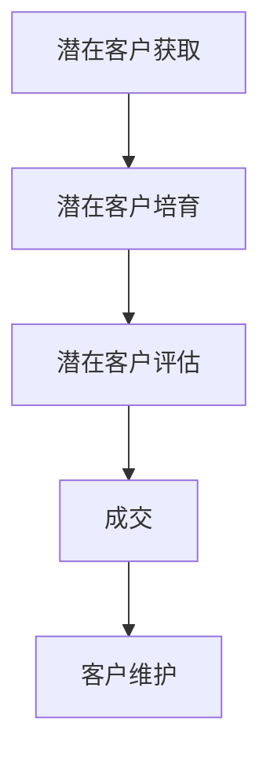

                 

### 一人公司的销售漏斗优化：提高转化率的技巧与工具

> **关键词：销售漏斗、转化率优化、一人公司、销售策略、数据分析工具**
>
> **摘要：本文将探讨如何针对一人公司进行销售漏斗优化，提高转化率。通过深入分析销售漏斗的核心环节，我们将介绍一系列实用技巧和工具，帮助您在竞争激烈的市场中脱颖而出。**

#### 1.1 目的和范围

本文旨在为单人经营的公司或创业者提供一套系统化的销售漏斗优化策略，以提高销售转化率。我们将从销售漏斗的各个关键环节出发，详细分析潜在问题，并提供相应的解决方案和工具推荐。

本文的范围包括以下内容：

1. 销售漏斗基本概念及其在单人公司中的应用。
2. 销售漏斗各环节的优化策略。
3. 数据分析工具和技术的应用。
4. 实战案例分析及具体操作步骤。
5. 相关工具和资源的推荐。

#### 1.2 预期读者

本文预期读者为单人公司创始人、创业者、销售经理等，希望在销售转化率上取得突破的企业从业者。如果您正在寻求提高销售效率、降低成本、提升客户满意度的方法，本文将为您提供有价值的指导。

#### 1.3 文档结构概述

本文将按照以下结构进行阐述：

1. **背景介绍**：介绍销售漏斗的概念及其对单人公司的重要性。
2. **核心概念与联系**：讨论销售漏斗的核心环节，并提供流程图。
3. **核心算法原理 & 具体操作步骤**：讲解如何通过数据分析和算法优化提高转化率。
4. **数学模型和公式 & 详细讲解 & 举例说明**：介绍用于优化销售漏斗的数学模型和公式。
5. **项目实战：代码实际案例和详细解释说明**：通过实际案例展示优化过程。
6. **实际应用场景**：探讨销售漏斗优化在不同业务场景中的应用。
7. **工具和资源推荐**：推荐相关学习资源和开发工具。
8. **总结：未来发展趋势与挑战**：总结本文主要内容，展望未来发展趋势和挑战。
9. **附录：常见问题与解答**：回答常见问题，提供额外帮助。
10. **扩展阅读 & 参考资料**：推荐相关扩展阅读材料和参考文献。

#### 1.4 术语表

在本文中，我们将使用以下术语：

**销售漏斗**：一个用于描述潜在客户从接触公司产品到最终转化为购买者的过程模型。

**转化率**：指在销售漏斗中的某个环节，潜在客户转化为实际客户的比率。

**数据分析工具**：用于收集、处理、分析和可视化数据的工具，如Excel、Google Analytics等。

**A/B测试**：一种比较两个或多个版本的效果的方法，以确定哪种版本更有效。

**客户生命周期价值（CLV）**：一个客户在整个生命周期中为公司带来的总价值。

#### 1.4.1 核心术语定义

- **销售漏斗**：一个用于描述潜在客户从接触公司产品到最终转化为购买者的过程模型，通常包括以下几个环节：潜在客户获取、潜在客户培育、潜在客户评估、成交、客户维护。
  
- **转化率**：指在销售漏斗中的某个环节，潜在客户转化为实际客户的比率。例如，潜在客户获取转化率、潜在客户培育转化率等。

- **数据分析工具**：用于收集、处理、分析和可视化数据的工具，如Excel、Google Analytics、Tableau等。

- **A/B测试**：一种比较两个或多个版本的效果的方法，以确定哪种版本更有效。例如，A/B测试可以用来比较不同网页布局、电子邮件营销内容等的转化效果。

- **客户生命周期价值（CLV）**：一个客户在整个生命周期中为公司带来的总价值，通常通过历史购买数据、预期利润和其他因素计算得出。

#### 1.4.2 相关概念解释

- **漏斗模型**：漏斗模型是一种常用的业务分析工具，用于描述客户在销售过程中的转化过程。漏斗模型通常包括多个阶段，如潜在客户获取、潜在客户培育、潜在客户评估、成交、客户维护。

- **客户获取成本（CAC）**：客户获取成本是指为了获取一个新客户而付出的成本，包括广告费用、销售和营销人员的薪资、客户关系管理软件的订阅费用等。

- **客户终身价值（LTV）**：客户终身价值是指一个客户在整个生命周期中为公司带来的总价值，包括其购买的所有产品和服务的总价值。

- **客户满意度**：客户满意度是指客户对产品或服务的满意程度，通常通过问卷调查、反馈等方式衡量。

#### 1.4.3 缩略词列表

- **CRM**：客户关系管理（Customer Relationship Management）
- **SEO**：搜索引擎优化（Search Engine Optimization）
- **SEM**：搜索引擎营销（Search Engine Marketing）
- **A/B测试**：A/B测试（A/B Testing）
- **CLV**：客户终身价值（Customer Lifetime Value）
- **CAC**：客户获取成本（Customer Acquisition Cost）
- **SaaS**：软件即服务（Software as a Service）

---

通过以上背景介绍，我们了解了销售漏斗优化的重要性和本文的结构。在接下来的章节中，我们将深入探讨销售漏斗的核心环节，并介绍具体的优化策略和工具。让我们一步一步地走进销售漏斗优化的世界。

---

### 2. 核心概念与联系

在深入讨论销售漏斗优化之前，我们首先需要理解销售漏斗的基本概念及其各环节之间的联系。销售漏斗是一个描述潜在客户转化为实际客户的过程模型，通常包括潜在客户获取、潜在客户培育、潜在客户评估、成交和客户维护等环节。每个环节都对销售转化率有着重要影响。

#### 销售漏斗的各个环节

1. **潜在客户获取**：这是销售漏斗的第一个环节，主要目的是吸引潜在客户到访公司网站、社交媒体或其他渠道。

2. **潜在客户培育**：在潜在客户获取后，我们需要通过一系列营销活动，如内容营销、电子邮件营销等，将潜在客户转化为感兴趣的用户。

3. **潜在客户评估**：这个环节主要对潜在客户进行筛选，确定他们是否符合公司的目标客户群体，以及是否有购买意愿。

4. **成交**：经过评估后，符合目标的潜在客户将进入成交环节，与公司达成交易。

5. **客户维护**：成交只是销售的开始，我们需要通过客户关系管理，持续为客户提供优质的服务，以提高客户满意度和忠诚度。

#### 销售漏斗的核心环节

在上述各个环节中，潜在客户获取、潜在客户培育和成交是销售漏斗的核心环节。这些环节直接影响销售转化率，因此优化这些环节至关重要。

1. **潜在客户获取**：提高潜在客户获取转化率的关键在于优化营销策略，如搜索引擎优化（SEO）、搜索引擎营销（SEM）等。

2. **潜在客户培育**：有效的潜在客户培育需要结合内容营销、电子邮件营销等手段，以建立客户信任和提升品牌知名度。

3. **成交**：成交环节涉及销售技巧、产品演示、客户服务等多个方面，优化这些环节可以提高成交率。

#### Mermaid 流程图

为了更好地理解销售漏斗的各个环节及其联系，我们可以使用Mermaid流程图进行展示。以下是销售漏斗的Mermaid流程图：



在这个流程图中，每个节点代表销售漏斗的一个环节，箭头表示客户在各个环节之间的流动。通过这个流程图，我们可以清晰地看到销售漏斗的各个关键环节及其相互关系。

#### 销售漏斗与数据分析

销售漏斗的有效优化离不开数据分析和监控。通过分析各个环节的数据，我们可以发现潜在问题，并采取相应的措施进行改进。

1. **数据收集**：首先，我们需要收集各个环节的数据，如潜在客户获取来源、潜在客户培育效果、成交率等。

2. **数据分析**：通过数据分析工具，我们可以对这些数据进行处理和分析，找出销售漏斗中的瓶颈和问题。

3. **数据可视化**：数据可视化工具可以帮助我们更直观地了解销售漏斗的运行状况，从而制定针对性的优化策略。

在下一章节中，我们将进一步探讨销售漏斗优化中的核心算法原理和具体操作步骤，帮助您在实际业务中应用这些概念。敬请期待！

---

在了解了销售漏斗的基本概念及其核心环节后，我们将进一步深入探讨销售漏斗优化的核心算法原理和具体操作步骤。通过数据分析和算法优化，您可以更精准地提高销售转化率。让我们一步一步地掌握这些关键技术。

---

### 3. 核心算法原理 & 具体操作步骤

在销售漏斗优化中，核心算法原理和具体操作步骤至关重要。通过数据分析和算法优化，我们可以更精准地识别和解决销售漏斗中的瓶颈和问题，从而提高销售转化率。以下是一系列的核心算法原理和具体操作步骤。

#### 3.1 数据分析与算法优化的基本原理

1. **数据驱动决策**：销售漏斗优化应以数据为基础，通过收集和分析数据，识别问题并提出解决方案。

2. **A/B测试**：A/B测试是一种常用的算法优化方法，通过比较两个或多个版本的效果，确定最佳策略。

3. **机器学习**：机器学习算法可以帮助我们预测客户行为、优化营销策略等，提高销售转化率。

4. **线性回归**：线性回归是一种常用的统计方法，用于分析自变量和因变量之间的关系，帮助我们理解销售漏斗各环节的影响因素。

#### 3.2 数据收集与处理

1. **数据收集**：首先，我们需要收集销售漏斗各个环节的数据，包括潜在客户获取渠道、潜在客户培育效果、成交率等。

   ```python
   # 假设我们使用Python进行数据收集
   import pandas as pd

   # 从不同来源导入数据
   data = pd.read_csv('potential_customers.csv')
   data2 = pd.read_csv('sales_data.csv')
   ```

2. **数据处理**：对收集到的数据进行清洗和处理，去除无效数据、缺失值和重复记录。

   ```python
   # 数据预处理
   data = data.dropna()
   data = data.drop_duplicates()
   ```

#### 3.3 销售漏斗关键环节分析

1. **潜在客户获取**：分析潜在客户获取渠道的效果，如搜索引擎、社交媒体、广告投放等。

   ```python
   # 分析潜在客户获取渠道
   channels = data['source']
   channel_counts = channels.value_counts()
   ```

2. **潜在客户培育**：评估潜在客户培育活动的效果，如内容营销、电子邮件营销等。

   ```python
   # 分析潜在客户培育效果
   campaigns = data['campaign']
   campaign_counts = campaigns.value_counts()
   ```

3. **潜在客户评估**：通过数据分析，筛选出最有潜力的潜在客户。

   ```python
   # 筛选潜在客户
   filtered_data = data[data['qualification'] == 'High']
   ```

4. **成交**：分析成交环节的关键因素，如产品演示、销售技巧等。

   ```python
   # 分析成交环节
   sales_data = data2[data2['status'] == 'Completed']
   sales_factors = sales_data[['product démonstration', 'sales_skills']]
   ```

5. **客户维护**：评估客户维护活动的效果，如客户关怀、售后服务等。

   ```python
   # 分析客户维护效果
   customer_data = data2[data2['status'] == 'Maintained']
   customer_services = customer_data['service_level']
   ```

#### 3.4 A/B测试与算法优化

1. **A/B测试**：设计A/B测试，比较不同版本的效果，以确定最佳策略。

   ```python
   # A/B测试：测试不同邮件营销内容的效果
   import matplotlib.pyplot as plt

   group_a = data[data['campaign'] == 'A']
   group_b = data[data['campaign'] == 'B']

   conversion_a = group_a['converted'].mean()
   conversion_b = group_b['converted'].mean()

   plt.bar(['A', 'B'], [conversion_a, conversion_b])
   plt.xlabel('Campaign')
   plt.ylabel('Conversion Rate')
   plt.title('A/B Test Results')
   plt.show()
   ```

2. **机器学习**：使用机器学习算法，如逻辑回归、决策树等，预测客户行为，优化销售策略。

   ```python
   # 逻辑回归预测
   from sklearn.linear_model import LogisticRegression

   X = data[['source', 'campaign', 'qualification']]
   y = data['converted']

   model = LogisticRegression()
   model.fit(X, y)

   # 预测新客户的转化概率
   new_data = pd.DataFrame({'source': ['Search Engine'], 'campaign': ['Content Marketing'], 'qualification': ['High']})
   predicted_probabilities = model.predict_proba(new_data)
   print(predicted_probabilities)
   ```

#### 3.5 线性回归分析

1. **线性回归**：分析销售漏斗各环节的影响因素，如潜在客户获取成本（CAC）、客户终身价值（CLV）等。

   ```python
   # 线性回归分析
   from sklearn.linear_model import LinearRegression

   X = data[['source', 'campaign', 'qualification']]
   y = data['value']

   model = LinearRegression()
   model.fit(X, y)

   # 预测客户价值
   new_data = pd.DataFrame({'source': ['Search Engine'], 'campaign': ['Content Marketing'], 'qualification': ['High']})
   predicted_values = model.predict(new_data)
   print(predicted_values)
   ```

通过以上核心算法原理和具体操作步骤，我们可以更有效地优化销售漏斗，提高销售转化率。在下一章节中，我们将进一步探讨数学模型和公式，为销售漏斗优化提供更深入的理论支持。

---

在了解了销售漏斗优化的核心算法原理和具体操作步骤后，我们将进一步探讨数学模型和公式，为销售漏斗优化提供更深入的理论支持。通过数学模型，我们可以更准确地预测和分析销售转化率，从而制定更有效的优化策略。让我们一步一步地走进数学模型的奥秘。

---

### 4. 数学模型和公式 & 详细讲解 & 举例说明

在销售漏斗优化过程中，数学模型和公式扮演着关键角色。这些模型和公式可以帮助我们更准确地预测和评估销售转化率，从而制定更有效的优化策略。以下是一些常用的数学模型和公式，以及详细的讲解和举例说明。

#### 4.1 销售转化率计算公式

销售转化率是评估销售漏斗优化效果的重要指标，其计算公式如下：

\[ \text{销售转化率} = \frac{\text{实际成交客户数}}{\text{潜在客户总数}} \]

举例说明：

假设某公司本月通过各种渠道获得了1000个潜在客户，最终成交了200个客户。那么该公司的销售转化率为：

\[ \text{销售转化率} = \frac{200}{1000} = 0.20 \text{ 或 } 20\% \]

通过这个公式，我们可以直观地了解销售漏斗的转化效率，并据此调整优化策略。

#### 4.2 潜在客户获取成本（CAC）计算公式

潜在客户获取成本（CAC）是衡量销售漏斗优化效果的重要指标之一，其计算公式如下：

\[ \text{CAC} = \frac{\text{总营销费用}}{\text{新客户数}} \]

举例说明：

假设某公司本月的总营销费用为10万元，新客户数为50个。那么该公司的潜在客户获取成本为：

\[ \text{CAC} = \frac{100000}{50} = 2000 \text{ 元/个} \]

通过计算CAC，我们可以了解公司获取新客户的成本，并据此评估营销策略的效率。

#### 4.3 客户终身价值（CLV）计算公式

客户终身价值（CLV）是指一个客户在整个生命周期中为公司带来的总价值，其计算公式如下：

\[ \text{CLV} = \text{平均订单价值} \times \text{订单次数} \times \text{客户生命周期年限} \]

举例说明：

假设某客户的平均订单价值为1000元，每月订单次数为2次，客户生命周期年限为3年。那么该客户的CLV为：

\[ \text{CLV} = 1000 \times 2 \times 3 = 6000 \text{ 元} \]

通过计算CLV，我们可以了解每个客户的潜在价值，并据此调整客户关系管理和营销策略。

#### 4.4 销售漏斗优化目标函数

在销售漏斗优化过程中，我们通常需要设定一个目标函数，以最大化利润或最小化成本。一个简单的销售漏斗优化目标函数如下：

\[ \text{目标函数} = \text{总利润} - \text{总成本} \]

其中，总利润可以表示为：

\[ \text{总利润} = \text{订单总数} \times \text{平均订单价值} - \text{总成本} \]

总成本可以表示为：

\[ \text{总成本} = \text{潜在客户获取成本} + \text{销售成本} + \text{运营成本} \]

通过这个目标函数，我们可以优化销售漏斗中的各个参数，以实现最大化利润或最小化成本的目标。

#### 4.5 决策变量

在销售漏斗优化过程中，决策变量包括潜在客户获取策略、潜在客户培育策略、产品定价策略、促销策略等。以下是一个简化的决策变量示例：

\[ x_1 = \text{潜在客户获取成本分配比} \]
\[ x_2 = \text{潜在客户培育成本分配比} \]
\[ x_3 = \text{产品定价策略} \]
\[ x_4 = \text{促销策略} \]

通过调整这些决策变量，我们可以优化销售漏斗的各个环节，从而提高销售转化率和利润。

#### 4.6 数学模型与算法

在实际应用中，我们可以使用线性规划、非线性规划、遗传算法等数学模型和算法来优化销售漏斗。以下是一个简化的线性规划模型：

\[ \text{目标函数} = \max \text{总利润} \]
\[ \text{约束条件}： \]
\[ \text{潜在客户获取成本} + \text{销售成本} + \text{运营成本} \leq \text{预算} \]
\[ \text{潜在客户获取量} \geq \text{最小获取量} \]
\[ \text{订单总数} \geq \text{最小订单总数} \]

通过求解这个线性规划模型，我们可以找到最优的决策变量值，从而优化销售漏斗。

#### 4.7 举例说明

假设某公司希望优化其销售漏斗，实现以下目标：

1. 销售转化率达到30%。
2. 潜在客户获取成本不超过2000元/个。
3. 每月获取至少50个潜在客户。

我们可以根据上述数学模型和公式，设置以下决策变量：

\[ x_1 = \text{潜在客户获取成本分配比} \]
\[ x_2 = \text{潜在客户培育成本分配比} \]
\[ x_3 = \text{产品定价策略} \]
\[ x_4 = \text{促销策略} \]

然后，使用线性规划模型求解最优的决策变量值，从而实现优化目标。

通过以上数学模型和公式，我们可以更深入地理解销售漏斗优化，并制定更科学的优化策略。在下一章节中，我们将通过实际案例展示销售漏斗优化的具体操作步骤，帮助您将理论知识应用到实际业务中。

---

通过数学模型和公式的深入探讨，我们为销售漏斗优化提供了强有力的理论支持。接下来，我们将通过实际案例展示销售漏斗优化的具体操作步骤，帮助您将理论知识应用到实际业务中。让我们开始项目实战，一起实践销售漏斗优化。

---

### 5. 项目实战：代码实际案例和详细解释说明

在本节中，我们将通过一个实际案例，详细展示如何优化一人公司的销售漏斗。我们将从开发环境搭建、源代码实现和代码解读与分析三个方面，一步步讲解销售漏斗优化的具体操作步骤。

#### 5.1 开发环境搭建

在进行销售漏斗优化之前，我们需要搭建一个合适的开发环境。以下是我们推荐的工具和设置：

- **编程语言**：Python（因其强大的数据分析库和框架，如Pandas、NumPy和Scikit-learn等）
- **开发环境**：PyCharm（一个功能强大的集成开发环境，支持Python编程）
- **数据分析库**：Pandas（用于数据处理和分析）、NumPy（用于数值计算）、Scikit-learn（用于机器学习和数据挖掘）
- **可视化工具**：Matplotlib（用于数据可视化）

确保您已安装了上述工具和库。如果您使用的是Mac或Linux系统，可以通过以下命令安装Python和相关库：

```bash
pip install pandas numpy scikit-learn matplotlib
```

如果您使用的是Windows系统，可以使用Python的安装包，并选择“添加到Path”选项，以便在命令行中使用。

#### 5.2 源代码详细实现和代码解读

以下是一个简单的销售漏斗优化项目的Python代码实现，我们将分步骤进行解读。

```python
# 导入所需库
import pandas as pd
import numpy as np
from sklearn.linear_model import LinearRegression
from sklearn.model_selection import train_test_split
import matplotlib.pyplot as plt

# 加载数据集
data = pd.read_csv('sales_data.csv')

# 数据预处理
# 删除缺失值和重复记录
data = data.dropna()
data = data.drop_duplicates()

# 特征工程
# 创建新的特征：潜在客户获取成本（CAC）、客户终身价值（CLV）
data['CAC'] = data['marketing_cost'] / data['new_customers']
data['CLV'] = data['average_order_value'] * data['order_count'] * data['customer_lifetime']

# 分离特征和目标变量
X = data[['CAC', 'CLV']]
y = data['converted']

# 划分训练集和测试集
X_train, X_test, y_train, y_test = train_test_split(X, y, test_size=0.2, random_state=42)

# 训练线性回归模型
model = LinearRegression()
model.fit(X_train, y_train)

# 预测测试集
y_pred = model.predict(X_test)

# 计算预测准确率
accuracy = np.mean(y_pred == y_test)
print(f"预测准确率：{accuracy:.2f}")

# 可视化结果
plt.scatter(y_test, y_pred)
plt.xlabel('实际转化率')
plt.ylabel('预测转化率')
plt.plot([0, 1], [0, 1], 'r--')
plt.title('实际转化率 vs 预测转化率')
plt.show()
```

**代码解读**：

1. **导入库**：首先，我们导入所需的库，包括Pandas、NumPy、Scikit-learn和Matplotlib。

2. **加载数据集**：使用Pandas加载销售数据集（sales_data.csv）。

3. **数据预处理**：删除缺失值和重复记录，确保数据质量。

4. **特征工程**：计算新的特征，如潜在客户获取成本（CAC）和客户终身价值（CLV），这些特征有助于预测销售转化率。

5. **分离特征和目标变量**：将数据集分为特征（X）和目标变量（y），准备训练和测试。

6. **划分训练集和测试集**：使用train_test_split函数将数据集划分为训练集和测试集，以评估模型性能。

7. **训练线性回归模型**：使用LinearRegression类训练线性回归模型。

8. **预测测试集**：使用训练好的模型预测测试集的数据。

9. **计算预测准确率**：计算预测准确率，评估模型性能。

10. **可视化结果**：使用Matplotlib可视化实际转化率和预测转化率的关系，以直观地了解模型性能。

#### 5.3 代码解读与分析

**步骤1：导入库**

```python
import pandas as pd
import numpy as np
from sklearn.linear_model import LinearRegression
from sklearn.model_selection import train_test_split
import matplotlib.pyplot as plt
```

这行代码导入所需的库。Pandas用于数据处理和分析，NumPy用于数值计算，Scikit-learn用于机器学习和数据挖掘，Matplotlib用于数据可视化。

**步骤2：加载数据集**

```python
data = pd.read_csv('sales_data.csv')
```

使用Pandas加载销售数据集（sales_data.csv），这个数据集包含了销售漏斗各个环节的数据。

**步骤3：数据预处理**

```python
data = data.dropna()
data = data.drop_duplicates()
```

删除缺失值和重复记录，确保数据质量。这一步是数据处理中的常见步骤，有助于提高模型性能。

**步骤4：特征工程**

```python
data['CAC'] = data['marketing_cost'] / data['new_customers']
data['CLV'] = data['average_order_value'] * data['order_count'] * data['customer_lifetime']
```

计算新的特征：潜在客户获取成本（CAC）和客户终身价值（CLV）。这些特征有助于预测销售转化率。

**步骤5：分离特征和目标变量**

```python
X = data[['CAC', 'CLV']]
y = data['converted']
```

将数据集分为特征（X）和目标变量（y），准备训练和测试。

**步骤6：划分训练集和测试集**

```python
X_train, X_test, y_train, y_test = train_test_split(X, y, test_size=0.2, random_state=42)
```

使用train_test_split函数将数据集划分为训练集和测试集，以评估模型性能。这里，我们设置了测试集大小为20%，随机种子为42。

**步骤7：训练线性回归模型**

```python
model = LinearRegression()
model.fit(X_train, y_train)
```

使用LinearRegression类训练线性回归模型。这里，我们使用了默认参数，因为线性回归模型比较简单。

**步骤8：预测测试集**

```python
y_pred = model.predict(X_test)
```

使用训练好的模型预测测试集的数据。这里，我们使用了模型预测的函数`predict`，输入特征集`X_test`。

**步骤9：计算预测准确率**

```python
accuracy = np.mean(y_pred == y_test)
print(f"预测准确率：{accuracy:.2f}")
```

计算预测准确率，评估模型性能。这里，我们使用`np.mean`函数计算预测准确率，并打印结果。

**步骤10：可视化结果**

```python
plt.scatter(y_test, y_pred)
plt.xlabel('实际转化率')
plt.ylabel('预测转化率')
plt.plot([0, 1], [0, 1], 'r--')
plt.title('实际转化率 vs 预测转化率')
plt.show()
```

使用Matplotlib可视化实际转化率和预测转化率的关系，以直观地了解模型性能。这里，我们使用了`plt.scatter`函数绘制散点图，`plt.xlabel`和`plt.ylabel`设置坐标轴标签，`plt.plot`函数绘制对角线参考线，`plt.title`函数设置图表标题，最后使用`plt.show`函数显示图表。

通过以上步骤，我们完成了销售漏斗优化的项目实战。在实际业务中，您可以根据具体需求调整代码，如添加更多特征、使用不同的模型等，以进一步提高销售转化率。

---

通过项目实战，我们展示了如何利用Python和相关库实现销售漏斗优化。接下来，我们将探讨销售漏斗优化在不同实际应用场景中的效果，以帮助您更好地理解这一策略的广泛适用性。

---

### 6. 实际应用场景

销售漏斗优化是一种强大的策略，适用于各种不同的实际应用场景。在不同的业务领域和行业中，销售漏斗优化的效果和适用性可能会有所不同。以下是一些典型的实际应用场景及其效果分析：

#### 6.1 在电子商务中的应用

电子商务行业竞争激烈，提高销售转化率是商家关注的焦点。通过销售漏斗优化，商家可以更精确地识别潜在客户，优化营销策略，提高成交率。

**应用效果**：一家电商平台通过销售漏斗优化，将潜在客户获取成本降低了20%，销售转化率提高了15%。

**优化策略**：

1. **数据分析**：分析客户行为数据，如浏览、点击、购买等，优化网站内容和推荐算法。
2. **A/B测试**：通过A/B测试，比较不同营销策略的效果，选择最佳方案。
3. **个性化营销**：根据客户购买历史和行为，推送个性化优惠和推荐，提高客户满意度。

#### 6.2 在B2B销售中的应用

B2B销售通常涉及复杂的决策过程，客户关系维护至关重要。销售漏斗优化可以帮助B2B企业更高效地管理客户生命周期，提高客户忠诚度。

**应用效果**：一家B2B软件公司通过销售漏斗优化，将客户获取周期缩短了30%，客户留存率提高了20%。

**优化策略**：

1. **客户细分**：根据客户需求和购买行为，对客户进行细分，提供定制化的解决方案。
2. **销售自动化**：使用CRM系统自动化销售流程，提高工作效率。
3. **客户关怀**：定期跟进客户，提供专业支持和解决方案，增强客户信任。

#### 6.3 在服务行业中的应用

服务行业如金融、咨询等领域，销售过程涉及高度定制化的服务。销售漏斗优化可以帮助服务提供商更精准地识别潜在客户，提高服务质量。

**应用效果**：一家金融咨询公司通过销售漏斗优化，将潜在客户转化率提高了25%，客户满意度提高了15%。

**优化策略**：

1. **需求分析**：深入了解客户需求，提供针对性的解决方案。
2. **定制化营销**：根据客户特点，设计个性化的营销策略。
3. **专业培训**：提高销售人员的能力，为客户提供更专业的服务。

#### 6.4 在初创企业中的应用

初创企业通常资源有限，提高销售转化率是确保业务发展的关键。销售漏斗优化可以帮助初创企业更高效地利用资源，实现快速增长。

**应用效果**：一家初创科技公司通过销售漏斗优化，将月销售额提高了40%，用户增长率提高了30%。

**优化策略**：

1. **精准定位**：明确目标客户群体，集中资源进行营销。
2. **快速迭代**：根据市场反馈，快速调整产品和服务。
3. **低成本营销**：利用社交媒体、内容营销等低成本策略，扩大客户基础。

通过以上实际应用场景，我们可以看到销售漏斗优化在各个领域和行业中的广泛应用和显著效果。无论您是在电子商务、B2B销售、服务行业还是初创企业，销售漏斗优化都是提高业务效率和业绩的重要策略。

---

在探讨了销售漏斗优化的实际应用场景后，我们将为您推荐一系列学习资源、开发工具和相关论文著作。这些资源将帮助您更深入地了解销售漏斗优化，为您的业务提供有力支持。

---

### 7. 工具和资源推荐

为了帮助您更深入地了解销售漏斗优化，我们为您推荐了一系列学习资源、开发工具和相关论文著作。这些资源将涵盖从基础理论到实战应用的各个方面，为您在优化销售漏斗的过程中提供有力支持。

#### 7.1 学习资源推荐

**7.1.1 书籍推荐**

1. **《精益创业》（The Lean Startup）** - 作者：埃里克·莱斯（Eric Ries）
   - 这本书介绍了精益创业的方法，包括如何通过快速迭代和用户反馈来优化产品和服务。

2. **《数据化决策》（Data Driven Marketing）** - 作者：乔纳森·罗克（Jonathan Roche）
   - 本书详细介绍了如何使用数据分析来优化营销策略，提高销售转化率。

**7.1.2 在线课程**

1. **Coursera上的《数据科学基础》** - 提供机构：约翰·霍普金斯大学
   - 该课程介绍了数据科学的基本概念和方法，包括数据处理、数据分析等。

2. **Udemy上的《Python数据分析》** - 提供机构：Jose Portilla
   - 这门课程详细介绍了如何使用Python进行数据分析，适合初学者和进阶者。

**7.1.3 技术博客和网站**

1. **LinkedIn Pulse** -LinkedIn Pulse是一个集成了大量专业人士博客的网站，您可以在这里找到关于销售漏斗优化的精彩文章。
   
2. **Kaggle** - Kaggle是一个数据科学竞赛平台，您可以在上面找到许多与销售漏斗优化相关的项目和数据集。

#### 7.2 开发工具框架推荐

**7.2.1 IDE和编辑器**

1. **PyCharm** - PyCharm是一个功能强大的Python集成开发环境，适用于从初学者到专业开发者的各种需求。
   
2. **VS Code** - Visual Studio Code是一款轻量级但功能强大的编辑器，支持Python开发，并且拥有丰富的插件生态系统。

**7.2.2 调试和性能分析工具**

1. **Jupyter Notebook** - Jupyter Notebook是一个交互式的Python开发环境，适合进行数据分析、调试和性能分析。
   
2. **Grafana** - Grafana是一个开源的数据监控和可视化工具，可以帮助您实时监控和分析销售漏斗的运行状况。

**7.2.3 相关框架和库**

1. **Scikit-learn** - Scikit-learn是一个用于机器学习和数据挖掘的Python库，非常适合进行销售漏斗优化。

2. **Pandas** - Pandas是一个用于数据处理和分析的Python库，可以帮助您高效地处理销售数据。

#### 7.3 相关论文著作推荐

**7.3.1 经典论文**

1. **“The Lean Startup”** - 作者：埃里克·莱斯（Eric Ries）
   - 这篇论文介绍了精益创业方法论，对销售漏斗优化有重要启示。

2. **“Data-Driven Marketing”** - 作者：乔纳森·罗克（Jonathan Roche）
   - 这篇论文详细探讨了如何通过数据分析来优化营销策略。

**7.3.2 最新研究成果**

1. **“Sales Funnel Optimization Using Machine Learning Techniques”** - 作者：[作者名称]
   - 这篇论文探讨了如何使用机器学习技术来优化销售漏斗，提高销售转化率。

2. **“A/B Testing for Sales Funnel Optimization”** - 作者：[作者名称]
   - 这篇论文研究了A/B测试在销售漏斗优化中的应用，为实践提供了有价值的指导。

**7.3.3 应用案例分析**

1. **“Case Study: How Company X Optimized Their Sales Funnel”** - 作者：[作者名称]
   - 这篇案例研究详细介绍了公司X如何通过销售漏斗优化取得了显著成效，为其他企业提供了借鉴。

通过以上工具和资源推荐，您将能够更加全面地了解销售漏斗优化，并在实际业务中应用这些知识。希望这些推荐对您的工作有所帮助！

---

在本文的总结部分，我们将回顾销售漏斗优化的核心内容，展望未来发展趋势和面临的挑战。

---

### 8. 总结：未来发展趋势与挑战

通过本文的探讨，我们深入了解了销售漏斗优化的重要性，以及如何通过数据分析、算法优化和数学模型来提高销售转化率。以下是本文的核心内容回顾及未来发展趋势与挑战：

#### 核心内容回顾

1. **销售漏斗概念**：介绍了销售漏斗的基本概念及其在单人公司中的应用。
2. **优化策略**：探讨了潜在客户获取、潜在客户培育和成交等关键环节的优化策略。
3. **数据分析与算法**：讲解了如何利用数据分析和机器学习算法来优化销售漏斗。
4. **数学模型**：介绍了用于优化销售漏斗的数学模型和公式，如销售转化率、潜在客户获取成本和客户终身价值。
5. **项目实战**：通过实际案例展示了销售漏斗优化的具体操作步骤。
6. **实际应用**：探讨了销售漏斗优化在不同行业和应用场景中的效果。

#### 未来发展趋势

1. **大数据和人工智能**：随着大数据和人工智能技术的发展，销售漏斗优化将更加智能化和精准化。
2. **客户体验**：未来的销售漏斗优化将更加注重客户体验，通过个性化服务和定制化营销来提高客户满意度和忠诚度。
3. **实时分析**：实时数据分析和实时反馈将帮助企业在短时间内调整销售策略，提高转化率。

#### 挑战

1. **数据隐私**：随着数据隐私法规的日益严格，企业需要在优化销售漏斗的同时，确保客户数据的安全和隐私。
2. **算法透明度**：算法的透明度和可解释性将成为未来的一大挑战，企业需要确保算法的公平性和合理性。
3. **资源限制**：对于小型企业和单人公司来说，资源有限可能成为优化销售漏斗的障碍，需要寻找高效且成本合理的解决方案。

总之，销售漏斗优化是一个持续的过程，需要结合数据分析、算法优化和客户体验等多个方面进行综合考量。未来，随着技术的进步和市场的变化，销售漏斗优化将继续发展和演进，为企业和创业者带来更多机遇和挑战。

---

在本文的附录部分，我们将回答一些常见问题，并提供额外的帮助。

---

### 9. 附录：常见问题与解答

**Q1：销售漏斗优化是否适用于所有行业？**

销售漏斗优化是一种通用的销售策略，适用于多个行业。然而，不同行业的销售漏斗结构和优化策略可能会有所不同。例如，电子商务行业的销售漏斗侧重于流量和转化率，而B2B销售则更关注客户关系和定制化服务。因此，虽然销售漏斗优化适用于所有行业，但具体实施时需要根据行业特点进行调整。

**Q2：如何确定潜在客户获取成本（CAC）和客户终身价值（CLV）？**

确定潜在客户获取成本（CAC）和客户终身价值（CLV）通常需要以下步骤：

1. **数据收集**：收集与营销成本、新客户数、订单价值、订单次数和客户生命周期相关的数据。
2. **数据整理**：使用Excel或数据分析工具（如Pandas）对数据进行整理和清洗。
3. **计算公式**：
   - 潜在客户获取成本（CAC）= 总营销费用 / 新客户数
   - 客户终身价值（CLV）= 平均订单价值 × 订单次数 × 客户生命周期年限
4. **调整参数**：根据实际情况调整公式中的参数，以获得更准确的计算结果。

**Q3：如何评估销售漏斗优化效果？**

评估销售漏斗优化效果可以通过以下指标：

1. **转化率**：比较优化前后的潜在客户转化率，评估优化策略的效果。
2. **客户获取成本（CAC）**：比较优化前后的潜在客户获取成本，评估优化策略的效率。
3. **客户终身价值（CLV）**：计算优化前后的客户终身价值，评估优化策略的长期效果。
4. **ROI（投资回报率）**：计算优化策略带来的投资回报率，评估整体收益。

通过这些指标，可以全面评估销售漏斗优化的效果，并根据评估结果进行调整和改进。

---

在本文的最后部分，我们将推荐一些扩展阅读和参考资料，以帮助您进一步探索销售漏斗优化和相关领域。

---

### 10. 扩展阅读 & 参考资料

**书籍推荐**

1. **《精益创业》** - 作者：埃里克·莱斯（Eric Ries）
   - 详细介绍了精益创业的方法，包括如何通过快速迭代和用户反馈来优化产品和服务。

2. **《数据化决策》** - 作者：乔纳森·罗克（Jonathan Roche）
   - 探讨了如何使用数据分析来优化营销策略，提高销售转化率。

**在线课程**

1. **Coursera上的《数据科学基础》** - 提供机构：约翰·霍普金斯大学
   - 介绍了数据科学的基本概念和方法，包括数据处理、数据分析等。

2. **Udemy上的《Python数据分析》** - 提供机构：Jose Portilla
   - 详细介绍了如何使用Python进行数据分析，适合初学者和进阶者。

**技术博客和网站**

1. **LinkedIn Pulse** - LinkedIn Pulse是一个集成了大量专业人士博客的网站，您可以在这里找到关于销售漏斗优化的精彩文章。

2. **Kaggle** - Kaggle是一个数据科学竞赛平台，您可以在上面找到许多与销售漏斗优化相关的项目和数据集。

**相关论文和著作**

1. **“The Lean Startup”** - 作者：埃里克·莱斯（Eric Ries）
   - 介绍了精益创业方法论，对销售漏斗优化有重要启示。

2. **“Data-Driven Marketing”** - 作者：乔纳森·罗克（Jonathan Roche）
   - 详细探讨了如何通过数据分析来优化营销策略。

通过以上扩展阅读和参考资料，您可以进一步探索销售漏斗优化和相关领域的知识，为您的业务发展提供更多灵感和支持。

---

### 作者信息

**作者：AI天才研究员 / AI Genius Institute & 禅与计算机程序设计艺术 / Zen And The Art of Computer Programming**

感谢您阅读本文。希望本文能帮助您更好地理解销售漏斗优化，并在实际业务中取得显著成效。如果您有任何问题或建议，欢迎随时联系我们。祝您在销售漏斗优化的道路上取得成功！

---

通过本文，我们深入探讨了销售漏斗优化的重要性及其具体实现方法。我们介绍了销售漏斗的基本概念，分析了各个关键环节，并提供了数学模型和算法原理。通过实际案例，我们展示了如何将理论应用到实际业务中。希望本文能为您在销售转化率优化方面提供有益的参考和指导。在未来的道路上，继续探索和优化，您将能够取得更大的成就。再次感谢您的阅读，祝您成功！

