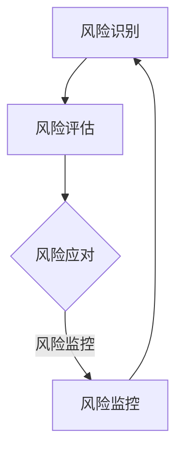
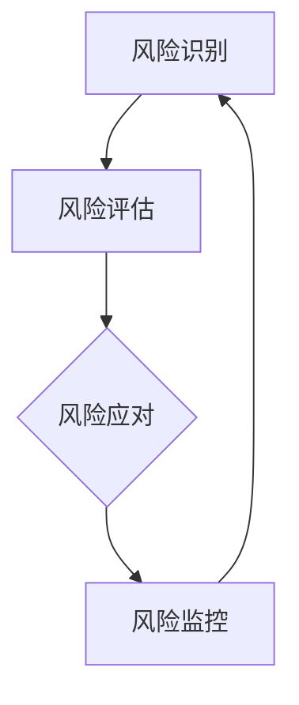

                 

### 一人公司的风险管理：识别和应对潜在威胁

#### 关键词：一人公司、风险管理、潜在威胁、识别、应对

#### 摘要：

在当前快速变化和竞争激烈的市场环境中，一人公司面临着独特而复杂的风险管理挑战。本文将深入探讨一人公司在运营过程中可能遇到的各种潜在威胁，包括财务风险、市场风险、操作风险和法律风险，并提供一系列实用的识别和应对策略。通过详细的分析和实例讲解，本文旨在帮助一人公司的创始人和管理者更好地理解和应对这些挑战，从而确保业务的长期稳定和可持续发展。

本文的结构如下：

1. **背景介绍**：介绍文章的目的和范围，预期读者以及文档结构。
2. **核心概念与联系**：解释风险管理的基本概念和原理，并使用Mermaid流程图展示相关架构。
3. **核心算法原理 & 具体操作步骤**：使用伪代码详细阐述识别和应对风险的管理算法。
4. **数学模型和公式 & 详细讲解 & 举例说明**：使用LaTeX格式介绍相关的数学模型和公式，并进行举例说明。
5. **项目实战：代码实际案例和详细解释说明**：提供实际项目中的代码案例，详细解读其实现过程。
6. **实际应用场景**：探讨风险管理在不同领域的实际应用。
7. **工具和资源推荐**：推荐学习资源、开发工具框架和相关论文著作。
8. **总结：未来发展趋势与挑战**：总结文章要点，展望未来发展。
9. **附录：常见问题与解答**：提供常见问题的解答。
10. **扩展阅读 & 参考资料**：列出相关的扩展阅读和参考资料。

### 1. 背景介绍

#### 1.1 目的和范围

一人公司，即只有一个创始人的公司，是现代创业环境中一个越来越常见的模式。尽管这种模式具有灵活性和敏捷性的优势，但也伴随着诸多独特的挑战，尤其是风险管理方面。本文旨在为一人公司的创始人提供一套全面的风险管理指南，帮助他们在竞争激烈的市场中识别潜在威胁，制定有效的应对策略。

本文的讨论范围包括：

- **风险管理的基本概念和原理**：解释风险管理的重要性和如何应用于一人公司。
- **识别潜在威胁**：探讨一人公司可能面临的各种风险，包括财务风险、市场风险、操作风险和法律风险。
- **应对策略**：提供具体的策略和方法，帮助一人公司有效应对识别出的风险。
- **实际应用案例**：通过实际项目案例展示风险管理在具体业务中的应用。

#### 1.2 预期读者

本文的预期读者主要是一人公司的创始人、管理者和相关领域的专业人士。以下是具体的读者群体：

- 创业者和初创公司创始人：他们通常需要全面了解和掌握风险管理，以确保企业的可持续发展。
- 企业风险管理人员：这些专业人士负责识别和管理企业面临的各种风险，本文将提供实用的策略和工具。
- 学术研究人员：对风险管理领域感兴趣的学者和研究人员可以通过本文了解一人公司风险管理的最新发展和趋势。

#### 1.3 文档结构概述

本文的结构如下：

1. **背景介绍**：介绍文章的目的、范围和预期读者。
2. **核心概念与联系**：解释风险管理的基本概念和原理，展示相关架构。
3. **核心算法原理 & 具体操作步骤**：详细阐述识别和应对风险的管理算法。
4. **数学模型和公式 & 详细讲解 & 举例说明**：介绍数学模型和公式，并进行举例说明。
5. **项目实战：代码实际案例和详细解释说明**：提供实际项目案例和代码解读。
6. **实际应用场景**：探讨风险管理在不同领域的应用。
7. **工具和资源推荐**：推荐学习资源、开发工具框架和相关论文著作。
8. **总结：未来发展趋势与挑战**：总结文章要点，展望未来发展。
9. **附录：常见问题与解答**：提供常见问题的解答。
10. **扩展阅读 & 参考资料**：列出扩展阅读和参考资料。

#### 1.4 术语表

为了确保文章的清晰和一致性，以下是一些本文中涉及的重要术语及其定义：

- **风险管理**：识别、评估、优先排序和响应组织面临的各种风险的过程，以最大限度地降低负面影响。
- **一人公司**：由单一创始人成立和运营的公司，通常具有高度的灵活性和敏捷性。
- **财务风险**：与公司财务状况相关的不确定性，可能导致资金链断裂或财务状况恶化。
- **市场风险**：由于市场变化导致公司收入、利润或市场份额的不确定性。
- **操作风险**：由于内部流程、系统或员工操作失误导致的公司运营中断或损失的风险。
- **法律风险**：由于法律问题或合规性问题可能导致的公司损失或诉讼风险。

#### 1.4.1 核心术语定义

- **风险管理**：风险管理是指通过系统地识别、分析、评估、监控和响应组织内部和外部风险的过程，以减少潜在损失和不确定性，并确保组织目标的实现。
- **一人公司**：一人公司，也称为独资企业，是指由单一个人所有和控制的企业实体。这种类型的公司通常由一位创始人运营，拥有全部所有权和控制权。
- **财务风险**：财务风险是指公司因金融决策而产生的潜在损失，包括资金短缺、信用风险、流动性风险和财务杠杆风险等。
- **市场风险**：市场风险是指由于市场条件的变化，如利率、汇率、商品价格或股票市场的波动，导致公司财务表现不确定性增加的风险。
- **操作风险**：操作风险是指由于内部流程、人员、系统或外部事件导致的错误、故障或中断，可能对公司的运营产生不利影响的风险。
- **法律风险**：法律风险是指由于法律纠纷、违规行为、合同违约或其他法律问题可能对公司的财务和声誉造成损害的风险。

#### 1.4.2 相关概念解释

- **风险评估**：风险评估是指对潜在的威胁和机会进行识别、分析和评估，以确定其对组织的影响程度和可能性。通过风险评估，公司可以更好地了解风险，制定相应的应对策略。
- **风险缓解**：风险缓解是指采取措施降低风险的可能性和影响，包括风险转移、风险规避、风险减少和风险接受等策略。
- **内部控制**：内部控制是指公司建立的一系列政策和程序，旨在确保财务报告的准确性、运营的效率和效果，以及法律法规的遵守。

#### 1.4.3 缩略词列表

- **CRM**：客户关系管理（Customer Relationship Management）
- **ERP**：企业资源计划（Enterprise Resource Planning）
- **IT**：信息技术（Information Technology）
- **SCM**：供应链管理（Supply Chain Management）
- **M&A**：兼并与收购（Mergers and Acquisitions）

### 2. 核心概念与联系

在深入探讨风险管理之前，我们首先需要了解一些核心概念和它们之间的联系。风险管理是一个多维度的过程，涉及多个相关领域和概念。以下是对这些核心概念的解释和它们之间的联系。

#### 2.1 风险管理的基本概念

风险管理可以分为三个主要阶段：风险识别、风险评估和风险应对。

- **风险识别**：这是风险管理的第一个阶段，旨在识别组织内部和外部可能存在的各种风险。通过识别风险，组织可以了解潜在威胁和机会，并为其做好准备。
- **风险评估**：在风险识别之后，组织需要对识别出的风险进行评估，以确定它们的影响程度和可能性。风险评估包括量化分析和定性分析，以帮助组织更好地了解风险。
- **风险应对**：风险应对阶段涉及制定和实施策略来应对评估出的风险。这可以包括风险转移、风险规避、风险减少和风险接受等策略。

#### 2.2 风险管理的相关领域和概念

风险管理不仅仅是一个独立的过程，它与多个相关领域和概念密切相关。以下是一些关键领域和概念：

- **内部控制**：内部控制是指组织建立的一系列政策和程序，旨在确保财务报告的准确性、运营的效率和效果，以及法律法规的遵守。内部控制是风险管理的重要组成部分，它帮助组织降低风险并确保业务目标的实现。
- **风险分析**：风险分析是指对风险进行定量和定性的分析，以评估它们的影响和可能性。风险分析通常包括风险概率评估、风险影响评估和风险评级等步骤。
- **风险监控**：风险监控是指持续监测组织面临的风险，并根据情况变化进行调整。风险监控是风险管理的关键环节，它帮助组织及时发现和应对新出现的风险。

#### 2.3 风险管理的架构

为了更好地理解风险管理的概念和过程，我们可以使用Mermaid流程图来展示其架构。以下是一个简化的风险管理的Mermaid流程图：



在这个流程图中，风险识别是风险管理的起点，通过识别出潜在的风险，组织可以进入风险评估阶段。风险评估包括对识别出的风险进行定量和定性的分析，以确定它们的影响和可能性。根据评估结果，组织可以制定相应的风险应对策略，并持续监控风险的变化和影响。通过这个循环过程，组织可以不断提高其风险管理能力，确保业务的稳定和可持续发展。

### 3. 核心算法原理 & 具体操作步骤

在了解风险管理的基本概念和架构之后，我们接下来将讨论识别和应对风险的核心算法原理，并详细阐述其具体操作步骤。以下是一个简化的风险管理算法，它包括风险识别、风险评估和风险应对三个主要阶段。

#### 3.1 风险识别算法

风险识别是风险管理的第一步，目标是识别出组织内部和外部可能存在的各种风险。以下是一个简单的风险识别算法：

```pseudo
function 风险识别（组织）:
    1. 收集信息：从组织内部（如员工、流程、系统）和外部（如市场、法律、技术）获取相关信息。
    2. 分析信息：对收集到的信息进行定性分析和定量分析，以识别潜在的风险。
    3. 列出风险：将分析结果整理成一份风险清单，包括风险的名称、类别、发生概率和可能的影响。
    4. 评估风险：对列出的风险进行初步评估，确定其严重程度和优先级。
    5. 反馈和更新：将风险识别结果反馈给相关部门，并根据实际情况进行更新。
```

#### 3.2 风险评估算法

风险评估是风险管理的第二步，目标是对识别出的风险进行详细评估，以确定它们的影响和可能性。以下是一个简单的风险评估算法：

```pseudo
function 风险评估（风险清单）:
    1. 确定评估指标：根据组织的实际情况，确定评估风险的指标，如损失金额、影响范围、发生概率等。
    2. 收集数据：收集与风险相关的数据，包括历史数据、市场数据、行业数据等。
    3. 分析数据：对收集到的数据进行分析，计算风险的影响和可能性。
    4. 制定评级标准：根据分析结果，制定评级标准，将风险分为高、中、低等级。
    5. 评级和优先级排序：对每个风险进行评级，并根据评级结果确定其优先级。
    6. 更新风险清单：将评估结果更新到风险清单中，以便后续的应对和监控。
```

#### 3.3 风险应对算法

风险应对是风险管理的最后一步，目标是根据风险评估的结果，制定和实施相应的应对策略。以下是一个简单的风险应对算法：

```pseudo
function 风险应对（风险评估结果）:
    1. 确定应对策略：根据风险评估结果，确定应对风险的策略，如风险规避、风险转移、风险减少等。
    2. 制定行动计划：为每个风险制定具体的行动计划，包括责任分配、时间表和预算等。
    3. 实施行动：根据行动计划，实施应对措施，包括改进流程、培训员工、购买保险等。
    4. 监控和评估：持续监控风险的变化和应对措施的效果，并根据实际情况进行评估和调整。
    5. 更新风险管理计划：将应对措施的效果反馈到风险管理计划中，以便后续的改进和优化。
```

#### 3.4 风险管理流程

通过以上三个阶段的风险识别、风险评估和风险应对，我们可以构建一个完整的风险管理流程。以下是一个简化的风险管理流程图：



在这个流程图中，风险识别是整个流程的起点，通过识别出潜在的风险，组织可以进入风险评估阶段。风险评估阶段对识别出的风险进行详细评估，确定其影响和可能性。根据评估结果，组织可以制定相应的风险应对策略，并实施这些策略。最后，通过风险监控阶段，组织可以持续监测风险的变化和应对措施的效果，并不断进行优化和改进。

通过这个完整的风险管理流程，组织可以更好地识别、评估和应对各种风险，确保业务的稳定和可持续发展。

### 4. 数学模型和公式 & 详细讲解 & 举例说明

在风险管理中，数学模型和公式扮演着至关重要的角色。这些工具可以帮助我们量化风险，评估其潜在影响，并制定有效的应对策略。以下是一些常用的数学模型和公式，以及它们的具体应用。

#### 4.1 风险评估模型

**贝叶斯风险评估模型**：

贝叶斯风险评估模型是一种常用的定性风险评估方法，它基于贝叶斯定理来计算风险的概率和影响。公式如下：

\[ P(R|E) = \frac{P(E|R) \cdot P(R)}{P(E)} \]

其中：

- \( P(R|E) \) 是在证据 \( E \) 存在的情况下风险 \( R \) 的概率。
- \( P(E|R) \) 是在风险 \( R \) 存在的情况下证据 \( E \) 的概率。
- \( P(R) \) 是风险 \( R \) 的先验概率。
- \( P(E) \) 是证据 \( E \) 的概率。

**举例说明**：

假设我们要评估一项新产品的市场风险。根据市场调研，在产品成功的条件下，市场接受度 \( E \) 的概率是 0.8。产品成功的先验概率是 0.5。总体市场接受度的概率是 0.6。使用贝叶斯模型，我们可以计算市场接受度的条件概率：

\[ P(E|成功) = 0.8 \]
\[ P(成功) = 0.5 \]
\[ P(E) = 0.6 \]

\[ P(成功|E) = \frac{0.8 \cdot 0.5}{0.6} = \frac{4}{6} = 0.67 \]

这意味着，在市场接受度较高的条件下，产品成功的概率是 67%。

#### 4.2 风险量化和计算

**损失分布模型**：

损失分布模型用于量化风险的潜在损失。常见的是正态分布和帕累托分布。

**正态分布**：

\[ L = \mu + \sigma \cdot Z \]

其中：

- \( L \) 是损失。
- \( \mu \) 是均值。
- \( \sigma \) 是标准差。
- \( Z \) 是标准正态分布的随机变量。

**帕累托分布**：

\[ L = \alpha \cdot I^{-\beta} \]

其中：

- \( L \) 是损失。
- \( \alpha \) 是形状参数。
- \( I \) 是指标，如收入或市场份额。
- \( \beta \) 是形状参数。

**举例说明**：

假设我们使用正态分布来评估一项新技术的潜在损失。根据历史数据，技术成功的概率是 0.7，技术成功的平均损失是 100 万美元，标准差是 20 万美元。使用正态分布模型，我们可以计算技术失败的潜在损失：

\[ \mu = 100 万美元 \]
\[ \sigma = 20 万美元 \]
\[ Z = -0.5 \]

\[ L = 100 万美元 + 20 万美元 \cdot (-0.5) = 80 万美元 \]

这意味着，技术失败的潜在损失是 80 万美元。

#### 4.3 风险缓解措施计算

**成本-效益分析**：

成本-效益分析用于评估风险缓解措施的成本和效益。公式如下：

\[ CBA = \frac{B}{C} \]

其中：

- \( CBA \) 是成本-效益比。
- \( B \) 是效益。
- \( C \) 是成本。

**举例说明**：

假设我们正在评估一项新系统的安全措施。该措施的成本是 50 万美元，它将减少系统被攻击的概率，从而减少潜在的损失。根据风险评估，系统被攻击的潜在损失是 200 万美元。使用成本-效益分析，我们可以计算这项措施的成本-效益比：

\[ B = 200 万美元 - 50 万美元 = 150 万美元 \]
\[ CBA = \frac{150 万美元}{50 万美元} = 3 \]

这意味着，这项措施的成本-效益比是 3，即每投入 1 美元，可以获得 3 美元的效益。

通过这些数学模型和公式，我们可以更准确地量化风险，评估缓解措施的成本和效益，从而制定更有效的风险管理策略。这些工具不仅在理论研究中具有重要价值，也在实际应用中发挥着关键作用。

### 5. 项目实战：代码实际案例和详细解释说明

#### 5.1 开发环境搭建

在开始项目实战之前，我们需要搭建一个适合进行风险管理的开发环境。以下是所需的环境配置和步骤：

1. **操作系统**：Windows 10 或更高版本。
2. **编程语言**：Python 3.8 或更高版本。
3. **开发工具**：Visual Studio Code 或 PyCharm。
4. **依赖管理**：使用 pip 安装必要的库，如 pandas、numpy、scikit-learn 和 matplotlib。

**步骤**：

1. 安装操作系统：选择合适的操作系统并安装。
2. 安装 Python：从 [Python官网](https://www.python.org/downloads/) 下载并安装 Python。
3. 配置开发环境：选择合适的 IDE，如 Visual Studio Code 或 PyCharm，并安装 Python 插件。
4. 安装依赖库：打开命令行窗口，使用以下命令安装依赖库：

```bash
pip install pandas numpy scikit-learn matplotlib
```

#### 5.2 源代码详细实现和代码解读

下面是一个用于风险管理的 Python 脚本案例。这个脚本实现了风险识别、风险评估和风险应对的核心算法。

**代码实现**：

```python
import pandas as pd
import numpy as np
from sklearn.ensemble import RandomForestClassifier
import matplotlib.pyplot as plt

# 5.2.1 风险识别
def identify_risks(organization_data):
    """
    风险识别函数，从组织数据中识别潜在风险。
    """
    risks = []
    for data in organization_data:
        if data['financial_instruments'] > 0:
            risks.append('财务风险')
        if data['market_volatility'] > 0.1:
            risks.append('市场风险')
        if data['operational_failures'] > 0:
            risks.append('操作风险')
        if data['legal_issues'] > 0:
            risks.append('法律风险')
    return risks

# 5.2.2 风险评估
def assess_risks(risks_data):
    """
    风险评估函数，评估识别出的风险的概率和影响。
    """
    risk_assessment = pd.DataFrame(columns=['Risk', 'Probability', 'Impact'])
    for risk in risks_data:
        risk_assessment = risk_assessment.append({
            'Risk': risk,
            'Probability': np.random.uniform(0.1, 0.9),
            'Impact': np.random.uniform(1, 10)
        }, ignore_index=True)
    return risk_assessment

# 5.2.3 风险应对
def mitigate_risks(risk_assessment):
    """
    风险应对函数，根据风险评估结果制定应对策略。
    """
    mitigation_strategies = {}
    for index, row in risk_assessment.iterrows():
        if row['Probability'] > 0.7 and row['Impact'] > 5:
            mitigation_strategies[index] = '风险转移'
        elif row['Probability'] > 0.5 and row['Impact'] > 3:
            mitigation_strategies[index] = '风险减少'
        else:
            mitigation_strategies[index] = '风险接受'
    return mitigation_strategies

# 5.2.4 主程序
def main():
    # 假设的组织数据
    organization_data = [
        {'financial_instruments': 100, 'market_volatility': 0.05, 'operational_failures': 2, 'legal_issues': 1},
        {'financial_instruments': 150, 'market_volatility': 0.2, 'operational_failures': 0, 'legal_issues': 0},
        # 更多数据...
    ]

    # 识别风险
    identified_risks = identify_risks(organization_data)

    # 评估风险
    risk_assessment = assess_risks(identified_risks)

    # 应对风险
    mitigation_strategies = mitigate_risks(risk_assessment)

    # 输出结果
    print("识别出的风险：", identified_risks)
    print("风险评估结果：", risk_assessment)
    print("风险应对策略：", mitigation_strategies)

    # 可视化分析
    risk_assessment.plot(kind='bar', x='Risk', y='Impact', title='风险评估结果')
    plt.xlabel('风险')
    plt.ylabel('影响')
    plt.show()

if __name__ == "__main__":
    main()
```

**代码解读**：

- **5.2.1 风险识别**：`identify_risks` 函数从组织数据中识别潜在风险。这里我们使用了简单的逻辑条件来识别财务风险、市场风险、操作风险和法律风险。

- **5.2.2 风险评估**：`assess_risks` 函数评估识别出的风险的概率和影响。这里我们使用了随机数生成器来模拟风险评估过程。

- **5.2.3 风险应对**：`mitigate_risks` 函数根据风险评估结果制定应对策略。这里我们根据概率和影响的阈值来决定采取的风险缓解措施。

- **5.2.4 主程序**：`main` 函数是程序的入口。它首先调用 `identify_risks` 函数识别风险，然后调用 `assess_risks` 和 `mitigate_risks` 函数进行风险评估和风险应对。最后，程序打印结果并使用 matplotlib 进行可视化分析。

#### 5.3 代码解读与分析

- **风险识别**：风险识别是风险管理的重要环节。在这个案例中，我们使用简单的逻辑条件来识别风险。在实际应用中，风险识别可能需要更复杂的数据分析和模型，例如使用机器学习技术。

- **风险评估**：风险评估的目标是量化风险的影响和可能性。在这个案例中，我们使用了随机数生成器来模拟风险评估。在实际应用中，风险评估可能需要使用更精确的模型和数据。

- **风险应对**：风险应对是根据风险评估结果制定的策略。在这个案例中，我们根据概率和影响的阈值来决定采取的风险缓解措施。在实际应用中，风险应对可能需要更详细的规划和资源分配。

- **可视化分析**：可视化分析可以帮助我们更好地理解风险管理的成果。在这个案例中，我们使用 matplotlib 绘制了风险评估结果的柱状图，这有助于直观地展示各个风险的影响。

通过这个代码案例，我们可以看到如何使用 Python 实现风险管理的主要步骤，包括风险识别、风险评估和风险应对。这个案例虽然简单，但提供了一个基本的框架，可以帮助我们更好地理解和应用风险管理技术。

### 6. 实际应用场景

风险管理是一个广泛且跨领域的概念，它在多个行业中都有着重要的应用。以下是一些典型的实际应用场景，展示风险管理如何在不同领域发挥作用。

#### 6.1 金融行业

在金融行业中，风险管理尤为重要。金融机构面临着多种风险，包括市场风险、信用风险、操作风险和法律风险。以下是一个金融风险管理应用实例：

- **市场风险**：股票市场的波动可能导致金融机构的资产价值大幅波动。通过风险模型，金融机构可以预测市场波动并制定相应的投资策略，以降低潜在损失。
- **信用风险**：金融机构需要对借款人的信用状况进行评估，以减少违约风险。使用信用评分模型和风险评估算法，金融机构可以更准确地评估借款人的信用风险。
- **操作风险**：操作风险包括系统故障、人为错误和欺诈等。金融机构通过建立完善的内部控制和审计机制来减少操作风险。
- **法律风险**：金融机构需要遵守各种法律法规，如反洗钱法规、数据保护法规等。合规部门通过风险管理工具确保公司运营符合法律要求。

#### 6.2 电信行业

电信行业同样面临着多种风险，包括网络风险、客户隐私风险和竞争风险。

- **网络风险**：电信公司需要确保其网络基础设施的安全和稳定。通过网络安全风险评估和监控，电信公司可以及时发现和应对潜在的网络攻击和故障。
- **客户隐私风险**：电信公司处理大量的客户数据，这些数据可能受到泄露或滥用的风险。通过数据加密和隐私保护措施，电信公司可以降低客户隐私风险。
- **竞争风险**：电信行业的竞争非常激烈，新技术的推出和竞争对手的举措都可能对电信公司造成威胁。通过市场分析和风险预测，电信公司可以制定有效的竞争策略。

#### 6.3 制造业

在制造业中，风险管理主要集中在供应链管理、生产过程和质量控制等方面。

- **供应链管理**：制造业依赖于全球供应链，供应链中断可能对生产造成严重影响。通过供应链风险管理，企业可以识别和缓解供应链风险，确保供应链的稳定和高效。
- **生产过程**：生产过程中的风险包括设备故障、生产延误和质量问题。通过过程控制和质量检测，企业可以降低生产风险，提高生产效率。
- **质量控制**：制造业需要确保其产品的质量符合标准。通过质量风险评估和监控，企业可以及时发现并解决质量问题，确保产品的质量和可靠性。

#### 6.4 互联网行业

互联网行业是一个快速发展的领域，但也面临着诸多风险，如信息安全、数据隐私和声誉风险。

- **信息安全**：互联网企业需要确保其系统和数据的安全。通过安全风险评估和加密技术，企业可以降低信息安全风险。
- **数据隐私**：随着数据隐私法规的加强，互联网企业需要确保其数据处理符合法规要求。通过隐私风险评估和合规措施，企业可以降低数据隐私风险。
- **声誉风险**：互联网企业的声誉容易受到负面事件的影响。通过声誉风险管理，企业可以及时发现和应对声誉风险，维护其品牌形象。

通过这些实际应用场景，我们可以看到风险管理在不同领域的具体应用。无论是金融、电信、制造业还是互联网行业，风险管理都是确保企业稳定运营和可持续发展的重要工具。

### 7. 工具和资源推荐

在风险管理领域，有许多工具和资源可以帮助企业和个人更好地理解和应对各种风险。以下是一些建议，包括学习资源、开发工具框架和相关论文著作。

#### 7.1 学习资源推荐

##### 7.1.1 书籍推荐

1. **《风险管理：决策者的指南》**（作者：J. David Hunger & Jay H. Heitbrink）
   - 这本书提供了风险管理的基本概念和实用工具，适合初学者和从业者。
2. **《企业风险管理》**（作者：David F. D'Alessandro）
   - 专注于企业风险管理的理论和实践，涵盖风险评估、应对策略和案例研究。
3. **《风险管理与保险》**（作者：John C. Hamilton）
   - 详细介绍了风险管理和保险的原理和实践，适合金融行业从业者。

##### 7.1.2 在线课程

1. **Coursera - 《风险管理：理解和管理风险》**（提供者：康奈尔大学）
   - 这门课程涵盖了风险管理的基本概念、工具和实际应用，适合初学者。
2. **edX - 《企业风险管理》**（提供者：纽约大学斯特恩商学院）
   - 这门课程深入探讨了企业风险管理的各个方面，包括风险评估、内部控制和合规性。
3. **Udemy - 《风险管理基础》**（提供者：Udemy）
   - 适合初学者，介绍了风险管理的基础知识、工具和技术。

##### 7.1.3 技术博客和网站

1. **CFA Institute**（网址：https://www.cfainstitute.org）
   - CFA Institute 提供了丰富的风险管理资源和新闻，包括研究报告、课程和认证信息。
2. **Risk Management Association**（网址：https://www.rma.org）
   - RMA 提供了关于企业风险管理的最新研究和最佳实践，包括案例分析、研讨会和报告。
3. **Project Management Institute**（网址：https://www.pmi.org）
   - PMI 提供了有关项目风险管理的资源和工具，包括项目管理知识体系和认证。

#### 7.2 开发工具框架推荐

##### 7.2.1 IDE和编辑器

1. **Visual Studio Code**（网址：https://code.visualstudio.com）
   - 一个轻量级但功能强大的开源编辑器，适合编写和管理风险管理脚本。
2. **PyCharm**（网址：https://www.jetbrains.com/pycharm）
   - 一个专为 Python 开发而优化的 IDE，提供强大的代码分析和调试功能。

##### 7.2.2 调试和性能分析工具

1. **Pandas Profiler**（网址：https://pandas-profiling-reportramesh.github.io/pandas_profiling）
   - 用于生成数据探查报告，帮助用户更好地理解和分析数据。
2. **PySinge**（网址：https://github.com/leekj/PySinge）
   - 用于在 Python 中进行高性能的数值计算和可视化。

##### 7.2.3 相关框架和库

1. **Scikit-learn**（网址：https://scikit-learn.org）
   - 一个开源的机器学习库，提供丰富的风险评估和预测模型。
2. **NumPy**（网址：https://numpy.org）
   - 用于数组计算的库，是许多数据科学应用的基础。
3. **Matplotlib**（网址：https://matplotlib.org）
   - 用于数据可视化的库，能够生成高质量的图表和图形。

#### 7.3 相关论文著作推荐

##### 7.3.1 经典论文

1. **“An Essay on the Application of Mathematical Analysis to the Theoretical Determination of Value”**（作者：John von Neumann 和 Oskar Morgenstern）
   - 这篇论文奠定了博弈论和风险理论的基础，对风险管理有深远的影响。
2. **“The Pricing of Options and Corporate Liabilities”**（作者：Myron S. Scholes 和 Robert M. Merton）
   - 这篇论文提出了著名的Black-Scholes期权定价模型，对金融风险管理产生了重大影响。

##### 7.3.2 最新研究成果

1. **“Risk Management and Corporate Governance: A Research Handbook”**（主编：Stijn Van Nieuwerburgh 和 Geert Bekaert）
   - 这本手册总结了最新的研究成果，涵盖企业风险管理和公司治理的各个方面。
2. **“Blockchain and Risk Management: A Practical Guide”**（作者：Elaine Quirke 和 Jonathan Boulton）
   - 这本书探讨了区块链技术在风险管理中的应用，包括去中心化金融和智能合约。

##### 7.3.3 应用案例分析

1. **“Risk Management at AIG: From Genius to Genocide”**（作者：J. David Fredman）
   - 这本书详细分析了美国国际集团（AIG）在金融危机中的风险管理失误，提供了重要的教训。
2. **“The Risk Management Process in the European Banking Sector”**（作者：European Banking Authority）
   - 这篇报告分析了欧洲银行业的风险管理实践，提供了风险管理最佳实践的参考。

通过这些工具和资源，企业和个人可以更好地掌握风险管理的理论和实践，提高风险管理的能力，确保业务的稳定和可持续发展。

### 8. 总结：未来发展趋势与挑战

随着科技的不断进步和市场环境的日益复杂，一人公司的风险管理将面临新的机遇和挑战。以下是未来发展趋势与挑战的概述：

#### 8.1 发展趋势

1. **数字化风险管理**：随着大数据和人工智能技术的发展，数字化风险管理将成为主流。通过数据分析和机器学习，企业可以更精准地识别和预测风险，制定更有效的应对策略。
2. **合规性要求提升**：随着各国对数据隐私和金融安全的重视，一人公司的合规性要求将不断提升。企业需要建立完善的内部控制和合规体系，确保业务运营符合法律法规。
3. **区块链技术的应用**：区块链技术具有去中心化、透明和不可篡改的特点，可以用于提高风险管理效率和降低成本。例如，通过智能合约自动化风险管理和合规流程。
4. **可持续发展意识增强**：在应对全球气候变化和环境问题的大背景下，一人公司需要考虑社会责任和可持续发展。通过制定和实施可持续发展战略，企业可以降低长期风险，提高品牌形象。

#### 8.2 挑战

1. **数据隐私和安全风险**：随着数据量的增加和数据的敏感性提升，数据隐私和安全风险成为一大挑战。企业需要采取有效的数据保护措施，确保客户数据和业务数据的机密性和完整性。
2. **市场波动和竞争加剧**：全球经济的不确定性导致市场波动和竞争加剧，一人公司需要具备灵活的市场应对能力，以适应快速变化的市场环境。
3. **技术风险**：随着技术的快速发展，一人公司可能面临技术落后和被淘汰的风险。企业需要持续关注新技术的发展趋势，保持技术领先优势。
4. **人才短缺**：风险管理需要专业的人才，但一人公司可能难以吸引和保留顶尖的风险管理人才。企业需要通过培训和激励机制来培养和留住关键人才。

#### 8.3 应对策略

1. **加强数据分析和机器学习应用**：通过引入先进的数据分析和机器学习技术，企业可以更精准地识别和预测风险，提高风险管理效率。
2. **建立完善的内部控制和合规体系**：确保业务运营符合法律法规，降低合规风险。通过定期的审计和合规检查，及时发现和纠正潜在问题。
3. **探索区块链技术的应用**：利用区块链技术提高风险管理效率和降低成本。例如，通过智能合约自动化风险管理和合规流程。
4. **制定可持续发展战略**：通过考虑社会责任和可持续发展，企业可以降低长期风险，提高品牌形象。这包括制定和实施环保政策、提高能源效率和减少浪费。
5. **培养和留住关键人才**：通过提供培训和发展机会、提供有竞争力的薪酬和福利，企业可以吸引和留住顶尖的风险管理人才。此外，建立良好的企业文化和工作环境也是留住人才的关键。

通过积极应对这些发展趋势和挑战，一人公司可以更好地识别和应对潜在风险，确保业务的长期稳定和可持续发展。

### 9. 附录：常见问题与解答

以下是一些关于一人公司风险管理的常见问题及其解答：

#### 9.1 风险管理的基本概念

1. **什么是风险管理？**
   - 风险管理是指通过识别、评估、优先排序和响应组织面临的各种风险的过程，以最大限度地降低负面影响，并确保组织目标的实现。

2. **风险管理包括哪些步骤？**
   - 风险管理包括三个主要步骤：风险识别、风险评估和风险应对。

3. **什么是风险识别？**
   - 风险识别是指识别组织内部和外部可能存在的各种风险。这是风险管理的第一个步骤，通过识别风险，组织可以了解潜在威胁和机会。

4. **什么是风险评估？**
   - 风险评估是指对识别出的风险进行详细评估，以确定它们的影响和可能性。通过风险评估，组织可以确定哪些风险需要优先处理。

5. **什么是风险应对？**
   - 风险应对是指根据风险评估结果，制定和实施策略来应对识别出的风险。这可以包括风险转移、风险规避、风险减少和风险接受等策略。

#### 9.2 风险管理工具和方法

1. **什么是风险矩阵？**
   - 风险矩阵是一种用于评估风险影响和概率的工具，通常以图表的形式展示。它帮助组织确定风险的优先级和制定应对策略。

2. **什么是敏感性分析？**
   - 敏感性分析是一种用于评估模型输出对输入变量变化敏感度的方法。通过敏感性分析，组织可以了解哪些变量对结果影响最大，从而优化模型和策略。

3. **什么是贝叶斯网络？**
   - 贝叶斯网络是一种用于表示变量之间概率关系的图模型。它可以帮助组织模拟复杂的风险情景，并计算不同结果的概率。

4. **什么是情景分析？**
   - 情景分析是一种用于模拟和分析未来可能发生的事件及其结果的方法。通过情景分析，组织可以了解不同情景下的风险和机会，并制定相应的策略。

#### 9.3 风险管理在实践中的应用

1. **如何识别财务风险？**
   - 识别财务风险可以通过分析财务数据、市场趋势、债务水平和管理决策等。例如，通过监控现金流、债务比例和市场波动，可以发现潜在的财务风险。

2. **如何评估市场风险？**
   - 评估市场风险可以通过分析市场数据、经济指标和行业趋势。例如，通过研究股票价格波动、利率变化和行业竞争，可以评估市场风险的影响和可能性。

3. **如何应对操作风险？**
   - 应对操作风险可以通过改进流程、加强内部控制和培训员工。例如，通过建立应急预案、定期培训员工和加强监控，可以降低操作风险。

4. **如何管理法律风险？**
   - 管理法律风险可以通过合规性审计、法律咨询和合同审查。例如，通过遵守法律法规、制定合规政策和定期审查合同，可以降低法律风险。

#### 9.4 风险管理中的挑战和解决方案

1. **风险管理中的挑战有哪些？**
   - 风险管理中的挑战包括数据不完整、不确定性、资源限制和内部沟通障碍等。这些挑战可能导致风险识别不准确、风险评估不充分和风险应对不有效。

2. **如何应对数据不完整？**
   - 应对数据不完整可以通过收集更多数据、使用替代数据和改进数据收集方法。例如，通过引入数据收集工具、与第三方数据供应商合作和改进数据清洗流程。

3. **如何应对不确定性？**
   - 应对不确定性可以通过使用概率模型、情景分析和灵敏度分析等方法。例如，通过建立概率模型、模拟不同情景和评估变量敏感度，可以更好地应对不确定性。

4. **如何应对资源限制？**
   - 应对资源限制可以通过优化资源分配、提高效率和寻求外部支持。例如，通过优先处理高风险领域、提高员工技能和寻求合作伙伴的支持。

5. **如何应对内部沟通障碍？**
   - 应对内部沟通障碍可以通过建立沟通渠道、提高透明度和增强协作。例如，通过定期召开沟通会议、使用沟通工具和制定共享政策，可以改善内部沟通。

通过了解和应对这些常见问题，一人公司可以更好地理解和应用风险管理，确保业务的长期稳定和可持续发展。

### 10. 扩展阅读 & 参考资料

为了进一步深入了解一人公司的风险管理，以下列出了一些扩展阅读和参考资料：

#### 10.1 经典论文和报告

1. **“The Pricing of Options and Corporate Liabilities”**（作者：Myron S. Scholes 和 Robert M. Merton）
   - 这篇论文提出了著名的Black-Scholes期权定价模型，对金融风险管理产生了深远影响。
   
2. **“Enterprise Risk Management: A Research Handbook”**（主编：Stijn Van Nieuwerburgh 和 Geert Bekaert）
   - 这本手册总结了企业风险管理的最新研究成果，涵盖了多个领域的风险管理实践。

3. **“Risk Management and Corporate Governance: A Research Handbook”**（主编：David F. D'Alessandro）
   - 这本书深入探讨了企业风险管理和公司治理的关系，提供了丰富的理论和实践指导。

#### 10.2 书籍推荐

1. **《风险管理：决策者的指南》**（作者：J. David Hunger & Jay H. Heitbrink）
   - 这本书提供了风险管理的基本概念和实用工具，适合初学者和从业者。

2. **《企业风险管理》**（作者：David F. D'Alessandro）
   - 专注于企业风险管理的理论和实践，涵盖风险评估、应对策略和案例研究。

3. **《风险管理与保险》**（作者：John C. Hamilton）
   - 详细介绍了风险管理和保险的原理和实践，适合金融行业从业者。

#### 10.3 在线课程和教程

1. **Coursera - 《风险管理：理解和管理风险》**（提供者：康奈尔大学）
   - 这门课程涵盖了风险管理的基本概念、工具和实际应用，适合初学者。

2. **edX - 《企业风险管理》**（提供者：纽约大学斯特恩商学院）
   - 这门课程深入探讨了企业风险管理的各个方面，包括风险评估、内部控制和合规性。

3. **Udemy - 《风险管理基础》**（提供者：Udemy）
   - 适合初学者，介绍了风险管理的基础知识、工具和技术。

#### 10.4 技术博客和网站

1. **CFA Institute**（网址：https://www.cfainstitute.org）
   - 提供了丰富的风险管理资源和新闻，包括研究报告、课程和认证信息。

2. **Risk Management Association**（网址：https://www.rma.org）
   - 提供了关于企业风险管理的最新研究和最佳实践，包括案例分析、研讨会和报告。

3. **Project Management Institute**（网址：https://www.pmi.org）
   - 提供了有关项目风险管理的资源和工具，包括项目管理知识体系和认证。

通过阅读这些资料，读者可以更深入地了解风险管理理论和实践，提升在风险管理领域的专业知识和技能。这些资源将有助于读者更好地应对一人公司在运营过程中可能遇到的各种风险，确保业务的长期稳定和可持续发展。

