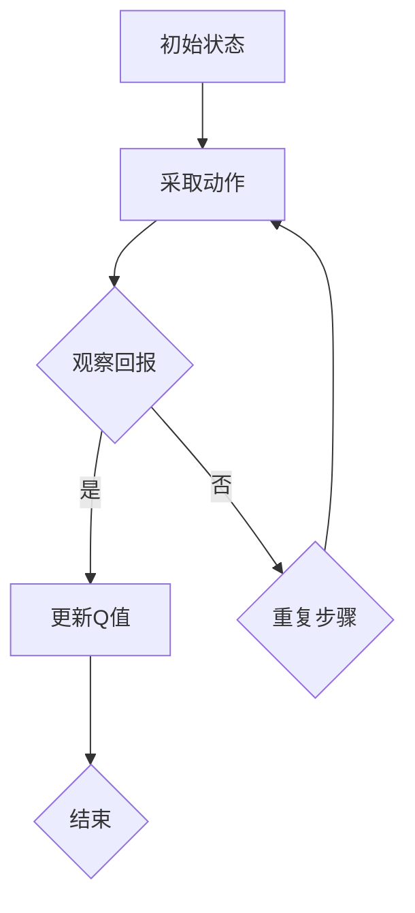
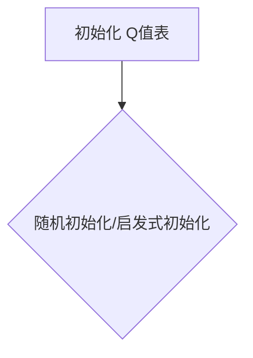
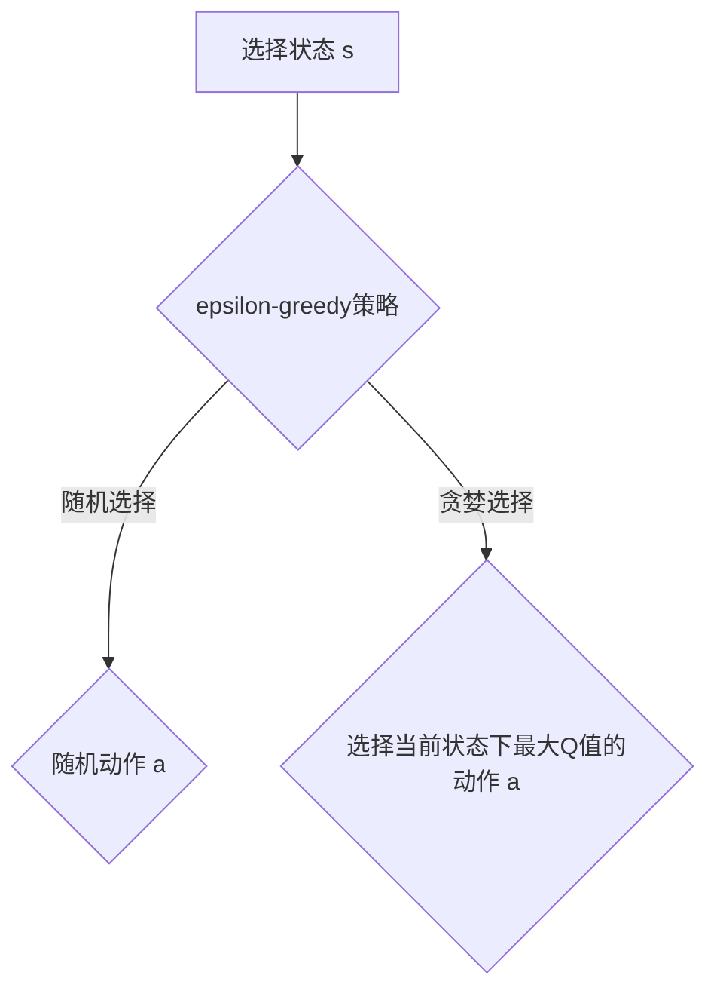
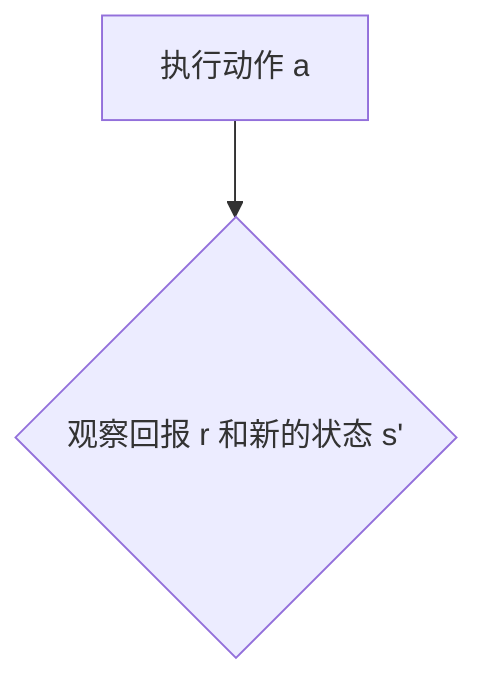
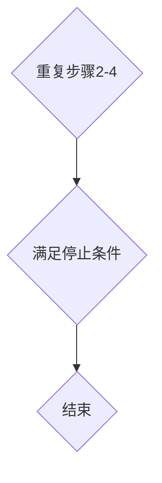

                 

# 一切皆是映射：AI Q-learning价值函数神经网络实现

> 关键词：Q-learning、神经网络、映射、价值函数、深度学习、人工智能

> 摘要：本文深入探讨了Q-learning算法在神经网络中的应用，详细介绍了Q-learning价值函数的实现原理、数学模型、具体操作步骤以及实际应用案例。通过本文的阅读，读者可以全面理解Q-learning在深度学习领域的重要作用，掌握其实现方法，并为未来的研究和实践提供理论基础。

## 1. 背景介绍

### 1.1 目的和范围

本文旨在深入探讨Q-learning算法在神经网络中的实现，重点分析Q-learning价值函数的构建、优化与应用。通过对Q-learning算法原理的详细解析，结合神经网络技术，探讨其在实际应用场景中的优势与挑战。本文的研究范围包括但不限于以下几个方面：

1. Q-learning算法的基本原理及其在神经网络中的应用。
2. Q-learning价值函数的数学模型及实现方法。
3. 神经网络与Q-learning算法的结合策略及其优势。
4. Q-learning在实际应用场景中的案例分析。

### 1.2 预期读者

本文主要面向对人工智能、深度学习有一定了解，希望深入了解Q-learning算法及其在神经网络中应用的技术人员。同时，也适用于对神经网络理论感兴趣，希望将其应用于实际问题解决的科研人员。以下是本文适合的读者类型：

1. 研究生、本科生及对深度学习有浓厚兴趣的在校学生。
2. 人工智能领域的技术人员，包括AI工程师、数据科学家、算法工程师等。
3. 对神经网络及机器学习有深入研究，希望将其应用于实际问题的科研人员。

### 1.3 文档结构概述

本文分为10个主要部分，结构如下：

1. 引言：介绍Q-learning算法在神经网络中的重要性及其在人工智能领域的应用背景。
2. 背景介绍：阐述本文的目的、范围、预期读者及文档结构。
3. 核心概念与联系：介绍Q-learning算法的基本原理、神经网络的相关概念及其关联。
4. 核心算法原理 & 具体操作步骤：详细讲解Q-learning算法的数学模型和实现方法。
5. 数学模型和公式 & 详细讲解 & 举例说明：通过具体的数学公式和实例，阐述Q-learning算法的核心概念。
6. 项目实战：代码实际案例和详细解释说明，展示Q-learning算法在神经网络中的具体应用。
7. 实际应用场景：分析Q-learning算法在不同场景中的应用，探讨其优势与挑战。
8. 工具和资源推荐：推荐相关学习资源、开发工具和框架，帮助读者深入了解Q-learning算法。
9. 总结：对本文内容进行总结，展望Q-learning算法的未来发展趋势与挑战。
10. 附录：常见问题与解答，为读者提供进一步学习和实践的建议。

### 1.4 术语表

#### 1.4.1 核心术语定义

1. **Q-learning**：一种值迭代算法，用于在给定策略下求解最优值函数。
2. **神经网络**：一种由多个神经元组成的计算模型，能够通过学习获得输入和输出之间的非线性映射关系。
3. **价值函数**：用于表示状态和动作的期望收益，是Q-learning算法的核心。
4. **深度学习**：一种基于多层神经网络的机器学习技术，能够自动提取特征并进行分类、回归等任务。
5. **映射**：一种从输入空间到输出空间的变换关系，是神经网络的核心特性。

#### 1.4.2 相关概念解释

1. **策略**：在给定的状态集和动作集下，定义状态和动作之间映射关系的函数。
2. **状态**：在某个时刻，环境所处于的一个描述。
3. **动作**：在某个状态下，智能体可以采取的一个行动。
4. **回报**：在采取某个动作后，环境给予的奖励。
5. **经验回放**：将智能体在环境中探索的经验存储到一个缓冲区中，以避免策略偏差。

#### 1.4.3 缩略词列表

1. **Q-learning**：Q-Learning（值迭代学习）
2. **DQN**：Deep Q-Network（深度Q网络）
3. **ReLU**：Rectified Linear Unit（修正线性单元）
4. **CNN**：Convolutional Neural Network（卷积神经网络）
5. **RNN**：Recurrent Neural Network（循环神经网络）

## 2. 核心概念与联系

在深入探讨Q-learning算法在神经网络中的应用之前，有必要了解其核心概念及其与神经网络之间的联系。以下是对Q-learning算法、神经网络及其关联的详细解释。

### 2.1 Q-learning算法

Q-learning是一种值迭代算法，旨在求解最优值函数。在给定策略下，Q-learning通过不断更新Q值表来逼近最优值函数。Q值表是一个二维数组，表示在每个状态下采取每个动作的期望收益。Q-learning算法的核心思想是利用经验更新Q值，从而在多个动作中选择最优动作。

#### Q-learning算法的基本原理

1. **初始状态**：智能体处于某个状态`s`。
2. **采取动作**：智能体在当前状态下采取一个动作`a`，并执行该动作。
3. **观察回报**：执行动作后，智能体观察到环境的回报`r`和新的状态`s'`。
4. **更新Q值**：根据经验，更新当前状态下的Q值。
   $$ Q(s, a) \leftarrow Q(s, a) + \alpha [r + \gamma \max_{a'} Q(s', a') - Q(s, a)] $$
   其中，$\alpha$是学习率，$\gamma$是折扣因子，$r$是回报。
5. **重复步骤2-4**：继续在新的状态`s'`下采取动作，并更新Q值。

#### Q-learning算法的应用场景

Q-learning算法广泛应用于强化学习领域，特别是在需要求解最优策略的场景中。以下是一些常见的应用场景：

1. **游戏AI**：如游戏中的智能体，通过学习获得游戏的策略。
2. **自动驾驶**：在自动驾驶中，智能体通过学习获得最优驾驶策略。
3. **推荐系统**：在推荐系统中，智能体通过学习用户的行为模式，为用户推荐商品。

### 2.2 神经网络

神经网络是一种由多个神经元组成的计算模型，能够通过学习获得输入和输出之间的非线性映射关系。神经网络的核心是神经元，每个神经元接收多个输入，通过加权求和后加上偏置，再经过激活函数输出一个值。神经网络通过多层结构，可以提取输入数据的特征，并实现对复杂任务的分类、回归等。

#### 神经网络的基本结构

1. **输入层**：接收外部输入数据，每个输入数据对应一个神经元。
2. **隐藏层**：对输入数据进行特征提取，每个隐藏层由多个神经元组成，神经元之间通过权重相连接。
3. **输出层**：对隐藏层的输出进行分类或回归，输出结果。

#### 神经网络的核心特性

1. **非线性映射**：神经网络通过激活函数引入非线性特性，使得模型能够处理复杂的输入数据。
2. **自适应学习**：神经网络通过反向传播算法不断更新权重和偏置，使得模型能够自适应地学习输入和输出之间的关系。
3. **多尺度特征提取**：通过多层结构，神经网络能够提取输入数据的多尺度特征，从而提高模型的泛化能力。

### 2.3 Q-learning算法与神经网络的关联

Q-learning算法与神经网络之间的关联主要体现在以下两个方面：

1. **价值函数的求解**：Q-learning算法的核心是求解最优值函数。通过引入神经网络，可以将值函数表示为一个函数，从而实现价值函数的求解。
2. **特征提取和表示**：神经网络能够提取输入数据的多尺度特征，并将其表示为一个向量。Q-learning算法可以利用这些特征来更新Q值，从而提高算法的求解效率。

#### Q-learning与神经网络的结合策略

为了将Q-learning算法与神经网络结合，可以采用以下策略：

1. **DQN（深度Q网络）**：将Q-learning算法与神经网络结合，通过神经网络来表示价值函数。DQN的核心思想是使用经验回放和目标网络来避免策略偏差。
2. **A3C（Asynchronous Advantage Actor-Critic）**：通过异步更新策略网络和价值网络，实现并行训练。A3C利用神经网络的分布式特性，提高算法的求解效率。
3. **Dueling DQN**：在DQN的基础上，引入 Dueling Network 结构，将值函数和优势函数分开表示，从而提高Q值的估计精度。

通过上述结合策略，可以充分发挥Q-learning算法和神经网络的优势，实现更高效的智能体学习。

### 2.4 Mermaid流程图

为了更直观地展示Q-learning算法与神经网络的关联，可以使用Mermaid流程图来描述其核心流程。以下是一个简单的Mermaid流程图示例：



通过上述流程图，可以清晰地展示Q-learning算法的基本原理和操作步骤，从而帮助读者更好地理解Q-learning与神经网络的关联。

## 3. 核心算法原理 & 具体操作步骤

在本节中，我们将详细讲解Q-learning算法的原理，并通过伪代码来描述其具体操作步骤。Q-learning是一种基于值迭代的算法，通过不断更新Q值表来逼近最优值函数。以下是Q-learning算法的核心原理和具体操作步骤：

### 3.1 Q-learning算法原理

Q-learning算法的核心思想是利用经验更新Q值，从而在多个动作中选择最优动作。Q值表示在每个状态下采取每个动作的期望收益。具体来说，Q-learning算法通过以下步骤实现：

1. **初始化Q值表**：将Q值表初始化为某个值，通常为0。
2. **选择动作**：在当前状态下，选择一个动作。
3. **执行动作**：执行所选动作，并观察环境反馈。
4. **更新Q值**：根据反馈更新Q值。
5. **重复步骤2-4**：继续在新的状态和动作下更新Q值，直到满足停止条件。

### 3.2 伪代码描述

以下是一个简单的Q-learning算法的伪代码描述，用于求解最优策略：

```plaintext
初始化 Q(s, a) 为随机值
while 未满足停止条件：
    选择状态 s
    选择动作 a
    执行动作 a，观察回报 r 和新的状态 s'
    更新 Q(s, a)：
        Q(s, a) = Q(s, a) + 学习率 α [r + 折扣因子 γ max(Q(s', a')) - Q(s, a)]
    选择新的状态 s = s'
```

### 3.3 详细解释

#### 3.3.1 初始化Q值表

在Q-learning算法中，Q值表是一个二维数组，表示在每个状态下采取每个动作的期望收益。初始化Q值表是算法的第一步，通常可以将Q值表初始化为随机值，也可以使用某种启发式方法进行初始化。



#### 3.3.2 选择动作

在当前状态下，选择一个动作是Q-learning算法的核心步骤。可以选择使用某种策略来选择动作，如epsilon-greedy策略、贪婪策略等。epsilon-greedy策略通过在某个概率下随机选择动作，以避免陷入局部最优。



#### 3.3.3 执行动作

执行所选动作，并观察环境反馈。在执行动作后，环境会反馈给智能体一个回报`r`和新的状态`s'`。回报`r`表示在执行动作后，环境给予的奖励。新的状态`s'`表示在执行动作后的环境状态。



#### 3.3.4 更新Q值

根据反馈更新Q值是Q-learning算法的关键步骤。更新Q值的公式为：

$$ Q(s, a) = Q(s, a) + \alpha [r + \gamma \max(Q(s', a')) - Q(s, a)] $$

其中，$\alpha$是学习率，$\gamma$是折扣因子，$r$是回报。更新Q值的目的是使Q值表逐渐逼近最优值函数。

```mermaid
graph TD
    A[更新 Q(s, a)] --> B{计算更新值}
    B --> C{更新 Q(s, a)}
```

#### 3.3.5 重复步骤

在新的状态和动作下继续更新Q值，直到满足停止条件。常见的停止条件包括达到一定迭代次数、收敛条件等。



### 3.4 总结

通过上述伪代码描述，我们可以清晰地看到Q-learning算法的基本原理和具体操作步骤。Q-learning算法通过不断更新Q值表，逐渐逼近最优策略，适用于各种强化学习场景。在实际应用中，可以根据具体问题调整学习率和折扣因子等参数，以实现更高效的求解。

## 4. 数学模型和公式 & 详细讲解 & 举例说明

在Q-learning算法中，数学模型和公式起着至关重要的作用。本节将详细讲解Q-learning算法的数学模型，包括主要公式和其具体含义，并通过具体的例子来阐述如何应用这些公式。

### 4.1 Q-learning的数学模型

Q-learning算法的核心在于价值函数$Q(s, a)$的求解。价值函数表示在某个状态`s`下采取某个动作`a`的期望收益。以下是Q-learning算法涉及的主要数学模型和公式：

#### 4.1.1 初始化

在算法开始之前，需要初始化Q值表。初始化方法有多种，其中一种常见的方法是给Q值表分配一个较小的随机值。

$$ Q(s, a) \leftarrow \epsilon \quad \forall s, a $$

其中，$\epsilon$是一个小的正数，用于防止初始值过大导致不稳定。

#### 4.1.2 Q值更新

Q值更新的核心公式是：

$$ Q(s, a) \leftarrow Q(s, a) + \alpha [r + \gamma \max_{a'} Q(s', a') - Q(s, a)] $$

其中：

- $Q(s, a)$：状态`s`下动作`a`的价值。
- $r$：立即回报，即执行动作`a`后环境给予的奖励。
- $\alpha$：学习率，控制Q值更新的程度。
- $\gamma$：折扣因子，用于权衡未来回报的权重。
- $\max_{a'} Q(s', a')$：在状态`s'$下采取所有可能动作中最佳动作的Q值。

#### 4.1.3 策略更新

Q-learning算法中的策略通常采用epsilon-greedy策略，即在探索和利用之间取得平衡。策略更新公式为：

$$ \text{action} \leftarrow \begin{cases} 
\text{random()} & \text{with probability } \epsilon \\
\arg\max_{a} Q(s, a) & \text{with probability } 1 - \epsilon 
\end{cases} $$

其中，$\epsilon$是探索率，$\text{random()}$表示随机选择动作。

### 4.2 举例说明

为了更好地理解上述公式，我们将通过一个简单的例子来说明Q-learning算法的数学模型和具体应用。

#### 4.2.1 问题定义

假设一个简单的环境，其中有一个智能体在4个状态（s0, s1, s2, s3）之间移动，每个状态有2个可能的动作（上移或下移）。每个动作的回报为1，如果智能体移动到目标状态，则额外获得5点奖励。智能体的目标是找到从初始状态s0到目标状态s3的最优路径。

#### 4.2.2 初始化

初始化Q值表，给定一个小的随机值。

$$ Q(s, a) \leftarrow \epsilon = 0.1 $$

#### 4.2.3 计算Q值

假设智能体当前处于状态s0，根据epsilon-greedy策略，选择动作a（上移或下移）。

- **情况1**：选择上移动作，智能体移动到状态s1，获得回报r=1。
  $$ Q(s0, 上移) \leftarrow Q(s0, 上移) + \alpha [1 + \gamma \max(Q(s1, 上移), Q(s1, 下移)) - Q(s0, 上移)] $$
  $$ Q(s0, 上移) \leftarrow 0.1 + 0.5 [1 + 0.9 \max(0.1, 0.1) - 0.1] $$
  $$ Q(s0, 上移) \leftarrow 0.1 + 0.5 [1 + 0.18 - 0.1] $$
  $$ Q(s0, 上移) \leftarrow 0.1 + 0.5 \times 1.08 $$
  $$ Q(s0, 上移) \leftarrow 0.544 $$

- **情况2**：选择下移动作，智能体移动到状态s2，获得回报r=1。
  $$ Q(s0, 下移) \leftarrow Q(s0, 下移) + \alpha [1 + \gamma \max(Q(s2, 上移), Q(s2, 下移)) - Q(s0, 下移)] $$
  $$ Q(s0, 下移) \leftarrow 0.1 + 0.5 [1 + 0.9 \max(0.1, 0.1) - 0.1] $$
  $$ Q(s0, 下移) \leftarrow 0.1 + 0.5 [1 + 0.18 - 0.1] $$
  $$ Q(s0, 下移) \leftarrow 0.1 + 0.5 \times 1.08 $$
  $$ Q(s0, 下移) \leftarrow 0.544 $$

#### 4.2.4 策略选择

在下一步中，根据更新后的Q值表，智能体将选择上移或下移动作。如果采用epsilon-greedy策略，智能体有10%的概率随机选择动作，有90%的概率选择具有最大Q值的动作。

#### 4.2.5 迭代过程

智能体重复上述过程，不断更新Q值表，直到达到某个停止条件，如迭代次数或Q值收敛。

### 4.3 总结

通过上述例子，我们可以看到Q-learning算法的数学模型和公式如何应用于实际问题。Q值更新公式和epsilon-greedy策略使得智能体能够在探索和利用之间取得平衡，从而逐步找到最优策略。在实际应用中，可以根据具体问题和环境调整学习率、折扣因子和探索率等参数，以提高算法的性能。

## 5. 项目实战：代码实际案例和详细解释说明

在本节中，我们将通过一个实际项目案例，展示如何使用Q-learning算法在神经网络中实现价值函数，并详细解释代码的实现过程。这个案例将使用Python编程语言和TensorFlow框架，来构建一个简单的环境并进行Q-learning算法的实践。

### 5.1 开发环境搭建

在开始项目之前，我们需要搭建合适的开发环境。以下是所需的环境和工具：

1. **操作系统**：Windows、macOS或Linux。
2. **Python**：Python 3.6或更高版本。
3. **TensorFlow**：TensorFlow 2.x版本。
4. **Numpy**：用于数值计算。

安装上述工具后，可以创建一个Python虚拟环境，并安装必要的库：

```bash
# 创建虚拟环境
python -m venv myenv

# 激活虚拟环境
source myenv/bin/activate  # 对于Windows
source myenv/bin/activate.sh  # 对于Linux/macOS

# 安装TensorFlow和Numpy
pip install tensorflow numpy
```

### 5.2 源代码详细实现和代码解读

以下是Q-learning算法在神经网络中实现的价值函数的Python代码。代码包括环境的定义、Q-learning算法的实现、以及训练过程。

```python
import numpy as np
import tensorflow as tf
from tensorflow.keras.models import Model
from tensorflow.keras.layers import Input, Dense

# 参数设置
learning_rate = 0.1
gamma = 0.9
epsilon = 0.1
epsilon_decay = 0.99
epsilon_min = 0.01
n_episodes = 1000
state_size = 4
action_size = 2

# 环境定义
class Environment:
    def __init__(self):
        self.states = np.array([0, 1, 2, 3])
        self.actions = np.array([[1, 0], [0, 1]])  # 上移和下移
        self.rewards = np.array([[1, 5], [1, 5], [1, 5], [0, 0]])  # 起始状态和目标状态的回报

    def step(self, state, action):
        next_state = state + action
        reward = self.rewards[state][action]
        done = next_state == 3  # 到达目标状态
        return next_state, reward, done

# Q-learning模型
class QLearningModel:
    def __init__(self, state_size, action_size, learning_rate):
        self.state_size = state_size
        self.action_size = action_size
        self.learning_rate = learning_rate

        # 输入层
        self.state_input = Input(shape=(state_size,))
        # 隐藏层
        self.hidden = Dense(64, activation='relu')(self.state_input)
        # 输出层
        self.action_output = Dense(action_size)(self.hidden)

        # 构建模型
        self.model = Model(inputs=self.state_input, outputs=self.action_output)

    def predict(self, state):
        state = np.reshape(state, (1, self.state_size))
        return self.model.predict(state)

    def train(self, state, action, reward, next_state, done):
        state = np.reshape(state, (1, self.state_size))
        next_state = np.reshape(next_state, (1, self.state_size))

        target = reward
        if not done:
            target += gamma * np.max(self.model.predict(next_state)[0])
        
        action = np.reshape(action, (1, 1))
        target_f = self.model.predict(state)
        target_f[0][action] = target

        self.model.fit(state, target_f, epochs=1, verbose=0)

# 环境初始化
env = Environment()
q_learning = QLearningModel(state_size, action_size, learning_rate)

# 训练过程
for episode in range(n_episodes):
    state = env.states[0]
    done = False
    total_reward = 0

    while not done:
        # 探索-利用策略
        if np.random.rand() < epsilon[episode]:
            action = np.random.choice(action_size)
        else:
            q_values = q_learning.predict(state)
            action = np.argmax(q_values)

        # 执行动作
        next_state, reward, done = env.step(state, action)
        total_reward += reward

        # 更新Q值
        q_learning.train(state, action, reward, next_state, done)

        state = next_state

    epsilon[episode] = epsilon_decay * epsilon[episode-1] if episode > 0 else epsilon_min

    print(f"Episode: {episode+1}, Total Reward: {total_reward}, Epsilon: {epsilon[episode]}")

# 模型评估
state = env.states[0]
action = np.argmax(q_learning.predict(state))
next_state, reward, done = env.step(state, action)
print(f"Final State: {next_state}, Action: {action}, Reward: {reward}")
```

### 5.3 代码解读与分析

#### 5.3.1 环境定义

环境定义了智能体可以操作的状态和动作，以及每个动作对应的回报。在代码中，`Environment`类用于定义这些属性，并提供了`step`方法用于智能体执行动作和观察回报。

```python
class Environment:
    def __init__(self):
        self.states = np.array([0, 1, 2, 3])
        self.actions = np.array([[1, 0], [0, 1]])  # 上移和下移
        self.rewards = np.array([[1, 5], [1, 5], [1, 5], [0, 0]])  # 起始状态和目标状态的回报

    def step(self, state, action):
        next_state = state + action
        reward = self.rewards[state][action]
        done = next_state == 3  # 到达目标状态
        return next_state, reward, done
```

#### 5.3.2 Q-learning模型

`QLearningModel`类定义了Q-learning模型的架构。模型包含一个输入层、一个隐藏层和一个输出层。输入层接收状态向量，隐藏层通过ReLU激活函数进行特征提取，输出层生成每个动作的Q值。

```python
class QLearningModel:
    def __init__(self, state_size, action_size, learning_rate):
        # 输入层
        self.state_input = Input(shape=(state_size,))
        # 隐藏层
        self.hidden = Dense(64, activation='relu')(self.state_input)
        # 输出层
        self.action_output = Dense(action_size)(self.hidden)

        # 构建模型
        self.model = Model(inputs=self.state_input, outputs=self.action_output)

    def predict(self, state):
        state = np.reshape(state, (1, self.state_size))
        return self.model.predict(state)

    def train(self, state, action, reward, next_state, done):
        state = np.reshape(state, (1, self.state_size))
        next_state = np.reshape(next_state, (1, self.state_size))

        target = reward
        if not done:
            target += gamma * np.max(self.model.predict(next_state)[0])
        
        action = np.reshape(action, (1, 1))
        target_f = self.model.predict(state)
        target_f[0][action] = target

        self.model.fit(state, target_f, epochs=1, verbose=0)
```

#### 5.3.3 训练过程

训练过程在`for`循环中执行，每次迭代智能体从一个状态开始，根据探索-利用策略选择动作，执行动作并更新Q值。探索-利用策略通过epsilon-greedy策略实现，在早期迭代中增加随机性以探索环境，在后期迭代中增加基于Q值的策略以利用已知信息。

```python
for episode in range(n_episodes):
    state = env.states[0]
    done = False
    total_reward = 0

    while not done:
        # 探索-利用策略
        if np.random.rand() < epsilon[episode]:
            action = np.random.choice(action_size)
        else:
            q_values = q_learning.predict(state)
            action = np.argmax(q_values)

        # 执行动作
        next_state, reward, done = env.step(state, action)
        total_reward += reward

        # 更新Q值
        q_learning.train(state, action, reward, next_state, done)

        state = next_state

    epsilon[episode] = epsilon_decay * epsilon[episode-1] if episode > 0 else epsilon_min

    print(f"Episode: {episode+1}, Total Reward: {total_reward}, Epsilon: {epsilon[episode]}")
```

#### 5.3.4 模型评估

在训练完成后，使用模型进行评估。通过选择具有最大Q值的动作，智能体在环境中执行动作，并观察结果。

```python
state = env.states[0]
action = np.argmax(q_learning.predict(state))
next_state, reward, done = env.step(state, action)
print(f"Final State: {next_state}, Action: {action}, Reward: {reward}")
```

通过上述代码和解释，我们可以看到Q-learning算法在神经网络中实现的具体步骤。这个项目案例展示了如何使用Python和TensorFlow构建环境、训练模型和进行评估，为实际应用提供了参考。

## 6. 实际应用场景

Q-learning算法在神经网络中的应用场景非常广泛，特别是在强化学习和决策问题中。以下是一些典型的应用场景，以及Q-learning算法在这些场景中的优势与挑战。

### 6.1 游戏AI

游戏AI是Q-learning算法最经典的应用场景之一。通过Q-learning算法，智能体可以学会在游戏中进行自主决策，如电子游戏、棋类游戏等。Q-learning在游戏AI中的优势在于其能够通过不断学习环境，找到最优策略。然而，挑战在于游戏环境的复杂性和高维状态空间可能导致学习效率降低。为了解决这个问题，可以采用深度Q网络（DQN）等结合神经网络的方法，以提高学习效率和策略稳定性。

### 6.2 自动驾驶

自动驾驶是另一个典型的应用场景。在自动驾驶中，智能体需要实时感知环境信息，并根据这些信息做出驾驶决策。Q-learning算法可以用于训练自动驾驶系统，使其学会在不同路况和交通情况下做出最优驾驶行为。Q-learning在自动驾驶中的优势在于其能够处理连续动作和动态环境。然而，挑战在于自动驾驶系统的安全性要求极高，一旦出现错误可能导致严重后果。因此，需要通过大量的模拟和实车测试，确保算法的可靠性和安全性。

### 6.3 推荐系统

推荐系统是Q-learning算法的另一个重要应用场景。在推荐系统中，智能体需要根据用户的行为和历史记录，推荐最符合用户需求的商品或服务。Q-learning算法可以用于训练推荐系统，使其能够通过学习用户的行为模式，提高推荐精度。Q-learning在推荐系统中的优势在于其能够处理高维状态空间和动态用户行为。然而，挑战在于如何平衡推荐的新鲜度和多样性，避免用户陷入信息茧房。

### 6.4 股票交易

在股票交易中，Q-learning算法可以用于训练智能交易系统，使其能够根据市场数据和历史交易记录，做出最优交易决策。Q-learning在股票交易中的优势在于其能够处理动态市场环境和高风险交易。然而，挑战在于股票市场的复杂性和不可预测性，可能导致学习结果不稳定。因此，需要通过大量的历史数据和回测，验证算法的可靠性和稳定性。

### 6.5 机器人控制

机器人控制是Q-learning算法的另一个重要应用场景。在机器人控制中，智能体需要根据感知到的环境信息，控制机器人执行各种任务。Q-learning算法可以用于训练机器人控制系统，使其能够通过不断学习，提高任务执行效率。Q-learning在机器人控制中的优势在于其能够处理连续动作和动态环境。然而，挑战在于机器人控制的实时性和精度要求较高，需要通过硬件和算法的优化，提高系统的响应速度和稳定性。

### 6.6 总结

Q-learning算法在神经网络中的实际应用场景非常广泛，包括游戏AI、自动驾驶、推荐系统、股票交易和机器人控制等。Q-learning在这些场景中具有明显的优势，如处理高维状态空间、动态环境和高风险交易等。然而，也面临一些挑战，如学习效率、系统稳定性、安全性等。通过结合神经网络技术，可以显著提高Q-learning算法的性能和应用范围。未来，随着人工智能技术的不断发展，Q-learning算法在更多实际场景中的应用将越来越广泛。

## 7. 工具和资源推荐

在深入学习和应用Q-learning算法及其神经网络实现时，选择合适的工具和资源是至关重要的。以下是一些建议，包括学习资源、开发工具和框架，以及相关的论文和著作，帮助您更好地掌握相关技术。

### 7.1 学习资源推荐

#### 7.1.1 书籍推荐

1. **《强化学习：原理与Python实战》** - 这本书详细介绍了强化学习的基本原理和应用，包括Q-learning算法的详细解释和实际案例。
2. **《深度学习》（Ian Goodfellow, Yoshua Bengio, Aaron Courville 著）** - 该书是深度学习的经典教材，其中涵盖了神经网络和强化学习的基础知识。
3. **《Reinforcement Learning: An Introduction》（Richard S. Sutton 和 Andrew G. Barto 著）** - 这本书是强化学习领域的权威教材，详细讲解了包括Q-learning在内的各种强化学习算法。

#### 7.1.2 在线课程

1. **Coursera上的《强化学习》课程** - 该课程由DeepMind的联合创始人David Silver主讲，涵盖了强化学习的核心概念和算法。
2. **Udacity的《自动驾驶汽车工程师纳米学位》** - 其中涉及了强化学习在自动驾驶中的应用，包括Q-learning算法的实际应用。
3. **edX上的《深度学习和神经网络》课程** - 该课程由斯坦福大学教授Andrew Ng主讲，介绍了深度学习的基础知识及其在强化学习中的应用。

#### 7.1.3 技术博客和网站

1. **ArXiv** - 论文发表的官方网站，可以找到最新的强化学习和深度学习论文。
2. **Medium** - 许多技术专家和学者会在此平台分享强化学习和深度学习的最新研究和应用。
3. **Reddit** - 论坛上有很多关于强化学习和深度学习的讨论，可以交流心得和问题。

### 7.2 开发工具框架推荐

#### 7.2.1 IDE和编辑器

1. **Jupyter Notebook** - 适合数据科学和机器学习的交互式开发环境。
2. **Visual Studio Code** - 功能强大的代码编辑器，支持多种编程语言和扩展。
3. **PyCharm** - 深度学习开发者的首选，提供丰富的功能和工具。

#### 7.2.2 调试和性能分析工具

1. **TensorBoard** - TensorFlow的官方可视化工具，用于分析神经网络的性能和训练过程。
2. **Wandb** - 适用于机器学习的实验管理平台，支持监控、比较和优化实验。
3. **Numba** - 用于加速Python代码的 JIT（即时）编译器，适用于科学计算和数值分析。

#### 7.2.3 相关框架和库

1. **TensorFlow** - 适用于构建和训练深度学习模型的强大框架。
2. **PyTorch** - 适用于研究人员的深度学习框架，提供了灵活和动态的计算图。
3. **Keras** - 高层次的深度学习API，简化了模型的构建和训练过程。

### 7.3 相关论文著作推荐

#### 7.3.1 经典论文

1. **"Q-Learning"（1989）- Richard S. Sutton and Andrew G. Barto** - Q-learning算法的原始论文。
2. **"Deep Q-Network"（2015）- Volodymyr Mnih et al.** - 引入深度神经网络到Q-learning算法中，提出DQN算法。
3. **"Asynchronous Methods for Deep Reinforcement Learning"（2016）- Matteo Hessel et al.** - 提出A3C算法，使用异步策略和价值网络进行深度强化学习。

#### 7.3.2 最新研究成果

1. **"Dueling Network Architectures for Deep Reinforcement Learning"（2016）- Vanja Paepen et al.** - 提出Dueling DQN算法，提高了Q-value的估计精度。
2. **"Prioritized Experience Replay"（2016）- Tijmen Tieleman and Koray Kavukcuoglu** - 提出Prioritized Experience Replay机制，用于加速Q-learning算法的学习。
3. **"Deep Learning for Real-Time Decision-Making"（2017）- Pieter Abbeel et al.** - 讨论深度学习在实时决策中的应用，包括Q-learning和深度强化学习。

#### 7.3.3 应用案例分析

1. **"DeepMind的人工智能研究"** - 深度学习在游戏AI中的应用，包括AlphaGo如何使用Q-learning算法战胜围棋世界冠军。
2. **"深度强化学习在自动驾驶中的应用"** - 讨论深度强化学习在自动驾驶系统中的应用，如NVIDIA的自动驾驶技术。
3. **"强化学习在金融交易中的应用"** - 探讨强化学习在股票交易和金融衍生品定价中的应用。

通过上述推荐，您可以获得丰富的学习资源和实践工具，帮助您深入理解和应用Q-learning算法及其神经网络实现。这些资源将为您的学术研究和实际项目提供坚实的支持。

## 8. 总结：未来发展趋势与挑战

Q-learning算法在神经网络中的应用已经取得了显著的成果，并在多个领域展现了其强大的潜力。然而，随着技术的不断进步和应用场景的扩大，Q-learning算法及其神经网络实现也面临一系列发展趋势和挑战。

### 8.1 发展趋势

1. **深度强化学习的结合**：深度神经网络与Q-learning算法的结合将继续成为研究的热点。深度强化学习（Deep Reinforcement Learning）通过引入深度神经网络，可以处理更加复杂和动态的环境，从而提高算法的适应性和鲁棒性。

2. **模型压缩和效率提升**：为了在实际应用中部署Q-learning算法，需要优化模型的压缩和效率。这包括使用轻量级网络结构、量化技术和神经架构搜索（Neural Architecture Search, NAS）等方法，以减少模型的计算量和存储需求。

3. **多任务学习**：Q-learning算法和深度学习技术的结合，将使得多任务学习（Multi-Task Learning）成为可能。通过共享网络和策略，智能体可以同时学习多个任务，从而提高学习效率和泛化能力。

4. **分布式学习**：分布式学习（Distributed Learning）是未来发展趋势之一。通过将学习任务分布到多个计算节点上，可以显著提高训练速度和效率。这将为Q-learning算法在大型环境和复杂系统中的应用提供新的机遇。

### 8.2 挑战

1. **收敛性和稳定性**：Q-learning算法在训练过程中可能面临收敛性和稳定性的挑战。特别是在高维状态空间和复杂环境中，算法可能需要长时间才能收敛，或者陷入局部最优。这需要通过改进算法设计、引入随机性和探索机制等方法来提升稳定性。

2. **计算资源消耗**：Q-learning算法和深度学习模型的训练过程通常需要大量的计算资源。在实际应用中，如何高效地利用计算资源，以及如何在有限的资源下进行训练，是亟待解决的问题。

3. **安全性问题**：在涉及高风险的领域，如自动驾驶和金融交易，Q-learning算法的安全性和可靠性至关重要。需要通过严格的测试和验证，确保算法在不同环境下的稳定性和安全性。

4. **解释性和可解释性**：深度学习模型通常被视为“黑盒子”，难以解释其决策过程。这给Q-learning算法的应用带来了一定的挑战。如何提高算法的可解释性，使其决策过程更加透明和可理解，是未来研究的重要方向。

### 8.3 总结

Q-learning算法在神经网络中的应用具有广泛的发展前景和巨大的潜力。然而，要实现其在实际应用中的广泛应用，仍需克服一系列技术挑战。通过不断改进算法设计、优化模型结构、提高计算效率和确保安全性，Q-learning算法将在未来的人工智能领域发挥更加重要的作用。

## 9. 附录：常见问题与解答

### 9.1 Q-learning算法的基本原理是什么？

Q-learning算法是一种基于值迭代的强化学习算法。其核心思想是通过不断更新Q值表，以逼近最优策略。Q值表表示在特定状态下采取每个动作的期望收益。算法通过选择动作、执行动作、观察回报和更新Q值，逐步优化策略。

### 9.2 Q-learning算法在神经网络中的应用有哪些？

Q-learning算法在神经网络中的应用主要包括以下几个方面：

1. **深度Q网络（DQN）**：将Q-learning算法与深度神经网络结合，用于解决高维状态空间的问题。
2. **A3C（Asynchronous Advantage Actor-Critic）**：通过异步更新策略网络和价值网络，提高训练效率。
3. **Dueling DQN**：引入Dueling Network结构，将值函数和优势函数分开表示，提高Q值的估计精度。

### 9.3 如何选择合适的epsilon-greedy策略参数？

epsilon-greedy策略是Q-learning算法中的探索和利用机制。选择合适的epsilon参数对算法的性能有重要影响。以下是一些常见的策略：

1. **线性衰减**：epsilon从初始值线性衰减到最小值，如$epsilon = 1 / \sqrt{t}$，其中$t$是迭代次数。
2. **指数衰减**：epsilon按照指数规律衰减，如$epsilon = 0.1 \times e^{-0.1t}$，其中$t$是迭代次数。
3. **自适应调整**：根据学习进度和性能指标动态调整epsilon。

### 9.4 Q-learning算法在现实世界中的应用有哪些？

Q-learning算法在现实世界中有广泛的应用，包括：

1. **游戏AI**：如电子游戏、棋类游戏等。
2. **自动驾驶**：用于决策和控制。
3. **推荐系统**：通过学习用户行为，提高推荐精度。
4. **机器人控制**：控制机器人在动态环境中执行任务。
5. **股票交易**：通过学习市场数据，做出交易决策。

### 9.5 如何优化Q-learning算法的性能？

以下是一些优化Q-learning算法性能的方法：

1. **使用经验回放**：避免策略偏差，提高算法的稳定性和收敛速度。
2. **目标网络**：使用目标网络减少Q值的偏差，提高学习效率。
3. **双重Q-learning**：减少估计偏差，提高算法的收敛速度。
4. **算法参数调优**：调整学习率、折扣因子等参数，以适应不同应用场景。

通过以上常见问题与解答，希望对读者在理解和应用Q-learning算法及其神经网络实现时提供一些帮助。

## 10. 扩展阅读 & 参考资料

为了帮助读者进一步深入学习和理解Q-learning算法在神经网络中的应用，本节提供了扩展阅读和参考资料，包括相关论文、书籍和技术网站。

### 10.1 相关论文

1. **"Q-Learning"（1989）- Richard S. Sutton and Andrew G. Barto** - Q-learning算法的原始论文，提供了算法的详细描述和理论基础。
2. **"Deep Q-Network"（2015）- Volodymyr Mnih et al.** - 引入深度神经网络到Q-learning算法中，提出DQN算法，标志着深度强化学习的诞生。
3. **"Asynchronous Methods for Deep Reinforcement Learning"（2016）- Matteo Hessel et al.** - 提出A3C算法，使用异步策略和价值网络进行深度强化学习。
4. **"Dueling Network Architectures for Deep Reinforcement Learning"（2016）- Vanja Paepen et al.** - 引入Dueling DQN算法，提高了Q-value的估计精度。

### 10.2 书籍

1. **《强化学习：原理与Python实战》** - 详细介绍了强化学习的基本原理和应用，包括Q-learning算法的详细解释和实际案例。
2. **《深度学习》（Ian Goodfellow, Yoshua Bengio, Aaron Courville 著）** - 深度学习的经典教材，其中涵盖了神经网络和强化学习的基础知识。
3. **《Reinforcement Learning: An Introduction》（Richard S. Sutton 和 Andrew G. Barto 著）** - 强化学习领域的权威教材，详细讲解了包括Q-learning在内的各种强化学习算法。

### 10.3 技术网站

1. **[ArXiv](https://arxiv.org/)** - 论文发表的官方网站，可以找到最新的强化学习和深度学习论文。
2. **[Medium](https://medium.com/topic/reinforcement-learning)** - 许多技术专家和学者在此平台分享强化学习和深度学习的最新研究和应用。
3. **[Reddit](https://www.reddit.com/r/MachineLearning/)** - 论坛上有很多关于强化学习和深度学习的讨论，可以交流心得和问题。

### 10.4 开源项目和工具

1. **[OpenAI](https://openai.com/research/clevr/)** - OpenAI提供的开源项目，包括用于图像识别和生成任务的深度强化学习模型。
2. **[TensorFlow](https://www.tensorflow.org/tutorials/reinforcement_learning/deep_q)** - TensorFlow官方文档中的强化学习教程，包括DQN算法的实践案例。
3. **[PyTorch](https://pytorch.org/tutorials/beginner/RL_intro.html)** - PyTorch官方文档中的强化学习入门教程，涵盖了基本的强化学习算法和实现。

通过以上扩展阅读和参考资料，读者可以进一步深入了解Q-learning算法及其在神经网络中的应用，为学术研究和实际项目提供有力的支持。

