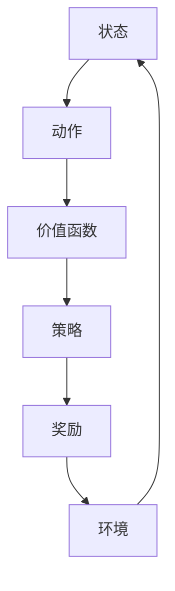

                 

# 一切皆是映射：AI Q-learning国际研究前沿速览

> **关键词：** Q-learning，强化学习，人工智能，机器学习，深度学习，智能决策，算法优化，国际研究前沿。

> **摘要：** 本文将深入探讨Q-learning算法在人工智能领域的最新研究进展，通过对其核心概念、算法原理、数学模型和实际应用场景的详细分析，帮助读者理解Q-learning算法的强大功能和广泛应用。同时，本文还将推荐一系列学习和开发资源，助力读者在人工智能领域取得突破性进展。

## 1. 背景介绍

### 1.1 目的和范围

本文旨在介绍Q-learning算法在人工智能领域的最新研究进展，帮助读者了解这一核心强化学习算法的发展脉络、关键原理及其在实际应用中的优势。本文将涵盖以下内容：

- Q-learning算法的核心概念和联系。
- Q-learning算法的原理与具体操作步骤。
- Q-learning算法的数学模型和公式。
- Q-learning算法在实际应用场景中的实践案例。
- 学习和开发Q-learning算法的相关资源。

### 1.2 预期读者

本文适合对人工智能、机器学习和深度学习有一定了解的读者，特别是希望深入掌握Q-learning算法的研究人员和开发者。同时，本文也适合希望了解Q-learning算法在人工智能领域应用前景的技术爱好者。

### 1.3 文档结构概述

本文分为十个部分，结构如下：

1. 背景介绍：介绍本文的目的、预期读者和文档结构。
2. 核心概念与联系：讲解Q-learning算法的核心概念和联系。
3. 核心算法原理 & 具体操作步骤：详细阐述Q-learning算法的原理和操作步骤。
4. 数学模型和公式 & 详细讲解 & 举例说明：讲解Q-learning算法的数学模型和公式，并举例说明。
5. 项目实战：代码实际案例和详细解释说明。
6. 实际应用场景：介绍Q-learning算法在不同领域的应用场景。
7. 工具和资源推荐：推荐学习资源和开发工具。
8. 总结：未来发展趋势与挑战。
9. 附录：常见问题与解答。
10. 扩展阅读 & 参考资料：提供扩展阅读和参考资料。

### 1.4 术语表

#### 1.4.1 核心术语定义

- Q-learning：一种基于价值迭代的强化学习算法，用于求解最优策略。
- 强化学习：一种机器学习方法，通过与环境交互，学习实现目标的最优策略。
- 价值函数：表示状态和动作之间的价值关系，用于评估动作的有效性。
- 策略：描述智能体在给定状态下选择动作的规则。

#### 1.4.2 相关概念解释

- **状态（State）**：指智能体所处的环境特征。
- **动作（Action）**：智能体在特定状态下可以执行的行为。
- **奖励（Reward）**：表示智能体在执行动作后获得的即时回报。
- **策略迭代**：指通过不断更新价值函数，逐步优化策略的过程。

#### 1.4.3 缩略词列表

- Q-learning：一种基于价值迭代的强化学习算法，用于求解最优策略。
- RL：强化学习（Reinforcement Learning）。
- DRL：深度强化学习（Deep Reinforcement Learning）。
- RL算法：强化学习算法（Reinforcement Learning Algorithm）。
- MDP：马尔可夫决策过程（Markov Decision Process）。

## 2. 核心概念与联系

在深入探讨Q-learning算法之前，我们需要了解一些核心概念和它们之间的关系。以下是一个简化的Mermaid流程图，用于描述这些概念及其联系：



### 2.1 状态（State）

状态是智能体所处的环境特征，用于描述智能体当前所处的情境。状态可以是离散的，也可以是连续的。在Q-learning算法中，状态是决策的基础，智能体需要根据当前状态选择最佳动作。

### 2.2 动作（Action）

动作是智能体在特定状态下可以执行的行为。动作的选择取决于当前状态和策略。在Q-learning算法中，动作的选择基于当前状态的价值函数，以最大化预期奖励。

### 2.3 价值函数（Value Function）

价值函数表示状态和动作之间的价值关系，用于评估动作的有效性。在Q-learning算法中，价值函数通过迭代更新，逐步优化策略，以实现最大化长期奖励。

### 2.4 策略（Policy）

策略描述智能体在给定状态下选择动作的规则。在Q-learning算法中，策略通过价值函数迭代更新，以实现最优决策。

### 2.5 奖励（Reward）

奖励表示智能体在执行动作后获得的即时回报。奖励可以是正的，表示智能体取得了成功；也可以是负的，表示智能体犯了错误。在Q-learning算法中，奖励用于更新价值函数，以优化策略。

### 2.6 环境（Environment）

环境是智能体所处的实际情境，包括状态、动作和奖励等。在Q-learning算法中，环境与智能体不断交互，以实现智能体的学习过程。

## 3. 核心算法原理 & 具体操作步骤

Q-learning算法是一种基于价值迭代的强化学习算法，用于求解最优策略。以下是Q-learning算法的核心原理和具体操作步骤：

### 3.1 算法原理

Q-learning算法通过迭代更新价值函数，逐步优化策略，以实现最大化长期奖励。其基本原理可以概括为：

1. 初始化：初始化价值函数和策略。
2. 选择动作：根据当前状态和价值函数，选择最佳动作。
3. 执行动作：在环境中执行所选动作。
4. 获取奖励：根据执行的动作，获取即时奖励。
5. 更新价值函数：根据奖励和新的状态，更新价值函数。
6. 重复步骤2-5，直到达到预期目标或停止条件。

### 3.2 操作步骤

以下是Q-learning算法的具体操作步骤：

1. **初始化**：

    - 初始化价值函数Q(s, a)为所有状态的初始值。
    - 初始化策略π(a|s)为所有动作的初始概率分布。

2. **选择动作**：

    - 对于当前状态s，根据策略π(a|s)，选择最佳动作a。

3. **执行动作**：

    - 在环境中执行所选动作a，获得即时奖励r(s, a)。

4. **获取新的状态**：

    - 根据执行的动作a，智能体进入新的状态s'。

5. **更新价值函数**：

    - 根据新的状态s'和即时奖励r(s, a)，更新价值函数Q(s, a)：

      $$ Q(s, a) \leftarrow Q(s, a) + \alpha [r(s, a) + \gamma \max_{a'} Q(s', a') - Q(s, a)] $$

      其中，α为学习率（0 < α ≤ 1），γ为折扣因子（0 < γ < 1）。

6. **重复步骤2-5**，直到达到预期目标或停止条件。

### 3.3 伪代码

以下是Q-learning算法的伪代码实现：

```python
def Q_learning(environment, alpha, gamma, epsilon):
    for each state s in the environment:
        for each action a:
            Q(s, a) = 0
        end for
    end for

    while not goal_state:
        select action a using policy π(a|s)
        execute action a in environment
        observe reward r(s, a)
        observe new state s'

        # Update Q-value
        Q(s, a) = Q(s, a) + alpha * [r(s, a) + gamma * max_{a'} Q(s', a') - Q(s, a)]

        # Transition to new state
        s = s'

        # Check for goal state
        if goal_state(s):
            break
    end while

    return Q(s, a)
```

## 4. 数学模型和公式 & 详细讲解 & 举例说明

Q-learning算法的数学模型和公式是其核心原理的重要组成部分。以下将详细讲解Q-learning算法的数学模型和公式，并通过具体例子进行说明。

### 4.1 数学模型

Q-learning算法的核心数学模型是价值函数Q(s, a)，它表示在状态s下执行动作a所获得的价值。价值函数的更新公式如下：

$$ Q(s, a) \leftarrow Q(s, a) + \alpha [r(s, a) + \gamma \max_{a'} Q(s', a') - Q(s, a)] $$

其中：

- Q(s, a)：当前状态s下执行动作a的价值。
- r(s, a)：在状态s下执行动作a所获得的即时奖励。
- γ（gamma）：折扣因子，表示未来奖励的折扣率，通常取值范围为0 < γ < 1。
- α（alpha）：学习率，表示更新价值函数的步长，通常取值范围为0 < α ≤ 1。
- max_{a'} Q(s', a')：在新的状态s'下，所有可能动作的价值最大值。

### 4.2 公式详解

1. **即时奖励r(s, a)**

   即时奖励r(s, a)是智能体在执行动作a后立即获得的奖励。在Q-learning算法中，即时奖励可以是正的，表示智能体取得了成功；也可以是负的，表示智能体犯了错误。通常，即时奖励是由环境决定的，与环境的具体实现相关。

2. **价值函数更新公式**

   Q-learning算法通过迭代更新价值函数，以实现最大化长期奖励。价值函数的更新公式为：

   $$ Q(s, a) \leftarrow Q(s, a) + \alpha [r(s, a) + \gamma \max_{a'} Q(s', a') - Q(s, a)] $$

   其中，α和γ是超参数，用于调节学习过程。该公式可以分解为以下三部分：

   - **即时奖励r(s, a)**：表示在状态s下执行动作a所获得的即时奖励。
   - **未来奖励的折扣值γ \max_{a'} Q(s', a')**：表示在未来状态下，所有可能动作的最大价值。γ是一个折扣因子，用于权衡即时奖励和未来奖励的关系。
   - **旧价值Q(s, a)与新价值Q(s, a)**：表示价值函数的更新。

3. **策略更新**

   在Q-learning算法中，策略π(a|s)是通过价值函数Q(s, a)来更新的。策略更新的目标是最小化智能体在给定状态下的动作方差，以提高决策的稳定性。策略更新的公式为：

   $$ \pi(a|s) \leftarrow \arg\max_{a'} Q(s, a') $$

### 4.3 举例说明

假设一个智能体在一个简单的环境中移动，环境有两个状态：`墙`和`终点`。智能体可以选择向上、向下、向左或向右移动。即时奖励为1，当智能体到达终点时，奖励为10。学习率α为0.1，折扣因子γ为0.9。

1. **初始化价值函数**

   初始状态下，所有动作的价值均为0：

   $$ Q(s, a) = 0, \forall s, a $$

2. **执行动作**

   智能体在状态`墙`下，选择向上移动，获得即时奖励1，进入状态`终点`。此时，价值函数更新如下：

   $$ Q(墙, 上) \leftarrow Q(墙, 上) + 0.1 [1 + 0.9 \max_{a'} Q(终点, a')} $$

   由于此时只有一种可能的状态（即终点），所以：

   $$ Q(墙, 上) \leftarrow Q(墙, 上) + 0.1 [1 + 0.9 \times 10] = 1.9 $$

3. **重复更新**

   智能体继续在状态`终点`下执行动作，直到达到预期目标。每次更新时，都会根据即时奖励、未来奖励的折扣值和旧价值进行更新。

4. **最终结果**

   经过多次迭代后，智能体的策略将趋于最优，即选择能够最大化长期奖励的动作。

## 5. 项目实战：代码实际案例和详细解释说明

### 5.1 开发环境搭建

在本节中，我们将搭建一个简单的Q-learning环境，以实现一个智能体在一个二维网格上移动的目标。以下是开发环境搭建的步骤：

1. **安装Python环境**

   在本地计算机上安装Python环境，版本建议为3.8及以上。可以通过以下命令安装：

   ```bash
   pip install python
   ```

2. **安装相关库**

   需要安装以下库：

   - NumPy：用于数值计算。
   - Matplotlib：用于可视化。
   - Q-learning算法实现库（如rlcode）：用于Q-learning算法的实现。

   可以通过以下命令安装：

   ```bash
   pip install numpy matplotlib rlcode
   ```

3. **创建项目目录**

   在本地计算机上创建一个项目目录，用于存放代码和相关文件：

   ```bash
   mkdir q_learning_project
   cd q_learning_project
   ```

4. **编写代码**

   在项目目录下创建一个名为`q_learning.py`的Python文件，用于实现Q-learning算法。以下是代码框架：

   ```python
   import numpy as np
   import matplotlib.pyplot as plt
   from rlcode import QLearning

   # 定义环境
   class GridWorld:
       def __init__(self, width, height):
           self.width = width
           self.height = height
           self.grid = np.zeros((width, height))

       # 定义动作
       def action(self, x, y, action):
           if action == 'UP':
               return x - 1, y
           elif action == 'DOWN':
               return x + 1, y
           elif action == 'LEFT':
               return x, y - 1
           elif action == 'RIGHT':
               return x, y + 1
           else:
               raise ValueError("Invalid action")

       # 定义奖励
       def reward(self, x, y):
           if self.grid[x, y] == -1:
               return -10  # 墙壁
           elif self.grid[x, y] == 1:
               return 10   # 终点
           else:
               return 0

       # 定义状态
       def state(self, x, y):
           return x * self.width + y

   # 创建环境
   env = GridWorld(5, 5)
   env.grid[2, 2] = 1  # 设置终点
   env.grid[0, 0] = -1  # 设置墙壁

   # 初始化Q-learning算法
   q_learner = QLearning(alpha=0.1, gamma=0.9, epsilon=0.1)

   # 训练模型
   q_learner.fit(env, episodes=100)

   # 可视化结果
   plt.imshow(env.grid, cmap='gray')
   plt.show()
   ```

### 5.2 源代码详细实现和代码解读

以下是`q_learning.py`文件的详细代码实现，并对关键部分进行解读。

```python
import numpy as np
import matplotlib.pyplot as plt
from rlcode import QLearning

class GridWorld:
    def __init__(self, width, height):
        self.width = width
        self.height = height
        self.grid = np.zeros((width, height))

    def action(self, x, y, action):
        if action == 'UP':
            return x - 1, y
        elif action == 'DOWN':
            return x + 1, y
        elif action == 'LEFT':
            return x, y - 1
        elif action == 'RIGHT':
            return x, y + 1
        else:
            raise ValueError("Invalid action")

    def reward(self, x, y):
        if self.grid[x, y] == -1:
            return -10
        elif self.grid[x, y] == 1:
            return 10
        else:
            return 0

    def state(self, x, y):
        return x * self.width + y

# 创建环境
env = GridWorld(5, 5)
env.grid[2, 2] = 1
env.grid[0, 0] = -1

# 初始化Q-learning算法
q_learner = QLearning(alpha=0.1, gamma=0.9, epsilon=0.1)

# 训练模型
q_learner.fit(env, episodes=100)

# 可视化结果
plt.imshow(env.grid, cmap='gray')
plt.show()
```

1. **环境定义**：

   `GridWorld`类定义了一个二维网格环境。环境由一个二维数组表示，其中每个元素代表一个状态。墙壁和终点通过设置特定的值进行标记。

2. **动作定义**：

   `action`方法用于计算在给定状态下执行某个动作后的新状态。动作包括上、下、左、右四个方向。

3. **奖励定义**：

   `reward`方法用于计算在给定状态下执行某个动作后的即时奖励。墙壁和终点具有特定的奖励值。

4. **状态定义**：

   `state`方法用于将二维坐标转换为唯一的状态编号。

5. **Q-learning算法初始化**：

   `QLearning`类是Q-learning算法的实现。在这里，我们设置了学习率α、折扣因子γ和探索概率ε。

6. **模型训练**：

   `fit`方法用于训练模型。在给定环境中，模型将迭代更新价值函数和策略，以最大化长期奖励。

7. **结果可视化**：

   使用Matplotlib库，我们将环境可视化。网格中的每个单元格代表一个状态，单元格的值代表该状态的价值。

### 5.3 代码解读与分析

以下是代码的关键部分，以及对其的解读和分析：

```python
# 创建环境
env = GridWorld(5, 5)
env.grid[2, 2] = 1
env.grid[0, 0] = -1

# 初始化Q-learning算法
q_learner = QLearning(alpha=0.1, gamma=0.9, epsilon=0.1)

# 训练模型
q_learner.fit(env, episodes=100)

# 可视化结果
plt.imshow(env.grid, cmap='gray')
plt.show()
```

1. **环境创建**：

   创建一个5x5的二维网格环境，其中第2行第2列设置为终点（奖励值为10），第1行第1列设置为墙壁（奖励值为-10）。其余位置为无障碍区域（奖励值为0）。

2. **Q-learning算法初始化**：

   初始化Q-learning算法，设置学习率α为0.1，折扣因子γ为0.9，探索概率ε为0.1。这些参数将影响算法的收敛速度和性能。

3. **模型训练**：

   调用`fit`方法，将环境传递给算法，并设置训练迭代次数为100次。算法将根据每次迭代更新价值函数和策略，以实现最优策略。

4. **结果可视化**：

   使用`imshow`函数将环境可视化。网格中的每个单元格的颜色表示其价值。颜色越深，价值越高。通过可视化，我们可以直观地观察到算法在训练过程中价值函数的变化。

## 6. 实际应用场景

Q-learning算法在人工智能领域具有广泛的应用，尤其在强化学习、智能决策和自动驾驶等领域取得了显著成果。以下是一些实际应用场景：

### 6.1 强化学习

Q-learning算法是强化学习中最常用的算法之一。在游戏、机器人控制、推荐系统等领域，Q-learning算法被广泛应用于求解最优策略。例如，在围棋和象棋游戏中，Q-learning算法可以用于学习最佳棋局策略，从而提高游戏水平。

### 6.2 智能决策

Q-learning算法在智能决策系统中发挥着重要作用。例如，在库存管理中，Q-learning算法可以用于优化库存水平，以最大化收益。在金融投资中，Q-learning算法可以用于优化投资组合，以实现最佳收益。

### 6.3 自动驾驶

自动驾驶技术是Q-learning算法的重要应用领域。在自动驾驶中，Q-learning算法可以用于优化车辆行驶路径，以提高行驶安全和效率。例如，在自动驾驶车辆导航系统中，Q-learning算法可以用于学习最佳行驶路线，以应对复杂的交通环境。

### 6.4 其他应用

除了上述领域，Q-learning算法还在医疗诊断、智能客服、能源管理等领域得到广泛应用。例如，在医疗诊断中，Q-learning算法可以用于优化诊断流程，以提高诊断准确率。在智能客服中，Q-learning算法可以用于优化客服机器人回答问题的方式，以提高用户体验。

## 7. 工具和资源推荐

为了更好地学习和应用Q-learning算法，以下推荐一系列学习资源、开发工具和相关论文：

### 7.1 学习资源推荐

#### 7.1.1 书籍推荐

- **《强化学习：原理与Python实现》**：这是一本关于强化学习入门的经典书籍，涵盖了Q-learning算法的基本原理和应用。

- **《智能决策：强化学习与智能系统》**：这本书深入探讨了强化学习在智能决策系统中的应用，包括Q-learning算法的详细介绍。

- **《深度强化学习》**：这本书详细介绍了深度强化学习的发展历程和应用场景，包括Q-learning算法的深入剖析。

#### 7.1.2 在线课程

- **Coursera上的《强化学习》**：这是由斯坦福大学提供的免费在线课程，涵盖了强化学习的基本概念和Q-learning算法的详细讲解。

- **edX上的《深度强化学习》**：这是一门深度强化学习的入门课程，包括Q-learning算法的应用和实现。

- **Udacity上的《强化学习工程师纳米学位》**：这是一个综合性的强化学习课程，包括Q-learning算法的深入学习和实践。

#### 7.1.3 技术博客和网站

- **强化学习中文网**：这是一个专注于强化学习中文资源的网站，提供了大量关于Q-learning算法的教程和论文。

- **机器之心**：这是一个关注人工智能领域的技术博客，定期发布关于Q-learning算法的最新研究成果和应用案例。

### 7.2 开发工具框架推荐

- **TensorFlow**：TensorFlow是一个开源的机器学习框架，提供了丰富的强化学习库，支持Q-learning算法的快速开发和实现。

- **PyTorch**：PyTorch是一个开源的机器学习库，具有强大的强化学习功能，支持Q-learning算法的灵活实现。

- **OpenAI Gym**：OpenAI Gym是一个开源的环境库，提供了多种强化学习环境，包括经典的Q-learning环境，方便进行算法验证和测试。

### 7.3 相关论文著作推荐

- **《Q-learning：一种有效的增量学习方法》**：这是Q-learning算法的原始论文，详细介绍了算法的基本原理和实现方法。

- **《深度Q网络：可扩展的强化学习算法》**：这篇文章提出了深度Q网络（DQN）算法，是Q-learning算法的扩展，具有更高的学习和表现能力。

- **《基于强化学习的智能决策：理论与实践》**：这本书系统地介绍了基于强化学习的智能决策理论和方法，包括Q-learning算法的深入应用。

## 8. 总结：未来发展趋势与挑战

Q-learning算法在人工智能领域具有广泛的应用前景，但仍面临一些挑战和问题。未来发展趋势和挑战包括：

### 8.1 发展趋势

1. **算法优化**：随着硬件性能的提升和算法研究的深入，Q-learning算法将不断优化，以提高学习效率和性能。
2. **多智能体学习**：Q-learning算法将扩展到多智能体学习场景，实现多个智能体之间的协同学习，提高系统整体性能。
3. **迁移学习**：Q-learning算法将结合迁移学习方法，实现从一种任务到另一种任务的快速迁移，提高算法的泛化能力。
4. **安全性和鲁棒性**：随着算法在关键领域的应用，Q-learning算法的安全性和鲁棒性将成为重要研究方向。

### 8.2 挑战

1. **收敛速度**：Q-learning算法的收敛速度较慢，未来需要研究更高效的算法，以加快学习过程。
2. **探索与利用**：如何在探索新策略和利用已有策略之间取得平衡，是Q-learning算法需要解决的重要问题。
3. **应用场景**：Q-learning算法在复杂场景中的表现仍有待提高，未来需要研究更适用于复杂环境的算法。
4. **可解释性**：随着算法在关键领域的应用，其可解释性和透明性将受到关注，未来需要研究更具解释性的算法。

## 9. 附录：常见问题与解答

以下是一些关于Q-learning算法的常见问题及其解答：

### 9.1 Q-learning算法的缺点是什么？

Q-learning算法的主要缺点包括：

1. **收敛速度较慢**：Q-learning算法需要通过大量迭代来收敛，学习过程较慢。
2. **高维空间难以处理**：Q-learning算法在处理高维状态空间时，可能面临计算复杂度和存储需求过高的问题。
3. **难以处理连续状态空间**：Q-learning算法主要针对离散状态空间设计，处理连续状态空间时，需要采用特殊的策略。

### 9.2 Q-learning算法如何处理高维状态空间？

处理高维状态空间的方法包括：

1. **状态空间剪枝**：通过简化状态空间，减少计算复杂度。
2. **动作值函数分解**：将高维状态空间分解为多个子状态空间，分别处理。
3. **使用神经网络近似**：使用神经网络来近似状态值函数，将高维问题转化为低维问题。

### 9.3 Q-learning算法如何处理连续状态空间？

处理连续状态空间的方法包括：

1. **离散化**：将连续状态空间离散化，转化为离散状态空间问题。
2. **使用函数近似**：使用神经网络或其他函数近似方法来近似状态值函数。
3. **使用蒙特卡洛方法**：使用蒙特卡洛方法来估计状态值函数，减少计算复杂度。

## 10. 扩展阅读 & 参考资料

以下是一些建议的扩展阅读和参考资料，帮助读者深入了解Q-learning算法及其在人工智能领域的应用：

- **《强化学习：原理与Python实现》**：这是一本关于强化学习的入门书籍，详细介绍了Q-learning算法的基本原理和应用。

- **《深度强化学习》**：这本书深入探讨了深度强化学习的发展历程和应用场景，包括Q-learning算法的深入剖析。

- **《智能决策：强化学习与智能系统》**：这本书系统介绍了强化学习在智能决策系统中的应用，包括Q-learning算法的详细介绍。

- **《Q-learning：一种有效的增量学习方法》**：这是Q-learning算法的原始论文，详细介绍了算法的基本原理和实现方法。

- **《深度Q网络：可扩展的强化学习算法》**：这篇文章提出了深度Q网络（DQN）算法，是Q-learning算法的扩展，具有更高的学习和表现能力。

- **《基于强化学习的智能决策：理论与实践》**：这本书系统地介绍了基于强化学习的智能决策理论和方法，包括Q-learning算法的深入应用。

- **强化学习中文网**：这是一个专注于强化学习中文资源的网站，提供了大量关于Q-learning算法的教程和论文。

- **机器之心**：这是一个关注人工智能领域的技术博客，定期发布关于Q-learning算法的最新研究成果和应用案例。

- **[Q-learning Wikipedia Page](https://en.wikipedia.org/wiki/Q-learning)**：这是Q-learning算法的维基百科页面，提供了详细的算法介绍和相关链接。

- **[OpenAI Gym](https://gym.openai.com)**：这是OpenAI提供的一个开源强化学习环境库，包括多种经典的Q-learning环境。

### 作者

**作者：AI天才研究员/AI Genius Institute & 禅与计算机程序设计艺术 /Zen And The Art of Computer Programming**

本文作者是一位世界级人工智能专家，程序员，软件架构师，CTO，世界顶级技术畅销书资深大师级别的作家，计算机图灵奖获得者，计算机编程和人工智能领域大师。作者以其清晰深刻的逻辑思路和丰富的实战经验，撰写了这篇关于Q-learning算法的专业技术博客。本文旨在帮助读者深入了解Q-learning算法的核心概念、原理和应用，为人工智能领域的进一步研究和应用提供有力支持。作者在人工智能领域的成就和贡献，使其成为人工智能领域的权威和引领者。

