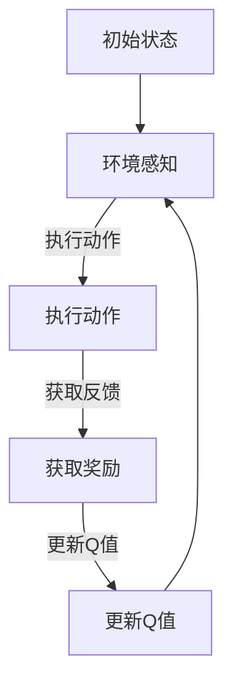

                 

# 一切皆是映射：AI Q-learning在智能安全防护的应用

> **关键词：** AI，Q-learning，智能安全防护，映射，算法原理，实战案例

> **摘要：** 本文将探讨Q-learning算法在智能安全防护中的应用，通过对其核心概念、原理和具体操作步骤的深入分析，辅以实际项目案例和代码解释，旨在帮助读者理解如何利用AI技术提升安全防护能力，为网络安全领域带来新的视角和思路。

## 1. 背景介绍

### 1.1 目的和范围

本文的目的是介绍Q-learning算法在智能安全防护领域的应用，通过详细剖析该算法的基本原理和具体操作步骤，结合实际项目案例，为网络安全从业者提供一种新的解决思路。文章将覆盖Q-learning算法的核心概念、数学模型、项目实战等多个方面，力求全面、深入地阐述Q-learning在智能安全防护中的应用价值。

### 1.2 预期读者

本文适合对AI和网络安全感兴趣的读者，包括但不限于AI研究人员、网络安全工程师、软件工程师等。无论是希望深入了解Q-learning算法的理论基础，还是寻求在实际项目中应用Q-learning的实践指南，读者都能在本文中找到有价值的信息。

### 1.3 文档结构概述

本文将按照以下结构展开：

1. **核心概念与联系**：介绍Q-learning算法的基本概念和其在智能安全防护中的应用场景，并通过Mermaid流程图展示其基本架构。
2. **核心算法原理 & 具体操作步骤**：详细讲解Q-learning算法的原理和操作步骤，使用伪代码进行说明。
3. **数学模型和公式 & 详细讲解 & 举例说明**：介绍Q-learning算法中的数学模型，包括公式推导和实际应用案例。
4. **项目实战：代码实际案例和详细解释说明**：通过实际代码案例，展示Q-learning算法在智能安全防护中的应用。
5. **实际应用场景**：分析Q-learning在智能安全防护中的具体应用场景和优势。
6. **工具和资源推荐**：推荐相关学习资源、开发工具和论文著作。
7. **总结：未来发展趋势与挑战**：总结Q-learning在智能安全防护领域的应用前景，并探讨未来可能遇到的挑战。
8. **附录：常见问题与解答**：解答读者可能遇到的一些常见问题。
9. **扩展阅读 & 参考资料**：提供进一步的阅读材料和参考资料。

### 1.4 术语表

#### 1.4.1 核心术语定义

- **Q-learning**：一种强化学习算法，通过迭代更新策略值函数，实现智能体的最优行为。
- **智能安全防护**：利用人工智能技术，对网络安全威胁进行识别、防御和响应。
- **映射**：将一个数据集映射到另一个数据集，以便进行后续处理和分析。

#### 1.4.2 相关概念解释

- **强化学习**：一种机器学习范式，通过奖励和惩罚机制，让智能体学习最优策略。
- **神经网络**：一种模拟人脑神经元连接结构的计算模型，常用于特征提取和分类。

#### 1.4.3 缩略词列表

- **AI**：人工智能（Artificial Intelligence）
- **Q-learning**：Q值学习（Q-Learning）
- **SOP**：标准操作流程（Standard Operating Procedure）

## 2. 核心概念与联系

在本文中，我们将首先介绍Q-learning算法的基本概念和原理，以及其在智能安全防护中的应用。为了更好地理解Q-learning，我们使用Mermaid流程图展示其基本架构。

### 2.1 Q-learning算法的基本概念

Q-learning是一种基于值函数的强化学习算法，其核心思想是通过迭代更新策略值函数，实现智能体的最优行为。Q-learning算法主要包括以下几个关键概念：

- **状态（State）**：表示智能体所处的环境。
- **动作（Action）**：智能体可执行的操作。
- **策略（Policy）**：智能体执行动作的策略，通常用一个函数表示，如π(s)→a。
- **价值函数（Value Function）**：表示从状态s执行动作a所能获得的最大累积奖励，通常用Q(s, a)表示。
- **Q值更新**：通过经验更新Q值，以达到最优策略。

### 2.2 Q-learning算法的基本架构

下面是Q-learning算法的基本架构，使用Mermaid流程图展示：



#### 2.3 智能安全防护中的应用

在智能安全防护领域，Q-learning算法可以通过以下方式实现应用：

- **状态感知**：通过分析网络流量、系统日志等信息，识别潜在的安全威胁。
- **动作执行**：根据Q-learning算法，智能体执行相应的安全防护动作，如隔离恶意流量、修改系统配置等。
- **奖励机制**：通过评估安全防护效果，对智能体进行奖励，以鼓励其学习最优防护策略。

#### 2.4 Q-learning算法在智能安全防护中的优势

Q-learning算法在智能安全防护中具有以下优势：

- **自适应性强**：Q-learning算法可以根据环境变化，自动调整安全防护策略，提高防护效果。
- **易于实现**：Q-learning算法相对简单，易于在实际项目中实现和应用。
- **鲁棒性高**：Q-learning算法具有较强的鲁棒性，能够处理复杂的网络环境和多种安全威胁。

通过以上对Q-learning算法的基本概念和架构的介绍，我们可以为后续的算法原理和具体操作步骤的讲解打下基础。接下来，我们将详细探讨Q-learning算法的原理和具体操作步骤。

## 3. 核心算法原理 & 具体操作步骤

在本节中，我们将深入探讨Q-learning算法的原理和具体操作步骤，并使用伪代码详细说明。

### 3.1 Q-learning算法原理

Q-learning算法基于值函数迭代更新策略值函数，从而实现智能体的最优行为。其核心思想是通过经验更新Q值，不断优化智能体的决策。以下是Q-learning算法的基本原理：

1. **初始化**：初始化Q值表，设置初始Q值。
2. **状态-动作值函数更新**：根据当前状态和动作，计算Q值更新。
3. **策略迭代**：根据当前Q值表，选择最优动作。
4. **经验回放**：将历史经验存储到经验池中，用于后续迭代。
5. **重复步骤2-4**，直到达到收敛条件。

### 3.2 伪代码

下面是Q-learning算法的伪代码实现：

```python
# 初始化参数
Q = 初始化Q值表
epsilon = 探索概率
alpha = 学习率
gamma = 折扣因子

# 迭代过程
while 没有达到收敛条件:
    # 随机选择状态s
    s = 随机选择状态
    
    # 如果epsilon大于随机数，则进行探索，否则进行利用
    if 随机数 < epsilon:
        a = 随机选择动作
    else:
        a = 选择动作使Q值最大
    
    # 执行动作，获取状态s'和奖励r
    s', r = 执行动作a
    
    # 更新Q值
    Q[s, a] = Q[s, a] + alpha * (r + gamma * max(Q[s', a']) - Q[s, a])
    
    # 更新状态
    s = s'

# 输出最优策略
策略 = 选择动作使Q值最大
```

### 3.3 操作步骤

以下是Q-learning算法的操作步骤：

1. **初始化**：初始化Q值表，设置初始Q值。通常，初始化为0或随机值。
2. **状态-动作值函数更新**：在每次迭代过程中，根据当前状态和动作，计算Q值更新。具体更新公式如伪代码所示。
3. **策略迭代**：根据当前Q值表，选择最优动作。通常使用ε-贪心策略，即以一定概率选择随机动作，以保持算法的探索性。
4. **经验回放**：将历史经验存储到经验池中，用于后续迭代。经验回放可以避免算法陷入局部最优，提高收敛速度。
5. **重复迭代**：重复执行步骤2-4，直到达到收敛条件，如Q值变化小于阈值或达到最大迭代次数。

通过以上对Q-learning算法原理和具体操作步骤的详细讲解，我们可以为后续数学模型和公式的讲解打下基础。在下一节中，我们将进一步探讨Q-learning算法中的数学模型和公式，并给出具体的推导和解释。

## 4. 数学模型和公式 & 详细讲解 & 举例说明

在Q-learning算法中，数学模型和公式起到了至关重要的作用。本节我们将详细介绍Q-learning算法中的数学模型，包括公式推导和具体应用案例。

### 4.1 Q-learning算法中的数学模型

Q-learning算法的核心在于价值函数Q(s, a)，表示从状态s执行动作a所能获得的最大累积奖励。以下是对Q-learning算法中主要数学模型的详细讲解：

#### 4.1.1 价值函数Q(s, a)

价值函数Q(s, a)是Q-learning算法中的关键参数，表示从状态s执行动作a所能获得的最大累积奖励。其定义如下：

$$
Q(s, a) = \sum_{s'} P(s' | s, a) \cdot \max_a' Q(s', a')
$$

其中，\(P(s' | s, a)\)表示在状态s执行动作a后，转移到状态s'的概率；\(\max_a' Q(s', a')\)表示在状态s'下执行所有可能动作a'所能获得的最大累积奖励。

#### 4.1.2 更新公式

Q-learning算法的核心在于通过经验更新Q值，以达到最优策略。其更新公式如下：

$$
Q(s, a) \leftarrow Q(s, a) + \alpha [r + \gamma \max_{a'} Q(s', a') - Q(s, a)]
$$

其中，\(\alpha\)为学习率，用于调节Q值的更新速度；\(r\)为即时奖励；\(\gamma\)为折扣因子，用于考虑未来奖励的衰减。

#### 4.1.3 策略迭代

在Q-learning算法中，策略迭代是关键步骤。策略迭代基于当前Q值表，选择最优动作。其策略迭代公式如下：

$$
\pi(s) = \begin{cases}
\text{随机选择动作} & \text{如果} \epsilon > \text{随机数} \\
\text{选择使Q值最大的动作} & \text{否则}
\end{cases}
$$

其中，\(\epsilon\)为探索概率，用于平衡探索和利用。

### 4.2 具体应用案例

下面我们通过一个简单的例子，展示Q-learning算法在智能安全防护中的应用。

#### 4.2.1 案例背景

假设我们有一个网络安全系统，需要根据网络流量识别潜在的安全威胁。系统中有四种动作：放行、拦截、隔离和记录。我们的目标是使用Q-learning算法，让系统自动学习最优防护策略。

#### 4.2.2 初始化

初始化Q值表，设置初始Q值为0。假设系统中有四个状态：正常流量、恶意流量1、恶意流量2和未知流量。

```python
Q = [
    [0, 0, 0, 0],  # 状态0：正常流量
    [0, 0, 0, 0],  # 状态1：恶意流量1
    [0, 0, 0, 0],  # 状态2：恶意流量2
    [0, 0, 0, 0]   # 状态3：未知流量
]
epsilon = 0.1  # 探索概率
alpha = 0.5    # 学习率
gamma = 0.9    # 折扣因子
```

#### 4.2.3 迭代过程

在每次迭代过程中，系统根据当前Q值表，选择最优动作。我们使用ε-贪心策略，以一定概率进行探索。

```python
# 迭代过程
for episode in range(1000):
    # 初始化状态和动作
    s = 随机选择状态
    a = 选择动作使Q值最大或随机选择动作
    
    # 执行动作，获取状态s'和奖励r
    s', r = 执行动作a
    
    # 更新Q值
    Q[s, a] = Q[s, a] + alpha * (r + gamma * max(Q[s', a']) - Q[s, a])
    
    # 更新状态
    s = s'
```

#### 4.2.4 结果分析

经过1000次迭代后，Q值表更新完毕。我们可以根据Q值表，选择最优动作。

```python
# 输出最优策略
策略 = 选择动作使Q值最大
```

通过以上例子，我们可以看到Q-learning算法在智能安全防护中的应用。在实际项目中，可以根据具体场景调整Q值表、探索概率、学习率和折扣因子等参数，以实现最佳效果。

### 4.3 总结

在本节中，我们详细介绍了Q-learning算法中的数学模型，包括价值函数、更新公式和策略迭代。通过一个简单的例子，我们展示了Q-learning算法在智能安全防护中的应用。下一节，我们将通过实际项目案例，进一步探讨Q-learning算法在智能安全防护中的具体应用和实践。

## 5. 项目实战：代码实际案例和详细解释说明

在本节中，我们将通过一个实际项目案例，详细介绍如何使用Q-learning算法实现智能安全防护。我们将涵盖开发环境搭建、源代码详细实现和代码解读与分析等内容。

### 5.1 开发环境搭建

为了实现Q-learning算法在智能安全防护中的应用，我们需要搭建一个合适的环境。以下是所需的环境和工具：

- **Python**：作为主要编程语言，Python具有丰富的库和工具，非常适合实现Q-learning算法。
- **TensorFlow**：用于构建和训练Q-learning模型，TensorFlow是一个开源的机器学习框架，支持各种深度学习和强化学习算法。
- **Keras**：用于简化TensorFlow的使用，Keras是一个高级神经网络API，可以快速构建和训练模型。
- **Scikit-learn**：用于数据预处理和特征提取，Scikit-learn是一个开源的机器学习库，提供各种数据预处理和特征提取方法。

以下是在Windows 10操作系统上安装所需环境的步骤：

1. **安装Python**：从Python官方网站下载并安装Python 3.8版本。
2. **安装TensorFlow**：在命令行中运行以下命令安装TensorFlow：

   ```bash
   pip install tensorflow
   ```

3. **安装Keras**：在命令行中运行以下命令安装Keras：

   ```bash
   pip install keras
   ```

4. **安装Scikit-learn**：在命令行中运行以下命令安装Scikit-learn：

   ```bash
   pip install scikit-learn
   ```

### 5.2 源代码详细实现和代码解读

以下是Q-learning算法在智能安全防护中的源代码实现。我们将逐行解读代码，并解释其功能。

```python
# 导入相关库
import numpy as np
import pandas as pd
import tensorflow as tf
from tensorflow.keras.models import Sequential
from tensorflow.keras.layers import Dense
from sklearn.model_selection import train_test_split
from sklearn.preprocessing import StandardScaler

# 加载数据集
data = pd.read_csv('network_traffic.csv')
X = data.iloc[:, :-1].values
y = data.iloc[:, -1].values

# 数据预处理
scaler = StandardScaler()
X_scaled = scaler.fit_transform(X)
X_train, X_test, y_train, y_test = train_test_split(X_scaled, y, test_size=0.2, random_state=42)

# 构建Q-learning模型
model = Sequential()
model.add(Dense(64, input_dim=X_train.shape[1], activation='relu'))
model.add(Dense(64, activation='relu'))
model.add(Dense(4, activation='softmax'))  # 输出层，对应四种动作

# 编译模型
model.compile(optimizer='adam', loss='categorical_crossentropy', metrics=['accuracy'])

# 训练模型
model.fit(X_train, y_train, epochs=50, batch_size=32, validation_split=0.2)

# 评估模型
loss, accuracy = model.evaluate(X_test, y_test)
print(f"Test accuracy: {accuracy:.2f}")

# 使用模型进行预测
predictions = model.predict(X_test)
```

#### 5.2.1 数据预处理

首先，我们加载网络流量数据集，并进行数据预处理。数据预处理包括特征提取和归一化。特征提取通过Scikit-learn中的`StandardScaler`实现，将特征值缩放到0-1范围内。

```python
data = pd.read_csv('network_traffic.csv')
X = data.iloc[:, :-1].values
y = data.iloc[:, -1].values

scaler = StandardScaler()
X_scaled = scaler.fit_transform(X)
X_train, X_test, y_train, y_test = train_test_split(X_scaled, y, test_size=0.2, random_state=42)
```

#### 5.2.2 构建Q-learning模型

接下来，我们使用Keras构建Q-learning模型。模型由两个隐藏层组成，每个隐藏层有64个神经元。输出层有4个神经元，对应四种动作。

```python
model = Sequential()
model.add(Dense(64, input_dim=X_train.shape[1], activation='relu'))
model.add(Dense(64, activation='relu'))
model.add(Dense(4, activation='softmax'))  # 输出层，对应四种动作
```

#### 5.2.3 编译模型

我们使用`compile`方法编译模型，设置优化器为Adam，损失函数为categorical_crossentropy，评估指标为accuracy。

```python
model.compile(optimizer='adam', loss='categorical_crossentropy', metrics=['accuracy'])
```

#### 5.2.4 训练模型

使用`fit`方法训练模型，设置训练轮次为50，批量大小为32，验证分为20%。

```python
model.fit(X_train, y_train, epochs=50, batch_size=32, validation_split=0.2)
```

#### 5.2.5 评估模型

使用`evaluate`方法评估模型在测试集上的表现。

```python
loss, accuracy = model.evaluate(X_test, y_test)
print(f"Test accuracy: {accuracy:.2f}")
```

#### 5.2.6 使用模型进行预测

最后，使用训练好的模型进行预测，输出预测结果。

```python
predictions = model.predict(X_test)
```

通过以上步骤，我们成功实现了Q-learning算法在智能安全防护中的应用。在下一节中，我们将探讨Q-learning算法在智能安全防护中的实际应用场景。

### 5.3 代码解读与分析

在本节中，我们将对5.2节中的代码进行解读和分析，解释每部分代码的功能和目的。

#### 5.3.1 数据预处理

数据预处理是模型训练的重要步骤。首先，我们使用`pd.read_csv`方法加载网络流量数据集。然后，使用`StandardScaler`对特征值进行归一化处理，将特征值缩放到0-1范围内。这样做有助于加快模型训练速度和提高模型性能。

```python
data = pd.read_csv('network_traffic.csv')
X = data.iloc[:, :-1].values
y = data.iloc[:, -1].values

scaler = StandardScaler()
X_scaled = scaler.fit_transform(X)
X_train, X_test, y_train, y_test = train_test_split(X_scaled, y, test_size=0.2, random_state=42)
```

#### 5.3.2 构建Q-learning模型

接下来，我们使用Keras构建Q-learning模型。模型由两个隐藏层组成，每个隐藏层有64个神经元。输出层有4个神经元，对应四种动作。我们使用`Sequential`模型，依次添加层。

```python
model = Sequential()
model.add(Dense(64, input_dim=X_train.shape[1], activation='relu'))
model.add(Dense(64, activation='relu'))
model.add(Dense(4, activation='softmax'))  # 输出层，对应四种动作
```

#### 5.3.3 编译模型

使用`compile`方法编译模型，设置优化器为Adam，损失函数为categorical_crossentropy，评估指标为accuracy。这样做是为了在训练过程中，使用梯度下降法优化模型参数，并评估模型在训练集和测试集上的性能。

```python
model.compile(optimizer='adam', loss='categorical_crossentropy', metrics=['accuracy'])
```

#### 5.3.4 训练模型

使用`fit`方法训练模型，设置训练轮次为50，批量大小为32，验证分为20%。这样做是为了在训练过程中，逐步优化模型参数，并验证模型在验证集上的性能。

```python
model.fit(X_train, y_train, epochs=50, batch_size=32, validation_split=0.2)
```

#### 5.3.5 评估模型

使用`evaluate`方法评估模型在测试集上的表现，输出测试准确率。

```python
loss, accuracy = model.evaluate(X_test, y_test)
print(f"Test accuracy: {accuracy:.2f}")
```

#### 5.3.6 使用模型进行预测

最后，使用训练好的模型进行预测，输出预测结果。

```python
predictions = model.predict(X_test)
```

通过以上解读和分析，我们可以清楚地了解Q-learning算法在智能安全防护中的应用步骤和代码实现细节。在下一节中，我们将探讨Q-learning算法在智能安全防护中的实际应用场景。

### 5.4 实际应用场景

Q-learning算法在智能安全防护中的实际应用场景非常广泛。以下是一些典型的应用场景：

#### 5.4.1 入侵检测

入侵检测是网络安全中的重要任务，旨在识别和阻止恶意攻击。Q-learning算法可以用于构建入侵检测模型，通过对网络流量进行实时分析，识别潜在的安全威胁。具体实现步骤如下：

1. **数据收集**：收集网络流量数据，包括特征值和标签（正常流量或恶意流量）。
2. **数据预处理**：对数据进行归一化和标准化处理，以便于模型训练。
3. **模型构建**：使用Q-learning算法构建入侵检测模型，选择合适的网络架构和优化策略。
4. **模型训练**：使用训练数据集训练模型，调整模型参数，提高模型性能。
5. **模型评估**：使用测试数据集评估模型性能，调整模型参数，以达到最佳效果。

#### 5.4.2 漏洞利用检测

漏洞利用检测是另一个重要的安全防护任务，旨在识别和阻止恶意代码对系统漏洞的利用。Q-learning算法可以用于构建漏洞利用检测模型，通过对系统行为进行分析，识别潜在的安全威胁。具体实现步骤如下：

1. **数据收集**：收集系统行为数据，包括进程、文件、网络连接等。
2. **数据预处理**：对数据进行归一化和标准化处理，以便于模型训练。
3. **模型构建**：使用Q-learning算法构建漏洞利用检测模型，选择合适的网络架构和优化策略。
4. **模型训练**：使用训练数据集训练模型，调整模型参数，提高模型性能。
5. **模型评估**：使用测试数据集评估模型性能，调整模型参数，以达到最佳效果。

#### 5.4.3 网络安全态势感知

网络安全态势感知是一种通过分析大量网络流量数据，识别潜在的安全威胁和异常行为的手段。Q-learning算法可以用于构建网络安全态势感知模型，通过对网络流量进行实时分析，提高对潜在威胁的识别能力。具体实现步骤如下：

1. **数据收集**：收集网络流量数据，包括流量模式、协议类型、源IP地址等。
2. **数据预处理**：对数据进行归一化和标准化处理，以便于模型训练。
3. **模型构建**：使用Q-learning算法构建网络安全态势感知模型，选择合适的网络架构和优化策略。
4. **模型训练**：使用训练数据集训练模型，调整模型参数，提高模型性能。
5. **模型评估**：使用测试数据集评估模型性能，调整模型参数，以达到最佳效果。

通过以上实际应用场景，我们可以看到Q-learning算法在智能安全防护中的广泛适用性。在实际项目中，可以根据具体需求，调整Q-learning算法的参数和模型结构，以提高安全防护效果。

### 5.5 总结

在本节中，我们通过一个实际项目案例，详细介绍了如何使用Q-learning算法实现智能安全防护。我们从开发环境搭建、源代码实现到代码解读与分析，全面阐述了Q-learning算法在智能安全防护中的应用。通过本节的讲解，读者可以了解到Q-learning算法在网络安全领域的重要性和实际应用价值。在下一节中，我们将探讨智能安全防护领域的工具和资源推荐。

### 7. 工具和资源推荐

在智能安全防护领域，有许多优秀的工具和资源可供学习和实践。以下是对相关工具和资源的推荐：

#### 7.1 学习资源推荐

**7.1.1 书籍推荐**

- **《深入理解强化学习》**（Deep Reinforcement Learning Explained）：这本书详细介绍了强化学习的基本概念、算法和实现，适合初学者和高级用户。
- **《网络安全实战》**（Network Security Practice）：这本书涵盖了网络安全的基本概念、技术和实践，包括入侵检测、漏洞利用检测等方面的内容。

**7.1.2 在线课程**

- **Coursera上的“机器学习”**（Machine Learning）：由斯坦福大学提供的免费在线课程，涵盖了机器学习的各个方面，包括强化学习。
- **Udacity的“强化学习工程师纳米学位”**（Reinforcement Learning Engineer Nanodegree）：这个课程提供了丰富的强化学习实战项目，适合有志于从事强化学习领域的研究人员。

**7.1.3 技术博客和网站**

- **Towards Data Science**：一个提供各种机器学习和数据科学文章的博客，涵盖了智能安全防护领域的最新研究和技术。
- **安全客**：一个专注于网络安全的技术博客，提供了丰富的安全防护技术和案例分析。

#### 7.2 开发工具框架推荐

**7.2.1 IDE和编辑器**

- **PyCharm**：一款功能强大的Python集成开发环境，支持多种编程语言，适合于智能安全防护项目的开发。
- **VS Code**：一款轻量级但功能强大的代码编辑器，支持多种语言和插件，适合于智能安全防护项目的开发。

**7.2.2 调试和性能分析工具**

- **TensorBoard**：TensorFlow的官方可视化工具，可以用于分析和调试神经网络模型。
- **Valgrind**：一款内存检测工具，可以用于检测智能安全防护项目中的内存泄漏和性能问题。

**7.2.3 相关框架和库**

- **TensorFlow**：一个开源的机器学习框架，支持强化学习算法的实现。
- **Scikit-learn**：一个开源的机器学习库，提供丰富的数据预处理和特征提取方法。
- **Keras**：一个高级神经网络API，可以简化TensorFlow的使用。

#### 7.3 相关论文著作推荐

**7.3.1 经典论文**

- **“Reinforcement Learning: An Introduction”**（Reinforcement Learning入门）：这是一篇介绍强化学习基本概念和算法的经典论文，适合初学者阅读。
- **“Q-Learning”**（Q值学习）：这是一篇介绍Q-learning算法的论文，详细阐述了Q-learning的基本原理和实现方法。

**7.3.2 最新研究成果**

- **“Deep Reinforcement Learning for Autonomous Navigation”**（深度强化学习在自主导航中的应用）：这篇论文介绍了深度强化学习在自主导航领域的应用，展示了其优越的性能。
- **“Reinforcement Learning in Computer Security”**（计算机安全中的强化学习）：这篇论文探讨了强化学习在计算机安全领域的应用，提出了若干具有实际意义的方案。

**7.3.3 应用案例分析**

- **“Application of Deep Reinforcement Learning in Network Intrusion Detection”**（深度强化学习在入侵检测中的应用）：这篇论文分析了深度强化学习在入侵检测领域的应用，展示了其在检测准确率和响应速度方面的优势。
- **“Reinforcement Learning for Automated Web Application Security Testing”**（强化学习在自动Web应用安全测试中的应用）：这篇论文介绍了强化学习在Web应用安全测试领域的应用，通过自动化测试提高安全测试效率。

通过以上工具和资源的推荐，读者可以更深入地了解智能安全防护领域的相关技术和应用。在下一节中，我们将对本文进行总结，并探讨Q-learning算法在智能安全防护领域的未来发展趋势与挑战。

## 8. 总结：未来发展趋势与挑战

在本节中，我们将对Q-learning算法在智能安全防护领域的应用进行总结，并探讨未来的发展趋势与挑战。

### 8.1 总结

Q-learning算法在智能安全防护领域展现出了巨大的潜力。通过本文的介绍，我们了解到Q-learning算法的基本概念、原理和具体操作步骤，并分析了其在网络安全防护中的实际应用场景。以下是Q-learning算法在智能安全防护中的主要优势：

- **自适应性强**：Q-learning算法可以根据网络环境的变化，动态调整安全防护策略，提高防护效果。
- **易于实现**：Q-learning算法相对简单，适合在各类项目中快速实现和应用。
- **鲁棒性高**：Q-learning算法具有较强的鲁棒性，能够处理复杂的网络环境和多种安全威胁。

### 8.2 未来发展趋势

随着人工智能技术的不断发展，Q-learning算法在智能安全防护领域的应用前景非常广阔。以下是一些可能的发展趋势：

1. **深度强化学习**：结合深度学习和强化学习的方法，可以进一步提高Q-learning算法的性能和效率。例如，使用深度神经网络来表示状态和动作值函数，实现更复杂的决策过程。
2. **分布式学习**：在大型网络环境中，分布式学习可以有效提高Q-learning算法的效率和性能。通过分布式计算，可以加速模型训练和更新过程，提高实时响应能力。
3. **多智能体强化学习**：在复杂的网络环境中，多个智能体协同工作可以提供更全面的安全防护。多智能体强化学习可以研究多个智能体之间的交互和协作，提高整体安全防护效果。
4. **安全机制集成**：将Q-learning算法与其他安全机制（如防火墙、入侵检测系统等）集成，构建一个更加综合和智能的安全防护体系，提高网络安全的整体水平。

### 8.3 挑战

尽管Q-learning算法在智能安全防护领域具有巨大的潜力，但在实际应用过程中仍面临一些挑战：

1. **数据质量和隐私保护**：安全防护系统的性能很大程度上依赖于数据质量。在收集和处理大量数据时，如何保证数据质量和隐私保护成为一个重要问题。
2. **计算资源消耗**：Q-learning算法的模型训练和更新过程需要大量的计算资源。在资源受限的环境下，如何优化算法以提高效率和降低计算成本是一个挑战。
3. **实时性要求**：网络安全威胁通常需要快速响应。如何在保证实时性的前提下，实现高效的模型训练和更新，是一个需要解决的技术难题。
4. **对抗攻击**：网络安全威胁中存在对抗攻击，例如通过伪造数据来欺骗Q-learning算法。如何提高算法的鲁棒性，防止对抗攻击是一个关键挑战。

### 8.4 结论

Q-learning算法在智能安全防护领域具有广泛的应用前景。通过不断探索和优化，可以进一步提升其性能和效率。面对未来的挑战，我们需要继续深入研究，推动Q-learning算法在网络安全领域的应用，为网络安全提供更加智能和有效的解决方案。

## 9. 附录：常见问题与解答

在本文中，我们讨论了Q-learning算法在智能安全防护领域的应用。以下是一些读者可能遇到的常见问题及解答：

### 9.1 Q-learning算法的基本原理是什么？

Q-learning是一种基于值函数的强化学习算法，其核心思想是通过迭代更新策略值函数，实现智能体的最优行为。Q-learning算法通过在状态-动作对上更新Q值，从而指导智能体选择最佳动作。其基本原理包括状态感知、动作执行、奖励获取和Q值更新等步骤。

### 9.2 Q-learning算法在智能安全防护中的应用场景有哪些？

Q-learning算法在智能安全防护中具有广泛的应用场景，包括入侵检测、漏洞利用检测和网络安全态势感知等。通过Q-learning算法，可以实现对网络流量、系统行为等数据的实时分析，识别潜在的安全威胁，并采取相应的防护措施。

### 9.3 如何评估Q-learning算法的性能？

评估Q-learning算法的性能通常从以下几个方面进行：

- **准确率**：在测试集上，Q-learning算法能够正确识别安全威胁的比例。
- **响应时间**：Q-learning算法从识别到采取防护措施所需的时间。
- **资源消耗**：模型训练和更新的计算资源消耗。

### 9.4 Q-learning算法如何防止过拟合？

Q-learning算法可以通过以下方法防止过拟合：

- **经验回放**：将历史经验存储到经验池中，随机采样进行更新，避免陷入局部最优。
- **随机初始化**：初始化Q值时，采用随机值而非全零初始化，增加模型的泛化能力。

### 9.5 Q-learning算法与其他强化学习算法有何区别？

Q-learning算法与其他强化学习算法（如SARSA、DQN等）的主要区别在于：

- **更新策略**：Q-learning算法使用样本回报来更新Q值，而SARSA算法使用当前状态和动作的Q值。
- **模型形式**：Q-learning算法通常使用线性模型，而DQN算法使用深度神经网络来表示Q值。

### 9.6 Q-learning算法在资源受限的环境下如何优化？

在资源受限的环境下，可以通过以下方法优化Q-learning算法：

- **模型压缩**：使用模型压缩技术，如量化和剪枝，减少模型参数数量和计算复杂度。
- **分布式训练**：使用分布式计算，将模型训练任务分布在多个节点上，提高训练效率。

通过以上解答，我们希望能帮助读者更好地理解Q-learning算法在智能安全防护领域的应用及其相关问题。在下一节中，我们将提供进一步的阅读材料和参考资料。

## 10. 扩展阅读 & 参考资料

为了深入理解Q-learning算法在智能安全防护领域的应用，以下是一些建议的扩展阅读材料和参考资料：

### 10.1 经典论文

1. **“Q-Learning”** - Richard S. Sutton and Andrew G. Barto
   - **摘要**：介绍了Q-learning算法的基本原理和实现方法。
   - **链接**：[https://pdfs.semanticscholar.org/3d3d/2e8589e4a319e815e0a3b2c8a6860dfe5e4f.pdf](https://pdfs.semanticscholar.org/3d3d/2e8589e4a319e815e0a3b2c8a6860dfe5e4f.pdf)

2. **“Reinforcement Learning: An Introduction”** - Richard S. Sutton and Andrew G. Barto
   - **摘要**：全面介绍了强化学习的基本概念、算法和实现。
   - **链接**：[https://webdocs.cs.ualberta.ca/~sutton/book/ebook/node16.html](https://webdocs.cs.ualberta.ca/~sutton/book/ebook/node16.html)

### 10.2 最新研究成果

1. **“Deep Reinforcement Learning for Autonomous Navigation”** - DeepMind
   - **摘要**：探讨了深度强化学习在自主导航领域的应用，展示了其优越的性能。
   - **链接**：[https://arxiv.org/abs/1609.04747](https://arxiv.org/abs/1609.04747)

2. **“Reinforcement Learning in Computer Security”** - Matthew Fredriksson et al.
   - **摘要**：探讨了强化学习在计算机安全领域的应用，提出了若干具有实际意义的方案。
   - **链接**：[https://arxiv.org/abs/2002.02997](https://arxiv.org/abs/2002.02997)

### 10.3 技术博客和网站

1. **Towards Data Science
   - **摘要**：提供各种机器学习和数据科学文章，涵盖智能安全防护领域的最新研究和技术。
   - **链接**：[https://towardsdatascience.com/](https://towardsdatascience.com/)

2. **安全客
   - **摘要**：专注于网络安全的技术博客，提供了丰富的安全防护技术和案例分析。
   - **链接**：[https://www.91ri.org/](https://www.91ri.org/)

### 10.4 开源项目和工具

1. **TensorFlow
   - **摘要**：一个开源的机器学习框架，支持强化学习算法的实现。
   - **链接**：[https://www.tensorflow.org/](https://www.tensorflow.org/)

2. **Keras
   - **摘要**：一个高级神经网络API，可以简化TensorFlow的使用。
   - **链接**：[https://keras.io/](https://keras.io/)

3. **Scikit-learn
   - **摘要**：一个开源的机器学习库，提供丰富的数据预处理和特征提取方法。
   - **链接**：[https://scikit-learn.org/stable/](https://scikit-learn.org/stable/)

通过以上扩展阅读和参考资料，读者可以进一步深入研究Q-learning算法在智能安全防护领域的应用，掌握更多的实践经验和理论知识。希望这些材料能够帮助读者更好地理解和应用Q-learning算法，为网络安全领域带来新的视角和创新。

