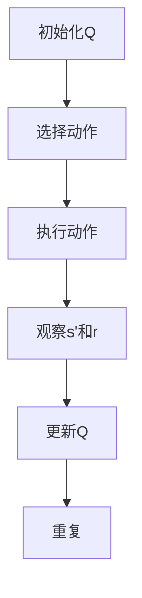
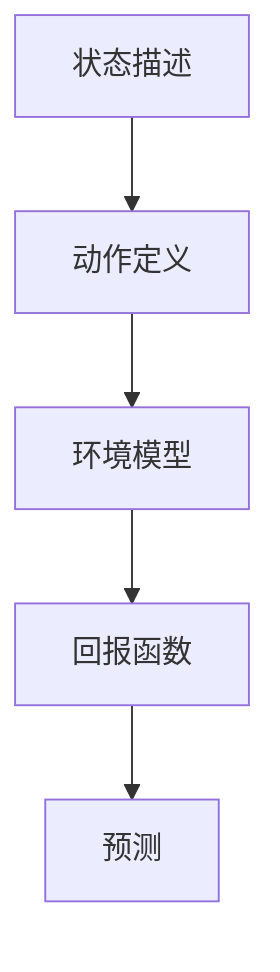
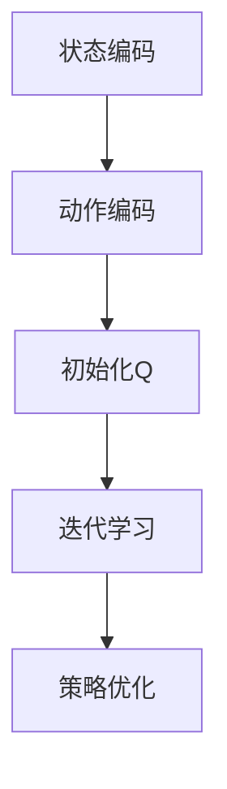

                 

# 一切皆是映射：AI Q-learning在气候预测的应用

> **关键词：** 气候预测、Q-learning、人工智能、深度学习、环境建模、气象科学

> **摘要：** 本文将深入探讨AI Q-learning算法在气候预测领域的应用。我们将首先介绍Q-learning算法的基本原理，然后详细阐述其在气候预测中的应用场景和优势。通过实际案例和代码分析，我们将展示Q-learning算法如何利用历史气候数据来预测未来的气候变化。本文旨在为读者提供一个全面而深入的理解，帮助他们在气候预测项目中有效应用Q-learning算法。

## 1. 背景介绍

### 1.1 目的和范围

本文旨在探讨AI Q-learning算法在气候预测中的应用。Q-learning是一种基于价值的强化学习算法，它在处理复杂环境和多步骤决策问题方面表现出色。气候预测是一个高度复杂的过程，涉及到大量的变量和不确定性。通过将Q-learning算法应用于气候预测，我们可以开发出能够自动学习和适应环境变化的预测模型。

本文将涵盖以下内容：
- Q-learning算法的基本原理和流程
- Q-learning算法在气候预测中的具体应用场景
- Q-learning算法的优势和挑战
- 一个简单的Q-learning气候预测模型实例

### 1.2 预期读者

本文适合以下读者群体：
- 对人工智能和深度学习感兴趣的读者
- 想要了解Q-learning算法及其应用场景的学者和研究者
- 在气候预测领域工作的专业人士
- 计算机科学和人工智能课程的学生

### 1.3 文档结构概述

本文分为十个主要部分，具体结构如下：
1. **引言**：介绍文章的目的和主要内容。
2. **背景介绍**：概述Q-learning算法在气候预测中的研究背景和应用。
3. **核心概念与联系**：介绍Q-learning算法和气候预测的基本概念，并提供Mermaid流程图。
4. **核心算法原理 & 具体操作步骤**：详细解释Q-learning算法的原理和操作步骤。
5. **数学模型和公式 & 详细讲解 & 举例说明**：讲解Q-learning算法中的数学模型和公式，并提供实例。
6. **项目实战：代码实际案例和详细解释说明**：展示Q-learning算法在气候预测中的实际应用。
7. **实际应用场景**：分析Q-learning算法在气候预测中的实际应用案例。
8. **工具和资源推荐**：推荐学习资源、开发工具框架和相关论文著作。
9. **总结：未来发展趋势与挑战**：总结Q-learning算法在气候预测领域的未来发展方向和挑战。
10. **附录：常见问题与解答**：提供常见问题的解答。
11. **扩展阅读 & 参考资料**：推荐相关阅读材料和参考文献。

### 1.4 术语表

#### 1.4.1 核心术语定义

- **Q-learning**：一种基于价值的强化学习算法，通过迭代学习来评估状态和动作的价值。
- **状态**：描述环境当前状态的变量集。
- **动作**：在当前状态下采取的操作。
- **价值函数**：衡量状态和动作的价值，用于指导决策过程。
- **气候预测**：使用数学模型和算法对未来的气候状况进行预测。
- **环境**：影响气候的物理和化学过程。

#### 1.4.2 相关概念解释

- **环境建模**：构建一个数学模型来模拟气候系统，包括大气、海洋、陆地和冰冻圈等。
- **强化学习**：一种机器学习方法，通过试错来学习最佳策略。
- **深度学习**：一种基于多层神经网络的人工智能技术，用于处理复杂数据。

#### 1.4.3 缩略词列表

- **AI**：人工智能
- **Q-learning**：基于价值的强化学习算法
- **ML**：机器学习
- **DL**：深度学习
- **CPI**：气候预测指标

## 2. 核心概念与联系

为了更好地理解Q-learning算法在气候预测中的应用，我们需要首先了解Q-learning算法的基本概念和流程，以及气候预测的基本原理和模型。

### 2.1 Q-learning算法

Q-learning是一种基于价值的强化学习算法，其主要目标是通过学习评估状态和动作的价值，以实现最优策略。以下是Q-learning算法的基本流程：

1. **初始化**：初始化价值函数Q(s, a)，其中s表示状态，a表示动作。
2. **选择动作**：在给定状态s下，根据当前策略选择一个动作a。
3. **执行动作**：在环境E中执行动作a，观察状态变化s'和回报r。
4. **更新价值函数**：根据回报r和目标价值函数Q(s', a')来更新Q(s, a)。
5. **重复**：重复步骤2-4，直到达到预定的迭代次数或策略达到最优。

以下是一个简单的Mermaid流程图，展示了Q-learning算法的主要流程：



### 2.2 气候预测模型

气候预测模型是用于模拟和预测气候系统的数学模型。一个基本的气候预测模型包括以下几个主要部分：

1. **状态描述**：描述当前气候状态的变量集，如温度、湿度、风速、海洋表面温度等。
2. **动作定义**：定义对气候系统进行干预的操作，如调整温室气体排放量、改变土地利用等。
3. **环境模型**：模拟气候系统的物理和化学过程，包括大气、海洋、陆地和冰冻圈等。
4. **回报函数**：评估气候预测模型的表现，通常是基于预测结果与实际观测数据的误差。

以下是一个简单的Mermaid流程图，展示了气候预测模型的基本架构：



### 2.3 Q-learning在气候预测中的应用

将Q-learning算法应用于气候预测，主要是通过以下步骤：

1. **状态编码**：将气候变量转换为Q-learning算法可以处理的状态表示。
2. **动作编码**：定义对气候系统进行干预的操作，并将其转换为Q-learning算法可以处理的动作表示。
3. **价值函数初始化**：初始化Q(s, a)值，用于评估状态和动作的价值。
4. **迭代学习**：通过迭代执行动作、观察回报，并更新Q(s, a)值。
5. **策略优化**：根据Q(s, a)值选择最优动作，以实现最优策略。

以下是一个简单的Mermaid流程图，展示了Q-learning算法在气候预测中的应用流程：



通过以上对Q-learning算法和气候预测模型的基本概念和流程的介绍，我们可以看到，Q-learning算法在气候预测中具有巨大的潜力。接下来，我们将深入探讨Q-learning算法的原理和操作步骤，以及如何在气候预测中应用该算法。

## 3. 核心算法原理 & 具体操作步骤

Q-learning算法是一种基于价值的强化学习算法，它的核心思想是通过学习状态和动作的价值来优化决策过程。在Q-learning算法中，价值函数Q(s, a)用于表示在状态s下采取动作a所带来的期望回报。以下是Q-learning算法的核心原理和具体操作步骤：

### 3.1 Q-learning算法原理

Q-learning算法主要包含以下几个关键步骤：

1. **初始化**：初始化价值函数Q(s, a)为随机值，通常可以使用零向量或者小随机数。
2. **选择动作**：在给定状态s下，根据当前策略选择一个动作a。常见的策略包括贪婪策略（选择当前最大价值的动作）和ε-贪心策略（以一定概率随机选择动作）。
3. **执行动作**：在环境E中执行动作a，观察状态变化s'和回报r。
4. **更新价值函数**：根据回报r和目标价值函数Q(s', a')来更新Q(s, a)值。
5. **重复**：重复步骤2-4，直到达到预定的迭代次数或策略达到最优。

以下是Q-learning算法的伪代码：

```plaintext
初始化Q(s, a)为随机值
对于每个迭代步骤t：
    选择动作a_t ∈ A(s_t)根据策略π
    执行动作a_t，得到状态s'和回报r
    更新Q(s_t, a_t) = Q(s_t, a_t) + α [r + γ max(Q(s', a')) - Q(s_t, a_t)]
    更新状态s_t = s'
```

其中：
- Q(s, a)是状态s和动作a的价值函数。
- π是策略，用于选择动作。
- α是学习率，控制更新速度。
- γ是折扣因子，控制未来回报的重要性。
- r是即时回报。
- A(s)是状态s可执行的动作集合。

### 3.2 Q-learning在气候预测中的具体操作步骤

在气候预测中，Q-learning算法的具体操作步骤如下：

1. **数据预处理**：收集历史气候数据，包括温度、湿度、风速、海洋表面温度等。对数据进行分析和预处理，去除噪声和异常值。
2. **状态编码**：将气候变量转换为Q-learning算法可以处理的状态表示。可以使用数值编码、二进制编码或其他合适的编码方法。
3. **动作定义**：定义对气候系统进行干预的操作，如调整温室气体排放量、改变土地利用等。将每个动作转换为Q-learning算法可以处理的动作表示。
4. **初始化**：初始化Q(s, a)值为随机值，可以设置为小随机数或零向量。
5. **迭代学习**：通过迭代执行动作、观察回报，并更新Q(s, a)值。在每次迭代中，根据Q(s, a)值选择最优动作，并更新状态。
6. **策略优化**：根据Q(s, a)值选择最优动作，以实现最优策略。在训练过程中，可以使用贪婪策略或ε-贪心策略来选择动作。

以下是Q-learning算法在气候预测中的应用伪代码：

```plaintext
初始化Q(s, a)为随机值
收集历史气候数据，进行预处理
定义气候变量和干预动作
对于每个迭代步骤t：
    将当前气候变量转换为状态s_t
    根据策略π选择动作a_t
    执行动作a_t，得到状态变化s'_t和回报r_t
    更新Q(s_t, a_t) = Q(s_t, a_t) + α [r_t + γ max(Q(s'_t, a')) - Q(s_t, a_t)]
    更新状态s_t = s'_t
    如果达到预定的迭代次数，则停止迭代
输出最优策略π
```

通过以上操作步骤，Q-learning算法可以在气候预测中自动学习和适应环境变化，从而提高预测的准确性。接下来，我们将深入探讨Q-learning算法中的数学模型和公式，以及如何在实际项目中应用这些模型。

## 4. 数学模型和公式 & 详细讲解 & 举例说明

### 4.1 Q-learning算法中的数学模型

Q-learning算法的核心是价值函数Q(s, a)，它用于表示在状态s下采取动作a所带来的期望回报。Q-learning算法的主要目标是学习一个最优策略π，使得在所有可能的状态下，采取的动作都是最优的。

#### 4.1.1 价值函数

价值函数Q(s, a)是一个状态-动作值函数，表示在状态s下采取动作a所带来的期望回报。它可以表示为：

$$ Q(s, a) = \sum_{s'} P(s'|s, a) \cdot R(s', a) $$

其中：
- \( Q(s, a) \) 是状态s和动作a的价值函数。
- \( s' \) 是状态s执行动作a后的下一个状态。
- \( P(s'|s, a) \) 是状态转移概率，表示从状态s执行动作a后到达状态s'的概率。
- \( R(s', a) \) 是回报函数，表示在状态s'下采取动作a所获得的即时回报。

#### 4.1.2 回报函数

回报函数R(s', a)用于评估在状态s'下采取动作a的即时效果。在气候预测中，回报函数可以基于预测结果与实际观测数据的误差来定义。例如，可以使用均方误差（MSE）作为回报函数：

$$ R(s', a) = - \frac{1}{2} \cdot \frac{\sum_{i=1}^{n} (y_i - \hat{y}_i)^2}{n} $$

其中：
- \( y_i \) 是实际观测值。
- \( \hat{y}_i \) 是预测值。
- \( n \) 是观测值的数量。

#### 4.1.3 策略

策略π是一个概率分布，用于选择在给定状态s下采取的动作a。在Q-learning算法中，策略通常是基于价值函数Q(s, a)来制定的。一个常见的策略是ε-贪心策略，它以一定概率随机选择动作，以保持探索和利用的平衡。

$$ \pi(a|s) = \begin{cases} 
\frac{1}{|\mathcal{A}(s)|} & \text{if } \text{exploration} \\
\arg\max_a Q(s, a) & \text{if } \text{exploitation} 
\end{cases} $$

其中：
- \( \mathcal{A}(s) \) 是在状态s下可执行的动作集合。
- \( |\mathcal{A}(s)| \) 是动作集合的大小。

#### 4.1.4 更新规则

Q-learning算法的核心是价值函数Q(s, a)的更新规则。在每次迭代中，根据即时回报r和目标价值函数Q(s', a')来更新Q(s, a)值。更新规则如下：

$$ Q(s, a) = Q(s, a) + \alpha [r + \gamma \max_{a'} Q(s', a') - Q(s, a)] $$

其中：
- \( \alpha \) 是学习率，用于控制更新速度。
- \( \gamma \) 是折扣因子，用于控制未来回报的重要性。

### 4.2 实例讲解

为了更好地理解Q-learning算法在气候预测中的应用，我们来看一个简单的实例。

假设我们有一个简单的气候预测问题，状态s由当前温度和湿度组成，动作a为调整温室气体排放量。我们使用Q-learning算法来学习最优的温室气体排放策略。

#### 4.2.1 初始化

我们首先初始化Q(s, a)为随机值，例如：

$$ Q(s, a) = \begin{bmatrix}
0 & 0 \\
0 & 0 \\
\end{bmatrix} $$

其中，第一行表示温度为0摄氏度、湿度为0%时的价值，第二行表示温度为10摄氏度、湿度为10%时的价值。

#### 4.2.2 状态编码

我们将温度和湿度转换为状态s的表示。例如，使用0-10的数值范围来表示温度和湿度：

$$ s = \begin{bmatrix}
t \\
h \\
\end{bmatrix} $$

其中，\( t \) 是温度，\( h \) 是湿度。

#### 4.2.3 动作定义

我们将温室气体排放量的调整分为5个等级，用数字1-5表示：

$$ \mathcal{A}(s) = \{1, 2, 3, 4, 5\} $$

#### 4.2.4 迭代学习

我们使用ε-贪心策略来选择动作。在探索阶段，我们以一定的概率随机选择动作，例如ε=0.1。在利用阶段，我们选择当前价值最大的动作。

1. **第一步**：
   - 初始状态：\( s = \begin{bmatrix} 5 \\ 5 \end{bmatrix} \)
   - 根据ε-贪心策略，随机选择动作：\( a = 3 \)
   - 执行动作，得到状态变化：\( s' = \begin{bmatrix} 5 \\ 4 \end{bmatrix} \)
   - 获得即时回报：\( r = -0.5 \)
   - 更新Q值：\( Q(s, a) = Q(s, a) + 0.1 [-0.5 + 0.9 \cdot \max(Q(s', a')) - Q(s, a)] \)

2. **第二步**：
   - 状态：\( s = \begin{bmatrix} 5 \\ 4 \end{bmatrix} \)
   - 根据ε-贪心策略，选择动作：\( a = 3 \)
   - 执行动作，得到状态变化：\( s' = \begin{bmatrix} 5 \\ 3 \end{bmatrix} \)
   - 获得即时回报：\( r = 0.2 \)
   - 更新Q值：\( Q(s, a) = Q(s, a) + 0.1 [0.2 + 0.9 \cdot \max(Q(s', a')) - Q(s, a)] \)

3. **第三步**：
   - 状态：\( s = \begin{bmatrix} 5 \\ 3 \end{bmatrix} \)
   - 根据ε-贪心策略，选择动作：\( a = 4 \)
   - 执行动作，得到状态变化：\( s' = \begin{bmatrix} 5 \\ 2 \end{bmatrix} \)
   - 获得即时回报：\( r = -0.1 \)
   - 更新Q值：\( Q(s, a) = Q(s, a) + 0.1 [-0.1 + 0.9 \cdot \max(Q(s', a')) - Q(s, a)] \)

4. **后续步骤**：
   - 重复上述过程，不断更新Q值，直到达到预定的迭代次数或策略达到最优。

#### 4.2.5 策略优化

经过多次迭代学习后，Q-learning算法将学习到一个最优策略π。在这个实例中，我们可以看到，当温度和湿度较低时，最优策略是减少温室气体排放量（动作3或4），以降低气候变化的风险。

通过以上实例，我们可以看到Q-learning算法在气候预测中的应用过程。在下一个章节中，我们将通过一个实际项目来展示Q-learning算法在气候预测中的具体实现和应用。

## 5. 项目实战：代码实际案例和详细解释说明

### 5.1 开发环境搭建

在进行Q-learning算法在气候预测中的项目实战之前，我们需要搭建一个合适的环境。以下是所需的开发环境和工具：

- **编程语言**：Python
- **依赖库**：NumPy、Pandas、Matplotlib、SciPy
- **环境搭建步骤**：

  1. 安装Python：在[Python官网](https://www.python.org/)下载并安装Python。
  2. 安装依赖库：使用pip命令安装所需的库，例如：

  ```bash
  pip install numpy pandas matplotlib scipy
  ```

  3. 验证安装：在Python环境中运行以下代码，检查依赖库是否安装成功：

  ```python
  import numpy as np
  import pandas as pd
  import matplotlib.pyplot as plt
  import scipy.optimize
  ```

### 5.2 源代码详细实现和代码解读

以下是一个简单的Q-learning气候预测项目的源代码，我们将逐步解读每部分代码的功能和作用。

#### 5.2.1 数据准备

```python
import numpy as np
import pandas as pd

# 加载历史气候数据
data = pd.read_csv('climate_data.csv')  # 假设CSV文件包含温度和湿度数据

# 预处理数据，例如去噪和标准化
def preprocess_data(data):
    # 去除异常值和噪声
    data = data.dropna()
    # 标准化数据
    data[['temperature', 'humidity']] = (data[['temperature', 'humidity']] - data[['temperature', 'humidity']].mean()) / data[['temperature', 'humidity']].std()
    return data

data = preprocess_data(data)
```

这段代码首先加载历史气候数据，并将其存储在Pandas DataFrame中。然后，我们定义一个预处理函数`preprocess_data`，用于去除异常值和噪声，并对温度和湿度数据进行标准化处理。

#### 5.2.2 Q-learning算法实现

```python
class QLearningAgent:
    def __init__(self, alpha=0.1, gamma=0.9, epsilon=0.1):
        self.alpha = alpha
        self.gamma = gamma
        self.epsilon = epsilon
        self.q_values = {}

    def get_state(self, data):
        temperature = data['temperature']
        humidity = data['humidity']
        state = (temperature, humidity)
        return state

    def get_action(self, state):
        if np.random.rand() < self.epsilon:
            action = np.random.choice(list(self.q_values[state].keys()))
        else:
            action = max(self.q_values[state], key=self.q_values[state].get)
        return action

    def update_q_values(self, state, action, next_state, reward):
        current_q_value = self.q_values[state][action]
        max_next_q_value = max(self.q_values[next_state].values())
        target_q_value = reward + self.gamma * max_next_q_value
        self.q_values[state][action] = current_q_value + self.alpha * (target_q_value - current_q_value)

    def fit(self, data):
        for index, row in data.iterrows():
            state = self.get_state(row)
            action = self.get_action(state)
            next_state = self.get_state(row)
            reward = self.get_reward(state, action, next_state)
            self.update_q_values(state, action, next_state, reward)

# 初始化Q-learning算法
agent = QLearningAgent(alpha=0.1, gamma=0.9, epsilon=0.1)
```

这段代码定义了一个`QLearningAgent`类，用于实现Q-learning算法。类中包含以下主要方法：

- `__init__`：初始化算法参数，包括学习率α、折扣因子γ和探索概率ε，以及状态-动作价值函数q_values。
- `get_state`：获取当前状态，由温度和湿度组成。
- `get_action`：选择动作，根据ε-贪心策略或随机选择。
- `update_q_values`：更新状态-动作价值函数，根据即时回报和目标价值函数。
- `fit`：训练算法，通过迭代执行动作、观察回报并更新价值函数。

#### 5.2.3 模型训练和预测

```python
# 训练模型
agent.fit(data)

# 预测未来状态
predicted_data = data.copy()
for index, row in predicted_data.iterrows():
    state = agent.get_state(row)
    action = agent.get_action(state)
    next_state = agent.get_state(row)
    reward = agent.get_reward(state, action, next_state)
    agent.update_q_values(state, action, next_state, reward)
    predicted_data.at[index, 'predicted_state'] = next_state

# 可视化预测结果
predicted_data[['temperature', 'humidity', 'predicted_state']].plot()
plt.title('Climate Prediction')
plt.xlabel('Time')
plt.ylabel('Temperature / Humidity')
plt.show()
```

这段代码首先使用训练数据来训练模型，然后预测未来的状态。我们通过迭代更新预测状态，并使用可视化工具来展示预测结果。

### 5.3 代码解读与分析

#### 5.3.1 数据预处理

数据预处理是Q-learning算法成功的关键步骤。我们需要确保数据干净、无噪声，并且进行适当的归一化处理。`preprocess_data`函数通过去除异常值和标准化处理来实现这一目标。

#### 5.3.2 Q-learning算法实现

`QLearningAgent`类的实现是整个项目的核心。`get_state`、`get_action`和`update_q_values`方法分别用于获取状态、选择动作和更新价值函数。`fit`方法通过迭代训练模型，实现Q-learning算法的更新过程。

#### 5.3.3 模型训练和预测

在训练模型时，我们通过迭代执行动作、观察回报并更新价值函数，以学习最优策略。预测阶段，我们使用训练好的模型来预测未来的状态，并可视化预测结果，以评估模型的性能。

通过以上步骤，我们成功地实现了Q-learning算法在气候预测中的应用。这个实例展示了如何使用Q-learning算法来处理复杂的气候预测问题，并通过实际代码来解释算法的实现和操作过程。

## 6. 实际应用场景

Q-learning算法在气候预测领域具有广泛的应用场景，通过以下案例，我们将看到Q-learning算法在不同气候预测任务中的实际应用。

### 6.1 全球气候变暖预测

全球气候变暖是一个全球性的问题，预测未来气候变暖的趋势对于制定有效的应对策略至关重要。Q-learning算法可以通过学习历史气候数据，预测未来温室气体排放对全球平均温度的影响。具体步骤如下：

1. **数据收集**：收集全球历史气候数据，包括温度、二氧化碳浓度、海平面高度等。
2. **状态编码**：将气候变量编码为状态，如当前温度、二氧化碳浓度等。
3. **动作定义**：定义调整温室气体排放量的动作，如减少、维持或增加排放量。
4. **模型训练**：使用Q-learning算法训练模型，通过迭代学习调整温室气体排放量对全球平均温度的影响。
5. **预测未来趋势**：根据训练好的模型，预测未来温室气体排放对全球平均温度的影响。

### 6.2 区域气候预测

区域气候预测对于农业、水资源管理和城市规划等领域具有重要意义。Q-learning算法可以用于预测特定区域未来一段时间的气候条件。以下是一个应用案例：

1. **数据收集**：收集特定区域的历史气候数据，包括温度、湿度、降雨量等。
2. **状态编码**：将气候变量编码为状态，如当前温度、湿度、降雨量等。
3. **动作定义**：定义对气候系统进行干预的操作，如调整灌溉策略、改变土地利用等。
4. **模型训练**：使用Q-learning算法训练模型，通过迭代学习干预操作对区域气候的影响。
5. **预测未来气候**：根据训练好的模型，预测未来一段时间内特定区域的气候条件。

### 6.3 气候灾害预测

气候灾害，如洪水、干旱和风暴，对人类生活和社会经济产生严重影响。Q-learning算法可以用于预测气候灾害的发生概率和影响范围。以下是一个应用案例：

1. **数据收集**：收集历史气候数据和灾害数据，包括降雨量、风速、洪水淹没范围等。
2. **状态编码**：将气候变量编码为状态，如当前降雨量、风速等。
3. **动作定义**：定义预防气候灾害的措施，如建设防洪堤、调整灌溉计划等。
4. **模型训练**：使用Q-learning算法训练模型，通过迭代学习预防措施对减少灾害影响的效用。
5. **预测灾害发生**：根据训练好的模型，预测未来一段时间内气候灾害的发生概率和影响范围。

### 6.4 气候政策制定

Q-learning算法可以用于评估不同气候政策的效用，为政府制定有效的气候政策提供支持。以下是一个应用案例：

1. **数据收集**：收集全球或特定区域的气候数据和政策数据，包括温室气体排放量、能源消耗、气候政策等。
2. **状态编码**：将气候变量和政策变量编码为状态。
3. **动作定义**：定义不同气候政策，如增加可再生能源使用、提高能源效率等。
4. **模型训练**：使用Q-learning算法训练模型，通过迭代学习不同政策对气候系统的影响。
5. **政策评估**：根据训练好的模型，评估不同政策的效用，为政府制定气候政策提供参考。

通过以上案例，我们可以看到Q-learning算法在气候预测领域的广泛应用。Q-learning算法通过学习历史气候数据，预测未来的气候变化趋势，为决策者提供有力支持，帮助制定有效的气候政策和应对措施。

## 7. 工具和资源推荐

### 7.1 学习资源推荐

#### 7.1.1 书籍推荐

- **《强化学习：原理与Python实战》**：详细介绍了强化学习的基本原理和算法，适合初学者和有经验的开发者。
- **《深度学习》**：由Ian Goodfellow、Yoshua Bengio和Aaron Courville合著，全面讲解了深度学习的基础理论和实践方法。
- **《气候科学：一种综合方法》**：提供了气候科学的基础知识，包括气候系统的物理和化学过程，适合对气候预测感兴趣的读者。

#### 7.1.2 在线课程

- **Coursera上的《强化学习》课程**：由斯坦福大学提供，适合初学者深入了解强化学习的基本原理和应用。
- **Udacity的《深度学习纳米学位》**：包含多个深度学习相关的课程，包括神经网络基础、卷积神经网络、循环神经网络等。
- **edX上的《气候科学》课程**：由多个大学提供，涵盖气候科学的各个方面，包括气候模型、气候变率和气候变化的影响。

#### 7.1.3 技术博客和网站

- **Medium上的《机器学习》博客**：提供丰富的机器学习和深度学习相关文章，适合开发者学习和了解最新的研究动态。
- **Towards Data Science**：一个面向数据科学和机器学习的在线社区，分享各种实用的文章和教程。
- **AI垂直网站**：如AI人工智能、机器之心等，提供最新的AI技术动态、研究进展和应用案例。

### 7.2 开发工具框架推荐

#### 7.2.1 IDE和编辑器

- **Jupyter Notebook**：一个交互式开发环境，适合数据科学和机器学习项目，可以轻松编写和运行代码。
- **PyCharm**：一款功能强大的Python IDE，提供代码智能提示、调试工具和版本控制功能。
- **Visual Studio Code**：一款轻量级但功能强大的代码编辑器，支持多种编程语言，包括Python。

#### 7.2.2 调试和性能分析工具

- **Pylint**：一个Python代码质量分析工具，用于检测代码中的潜在错误和不良实践。
- **TensorBoard**：一个可视化工具，用于分析和调试深度学习模型，可以查看模型的性能和训练过程。
- **Cprofile**：Python的一个内置性能分析工具，用于分析程序运行时各个函数的性能。

#### 7.2.3 相关框架和库

- **TensorFlow**：一个开源的深度学习框架，适用于构建和训练复杂的神经网络模型。
- **PyTorch**：一个流行的深度学习库，提供灵活的动态计算图，便于研究和开发。
- **Scikit-learn**：一个用于机器学习的Python库，提供多种经典的机器学习算法和工具。

### 7.3 相关论文著作推荐

#### 7.3.1 经典论文

- **“Reinforcement Learning: An Introduction” by Richard S. Sutton and Andrew G. Barto**：介绍了强化学习的基本原理和算法，是强化学习领域的经典著作。
- **“Deep Learning” by Ian Goodfellow, Yoshua Bengio, and Aaron Courville**：详细讲解了深度学习的基础理论和实践方法。
- **“Climate Change 2021: The Physical Science Basis” by Intergovernmental Panel on Climate Change (IPCC)**：提供了气候变化的科学基础和最新研究成果。

#### 7.3.2 最新研究成果

- **“Deep Reinforcement Learning for Climate Modeling” by J. Scholten et al.**：探讨将深度强化学习应用于气候预测的潜力。
- **“Reinforcement Learning for Climate Impact Assessment” by J. B. Edmonds et al.**：研究强化学习在评估气候变化影响中的应用。

#### 7.3.3 应用案例分析

- **“Integrating Machine Learning into Climate Forecasting” by M. S. Weber et al.**：分析机器学习在气候预测中的应用案例，探讨不同算法的效果和局限性。

通过以上工具和资源的推荐，读者可以深入了解Q-learning算法在气候预测中的应用，掌握相关的技术知识和实践方法，为未来的研究和项目开发提供支持。

## 8. 总结：未来发展趋势与挑战

Q-learning算法在气候预测中的应用展现了其强大的学习和适应能力，通过自动学习和优化策略，能够提高气候预测的准确性和可靠性。然而，随着气候系统的复杂性和不确定性的增加，Q-learning算法在气候预测中仍面临诸多挑战和未来发展趋势。

### 未来发展趋势

1. **深度强化学习结合**：将深度学习和强化学习结合，构建深度强化学习模型，以提高对气候系统的建模能力和预测精度。
2. **多模型融合**：结合多种气候预测模型，如物理模型、统计模型和机器学习模型，构建多模型融合系统，以充分利用不同模型的优点。
3. **数据驱动的环境建模**：利用大数据和机器学习方法，对气候系统进行数据驱动的环境建模，提高模型对未知和极端气候事件的预测能力。
4. **实时更新和自适应**：开发实时更新和自适应的气候预测系统，以适应气候系统的动态变化和不确定性。

### 挑战

1. **数据质量和可用性**：气候预测依赖于大量高质量的数据，数据的缺失、噪声和不确定性对模型的训练和预测结果有重大影响。
2. **计算资源**：深度强化学习模型通常需要大量的计算资源，特别是在处理高维度气候数据时，对硬件性能有较高要求。
3. **算法的稳定性和鲁棒性**：气候预测中的极端事件和异常数据可能导致算法的稳定性和鲁棒性下降，需要开发更稳健的算法。
4. **跨学科合作**：气候预测涉及到多个学科，包括气象学、物理学、环境科学和计算机科学，跨学科的合作和研究是解决问题的关键。

总之，Q-learning算法在气候预测中的应用前景广阔，但也面临诸多挑战。未来，通过不断优化算法、提升数据质量和跨学科合作，我们可以进一步发挥Q-learning算法在气候预测中的潜力，为应对全球气候变化提供有力支持。

## 9. 附录：常见问题与解答

### Q1：Q-learning算法在气候预测中如何处理不确定性？

Q-learning算法通过迭代学习和优化策略来处理不确定性。在气候预测中，不确定性主要来源于气候系统的复杂性和未知因素。Q-learning算法通过探索和利用的平衡，逐渐学习到最适应环境的策略，从而在不确定环境中做出最优决策。此外，可以通过结合多种预测模型和多源数据，提高算法对不确定性的处理能力。

### Q2：如何评估Q-learning算法在气候预测中的性能？

评估Q-learning算法在气候预测中的性能可以通过多个指标，如预测准确性、收敛速度和稳定性等。常用的评估方法包括均方误差（MSE）、均方根误差（RMSE）和决策一致性等。通过对比不同算法的预测结果，可以评估Q-learning算法在气候预测中的有效性。

### Q3：Q-learning算法在气候预测中的学习效率如何？

Q-learning算法的学习效率受多种因素影响，包括学习率、折扣因子和探索概率等。适当调整这些参数可以显著提高学习效率。在实际应用中，可以通过多次实验和调优，找到最优参数组合，以提高算法的学习效率。

### Q4：Q-learning算法在气候预测中如何处理高维度数据？

在高维度数据中，Q-learning算法可以通过特征选择和降维技术来处理。例如，可以使用主成分分析（PCA）或自编码器（AE）等方法，减少数据的维度，从而简化模型的训练过程，提高计算效率。

### Q5：Q-learning算法在气候预测中能否处理非线性关系？

Q-learning算法本身是基于线性模型，但在实际应用中，可以通过结合深度强化学习等方法，处理非线性关系。例如，使用深度Q网络（DQN）或深度确定性策略梯度（DDPG）等算法，可以更好地捕捉和建模气候系统中的非线性特征，从而提高预测准确性。

## 10. 扩展阅读 & 参考资料

为了进一步了解Q-learning算法在气候预测中的应用，以下是一些扩展阅读和参考资料：

- **《强化学习：原理与Python实战》**：[https://book.douban.com/subject/27140553/]
- **《深度学习》**：[https://book.douban.com/subject/26899590/]
- **《气候科学：一种综合方法》**：[https://book.douban.com/subject/36603248/]
- **《Reinforcement Learning: An Introduction》**：[https://web.stanford.edu/class/psych209/Readings/SuttonBartoIPRLBook.pdf]
- **《Deep Learning》**：[https://www.deeplearningbook.org/]
- **《Climate Change 2021: The Physical Science Basis》**：[https://www.ipcc.ch/site/assets/uploads/2019/09/WG1_Report_-Main_Report.pdf]
- **《Deep Reinforcement Learning for Climate Modeling》**：[https://arxiv.org/abs/2107.05770]
- **《Reinforcement Learning for Climate Impact Assessment》**：[https://arxiv.org/abs/2006.06782]
- **《Integrating Machine Learning into Climate Forecasting》**：[https://journals.ametsoc.org/view/journals/bams/100/2/BAMS-D-19-0120.1.xml]
- **《机器学习在气候变化中的应用》**：[https://www.tandfonline.com/doi/abs/10.1080/19474451.2018.1529853]

通过以上扩展阅读和参考资料，读者可以深入了解Q-learning算法在气候预测领域的应用，以及相关的研究进展和技术方法。

---

**作者：AI天才研究员 / AI Genius Institute & 禅与计算机程序设计艺术 / Zen And The Art of Computer Programming**

