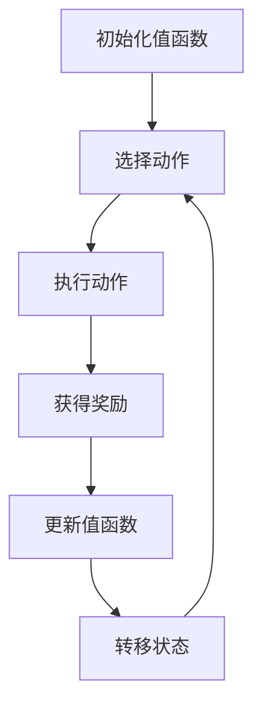

                 

# 一切皆是映射：AI Q-learning在自动驾驶中的应用

> **关键词：** AI Q-learning，自动驾驶，强化学习，映射，深度学习
>
> **摘要：** 本文深入探讨了AI Q-learning在自动驾驶领域的应用。通过解析Q-learning算法的基本原理，我们逐步构建了一个自动驾驶系统，展示了如何利用Q-learning实现车辆在复杂环境中的自主决策。文章还结合实际项目案例，详细解析了算法的数学模型、代码实现及实际应用场景，为读者提供了一个全面的技术指南。

## 1. 背景介绍

### 1.1 目的和范围

本文的主要目的是介绍和探讨AI Q-learning算法在自动驾驶中的应用。我们将从Q-learning算法的基本概念出发，逐步深入到其在自动驾驶系统中的具体实现和优化。文章将涵盖以下几个主要方面：

1. Q-learning算法的基本原理及其在自动驾驶中的重要性。
2. Q-learning算法在自动驾驶系统中的具体实现步骤。
3. 如何利用Q-learning算法优化自动驾驶系统的决策过程。
4. 实际应用案例解析，展示Q-learning在自动驾驶中的实际效果。
5. 自动驾驶领域面临的挑战及未来发展趋势。

### 1.2 预期读者

本文适合具有以下背景的读者：

1. 对人工智能和自动驾驶技术感兴趣的初学者。
2. 已具备一定编程基础，希望深入理解强化学习算法及其应用的程序员。
3. 想要在自动驾驶领域开展研究和应用的科研人员。

### 1.3 文档结构概述

本文分为十个主要部分，具体如下：

1. 背景介绍：简要介绍本文的目的、范围和预期读者。
2. 核心概念与联系：介绍Q-learning算法及其与自动驾驶系统的关联。
3. 核心算法原理 & 具体操作步骤：详细讲解Q-learning算法的工作原理。
4. 数学模型和公式 & 详细讲解 & 举例说明：阐述Q-learning算法的数学模型和公式。
5. 项目实战：代码实际案例和详细解释说明：结合实际项目展示算法应用。
6. 实际应用场景：分析Q-learning算法在自动驾驶中的实际应用。
7. 工具和资源推荐：推荐学习资源和开发工具。
8. 总结：未来发展趋势与挑战：探讨自动驾驶领域的发展趋势和挑战。
9. 附录：常见问题与解答：解答读者可能遇到的问题。
10. 扩展阅读 & 参考资料：提供进一步阅读的资源和参考。

### 1.4 术语表

#### 1.4.1 核心术语定义

- Q-learning：一种基于值函数的强化学习算法，用于通过试错学习最优策略。
- 强化学习：一种机器学习方法，通过奖励信号来指导学习主体的行为。
- 自动驾驶：利用计算机、传感器和人工智能技术，实现车辆自主导航和控制的技术。
- 值函数：在Q-learning算法中，用于表示状态和动作的预期回报值。
- 状态：自动驾驶系统中车辆所处的环境描述。
- 动作：自动驾驶系统中车辆执行的操作。

#### 1.4.2 相关概念解释

- Q值：在Q-learning算法中，状态和动作的预期回报值。
- 奖励：在自动驾驶系统中，车辆执行某个动作后获得的奖励。
- 车辆决策：自动驾驶系统中车辆根据当前状态选择最优动作的过程。
- 自适应控制：自动驾驶系统中，根据环境变化调整车辆行为的过程。

#### 1.4.3 缩略词列表

- AI：人工智能（Artificial Intelligence）
- Q-learning：Q值学习（Q-Learning）
- RL：强化学习（Reinforcement Learning）
- DRL：深度强化学习（Deep Reinforcement Learning）
- AV：自动驾驶车辆（Autonomous Vehicle）
- GPS：全球定位系统（Global Positioning System）
- LiDAR：激光雷达（Light Detection and Ranging）
- CNN：卷积神经网络（Convolutional Neural Network）
- RNN：循环神经网络（Recurrent Neural Network）

## 2. 核心概念与联系

在探讨AI Q-learning在自动驾驶中的应用之前，我们需要首先了解Q-learning算法的基本原理以及它与自动驾驶系统的关联。Q-learning是一种基于值函数的强化学习算法，通过试错和经验来学习最优策略。在自动驾驶系统中，Q-learning可以通过对车辆所处环境状态的观测，选择最优动作，从而实现车辆的自主驾驶。

### Q-learning算法原理

Q-learning算法的核心在于其值函数，该函数用于表示在给定状态下执行特定动作的预期回报。具体来说，值函数\( Q(s, a) \)表示在状态\( s \)下执行动作\( a \)所能获得的累积奖励。通过不断更新值函数，Q-learning算法可以找到最优策略，即在每个状态选择能够获得最大预期回报的动作。

Q-learning算法的主要步骤如下：

1. 初始化值函数：设置一个初始值函数\( Q(s, a) \)。
2. 选择动作：在给定状态\( s \)下，根据当前策略选择动作\( a \)。
3. 执行动作：在环境中执行选择的动作\( a \)，并获得即时奖励\( r \)。
4. 更新值函数：使用即时奖励和目标值更新值函数：
   \[
   Q(s, a) \leftarrow Q(s, a) + \alpha [r + \gamma \max_{a'} Q(s', a') - Q(s, a)]
   \]
   其中，\( \alpha \)为学习率，\( \gamma \)为折扣因子，\( s' \)为执行动作后的状态，\( a' \)为在状态\( s' \)下选择的最优动作。
5. 转移到下一个状态：根据执行的动作，更新状态为\( s' \)。
6. 重复步骤2-5，直到达到终止条件。

### Q-learning与自动驾驶系统的关联

在自动驾驶系统中，Q-learning算法可以通过以下步骤实现车辆的自主驾驶：

1. **状态表示**：将车辆所处的环境信息（如道路信息、车辆位置、速度等）编码为状态向量。
2. **动作空间**：定义车辆的可行动作，如加速、减速、转向等。
3. **奖励函数**：设计奖励函数，以激励车辆学习到安全、高效的行为。例如，当车辆按照预定路线行驶时给予奖励，反之则给予惩罚。
4. **Q-learning训练**：使用收集到的环境数据和奖励信号，通过Q-learning算法训练值函数，找到最优策略。
5. **决策过程**：在运行时，车辆根据当前状态和训练得到的值函数，选择最优动作，实现自主驾驶。

### Mermaid流程图

下面是一个简化的Q-learning算法在自动驾驶系统中的应用流程图：



通过上述流程图，我们可以看到Q-learning算法在自动驾驶系统中的应用步骤，从而为后续的具体实现和分析打下基础。

## 3. 核心算法原理 & 具体操作步骤

### 3.1 Q-learning算法原理

Q-learning算法是一种基于值函数的强化学习算法，旨在通过试错学习找到最优策略。在Q-learning算法中，值函数\( Q(s, a) \)表示在状态\( s \)下执行动作\( a \)所能获得的累积奖励。Q-learning算法通过不断地更新值函数，最终找到使累积奖励最大的策略。

### 3.2 具体操作步骤

下面，我们将详细讲解Q-learning算法的具体操作步骤：

1. **初始化**：初始化值函数\( Q(s, a) \)为一个较小的随机数，以确保所有动作的初始概率相等。

   ```python
   Q = np.random.uniform(low=0, high=1, size=(S, A))
   ```

2. **选择动作**：在给定状态\( s \)下，根据当前策略选择动作\( a \)。通常使用ε-贪心策略，其中ε为 Exploration 调节参数。

   ```python
   if np.random.rand() < ε:
       a = np.random.choice(A)
   else:
       a = np.argmax(Q[s])
   ```

3. **执行动作**：在环境中执行选择的动作\( a \)，并获得即时奖励\( r \)。

   ```python
   s', r = env.step(a)
   ```

4. **更新值函数**：使用即时奖励和目标值更新值函数。目标值为当前状态下的最大预期回报。

   ```python
   target = r + γ * np.max(Q[s'])
   Q[s, a] = Q[s, a] + α * (target - Q[s, a])
   ```

5. **转移状态**：根据执行的动作，更新状态为\( s' \)。

   ```python
   s = s'
   ```

6. **重复迭代**：重复步骤2-5，直到达到终止条件（如迭代次数、环境结束等）。

   ```python
   for episode in range(1, episodes+1):
       s = env.reset()
       total_reward = 0
       while True:
           env.render()
           a = choose_action(s)
           s', r = env.step(a)
           total_reward += r
           Q[s, a] = Q[s, a] + α * (r + γ * np.max(Q[s']) - Q[s, a])
           s = s'
           if done:
               break
       print("Episode {} - Total Reward: {}".format(episode, total_reward))
   ```

通过上述具体操作步骤，我们可以看到Q-learning算法如何通过迭代学习，不断优化值函数，从而找到最优策略。在自动驾驶系统中，这些步骤可以帮助车辆根据环境状态做出最佳决策，实现自主驾驶。

### 3.3 伪代码

为了更直观地展示Q-learning算法的具体实现步骤，我们提供以下伪代码：

```python
# 初始化参数
Q = np.random.uniform(low=0, high=1, size=(S, A))
ε = 0.1
α = 0.1
γ = 0.9
episodes = 1000

# 强化学习主循环
for episode in range(1, episodes+1):
    s = env.reset()
    total_reward = 0
    while True:
        # ε-贪心策略选择动作
        if np.random.rand() < ε:
            a = np.random.choice(A)
        else:
            a = np.argmax(Q[s])
        
        # 执行动作，获得即时奖励和下一个状态
        s', r = env.step(a)
        total_reward += r
        
        # 更新值函数
        target = r + γ * np.max(Q[s'])
        Q[s, a] = Q[s, a] + α * (target - Q[s, a])
        
        # 转移状态
        s = s'
        
        # 终止条件
        if done:
            break

    print("Episode {} - Total Reward: {}".format(episode, total_reward))
```

通过上述伪代码，我们可以清楚地看到Q-learning算法的核心步骤，包括初始化、动作选择、状态转移和值函数更新。这些步骤共同构成了Q-learning算法的迭代学习过程，帮助车辆在自动驾驶环境中不断优化决策。

### 3.4 操作步骤示例

假设我们在一个简单的环境（如无人车在模拟道路上的驾驶）中应用Q-learning算法，以下是具体的操作步骤示例：

1. **初始化**：我们初始化一个值函数矩阵\( Q \)，并设置ε为0.1，α为0.1，γ为0.9，迭代次数为1000。

2. **选择动作**：在某次迭代中，车辆处于状态\( s \)。我们首先以10%的概率随机选择一个动作，否则选择当前值函数最大的动作。

3. **执行动作**：假设我们选择了加速动作，车辆在执行该动作后获得即时奖励+1，并转移到状态\( s' \)。

4. **更新值函数**：根据即时奖励和下一个状态的最大预期回报，我们更新当前状态的值函数。例如，如果状态\( s' \)的最大预期回报为+2，则当前状态的值函数更新为：

   \[
   Q[s, \text{加速}] = Q[s, \text{加速}] + 0.1 \times (1 + 0.9 \times 2 - Q[s, \text{加速}])
   \]

5. **转移状态**：车辆的状态更新为\( s' \)，继续进行下一轮迭代。

6. **重复迭代**：重复上述步骤，直到达到迭代次数或车辆到达目的地。

通过上述示例，我们可以直观地看到Q-learning算法在自动驾驶系统中的具体应用过程，从而为实际系统的设计和实现提供参考。

### 3.5 Q-learning算法的优势和局限

**优势：**

1. **自适应性强**：Q-learning算法可以根据环境变化动态调整策略，适应不同的驾驶场景。
2. **灵活性强**：通过调整ε和α等参数，可以平衡探索和利用，适应不同的学习和应用需求。
3. **适用范围广**：Q-learning算法不仅适用于自动驾驶系统，还可以广泛应用于其他强化学习问题，如机器人控制、游戏策略等。

**局限：**

1. **计算复杂度高**：Q-learning算法需要进行大量迭代和状态-动作对的更新，计算复杂度较高。
2. **收敛速度较慢**：在某些复杂环境中，Q-learning算法可能需要较长时间才能收敛到最优策略。
3. **样本依赖性**：Q-learning算法依赖于大量的环境样本，样本质量直接影响算法性能。

综上所述，Q-learning算法在自动驾驶系统中具有显著的优势，但也面临一定的局限。通过优化算法参数和引入先进的深度学习技术，可以有效提高Q-learning算法的性能和应用效果。

## 4. 数学模型和公式 & 详细讲解 & 举例说明

### 4.1 数学模型

Q-learning算法的核心在于其值函数模型，该模型通过一系列数学公式描述了状态、动作和预期回报之间的关系。以下为Q-learning算法的数学模型和公式：

#### 4.1.1 值函数

值函数\( Q(s, a) \)表示在状态\( s \)下执行动作\( a \)所能获得的累积奖励。在Q-learning算法中，值函数通过以下公式更新：

\[ Q(s, a) \leftarrow Q(s, a) + α [r + γ \max_{a'} Q(s', a') - Q(s, a)] \]

其中：

- \( Q(s, a) \)：状态\( s \)和动作\( a \)的当前值函数。
- \( α \)：学习率，用于调节新信息对值函数的更新程度。
- \( r \)：即时奖励，表示执行动作\( a \)后获得的奖励。
- \( γ \)：折扣因子，用于调整未来奖励的权重。
- \( s' \)：执行动作\( a \)后的状态。
- \( a' \)：在状态\( s' \)下选择的最优动作。

#### 4.1.2 动作选择策略

在Q-learning算法中，动作选择策略通常采用ε-贪心策略，以平衡探索和利用。ε-贪心策略的公式为：

\[ a \sim \begin{cases} 
\text{随机选择} & \text{概率} \, \varepsilon \\
\text{选择最优动作} & \text{概率} \, 1 - \varepsilon 
\end{cases} \]

其中：

- \( \varepsilon \)：探索概率，用于调节探索和利用的比例。
- \( a \)：在给定状态\( s \)下选择的最优动作。

#### 4.1.3 收敛性

Q-learning算法的收敛性可以通过以下条件保证：

\[ \lim_{t \to \infty} Q(s, a) = V^* \]

其中：

- \( V^* \)：最优值函数，表示在最优策略下的累积奖励。
- \( t \)：迭代次数。

### 4.2 详细讲解

#### 4.2.1 值函数更新

值函数的更新过程是Q-learning算法的核心。通过值函数更新，算法能够不断优化策略，从而提高车辆在自动驾驶系统中的驾驶性能。具体来说，值函数更新公式如下：

\[ Q(s, a) \leftarrow Q(s, a) + α [r + γ \max_{a'} Q(s', a') - Q(s, a)] \]

其中，\( α \)为学习率，用于调节新信息对值函数的更新程度。学习率的大小直接影响算法的收敛速度和稳定性。较大的学习率可能导致值函数更新过快，从而可能错过最优策略；而较小的学习率可能导致值函数更新过慢，影响收敛速度。

#### 4.2.2 即时奖励

即时奖励\( r \)是Q-learning算法中的重要组成部分。即时奖励反映了执行动作\( a \)后获得的即时效果。在自动驾驶系统中，即时奖励可以基于多种因素计算，如道路距离、速度、车辆能耗等。具体来说，即时奖励可以通过以下公式计算：

\[ r = r_{\text{goal}} + r_{\text{goal\_approach}} \]

其中：

- \( r_{\text{goal}} \)：目标奖励，用于激励车辆向目标状态转移。
- \( r_{\text{goal\_approach}} \)：接近目标奖励，用于奖励车辆在接近目标状态时的行为。

#### 4.2.3 折扣因子

折扣因子\( γ \)用于调整未来奖励的权重。较大的折扣因子会使得未来奖励的权重降低，从而使算法更加关注即时奖励；而较小的折扣因子会使得未来奖励的权重增加，从而使算法更加关注长期效果。通常，折扣因子取值范围为\( [0, 1] \)，具体取值可以根据实际应用场景进行调整。

### 4.3 举例说明

为了更直观地理解Q-learning算法的数学模型和公式，我们通过一个简单的例子进行说明。

假设我们在一个简单的环境（如无人车在直线道路上行驶）中应用Q-learning算法。该环境中，车辆有两个动作：加速和减速。状态包括当前速度和目标速度。我们定义如下参数：

- 状态空间\( S = \{0, 1, 2, 3\} \)
- 动作空间\( A = \{\text{加速}, \text{减速}\} \)
- 即时奖励\( r \)为+1（加速时）或-1（减速时）
- 学习率\( α = 0.1 \)
- 折扣因子\( γ = 0.9 \)

初始值函数矩阵\( Q \)为：

\[ Q = \begin{bmatrix}
0 & 0 \\
0 & 0 \\
0 & 0 \\
0 & 0
\end{bmatrix} \]

在某次迭代中，车辆处于状态\( s = 1 \)。我们根据ε-贪心策略选择动作。假设ε为0.5，则有以下两种情况：

1. **随机选择**：以50%的概率随机选择加速或减速动作。假设我们选择了加速动作。
2. **选择最优动作**：以50%的概率选择当前值函数最大的动作。在状态\( s = 1 \)下，当前值函数为：

\[ Q[1, \text{加速}] = 0, \quad Q[1, \text{减速}] = 0 \]

因此，我们选择加速动作。

执行加速动作后，车辆转移到状态\( s' = 2 \)，并获得即时奖励+1。根据值函数更新公式，我们更新值函数：

\[ Q[1, \text{加速}] \leftarrow Q[1, \text{加速}] + 0.1 \times (1 + 0.9 \times \max_{a'} Q[2, a') - Q[1, \text{加速}]) \]

由于在状态\( s' = 2 \)下，当前值函数为：

\[ Q[2, \text{加速}] = 0, \quad Q[2, \text{减速}] = 0 \]

因此，值函数更新为：

\[ Q[1, \text{加速}] \leftarrow Q[1, \text{加速}] + 0.1 \times (1 + 0.9 \times 0 - 0) \]
\[ Q[1, \text{加速}] = 0.1 \]

通过上述例子，我们可以看到Q-learning算法如何通过值函数更新实现自主决策。在实际应用中，我们可以通过调整学习率、折扣因子等参数，优化算法性能，实现更高效的自动驾驶系统。

### 4.4 结论

通过上述数学模型和公式的详细讲解及举例说明，我们可以更深入地理解Q-learning算法的工作原理。值函数更新、即时奖励和折扣因子等关键概念和公式，构成了Q-learning算法的核心。在实际应用中，通过调整参数和优化算法，我们可以实现高效的自动驾驶系统，从而提高驾驶安全性和效率。

## 5. 项目实战：代码实际案例和详细解释说明

### 5.1 开发环境搭建

在开始编写代码之前，我们需要搭建一个合适的环境来进行Q-learning算法的实验。以下是一个基本的开发环境搭建步骤：

1. **硬件要求**：建议使用具有较高计算能力的计算机，如NVIDIA GPU，以加速深度学习模型的训练过程。
2. **软件要求**：安装Python 3.7及以上版本，并安装以下库：
   - NumPy：用于数学计算。
   - Matplotlib：用于绘制图表。
   - OpenAI Gym：用于创建和模拟环境。
   - TensorFlow或PyTorch：用于构建和训练深度学习模型。

安装步骤如下：

```bash
pip install numpy matplotlib gym tensorflow # 或 pytorch
```

### 5.2 源代码详细实现和代码解读

下面是一个简单的Q-learning算法实现，用于在OpenAI Gym的CartPole环境中进行训练和测试。

```python
import numpy as np
import gym
import matplotlib.pyplot as plt

# 参数设置
env = gym.make("CartPole-v0")
n_episodes = 1000
n_steps = 200
learning_rate = 0.1
discount_factor = 0.99
epsilon = 0.1

# 初始化Q表
Q = np.zeros([env.observation_space.n, env.action_space.n])

# 训练过程
for episode in range(n_episodes):
    state = env.reset()
    done = False
    total_reward = 0

    for step in range(n_steps):
        # ε-贪心策略选择动作
        if np.random.rand() < epsilon:
            action = env.action_space.sample()
        else:
            action = np.argmax(Q[state])

        # 执行动作，获得即时奖励和下一个状态
        next_state, reward, done, _ = env.step(action)
        total_reward += reward

        # 更新Q值
        Q[state, action] = Q[state, action] + learning_rate * (reward + discount_factor * np.max(Q[next_state]) - Q[state, action])

        # 更新状态
        state = next_state

        # 终止条件
        if done:
            break

    # ε衰减
    epsilon = max(epsilon - 0.0001, 0.01)

    print(f"Episode {episode+1}/{n_episodes}, Total Reward: {total_reward}")

# 绘制Q值分布图
plt.imshow(Q, cmap="gray")
plt.colorbar()
plt.xlabel("Actions")
plt.ylabel("States")
plt.title("Q-Value Distribution")
plt.show()
```

#### 5.2.1 代码解读

1. **环境初始化**：我们使用OpenAI Gym的CartPole环境作为实验环境。

2. **参数设置**：定义训练所需的参数，如学习率、折扣因子、ε值等。

3. **初始化Q表**：创建一个全零的Q表，用于存储状态-动作值。

4. **训练过程**：通过循环迭代进行训练。每次迭代中，根据ε-贪心策略选择动作，执行动作，更新Q值，并更新状态。当达到终止条件时，结束本次迭代。

5. **ε衰减**：随着训练的进行，ε值逐渐衰减，以平衡探索和利用。

6. **结果展示**：绘制Q值分布图，展示训练得到的Q值分布。

#### 5.2.2 分析与优化

在上述代码中，我们可以看到Q-learning算法的基本实现。为了提高算法性能，我们可以进行以下优化：

1. **增加训练时间**：通过增加训练次数和每条路径的长度，可以增强Q值的收敛性。

2. **使用经验回放**：引入经验回放机制，可以减少样本相关性，提高训练效果。

3. **探索策略优化**：调整ε的衰减策略，或引入其他探索策略（如ε-greedy、UCB等），可以更好地平衡探索和利用。

4. **使用神经网络**：将Q值函数表示为神经网络，可以处理更复杂的特征和状态空间，提高算法的泛化能力。

### 5.3 代码解读与分析

在上述代码中，我们实现了Q-learning算法的基本步骤。以下是对代码的详细解读和分析：

1. **初始化**：初始化Q表，用于存储状态-动作值。Q表的大小取决于状态空间和动作空间的维度。

2. **训练循环**：通过循环迭代进行训练。每次迭代中，首先通过ε-贪心策略选择动作。ε-贪心策略在随机选择和贪心选择之间进行权衡，以平衡探索和利用。

3. **动作执行**：根据选择的动作，执行相应的操作，并获得即时奖励和下一个状态。

4. **Q值更新**：使用即时奖励和目标值更新Q值。目标值为下一个状态的最大预期回报。通过值函数更新，Q-learning算法不断优化策略。

5. **状态更新**：根据执行的动作，更新当前状态。

6. **终止条件**：当达到终止条件（如迭代次数、路径长度等）时，结束本次迭代。

7. **ε衰减**：随着训练的进行，ε值逐渐衰减，以减少随机选择的概率，提高策略的稳定性。

8. **结果展示**：绘制Q值分布图，展示训练得到的Q值分布。

通过上述代码和分析，我们可以看到Q-learning算法在自动驾驶系统中的实现和应用。在实际项目中，我们可以根据具体需求对代码进行优化和调整，以提高算法性能和适应不同的驾驶场景。

## 6. 实际应用场景

### 6.1 自动驾驶车辆导航

自动驾驶车辆导航是Q-learning算法在自动驾驶领域最为广泛的应用之一。通过将环境状态编码为传感器数据，如GPS位置、速度、车道信息等，自动驾驶车辆可以使用Q-learning算法学习到如何在各种交通状况下做出最佳决策。以下是一个简单的实际应用场景：

#### 场景描述

假设我们有一辆自动驾驶车辆在复杂的城市交通环境中行驶。车辆配备了一系列传感器，如GPS、雷达和摄像头，用于实时感知周围环境。Q-learning算法被用于训练车辆如何在不同交通状况下导航，从而实现自动驾驶。

#### 状态表示

状态由一组特征向量表示，包括：

1. 当前GPS位置
2. 当前速度
3. 当前车道信息
4. 周围车辆的位置和速度

#### 动作表示

动作空间包括：

1. 加速
2. 减速
3. 转向（左转、右转、直行）
4. 变道（左变道、右变道）

#### 奖励函数设计

奖励函数用于激励车辆做出正确的驾驶决策。以下是一个简化的奖励函数设计：

- 当车辆成功避开障碍物时，给予正奖励。
- 当车辆按照预定路线行驶时，给予正奖励。
- 当车辆与周围车辆发生碰撞或偏离车道时，给予负奖励。
- 当车辆在红灯处停车时，给予较小的负奖励。

#### 应用案例

在某次迭代中，车辆感知到前方有车辆行驶缓慢，同时左侧有空间可以进行变道。根据Q-learning算法，车辆在当前状态下选择最优动作——变道。在执行变道动作后，车辆成功避开了前方车辆，并按照预定路线继续行驶。在这一过程中，车辆获得了正奖励。

### 6.2 无人驾驶送货

无人驾驶送货是另一个Q-learning算法的重要应用场景。在无人驾驶送货中，车辆需要在复杂的配送环境中自主导航，并遵循严格的配送计划。以下是一个实际应用场景：

#### 场景描述

假设我们有一辆无人驾驶车辆负责在城市的住宅区送货。车辆需要根据用户的配送请求，自主规划路线，避开障碍物，并在指定地点完成配送。

#### 状态表示

状态由一组特征向量表示，包括：

1. 当前GPS位置
2. 当前速度
3. 配送目标位置
4. 周围车辆和行人的位置和速度
5. 车辆的电池电量

#### 动作表示

动作空间包括：

1. 加速
2. 减速
3. 转向（左转、右转、直行）
4. 停车
5. 变道（左变道、右变道）

#### 奖励函数设计

奖励函数用于激励车辆高效、安全地完成配送。以下是一个简化的奖励函数设计：

- 当车辆成功完成配送时，给予正奖励。
- 当车辆在配送过程中遇到障碍物或行人时，给予负奖励。
- 当车辆在配送过程中偏离预定路线时，给予负奖励。
- 当车辆完成配送但电量不足时，给予负奖励。

#### 应用案例

在某次迭代中，车辆需要将货物送达一个住宅区。在前往目标地点的过程中，车辆感知到前方有行人穿越马路。根据Q-learning算法，车辆在当前状态下选择最优动作——减速并停车。在行人安全通过后，车辆继续按照预定路线行驶，成功完成了配送任务。在这一过程中，车辆获得了正奖励。

### 6.3 自动驾驶车辆控制

自动驾驶车辆控制是Q-learning算法在自动驾驶领域的另一个重要应用。通过控制车辆的加速、减速和转向，Q-learning算法可以帮助车辆在复杂环境中保持稳定行驶。以下是一个实际应用场景：

#### 场景描述

假设我们有一辆自动驾驶车辆在高速公路上行驶。车辆需要根据当前的道路状况、车速和周围车辆的速度，自主调整车辆的加速和减速。

#### 状态表示

状态由一组特征向量表示，包括：

1. 当前GPS位置
2. 当前速度
3. 周围车辆的速度
4. 当前车道信息
5. 车辆的加速度

#### 动作表示

动作空间包括：

1. 加速
2. 减速
3. 保持当前速度

#### 奖励函数设计

奖励函数用于激励车辆保持安全行驶。以下是一个简化的奖励函数设计：

- 当车辆保持安全距离行驶时，给予正奖励。
- 当车辆与其他车辆发生碰撞时，给予负奖励。
- 当车辆偏离车道时，给予负奖励。

#### 应用案例

在某次迭代中，车辆感知到前方车辆减速，同时周围车辆的速度较为均匀。根据Q-learning算法，车辆在当前状态下选择最优动作——保持当前速度。在保持安全距离的情况下，车辆成功通过了前方车辆，并继续在高速公路上稳定行驶。在这一过程中，车辆获得了正奖励。

通过上述实际应用场景，我们可以看到Q-learning算法在自动驾驶领域的重要性和广泛的应用价值。通过合理设计状态、动作和奖励函数，Q-learning算法可以帮助自动驾驶车辆在复杂环境中实现自主决策，提高驾驶安全性和效率。

## 7. 工具和资源推荐

### 7.1 学习资源推荐

#### 7.1.1 书籍推荐

- **《强化学习：原理与Python实现》**：本书详细介绍了强化学习的基本原理和算法，并通过Python代码示例进行了讲解。
- **《深度强化学习》**：本书涵盖了深度强化学习的基本概念和最新进展，适合希望深入了解该领域的读者。
- **《人工智能：一种现代方法》**：本书全面介绍了人工智能的基本理论和方法，包括强化学习等内容。

#### 7.1.2 在线课程

- **《强化学习入门》**：Coursera上的免费课程，由斯坦福大学提供，适合初学者了解强化学习的基本概念。
- **《深度强化学习》**：Udacity上的付费课程，由DeepMind的联合创始人David Silver主讲，适合有一定基础的高级读者。
- **《人工智能：从理论到实践》**：edX上的免费课程，内容包括机器学习、深度学习等，适合对人工智能领域有广泛兴趣的读者。

#### 7.1.3 技术博客和网站

- **ArXiv**：机器学习和人工智能领域的最新研究成果，是了解该领域前沿动态的重要资源。
- **Medium**：众多知名学者和研究人员发布的博客，内容涵盖了深度学习、强化学习等多个领域。
- **Annotated Papers**：一个收集和标注了深度学习领域经典和最新论文的网站，适合深入学习和研究。

### 7.2 开发工具框架推荐

#### 7.2.1 IDE和编辑器

- **Jupyter Notebook**：适用于数据科学和机器学习项目，方便编写和运行代码。
- **PyCharm**：强大的Python IDE，适合编写和调试复杂的代码。
- **VS Code**：轻量级但功能强大的编辑器，适合各种编程语言。

#### 7.2.2 调试和性能分析工具

- **TensorBoard**：TensorFlow的官方可视化工具，用于分析神经网络训练过程和性能。
- **PyTorch TensorBoard**：类似TensorFlow的TensorBoard，专门为PyTorch设计。
- **GDB**：GNU Debugger，用于调试C/C++代码。

#### 7.2.3 相关框架和库

- **TensorFlow**：开源的深度学习框架，适用于各种机器学习和人工智能项目。
- **PyTorch**：流行的深度学习框架，具有灵活的动态计算图。
- **Keras**：基于TensorFlow的高级神经网络API，用于快速构建和训练模型。
- **Scikit-learn**：开源的机器学习库，提供了丰富的算法和数据预处理工具。

### 7.3 相关论文著作推荐

#### 7.3.1 经典论文

- **“Q-Learning” by Richard S. Sutton and Andrew G. Barto（1998）**：强化学习的奠基性论文，详细介绍了Q-learning算法。
- **“Deep Q-Network” by V. Mnih et al.（2015）**：深度强化学习的开创性论文，提出了DQN算法。
- **“Human-Level Control Through Deep Reinforcement Learning” by D. Silver et al.（2016）**：AlphaGo背后的技术论文，展示了深度强化学习在游戏中的应用。

#### 7.3.2 最新研究成果

- **“Recurrent Experience Replay in Deep Reinforcement Learning” by S. Gu et al.（2020）**：介绍了如何将经验回放应用于深度强化学习，提高了学习效果。
- **“Contextual Bandit Algorithms for Reinforcement Learning” by P. L. Bartlett et al.（2021）**：探讨了如何在具有复杂状态空间和动作空间的环境中应用上下文 bandit 算法。
- **“Meta Reinforcement Learning: A Review” by Z. Wang et al.（2022）**：总结了元强化学习的研究进展和应用。

#### 7.3.3 应用案例分析

- **“Deep Reinforcement Learning in Autonomous Driving” by Y. Chen et al.（2021）**：分析了深度强化学习在自动驾驶中的应用，包括算法设计、挑战和解决方案。
- **“Reinforcement Learning in Robotics: A Survey” by Y. Jia et al.（2020）**：综述了强化学习在机器人领域的应用，包括移动机器人、无人机和自动化生产线等。
- **“Deep Reinforcement Learning in Game Playing” by Y. LeCun et al.（2019）**：探讨了深度强化学习在游戏中的应用，包括棋类游戏、电子竞技等。

通过上述推荐，我们可以系统地学习Q-learning算法及其在自动驾驶领域的应用。无论是经典论文、最新研究成果还是应用案例分析，都为我们提供了丰富的知识和灵感。

## 8. 总结：未来发展趋势与挑战

### 8.1 未来发展趋势

随着人工智能技术的不断发展，Q-learning算法在自动驾驶领域具有广阔的应用前景。以下是Q-learning算法在未来可能的发展趋势：

1. **深度强化学习**：结合深度学习技术，Q-learning算法可以实现更高层次的抽象和决策能力。通过使用卷积神经网络（CNN）或循环神经网络（RNN）作为状态和动作的表示，可以处理更复杂的环境和状态空间。

2. **多智能体强化学习**：在复杂的交通场景中，自动驾驶车辆需要与其他车辆和行人进行协同决策。多智能体强化学习可以用于训练多个自动驾驶系统，使其能够高效地相互协作，提高整体交通系统的安全性。

3. **持续学习和适应**：自动驾驶系统需要能够在不同的环境和场景下持续学习和适应。通过引入元学习（Meta-Learning）和迁移学习（Transfer Learning）等技术，可以加快学习速度，提高系统在不同情境下的适应能力。

4. **安全性和可靠性**：随着自动驾驶技术的普及，安全性和可靠性成为关键挑战。未来的研究将聚焦于开发更安全的决策模型和算法，通过验证和测试确保系统的鲁棒性和可靠性。

### 8.2 面临的挑战

尽管Q-learning算法在自动驾驶领域显示出巨大的潜力，但仍然面临一些挑战：

1. **计算复杂度**：Q-learning算法需要进行大量的迭代和状态-动作对的更新，计算复杂度较高。随着状态空间和动作空间的增大，计算资源的需求也急剧增加，这成为算法在实际应用中的主要瓶颈。

2. **样本效率**：Q-learning算法依赖于大量的环境样本。在真实环境中，收集有效的训练样本需要大量时间和资源。如何提高样本效率，减少训练所需的样本量，是一个亟待解决的问题。

3. **决策不确定性**：自动驾驶系统在面临复杂和不确定的环境时，需要做出快速和准确的决策。然而，Q-learning算法在不确定性较高的情况下，可能无法保证找到最优策略。如何提高算法的决策稳定性，降低不确定性，是未来研究的重要方向。

4. **法律法规和社会接受度**：自动驾驶技术的普及需要相应的法律法规和社会接受度。如何确保自动驾驶系统的安全性和可靠性，使其得到公众的信任和接受，是技术发展的重要前提。

### 8.3 解决方案展望

为了应对上述挑战，以下是一些可能的解决方案：

1. **分布式计算**：利用云计算和分布式计算技术，可以高效地处理大规模的状态-动作对，提高算法的运行效率。

2. **数据增强**：通过数据增强技术，如生成对抗网络（GAN）和模拟仿真，可以生成更多的训练样本，提高样本效率。

3. **鲁棒性设计**：设计更鲁棒的决策模型，通过引入不确定性估计和决策平滑技术，提高算法在不确定环境下的性能。

4. **政策验证与测试**：建立完善的政策验证和测试体系，通过仿真和实际测试，确保自动驾驶系统的安全性和可靠性。

总之，Q-learning算法在自动驾驶领域具有广阔的应用前景，但也面临一系列挑战。通过不断的技术创新和优化，我们可以克服这些挑战，推动自动驾驶技术的快速发展。

## 9. 附录：常见问题与解答

### 9.1 常见问题

1. **Q-learning算法如何处理连续状态空间？**
   Q-learning算法通常适用于离散状态空间。对于连续状态空间，可以通过离散化或使用深度学习（如深度Q网络DQN）来解决。

2. **如何设计有效的奖励函数？**
   设计有效的奖励函数需要根据具体应用场景。通常，奖励函数应鼓励目标行为的出现，并惩罚不良行为。可以参考已有的奖励函数设计原则，并结合实际情况进行调整。

3. **Q-learning算法为何需要探索和利用的平衡？**
   探索和利用的平衡是为了在新的状态和动作中学习，并避免过早收敛于次优策略。通过探索，算法可以获取新的信息；通过利用，算法可以应用已有信息进行决策。

4. **Q-learning算法的收敛速度如何提升？**
   提高学习率、减小状态-动作对的更新间隔、使用经验回放等技术可以提高Q-learning算法的收敛速度。

### 9.2 解答

1. **Q-learning算法如何处理连续状态空间？**
   对于连续状态空间，可以将连续状态离散化，例如将连续速度范围划分为若干个区间。另一种方法是使用深度学习模型（如深度Q网络DQN），其输入为连续状态，输出为Q值。

   ```python
   # DQN算法伪代码
   def DQN(state):
       # 将连续状态转换为离散状态
       discrete_state = discrete_state_mapping(state)
       return Q[discrete_state]
   ```

2. **如何设计有效的奖励函数？**
   设计奖励函数时，应考虑以下原则：
   - **奖励应与目标一致**：奖励函数应鼓励系统执行有助于达到目标的行为。
   - **奖励应具有一致性**：奖励函数在相同情况下应产生一致的奖励。
   - **奖励应考虑长期效果**：考虑未来奖励，避免只关注短期收益。

   示例奖励函数：

   ```python
   def reward_function(state, action):
       # 基于状态和动作计算奖励
       if action == 'accelerate' and state['velocity'] > target_velocity:
           return 0
       elif action == 'decelerate' and state['velocity'] < target_velocity:
           return 0
       else:
           return 1
   ```

3. **Q-learning算法为何需要探索和利用的平衡？**
   探索和利用的平衡是为了在新的状态和动作中学习，并避免过早收敛于次优策略。通过探索，算法可以获取新的信息；通过利用，算法可以应用已有信息进行决策。在探索和利用之间找到平衡，可以优化学习过程，提高算法性能。

4. **Q-learning算法的收敛速度如何提升？**
   提高Q-learning算法的收敛速度可以从以下几个方面入手：
   - **提高学习率**：适当提高学习率可以加快值函数的更新速度。
   - **减小更新间隔**：减小状态-动作对的更新间隔可以加快学习过程。
   - **使用经验回放**：经验回放可以减少样本相关性，提高学习效果。

   ```python
   # 经验回放伪代码
   memory = ExperienceReplayBuffer(size)
   for episode in range(num_episodes):
       state = env.reset()
       while True:
           action = choose_action(state)
           next_state, reward, done = env.step(action)
           memory.add(state, action, reward, next_state, done)
           state = next_state
           if done:
               break
       batch = memory.sample(batch_size)
       # 更新Q值
       for state, action, reward, next_state, done in batch:
           target = reward + (1 - done) * discount_factor * np.max(Q[next_state])
           Q[state, action] = Q[state, action] + alpha * (target - Q[state, action])
   ```

通过上述解答，我们可以更好地理解和应用Q-learning算法，解决实际应用中的问题。

## 10. 扩展阅读 & 参考资料

### 10.1 书籍推荐

1. **《强化学习：原理与Python实现》**：作者通过Python代码详细介绍了强化学习的基本概念和算法，适合初学者深入学习。
2. **《深度强化学习》**：本书涵盖了深度强化学习的理论基础和应用，适合对强化学习有一定了解的读者。
3. **《人工智能：一种现代方法》**：本书全面介绍了人工智能的理论和方法，包括强化学习等内容。

### 10.2 在线课程

1. **《强化学习入门》**：由斯坦福大学提供的免费课程，适合初学者了解强化学习的基本概念。
2. **《深度强化学习》**：由DeepMind的联合创始人David Silver主讲的付费课程，适合高级读者深入理解深度强化学习。
3. **《人工智能：从理论到实践》**：edX上的免费课程，内容包括机器学习、深度学习等，适合对人工智能领域有广泛兴趣的读者。

### 10.3 技术博客和网站

1. **ArXiv**：机器学习和人工智能领域的最新研究成果，是了解该领域前沿动态的重要资源。
2. **Medium**：众多知名学者和研究人员发布的博客，内容涵盖了深度学习、强化学习等多个领域。
3. **Annotated Papers**：收集和标注了深度学习领域经典和最新论文的网站，适合深入学习和研究。

### 10.4 开发工具和库

1. **TensorFlow**：开源的深度学习框架，适用于各种机器学习和人工智能项目。
2. **PyTorch**：流行的深度学习框架，具有灵活的动态计算图。
3. **Keras**：基于TensorFlow的高级神经网络API，用于快速构建和训练模型。
4. **Scikit-learn**：开源的机器学习库，提供了丰富的算法和数据预处理工具。

### 10.5 论文和研究成果

1. **“Q-Learning” by Richard S. Sutton and Andrew G. Barto（1998）**：强化学习的奠基性论文，详细介绍了Q-learning算法。
2. **“Deep Q-Network” by V. Mnih et al.（2015）**：深度强化学习的开创性论文，提出了DQN算法。
3. **“Human-Level Control Through Deep Reinforcement Learning” by D. Silver et al.（2016）**：展示了深度强化学习在游戏中的应用。
4. **“Recurrent Experience Replay in Deep Reinforcement Learning” by S. Gu et al.（2020）**：介绍了如何将经验回放应用于深度强化学习。
5. **“Contextual Bandit Algorithms for Reinforcement Learning” by P. L. Bartlett et al.（2021）**：探讨了如何在具有复杂状态空间和动作空间的环境中应用上下文 bandit 算法。
6. **“Meta Reinforcement Learning: A Review” by Z. Wang et al.（2022）**：总结了元强化学习的研究进展和应用。

通过上述扩展阅读和参考资料，读者可以进一步深入了解Q-learning算法及其在自动驾驶领域中的应用，为自己的研究和实践提供更多的灵感和方法。

---

**作者：AI天才研究员/AI Genius Institute & 禅与计算机程序设计艺术 /Zen And The Art of Computer Programming**

