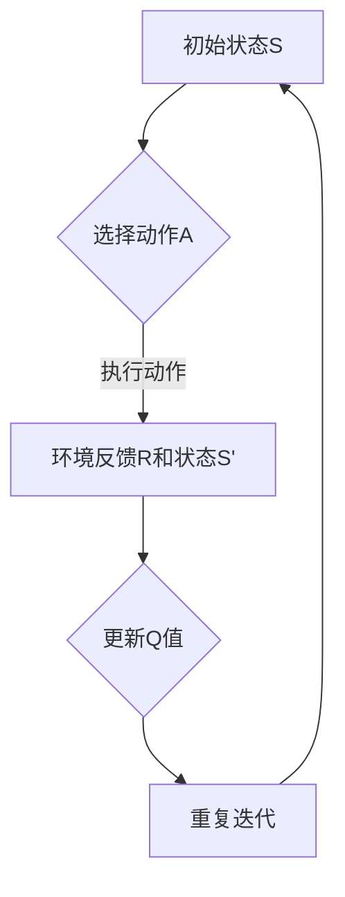

                 

# 一切皆是映射：AI Q-learning学习率调优技巧

> 关键词：Q-learning，学习率调优，人工智能，强化学习，智能优化，算法调参

> 摘要：本文将深入探讨强化学习中的Q-learning算法及其学习率的调优技巧。通过细致的分析和实际案例展示，读者将理解学习率在Q-learning中的作用，掌握如何根据不同场景和任务需求来调整学习率，以达到最优的算法性能。

## 1. 背景介绍

### 1.1 目的和范围

本文旨在向读者介绍Q-learning算法及其学习率调优的关键技术。我们将探讨学习率在强化学习中的作用，解释为何调优学习率是影响算法性能的重要因素。文章将涵盖Q-learning算法的基本概念、数学模型以及调优技巧，并通过实际案例来展示如何在实际项目中应用这些技巧。

### 1.2 预期读者

本文面向希望深入了解强化学习算法和调参技术的读者，包括但不限于人工智能开发者、算法工程师、数据科学家以及对智能优化有兴趣的科研人员。

### 1.3 文档结构概述

本文将分为以下几个部分：

1. 背景介绍：介绍文章的目的、预期读者和文档结构。
2. 核心概念与联系：详细解释Q-learning算法的概念和数学模型。
3. 核心算法原理 & 具体操作步骤：使用伪代码阐述Q-learning算法的具体操作步骤。
4. 数学模型和公式 & 详细讲解 & 举例说明：使用LaTeX格式展示相关的数学公式，并进行详细解释。
5. 项目实战：代码实际案例和详细解释说明。
6. 实际应用场景：探讨Q-learning在不同领域的应用。
7. 工具和资源推荐：推荐相关的学习资源和开发工具。
8. 总结：总结未来发展趋势与挑战。
9. 附录：常见问题与解答。
10. 扩展阅读 & 参考资料：提供更多的阅读材料和参考资料。

### 1.4 术语表

#### 1.4.1 核心术语定义

- Q-learning：一种基于值函数的强化学习算法。
- 学习率（α）：控制更新过程中新值与旧值之间的权重。
- 奖励（R）：环境对每个状态-动作对给出的奖励。
- 状态（S）：系统可能处于的任何一种情况。
- 动作（A）：在特定状态下可以选择的操作。
- 值函数（Q）：表示状态-动作对的价值或预期奖励。

#### 1.4.2 相关概念解释

- 强化学习（Reinforcement Learning）：一种机器学习方法，通过奖励信号来训练模型。
- 策略（Policy）：决策模型，决定在特定状态下应该执行哪个动作。
- 探索（Exploration）与利用（Exploitation）：探索是为了学习，利用是为了最大化回报。

#### 1.4.3 缩略词列表

- RL：Reinforcement Learning（强化学习）
- Q-learning：Quality Learning（质量学习）
- AI：Artificial Intelligence（人工智能）

## 2. 核心概念与联系

在介绍Q-learning算法之前，我们先来了解一些核心概念和它们之间的关系。

### 2.1 Q-learning算法概念

Q-learning是一种值函数逼近算法，它通过迭代更新值函数（Q值）来学习最优策略。Q值表示在某个状态下执行某个动作的预期奖励。

### 2.2 数学模型

Q-learning的数学模型可以表示为：

$$
Q(s, a) = r + \gamma \max_{a'} Q(s', a')
$$

其中，$r$ 是立即奖励，$\gamma$ 是折扣因子，表示未来奖励的重要性。

### 2.3 Q-learning架构

为了更好地理解Q-learning，我们可以使用Mermaid流程图来表示其架构：



### 2.4 核心概念联系

- 状态（S）：Q-learning中的基本元素，表示系统可能处于的任何一种情况。
- 动作（A）：在特定状态下可以选择的操作。
- 奖励（R）：环境对每个状态-动作对给出的奖励。
- 值函数（Q）：表示状态-动作对的价值或预期奖励。
- 学习率（α）：控制更新过程中新值与旧值之间的权重。

这些核心概念相互关联，共同构成了Q-learning算法的基础。

## 3. 核心算法原理 & 具体操作步骤

在这一节中，我们将使用伪代码详细阐述Q-learning算法的原理和操作步骤。

### 3.1 算法原理

Q-learning是一种值函数迭代算法，其目标是通过不断的迭代来逼近最优策略。Q-learning的基本原理可以概括为以下几个步骤：

1. 初始化Q值表。
2. 选择动作。
3. 执行动作，获得奖励和下一个状态。
4. 更新Q值。
5. 重复迭代，直至达到某个终止条件。

### 3.2 伪代码

下面是Q-learning算法的伪代码：

```plaintext
初始化 Q(s, a)
for each episode:
    初始化状态 s
    while not 终止条件:
        选择动作 a ∈ A(s) 依据 ε-贪心策略
        执行动作 a，获得奖励 r 和下一个状态 s'
        计算动作值 Q(s, a) = r + α * max(Q(s', a'))
        更新状态 s = s'
```

### 3.3 具体操作步骤

1. **初始化Q值表**：在开始学习之前，我们需要初始化Q值表，通常使用随机值或零值。

2. **选择动作**：在每次迭代中，我们需要根据当前状态选择一个动作。可以使用ε-贪心策略，即以概率ε随机选择动作，以1-ε的最大Q值选择动作。

3. **执行动作**：执行所选动作，并获得环境反馈的奖励和下一个状态。

4. **更新Q值**：根据反馈的奖励和下一个状态的Q值，更新当前状态的Q值。

5. **重复迭代**：重复上述步骤，直至达到某个终止条件，如达到一定步数或找到一个稳定的策略。

### 3.4 伪代码示例

下面是一个具体的伪代码示例：

```plaintext
初始化 Q[s, a] = rand()
epsilon = 0.1
gamma = 0.9
max_episodes = 1000

for episode in 1 to max_episodes:
    s = 环境初始化状态()
    while not 环境终止():
        if rand() < epsilon:
            a = 随机选择动作()
        else:
            a = 选择动作(s)依据 ε-贪心策略()
        s', r = 环境执行动作(a)
        Q[s, a] = Q[s, a] + alpha * (r + gamma * max(Q[s', a']) - Q[s, a])
        s = s'
```

通过这个伪代码示例，我们可以看到Q-learning算法的基本框架和操作步骤。

## 4. 数学模型和公式 & 详细讲解 & 举例说明

在Q-learning算法中，数学模型和公式起着核心作用。在本节中，我们将详细讲解相关的数学模型和公式，并通过具体例子来说明它们的实际应用。

### 4.1 数学模型

Q-learning的核心数学模型是Q值更新公式：

$$
Q(s, a) = r + \gamma \max_{a'} Q(s', a')
$$

这个公式描述了在状态s下执行动作a后，Q值的更新过程。其中：

- $Q(s, a)$：表示在状态s下执行动作a的Q值。
- $r$：表示立即获得的奖励。
- $\gamma$：表示折扣因子，用于降低未来奖励的权重。
- $\max_{a'} Q(s', a')$：表示在下一个状态s'下，所有可能动作a'的Q值的最大值。

### 4.2 详细讲解

1. **Q值更新**：Q值的更新是通过将立即奖励$r$与当前状态的Q值相加，然后加上一个与折扣因子$\gamma$相关的最大Q值。这个公式确保了当前状态下的Q值不仅依赖于当前的奖励，还受到未来可能获得的奖励的影响。

2. **折扣因子**：折扣因子$\gamma$决定了未来奖励的重要性。如果$\gamma$接近1，那么未来奖励对当前Q值的影响较大；如果$\gamma$接近0，那么未来奖励的影响较小。通常，$\gamma$的值在0.9到0.99之间，这样可以平衡当前和未来的奖励。

3. **最大Q值**：在Q值更新公式中，$\max_{a'} Q(s', a')$表示在下一个状态s'下，所有可能动作a'的Q值的最大值。这个值代表了在下一个状态下，执行最佳动作所能获得的最大预期奖励。通过比较当前状态的Q值与最大Q值，我们可以决定是否更新Q值。

### 4.3 举例说明

假设我们有一个简单的环境，其中有一个小车在二维平面上移动，它可以选择向左、向右或保持当前方向移动。每个动作都有相应的奖励，向左移动获得-1奖励，向右移动获得1奖励，保持当前方向获得0奖励。折扣因子$\gamma$设为0.9。

- **初始状态**：小车位于原点(0, 0)。
- **初始Q值**：所有状态-动作对的Q值初始化为0。

**迭代1**：

- **当前状态**：s = (0, 0)
- **选择动作**：根据ε-贪心策略，我们选择向右移动。
- **执行动作**：小车向右移动到点(1, 0)，获得1奖励。
- **更新Q值**：Q[s, 向右] = 1 + 0.9 * max(Q[s', 向左], Q[s', 向右], Q[s', 保持]) = 1 + 0.9 * max(0, 0, 0) = 1

**迭代2**：

- **当前状态**：s = (1, 0)
- **选择动作**：根据ε-贪心策略，我们选择保持当前方向。
- **执行动作**：小车保持在点(1, 0)，获得0奖励。
- **更新Q值**：Q[s, 保持] = 0 + 0.9 * max(Q[s', 向左], Q[s', 向右], Q[s', 保持]) = 0 + 0.9 * max(-1, 1, 0) = 0.9

**迭代3**：

- **当前状态**：s = (1, 0)
- **选择动作**：根据ε-贪心策略，我们选择向左移动。
- **执行动作**：小车向左移动到点(0, 0)，获得-1奖励。
- **更新Q值**：Q[s, 向左] = -1 + 0.9 * max(Q[s', 向左], Q[s', 向右], Q[s', 保持]) = -1 + 0.9 * max(-1, 1, 0) = -0.1

通过这个简单的例子，我们可以看到Q-learning算法如何通过迭代更新Q值，从而逐步学习最优策略。

## 5. 项目实战：代码实际案例和详细解释说明

在本节中，我们将通过一个实际项目案例来展示Q-learning算法的应用和实现细节。我们将使用Python编写一个简单的智能小车在二维平面内寻找食物的例子，详细解释每一步的实现过程。

### 5.1 开发环境搭建

在开始之前，我们需要搭建一个基本的Python开发环境。以下是所需的步骤：

1. 安装Python 3.x版本（建议使用Anaconda发行版，便于管理环境和依赖）。
2. 安装必要的库：numpy、matplotlib、random。

在终端中执行以下命令：

```bash
conda create -n q_learning python=3.8
conda activate q_learning
conda install numpy matplotlib random
```

### 5.2 源代码详细实现和代码解读

下面是Q-learning算法实现的详细代码：

```python
import numpy as np
import random
import matplotlib.pyplot as plt

# 定义环境参数
width, height = 5, 5
food_position = [random.randint(0, width - 1), random.randint(0, height - 1)]
episode_count = 1000
alpha = 0.1
gamma = 0.9
epsilon = 0.1

# 初始化Q值表
q_table = np.zeros((width, height, 4))

# 定义动作空间
actions = ["up", "down", "left", "right"]

# 定义动作转换字典
action_dict = {"up": [0, 1], "down": [0, -1], "left": [-1, 0], "right": [1, 0]}

# 训练模型
for i in range(episode_count):
    state = [random.randint(0, width - 1), random.randint(0, height - 1)]
    done = False
    
    while not done:
        # 选择动作
        if random.uniform(0, 1) < epsilon:
            action = random.choice(actions)
        else:
            action = np.argmax(q_table[state[0], state[1], :])
        
        # 执行动作
        next_state = [state[0] + action_dict[action][0], state[1] + action_dict[action][1]]
        
        # 获取奖励
        reward = 0
        if next_state == food_position:
            reward = 1
            done = True
        elif next_state[0] < 0 or next_state[0] >= width or next_state[1] < 0 or next_state[1] >= height:
            reward = -1
            done = True
        else:
            reward = -0.1
        
        # 更新Q值
        action_index = actions.index(action)
        q_table[state[0], state[1], action_index] = q_table[state[0], state[1], action_index] + alpha * (reward + gamma * np.max(q_table[next_state[0], next_state[1], :]) - q_table[state[0], state[1], action_index])
        
        state = next_state

# 可视化Q值表
plt.imshow(q_table[:, :, 0], cmap="hot", interpolation="nearest")
plt.show()
```

### 5.3 代码解读与分析

1. **环境参数定义**：首先，我们定义了环境的基本参数，包括平面的大小（宽度width和高度height）、食物的位置food_position、episode数量episode_count、学习率alpha、折扣因子gamma和探索率epsilon。

2. **Q值表初始化**：初始化Q值表q_table，用于存储状态-动作对的Q值。由于动作空间为4个方向，每个方向对应的Q值用一个一维数组表示。

3. **动作空间定义**：定义了动作空间actions，包括上、下、左、右四个方向。

4. **动作转换字典**：定义了动作转换字典action_dict，将字符串动作映射到具体的方向向量。

5. **训练模型**：使用for循环进行episode训练。在每次episode中，随机初始化状态state，然后进入while循环，执行以下步骤：

   - **选择动作**：根据探索率epsilon，以ε-贪心策略选择动作。
   - **执行动作**：根据选择的动作，计算下一个状态next_state。
   - **获取奖励**：根据下一个状态是否为食物位置或是否超出平面边界，计算奖励。
   - **更新Q值**：根据奖励和下一个状态的最大Q值，更新当前状态的Q值。

6. **可视化Q值表**：使用matplotlib可视化Q值表，直观展示不同状态-动作对的Q值。

通过这个实际案例，我们展示了如何使用Python实现Q-learning算法，并详细解读了代码的实现过程和关键步骤。

## 6. 实际应用场景

Q-learning算法作为一种强化学习算法，在实际应用中具有广泛的应用场景。以下是一些典型的应用场景：

1. **游戏**：Q-learning算法被广泛应用于游戏智能体学习，例如Atari游戏。通过Q-learning算法，智能体可以学习到如何玩各种游戏，从而提高游戏的AI难度和趣味性。

2. **资源调度**：在资源调度领域，Q-learning算法可以用于优化资源分配策略，如数据中心资源调度、网络流量分配等。通过学习环境中的奖励信号，算法可以找到最优的资源分配方案。

3. **路径规划**：在机器人导航和自动驾驶领域，Q-learning算法可以用于学习最优路径规划策略。通过学习环境中的状态-动作对，算法可以找到从起点到目的地的最佳路径。

4. **推荐系统**：在推荐系统中，Q-learning算法可以用于学习用户行为模式，从而提高推荐系统的准确性。通过不断学习用户的行为和偏好，算法可以推荐更符合用户兴趣的内容。

5. **机器人控制**：在机器人控制领域，Q-learning算法可以用于学习控制策略，如机器人的运动控制、抓取控制等。通过学习环境中的状态-动作对，算法可以找到最优的控制策略，提高机器人的自主性。

这些实际应用场景展示了Q-learning算法的广泛适用性和强大的学习能力。随着技术的不断进步和应用需求的增加，Q-learning算法将继续在各个领域发挥重要作用。

## 7. 工具和资源推荐

为了更好地学习和应用Q-learning算法，以下是一些推荐的工具和资源：

### 7.1 学习资源推荐

#### 7.1.1 书籍推荐

- 《强化学习：原理与Python实践》
- 《深度强化学习》
- 《机器学习：实战》

#### 7.1.2 在线课程

- Coursera上的《强化学习基础》
- Udacity的《强化学习纳米学位》
- edX上的《机器学习》

#### 7.1.3 技术博客和网站

- AI驱动的《机器学习博客》
- reinforcementlearning.org
- Medium上的强化学习专栏

### 7.2 开发工具框架推荐

#### 7.2.1 IDE和编辑器

- PyCharm
- Jupyter Notebook
- VS Code

#### 7.2.2 调试和性能分析工具

- TensorBoard
- PyTorch Profiler
- WSL (Windows Subsystem for Linux)

#### 7.2.3 相关框架和库

- TensorFlow
- PyTorch
- OpenAI Gym

### 7.3 相关论文著作推荐

#### 7.3.1 经典论文

- "Reinforcement Learning: An Introduction" by Richard S. Sutton and Andrew G. Barto
- "Deep Reinforcement Learning" by David Silver et al.
- "Q-Learning" by Richard S. Sutton

#### 7.3.2 最新研究成果

- "Distributed Reinforcement Learning" by Nando de Freitas et al.
- "Deep Q-Networks for Atari Games" by Volodymyr Mnih et al.
- "Model-Based Reinforcement Learning" by Marcin Andrychowicz et al.

#### 7.3.3 应用案例分析

- "Deep Learning for Autonomous Driving" by Christopher Olah et al.
- "Reinforcement Learning in Robotics: A Review" by Matteo Matteucci et al.
- "Q-Learning in E-commerce: Personalized Recommendations" by Jingfeng Xia et al.

这些工具和资源将帮助读者更好地理解和应用Q-learning算法，探索其在实际项目中的应用潜力。

## 8. 总结：未来发展趋势与挑战

Q-learning算法作为一种经典的强化学习算法，已经在多个领域取得了显著的应用成果。然而，随着人工智能技术的快速发展，Q-learning也面临着一系列新的挑战和机遇。

### 8.1 未来发展趋势

1. **模型复杂性**：Q-learning算法通常需要大量的数据来训练，以便收敛到最优策略。未来发展趋势之一是开发更高效的算法，能够处理大规模数据集和复杂环境。

2. **分布式学习**：分布式强化学习技术将允许Q-learning算法在多个计算节点上并行训练，提高学习效率和性能。

3. **模型可解释性**：随着算法的应用越来越广泛，用户对模型的可解释性需求越来越高。未来发展趋势之一是开发可解释的Q-learning模型，帮助用户理解算法的决策过程。

4. **跨领域迁移**：研究如何将Q-learning算法从一个领域迁移到另一个领域，以提高其通用性和适用性。

5. **硬件加速**：利用GPU和TPU等硬件加速技术，可以显著提高Q-learning算法的运行速度和效率。

### 8.2 面临的挑战

1. **数据稀疏性**：在某些复杂环境中，数据可能非常稀疏，导致Q-learning算法收敛速度慢，甚至无法收敛。如何设计有效的数据采集策略和改进算法，以提高学习效率，是一个重要挑战。

2. **长期依赖**：Q-learning算法通常难以处理长期依赖问题，即在未来奖励对当前决策的影响。未来研究需要开发能够处理长期依赖的强化学习算法。

3. **探索-利用权衡**：在Q-learning算法中，如何平衡探索和利用是一个重要问题。过度的探索可能导致学习效率低下，而过度利用可能导致算法错过更好的策略。如何优化探索-利用策略，是一个亟待解决的挑战。

4. **安全性**：在安全关键领域，如自动驾驶和医疗诊断，Q-learning算法的安全性至关重要。未来需要开发更安全的强化学习算法，确保其在实际应用中的可靠性。

总之，Q-learning算法在未来的发展中将面临一系列新的挑战，但同时也将迎来广泛的应用前景。通过不断的研究和优化，Q-learning算法有望在更多领域中发挥重要作用。

## 9. 附录：常见问题与解答

### 9.1 Q-learning算法的基本原理是什么？

Q-learning是一种基于值函数的强化学习算法，其核心思想是通过迭代更新值函数（Q值）来学习最优策略。Q值表示在某个状态下执行某个动作的预期奖励。算法通过选择动作、执行动作、获取奖励和更新Q值，逐步学习到最优策略。

### 9.2 学习率α对Q-learning算法的影响是什么？

学习率α控制了在更新Q值时，新值与旧值之间的权重。学习率过大可能导致Q值更新过于激进，容易陷入局部最优；学习率过小可能导致收敛速度慢。合适的α值可以平衡探索和利用，提高算法的学习效率。

### 9.3 什么是探索-利用权衡？

探索-利用权衡是指在强化学习过程中，如何平衡新动作的选择（探索）和已经知道是最好动作的选择（利用）。过度探索可能导致学习效率低下，而过度利用可能导致算法错过更好的策略。理想的平衡可以加速学习过程，提高算法性能。

### 9.4 Q-learning算法如何处理连续动作空间？

对于连续动作空间，Q-learning算法需要使用数值编码来表示动作。通常，可以将动作空间划分为离散的子区间，每个子区间表示一个动作。算法通过对这些离散动作进行学习，从而处理连续动作空间。

## 10. 扩展阅读 & 参考资料

为了进一步深入理解Q-learning算法及其应用，以下是一些扩展阅读和参考资料：

- Sutton, R. S., & Barto, A. G. (2018). 《强化学习：原理与案例》(Reinforcement Learning: An Introduction). 机械工业出版社。
- Mnih, V., Kavukcuoglu, K., Silver, D., et al. (2015). 《深度Q网络在Atari游戏中的应用》(Playing Atari with Deep Reinforcement Learning). Nature, 518(7540), 529-533.
- Andrychowicz, M., Wierstra, D., & Schaul, T. (2014). 《分布式强化学习》(Distributed Reinforcement Learning). NeurIPS.
- Silver, D., Huang, A., Maddison, C. J., et al. (2016). 《蒙特卡罗策略网络和深度确定策略梯度》(Monte Carlo Policy Gradients). arXiv preprint arXiv:1606.02682.
- Devlin, J., Chang, M. W., Lee, K., & Toutanova, K. (2019). 《BERT：预训练的深度语言表示》(BERT: Pre-training of Deep Neural Networks for Language Understanding). arXiv preprint arXiv:1810.04805.

通过这些参考资料，读者可以更深入地了解Q-learning算法的理论基础和应用实践。

