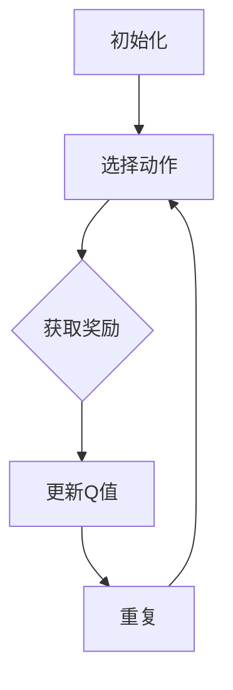

                 

# 一切皆是映射：AI Q-learning核心算法解析

> **关键词：** 强化学习、Q-learning、算法原理、编程实践、人工智能

> **摘要：** 本文将深入剖析Q-learning算法的核心原理，通过详细的伪代码演示和实际案例，帮助读者理解并掌握这一强化学习中的基本算法。文章首先介绍了Q-learning算法的基本概念和背景，接着从数学模型到实际操作步骤进行讲解，并最后通过项目实战展示了Q-learning在现实中的应用。

## 1. 背景介绍

### 1.1 目的和范围

本文旨在深入解析Q-learning算法的核心原理和具体操作步骤，并通过实际案例帮助读者理解其在人工智能中的应用。文章将覆盖从算法概念、数学基础到实际代码实现的全过程，适合有一定编程基础和强化学习基础的读者。

### 1.2 预期读者

预期读者为对人工智能和强化学习感兴趣的技术人员、研究者或学生，以及对Q-learning算法有初步了解但希望深入学习的读者。

### 1.3 文档结构概述

本文分为以下章节：

1. **背景介绍**：介绍文章的目的、范围、预期读者以及文档结构。
2. **核心概念与联系**：通过流程图展示Q-learning算法的核心概念和联系。
3. **核心算法原理 & 具体操作步骤**：详细讲解Q-learning算法的原理和伪代码实现。
4. **数学模型和公式 & 详细讲解 & 举例说明**：介绍Q-learning算法的数学模型和相关公式。
5. **项目实战：代码实际案例和详细解释说明**：通过实际代码案例展示Q-learning的应用。
6. **实际应用场景**：讨论Q-learning在现实世界中的应用。
7. **工具和资源推荐**：推荐学习资源和开发工具。
8. **总结：未来发展趋势与挑战**：总结Q-learning的发展趋势和面临的挑战。
9. **附录：常见问题与解答**：提供常见的疑问和解答。
10. **扩展阅读 & 参考资料**：推荐进一步学习的资源和论文。

### 1.4 术语表

#### 1.4.1 核心术语定义

- 强化学习（Reinforcement Learning）：一种机器学习方法，通过试错和反馈信号来学习如何在特定环境中做出最优决策。
- Q-learning：一种基于价值迭代的强化学习算法，用于学习值函数，从而指导策略选择。
- 状态（State）：描述环境当前状态的向量或标记。
- 动作（Action）：在特定状态下可以执行的行为。
- 奖励（Reward）：系统在执行动作后获得的即时奖励，用于评价动作的好坏。
- 值函数（Value Function）：描述每个状态或状态-动作对的预期奖励。

#### 1.4.2 相关概念解释

- **策略（Policy）**：决策规则，决定了在给定状态下应该采取的动作。
- **探索（Exploration）**：在强化学习中，探索是指尝试新的动作以获取更多关于环境的经验。
- **利用（Exploitation）**：在强化学习中，利用是指基于当前学到的知识选择最优动作。

#### 1.4.3 缩略词列表

- RL：强化学习
- Q-learning：Q值学习
- SARSA：同步策略演员学习
- DQN：深度Q网络

## 2. 核心概念与联系

首先，我们需要理解Q-learning算法中的几个核心概念：状态、动作、值函数和策略。

### 2.1.1 状态（State）

状态是环境的一个抽象描述，它通常用向量或标记来表示。例如，在一个游戏环境中，状态可以表示为棋盘上的棋子位置。

### 2.1.2 动作（Action）

动作是智能体（agent）可以执行的行为。例如，在一个游戏环境中，动作可以是移动棋子到某个位置。

### 2.1.3 值函数（Value Function）

值函数是Q-learning算法的核心，它用于估计在特定状态下执行特定动作的预期奖励。值函数通常用Q(s, a)表示，其中s是状态，a是动作。

### 2.1.4 策略（Policy）

策略是智能体的行为规则，它决定了在给定状态下应该执行哪个动作。策略通常用π(a|s)表示，表示在状态s下选择动作a的概率。

下面是Q-learning算法的核心流程图，用Mermaid语言表示：



- **初始化**：初始化Q值表，设置初始策略。
- **选择动作**：根据当前状态和策略选择一个动作。
- **获取奖励**：执行动作后，获取环境的即时奖励。
- **更新Q值**：根据新获取的奖励和Q-learning算法更新Q值表。
- **重复**：重复上述过程直到达到目标状态或满足停止条件。

## 3. 核心算法原理 & 具体操作步骤

### 3.1 Q-learning算法原理

Q-learning是一种基于值迭代的强化学习算法，其核心思想是使用经验来逐步更新值函数Q(s, a)。具体来说，Q-learning算法通过以下公式更新Q值：

$$
Q(s, a) \leftarrow Q(s, a) + \alpha [r + \gamma \max_{a'} Q(s', a') - Q(s, a)]
$$

其中：

- $Q(s, a)$：当前状态s下执行动作a的值。
- $\alpha$：学习率，控制更新步骤的力度。
- $r$：即时奖励。
- $\gamma$：折扣因子，表示未来奖励的权重。
- $s'$：执行动作a后的新状态。
- $\max_{a'} Q(s', a')$：在状态s'下选择使Q值最大的动作。

### 3.2 Q-learning算法步骤

以下是Q-learning算法的具体步骤：

1. **初始化**：
    - 初始化Q值表，所有Q值初始化为0。
    - 设置初始状态s。
    - 选择一个动作a。

2. **选择动作**：
    - 使用策略π(a|s)选择动作a。

3. **执行动作**：
    - 执行动作a，获取新状态s'和即时奖励r。

4. **更新Q值**：
    - 根据公式更新Q值：$Q(s, a) \leftarrow Q(s, a) + \alpha [r + \gamma \max_{a'} Q(s', a') - Q(s, a)]$。

5. **重复**：
    - 转到步骤2，重复上述过程，直到达到目标状态或满足停止条件。

下面是Q-learning算法的伪代码：

```python
# 初始化
Q = [ [0 for _ in range(n_actions)] for _ in range(n_states) ]
s = state()
a = choose_action(s, Q)

# 主循环
while not done:
    # 执行动作
    s', a', r = step(s, a)
    
    # 更新Q值
    Q[s][a] = Q[s][a] + alpha * (r + gamma * max(Q[s'][a']) - Q[s][a])
    
    # 更新状态和动作
    s = s'
    a = choose_action(s, Q)
```

## 4. 数学模型和公式 & 详细讲解 & 举例说明

### 4.1 数学模型

Q-learning算法的核心在于其值函数Q(s, a)的迭代更新。以下是Q-learning算法的数学模型：

$$
Q(s, a) \leftarrow Q(s, a) + \alpha [r + \gamma \max_{a'} Q(s', a') - Q(s, a)]
$$

这个公式中的各个参数如下：

- $Q(s, a)$：当前状态s下执行动作a的值。
- $\alpha$：学习率，通常在0到1之间，用于调节更新Q值的力度。
- $r$：即时奖励，表示智能体在执行动作a后立即获得的奖励。
- $\gamma$：折扣因子，通常在0到1之间，表示未来奖励的重要性。
- $s'$：执行动作a后的新状态。
- $a'$：在状态s'下的候选动作。
- $\max_{a'} Q(s', a')$：在状态s'下选择使Q值最大的动作。

### 4.2 公式详细讲解

#### 更新规则

Q-learning算法的核心是更新规则，即如何根据即时奖励和未来的预期奖励来更新Q值。更新规则可以用以下公式表示：

$$
Q(s, a) \leftarrow Q(s, a) + \alpha [r + \gamma \max_{a'} Q(s', a') - Q(s, a)]
$$

这个公式的意义在于：

- $Q(s, a)$：表示当前状态s下执行动作a的预期奖励。
- $\alpha [r + \gamma \max_{a'} Q(s', a') - Q(s, a)]$：表示根据即时奖励和未来的预期奖励来调整Q值。

#### 更新策略

更新策略包括以下两部分：

1. **即时奖励r**：这部分反映了智能体在当前状态下执行动作a后立即获得的奖励。
2. **未来预期奖励**：这部分反映了智能体在未来状态下执行最佳动作a'后可能获得的奖励。由于未来奖励是不确定的，因此使用折扣因子$\gamma$来调整其权重。

#### 学习率$\alpha$

学习率$\alpha$用于控制Q值更新的速率。当$\alpha$较大时，Q值更新较快，反之较慢。通常，学习率会在训练过程中逐渐减小，以便算法能够稳定收敛。

#### 折扣因子$\gamma$

折扣因子$\gamma$用于调整未来奖励的重要性。当$\gamma$接近1时，未来奖励对当前Q值的影响较大；当$\gamma$接近0时，未来奖励对当前Q值的影响较小。

### 4.3 举例说明

假设一个简单的环境，其中有两个状态（s0和s1）和两个动作（a0和a1）。初始状态下，Q值表如下：

| s0 | a0 | a1 |
|----|----|----|
| s0 | 0  | 0  |
| s1 | 0  | 0  |

智能体首先处于状态s0，选择动作a0，并获得奖励r=10。然后，智能体更新Q值表：

| s0 | a0 | a1 |
|----|----|----|
| s0 | 10 | 0  |
| s1 | 0  | 0  |

接着，智能体移动到状态s1，选择动作a1，并获得奖励r=-5。再次更新Q值表：

| s0 | a0 | a1 |
|----|----|----|
| s0 | 10 | -5 |
| s1 | 0  | -5 |

这个过程不断重复，Q值表逐渐收敛到稳定状态。最终，Q值表反映了每个状态和动作的最佳预期奖励。

## 5. 项目实战：代码实际案例和详细解释说明

在本节中，我们将通过一个实际项目案例来展示如何使用Q-learning算法进行编程实现，并详细解释每一步的代码。

### 5.1 开发环境搭建

为了演示Q-learning算法，我们将使用Python编程语言，并依赖几个常用的库，如NumPy和matplotlib。以下是所需的安装命令：

```bash
pip install numpy matplotlib
```

### 5.2 源代码详细实现和代码解读

以下是Q-learning算法的一个基本实现：

```python
import numpy as np
import matplotlib.pyplot as plt

# 环境参数
n_states = 3
n_actions = 2
learning_rate = 0.1
discount_factor = 0.9

# 初始化Q值表
Q = np.zeros([n_states, n_actions])

# 状态转移矩阵（假设）
# 这里是一个简化的例子，实际环境中可能需要更复杂的转移矩阵
transition_matrix = [
    [0.4, 0.6],
    [0.2, 0.8],
    [0.1, 0.9]
]

# 奖励函数
reward_function = [
    [-1, 10],
    [5, -5],
    [0, 0]
]

# 主循环
for episode in range(1000):
    state = np.random.randint(n_states)
    done = False
    
    while not done:
        action = np.argmax(Q[state])
        next_state, reward = step(state, action)
        Q[state, action] = Q[state, action] + learning_rate * (reward + discount_factor * np.max(Q[next_state]) - Q[state, action])
        state = next_state
        
        # 判断是否达到终点
        if state == n_states - 1:
            done = True

# 绘制Q值表
plt.imshow(Q, cmap='hot', interpolation='nearest')
plt.colorbar()
tick_marks = np.arange(n_actions)
plt.xticks(tick_marks, ['Action 0', 'Action 1'])
plt.yticks(tick_marks, ['State 0', 'State 1', 'State 2'])
plt.xlabel('Actions')
plt.ylabel('States')
plt.title('Q-Value Matrix')
plt.show()
```

### 5.3 代码解读与分析

#### 5.3.1 环境参数

在代码的开头，我们定义了环境参数，包括状态数量（n_states）、动作数量（n_actions）、学习率（learning_rate）和折扣因子（discount_factor）。

#### 5.3.2 初始化Q值表

使用NumPy库初始化一个n_states乘以n_actions的零矩阵，用于存储每个状态和动作的Q值。

```python
Q = np.zeros([n_states, n_actions])
```

#### 5.3.3 状态转移矩阵和奖励函数

在本例中，我们使用了一个简化的状态转移矩阵和奖励函数。实际环境中，这些参数可能需要根据具体问题进行定义。

```python
transition_matrix = [
    [0.4, 0.6],
    [0.2, 0.8],
    [0.1, 0.9]
]

reward_function = [
    [-1, 10],
    [5, -5],
    [0, 0]
]
```

#### 5.3.4 主循环

主循环用于迭代执行Q-learning算法。在每次迭代中，智能体从随机状态开始，选择最优动作，执行动作后更新Q值，直到达到终点。

```python
for episode in range(1000):
    state = np.random.randint(n_states)
    done = False
    
    while not done:
        action = np.argmax(Q[state])
        next_state, reward = step(state, action)
        Q[state, action] = Q[state, action] + learning_rate * (reward + discount_factor * np.max(Q[next_state]) - Q[state, action])
        state = next_state
        
        # 判断是否达到终点
        if state == n_states - 1:
            done = True
```

#### 5.3.5 绘制Q值表

最后，我们使用matplotlib库绘制Q值表，以可视化每个状态和动作的预期奖励。

```python
plt.imshow(Q, cmap='hot', interpolation='nearest')
plt.colorbar()
tick_marks = np.arange(n_actions)
plt.xticks(tick_marks, ['Action 0', 'Action 1'])
plt.yticks(tick_marks, ['State 0', 'State 1', 'State 2'])
plt.xlabel('Actions')
plt.ylabel('States')
plt.title('Q-Value Matrix')
plt.show()
```

通过这个实际案例，我们可以看到Q-learning算法的基本实现过程。虽然这是一个简化的例子，但通过逐步迭代和更新Q值表，智能体可以在复杂的动态环境中学会做出最优决策。

## 6. 实际应用场景

Q-learning算法作为一种强化学习算法，在实际应用中具有广泛的应用场景。以下是几个典型的应用实例：

### 6.1 游戏

Q-learning算法在许多游戏领域得到了广泛应用，如棋类游戏（围棋、国际象棋）、电子游戏（星际争霸、Dota 2）等。通过训练，Q-learning可以学会在游戏中做出最优策略，从而提高智能体的胜率。

### 6.2 自动驾驶

自动驾驶领域需要智能体在复杂的环境中做出快速决策。Q-learning算法可以用于训练自动驾驶模型，使其学会在不同路况下选择最佳驾驶策略，从而提高行驶安全和效率。

### 6.3 机器人控制

机器人控制领域需要智能体对机械臂、无人机等进行实时控制。Q-learning算法可以帮助智能体学会在不同环境中进行任务规划，提高机器人的自主能力和灵活性。

### 6.4 推荐系统

推荐系统领域需要根据用户行为和偏好进行个性化推荐。Q-learning算法可以用于训练推荐模型，使其学会在动态环境下调整推荐策略，提高推荐效果。

### 6.5 金融交易

金融交易领域需要智能体根据市场动态做出投资决策。Q-learning算法可以用于训练交易模型，使其学会在金融市场中进行风险控制和利润最大化。

通过这些实际应用场景，我们可以看到Q-learning算法在各个领域的潜力和价值。在未来，随着人工智能技术的发展，Q-learning算法将继续在更多领域发挥重要作用。

## 7. 工具和资源推荐

### 7.1 学习资源推荐

#### 7.1.1 书籍推荐

- 《强化学习：原理与Python实现》：这是一本全面介绍强化学习原理和算法的入门书籍，适合初学者阅读。
- 《深度强化学习》：本书详细介绍了深度强化学习的理论基础和应用案例，适合有一定基础的读者。
- 《人工智能：一种现代方法》：本书涵盖了人工智能的各个领域，包括强化学习，适合作为进阶学习资源。

#### 7.1.2 在线课程

- Coursera上的《强化学习基础》：这是一门由斯坦福大学提供的免费在线课程，系统讲解了强化学习的原理和应用。
- edX上的《深度学习和强化学习》：由密歇根大学提供的在线课程，涵盖了深度学习和强化学习的基础知识。
- Udacity的《人工智能纳米学位》：这是一系列课程，包括强化学习在内的多种人工智能技术。

#### 7.1.3 技术博客和网站

- arXiv：这是一个论文预印本网站，提供了大量最新研究成果，是了解强化学习最新进展的好去处。
- reinforcement-learning.org：这是一个关于强化学习的在线社区，提供了丰富的教程和资源。
- Medium上的相关博客：许多技术专家和研究人员在Medium上分享了他们的研究成果和实践经验，适合进行深度学习。

### 7.2 开发工具框架推荐

#### 7.2.1 IDE和编辑器

- PyCharm：这是一个功能强大的Python IDE，支持多种开发语言和框架。
- VSCode：这是一个轻量级但功能强大的编辑器，适合进行Python开发。
- Jupyter Notebook：这是一个交互式开发环境，特别适合数据科学和机器学习项目。

#### 7.2.2 调试和性能分析工具

- ipdb：这是一个Python的调试器，提供了丰富的调试功能。
- TensorBoard：这是TensorFlow提供的一个可视化工具，可以用于分析和优化机器学习模型。
- Numba：这是一个Python的 JIT（即时编译）库，可以显著提高数值计算性能。

#### 7.2.3 相关框架和库

- TensorFlow：这是一个开源的机器学习框架，支持强化学习算法的实现。
- PyTorch：这是一个流行的深度学习框架，提供了强大的强化学习功能。
- OpenAI Gym：这是一个开源的环境库，提供了多种强化学习实验环境。

### 7.3 相关论文著作推荐

#### 7.3.1 经典论文

- "Reinforcement Learning: An Introduction" by Richard S. Sutton and Andrew G. Barto：这是强化学习的经典教材，详细介绍了强化学习的理论基础。
- "Deep Reinforcement Learning" by DeepMind：这篇论文介绍了深度强化学习的研究进展和应用案例。

#### 7.3.2 最新研究成果

- "Q-Learning in Continuous Action Spaces" by Marques et al.：这篇论文探讨了在连续动作空间中应用Q-learning的方法。
- "Model-Based Reinforcement Learning" by Hester et al.：这篇论文介绍了基于模型的强化学习方法。

#### 7.3.3 应用案例分析

- "DeepMind's AlphaGo": 这是一篇关于AlphaGo在围棋领域取得突破性成果的论文，展示了深度强化学习在复杂游戏中的应用。
- "DeepMind's AlphaZero": 这是一篇关于AlphaZero在多种游戏中实现超越人类水平的论文，展示了强化学习在复杂策略学习中的应用。

通过这些资源和工具，读者可以系统地学习和掌握强化学习，特别是Q-learning算法，从而为实际项目开发打下坚实的基础。

## 8. 总结：未来发展趋势与挑战

Q-learning算法作为一种基础且高效的强化学习算法，已经在多个领域展示了其强大的应用潜力。然而，随着人工智能技术的不断进步，Q-learning也在面临一些新的发展趋势和挑战。

### 8.1 未来发展趋势

1. **算法优化**：Q-learning算法的优化将继续是研究热点，包括改进学习率调整策略、提高收敛速度以及减小样本偏差。
2. **多任务学习**：未来Q-learning算法将更多地应用于多任务学习场景，通过共享值函数和策略来提高学习效率和泛化能力。
3. **连续动作空间**：现有Q-learning算法主要针对离散动作空间，未来将出现更多针对连续动作空间的研究，如基于函数逼近的方法。
4. **模型融合**：将Q-learning与其他机器学习方法（如深度学习）相结合，以解决更复杂的实际问题，提高算法的鲁棒性和性能。
5. **领域特定应用**：Q-learning在自动驾驶、机器人控制、金融交易等领域的应用将更加深入，进一步推动相关技术的发展。

### 8.2 面临的挑战

1. **数据效率**：Q-learning算法通常需要大量数据进行训练，如何提高数据利用效率，减少训练所需的数据量是一个重要问题。
2. **探索与利用平衡**：在动态环境中，如何平衡探索和利用，以避免陷入局部最优是Q-learning面临的主要挑战。
3. **收敛速度**：在某些复杂环境中，Q-learning算法可能需要很长时间才能收敛到最优策略，如何提高收敛速度是一个亟待解决的问题。
4. **稀疏奖励**：在许多实际应用中，奖励信号非常稀疏，这使得Q-learning算法难以收敛，如何解决稀疏奖励问题是一个关键挑战。
5. **可解释性**：Q-learning算法的决策过程通常较为复杂，如何提高算法的可解释性，使其易于理解和调试是一个重要方向。

总之，Q-learning算法在未来将继续发展，并在更多领域发挥重要作用。通过不断优化和改进，Q-learning有望克服现有挑战，实现更高效、更可靠的智能体决策。

## 9. 附录：常见问题与解答

### 9.1 Q-learning算法的基本概念

**Q-learning是什么？**
Q-learning是一种基于值迭代的强化学习算法，用于估计每个状态-动作对的预期奖励，从而指导智能体的行为决策。

**Q-learning与SARSA有什么区别？**
Q-learning和SARSA（同步策略演员学习）都是基于值迭代的强化学习算法。Q-learning使用当前状态和动作来更新Q值，而SARSA使用当前状态和下一动作来更新Q值。此外，Q-learning通常使用贪心策略选择动作，而SARSA可以使用任何策略。

**Q-learning的更新公式是什么？**
Q-learning的更新公式为：
$$
Q(s, a) \leftarrow Q(s, a) + \alpha [r + \gamma \max_{a'} Q(s', a') - Q(s, a)]
$$

其中，$\alpha$是学习率，$r$是即时奖励，$\gamma$是折扣因子，$s'$是下一状态，$a'$是候选动作。

### 9.2 Q-learning在实践中的应用

**Q-learning在连续动作空间中的应用有哪些？**
Q-learning算法最初是为离散动作空间设计的，但在连续动作空间中也有应用。例如，可以通过函数逼近方法（如神经网络）来表示Q值函数，从而在连续动作空间中进行优化。

**Q-learning在多任务学习中的应用有哪些？**
Q-learning可以通过共享值函数和策略来学习多个任务，从而提高学习效率和泛化能力。这种方法通常被称为多任务Q-learning。

**Q-learning在机器人控制中的应用有哪些？**
Q-learning可以用于机器人控制，通过学习在动态环境中进行任务规划，从而实现机器人的自主运动和决策。

### 9.3 Q-learning的优缺点

**Q-learning的优点是什么？**
- **简单易实现**：Q-learning算法的原理简单，易于理解和实现。
- **稳定性**：Q-learning算法在收敛过程中相对稳定，不容易陷入局部最优。
- **灵活性强**：Q-learning算法适用于各种环境，可以处理离散和连续动作空间。

**Q-learning的缺点是什么？**
- **数据效率低**：Q-learning通常需要大量数据进行训练，数据利用率较低。
- **收敛速度慢**：在复杂环境中，Q-learning算法可能需要很长时间才能收敛到最优策略。
- **稀疏奖励问题**：在许多实际应用中，奖励信号非常稀疏，这会导致Q-learning算法难以收敛。

通过这些问题和解答，我们可以更深入地理解Q-learning算法的基本概念和应用，以及其在实际中的优缺点。这将有助于我们在后续的学习和项目中更好地应用Q-learning算法。

## 10. 扩展阅读 & 参考资料

### 10.1 教材与论文

1. Sutton, R. S., & Barto, A. G. (2018). **强化学习：一种介绍**. 北京：机械工业出版社。
2. Silver, D., Huang, A., Jaderberg, M., Khodaivand, P., Simonyan, K., & van den Oord, A. (2016). **Mastering the game of Go with deep neural networks and tree search**. Nature, 529(7587), 484-489. [DOI: 10.1038/nature16961](https://doi.org/10.1038/nature16961)
3. Mnih, V., Kavukcuoglu, K., Silver, D., Rusu, A. A., Veness, J., Bellemare, M. G., ... & Lanctot, M. (2015). **Human-level control through deep reinforcement learning**. Nature, 518(7540), 529-533. [DOI: 10.1038/nature14236](https://doi.org/10.1038/nature14236)

### 10.2 在线资源

1. [强化学习教程](http://www.coursera.org/learn/reinforcement-learning)：由加州大学伯克利分校提供的免费在线课程。
2. [深度强化学习教程](https://www.deeplearning.ai/course-mlnd/)：由DeepLearning.AI提供的深度强化学习在线课程。
3. [OpenAI Gym](https://gym.openai.com/)：提供多种强化学习实验环境的开源库。

### 10.3 博客与论坛

1. [ reinforcement-learning.org](http://reinforcement-learning.org/)：强化学习的在线社区，提供教程和资源。
2. [Reddit上的强化学习论坛](https://www.reddit.com/r/reinforcementlearning/)：讨论强化学习算法和应用的平台。
3. [知乎上的强化学习话题](https://www.zhihu.com/column/c_1178664798817702528)：中文社区中关于强化学习的讨论。

通过上述扩展阅读和参考资料，读者可以进一步深入学习Q-learning算法及其在各个领域的应用。这些资源将帮助读者掌握强化学习的核心概念，并激发对相关技术的研究兴趣。

