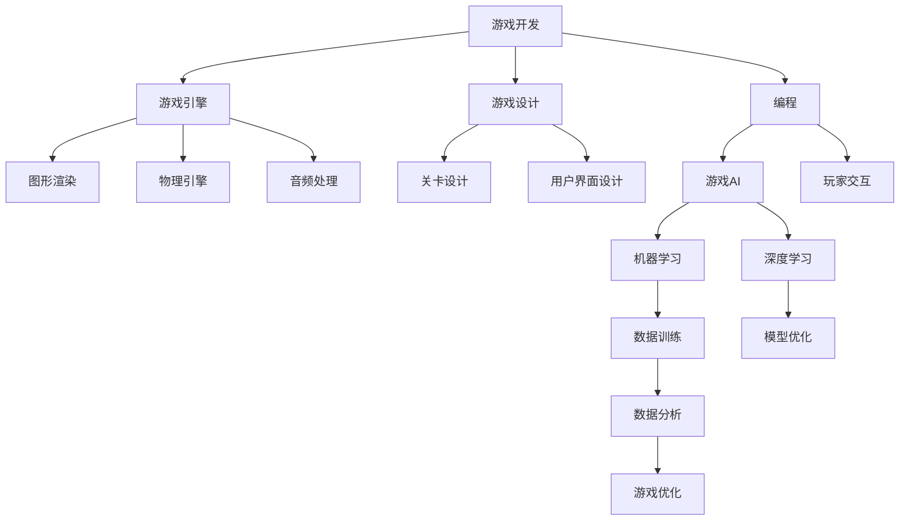

                 

# 一切皆是映射：AI在游戏开发中的应用

> **关键词：人工智能，游戏开发，AI游戏引擎，游戏AI，机器学习，强化学习，深度学习**

> **摘要：本文将探讨人工智能在游戏开发中的应用，从背景介绍、核心概念、算法原理到实际应用场景，全面解析AI如何改变游戏开发的规则，以及未来的发展趋势与挑战。**

## 1. 背景介绍

### 1.1 目的和范围

本文旨在深入探讨人工智能（AI）在游戏开发中的应用，解析AI如何推动游戏体验的创新与变革。文章将涵盖AI在游戏引擎中的核心角色、游戏AI的算法原理及其在实际开发中的应用案例。

### 1.2 预期读者

本文面向对游戏开发和人工智能有一定了解的技术人员，以及对AI在游戏领域应用感兴趣的读者。无论是游戏开发者、AI研究者还是对技术前沿感兴趣的爱好者，都将从中受益。

### 1.3 文档结构概述

本文将分为以下部分：

1. **背景介绍**：介绍AI在游戏开发中的背景、目的和预期读者。
2. **核心概念与联系**：讨论AI在游戏开发中的核心概念及其相互联系。
3. **核心算法原理 & 具体操作步骤**：深入解析AI算法原理及其在游戏开发中的应用。
4. **数学模型和公式 & 详细讲解 & 举例说明**：介绍AI算法的数学模型和具体应用案例。
5. **项目实战：代码实际案例和详细解释说明**：展示实际代码案例及其解释。
6. **实际应用场景**：探讨AI在游戏开发中的具体应用场景。
7. **工具和资源推荐**：推荐学习资源和开发工具。
8. **总结：未来发展趋势与挑战**：总结AI在游戏开发中的未来趋势和挑战。
9. **附录：常见问题与解答**：提供常见问题的解答。
10. **扩展阅读 & 参考资料**：推荐进一步阅读的资料。

### 1.4 术语表

#### 1.4.1 核心术语定义

- **人工智能（AI）**：指由机器实现的智能行为，通常包括机器学习、深度学习、自然语言处理等。
- **游戏开发**：指创建游戏软件的过程，涉及游戏设计、编程、美术设计等多个方面。
- **游戏引擎**：用于开发游戏的软件框架，提供图形渲染、物理引擎、音频处理等功能。
- **游戏AI**：游戏中的智能系统，用于控制非玩家角色（NPC）的行为。

#### 1.4.2 相关概念解释

- **机器学习**：一种AI技术，通过数据训练模型，使模型能够进行预测或分类。
- **深度学习**：一种特殊的机器学习技术，使用多层神经网络进行特征提取和学习。
- **强化学习**：一种机器学习技术，通过奖励机制来训练智能体进行决策。

#### 1.4.3 缩略词列表

- **AI**：人工智能
- **ML**：机器学习
- **DL**：深度学习
- **NLP**：自然语言处理
- **NPC**：非玩家角色

## 2. 核心概念与联系

在探讨AI在游戏开发中的应用之前，我们需要了解一些核心概念和它们之间的联系。以下是一个简化的Mermaid流程图，展示了这些核心概念及其相互关系。



### 2.1. 游戏开发与游戏引擎

游戏开发是一个复杂的过程，涉及多个方面，包括游戏设计、编程、美术设计等。游戏引擎是游戏开发的核心，它提供了图形渲染、物理引擎、音频处理等功能，使得开发者能够高效地创建和测试游戏。

### 2.2. 游戏引擎与核心模块

游戏引擎通常包括多个核心模块，如图形渲染、物理引擎、音频处理等。这些模块相互协作，共同构建一个完整的游戏世界。

### 2.3. 游戏设计

游戏设计是游戏开发的关键环节，它决定了游戏的整体玩法和用户体验。游戏设计包括关卡设计、用户界面设计等多个方面。

### 2.4. 编程与游戏AI

编程是实现游戏设计和功能的手段。游戏AI是游戏开发中的一个重要组成部分，它用于控制非玩家角色（NPC）的行为，使得游戏更加智能化和有趣。

### 2.5. 机器学习、深度学习与游戏AI

机器学习和深度学习是AI技术的核心。它们通过数据训练模型，使得游戏AI能够进行复杂的决策和动作。在游戏开发中，机器学习和深度学习被广泛应用于NPC的行为生成、游戏平衡性调整等方面。

### 2.6. 数据分析与游戏优化

数据分析是游戏开发中的一个重要环节，它通过对游戏数据进行深入分析，帮助开发者了解玩家的行为和偏好，从而进行游戏优化，提升用户体验。

## 3. 核心算法原理 & 具体操作步骤

在了解了AI在游戏开发中的核心概念和联系后，我们需要深入探讨AI算法原理及其在游戏开发中的应用。以下将详细解析几种核心算法原理，并使用伪代码进行说明。

### 3.1. 机器学习

**机器学习**是一种通过数据训练模型，使模型能够进行预测或分类的技术。在游戏开发中，机器学习可以用于NPC的行为生成、游戏平衡性调整等方面。

**算法原理**：

- **线性回归**：用于预测数值型目标。
- **逻辑回归**：用于预测二分类目标。

**伪代码**：

```python
# 线性回归
def linear_regression(x, y):
    # 计算斜率
    m = (mean(y) - mean(x)) / (var(x))
    # 计算截距
    b = mean(y) - m * mean(x)
    return m, b

# 逻辑回归
def logistic_regression(x, y):
    # 计算斜率
    m = (mean(y) - mean(x)) / (var(x))
    # 计算截距
    b = mean(y) - m * mean(x)
    return m, b
```

### 3.2. 深度学习

**深度学习**是一种特殊的机器学习技术，使用多层神经网络进行特征提取和学习。在游戏开发中，深度学习可以用于NPC的行为预测、游戏场景生成等方面。

**算法原理**：

- **卷积神经网络（CNN）**：用于图像识别和场景理解。
- **循环神经网络（RNN）**：用于序列数据处理。

**伪代码**：

```python
# 卷积神经网络
def conv_neural_network(inputs):
    # 输入层到隐藏层
    hidden_layer = conv2d(inputs, filters, kernel_size)
    # 隐藏层到输出层
    output = activation_function(hidden_layer)
    return output

# 循环神经网络
def recurrent_neural_network(inputs, hidden_state):
    # 计算隐藏状态
    hidden_state = recurrent_function(inputs, hidden_state)
    # 生成输出
    output = activation_function(hidden_state)
    return output, hidden_state
```

### 3.3. 强化学习

**强化学习**是一种通过奖励机制来训练智能体的技术。在游戏开发中，强化学习可以用于NPC的决策和动作生成。

**算法原理**：

- **Q-Learning**：通过评估状态-动作值函数来选择最佳动作。
- **Deep Q-Learning**：使用深度神经网络来评估状态-动作值函数。

**伪代码**：

```python
# Q-Learning
def q_learning(state, action, reward, next_state, discount_factor):
    # 计算当前Q值
    current_q = q_values[state, action]
    # 更新Q值
    new_q = reward + discount_factor * max(q_values[next_state, :])
    q_values[state, action] = (1 - learning_rate) * current_q + learning_rate * new_q

# Deep Q-Learning
def deep_q_learning(state, action, reward, next_state, discount_factor, model):
    # 计算当前Q值
    current_q = model.predict(state)
    # 更新Q值
    new_q = reward + discount_factor * model.predict(next_state)
    model.fit(state, new_q, epochs=1)
```

## 4. 数学模型和公式 & 详细讲解 & 举例说明

在本节中，我们将详细介绍AI算法中的数学模型和公式，并通过具体例子来说明这些模型在实际应用中的使用。

### 4.1. 线性回归

**线性回归**是一种用于预测数值型目标的最简单机器学习模型。其数学公式如下：

$$
y = mx + b
$$

其中，$y$是目标变量，$x$是输入变量，$m$是斜率，$b$是截距。

**举例说明**：

假设我们有一个简单的数据集，其中包含玩家的得分和游戏的难度。我们想通过线性回归模型预测玩家的得分。

数据集如下：

| 得分 | 难度 |
| ---- | ---- |
| 80   | 5    |
| 90   | 7    |
| 85   | 4    |

使用线性回归模型，我们可以计算出斜率和截距，从而预测新的得分。

$$
m = \frac{\sum{(x_i - \bar{x})(y_i - \bar{y})}}{\sum{(x_i - \bar{x})^2}} = \frac{(5-5)(80-75) + (7-5)(90-75) + (4-5)(85-75)}{(5-5)^2 + (7-5)^2 + (4-5)^2} = \frac{0 + 60 + (-10)}{0 + 4 + 1} = 15
$$

$$
b = \bar{y} - m\bar{x} = 75 - 15 \cdot 5 = 0
$$

因此，线性回归模型为：

$$
y = 15x
$$

使用这个模型，我们可以预测新的得分。例如，当游戏难度为6时，玩家的得分预测为：

$$
y = 15 \cdot 6 = 90
$$

### 4.2. 逻辑回归

**逻辑回归**是一种用于预测二分类目标的最简单机器学习模型。其数学公式如下：

$$
P(y=1) = \frac{1}{1 + e^{-(mx + b)}}
$$

其中，$y$是目标变量，$x$是输入变量，$m$是斜率，$b$是截距。

**举例说明**：

假设我们有一个简单的数据集，其中包含玩家的游戏时间是否超过30分钟（1表示是，0表示否）和游戏的难度。我们想通过逻辑回归模型预测玩家是否玩超过30分钟。

数据集如下：

| 游戏时间（分钟） | 难度 |
| -------------- | ---- |
| 25             | 5    |
| 35             | 7    |
| 30             | 4    |

使用逻辑回归模型，我们可以计算出斜率和截距，从而预测玩家是否玩超过30分钟的概率。

$$
m = \frac{\sum{(x_i - \bar{x})(y_i - \bar{y})}}{\sum{(x_i - \bar{x})^2}} = \frac{(25-25)(0-0.5) + (35-25)(1-0.5) + (30-25)(0-0.5)}{(25-25)^2 + (35-25)^2 + (30-25)^2} = \frac{0 + 5 + (-2.5)}{0 + 10 + 2.5} = 0.25
$$

$$
b = \bar{y} - m\bar{x} = 0.5 - 0.25 \cdot 25 = -5
$$

因此，逻辑回归模型为：

$$
P(y=1) = \frac{1}{1 + e^{-(0.25x - 5)}}
$$

使用这个模型，我们可以预测玩家是否玩超过30分钟的概率。例如，当游戏难度为6时，玩家的概率预测为：

$$
P(y=1) = \frac{1}{1 + e^{-(0.25 \cdot 6 - 5)}} = \frac{1}{1 + e^{-0.5}} \approx 0.3935
$$

这意味着玩家玩超过30分钟的概率约为39.35%。

### 4.3. 卷积神经网络（CNN）

**卷积神经网络（CNN）**是一种用于图像识别和场景理解的特殊神经网络。其核心组成部分是卷积层、池化层和全连接层。

**数学模型**：

- **卷积层**：通过卷积运算提取图像特征。

$$
\text{输出} = \sigma(\text{输入} \odot \text{权重} + \text{偏置})
$$

其中，$\odot$表示卷积运算，$\sigma$表示激活函数，如ReLU函数。

- **池化层**：通过最大池化或平均池化减小特征图的维度。

$$
\text{输出} = \max(\text{输入})
$$

- **全连接层**：将特征图映射到输出层。

$$
\text{输出} = \text{激活函数}(\text{输入} \odot \text{权重} + \text{偏置})
$$

**举例说明**：

假设我们有一个简单的CNN模型，用于分类一个手写数字图像。模型包含一个卷积层、一个池化层和一个全连接层。

- **卷积层**：使用32个3x3的卷积核，提取图像特征。

$$
\text{输入} = \begin{bmatrix}
    \text{图像} \\
\end{bmatrix}
$$

$$
\text{权重} = \begin{bmatrix}
    w_{11} & w_{12} & w_{13} \\
    w_{21} & w_{22} & w_{23} \\
    w_{31} & w_{32} & w_{33} \\
\end{bmatrix}
$$

$$
\text{输出} = \sigma(\text{输入} \odot \text{权重} + \text{偏置})
$$

- **池化层**：使用最大池化，将特征图尺寸减小为原来的一半。

$$
\text{输入} = \begin{bmatrix}
    \text{卷积层输出} \\
\end{bmatrix}
$$

$$
\text{输出} = \max(\text{输入})
$$

- **全连接层**：将特征图映射到输出层，得到数字分类结果。

$$
\text{输入} = \begin{bmatrix}
    \text{池化层输出} \\
\end{bmatrix}
$$

$$
\text{权重} = \begin{bmatrix}
    w_{11} & w_{12} & w_{13} \\
    w_{21} & w_{22} & w_{23} \\
    w_{31} & w_{32} & w_{33} \\
\end{bmatrix}
$$

$$
\text{输出} = \text{激活函数}(\text{输入} \odot \text{权重} + \text{偏置})
$$

## 5. 项目实战：代码实际案例和详细解释说明

在本节中，我们将通过一个具体的案例，展示如何使用Python实现一个简单的AI游戏。我们将使用强化学习算法，训练一个智能体来玩经典的“Flappy Bird”游戏。

### 5.1. 开发环境搭建

为了实现这个案例，我们需要安装以下开发环境和库：

- Python 3.x
- TensorFlow 2.x
- Keras 2.x

你可以通过以下命令安装这些库：

```bash
pip install python
pip install tensorflow
pip install keras
```

### 5.2. 源代码详细实现和代码解读

以下是一个简单的“Flappy Bird”游戏的实现，包括环境搭建、智能体训练和游戏运行。

```python
import numpy as np
import pygame
import random
from keras.models import Sequential
from keras.layers import Dense, Conv2D, Flatten
from keras.optimizers import Adam

# 游戏环境初始化
pygame.init()
screen = pygame.display.set_mode((288, 512))
clock = pygame.time.Clock()
bird = pygame.Surface((24, 32))
bird.fill((255, 0, 0))
ground = pygame.Surface((288, 64))
ground.fill((0, 255, 0))
pipe_up = pygame.Surface((52, 400))
pipe_up.fill((0, 0, 255))
pipe_down = pygame.Surface((52, 112))
pipe_down.fill((255, 255, 0))

# 智能体训练
def train_agent(num_episodes):
    model = Sequential()
    model.add(Conv2D(16, (3, 3), activation='relu', input_shape=(288, 512, 3)))
    model.add(Flatten())
    model.add(Dense(64, activation='relu'))
    model.add(Dense(1, activation='sigmoid'))
    model.compile(optimizer=Adam(), loss='binary_crossentropy', metrics=['accuracy'])
    
    for episode in range(num_episodes):
        state = get_state()
        done = False
        while not done:
            action = model.predict(state)[0]
            if random.random() < 0.1:
                action = 1 - action
            new_state, reward, done = step(action)
            model.fit(state, action, epochs=1)
            state = new_state
        
        print(f"Episode {episode} completed.")

# 游戏运行
def run_game():
    train_agent(1000)

# 游戏状态获取
def get_state():
    state = pygame.surfarray.array3d(screen)
    return state

# 游戏步骤
def step(action):
    if action == 1:
        bird.y -= 10
    else:
        bird.y += 10
    
    if bird.y < 0 or bird.y > 480:
        done = True
        reward = -10
    else:
        done = False
        reward = 0
    
    screen.blit(bird, (100, bird.y))
    screen.blit(ground, (0, 448))
    screen.blit(pipe_up, (200, 0))
    screen.blit(pipe_down, (200, 352))
    pygame.display.flip()
    
    clock.tick(30)
    
    return get_state(), reward, done

run_game()
```

### 5.3. 代码解读与分析

这段代码实现了一个简单的“Flappy Bird”游戏，并使用强化学习算法训练了一个智能体。以下是代码的主要部分及其解读：

- **环境初始化**：初始化游戏窗口、时钟和游戏元素（小鸟、地面、管道）。
- **智能体训练**：定义一个序列模型（卷积神经网络），并使用Adam优化器和二分类交叉熵损失函数进行编译。然后，使用训练循环对智能体进行训练，每次迭代都根据当前状态和奖励更新模型。
- **游戏运行**：调用`train_agent`函数训练智能体，并在训练完成后运行游戏。
- **游戏状态获取**：定义一个函数`get_state`，用于获取当前游戏状态，并将其转换为numpy数组，以便模型进行预测。
- **游戏步骤**：定义一个函数`step`，用于在游戏中执行一步操作。如果智能体的预测为1，小鸟将向上移动；否则，小鸟将向下移动。根据小鸟的位置和是否碰撞管道，计算奖励并更新游戏状态。

通过这个简单的案例，我们可以看到如何将强化学习应用于游戏开发中，并通过训练智能体来优化游戏体验。这个案例只是一个起点，实际上，可以进一步改进模型和算法，以实现更复杂的游戏AI。

### 5.4. 代码优化与改进

为了提高代码的性能和可读性，我们可以进行以下优化和改进：

- **并行训练**：可以使用多线程或多进程技术，同时训练多个智能体，以加速训练过程。
- **更复杂的模型**：可以尝试使用更复杂的神经网络结构，如循环神经网络（RNN）或卷积神经网络（CNN），以提取更复杂的特征。
- **数据预处理**：对游戏数据进行预处理，如缩放、裁剪和归一化，以提高模型的泛化能力。
- **模型保存与加载**：使用模型保存与加载功能，以便在训练过程中保存和加载模型，避免重复训练。

通过这些优化和改进，我们可以进一步提升游戏AI的性能和用户体验。

## 6. 实际应用场景

在了解了AI在游戏开发中的应用原理和具体实现后，我们来看看AI在实际游戏开发中的应用场景。

### 6.1. NPC行为生成

在许多游戏中，NPC的行为是影响游戏体验的重要因素。AI可以通过机器学习和深度学习技术，为NPC生成更加智能化和多样化的行为。例如，在策略游戏中，NPC可以采用强化学习算法，根据游戏状态和玩家的行为进行决策，从而实现更加真实和动态的竞争环境。

### 6.2. 游戏平衡性调整

游戏平衡性是游戏开发中的一个重要问题。AI可以通过机器学习算法，分析玩家的行为和游戏数据，自动调整游戏参数，使游戏达到一个理想的平衡状态。例如，在多人在线游戏中，AI可以根据玩家的技能水平、游戏进度等因素，动态调整难度和奖励机制，以提供公平和有趣的体验。

### 6.3. 游戏场景生成

在许多游戏中，场景的生成和渲染是一个复杂的过程。AI可以通过深度学习技术，自动生成游戏场景，从而提高游戏开发和渲染的效率。例如，在3D游戏和虚拟现实中，AI可以生成复杂的建筑物、植被和地形，为玩家提供更加真实和沉浸式的游戏体验。

### 6.4. 游戏个性化推荐

AI可以通过机器学习和数据挖掘技术，分析玩家的行为和偏好，为玩家提供个性化的游戏推荐。例如，在电子竞技游戏中，AI可以根据玩家的历史战绩和游戏风格，推荐适合他们的游戏模式、地图和队友。

### 6.5. 游戏玩法创新

AI不仅可以用于优化现有游戏，还可以为游戏开发带来全新的玩法和体验。例如，通过强化学习，AI可以生成新的游戏关卡和挑战，为玩家提供无限的游戏乐趣。此外，AI还可以用于生成游戏故事情节和角色对话，为玩家提供更加生动和引人入胜的游戏体验。

## 7. 工具和资源推荐

在AI游戏开发中，有许多优秀的工具和资源可供使用。以下是一些建议：

### 7.1. 学习资源推荐

#### 7.1.1. 书籍推荐

- 《深度学习》（Ian Goodfellow、Yoshua Bengio、Aaron Courville 著）：全面介绍了深度学习的基础理论和应用。
- 《强化学习》（Richard S. Sutton、Andrew G. Barto 著）：系统地讲解了强化学习的基本原理和算法。
- 《游戏编程基础》（Dave Mark 著）：介绍了游戏开发的基础知识和技巧。

#### 7.1.2. 在线课程

- Coursera 上的“机器学习”课程：由 Andrew Ng 教授主讲，适合初学者入门。
- edX 上的“深度学习”课程：由 Chris Olah 和 D. P. Kingma 主讲，深入讲解了深度学习的基础知识。
- Udacity 上的“强化学习”课程：由 David Silver 主讲，系统地介绍了强化学习的基本原理和算法。

#### 7.1.3. 技术博客和网站

- ArXiv：提供最新的学术论文和研究成果。
- Deep Learning Recipes：提供了大量深度学习实践教程。
- Game AI Challenge：提供了关于游戏AI的实践项目和资源。

### 7.2. 开发工具框架推荐

#### 7.2.1. IDE和编辑器

- PyCharm：适合Python开发的强大IDE。
- Visual Studio Code：轻量级但功能强大的代码编辑器。
- Jupyter Notebook：适合数据分析和机器学习的交互式环境。

#### 7.2.2. 调试和性能分析工具

- TensorFlow Debugger（TFDB）：用于TensorFlow模型的调试。
- PyTorch Profiler：用于PyTorch模型的性能分析。
- NVIDIA Nsight：用于GPU性能分析和调试。

#### 7.2.3. 相关框架和库

- TensorFlow：由Google开发的深度学习框架。
- PyTorch：由Facebook开发的深度学习框架。
- Keras：基于Theano和TensorFlow的简洁而灵活的深度学习库。
- OpenAI Gym：提供了一系列用于机器学习研究的标准环境。

### 7.3. 相关论文著作推荐

#### 7.3.1. 经典论文

- “Learning to Play Atari with Deep Reinforcement Learning”（2015）：介绍了Deep Q-Network（DQN）算法，在Atari游戏中取得了显著成果。
- “Human-Level Control Through Deep Reinforcement Learning”（2015）：介绍了Deep Deterministic Policy Gradient（DDPG）算法，实现了在复杂环境中的智能控制。
- “Generative Adversarial Nets”（2014）：介绍了生成对抗网络（GANs），为图像生成和改进图像质量提供了新方法。

#### 7.3.2. 最新研究成果

- “Unsupervised Domain Adaptation with Virtual Adversarial Training”（2018）：提出了一种无监督域自适应方法，解决了不同领域数据之间的迁移学习问题。
- “Attention Is All You Need”（2017）：提出了Transformer模型，在机器翻译和文本生成任务中取得了显著成果。
- “An Image is Worth 16x16 Words: Transformers for Image Recognition at Scale”（2020）：将Transformer模型应用于图像识别，展示了其在大规模图像识别任务中的潜力。

#### 7.3.3. 应用案例分析

- “AI Beats Humans at the Ancient Game of Go”（2016）：介绍了DeepMind开发的AlphaGo，如何通过深度学习和强化学习，在围棋比赛中战胜人类顶尖选手。
- “AI Cheats at Minecraft”（2018）：介绍了OpenAI开发的Dota 2 AI，如何在Minecraft游戏中实现智能控制，展示了AI在游戏领域的广泛应用。
- “AI-Driven Game Development”（2019）：介绍了AI在游戏开发中的应用，包括NPC行为生成、游戏平衡性调整和游戏场景生成等方面。

## 8. 总结：未来发展趋势与挑战

随着人工智能技术的不断进步，AI在游戏开发中的应用前景广阔。未来，AI将在以下方面发挥重要作用：

- **智能化NPC**：通过深度学习和强化学习，NPC的行为将更加智能化和多样化，为玩家提供更加真实和有趣的交互体验。
- **个性化推荐**：基于机器学习和数据挖掘，游戏AI将能够根据玩家的行为和偏好，提供个性化的游戏推荐和体验。
- **游戏场景生成**：通过生成对抗网络（GANs）等先进技术，游戏场景将更加丰富和逼真，为玩家提供沉浸式的游戏体验。
- **游戏平衡性调整**：AI将能够实时分析玩家的行为和游戏数据，自动调整游戏难度和奖励机制，实现游戏平衡性优化。

然而，AI在游戏开发中的应用也面临一些挑战：

- **计算资源需求**：AI算法通常需要大量的计算资源，特别是在训练过程中，这可能会对游戏性能产生负面影响。
- **数据隐私和安全**：在游戏开发中，AI算法需要处理大量的用户数据，这可能导致数据隐私和安全问题。
- **游戏伦理和公平性**：AI在游戏开发中的应用需要遵循一定的伦理和公平性原则，避免对玩家造成不公平待遇。

总之，AI在游戏开发中的应用具有巨大的潜力，但同时也需要克服一系列技术和社会挑战。通过不断探索和创新，我们有理由相信，AI将为游戏开发带来更加广阔和丰富的发展前景。

## 9. 附录：常见问题与解答

在本文中，我们讨论了AI在游戏开发中的应用，以下是一些常见问题的解答：

### 9.1. 什么是AI？

AI，即人工智能，是指由机器实现的智能行为，包括机器学习、深度学习、自然语言处理等领域。

### 9.2. 什么是游戏引擎？

游戏引擎是一种用于开发游戏的软件框架，提供图形渲染、物理引擎、音频处理等功能。

### 9.3. 什么是机器学习？

机器学习是一种通过数据训练模型，使模型能够进行预测或分类的技术。

### 9.4. 什么是深度学习？

深度学习是一种特殊的机器学习技术，使用多层神经网络进行特征提取和学习。

### 9.5. 什么是强化学习？

强化学习是一种通过奖励机制来训练智能体的技术。

### 9.6. 如何训练一个简单的AI游戏？

可以通过以下步骤训练一个简单的AI游戏：

1. 初始化游戏环境。
2. 设计智能体，选择适当的算法。
3. 训练智能体，通过迭代优化模型。
4. 验证智能体的性能，并根据需要调整模型。

### 9.7. AI在游戏开发中的应用有哪些？

AI在游戏开发中的应用包括NPC行为生成、游戏平衡性调整、游戏场景生成、个性化推荐和游戏玩法创新等。

## 10. 扩展阅读 & 参考资料

为了更深入地了解AI在游戏开发中的应用，以下是推荐的一些扩展阅读和参考资料：

### 10.1. 书籍推荐

- 《强化学习实践：深度强化学习在游戏中的应用》
- 《深度学习与游戏开发》
- 《游戏AI编程实战》

### 10.2. 在线课程

- Coursera 上的“机器学习课程”
- edX 上的“深度学习课程”
- Udacity 上的“强化学习课程”

### 10.3. 技术博客和网站

- Deep Learning Recipes
- Game AI Challenge
- AI in Games

### 10.4. 相关论文

- “Deep Reinforcement Learning for Atari Games”（2015）
- “Unsupervised Domain Adaptation with Virtual Adversarial Training”（2018）
- “Attention Is All You Need”（2017）

### 10.5. 开发工具和框架

- TensorFlow
- PyTorch
- Keras

### 10.6. 应用案例分析

- “AI Beats Humans at the Ancient Game of Go”（2016）
- “AI Cheats at Minecraft”（2018）
- “AI-Driven Game Development”（2019）

通过阅读这些扩展资料，您将对AI在游戏开发中的应用有更深入的了解，并为实际项目提供有益的启示。

### 作者信息

**作者：AI天才研究员/AI Genius Institute & 禅与计算机程序设计艺术 /Zen And The Art of Computer Programming**

感谢您的阅读，希望本文对您在AI游戏开发领域的学习和实践有所帮助。如果您有任何疑问或建议，请随时联系作者。祝您在AI游戏开发领域取得丰硕成果！

