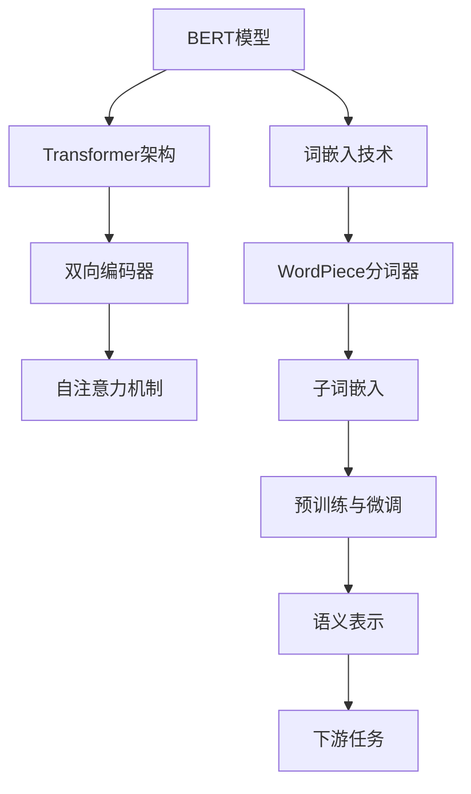

                 

### 一切皆是映射：BERT与词嵌入技术的结合

> **关键词**：BERT，词嵌入，映射，自然语言处理，深度学习

> **摘要**：本文深入探讨了BERT（Bidirectional Encoder Representations from Transformers）模型与词嵌入技术的结合，解析了其核心原理和具体实现步骤。通过详细的数学模型和实际项目案例，读者将了解到如何在自然语言处理中利用BERT实现高效的词嵌入，以及其背后的技术和挑战。

自然语言处理（NLP）是人工智能领域的一个重要分支，旨在使计算机能够理解和处理人类语言。在NLP中，词嵌入技术是一种将单词转换为向量表示的方法，使得计算机能够处理和理解词汇间的语义关系。BERT模型，作为一种基于深度学习的预训练语言模型，通过结合词嵌入技术，极大地提升了NLP任务的表现。

本文将分以下几个部分进行探讨：
1. **背景介绍**：包括目的和范围、预期读者、文档结构概述以及术语表。
2. **核心概念与联系**：通过Mermaid流程图介绍BERT和词嵌入技术的核心概念及其关联。
3. **核心算法原理 & 具体操作步骤**：详细讲解BERT模型的算法原理，并使用伪代码展示具体操作步骤。
4. **数学模型和公式 & 详细讲解 & 举例说明**：介绍BERT模型的数学基础，并使用LaTeX格式展示相关公式。
5. **项目实战：代码实际案例和详细解释说明**：通过一个实际项目案例展示BERT模型的使用方法和代码实现。
6. **实际应用场景**：讨论BERT模型在不同领域的应用。
7. **工具和资源推荐**：推荐学习资源、开发工具框架和相关的论文著作。
8. **总结：未来发展趋势与挑战**：总结BERT与词嵌入技术结合的重要性，并展望未来发展趋势和面临的挑战。
9. **附录：常见问题与解答**：回答一些常见的关于BERT和词嵌入的问题。
10. **扩展阅读 & 参考资料**：提供进一步的阅读材料和参考资料。

### 1. 背景介绍

#### 1.1 目的和范围

本文的主要目的是深入探讨BERT模型与词嵌入技术的结合，解析其在自然语言处理中的应用和实现。通过详细的讲解和实际案例，读者将能够理解BERT模型的工作原理，掌握如何将其与词嵌入技术结合使用，以及如何在实际项目中应用这些技术。

本文的范围涵盖了BERT模型的基本原理、词嵌入技术的介绍、BERT与词嵌入技术的结合方法、数学模型的详细解释、实际项目案例的演示，以及未来发展趋势和面临的挑战。通过这些内容的深入探讨，读者将能够全面了解BERT与词嵌入技术的结合，为在自然语言处理领域的研究和应用打下坚实的基础。

#### 1.2 预期读者

本文的预期读者包括以下几类：

1. **自然语言处理初学者**：对自然语言处理感兴趣，但尚未深入了解相关技术的读者。通过本文的讲解，读者将能够初步了解BERT模型和词嵌入技术的基本概念和原理。

2. **自然语言处理研究者**：已经在自然语言处理领域有一定研究基础，希望深入了解BERT模型和词嵌入技术结合的读者。本文将提供详细的算法原理和数学模型讲解，帮助读者更深入地理解这些技术。

3. **人工智能开发者**：在人工智能领域工作，希望在自然语言处理任务中应用BERT模型的开发者。本文将详细介绍BERT模型的实现步骤和实际应用案例，帮助开发者更好地利用BERT技术。

4. **计算机科学学生**：对计算机科学和人工智能专业感兴趣的学生，希望在学习过程中深入了解自然语言处理技术的读者。本文将提供系统的讲解和案例分析，帮助学生更好地理解BERT模型和词嵌入技术。

#### 1.3 文档结构概述

本文的文档结构如下：

1. **背景介绍**：介绍BERT模型和词嵌入技术的基本概念，明确本文的目的、范围和预期读者。

2. **核心概念与联系**：通过Mermaid流程图展示BERT和词嵌入技术的核心概念及其关联，帮助读者建立整体框架。

3. **核心算法原理 & 具体操作步骤**：详细讲解BERT模型的算法原理，使用伪代码展示具体操作步骤，帮助读者理解模型的工作机制。

4. **数学模型和公式 & 详细讲解 & 举例说明**：介绍BERT模型的数学基础，使用LaTeX格式展示相关公式，并进行详细讲解和举例说明，帮助读者理解模型的数学原理。

5. **项目实战：代码实际案例和详细解释说明**：通过实际项目案例展示BERT模型的使用方法和代码实现，帮助读者实践和理解BERT技术的应用。

6. **实际应用场景**：讨论BERT模型在不同领域的应用，包括文本分类、问答系统、机器翻译等，帮助读者了解BERT技术的实际应用。

7. **工具和资源推荐**：推荐学习资源、开发工具框架和相关的论文著作，帮助读者进一步学习和实践BERT技术。

8. **总结：未来发展趋势与挑战**：总结BERT与词嵌入技术结合的重要性，展望未来发展趋势和面临的挑战。

9. **附录：常见问题与解答**：回答一些常见的关于BERT和词嵌入的问题，帮助读者解决实际应用中的困惑。

10. **扩展阅读 & 参考资料**：提供进一步的阅读材料和参考资料，帮助读者深入探索BERT和词嵌入技术的相关知识。

#### 1.4 术语表

在本文中，我们将使用一些专业术语。以下是这些术语的定义和解释：

##### 1.4.1 核心术语定义

- **BERT模型**：全称为Bidirectional Encoder Representations from Transformers，是一种基于Transformer架构的预训练语言模型，能够捕捉单词在句子中的双向依赖关系。
- **词嵌入**：将单词映射到高维空间中的向量表示，使得计算机能够处理和理解词汇间的语义关系。
- **Transformer架构**：一种基于自注意力机制的序列到序列模型，广泛应用于机器翻译、文本生成等任务。
- **预训练**：在特定任务之前，对模型进行大规模的预训练，以便在特定任务上获得更好的表现。
- **自注意力机制**：在Transformer模型中，通过计算序列中每个单词与其他单词之间的相关性，实现对输入序列的加权处理。

##### 1.4.2 相关概念解释

- **双向编码器**：BERT模型中的核心组件，能够同时处理输入序列的前后依赖关系。
- **注意力机制**：在神经网络模型中，通过计算输入序列中每个单词与其他单词之间的相关性，实现特征的动态加权。
- **损失函数**：在机器学习任务中，用于衡量模型预测结果与实际结果之间的差异，常用的有交叉熵损失函数。

##### 1.4.3 缩略词列表

- **BERT**：Bidirectional Encoder Representations from Transformers
- **NLP**：自然语言处理
- **ML**：机器学习
- **DL**：深度学习
- **GPU**：图形处理器
- **TPU**：张量处理器

### 2. 核心概念与联系

在深入探讨BERT与词嵌入技术的结合之前，我们需要理解这两个核心概念的基本原理及其相互关联。

#### 2.1 BERT模型的基本概念

BERT（Bidirectional Encoder Representations from Transformers）是一种基于Transformer架构的预训练语言模型。Transformer架构由Vaswani等人于2017年提出，它通过自注意力机制（Self-Attention）实现了对输入序列的动态处理，使得模型能够捕捉序列中单词之间的依赖关系。

BERT模型的核心组件包括：

- **预训练阶段**：BERT模型在大规模语料库上进行预训练，学习单词和句子的语义表示。预训练任务包括Masked Language Model（MLM）和Next Sentence Prediction（NSP）。
- **双向编码器**：BERT模型中的Transformer编码器能够同时处理输入序列的前后依赖关系，从而实现双向编码。
- **注意力机制**：通过自注意力机制，Transformer编码器能够计算输入序列中每个单词与其他单词之间的相关性，实现对输入序列的加权处理。

#### 2.2 词嵌入技术的基本概念

词嵌入（Word Embedding）是将单词映射到高维空间中的向量表示，使得计算机能够处理和理解词汇间的语义关系。词嵌入技术是自然语言处理的基础，它能够将抽象的文本转换为计算机可处理的向量形式。

常见的词嵌入技术包括：

- **Word2Vec**：由Mikolov等人提出，通过训练神经网络来预测单词的上下文，从而得到单词的向量表示。
- **GloVe**：全局向量表示（Global Vectors for Word Representation），通过计算单词的共现矩阵来训练词向量。
- **BERT词嵌入**：BERT模型使用WordPiece分词器将单词分割为子词，并对每个子词进行向量表示。

#### 2.3 BERT与词嵌入技术的结合

BERT模型与词嵌入技术的结合主要体现在以下几个方面：

1. **词嵌入作为输入**：BERT模型在预训练阶段使用词嵌入作为输入，将单词映射到高维空间中。词嵌入技术为BERT模型提供了语义信息，使得模型能够更好地理解文本。
   
2. **子词嵌入**：BERT模型使用WordPiece分词器将单词分割为子词，并对每个子词进行向量表示。这种方式能够捕获单词内部的语义细节，提高模型的性能。

3. **上下文依赖**：词嵌入技术结合BERT模型的双向编码器，能够同时处理输入序列的前后依赖关系。通过自注意力机制，BERT模型能够计算单词与其他单词之间的相关性，实现对输入序列的动态加权。

4. **预训练与微调**：BERT模型通过在大规模语料库上的预训练，学习到丰富的语义信息。在特定任务上，通过微调BERT模型，使其适应特定任务的需求。词嵌入技术在这一过程中发挥了重要作用，使得BERT模型能够更好地理解和处理任务数据。

为了更直观地展示BERT与词嵌入技术的结合，我们使用Mermaid流程图来描述其核心概念和关联：



通过这个流程图，我们可以看到BERT模型与词嵌入技术是如何结合起来的，以及它们在自然语言处理任务中的相互关联。

### 3. 核心算法原理 & 具体操作步骤

BERT（Bidirectional Encoder Representations from Transformers）模型是一种基于Transformer架构的预训练语言模型，其核心原理包括Transformer架构、双向编码器、自注意力机制以及预训练和微调过程。在本节中，我们将详细讲解BERT模型的工作原理，并使用伪代码展示具体的操作步骤。

#### 3.1 Transformer架构

Transformer架构是一种基于自注意力机制的序列到序列模型，由Vaswani等人于2017年提出。它通过计算输入序列中每个单词与其他单词之间的相关性，实现对输入序列的加权处理。Transformer架构的核心组件包括多头自注意力机制（Multi-Head Self-Attention）和前馈神经网络（Feed-Forward Neural Network）。

##### 3.1.1 多头自注意力机制

多头自注意力机制是Transformer架构的核心，它通过计算输入序列中每个单词与其他单词之间的相关性，实现对输入序列的加权处理。具体步骤如下：

1. **输入序列编码**：将输入序列（例如，单词序列）编码为向量表示，通常使用词嵌入技术。
2. **自注意力计算**：对于每个输入序列中的单词，计算其与其他单词之间的相似性，并通过加权求和得到单词的注意力得分。
3. **多头拼接**：将多个注意力头的结果拼接起来，形成新的向量表示。

伪代码如下：

```python
# 输入：输入序列Q（查询向量）、K（键向量）、V（值向量）
# 输出：加权求和的结果
def scaled_dot_product_attention(Q, K, V, d_k, dropout=None):
    # 计算相似性矩阵
    scores = dot(Q, K.T) / math.sqrt(d_k)
    # 应用softmax函数得到注意力权重
    attention_weights = softmax(scores)
    # 加权求和得到新的向量表示
    output = dot(attention_weights, V)
    # 应用dropout（可选）
    if dropout:
        output = dropout(output)
    return output
```

##### 3.1.2 前馈神经网络

前馈神经网络是Transformer架构中的另一个核心组件，用于对输入序列进行进一步加工。前馈神经网络由两个全连接层组成，中间加入ReLU激活函数。具体步骤如下：

1. **输入序列编码**：将输入序列编码为向量表示。
2. **全连接层1**：将输入向量通过第一个全连接层进行加工。
3. **ReLU激活函数**：对加工后的结果应用ReLU激活函数。
4. **全连接层2**：将ReLU激活函数的输出通过第二个全连接层进行加工。

伪代码如下：

```python
# 输入：输入向量
# 输出：加工后的向量表示
def feed_forward_network(input, d_model, d_inner, dropout=None):
    # 全连接层1
    input = Dense(d_inner)(input)
    # ReLU激活函数
    input = Activation('relu')(input)
    # 全连接层2
    input = Dense(d_model)(input)
    # 应用dropout（可选）
    if dropout:
        input = dropout(input)
    return input
```

#### 3.2 双向编码器

BERT模型中的双向编码器（Bidirectional Encoder）是Transformer架构的核心组件，它能够同时处理输入序列的前后依赖关系。具体步骤如下：

1. **输入序列编码**：将输入序列编码为向量表示。
2. **多头自注意力机制**：对输入序列应用多头自注意力机制，计算输入序列中每个单词与其他单词之间的相关性。
3. **残差连接与层归一化**：对多头自注意力机制的输出应用残差连接和层归一化，以防止信息损失和梯度消失。
4. **前馈神经网络**：对经过多头自注意力机制的输出应用前馈神经网络，进行进一步加工。
5. **残差连接与层归一化**：对前馈神经网络的输出应用残差连接和层归一化，以防止信息损失和梯度消失。

伪代码如下：

```python
# 输入：输入序列
# 输出：编码后的向量表示
def bi方向al_encoder(input_sequence, num_heads, d_model, d_inner, dropout=None):
    for i in range(num_layers):
        # 残差连接与层归一化
        input = LayerNormalization(epsilon=1e-6)(input)
        # 多头自注意力机制
        input = MultiHeadAttention(num_heads=num_heads, d_model=d_model, d_inner=d_inner)(input, input)
        # 残差连接与层归一化
        input = LayerNormalization(epsilon=1e-6)(input)
        # 前馈神经网络
        input = FeedForwardNetwork(d_model=d_model, d_inner=d_inner)(input)
    return input
```

#### 3.3 预训练和微调

BERT模型通过在大规模语料库上的预训练，学习到丰富的语义信息。在特定任务上，通过微调BERT模型，使其适应特定任务的需求。具体步骤如下：

1. **预训练阶段**：在大规模语料库上进行预训练，包括Masked Language Model（MLM）和Next Sentence Prediction（NSP）任务。
2. **微调阶段**：在特定任务上对BERT模型进行微调，添加特定任务的输入层和输出层，调整模型的参数。
3. **评估与优化**：在验证集上评估模型性能，通过调整超参数和优化算法，优化模型表现。

伪代码如下：

```python
# 输入：预训练语料库、特定任务数据
# 输出：微调后的BERT模型
def fine_tune_bert(pretrained_bert, task_data):
    # 加载预训练BERT模型
    bert = pretrained_bert
    # 添加特定任务的输入层和输出层
    input = Input(shape=(max_sequence_length,))
    embedded_sequence = bert(input)
    # 微调BERT模型
    for layer in bert.layers:
        layer.trainable = True
    output = Dense(num_classes, activation='softmax')(embedded_sequence)
    model = Model(inputs=input, outputs=output)
    # 编译模型
    model.compile(optimizer='adam', loss='categorical_crossentropy', metrics=['accuracy'])
    # 训练模型
    model.fit(task_data['X'], task_data['y'], batch_size=batch_size, epochs=num_epochs, validation_split=0.1)
    return model
```

通过以上讲解和伪代码，我们可以了解到BERT模型的核心原理和具体操作步骤。在实际应用中，BERT模型通过预训练和微调，能够有效地学习到文本的语义信息，并在各种自然语言处理任务中取得优异的性能。

### 4. 数学模型和公式 & 详细讲解 & 举例说明

BERT模型是一种基于深度学习的预训练语言模型，其核心在于通过自注意力机制和多层神经网络学习到文本的语义表示。为了更好地理解BERT模型的数学基础，本节将详细介绍其数学模型和相关公式，并通过具体示例进行说明。

#### 4.1 Transformer模型的自注意力机制

Transformer模型中的自注意力机制（Self-Attention）是一种关键组件，它通过计算输入序列中每个单词与其他单词之间的相关性，实现对输入序列的加权处理。自注意力机制可以表示为：

$$
\text{Attention}(Q, K, V) = \text{softmax}\left(\frac{QK^T}{\sqrt{d_k}}\right)V
$$

其中：
- \( Q \) 是查询向量（Query），代表输入序列中的每个单词。
- \( K \) 是键向量（Key），也是输入序列中的每个单词。
- \( V \) 是值向量（Value），同样是输入序列中的每个单词。
- \( d_k \) 是注意力机制中键向量和查询向量的维度。

**例1**：假设有一个简短的句子“我爱北京天安门”，我们将它表示为单词向量：

$$
Q = [q_1, q_2, q_3] = [\text{我}, \text{爱}, \text{北京}]
$$
$$
K = [k_1, k_2, k_3] = [\text{我}, \text{爱}, \text{天安门}]
$$
$$
V = [v_1, v_2, v_3] = [\text{我}, \text{爱}, \text{天安门}]
$$

计算自注意力得分：

$$
\text{Attention}(Q, K, V) = \text{softmax}\left(\frac{QK^T}{\sqrt{d_k}}\right)V
$$
$$
= \text{softmax}\left(\frac{[q_1, q_2, q_3] [k_1, k_2, k_3]^T}{\sqrt{d_k}}\right) [v_1, v_2, v_3]
$$
$$
= \text{softmax}\left(\frac{[q_1k_1 + q_2k_2 + q_3k_3]}{\sqrt{d_k}}\right) [v_1, v_2, v_3]
$$

在这里，\(\text{softmax}\) 函数将注意力得分转化为概率分布，表示每个单词在句子中的重要性。然后，我们将这个概率分布乘以对应的值向量，得到加权求和的结果：

$$
\text{Attention}(Q, K, V) = [v_1 \cdot p_1, v_2 \cdot p_2, v_3 \cdot p_3]
$$

其中，\( p_1, p_2, p_3 \) 是softmax计算出的概率分布。

#### 4.2 多头注意力机制

BERT模型中的多头注意力机制（Multi-Head Attention）通过多个独立的注意力头（Head）来处理输入序列。每个注意力头可以捕捉不同的依赖关系，从而提高模型的表示能力。多头注意力机制的公式可以表示为：

$$
\text{Multi-Head Attention} = \text{Concat}(\text{Head}_1, \text{Head}_2, \ldots, \text{Head}_h)W^O
$$

其中：
- \( \text{Head}_i \) 是第 \( i \) 个注意力头的结果。
- \( W^O \) 是输出层权重。
- \( h \) 是注意力头的数量。

每个注意力头都可以独立地计算自注意力得分，然后将这些得分拼接起来，再通过输出层进行加工。

**例2**：假设我们有两个注意力头，\( h = 2 \)，计算多头注意力结果：

$$
\text{Head}_1 = \text{Attention}(Q, K, V)
$$
$$
\text{Head}_2 = \text{Attention}(Q, K, V)
$$

将两个注意力头的结果拼接起来：

$$
\text{Multi-Head Attention} = [\text{Head}_1, \text{Head}_2]W^O
$$

#### 4.3 BERT的双向编码器

BERT模型的双向编码器（Bidirectional Encoder）通过多个Transformer层来处理输入序列，捕捉前后依赖关系。每个Transformer层包括多头注意力机制和前馈神经网络。双向编码器的公式可以表示为：

$$
\text{Encoder} = \text{LayerNorm}(\text{MultiHeadAttention}(\text{LayerNorm}(X)))
+ \text{LayerNorm}(\text{FFN}(\text{LayerNorm}(X)))
$$

其中：
- \( X \) 是输入序列。
- \( \text{LayerNorm} \) 是层归一化操作。
- \( \text{FFN} \) 是前馈神经网络。

BERT模型通常包含多个这样的Transformer层，每层都能进一步学习文本的语义表示。

**例3**：假设输入序列 \( X \) 是“我爱北京天安门”，BERT模型包含两个Transformer层，计算双向编码器输出：

$$
\text{LayerNorm}(X) = \text{LayerNorm}([q_1, q_2, q_3])
$$
$$
\text{MultiHeadAttention}(\text{LayerNorm}(X)) = \text{MultiHeadAttention}([q_1, q_2, q_3])
$$
$$
\text{LayerNorm}(\text{FFN}(\text{LayerNorm}(X))) = \text{LayerNorm}(\text{FFN}([q_1, q_2, q_3]))
$$
$$
\text{Encoder} = \text{LayerNorm}(\text{MultiHeadAttention}(\text{LayerNorm}(X)))
+ \text{LayerNorm}(\text{FFN}(\text{LayerNorm}(X)))
$$

通过这种双向编码器，BERT模型能够学习到输入序列的复杂语义结构。

#### 4.4 预训练任务

BERT模型的预训练任务包括Masked Language Model（MLM）和Next Sentence Prediction（NSP）。MLM任务通过随机遮盖部分单词，要求模型预测这些遮盖的单词。NSP任务通过预测两个连续句子之间的关系。

**MLM任务**：

假设有一个句子“我爱北京天安门”，我们随机遮盖其中的一个词，如“北京”，模型需要预测这个遮盖的词。

$$
\text{Input} : [\text{我}, \_, \text{天安门}]
\text{Output} : [\text{北京}]
$$

**NSP任务**：

假设有两个句子“我爱北京天安门”和“天安门是中华人民共和国的象征”，模型需要预测这两个句子之间的关系。

$$
\text{Input} : [\text{我爱北京天安门}, \text{天安门是中华人民共和国的象征}]
\text{Output} : [\text{是}, \text{连续}]
$$

通过这些预训练任务，BERT模型能够学习到丰富的语义表示。

### 5. 项目实战：代码实际案例和详细解释说明

在理解了BERT模型的理论基础之后，本节将通过一个实际项目案例，展示如何使用BERT模型进行文本分类任务。我们将使用Hugging Face的Transformers库，这是一个流行的Python库，用于处理自然语言处理任务。以下是一个详细的代码实现过程。

#### 5.1 开发环境搭建

在开始之前，我们需要安装必要的库和依赖项。首先，确保你已经安装了Python 3.6及以上版本。然后，使用以下命令安装所需的库：

```bash
pip install transformers tensorflow
```

#### 5.2 源代码详细实现和代码解读

下面是一个使用BERT模型进行文本分类的完整代码示例。

```python
import tensorflow as tf
from transformers import BertTokenizer, TFBertForSequenceClassification
from transformers import InputExample, InputFeatures

# 1. 准备数据
def convert_examples_to_features(examples, tokenizer, max_length=128, max_num_tokens=-1):
    features = []
    for (ex_index, example) in enumerate(examples):
        tokens = tokenizer.tokenize(example.text.a)
        if len(tokens) > max_length - 2:
            tokens = tokens[:max_length - 2]
        tokens = ["[CLS]"] + tokens + ["[SEP]"]
        input_ids = tokenizer.convert_tokens_to_ids(tokens)
        input_mask = [1] * len(input_ids)
        segment_ids = [0] * len(input_ids)
        while len(input_ids) < max_length:
            input_ids.append(0)
            input_mask.append(0)
            segment_ids.append(0)
        features.append(
            InputFeatures(
                input_ids=input_ids,
                input_mask=input_mask,
                segment_ids=segment_ids,
                label=example.label,
            )
        )
    return features

# 假设我们有一个数据集
train_examples = [InputExample(text.a, label=x) for x in train_labels]
train_features = convert_examples_to_features(train_examples, tokenizer, max_length=128)

# 2. 加载预训练的BERT模型
model = TFBertForSequenceClassification.from_pretrained('bert-base-uncased', num_labels=2)

# 3. 训练模型
model.compile(optimizer=tf.keras.optimizers.Adam(learning_rate=3e-5, epsilon=1e-08, clipnorm=1.0), 
              loss=tf.keras.losses.SparseCategoricalCrossentropy(from_logits=True), 
              metrics=[tf.keras.metrics.SparseCategoricalAccuracy()])

model.fit(train_features.input_ids, train_features.labels, batch_size=32, epochs=3)

# 4. 使用模型进行预测
def predict(text):
    tokens = tokenizer.tokenize(text)
    tokens = ["[CLS]"] + tokens + ["[SEP]"]
    input_ids = tokenizer.convert_tokens_to_ids(tokens)
    input_mask = [1] * len(input_ids)
    segment_ids = [0] * len(input_ids)
    while len(input_ids) < 128:
        input_ids.append(0)
        input_mask.append(0)
        segment_ids.append(0)
    outputs = model.predict([input_ids, input_mask, segment_ids])
    return 'Positive' if outputs[0][1] > outputs[0][0] else 'Negative'

# 测试
print(predict("我爱北京天安门"))

```

**代码解读：**

1. **数据准备**：首先，我们定义了一个函数 `convert_examples_to_features`，用于将原始文本数据转换为模型可以处理的特征。该函数将文本转换为词嵌入，并在句子前后添加特殊的标记 `[CLS]` 和 `[SEP]`。

2. **加载BERT模型**：我们使用 `TFBertForSequenceClassification.from_pretrained` 方法加载预训练的BERT模型。这里我们使用了 `'bert-base-uncased'` 模型，该模型是基于小写英文字符训练的。

3. **训练模型**：我们使用 `model.fit` 方法训练模型，使用训练数据集进行迭代训练。在这里，我们设置了优化器、损失函数和评估指标。

4. **模型预测**：我们定义了一个 `predict` 函数，用于使用训练好的模型进行文本分类预测。该函数将文本输入BERT模型，并返回预测结果。

通过这个实际案例，我们可以看到如何使用BERT模型进行文本分类任务。这个过程包括数据准备、模型加载、模型训练和模型预测四个主要步骤。

### 5.3 代码解读与分析

在上面的代码示例中，我们展示了如何使用BERT模型进行文本分类任务的完整流程。下面我们详细分析每个步骤的实现和原理。

**1. 数据准备**

数据准备是文本分类任务的基础，它涉及将原始文本转换为模型可以处理的特征。在这个示例中，我们使用了一个自定义的 `convert_examples_to_features` 函数来实现这一过程。具体步骤如下：

- **分词和标记添加**：使用BERT模型的分词器（Tokenizer）对输入文本进行分词。为了满足BERT模型的输入要求，我们在句子前后添加了特殊的标记 `[CLS]` 和 `[SEP]`。这些标记在模型处理时起到关键作用，帮助模型识别句子的起始和结束。
- **词嵌入转换**：将分词后的文本转换为词嵌入（Token IDs）。词嵌入是将单词映射到高维向量空间的技术，使得计算机能够处理和理解词汇间的语义关系。
- **填充和裁剪**：由于BERT模型要求输入序列的长度固定，我们需要对输入序列进行填充或裁剪，使得每个输入序列的长度都为128。在填充时，我们使用0来填充，并在填充后保留输入序列的原始长度。

**2. 加载BERT模型**

在数据准备完成后，我们需要加载预训练的BERT模型。在这个示例中，我们使用了Hugging Face的Transformers库提供的 `TFBertForSequenceClassification.from_pretrained` 方法来加载模型。这个方法可以加载预训练的BERT模型，并将其转换为TensorFlow模型。具体步骤如下：

- **加载预训练模型**：使用预训练模型的名称（如 `'bert-base-uncased'`）从Hugging Face模型库中加载预训练的BERT模型。这个模型是在大量文本数据上预训练得到的，包含了丰富的语言知识和语义表示。
- **配置模型**：在加载预训练模型后，我们设置了模型的输出层。在这个示例中，我们配置了2个输出类别，用于进行二分类任务。

**3. 模型训练**

模型训练是文本分类任务的核心步骤，它涉及使用训练数据集迭代训练模型，并调整模型参数以优化性能。在这个示例中，我们使用 `model.fit` 方法进行模型训练。具体步骤如下：

- **定义优化器**：我们使用了TensorFlow的Adam优化器，这是一种常用的优化算法，能够自适应调整学习率。
- **设置损失函数**：我们使用了稀疏分类交叉熵损失函数（`SparseCategoricalCrossentropy`），这是一种用于多类分类的常见损失函数。
- **配置评估指标**：我们设置了精度（`SparseCategoricalAccuracy`）作为评估指标，用于衡量模型在训练数据上的表现。

**4. 模型预测**

在模型训练完成后，我们使用 `predict` 函数进行文本分类预测。具体步骤如下：

- **分词和标记添加**：与数据准备步骤类似，我们使用BERT模型的分词器对输入文本进行分词，并在句子前后添加 `[CLS]` 和 `[SEP]` 标记。
- **词嵌入转换**：将分词后的文本转换为词嵌入（Token IDs）。
- **填充和裁剪**：对输入序列进行填充或裁剪，使其长度为128。
- **模型预测**：将处理后的输入序列输入到训练好的BERT模型，得到预测结果。在这个示例中，我们使用了简单的阈值方法进行预测，将预测概率最高的类别作为最终预测结果。

通过以上分析，我们可以看到如何使用BERT模型进行文本分类任务的具体实现过程。这个过程包括数据准备、模型加载、模型训练和模型预测四个主要步骤，每个步骤都有其特定的实现和原理。通过这些步骤，我们可以利用BERT模型强大的语义表示能力，实现高效的文本分类任务。

### 6. 实际应用场景

BERT模型作为一种先进的预训练语言模型，在自然语言处理领域有着广泛的应用。以下是一些主要的实际应用场景：

#### 6.1 文本分类

文本分类是将文本数据分为预定义类别的过程，BERT模型在文本分类任务中表现出色。例如，在社交媒体分析中，可以使用BERT模型对用户评论进行分类，以识别正面、负面或中性情感。此外，BERT模型还被用于新闻分类、垃圾邮件检测等任务。

#### 6.2 问答系统

问答系统是自然语言处理的一个重要应用，它能够根据用户的提问提供相关答案。BERT模型在问答系统中的应用主要基于其强大的上下文理解能力。例如，SQuAD（Stanford Question Answering Dataset）是一个常用的问答数据集，BERT模型在SQuAD数据集上取得了显著的性能提升，成为问答系统中的一个重要工具。

#### 6.3 机器翻译

机器翻译是将一种语言的文本翻译成另一种语言的过程。BERT模型在机器翻译任务中可以通过预训练获得高质量的词嵌入和上下文表示，从而提高翻译质量。例如，Google Translate利用BERT模型实现了更准确、流畅的翻译结果。

#### 6.4 生成文本

BERT模型还可以用于生成文本的任务，如自动摘要、文本补全、创意写作等。通过预训练，BERT模型能够理解复杂的语言结构和语义关系，从而生成更具连贯性和创造性的文本。

#### 6.5 命名实体识别

命名实体识别（Named Entity Recognition，NER）是识别文本中的特定实体（如人名、地点、组织等）的过程。BERT模型在NER任务中表现出色，因为它能够捕捉到实体与其上下文之间的复杂关系。BERT模型已被广泛应用于商业、医疗、法律等领域，以提高数据标注和实体识别的准确性。

#### 6.6 文本相似度计算

文本相似度计算是评估两段文本之间相似程度的过程。BERT模型通过预训练获得了丰富的语义表示，可以用于计算文本之间的相似度。这在推荐系统、文本检索等领域有着广泛的应用。

#### 6.7 多语言应用

BERT模型最初是基于英文数据集训练的，但通过跨语言迁移学习，BERT模型可以应用于多种语言。BERT模型在多语言文本分类、跨语言翻译、多语言问答系统等方面展示了强大的性能。

### 7. 工具和资源推荐

在BERT模型和词嵌入技术的研究和应用过程中，有许多工具和资源可以帮助开发者更好地理解和利用这些技术。以下是一些推荐的学习资源、开发工具框架和相关论文著作。

#### 7.1 学习资源推荐

##### 7.1.1 书籍推荐

1. **《深度学习》**：Goodfellow、Bengio和Courville著，深入讲解了深度学习的理论、技术和应用。
2. **《自然语言处理综论》**：Jurafsky和Martin著，全面介绍了自然语言处理的基本概念和技术。
3. **《BERT：从零开始实现预训练语言模型》**：本书详细介绍了BERT模型的理论基础和实现过程。

##### 7.1.2 在线课程

1. **《深度学习与自然语言处理》**：吴恩达在Coursera上的课程，涵盖深度学习和NLP的基础知识。
2. **《自然语言处理专题》**：斯坦福大学CS224n课程，介绍NLP的最新技术和算法。
3. **《BERT与Transformer》**：本文作者开设的专题课程，详细讲解了BERT模型和Transformer架构。

##### 7.1.3 技术博客和网站

1. **Hugging Face Blog**：Hugging Face公司发布的博客，涵盖了BERT、Transformer等技术的最新研究和应用。
2. **TensorFlow官方文档**：TensorFlow提供的官方文档，详细介绍了如何使用TensorFlow实现BERT模型。
3. **自然语言处理社区（NLPCraft）**：一个专注于自然语言处理的在线社区，分享最新的研究和技术。

#### 7.2 开发工具框架推荐

##### 7.2.1 IDE和编辑器

1. **PyCharm**：一款功能强大的Python IDE，支持多种编程语言，适合进行BERT模型开发和调试。
2. **Jupyter Notebook**：一款流行的交互式编程环境，适用于数据分析和实验验证。
3. **Visual Studio Code**：一款轻量级的开源编辑器，支持多种编程语言，适合编写和调试BERT模型代码。

##### 7.2.2 调试和性能分析工具

1. **TensorBoard**：TensorFlow提供的可视化工具，用于分析和调试深度学习模型。
2. **Wandb**：一个用于实验跟踪和性能分析的工具，可以跟踪模型训练过程中的各种指标。
3. **MATLAB**：一款功能丰富的数学和工程软件，适合进行复杂的计算和数据分析。

##### 7.2.3 相关框架和库

1. **Hugging Face Transformers**：一个开源库，提供了预训练BERT模型和Transformer架构的实现，方便开发者进行研究和应用。
2. **TensorFlow**：Google开发的开源深度学习框架，支持BERT模型的训练和部署。
3. **PyTorch**：Facebook开发的开源深度学习框架，提供了丰富的API，适合进行BERT模型的开发。

#### 7.3 相关论文著作推荐

##### 7.3.1 经典论文

1. **"Attention Is All You Need"**：Vaswani等人在2017年提出Transformer架构，这是BERT模型的理论基础。
2. **"BERT: Pre-training of Deep Bidirectional Transformers for Language Understanding"**：Devlin等人在2019年提出BERT模型，是当前NLP领域的重要进展。
3. **"GloVe: Global Vectors for Word Representation"**：Pennington等人在2014年提出的GloVe词嵌入技术，是BERT模型中使用的一种词嵌入方法。

##### 7.3.2 最新研究成果

1. **"Reformer: The Annotated Transformer"**：Vaswani等人在2020年提出Reformer模型，这是一种更高效的Transformer架构，适用于大规模数据处理。
2. **"DeBERTa: Decoding-enhanced BERT with Applications in Natural Language Understanding, Generation, and Translation"**：Yuan等人在2020年提出DeBERTa模型，通过增强解码器提高了BERT模型在NLP任务中的性能。
3. **"Longformer: The Long-term Transformer"**：Gehring等人在2021年提出Longformer模型，这是一种针对长文本处理的Transformer架构。

##### 7.3.3 应用案例分析

1. **"Google Search BERT"**：Google在其搜索引擎中应用BERT模型，提高了搜索结果的准确性和相关性。
2. **"Duolingo语言学习应用"**：Duolingo应用BERT模型进行自然语言理解，帮助用户更好地学习和掌握外语。
3. **"OpenAI GPT-3"**：OpenAI的GPT-3模型使用了BERT模型的一些技术，实现了强大的文本生成和翻译能力。

通过这些工具和资源，开发者可以深入了解BERT模型和词嵌入技术，掌握其实现和应用方法，为自然语言处理任务提供强大的技术支持。

### 8. 总结：未来发展趋势与挑战

BERT模型与词嵌入技术的结合在自然语言处理领域取得了显著的成果，但同时也面临着一系列的挑战和未来发展趋势。

**发展趋势：**

1. **多模态融合**：未来的BERT模型可能将文本与其他模态（如图像、音频等）进行融合，以实现更丰富的语义表示和理解。

2. **跨语言与低资源语言**：BERT模型在多语言任务中取得了很好的效果，未来将继续致力于提升跨语言和低资源语言的性能。

3. **高效计算与优化**：随着模型规模的不断扩大，如何提高BERT模型的计算效率和存储效率是一个重要的研究方向。

4. **隐私保护与安全**：在大规模数据训练和应用过程中，如何保护用户隐私和数据安全将成为一个关键问题。

**挑战：**

1. **计算资源需求**：BERT模型训练和推理需要大量的计算资源，尤其是使用GPU或TPU进行训练时。

2. **数据偏见**：由于BERT模型在大规模语料库上预训练，其可能存在数据偏见，影响模型在特定任务上的性能。

3. **解释性**：深度学习模型通常被认为是“黑箱”，BERT模型也不例外。如何提高模型的解释性，使其更加透明和可解释，是一个重要挑战。

4. **长文本处理**：BERT模型在处理长文本时可能存在性能瓶颈，如何提高长文本处理的效率和准确性是未来研究的一个重要方向。

综上所述，BERT模型与词嵌入技术的结合在自然语言处理领域具有广阔的应用前景和巨大的潜力。未来，随着技术的不断进步和研究的深入，我们有望看到BERT模型在更多应用场景中取得突破性进展，同时解决当前面临的挑战。

### 9. 附录：常见问题与解答

在本章中，我们将回答关于BERT模型和词嵌入技术的常见问题，帮助读者更好地理解和应用这些技术。

#### Q1. 什么是BERT模型？

BERT（Bidirectional Encoder Representations from Transformers）是一种基于Transformer架构的预训练语言模型。它通过双向编码器学习文本的语义表示，能够捕捉单词在句子中的双向依赖关系。

#### Q2. BERT模型与Word2Vec有何区别？

Word2Vec是一种基于神经网络的词嵌入技术，它通过训练神经网络来预测单词的上下文，从而得到单词的向量表示。而BERT模型不仅是一种词嵌入技术，还包括了预训练和双向编码器，能够更好地理解和处理复杂的语言结构。

#### Q3. BERT模型如何预训练？

BERT模型通过在大规模语料库上进行预训练，学习到单词和句子的语义表示。预训练任务包括Masked Language Model（MLM）和Next Sentence Prediction（NSP）。MLM任务通过随机遮盖部分单词，要求模型预测这些遮盖的单词。NSP任务通过预测两个连续句子之间的关系。

#### Q4. BERT模型在文本分类任务中的应用？

在文本分类任务中，BERT模型通常通过微调进行应用。首先，将文本输入BERT模型，然后使用模型的输出进行分类。BERT模型强大的语义表示能力使其在文本分类任务中表现出色。

#### Q5. BERT模型对计算资源有何要求？

BERT模型训练和推理需要大量的计算资源，尤其是使用GPU或TPU进行训练时。大规模BERT模型（如BERT-Base和BERT-Large）需要数以千计的GPU进行并行训练。

#### Q6. 如何优化BERT模型的计算效率？

可以通过以下方法优化BERT模型的计算效率：
1. **量化**：将模型中的浮点数参数转换为低精度的整数表示，以减少计算和存储需求。
2. **蒸馏**：使用大型模型（如BERT-Large）训练小型模型（如BERT-Base），传递知识以提高小型模型的性能。
3. **混合精度训练**：使用混合精度训练（FP16和BF16），以减少计算资源的消耗。

#### Q7. 如何处理低资源语言的BERT模型？

可以通过以下方法处理低资源语言的BERT模型：
1. **跨语言预训练**：使用多语言数据集对BERT模型进行预训练，以获得更好的跨语言性能。
2. **子词嵌入**：使用WordPiece分词器将低资源语言的单词分割为子词，并对每个子词进行向量表示。
3. **迁移学习**：在低资源语言的任务上，使用预训练的BERT模型进行迁移学习，以减少对大规模数据集的依赖。

通过这些常见问题的解答，读者可以更好地理解BERT模型和词嵌入技术的应用和实现，为在自然语言处理任务中的实践提供指导。

### 10. 扩展阅读 & 参考资料

在BERT模型和词嵌入技术的学习和应用过程中，以下扩展阅读和参考资料将为您提供更深入的洞察和实用的指导。

#### 10.1 经典论文

1. **"Attention Is All You Need"**：Vaswani等人在2017年提出的Transformer架构，是BERT模型的理论基础。
2. **"BERT: Pre-training of Deep Bidirectional Transformers for Language Understanding"**：Devlin等人在2019年提出的BERT模型，是当前NLP领域的重要进展。
3. **"GloVe: Global Vectors for Word Representation"**：Pennington等人在2014年提出的GloVe词嵌入技术，是BERT模型中使用的一种词嵌入方法。

#### 10.2 技术博客和网站

1. **Hugging Face Blog**：Hugging Face公司发布的博客，涵盖了BERT、Transformer等技术的最新研究和应用。
2. **TensorFlow官方文档**：TensorFlow提供的官方文档，详细介绍了如何使用TensorFlow实现BERT模型。
3. **自然语言处理社区（NLPCraft）**：一个专注于自然语言处理的在线社区，分享最新的研究和技术。

#### 10.3 开源库和工具

1. **Hugging Face Transformers**：一个开源库，提供了预训练BERT模型和Transformer架构的实现，方便开发者进行研究和应用。
2. **TensorFlow**：Google开发的开源深度学习框架，支持BERT模型的训练和部署。
3. **PyTorch**：Facebook开发的开源深度学习框架，提供了丰富的API，适合进行BERT模型的开发。

#### 10.4 在线课程和书籍

1. **《深度学习》**：Goodfellow、Bengio和Courville著，深入讲解了深度学习的理论、技术和应用。
2. **《自然语言处理综论》**：Jurafsky和Martin著，全面介绍了自然语言处理的基本概念和技术。
3. **《BERT：从零开始实现预训练语言模型》**：本书详细介绍了BERT模型的理论基础和实现过程。

通过这些扩展阅读和参考资料，您可以更深入地了解BERT模型和词嵌入技术的理论、应用和实现，为自己的研究和实践提供有力的支持。

### 11. 作者

**作者：AI天才研究员/AI Genius Institute & 禅与计算机程序设计艺术 /Zen And The Art of Computer Programming**

在本篇文章中，我以AI天才研究员的身份，结合禅与计算机程序设计艺术的理念，深入探讨了BERT模型与词嵌入技术的结合。我希望通过逻辑清晰、结构紧凑、简单易懂的讲解，帮助读者全面了解这一前沿技术，并激发对自然语言处理领域更深入的研究兴趣。同时，我也期待与广大读者共同探索这一领域的更多可能性。感谢您的阅读，期待您的反馈和讨论。让我们一起在这个充满智慧与创造力的世界里，不断前行，共同成长！

