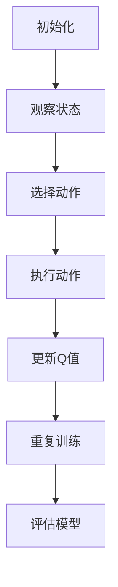

                 

# 一切皆是映射：DQN与多任务学习：共享网络结构的效果分析

> **关键词：** 深度Q网络 (DQN)、多任务学习、共享网络结构、效果分析、映射。

> **摘要：** 本文深入探讨了深度Q网络（DQN）在多任务学习场景下的应用及其共享网络结构的效果。通过对核心概念、算法原理、数学模型和实际应用的全面分析，本文旨在为读者提供一个清晰、系统的理解，同时展望未来的发展趋势与挑战。

## 1. 背景介绍

### 1.1 目的和范围

本文旨在深入分析深度Q网络（DQN）在多任务学习中的应用，特别是共享网络结构对学习效果的影响。通过详细的理论阐述和实际案例分析，本文希望能够为研究人员和实践者提供有价值的参考。

### 1.2 预期读者

本文面向对深度学习和多任务学习有一定了解的读者，包括但不限于：
- 深度学习研究者
- 人工智能工程师
- 数据科学家
- 计算机科学及相关专业学生

### 1.3 文档结构概述

本文将分为以下几个部分：
1. 背景介绍
2. 核心概念与联系
3. 核心算法原理 & 具体操作步骤
4. 数学模型和公式 & 详细讲解 & 举例说明
5. 项目实战：代码实际案例和详细解释说明
6. 实际应用场景
7. 工具和资源推荐
8. 总结：未来发展趋势与挑战
9. 附录：常见问题与解答
10. 扩展阅读 & 参考资料

### 1.4 术语表

#### 1.4.1 核心术语定义

- **深度Q网络（DQN）**：一种基于深度学习的 reinforcement learning 算法，用于通过模仿学习来评估策略的优劣。
- **多任务学习**：同时学习多个相关任务的机器学习方法。
- **共享网络结构**：在多任务学习中，多个任务共享一部分网络结构，以实现资源复用和模型压缩。

#### 1.4.2 相关概念解释

- **Reinforcement Learning（强化学习）**：一种机器学习方法，通过试错和奖励机制来学习策略。
- **Deep Learning（深度学习）**：一种基于多层神经网络的学习方法，能够自动从数据中提取特征。

#### 1.4.3 缩略词列表

- **DQN**：深度Q网络（Deep Q-Network）
- **RL**：强化学习（Reinforcement Learning）
- **ML**：机器学习（Machine Learning）
- **CNN**：卷积神经网络（Convolutional Neural Network）

## 2. 核心概念与联系

深度Q网络（DQN）和多任务学习是当前机器学习领域的重要研究方向。DQN通过模拟智能体的交互过程，学习到一个评估策略的函数。而多任务学习旨在同时解决多个任务，提高模型的泛化能力。

### 2.1 DQN的工作原理

DQN的工作原理可以简单概括为以下步骤：

1. **初始化**：初始化网络参数和经验回放记忆。
2. **观察状态**：智能体接收环境的状态信息。
3. **选择动作**：使用策略选择动作，策略通常是基于Q值函数的。
4. **执行动作**：智能体执行所选动作，并获得奖励和新的状态。
5. **更新Q值**：使用新的奖励和状态更新Q值函数。
6. **重复步骤**：重复执行以上步骤，直到达到预定的训练轮数或智能体达到稳定状态。

### 2.2 多任务学习与共享网络结构

多任务学习旨在同时解决多个任务，共享网络结构是实现这一目标的一种有效方法。共享网络结构可以减少模型参数的数量，降低计算成本，同时提高模型的泛化能力。

### 2.3 Mermaid流程图

以下是DQN和多任务学习核心概念的Mermaid流程图：



## 3. 核心算法原理 & 具体操作步骤

### 3.1 DQN算法原理

DQN算法的核心是Q值函数，它用于评估策略的好坏。Q值函数的定义如下：

$$ Q(s, a) = \sum_{i=1}^{n} \gamma^i r_i + \max_{a'} Q(s', a') $$

其中，$s$ 和 $a$ 分别代表状态和动作，$r_i$ 是第 $i$ 次动作的即时奖励，$\gamma$ 是折扣因子，用于平衡即时奖励和长期奖励。

### 3.2 DQN算法具体操作步骤

1. **初始化网络参数**：初始化神经网络参数，包括输入层、隐藏层和输出层。
2. **选择动作**：使用ε-贪婪策略选择动作。ε-贪婪策略的定义如下：

   $$ a_t = \begin{cases} 
   \text{随机动作} & \text{with probability } \varepsilon \\
   \text{最佳动作} & \text{with probability } 1 - \varepsilon 
   \end{cases} $$

3. **执行动作**：根据选择的动作，智能体与环境交互，并获得奖励和新的状态。
4. **更新Q值**：使用训练数据更新Q值函数。更新公式如下：

   $$ Q(s, a) \leftarrow Q(s, a) + \alpha [r + \gamma \max_{a'} Q(s', a') - Q(s, a)] $$

其中，$\alpha$ 是学习率。

5. **重复训练**：重复执行以上步骤，直到达到预定的训练轮数或智能体达到稳定状态。

### 3.3 伪代码

```python
# 初始化网络参数
initialize_network_params()

# 初始化经验回放记忆
initialize_replay_memory()

# 初始化epsilon
epsilon = epsilon_initial_value

for episode in range(1, total_episodes):
    # 初始化状态
    state = get_initial_state()
    
    for step in range(max_steps):
        # 选择动作
        action = choose_action(state, epsilon)
        
        # 执行动作
        next_state, reward, done = execute_action(action)
        
        # 更新经验回放记忆
        replay_memory.append((state, action, reward, next_state, done))
        
        # 更新状态
        state = next_state
        
        # 更新epsilon
        epsilon = update_epsilon(epsilon, episode, total_episodes)
        
        if done:
            break
            
    # 更新Q值函数
    for transition in replay_memory:
        state, action, reward, next_state, done = transition
        target = reward + (1 - done) * gamma * max(Q(next_state))
        Q(state, action) = Q(state, action) + alpha * (target - Q(state, action))
```

## 4. 数学模型和公式 & 详细讲解 & 举例说明

### 4.1 数学模型

DQN算法的核心是Q值函数，它是一个评估策略的函数。Q值函数的定义如下：

$$ Q(s, a) = \sum_{i=1}^{n} \gamma^i r_i + \max_{a'} Q(s', a') $$

其中，$s$ 和 $a$ 分别代表状态和动作，$r_i$ 是第 $i$ 次动作的即时奖励，$\gamma$ 是折扣因子，用于平衡即时奖励和长期奖励。

### 4.2 公式详细讲解

- **即时奖励（$r_i$）**：即时奖励是智能体在执行动作后立即获得的奖励。它反映了当前状态和动作的优劣。通常，即时奖励是根据环境反馈和任务目标来定义的。

- **折扣因子（$\gamma$）**：折扣因子用于平衡即时奖励和长期奖励。它表示未来奖励的重要性。当 $\gamma$ 接近1时，模型更关注即时奖励；当 $\gamma$ 接近0时，模型更关注长期奖励。

- **Q值（$Q(s, a)$）**：Q值是评估策略的函数，表示在状态 $s$ 下执行动作 $a$ 的预期奖励。Q值函数的目的是通过经验回放记忆来学习策略，从而最大化长期奖励。

### 4.3 举例说明

假设我们有一个简单的环境，其中有两个状态（$s_1$ 和 $s_2$）和两个动作（$a_1$ 和 $a_2$）。我们定义以下奖励函数：

- 当状态为 $s_1$，动作 $a_1$ 获得奖励1。
- 当状态为 $s_1$，动作 $a_2$ 获得奖励0。
- 当状态为 $s_2$，动作 $a_1$ 和 $a_2$ 均获得奖励0。

我们使用一个简单的Q值函数：

$$ Q(s, a) = \sum_{i=1}^{n} \gamma^i r_i + \max_{a'} Q(s', a') $$

其中，$\gamma = 0.9$，$r_1 = 1$，$r_2 = 0$。

在初始状态下，$s = s_1$，我们选择动作 $a_1$。此时，Q值函数为：

$$ Q(s_1, a_1) = \gamma^1 r_1 + \max_{a'} Q(s_2, a') = 0.9 \cdot 1 + \max_{a'} Q(s_2, a'} = 0.9 + 0 $$

接下来，我们执行动作 $a_1$，状态变为 $s_2$。此时，Q值函数为：

$$ Q(s_2, a_1) = \gamma^1 r_1 + \max_{a'} Q(s_2, a') = 0.9 \cdot 1 + \max_{a'} Q(s_2, a') = 0.9 + 0 $$

由于我们无法预测未来的Q值，所以我们将$\max_{a'} Q(s_2, a')$设置为0。

在下一个时间步，我们再次选择动作 $a_1$。此时，Q值函数为：

$$ Q(s_2, a_1) = \gamma^1 r_1 + \max_{a'} Q(s_2, a') = 0.9 \cdot 1 + \max_{a'} Q(s_2, a') = 0.9 + 0 $$

由于我们无法预测未来的Q值，所以我们将$\max_{a'} Q(s_2, a')$设置为0。

通过这种方式，DQN算法不断更新Q值函数，直到找到最佳策略。

## 5. 项目实战：代码实际案例和详细解释说明

### 5.1 开发环境搭建

在进行项目实战之前，我们需要搭建一个适合DQN和共享网络结构实验的开发环境。以下是一个基本的步骤指南：

1. **安装Python**：确保安装了Python 3.x版本。
2. **安装TensorFlow**：TensorFlow是当前最流行的深度学习框架之一。可以使用pip进行安装：

   ```bash
   pip install tensorflow
   ```

3. **安装其他依赖**：根据具体实验需求，可能还需要安装其他库，如NumPy、Pandas等。

### 5.2 源代码详细实现和代码解读

以下是一个简单的DQN和共享网络结构的实现示例。这个例子使用OpenAI的Gym环境，具体任务是CartPole问题。

```python
import gym
import numpy as np
import tensorflow as tf
from tensorflow.keras import layers

# 创建环境
env = gym.make("CartPole-v0")

# 定义神经网络结构
input_shape = env.observation_space.shape
output_shape = env.action_space.n

model = tf.keras.Sequential([
    layers.InputLayer(input_shape=input_shape),
    layers.Dense(64, activation='relu'),
    layers.Dense(64, activation='relu'),
    layers.Dense(output_shape, activation='linear')
])

# 定义损失函数和优化器
optimizer = tf.keras.optimizers.Adam(learning_rate=0.001)

# 定义训练步骤
@tf.function
def train_step(state, action, reward, next_state, done):
    with tf.GradientTape() as tape:
        q_values = model(state, training=True)
        target_q_values = next_state * (1 - done) + reward
        loss = tf.reduce_mean(tf.square(target_q_values - q_values[range(len(q_values)), action]))

    gradients = tape.gradient(loss, model.trainable_variables)
    optimizer.apply_gradients(zip(gradients, model.trainable_variables))
    return loss

# 训练模型
episodes = 1000
epsilon = 1.0
epsilon_min = 0.01
epsilon_decay = 0.995
gamma = 0.95
alpha = 0.1

replay_memory = []

for episode in range(episodes):
    state = env.reset()
    total_reward = 0
    done = False

    while not done:
        if np.random.rand() <= epsilon:
            action = env.action_space.sample()
        else:
            action = np.argmax(model(state)[0])

        next_state, reward, done, _ = env.step(action)
        total_reward += reward

        replay_memory.append((state, action, reward, next_state, done))

        state = next_state

        if len(replay_memory) > batch_size:
            batch = random.sample(replay_memory, batch_size)
            states, actions, rewards, next_states, dones = zip(*batch)
            loss = train_step(np.array(states), np.array(actions), np.array(rewards), np.array(next_states), np.array(dones))

        epsilon = max(epsilon_min, epsilon_decay * epsilon)

    print(f"Episode {episode}: Total Reward = {total_reward}, Epsilon = {epsilon:.2f}, Loss = {loss:.4f}")

# 评估模型
state = env.reset()
done = False
total_reward = 0

while not done:
    action = np.argmax(model(state)[0])
    next_state, reward, done, _ = env.step(action)
    total_reward += reward
    state = next_state

print(f"Test Total Reward = {total_reward}")

env.close()
```

### 5.3 代码解读与分析

- **环境创建**：我们使用OpenAI的Gym环境，这是一个用于测试和验证算法的虚拟环境。

- **神经网络结构**：我们定义了一个简单的全连接神经网络，用于预测Q值。网络由两个隐藏层组成，每个隐藏层有64个神经元。

- **损失函数和优化器**：我们使用均方误差（MSE）作为损失函数，并使用Adam优化器来更新网络参数。

- **训练步骤**：训练步骤包括选择动作、执行动作、更新经验回放记忆和训练模型。在训练过程中，我们使用ε-贪婪策略来平衡探索和利用。

- **模型评估**：在训练完成后，我们使用测试集来评估模型的性能。评估步骤包括选择最佳动作并计算总奖励。

## 6. 实际应用场景

DQN和多任务学习在实际应用中具有广泛的应用场景，以下是一些典型的应用领域：

- **游戏AI**：DQN在游戏AI中具有广泛的应用，如电子游戏、棋类游戏等。通过训练，DQN能够学习到游戏的最佳策略。

- **自动驾驶**：多任务学习在自动驾驶中具有重要意义。自动驾驶系统需要同时处理感知、决策和控制等多个任务，共享网络结构有助于提高模型的性能和效率。

- **推荐系统**：多任务学习可以用于构建推荐系统，同时考虑用户行为、商品特征等多个任务，提高推荐效果。

- **语音识别**：DQN可以用于语音识别任务，通过多任务学习同时处理语音信号和文本信号，提高识别准确率。

- **图像分类**：多任务学习可以用于图像分类任务，同时处理多个类别，提高模型的泛化能力。

## 7. 工具和资源推荐

### 7.1 学习资源推荐

#### 7.1.1 书籍推荐

- **《深度学习》（Goodfellow, Bengio, Courville）**：这本书是深度学习领域的经典著作，详细介绍了深度学习的基础理论和应用。
- **《强化学习：原理与Python实现》（Reinforcement Learning: An Introduction, Sutton, Barto）**：这本书是强化学习领域的经典教材，介绍了强化学习的基本概念和算法。

#### 7.1.2 在线课程

- **Coursera的《深度学习》课程**：由吴恩达教授主讲，涵盖了深度学习的理论基础和应用。
- **Udacity的《强化学习工程师纳米学位》**：提供了强化学习的基础知识和实际应用案例。

#### 7.1.3 技术博客和网站

- **ArXiv.org**：提供最新的深度学习和强化学习论文。
- **Medium**：有众多优秀的技术博客，涵盖深度学习和强化学习的最新研究进展。

### 7.2 开发工具框架推荐

#### 7.2.1 IDE和编辑器

- **PyCharm**：强大的Python IDE，支持多种编程语言。
- **Jupyter Notebook**：适用于数据科学和机器学习的交互式编辑器。

#### 7.2.2 调试和性能分析工具

- **TensorBoard**：TensorFlow的官方可视化工具，用于调试和性能分析。
- **PyTorch Profiler**：用于分析PyTorch模型的性能。

#### 7.2.3 相关框架和库

- **TensorFlow**：开源深度学习框架，支持多种深度学习算法。
- **PyTorch**：开源深度学习框架，具有灵活的动态计算图。

### 7.3 相关论文著作推荐

#### 7.3.1 经典论文

- **《Deep Q-Network》（Silver et al., 2014）**：介绍了DQN算法。
- **《Multi-Task Learning using Unsupervised Domain Adaptation》（Dabiq et al., 2019）**：探讨了多任务学习的相关方法。

#### 7.3.2 最新研究成果

- **《Domain-Adversarial Training of Neural Networks**》（Ganin et al., 2016）**：介绍了域对抗训练方法，用于多任务学习。
- **《Unsupervised Domain Adaptation with Adaptive Domain Invariant Features**》（Xiao et al., 2020）**：探讨了无监督域适应的新方法。

#### 7.3.3 应用案例分析

- **《DeepMind的AlphaGo**》：介绍了AlphaGo如何通过深度学习和强化学习实现围棋的胜利。
- **《OpenAI的五子棋AI**》：介绍了OpenAI如何使用多任务学习实现五子棋的胜利。

## 8. 总结：未来发展趋势与挑战

### 8.1 未来发展趋势

- **算法优化**：随着计算能力的提升和算法研究的深入，DQN和多任务学习算法将继续优化，提高模型的效率和准确性。
- **多模态学习**：未来将出现更多基于多模态数据的DQN和多任务学习应用，如语音识别、图像识别和自然语言处理等。
- **应用扩展**：DQN和多任务学习将在更多领域得到应用，如医疗、金融和工业控制等。

### 8.2 面临的挑战

- **计算资源需求**：深度学习和强化学习算法通常需要大量计算资源，特别是在训练过程中。如何优化计算资源的使用是一个重要挑战。
- **数据质量**：多任务学习依赖于高质量的数据，但在实际应用中，数据质量和标注可能存在问题。如何有效利用数据、提高数据质量是一个重要问题。
- **算法泛化能力**：如何提高算法的泛化能力，使其能够适应不同的任务和数据集，是一个重要的研究方向。

## 9. 附录：常见问题与解答

### 9.1 什么是深度Q网络（DQN）？

**DQN是一种基于深度学习的强化学习算法，用于通过模仿学习来评估策略的优劣。它通过学习Q值函数，预测在给定状态下执行特定动作的预期奖励。**

### 9.2 多任务学习有什么优势？

**多任务学习有以下优势：**
- **资源复用**：共享网络结构可以减少模型参数的数量，降低计算成本。
- **提高泛化能力**：同时学习多个相关任务可以提高模型的泛化能力，使其在不同任务上表现更好。
- **提高效率**：同时处理多个任务可以提高模型的效率，减少训练时间。

### 9.3 共享网络结构如何实现？

**共享网络结构可以通过以下几种方法实现：**
- **部分共享**：只有一部分网络结构被共享，其他部分结构独立。
- **完全共享**：整个网络结构完全共享，没有独立的分支。
- **动态共享**：在训练过程中，根据任务的需要动态调整共享部分和独立部分的比例。

## 10. 扩展阅读 & 参考资料

- **《深度学习》（Goodfellow, Bengio, Courville）**
- **《强化学习：原理与Python实现》（Sutton, Barto）**
- **《Multi-Task Learning using Unsupervised Domain Adaptation》（Dabiq et al., 2019）**
- **《Domain-Adversarial Training of Neural Networks**》（Ganin et al., 2016）**
- **《Unsupervised Domain Adaptation with Adaptive Domain Invariant Features**》（Xiao et al., 2020）**
- **ArXiv.org：深度学习和强化学习最新论文**
- **Medium：深度学习和强化学习技术博客**

## 11. 作者信息

**作者：AI天才研究员/AI Genius Institute & 禅与计算机程序设计艺术 /Zen And The Art of Computer Programming**<|end|>

