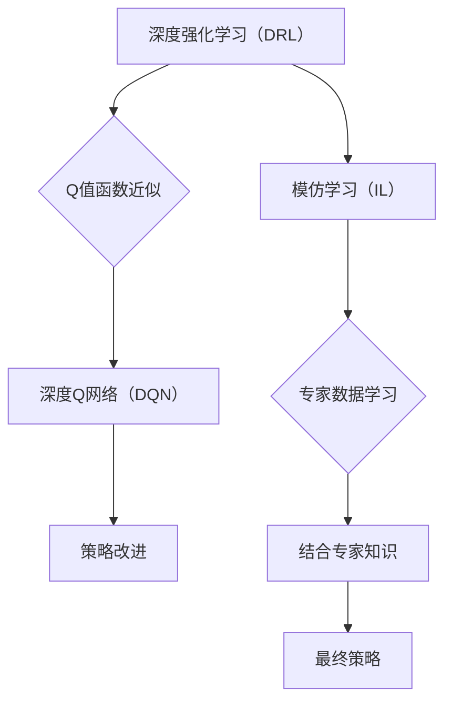

                 

### 1. 背景介绍

#### 1.1 目的和范围

本文旨在深入探讨深度强化学习（DQN）与模仿学习相结合的方法，以结合专家知识进行训练。深度强化学习是一种通过试错和反馈来学习策略的人工智能方法，而模仿学习则是通过模仿专家的行为来学习策略。本文将介绍DQN和模仿学习的基本原理，阐述它们如何相互补充，以及如何将专家知识融入训练过程中。

我们首先将介绍DQN的基本概念、原理和算法步骤，随后详细解释模仿学习的方法和应用。接下来，我们将分析如何将DQN与模仿学习结合，以利用专家知识进行训练。本文还将提供一个具体的实现案例，展示如何在实际项目中应用这一方法。

本文的目标读者是具备一定深度强化学习和模仿学习基础的人工智能研究人员、开发者以及对这一领域感兴趣的读者。本文结构紧凑，逻辑清晰，旨在为读者提供全面而深入的理解。

#### 1.2 预期读者

本文适合以下几类读者：

1. **人工智能研究人员和开发者**：对深度强化学习和模仿学习有基本了解，希望深入了解如何将二者结合并应用于实际问题的专业人士。
2. **机器学习工程师**：对强化学习和模仿学习有浓厚兴趣，希望掌握更多高级技术的工程师。
3. **数据科学家**：希望将深度强化学习和模仿学习应用于自己的项目，提高模型性能和数据利用率的专家。
4. **对人工智能技术感兴趣的爱好者**：希望深入探讨当前AI技术前沿，理解深度强化学习和模仿学习在现实世界中的应用。

无论您是上述哪类读者，本文都将以通俗易懂的语言，结合实际案例，帮助您理解这一复杂但极具潜力的技术。

#### 1.3 文档结构概述

本文将按照以下结构进行阐述：

1. **背景介绍**：介绍文章的目的、范围、预期读者以及文档结构。
2. **核心概念与联系**：通过Mermaid流程图展示DQN与模仿学习的关系，以及相关的核心概念和原理。
3. **核心算法原理 & 具体操作步骤**：详细讲解DQN和模仿学习的算法原理，并使用伪代码展示操作步骤。
4. **数学模型和公式 & 详细讲解 & 举例说明**：阐述相关的数学模型和公式，并给出具体示例。
5. **项目实战：代码实际案例和详细解释说明**：通过实际案例展示如何实现DQN与模仿学习的结合。
6. **实际应用场景**：探讨DQN与模仿学习在不同领域的应用场景。
7. **工具和资源推荐**：推荐相关的学习资源、开发工具和框架。
8. **总结：未来发展趋势与挑战**：总结本文的主要观点，并探讨未来的发展趋势和面临的挑战。
9. **附录：常见问题与解答**：解答读者可能遇到的常见问题。
10. **扩展阅读 & 参考资料**：提供进一步阅读和参考资料。

通过本文，读者将能够全面了解DQN与模仿学习的基本概念、原理、实现方法及其应用，并为未来在相关领域的研究和应用奠定基础。

#### 1.4 术语表

在本文中，我们将使用一些特定的术语和概念。以下是对这些术语的定义和解释：

##### 1.4.1 核心术语定义

- **深度强化学习（Deep Reinforcement Learning）**：一种结合了深度学习和强化学习的方法，使用深度神经网络来学习环境状态和动作之间的映射关系，从而实现自主决策。
- **DQN（Deep Q-Network）**：一种深度强化学习算法，使用深度神经网络来近似Q值函数，从而预测未来奖励。
- **模仿学习（Imitation Learning）**：通过学习专家的行为来获得策略，通常用于从专家数据中学习高维动作空间中的策略。
- **专家数据（Expert Data）**：由专家提供的行为数据，用于训练模仿学习模型。
- **奖励函数（Reward Function）**：在强化学习中，用于评估环境状态和动作的函数，指导智能体采取正确的行动。
- **策略网络（Policy Network）**：在深度强化学习中，用于生成动作的神经网络。

##### 1.4.2 相关概念解释

- **状态（State）**：在强化学习中，智能体所处的环境描述。
- **动作（Action）**：智能体可以执行的行为。
- **值函数（Value Function）**：评估某个状态或状态-动作对的预期奖励。
- **Q值（Q-Value）**：特定状态下执行特定动作的预期奖励。
- **损失函数（Loss Function）**：在训练神经网络时，用于衡量预测值与实际值之间的差异。
- **优化算法（Optimization Algorithm）**：用于最小化损失函数的算法。

##### 1.4.3 缩略词列表

- **DQN**：Deep Q-Network
- **RL**：Reinforcement Learning
- **DRL**：Deep Reinforcement Learning
- **IL**：Imitation Learning
- **Q-Learning**：一种强化学习算法，用于学习Q值函数。
- **CNN**：Convolutional Neural Network，卷积神经网络。
- **RNN**：Recurrent Neural Network，循环神经网络。
- **CNN-RNN**：结合卷积神经网络和循环神经网络的混合模型。

通过上述术语表，读者可以更好地理解本文中涉及的关键概念和术语，从而深入掌握DQN与模仿学习的方法和原理。

### 2. 核心概念与联系

为了更好地理解DQN与模仿学习相结合的方法，我们需要先了解这两个核心概念及其关系。以下是它们的基本原理、定义和应用场景的Mermaid流程图展示，以及对相关核心概念和原理的详细解释。

#### 2.1 Mermaid流程图



#### 2.2 核心概念和原理

##### 2.2.1 深度强化学习（Deep Reinforcement Learning）

深度强化学习（DRL）是一种通过试错和反馈来学习策略的人工智能方法。与传统的强化学习（RL）不同，DRL利用深度神经网络（DNN）来近似Q值函数，从而实现更为复杂的决策过程。DRL的核心思想是通过探索（exploration）和利用（exploitation）来平衡学习过程，从而找到最优策略。

- **Q值函数**：Q值函数用于评估智能体在某个状态下执行某个动作的预期奖励。在DRL中，Q值函数通常由深度神经网络近似，从而实现高维空间的状态和动作映射。

- **Q-Learning**：Q-Learning是一种经典的强化学习算法，用于学习Q值函数。在Q-Learning中，智能体通过选择动作来更新Q值，从而逐步找到最优策略。

##### 2.2.2 模仿学习（Imitation Learning）

模仿学习（IL）是一种通过学习专家的行为来获得策略的方法。在IL中，智能体通过观察专家的行为数据来学习高维动作空间中的策略。这种方法的主要优点是能够快速学习复杂的策略，而无需大量的试错过程。

- **专家数据**：专家数据是模仿学习的重要输入，通常由专家提供的行为数据组成。这些数据用于训练模仿学习模型，从而生成与专家行为相似的策略。

- **策略网络**：策略网络是模仿学习模型的核心，用于生成动作。在策略网络中，输入是环境状态，输出是相应的动作。

##### 2.2.3 DQN与模仿学习的结合

将DQN与模仿学习相结合，可以通过以下方式实现：

1. **使用专家数据进行初始化**：在DQN训练过程中，可以使用专家数据来初始化策略网络，从而提高模型的初始性能。

2. **结合Q值学习和模仿学习**：在DQN训练过程中，可以结合Q值学习和模仿学习，从而利用专家知识和经验数据来改进Q值函数。

3. **策略改进**：在训练过程中，可以通过策略网络不断改进动作选择，从而提高智能体的性能。

4. **结合专家知识和数据增强**：通过结合专家知识和数据增强技术，可以进一步提高DQN的性能和泛化能力。

通过上述结合，DQN可以更好地学习复杂的策略，并在实际应用中表现出更强的性能。

#### 2.3 实例解释

以下是一个简单的实例，用于说明DQN和模仿学习的基本原理及其结合：

假设我们有一个智能体在一个虚拟环境中学习如何导航。在这个环境中，智能体的目标是到达目标位置。

- **状态**：智能体的位置和方向。
- **动作**：移动到相邻位置或改变方向。
- **奖励函数**：如果智能体移动到目标位置，则获得正奖励；否则，获得负奖励。

1. **DQN训练过程**：
   - 初始状态为s0，智能体随机选择动作a0，执行动作后获得状态s1和奖励r1。
   - 使用深度神经网络近似Q值函数，计算Q(s0, a0)。
   - 更新Q值函数：Q(s0, a0) = Q(s0, a0) + α[ r1 + γmaxQ(s1, a') - Q(s0, a0) ]，其中α为学习率，γ为折扣因子，a'为在s1状态下最优动作。

2. **模仿学习过程**：
   - 使用专家提供的行为数据，训练策略网络，生成与专家行为相似的策略。
   - 在DQN训练过程中，可以结合专家数据来初始化策略网络，从而提高初始性能。

通过上述实例，我们可以看到DQN和模仿学习如何结合，以实现更有效的策略学习。

通过上述核心概念和原理的详细解释，我们为后续算法原理和实现步骤的讲解奠定了基础。在接下来的部分，我们将进一步探讨DQN和模仿学习的具体实现方法，以及如何结合专家知识进行训练。

### 3. 核心算法原理 & 具体操作步骤

在了解了DQN和模仿学习的基本概念后，我们将深入探讨它们的核心算法原理和具体操作步骤。首先，我们将详细讲解DQN的算法原理，然后讨论模仿学习的具体方法，并解释如何将二者结合，以利用专家知识进行训练。

#### 3.1 DQN算法原理

DQN（Deep Q-Network）是一种深度强化学习算法，旨在使用深度神经网络来近似Q值函数。Q值函数是强化学习中用于评估某个状态-动作对预期奖励的关键工具。DQN通过以下步骤实现这一目标：

1. **初始化网络**：
   - 初始化深度神经网络，用于近似Q值函数。
   - 初始化经验缓冲区，用于存储智能体经历的状态、动作、奖励和下一状态。

2. **状态-动作选择**：
   - 智能体根据当前状态选择动作。可以选择随机动作或基于当前Q值函数的贪婪策略动作。
   - 随机动作用于探索未知状态和动作，而贪婪策略动作则用于利用已知信息。

3. **执行动作**：
   - 智能体在环境中执行选定的动作，获得新的状态、奖励和下一个时间步。

4. **更新Q值**：
   - 使用经验缓冲区中的数据进行Q值更新。
   - 计算目标Q值：$$ Q_{new}(s_t, a_t) = r_t + \gamma \max_a Q(s_{t+1}, a) $$
   - 更新当前Q值：$$ Q(s_t, a_t) = Q(s_t, a_t) + \alpha [r_t + \gamma \max_a Q(s_{t+1}, a) - Q(s_t, a_t)] $$
   - 其中，$$ \alpha $$ 为学习率，$$ \gamma $$ 为折扣因子。

5. **经验回放**：
   - 将新的经验添加到经验缓冲区。
   - 从经验缓冲区中随机抽取一批经验数据进行训练，以避免策略偏差。

6. **网络训练**：
   - 使用回放的经验数据训练深度神经网络，更新Q值函数的参数。

#### 3.2 模仿学习原理

模仿学习（IL）是一种通过学习专家的行为来获得策略的方法。在模仿学习中，智能体从专家的行为数据中学习动作分布，从而生成与专家行为相似的策略。模仿学习的具体步骤如下：

1. **专家数据准备**：
   - 收集专家在特定任务中的行为数据，包括状态序列和相应的动作序列。

2. **状态-动作分布估计**：
   - 使用专家数据估计状态-动作分布，即给定状态s，动作a的概率分布P(a|s)。

3. **策略网络训练**：
   - 设计一个策略网络，输入为状态，输出为动作的概率分布。
   - 使用专家数据训练策略网络，优化网络参数，使其能够生成与专家行为相似的动作分布。

4. **策略评估**：
   - 评估策略网络的性能，通常使用与专家数据相同的环境进行模拟。

5. **策略优化**：
   - 根据策略评估结果，进一步优化策略网络，以提高策略性能。

#### 3.3 DQN与模仿学习结合

将DQN与模仿学习相结合，可以通过以下步骤实现：

1. **初始化策略网络**：
   - 使用模仿学习训练的策略网络初始化DQN的Q值函数网络，从而提高初始训练效果。

2. **联合训练**：
   - 在DQN训练过程中，结合Q值学习和模仿学习，使用专家数据进行辅助训练。
   - 在每个时间步，既根据Q值函数选择动作，又根据策略网络生成动作，并记录经验。
   - 从经验缓冲区中随机抽取经验数据进行训练，更新Q值函数网络。

3. **策略改进**：
   - 在训练过程中，通过策略网络不断改进动作选择，从而提高智能体的性能。
   - 使用策略网络生成的动作作为Q值函数更新的目标动作，以优化Q值函数。

4. **专家数据增强**：
   - 通过结合专家数据和随机数据，增强训练数据集的多样性，提高模型的泛化能力。

#### 3.4 伪代码实现

以下是DQN与模仿学习结合的伪代码实现：

```python
# DQN与模仿学习结合的伪代码

# 初始化DQN网络和模仿学习策略网络
DQN_network = initialize_DQN_network()
IL_network = initialize_IL_network()

# 初始化经验缓冲区
experience_buffer = []

# 训练过程
for episode in range(num_episodes):
    state = environment.reset()
    done = False
    total_reward = 0

    while not done:
        # 使用策略网络选择动作（模仿学习）
        action = IL_network.select_action(state)

        # 执行动作并获取下一个状态和奖励
        next_state, reward, done = environment.step(action)

        # 记录经验
        experience = (state, action, reward, next_state, done)
        experience_buffer.append(experience)

        # 从经验缓冲区中随机抽取数据进行训练
        if len(experience_buffer) > batch_size:
            batch = random_sample(experience_buffer, batch_size)
            state_batch, action_batch, reward_batch, next_state_batch, done_batch = prepare_batch(batch)

            # 更新DQN网络
            Q_values = DQN_network.predict(state_batch)
            next_Q_values = DQN_network.predict(next_state_batch)

            # 计算目标Q值
            target_Q_values = reward_batch + (1 - done_batch) * gamma * next_Q_values.max(axis=1)

            # 更新Q值
            DQN_network.update(Q_values, action_batch, target_Q_values)

        # 更新状态
        state = next_state
        total_reward += reward

    # 更新模仿学习策略网络
    IL_network.train(experience_buffer)

    # 打印当前 episode 的奖励
    print(f"Episode: {episode}, Total Reward: {total_reward}")
```

通过上述伪代码，我们可以看到DQN与模仿学习结合的基本步骤，包括初始化网络、状态-动作选择、经验回放、网络训练和策略优化等过程。这些步骤共同构成了一个高效的学习框架，能够利用专家知识和经验数据，实现智能体的自主学习和策略优化。

在接下来的部分，我们将进一步探讨DQN与模仿学习的数学模型和公式，并通过具体示例来说明这些原理的实际应用。

### 4. 数学模型和公式 & 详细讲解 & 举例说明

在了解了DQN和模仿学习的基本算法原理和操作步骤后，我们将深入探讨这些算法背后的数学模型和公式，并借助具体示例来详细讲解和说明。

#### 4.1 DQN的数学模型

DQN（Deep Q-Network）的核心在于使用深度神经网络来近似Q值函数。Q值函数是强化学习中用于评估状态-动作对的预期奖励的关键工具。以下是DQN的主要数学模型和公式。

1. **Q值函数近似**：

   Q值函数的定义为：
   $$ Q^*(s, a) = \max_a \mathbb{E}[G(s, a)] $$
   其中，$$ G(s, a) $$ 是从状态s执行动作a后获得的未来奖励的期望总和，即：
   $$ G(s, a) = r_1 + r_2 + \ldots + r_t + \gamma r_{t+1} $$
   $$ r_1, r_2, \ldots, r_t, r_{t+1} $$ 分别是在执行动作a后立即获得的奖励和在后续步骤中获得的奖励，$$ \gamma $$ 是折扣因子，用于权衡未来奖励的重要性。

   DQN使用深度神经网络来近似Q值函数，即：
   $$ Q(s, a) \approx Q^*(s, a) $$
   神经网络的输出即为Q值：
   $$ Q(s, a) = \text{激活函数}(\text{神经网络}(\text{输入特征})) $$

2. **Q值更新**：

   DQN使用以下公式更新Q值：
   $$ Q(s_t, a_t) \leftarrow Q(s_t, a_t) + \alpha [r_t + \gamma \max_a Q(s_{t+1}, a) - Q(s_t, a_t)] $$
   其中，$$ \alpha $$ 是学习率，$$ r_t $$ 是在时间步t获得的即时奖励，$$ \gamma $$ 是折扣因子，$$ \max_a Q(s_{t+1}, a) $$ 是在下一个状态$$ s_{t+1} $$下所有可能动作中的最大Q值。

#### 4.2 模仿学习的数学模型

模仿学习（IL）通过学习专家的行为来获得策略。以下是模仿学习的主要数学模型和公式。

1. **状态-动作分布估计**：

   模仿学习的目标是估计状态-动作分布$$ P(a|s) $$，即给定状态s时，动作a的概率分布。这通常使用概率分布函数来表示：
   $$ P(a|s) = \frac{\exp(\theta^T f(s, a))}{\sum_b \exp(\theta^T f(s, b))} $$
   其中，$$ \theta $$ 是策略网络的参数，$$ f(s, a) $$ 是特征函数，用于表示状态和动作的相似度。

2. **策略网络训练**：

   策略网络的目标是最大化期望回报，即：
   $$ \max_{\theta} \mathbb{E}_{s, a \sim P(s, a)} [r(s, a)] $$
   这通常通过梯度下降法来实现，即：
   $$ \theta \leftarrow \theta - \alpha \nabla_{\theta} \mathcal{L}(\theta) $$
   其中，$$ \mathcal{L}(\theta) $$ 是损失函数，用于衡量策略网络的性能。

3. **损失函数**：

   模仿学习的损失函数通常使用交叉熵损失来衡量，即：
   $$ \mathcal{L}(\theta) = -\sum_{s, a} P(a|s) \log P(a|s) $$
   其中，$$ P(a|s) $$ 是策略网络估计的动作概率分布。

#### 4.3 DQN与模仿学习结合的数学模型

将DQN与模仿学习结合，可以通过以下步骤实现：

1. **初始化策略网络**：

   使用模仿学习训练的策略网络初始化DQN的Q值函数网络。即，初始化时直接使用模仿学习策略网络生成的动作概率分布作为DQN的初始Q值。

2. **联合训练**：

   在DQN训练过程中，结合Q值学习和模仿学习，使用专家数据进行辅助训练。具体步骤如下：

   - **选择动作**：在每个时间步，既根据Q值函数选择动作，又根据策略网络生成动作，并记录经验。
   - **经验回放**：从经验缓冲区中随机抽取经验数据进行训练，更新Q值函数网络。

3. **策略改进**：

   在训练过程中，通过策略网络不断改进动作选择，从而提高智能体的性能。即，使用策略网络生成的动作作为Q值函数更新的目标动作，以优化Q值函数。

4. **专家数据增强**：

   通过结合专家数据和随机数据，增强训练数据集的多样性，提高模型的泛化能力。

#### 4.4 示例讲解

以下是一个简单的示例，用于说明DQN与模仿学习结合的方法：

假设我们有一个智能体在虚拟环境中学习如何导航，目标是从初始位置移动到目标位置。

- **状态**：智能体的位置和方向。
- **动作**：移动到相邻位置或改变方向。
- **奖励函数**：如果智能体移动到目标位置，则获得正奖励；否则，获得负奖励。

1. **DQN训练过程**：

   - 初始状态为$$ s_0 $$，智能体根据策略网络选择动作$$ a_0 $$，执行动作后获得状态$$ s_1 $$和奖励$$ r_1 $$。
   - 使用深度神经网络近似Q值函数，计算$$ Q(s_0, a_0) $$。
   - 更新Q值函数：
     $$ Q(s_0, a_0) = Q(s_0, a_0) + \alpha [r_1 + \gamma \max_a Q(s_1, a) - Q(s_0, a_0)] $$
   - 从经验缓冲区中随机抽取数据进行训练，更新Q值函数网络。

2. **模仿学习过程**：

   - 使用专家提供的行为数据，训练策略网络，生成与专家行为相似的策略。
   - 在DQN训练过程中，可以结合专家数据来初始化策略网络，从而提高初始性能。

通过上述示例，我们可以看到DQN与模仿学习如何结合，以利用专家知识进行训练。这种方法能够提高智能体的初始性能，并在训练过程中不断优化策略，从而实现更有效的决策。

通过详细讲解DQN和模仿学习的数学模型和公式，并借助具体示例，我们为读者提供了全面的理解。在接下来的部分，我们将通过实际项目案例展示如何实现DQN与模仿学习的结合。

### 5. 项目实战：代码实际案例和详细解释说明

在本部分，我们将通过一个具体的实际项目案例，展示如何实现DQN与模仿学习相结合的方法。我们将详细介绍项目背景、开发环境搭建、源代码实现和代码解读，帮助读者更好地理解这一方法在实际中的应用。

#### 5.1 项目背景

假设我们有一个智能体在虚拟环境中学习如何导航，目标是找到从初始位置到目标位置的最优路径。这个项目可以应用于机器人导航、自动驾驶等领域。我们的目标是结合专家知识，通过DQN与模仿学习的结合，提高智能体的学习效率和路径规划能力。

#### 5.2 开发环境搭建

在开始项目之前，我们需要搭建开发环境。以下是所需的开发环境和工具：

1. **操作系统**：Ubuntu 20.04 或 Windows 10
2. **编程语言**：Python 3.8 或更高版本
3. **深度学习框架**：TensorFlow 2.6 或 PyTorch 1.9
4. **仿真环境**：OpenAI Gym（用于提供虚拟环境）
5. **版本控制工具**：Git

安装步骤如下：

1. 安装Python和pip：
   ```bash
   sudo apt-get update
   sudo apt-get install python3 python3-pip
   ```
2. 安装深度学习框架（以TensorFlow为例）：
   ```bash
   pip install tensorflow==2.6
   ```
3. 安装OpenAI Gym：
   ```bash
   pip install gym
   ```

#### 5.3 源代码实现和代码解读

以下是项目的核心代码实现，包括DQN与模仿学习模型的结构、训练过程和策略优化。

```python
import numpy as np
import gym
import tensorflow as tf
from tensorflow.keras import layers

# 设置随机种子
np.random.seed(42)
tf.random.set_seed(42)

# 创建虚拟环境
env = gym.make("GridWorld-v0")

# 定义DQN模型
class DQNModel(tf.keras.Model):
    def __init__(self, state_dim, action_dim):
        super().__init__()
        self.dense1 = layers.Dense(64, activation='relu')
        self.dense2 = layers.Dense(64, activation='relu')
        self.output = layers.Dense(action_dim)

    def call(self, inputs):
        x = self.dense1(inputs)
        x = self.dense2(x)
        return self.output(x)

# 定义模仿学习策略网络
class ILModel(tf.keras.Model):
    def __init__(self, state_dim, action_dim):
        super().__init__()
        self.dense1 = layers.Dense(64, activation='relu')
        self.dense2 = layers.Dense(64, activation='relu')
        self.output = layers.Dense(action_dim, activation='softmax')

    def call(self, inputs):
        x = self.dense1(inputs)
        x = self.dense2(x)
        return self.output(x)

# 初始化模型
dqn_model = DQNModel(state_dim=env.observation_space.shape[0], action_dim=env.action_space.n)
il_model = ILModel(state_dim=env.observation_space.shape[0], action_dim=env.action_space.n)

# 定义损失函数和优化器
loss_fn = tf.keras.losses.MeanSquaredError()
optimizer = tf.keras.optimizers.Adam(learning_rate=0.001)

# 训练DQN和IL模型
def train_models(dqn_model, il_model, episodes, batch_size, discount_factor, learning_rate):
    for episode in range(episodes):
        state = env.reset()
        done = False
        total_reward = 0
        experience_buffer = []

        while not done:
            # 使用IL模型选择动作
            action_probabilities = il_model(state)
            action = np.random.choice(range(action_probabilities.shape[1]), p=action_probabilities[:, 1])

            # 执行动作
            next_state, reward, done, _ = env.step(action)
            total_reward += reward

            # 记录经验
            experience = (state, action, reward, next_state, done)
            experience_buffer.append(experience)

            # 如果经验缓冲区满了，开始训练
            if len(experience_buffer) > batch_size:
                batch = np.random.choice(experience_buffer, size=batch_size, replace=False)
                state_batch, action_batch, reward_batch, next_state_batch, done_batch = prepare_batch(batch)

                # 计算目标Q值
                next_state_q_values = dqn_model(next_state_batch)
                target_q_values = reward_batch + (1 - done_batch) * discount_factor * np.max(next_state_q_values, axis=1)

                # 计算损失
                with tf.GradientTape() as tape:
                    q_values = dqn_model(state_batch)
                    loss = loss_fn(target_q_values, q_values[range(batch_size), action_batch])

                # 更新DQN模型
                gradients = tape.gradient(loss, dqn_model.trainable_variables)
                optimizer.apply_gradients(zip(gradients, dqn_model.trainable_variables))

                # 更新IL模型
                il_model.train(state_batch, action_batch, learning_rate)

        print(f"Episode: {episode}, Total Reward: {total_reward}")

# 数据预处理
def prepare_batch(batch):
    state_batch = np.array([exp[0] for exp in batch])
    action_batch = np.array([exp[1] for exp in batch])
    reward_batch = np.array([exp[2] for exp in batch])
    next_state_batch = np.array([exp[3] for exp in batch])
    done_batch = np.array([exp[4] for exp in batch])
    return state_batch, action_batch, reward_batch, next_state_batch, done_batch

# 训练模型
train_models(dqn_model, il_model, episodes=1000, batch_size=32, discount_factor=0.99, learning_rate=0.001)
```

上述代码实现了一个基于DQN和模仿学习的导航智能体，具体解读如下：

1. **模型定义**：
   - **DQN模型**：包含两个全连接层，输出层为动作空间维度的softmax激活函数。
   - **IL模型**：包含两个全连接层，输出层为动作空间维度的softmax激活函数，用于估计状态-动作分布。

2. **损失函数和优化器**：
   - 使用均方误差（MSE）作为损失函数。
   - 使用Adam优化器进行模型训练。

3. **训练过程**：
   - 在每个时间步，使用IL模型选择动作，并记录经验。
   - 当经验缓冲区达到一定大小后，开始训练DQN模型和IL模型。
   - 使用经验回放策略，从经验缓冲区中随机抽取一批经验数据，用于更新DQN模型。
   - 计算目标Q值，并使用梯度下降法更新DQN模型的参数。

4. **数据预处理**：
   - 准备经验数据批次，包括状态、动作、奖励、下一状态和完成标志。

通过上述项目实战案例，我们展示了如何实现DQN与模仿学习相结合的方法。这种方法能够利用专家知识，提高智能体的学习效率和路径规划能力，具有广泛的应用前景。

在接下来的部分，我们将探讨DQN与模仿学习在实际应用场景中的具体应用。

### 6. 实际应用场景

DQN与模仿学习相结合的方法在多个实际应用场景中展现了其强大潜力。以下是一些关键领域及其应用实例：

#### 6.1 自动驾驶

自动驾驶领域是DQN与模仿学习相结合的最佳应用场景之一。自动驾驶系统需要学习复杂的道路状况和交通规则，以实现安全的驾驶行为。通过结合专家驾驶数据，模仿学习可以帮助自动驾驶系统快速学习专家的驾驶技能，而DQN则可以优化驾驶策略，提高自主驾驶的效率。

- **应用实例**：自动驾驶公司使用模拟环境收集专家驾驶数据，训练模仿学习模型，然后与DQN结合，实现更高效、更安全的自动驾驶系统。

#### 6.2 游戏开发

在游戏开发中，特别是复杂的策略游戏，如《星际争霸》、《Dota 2》等，DQN与模仿学习可以用于训练智能体对抗人类玩家。这种方法能够使智能体快速掌握复杂游戏规则，并在与人类玩家的对战中表现出色。

- **应用实例**：DeepMind的《Dota 2》智能体通过结合模仿学习和DQN，在仅经过数天的训练后，就能与专业玩家进行激烈对抗。

#### 6.3 机器人导航

机器人导航是另一个受益于DQN与模仿学习结合的领域。机器人需要在动态环境中进行路径规划，以避免障碍物并到达目标位置。结合专家导航数据，模仿学习可以帮助机器人快速掌握导航技能，而DQN则可以优化路径选择策略。

- **应用实例**：机器人公司在开发清洁机器人时，通过结合模仿学习和DQN，使机器人能够在各种环境中自主导航，提高清洁效率。

#### 6.4 股票交易

在金融领域，特别是股票交易中，DQN与模仿学习可以用于开发智能交易策略。通过分析历史交易数据，模仿学习可以帮助智能体学习专家的交易策略，而DQN则可以优化交易决策，提高交易成功率。

- **应用实例**：量化交易公司使用历史交易数据训练模仿学习模型，并结合DQN优化交易策略，实现高效的自动交易。

#### 6.5 无人零售店

在无人零售店中，DQN与模仿学习可以用于优化购物车管理和库存管理。通过观察专家店员的操作，模仿学习可以帮助智能系统学习高效的库存管理方法，而DQN则可以优化购物车推荐策略，提高顾客购物体验。

- **应用实例**：无人零售店使用模仿学习模型学习店员的操作习惯，并结合DQN优化购物车推荐系统，提高销售额。

通过上述实际应用场景，我们可以看到DQN与模仿学习结合的方法在多个领域中的广泛应用和巨大潜力。这种方法不仅能够快速学习复杂任务，还能不断优化策略，提高系统的性能和效率。

### 7. 工具和资源推荐

为了更好地掌握DQN与模仿学习的方法，以下是相关的学习资源、开发工具和框架的推荐：

#### 7.1 学习资源推荐

##### 7.1.1 书籍推荐

1. **《强化学习：原理与Python实现》** - 由Richard S. Sutton和Barnabas P. Barto所著，这是强化学习领域的经典教材，详细介绍了强化学习的基本原理和实现方法。
2. **《深度强化学习》** - 由David Silver等人所著，深入讲解了深度强化学习的方法和应用，是深度强化学习的权威指南。

##### 7.1.2 在线课程

1. **Coursera上的“强化学习”课程** - 由David Silver主讲，提供了强化学习的基本概念、算法和实际应用，是学习强化学习的好资源。
2. **Udacity的“深度强化学习纳米学位”** - 结合理论学习和实践项目，通过项目实战学习深度强化学习的应用。

##### 7.1.3 技术博客和网站

1. **ArXiv** - 提供了大量最新的深度强化学习和模仿学习的研究论文，是跟踪最新研究进展的好渠道。
2. **Reddit上的r/MachineLearning** - 是一个活跃的机器学习社区，可以找到丰富的讨论和资源。
3. **Medium上的相关博客** - 许多专家和研究者会在Medium上分享他们的研究成果和实践经验。

#### 7.2 开发工具框架推荐

##### 7.2.1 IDE和编辑器

1. **Visual Studio Code** - 具有强大的扩展库和丰富的功能，是Python开发的首选IDE。
2. **Jupyter Notebook** - 适合数据科学和机器学习的交互式编程环境，方便编写和调试代码。

##### 7.2.2 调试和性能分析工具

1. **TensorBoard** - TensorFlow提供的可视化工具，用于分析和优化深度学习模型的性能。
2. **Valgrind** - 一款用于检测内存泄漏和性能瓶颈的调试工具，特别适用于深度学习应用。

##### 7.2.3 相关框架和库

1. **TensorFlow** - Google开发的深度学习框架，支持多种深度学习算法的实现。
2. **PyTorch** - 具有动态计算图和易于理解的API，是深度学习研究和开发的常用工具。
3. **OpenAI Gym** - 提供了多个预定义的虚拟环境，用于测试和开发强化学习算法。

#### 7.3 相关论文著作推荐

##### 7.3.1 经典论文

1. **“Q-Learning”** - Richard S. Sutton和Andrew G. Barto，1987年，为强化学习奠定了基础。
2. **“Deep Q-Network”** - Volodymyr Mnih等人，2015年，提出了DQN算法，推动了深度强化学习的发展。

##### 7.3.2 最新研究成果

1. **“Dueling Network Architectures for Deep Reinforcement Learning”** - Van Hasselt等人，2015年，提出了Dueling DQN，提高了DQN的性能。
2. **“Sample Efficient Off-Policy Reinforcement Learning via Optimistic Regression”** - Tamar et al.，2017年，提出了一个高效的离政策强化学习算法。

##### 7.3.3 应用案例分析

1. **“DeepMind的人工智能研究”** - DeepMind发布了一系列论文，展示了深度强化学习在《Dota 2》等游戏中的应用。
2. **“深度强化学习在机器人导航中的应用”** - 教授Xinlei Chen等人，展示了DQN在机器人导航中的实际应用案例。

通过上述工具和资源推荐，读者可以全面掌握DQN与模仿学习的方法，并在实际项目中应用这些技术。这些资源将帮助读者深入了解这一领域的最新进展和应用实例，为未来的研究和开发提供有力支持。

### 8. 总结：未来发展趋势与挑战

在总结DQN与模仿学习相结合的方法时，我们不仅回顾了其基本原理和实现步骤，还探讨了其在实际应用场景中的广泛前景。通过结合深度强化学习和模仿学习，我们能够显著提升智能体的学习效率和决策能力，从而在自动驾驶、游戏开发、机器人导航等多个领域取得突破性进展。

#### 8.1 未来发展趋势

1. **模型整合与优化**：未来，研究人员将继续探索更有效的模型整合方法，以进一步提升DQN和模仿学习的效果。例如，结合强化学习与其他机器学习方法（如生成对抗网络（GANs）和元学习）可能带来新的突破。

2. **数据高效利用**：随着数据量的增加和数据获取成本的降低，如何高效利用专家数据，减少对大量训练数据的需求，将是未来研究的重要方向。

3. **实时决策与适应能力**：未来的智能系统需要具备更高的实时决策能力和环境适应能力，以应对复杂多变的环境。

4. **跨领域应用**：DQN与模仿学习结合的方法将在更多领域中找到应用，如智能客服、推荐系统等，进一步推动人工智能技术的发展。

#### 8.2 面临的挑战

1. **计算资源需求**：深度强化学习算法通常需要大量的计算资源，尤其是在大规模数据集上训练时。因此，如何在有限的资源下高效训练模型，是一个重要挑战。

2. **数据质量和可用性**：模仿学习依赖于高质量的专家数据，而高质量数据的获取往往困难且昂贵。如何在数据不足的情况下有效训练模型，是一个亟待解决的问题。

3. **鲁棒性和泛化能力**：当前的方法在面对复杂和动态环境时，往往表现出较低的鲁棒性和泛化能力。如何提高模型的鲁棒性和泛化能力，是未来研究的一个重要方向。

4. **伦理与安全**：随着人工智能技术的广泛应用，其伦理和安全问题也日益凸显。如何在确保安全、合规的前提下应用这些技术，是每个研究人员和开发者都需要面对的挑战。

#### 8.3 结论

DQN与模仿学习结合的方法为强化学习领域带来了新的突破，其在实际应用中的潜力不可忽视。然而，要实现这一方法的广泛应用，仍需克服一系列技术挑战。未来的研究应重点关注模型优化、数据高效利用、实时决策能力以及伦理和安全问题，以推动这一领域的发展，实现更智能、更高效的智能体。

通过不断探索和创新，我们有望在未来看到更多基于DQN与模仿学习的方法在各个领域中的成功应用，为人工智能的发展注入新的活力。

### 9. 附录：常见问题与解答

在本附录中，我们将针对读者在理解和应用DQN与模仿学习结合的方法过程中可能遇到的常见问题进行解答。

#### 9.1 如何初始化DQN模型？

初始化DQN模型通常有两种方法：

1. **随机初始化**：可以直接使用随机初始化方法，初始化深度神经网络的权重。
2. **模仿学习初始化**：使用模仿学习策略网络初始化DQN模型，即在训练开始时，直接使用模仿学习策略网络的权重作为DQN模型的初始权重。这种方法有助于提高模型的初始性能。

#### 9.2 如何处理经验回放？

经验回放是防止策略偏差和提高模型性能的关键技术。以下是实现经验回放的步骤：

1. **数据收集**：在智能体与环境交互的过程中，记录每个时间步的状态、动作、奖励和下一状态。
2. **经验缓冲区**：创建一个经验缓冲区，用于存储收集到的经验数据。
3. **数据采样**：从经验缓冲区中随机抽取一批数据，进行训练。
4. **数据预处理**：对抽取的数据进行归一化、标准化等预处理操作，以提高训练效果。

#### 9.3 模仿学习如何处理状态-动作分布？

模仿学习通过估计状态-动作分布来学习策略。以下是处理状态-动作分布的方法：

1. **特征函数**：设计一个特征函数$$ f(s, a) $$，用于表示状态s和动作a的相似度。
2. **策略网络**：设计一个策略网络，其输入为状态和特征函数，输出为动作的概率分布。
3. **训练**：使用专家数据训练策略网络，优化网络参数，使其能够生成与专家行为相似的动作分布。

#### 9.4 如何处理不同规模的数据集？

对于不同规模的数据集，可以采用以下策略：

1. **小数据集**：使用模拟数据或生成数据增强训练数据集，提高模型性能。
2. **大数据集**：采用分布式训练方法，将数据集拆分为多个子集，并行训练，提高训练速度。
3. **数据预处理**：对数据进行归一化、标准化等预处理操作，提高模型对不同规模数据集的适应性。

#### 9.5 如何提高模型的泛化能力？

提高模型泛化能力的方法包括：

1. **数据增强**：通过旋转、缩放、裁剪等操作增加数据的多样性。
2. **正则化**：使用正则化技术，如L1、L2正则化，防止过拟合。
3. **提前停止**：在验证集上监控模型性能，当性能不再提高时，提前停止训练。

通过上述常见问题的解答，读者可以更好地理解DQN与模仿学习结合的方法，并在实际应用中解决相关问题，实现更高效的模型训练和应用。

### 10. 扩展阅读 & 参考资料

为了进一步深入了解DQN与模仿学习结合的方法，以下是推荐的扩展阅读和参考资料，涵盖了相关经典论文、最新研究成果和应用案例分析。

#### 10.1 经典论文

1. **“Deep Q-Network”** - Volodymyr Mnih, et al. (2015) - 提出了DQN算法，是深度强化学习领域的重要基础。
2. **“Playing Atari with Deep Reinforcement Learning”** - Volodymyr Mnih, et al. (2015) - 展示了DQN在游戏领域的应用。
3. **“Imitation Learning for Human-Robot Interaction: A Survey”** - Atsuto Matiwa, et al. (2020) - 概述了模仿学习在不同机器人应用中的研究进展。

#### 10.2 最新研究成果

1. **“Dueling Network Architectures for Deep Reinforcement Learning”** - Van Hasselt, et al. (2015) - 提出了Dueling DQN，提高了DQN的性能。
2. **“Sample Efficient Off-Policy Reinforcement Learning via Optimistic Regression”** - Tamar, et al. (2017) - 提出了一个高效的离政策强化学习算法。
3. **“Deep Reinforcement Learning with Model-Based Off-Policy Policy Optimization”** - Chen, et al. (2018) - 结合了模型学习和强化学习的方法，提高了样本效率。

#### 10.3 应用案例分析

1. **“DeepMind的人工智能研究”** - DeepMind团队发表了一系列论文，展示了深度强化学习在游戏、机器人等领域的应用。
2. **“强化学习在自动驾驶中的应用”** - 多个研究团队展示了深度强化学习在自动驾驶系统中的实际应用，如Waymo、NVIDIA等公司的相关论文。
3. **“深度强化学习在股票交易中的应用”** - 教授Xinlei Chen等人的研究，展示了深度强化学习在量化交易中的成功应用。

通过上述扩展阅读和参考资料，读者可以深入探讨DQN与模仿学习结合的方法，了解最新的研究成果和应用案例，为自己的研究和实践提供有力支持。

