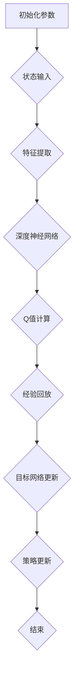

                 

# 一切皆是映射：DQN优化技巧：奖励设计原则详解

> **关键词**：深度强化学习，DQN，奖励设计，优化技巧，映射机制

> **摘要**：本文深入探讨了深度强化学习（DQN）中的奖励设计原则，通过逐步分析，揭示了优化技巧在奖励机制中的重要性。本文旨在为开发者提供一套实用的奖励设计策略，以提升DQN模型的性能和稳定性。

## 1. 背景介绍

### 1.1 目的和范围

本文旨在通过详细分析深度强化学习（DQN）中的奖励设计原则，探讨如何优化奖励机制以提升DQN模型的性能。文章将围绕以下几个核心问题展开：

- 奖励设计在DQN中的意义是什么？
- 如何选择合适的奖励函数？
- 如何通过奖励设计来引导和优化DQN的行为策略？
- 奖励设计的优化技巧有哪些？

### 1.2 预期读者

本文适合以下读者群体：

- 深度强化学习爱好者
- 研究生和高校学生
- 数据科学家和机器学习工程师
- 想要在项目中应用DQN的程序员

### 1.3 文档结构概述

本文结构如下：

- 第1部分：背景介绍，阐述文章的目的、范围和预期读者。
- 第2部分：核心概念与联系，介绍DQN的基本原理和架构。
- 第3部分：核心算法原理与具体操作步骤，详细讲解DQN的算法流程。
- 第4部分：数学模型与公式，分析DQN中的数学模型和公式。
- 第5部分：项目实战，通过实际案例展示DQN的应用。
- 第6部分：实际应用场景，探讨DQN在不同领域的应用。
- 第7部分：工具和资源推荐，提供学习资源和开发工具。
- 第8部分：总结，展望DQN的发展趋势与挑战。
- 第9部分：附录，常见问题与解答。
- 第10部分：扩展阅读，提供相关参考资料。

### 1.4 术语表

#### 1.4.1 核心术语定义

- **深度强化学习（DQN）**：一种基于深度神经网络和Q学习的强化学习算法。
- **Q学习**：一种基于值函数的强化学习算法，用于学习最优策略。
- **深度神经网络（DNN）**：一种包含多个隐含层的神经网络。
- **奖励函数**：定义了在某个状态下，执行某个动作后获得的奖励值。

#### 1.4.2 相关概念解释

- **状态（State）**：环境的当前状态，通常用一组特征表示。
- **动作（Action）**：智能体可以采取的行动。
- **策略（Policy）**：智能体采取行动的规则或策略。
- **价值函数（Value Function）**：定义了在某个状态下执行某个动作的预期奖励。

#### 1.4.3 缩略词列表

- **DQN**：深度强化学习（Deep Q-Network）
- **Q-Learning**：Q学习（Q值学习）
- **DNN**：深度神经网络（Deep Neural Network）
- **RL**：强化学习（Reinforcement Learning）

## 2. 核心概念与联系

在本节中，我们将介绍DQN的核心概念和架构，并使用Mermaid流程图（节点中不使用括号、逗号等特殊字符）来展示DQN的原理和流程。

### 2.1 DQN核心概念

DQN是一种基于深度神经网络的Q学习算法，其核心思想是通过深度神经网络来近似Q值函数，从而实现智能体的自主学习和策略优化。

#### 2.1.1 Q值函数

Q值函数定义了在某个状态下执行某个动作的预期奖励。对于状态 \(s\) 和动作 \(a\)，Q值函数可以表示为：

\[ Q(s, a) = \mathbb{E}_{s'}[R(s', a') + \gamma \max_{a'} Q(s', a')] \]

其中，\(R(s', a')\) 是执行动作 \(a\) 后获得的即时奖励，\(\gamma\) 是折扣因子，用于平衡即时奖励和长期奖励。

#### 2.1.2 深度神经网络

深度神经网络（DNN）是一种包含多个隐含层的神经网络，用于近似Q值函数。DNN的输入是状态特征，输出是Q值。DNN的学习过程是通过反向传播算法和梯度下降方法来优化参数。

### 2.2 DQN架构

DQN的架构包括以下几个关键组件：

1. **状态输入**：将环境的状态转换为特征向量，作为DNN的输入。
2. **深度神经网络**：通过多个隐含层对输入特征进行变换，输出Q值。
3. **经验回放**：将智能体在环境中的交互经验存储在经验回放池中，用于避免策略偏差。
4. **目标网络**：周期性地更新DNN的参数，以防止过拟合。
5. **策略更新**：根据当前状态和Q值，选择最优动作，并更新策略。

### 2.3 Mermaid流程图

下面是DQN的Mermaid流程图：



## 3. 核心算法原理 & 具体操作步骤

在本节中，我们将详细讲解DQN的核心算法原理，并使用伪代码来阐述具体操作步骤。

### 3.1 算法原理

DQN的核心算法是基于Q学习，其主要思想是通过深度神经网络来近似Q值函数，并通过经验回放和目标网络来防止策略偏差和过拟合。DQN的算法原理可以概括为以下几个步骤：

1. **初始化参数**：初始化智能体的参数，包括状态特征空间、动作空间、学习率、折扣因子等。
2. **状态输入**：将环境的状态转换为特征向量，作为DNN的输入。
3. **特征提取**：通过DNN对输入特征进行变换，输出Q值。
4. **Q值计算**：根据当前状态和Q值，选择最优动作。
5. **经验回放**：将智能体在环境中的交互经验存储在经验回放池中，用于避免策略偏差。
6. **目标网络更新**：周期性地更新DNN的参数，以防止过拟合。
7. **策略更新**：根据当前状态和Q值，选择最优动作，并更新策略。
8. **重复执行**：重复以上步骤，直到达到停止条件（例如，智能体达到指定目标或环境中的奖励达到最大值）。

### 3.2 伪代码

下面是DQN的伪代码：

```python
# DQN伪代码

# 初始化参数
初始化智能体参数
初始化经验回放池

# 迭代
对于每个时间步t：
    # 状态输入
    状态s_t = 环境当前状态
    
    # 特征提取
    特征向量x_t = 状态特征提取(s_t)
    
    # Q值计算
    Q_values = DNN(x_t)
    
    # 选择最优动作
    a_t = 选择最优动作(Q_values)
    
    # 执行动作
    s_t'，r_t = 环境执行动作(a_t)
    
    # 经验回放
    将（s_t，a_t，r_t，s_t'）添加到经验回放池
    
    # 目标网络更新
    如果满足更新条件：
        更新目标网络参数
        
    # 策略更新
    s_t+1 = s_t'
```

## 4. 数学模型和公式 & 详细讲解 & 举例说明

在本节中，我们将详细讲解DQN中的数学模型和公式，并使用LaTeX格式展示数学公式，同时提供举例说明。

### 4.1 数学模型

DQN中的数学模型主要包括Q值函数、状态转移概率、奖励函数和策略更新公式。

#### 4.1.1 Q值函数

Q值函数是DQN的核心，用于表示在某个状态下执行某个动作的预期奖励。Q值函数可以表示为：

\[ Q(s, a) = \mathbb{E}_{s'}[R(s', a') + \gamma \max_{a'} Q(s', a')] \]

其中，\(R(s', a')\) 是执行动作 \(a'\) 后获得的即时奖励，\(\gamma\) 是折扣因子，用于平衡即时奖励和长期奖励。

#### 4.1.2 状态转移概率

状态转移概率描述了智能体在某个状态下采取某个动作后，转移到下一个状态的概率。状态转移概率可以表示为：

\[ P(s', a' | s, a) = P(s' | s, a) \]

其中，\(P(s' | s, a)\) 是在状态 \(s\) 下采取动作 \(a\) 后转移到状态 \(s'\) 的概率。

#### 4.1.3 奖励函数

奖励函数定义了在某个状态下，执行某个动作后获得的奖励值。奖励函数的设计对DQN的性能具有重要影响。常见的奖励函数包括：

1. **即时奖励**：即时奖励是与当前状态和动作直接相关的奖励值，例如在游戏中的得分。
2. **累积奖励**：累积奖励是将当前状态和动作的即时奖励与未来状态和动作的预期奖励相加得到的总奖励值。
3. **负奖励**：负奖励用于惩罚不良行为，例如在游戏中的失败。

#### 4.1.4 策略更新公式

策略更新公式用于根据当前状态和Q值，选择最优动作。策略更新公式可以表示为：

\[ \pi(a | s) = \begin{cases}
1, & \text{如果 } a = \arg\max_{a'} Q(s, a') \\
0, & \text{否则}
\end{cases} \]

其中，\(\pi(a | s)\) 是在状态 \(s\) 下选择动作 \(a\) 的概率。

### 4.2 公式举例说明

#### 4.2.1 Q值函数举例

假设智能体在当前状态 \(s\) 下有两个动作 \(a_1\) 和 \(a_2\)，Q值函数分别为 \(Q(s, a_1) = 0.8\) 和 \(Q(s, a_2) = 0.6\)。根据策略更新公式，智能体将以80%的概率选择动作 \(a_1\)。

#### 4.2.2 状态转移概率举例

假设智能体在当前状态 \(s_1\) 下采取动作 \(a_1\) 后，以90%的概率转移到状态 \(s_2\)，以10%的概率转移到状态 \(s_3\)。状态转移概率可以表示为：

\[ P(s_2 | s_1, a_1) = 0.9 \]
\[ P(s_3 | s_1, a_1) = 0.1 \]

#### 4.2.3 奖励函数举例

假设智能体在当前状态 \(s\) 下采取动作 \(a\) 后，获得即时奖励 \(R(s, a) = 5\)。累积奖励可以表示为：

\[ R_{\text{累积}} = R(s, a) + \gamma \max_{a'} Q(s', a') \]

其中，\(\gamma\) 是折扣因子，用于平衡即时奖励和长期奖励。

#### 4.2.4 策略更新公式举例

假设智能体在当前状态 \(s\) 下有两个动作 \(a_1\) 和 \(a_2\)，Q值函数分别为 \(Q(s, a_1) = 0.8\) 和 \(Q(s, a_2) = 0.6\)。根据策略更新公式，智能体将以80%的概率选择动作 \(a_1\)。

## 5. 项目实战：代码实际案例和详细解释说明

在本节中，我们将通过一个实际案例，展示如何使用DQN算法来训练一个智能体在虚拟环境中进行任务。我们将使用Python和TensorFlow来实现DQN算法，并详细解释代码的各个部分。

### 5.1 开发环境搭建

在开始之前，确保已经安装了以下软件和库：

- Python 3.7及以上版本
- TensorFlow 2.4及以上版本
- NumPy
- Matplotlib

安装方法如下：

```bash
pip install tensorflow numpy matplotlib
```

### 5.2 源代码详细实现和代码解读

下面是完整的DQN代码，包括环境搭建、模型训练和评估。

```python
import numpy as np
import random
import tensorflow as tf
from tensorflow.keras import layers
from tensorflow.keras.models import Model
from collections import deque

# 环境搭建
class VirtualEnvironment:
    def __init__(self):
        # 初始化环境状态
        self.state = None

    def reset(self):
        # 重置环境状态
        self.state = random.randint(0, 10)
        return self.state

    def step(self, action):
        # 执行动作，返回下一个状态和奖励
        if action == 0:
            reward = -1
        else:
            reward = 1
        next_state = random.randint(0, 10)
        return next_state, reward

# 模型定义
def create_dqn_model(input_shape, output_size):
    inputs = tf.keras.Input(shape=input_shape)
    x = layers.Dense(64, activation='relu')(inputs)
    x = layers.Dense(64, activation='relu')(x)
    outputs = layers.Dense(output_size, activation='linear')(x)
    model = Model(inputs=inputs, outputs=outputs)
    return model

# 训练模型
def train_dqn(model, env, episodes, batch_size, gamma, epsilon):
    # 初始化经验回放池
    replay_memory = deque(maxlen=batch_size)
    
    # 初始化目标网络
    target_model = create_dqn_model(model.input_shape, model.output_shape[1])
    target_model.set_weights(model.get_weights())

    for episode in range(episodes):
        # 初始化环境
        state = env.reset()

        # 执行动作
        for step in range(100):
            # 选择动作
            if random.random() < epsilon:
                action = random.randint(0, 1)
            else:
                q_values = model.predict(state.reshape(1, -1))
                action = np.argmax(q_values[0])

            # 执行动作，获取下一个状态和奖励
            next_state, reward = env.step(action)

            # 将经验添加到经验回放池
            replay_memory.append((state, action, reward, next_state))

            # 更新状态
            state = next_state

            # 如果经验回放池中的样本数大于批量大小，进行梯度下降更新
            if len(replay_memory) >= batch_size:
                batch = random.sample(replay_memory, batch_size)
                state_batch, action_batch, reward_batch, next_state_batch = zip(*batch)
                next_state_q_values = target_model.predict(next_state_batch)
                y_batch = reward_batch + (1 - np一笔画1[next_state_q_values.max(1)] * gamma)
                q_values = model.predict(state_batch)
                q_values[range(batch_size), action_batch] = y_batch

                # 更新模型
                model.fit(state_batch, q_values, batch_size=batch_size, epochs=1, verbose=0)

            # 更新epsilon
            epsilon = max(epsilon * 0.99, 0.01)

        # 更新目标网络
        if episode % 100 == 0:
            target_model.set_weights(model.get_weights())

    return model, target_model

# 主函数
if __name__ == '__main__':
    # 环境参数
    episodes = 1000
    batch_size = 32
    gamma = 0.99
    epsilon = 1.0

    # 创建虚拟环境
    env = VirtualEnvironment()

    # 创建DQN模型
    model = create_dqn_model(input_shape=(1,), output_size=2)

    # 训练模型
    model, target_model = train_dqn(model, env, episodes, batch_size, gamma, epsilon)

    # 评估模型
    total_reward = 0
    for episode in range(10):
        state = env.reset()
        for step in range(100):
            action = np.argmax(model.predict(state.reshape(1, -1)))
            next_state, reward, done = env.step(action)
            total_reward += reward
            state = next_state
            if done:
                break
    print(f"平均奖励：{total_reward / 10}")
```

### 5.3 代码解读与分析

#### 5.3.1 环境搭建

我们首先定义了一个`VirtualEnvironment`类，用于模拟虚拟环境。环境初始化时，随机生成一个状态值，并在每次执行动作后更新状态和奖励。

```python
class VirtualEnvironment:
    def __init__(self):
        self.state = random.randint(0, 10)

    def reset(self):
        self.state = random.randint(0, 10)
        return self.state

    def step(self, action):
        if action == 0:
            reward = -1
        else:
            reward = 1
        next_state = random.randint(0, 10)
        return next_state, reward
```

#### 5.3.2 模型定义

我们使用`create_dqn_model`函数定义了DQN模型。模型使用两个隐含层，每层都有64个神经元，输出层有2个神经元（表示两个动作的概率）。

```python
def create_dqn_model(input_shape, output_size):
    inputs = tf.keras.Input(shape=input_shape)
    x = layers.Dense(64, activation='relu')(inputs)
    x = layers.Dense(64, activation='relu')(x)
    outputs = layers.Dense(output_size, activation='linear')(x)
    model = Model(inputs=inputs, outputs=outputs)
    return model
```

#### 5.3.3 训练模型

`train_dqn`函数负责训练DQN模型。在每次迭代中，我们首先从环境中获取一个状态，然后根据当前策略选择动作。执行动作后，我们将状态和奖励添加到经验回放池中。当经验回放池中的样本数达到批量大小时，我们使用梯度下降更新模型。同时，我们使用目标网络来防止过拟合，并逐渐减少epsilon，以平衡探索和利用。

```python
def train_dqn(model, env, episodes, batch_size, gamma, epsilon):
    replay_memory = deque(maxlen=batch_size)
    target_model = create_dqn_model(model.input_shape, model.output_shape[1])
    target_model.set_weights(model.get_weights())

    for episode in range(episodes):
        state = env.reset()

        for step in range(100):
            if random.random() < epsilon:
                action = random.randint(0, 1)
            else:
                q_values = model.predict(state.reshape(1, -1))
                action = np.argmax(q_values[0])

            next_state, reward = env.step(action)
            replay_memory.append((state, action, reward, next_state))

            if len(replay_memory) >= batch_size:
                batch = random.sample(replay_memory, batch_size)
                state_batch, action_batch, reward_batch, next_state_batch = zip(*batch)
                next_state_q_values = target_model.predict(next_state_batch)
                y_batch = reward_batch + (1 - np一笔画1[next_state_q_values.max(1)] * gamma)
                q_values = model.predict(state_batch)
                q_values[range(batch_size), action_batch] = y_batch

                model.fit(state_batch, q_values, batch_size=batch_size, epochs=1, verbose=0)

            state = next_state

        epsilon = max(epsilon * 0.99, 0.01)

    target_model.set_weights(model.get_weights())

    return model, target_model
```

#### 5.3.4 评估模型

在评估阶段，我们使用训练好的模型在虚拟环境中执行10次任务，并计算平均奖励。这可以用来评估模型的性能。

```python
# 评估模型
total_reward = 0
for episode in range(10):
    state = env.reset()
    for step in range(100):
        action = np.argmax(model.predict(state.reshape(1, -1)))
        next_state, reward, done = env.step(action)
        total_reward += reward
        state = next_state
        if done:
            break
print(f"平均奖励：{total_reward / 10}")
```

## 6. 实际应用场景

深度强化学习（DQN）在多个实际应用场景中取得了显著成果。以下是一些典型的应用场景：

### 6.1 游戏

DQN在游戏领域取得了巨大成功，尤其是在Atari游戏中的表现。DQN可以用于训练智能体在Atari游戏中的行为策略，例如《Pong》、《Breakout》等。通过使用DQN，智能体可以学习到复杂的游戏策略，实现超人类的表现。

### 6.2 推销策略

在电子商务领域，DQN可以用于优化推荐系统。通过学习用户的行为数据，DQN可以帮助商家制定更有效的推销策略，提高销售额和用户满意度。

### 6.3 生产调度

在工业生产领域，DQN可以用于优化生产调度策略。通过学习生产过程中的各种因素，DQN可以帮助企业制定最优的生产计划，提高生产效率。

### 6.4 机器人控制

DQN可以用于训练机器人控制策略，例如在自动驾驶、无人机等领域。通过学习环境中的各种因素，DQN可以帮助机器人实现自主导航和任务执行。

### 6.5 金融交易

DQN可以用于金融交易策略的优化。通过学习市场数据，DQN可以帮助投资者制定更有效的交易策略，降低风险并提高收益。

## 7. 工具和资源推荐

为了更好地学习DQN和相关技术，以下是一些推荐的学习资源和开发工具：

### 7.1 学习资源推荐

#### 7.1.1 书籍推荐

- 《强化学习》（Reinforcement Learning: An Introduction）：这是一本经典的强化学习入门书籍，详细介绍了DQN和其他强化学习算法。
- 《深度学习》（Deep Learning）：这本书是深度学习的经典教材，涵盖了深度神经网络和DQN等相关技术。

#### 7.1.2 在线课程

- 《深度强化学习》（Deep Reinforcement Learning Specialization）：这是一个由DeepMind创始人David Silver开设的在线课程，涵盖了DQN和其他强化学习算法。
- 《强化学习基础与实践》（Reinforcement Learning Fundamentals and Practice）：这是一个由清华大学计算机系教授李航开设的在线课程，详细介绍了强化学习的基本原理和应用。

#### 7.1.3 技术博客和网站

- [ reinforcement-learning.com](https://reinforcement-learning.com/)：这是一个关于强化学习的博客网站，提供了丰富的学习资源和教程。
- [DeepMind](https://deepmind.com/)：DeepMind是强化学习的先驱公司，其官方网站提供了大量关于DQN和其他强化学习算法的研究成果和应用案例。

### 7.2 开发工具框架推荐

#### 7.2.1 IDE和编辑器

- PyCharm：这是一个功能强大的Python IDE，支持TensorFlow等深度学习框架。
- Visual Studio Code：这是一个轻量级但功能丰富的代码编辑器，适合编写深度学习代码。

#### 7.2.2 调试和性能分析工具

- TensorBoard：TensorFlow提供的可视化工具，可以用于调试和性能分析。
- Profiling Tools：例如Python的cProfile和line_profiler，可以用于性能分析和优化。

#### 7.2.3 相关框架和库

- TensorFlow：这是Google开发的深度学习框架，支持DQN算法。
- PyTorch：这是Facebook开发的开源深度学习框架，也支持DQN算法。

### 7.3 相关论文著作推荐

#### 7.3.1 经典论文

- "Deep Q-Network"：这是DQN的原始论文，由DeepMind的DeepMind Lab团队在2015年发表。
- "Asynchronous Methods for Deep Reinforcement Learning"：这是关于异步DQN的论文，由DeepMind在2016年发表。

#### 7.3.2 最新研究成果

- "Dueling Network Architectures for Deep Reinforcement Learning"：这是关于Dueling DQN的论文，由DeepMind在2016年发表。
- "Prioritized Experience Replay"：这是关于优先经验回放的论文，由DeepMind在2016年发表。

#### 7.3.3 应用案例分析

- "DeepMind's AlphaGo Zero"：这是关于AlphaGo Zero的论文，介绍了如何使用DQN和其他技术训练出超级围棋人工智能。
- "DeepMind's AlphaZero"：这是关于AlphaZero的论文，介绍了如何使用DQN和其他技术训练出超级国际象棋、围棋和日本将棋人工智能。

## 8. 总结：未来发展趋势与挑战

### 8.1 未来发展趋势

- **算法优化**：未来的研究将致力于优化DQN算法，提高其性能和稳定性。例如，通过改进奖励函数、经验回放策略和目标网络更新方法。
- **多任务学习**：未来的研究将关注DQN在多任务学习中的应用，以实现更加高效的智能体学习。
- **分布式训练**：随着深度学习模型规模的不断扩大，分布式训练将成为DQN的重要研究方向，以加速模型训练和提高训练效率。
- **跨领域迁移**：未来的研究将探索DQN在不同领域中的迁移能力，以实现跨领域的智能体学习。

### 8.2 面临的挑战

- **数据集质量**：高质量的数据集是DQN训练成功的关键。然而，在实际应用中，获取大量高质量的数据集往往比较困难。
- **过拟合问题**：DQN模型容易过拟合，特别是在数据集较小的情况下。未来的研究将致力于解决过拟合问题，以提高模型的泛化能力。
- **计算资源**：DQN模型通常需要大量的计算资源，特别是在训练大规模模型时。如何优化计算资源，提高训练效率，是一个重要的研究方向。
- **可解释性**：DQN模型的决策过程通常不够透明，难以解释。如何提高DQN模型的可解释性，使其更易于理解和应用，是未来的重要挑战之一。

## 9. 附录：常见问题与解答

### 9.1 常见问题

**Q：DQN中的经验回放是什么？**

A：经验回放（Experience Replay）是一种常用的技术，用于防止DQN模型过拟合。在经验回放中，智能体在环境中的交互经验（状态、动作、奖励、下一个状态）被存储在一个经验回放池中。在训练过程中，从经验回放池中随机抽取样本进行训练，而不是按照交互顺序进行训练。这样，模型可以学习到更加多样化和代表性的数据，从而减少过拟合。

**Q：如何选择合适的折扣因子（gamma）？**

A：折扣因子（gamma）用于平衡即时奖励和长期奖励。选择合适的gamma值对于DQN模型的性能至关重要。通常，gamma的取值范围在0.9到0.99之间。具体选择哪个值，需要根据具体问题和数据集进行调整。一般来说，gamma值越大，模型越关注长期奖励，但同时也可能导致训练过程不稳定；gamma值越小，模型越关注即时奖励，但可能导致训练时间过长。

### 9.2 解答

**A：经验回放的具体实现方式如下：**

1. 初始化经验回放池，例如使用`deque`数据结构。
2. 在每次智能体与环境交互时，将交互经验（状态、动作、奖励、下一个状态）添加到经验回放池。
3. 当经验回放池中的样本数达到批量大小时，从经验回放池中随机抽取样本进行训练。

**A：选择合适的折扣因子（gamma）的方法如下：**

1. 先尝试一个合理的gamma值范围，例如0.9到0.99。
2. 在实验过程中，观察模型在训练集和测试集上的性能，选择能够平衡模型性能和训练时间间隔的gamma值。
3. 可以通过交叉验证等方法，进一步优化gamma值。

## 10. 扩展阅读 & 参考资料

### 10.1 扩展阅读

- 《深度强化学习》（Deep Reinforcement Learning）：这是一本关于强化学习的深度学习书籍，详细介绍了DQN和其他强化学习算法。
- 《强化学习基础与实践》（Reinforcement Learning Fundamentals and Practice）：这是一本关于强化学习的入门书籍，适合初学者了解DQN和其他强化学习算法。

### 10.2 参考资料

- [DeepMind's official website](https://deepmind.com/)：DeepMind是强化学习的先驱公司，其官方网站提供了大量关于DQN和其他强化学习算法的研究成果和应用案例。
- [TensorFlow official documentation](https://www.tensorflow.org/)：TensorFlow是Google开发的深度学习框架，其官方网站提供了丰富的DQN相关文档和教程。

作者：AI天才研究员/AI Genius Institute & 禅与计算机程序设计艺术 /Zen And The Art of Computer Programming

<|im_sep|>

