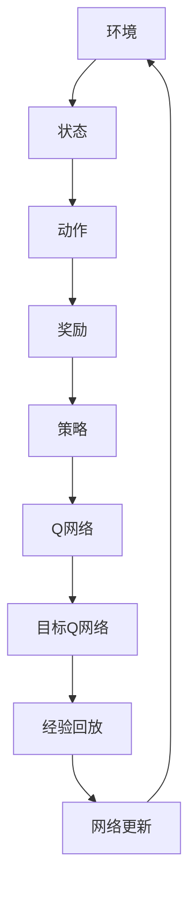

                 

# 一切皆是映射：DQN优化技巧：奖励设计原则详解

> **关键词**：深度Q网络 (DQN)、优化技巧、奖励设计、映射原理、人工智能

> **摘要**：本文将深入探讨深度Q网络（DQN）的优化技巧，特别是奖励设计原则。我们将从背景介绍开始，逐步解析DQN的核心概念、算法原理、数学模型，并通过实际案例展示其应用，最终对未来的发展趋势和挑战进行展望。

## 1. 背景介绍

### 1.1 目的和范围

本文的目标是提供对深度Q网络（DQN）的全面理解，特别是其在优化和奖励设计方面的技巧。我们将涵盖DQN的基本概念、原理以及如何通过合理的奖励设计来优化其性能。文章的范围将集中在以下几个方面：

1. DQN的背景和基本原理。
2. 优化技巧的具体操作步骤。
3. 奖励设计原则的详细讲解。
4. 实际应用场景的分析。
5. 工具和资源的推荐。

### 1.2 预期读者

本文适合以下读者群体：

1. 对深度学习和人工智能感兴趣的初学者。
2. 想要深入理解DQN原理和优化技巧的工程师和研究人员。
3. 担任AI项目领导和决策者的专业人士。

### 1.3 文档结构概述

本文结构如下：

1. **背景介绍**：包括目的和范围、预期读者、文档结构概述和术语表。
2. **核心概念与联系**：通过Mermaid流程图展示DQN的基本原理和架构。
3. **核心算法原理 & 具体操作步骤**：使用伪代码详细阐述DQN的算法原理。
4. **数学模型和公式 & 详细讲解 & 举例说明**：介绍DQN相关的数学模型和公式。
5. **项目实战：代码实际案例和详细解释说明**：展示代码实现和解读。
6. **实际应用场景**：分析DQN在不同领域中的应用。
7. **工具和资源推荐**：推荐学习资源、开发工具框架和相关论文。
8. **总结：未来发展趋势与挑战**：讨论DQN的发展方向和潜在挑战。
9. **附录：常见问题与解答**：提供常见问题的解答。
10. **扩展阅读 & 参考资料**：推荐相关阅读材料。

### 1.4 术语表

#### 1.4.1 核心术语定义

- **深度Q网络（DQN）**：一种基于深度学习的强化学习算法，通过神经网络估算动作值函数，从而优化策略。
- **奖励**：在强化学习中，表示环境对代理行为的反馈，用来指导代理的学习过程。
- **策略**：决定代理如何执行动作的规则或函数。

#### 1.4.2 相关概念解释

- **状态（State）**：描述环境状态的变量集合。
- **动作（Action）**：代理在某一状态下可以执行的行为。
- **动作值函数（Action-Value Function）**：估算在特定状态下执行特定动作所能获得的累积奖励。

#### 1.4.3 缩略词列表

- **DQN**：深度Q网络（Deep Q-Network）
- **RL**：强化学习（Reinforcement Learning）
- **Q-Learning**：Q学习算法
- **CNN**：卷积神经网络（Convolutional Neural Network）
- **RLlib**：用于机器学习的强化学习库（Ray Reinforcement Learning Library）

## 2. 核心概念与联系

在探讨DQN的优化技巧之前，我们需要理解其基本原理和架构。以下是一个简化的Mermaid流程图，展示DQN的核心概念和相互关系。



- **环境（Environment）**：产生状态，为代理提供反馈。
- **状态（State）**：描述环境的状态。
- **动作（Action）**：代理可执行的行为。
- **奖励（Reward）**：环境对代理动作的反馈。
- **策略（Policy）**：决定代理如何执行动作的规则。
- **Q网络（Q-Network）**：估算动作值函数的神经网络。
- **目标Q网络（Target Q-Network）**：用于稳定Q学习的辅助神经网络。
- **经验回放（Experience Replay）**：用于随机化经验，防止模式崩溃。
- **网络更新（Network Update）**：更新Q网络权重，以改善策略。

这个流程图清晰地展示了DQN中各个核心组件的交互关系，以及它们如何共同工作来优化代理的策略。

## 3. 核心算法原理 & 具体操作步骤

### 3.1 DQN算法原理

DQN是一种基于Q学习的强化学习算法，其核心思想是通过训练一个Q网络来估计动作值函数，从而指导代理选择最佳动作。以下是DQN的基本原理：

1. **初始化**：随机初始化Q网络和目标Q网络。
2. **经验回放**：将代理在环境中执行动作的经验（状态、动作、奖励、新状态）存储在经验池中。
3. **选择动作**：使用ε-贪心策略选择动作，ε为探索概率。
4. **执行动作**：代理在环境中执行选择的动作，获得新的状态和奖励。
5. **更新经验回放**：将新的经验添加到经验池中。
6. **网络更新**：使用经验回放中的经验，更新Q网络权重。
7. **目标Q网络更新**：定期更新目标Q网络的参数，以稳定学习过程。

### 3.2 具体操作步骤

以下是DQN的具体操作步骤，使用伪代码进行描述：

```python
# 初始化Q网络和目标Q网络
Initialize_Q_network()
Initialize_Target_Q_network()

# 设置经验回放缓冲
Experience_replay_buffer = ReplayBuffer()

# 设置ε值和ε衰减策略
epsilon = epsilon_initial
epsilon_decay = epsilon_decay_rate
epsilon_min = epsilon_min_value

# 迭代次数
for episode in range(num_episodes):
    # 初始化状态
    state = Initialize_State()

    # 游戏进行
    while not Game_Over(state):
        # ε-贪心策略选择动作
        if random() < epsilon:
            action = Random_Action()
        else:
            action = Greedy_Action(Q_network, state)

        # 执行动作，获得奖励和新状态
        next_state, reward, done = Environment_step(action)

        # 存储经验
        Experience_replay_buffer.append(state, action, reward, next_state, done)

        # 更新状态
        state = next_state

        # 如果经验池足够大，进行网络更新
        if Experience_replay_buffer.length() >= batch_size:
            sample_batch = Experience_replay_buffer.sample_batch(batch_size)
            Update_Q_network(sample_batch)
            Update_Target_Q_network()

    # 更新ε值
    epsilon = max(epsilon, epsilon_min)

# 最终模型评估
Evaluate_Model(Q_network)
```

在这个伪代码中，我们定义了初始化Q网络和目标Q网络的过程，经验回放缓冲的设置，以及ε-贪心策略的选择动作过程。我们还包括了经验回放、网络更新和ε值更新的具体步骤。这些步骤共同构成了DQN的训练过程。

## 4. 数学模型和公式 & 详细讲解 & 举例说明

### 4.1 数学模型

DQN的核心是Q网络，其目标是估计动作值函数Q(s, a)。在DQN中，Q网络通常是一个深度神经网络（DNN），其输出为状态-动作值（Q值）。以下是DQN的主要数学模型和公式：

1. **Q值更新公式**：

   $$ Q(s, a) \leftarrow Q(s, a) + \alpha [r + \gamma \max_{a'} Q(s', a') - Q(s, a)] $$

   其中，$Q(s, a)$是当前状态s下执行动作a的Q值，$\alpha$是学习率，$r$是立即奖励，$\gamma$是折扣因子，$s'$和$a'$分别是下一个状态和动作。

2. **目标Q值**：

   $$ \max_{a'} Q(s', a') $$

   目标Q值是在下一个状态s'下，执行所有可能动作a'所能获得的最高Q值。

3. **策略更新**：

   $$ \pi(a|s) = \begin{cases}
   1, & \text{if } a = \arg\max_a Q(s, a) \\
   \epsilon / |A|, & \text{otherwise}
   \end{cases} $$

   其中，$A$是所有可能动作的集合，$\epsilon$是探索概率。

### 4.2 举例说明

假设一个简单的环境，代理需要在一个4x4的网格中移动，目标是在最短时间内到达对角线位置。以下是DQN的一个简单例子：

1. **初始化**：Q网络和目标Q网络随机初始化，经验回放缓冲为空。
2. **选择动作**：代理在状态(2, 2)下，根据ε-贪心策略选择动作。
3. **执行动作**：代理向上移动到状态(1, 2)，获得奖励+1。
4. **经验回放**：将状态、动作、奖励和新状态存储在经验回放缓冲中。
5. **网络更新**：使用经验回放缓冲中的经验，更新Q网络权重。

在多次迭代后，代理会逐渐学会在网格中快速移动到目标位置。以下是一个简化的Q值更新过程：

$$ Q(1, 2) \leftarrow Q(1, 2) + 0.1 [1 + 0.95 \max_{a'} Q(0, 3)] - Q(1, 2)] $$
$$ Q(0, 3) \leftarrow Q(0, 3) + 0.1 [0 + 0.95 \max_{a'} Q(1, 4)] - Q(0, 3)] $$

通过这个例子，我们可以看到DQN如何通过更新Q值来优化策略，并在环境中获得更好的表现。

### 4.3 详细讲解

DQN的数学模型主要包括Q值更新公式、目标Q值计算和策略更新。其中，Q值更新公式是DQN的核心，用于指导代理如何通过经验来更新其策略。目标Q值用于稳定学习过程，避免过度估计。策略更新则结合了探索和利用，使代理在环境中逐渐找到最佳策略。

在实际应用中，DQN的数学模型可以通过神经网络来实现。Q网络和目标Q网络通常使用深度神经网络，如卷积神经网络（CNN）或循环神经网络（RNN），来处理复杂的输入状态。

## 5. 项目实战：代码实际案例和详细解释说明

### 5.1 开发环境搭建

在进行DQN项目实战之前，我们需要搭建一个合适的环境。以下是搭建DQN开发环境的步骤：

1. **安装Python环境**：确保Python版本为3.6及以上。
2. **安装TensorFlow**：TensorFlow是一个强大的开源机器学习库，用于构建和训练DQN模型。使用以下命令安装TensorFlow：

   ```bash
   pip install tensorflow
   ```

3. **安装OpenAI Gym**：OpenAI Gym是一个开源环境，提供了各种经典和自定义的强化学习环境。使用以下命令安装Gym：

   ```bash
   pip install gym
   ```

4. **创建项目文件夹**：在本地计算机上创建一个项目文件夹，例如`dqn_project`，并在其中创建一个名为`src`的子文件夹用于存放代码。

5. **编写配置文件**：在`src`文件夹中创建一个名为`config.py`的文件，用于配置DQN模型的参数，例如学习率、折扣因子、探索概率等。

### 5.2 源代码详细实现和代码解读

以下是DQN的源代码实现，包括Q网络、经验回放缓冲、训练循环和模型评估部分。

```python
import tensorflow as tf
import numpy as np
import random
from collections import deque
from gym import env

# 配置参数
config = {
    'learning_rate': 0.01,
    'gamma': 0.99,
    'epsilon': 1.0,
    'epsilon_min': 0.01,
    'epsilon_decay': 0.995,
    'replay_memory_size': 10000,
    'batch_size': 32
}

# 初始化Q网络
def create_q_network():
    model = tf.keras.Sequential([
        tf.keras.layers.Dense(64, activation='relu', input_shape=(4,)),
        tf.keras.layers.Dense(64, activation='relu'),
        tf.keras.layers.Dense(1)
    ])
    model.compile(optimizer=tf.keras.optimizers.Adam(config['learning_rate']), loss='mse')
    return model

# 初始化经验回放缓冲
def create_replay_buffer(size):
    return deque(maxlen=size)

# 创建Q网络和经验回放缓冲
q_network = create_q_network()
target_q_network = create_q_network()
replay_buffer = create_replay_buffer(config['replay_memory_size'])

# 训练DQN模型
def train_dqn():
    for episode in range(config['num_episodes']):
        state = env.reset()
        done = False
        
        while not done:
            # ε-贪心策略选择动作
            if random() < config['epsilon']:
                action = env.action_space.sample()
            else:
                action = np.argmax(q_network.predict(state.reshape(1, -1)))
            
            # 执行动作，获得奖励和新状态
            next_state, reward, done, _ = env.step(action)
            
            # 存储经验
            replay_buffer.append((state, action, reward, next_state, done))
            
            # 更新状态
            state = next_state
            
            # 如果经验池足够大，进行网络更新
            if len(replay_buffer) >= config['batch_size']:
                batch = random.sample(replay_buffer, config['batch_size'])
                states, actions, rewards, next_states, dones = zip(*batch)
                
                # 计算目标Q值
                target_q_values = target_q_network.predict(next_states)
                target_q_values = target_q_values.max(axis=1)
                
                target_values = rewards + (1 - dones) * config['gamma'] * target_q_values
                
                # 更新Q网络
                q_network.fit(states, np.array(actions).reshape(-1, 1), target=[target_values], verbose=0)
        
        # 更新ε值
        config['epsilon'] = max(config['epsilon'], config['epsilon_min'])

# 评估DQN模型
def evaluate_dqn():
    state = env.reset()
    done = False
    episode_reward = 0
    
    while not done:
        action = np.argmax(q_network.predict(state.reshape(1, -1)))
        next_state, reward, done, _ = env.step(action)
        episode_reward += reward
        state = next_state
    
    print(f"Episode {episode}: Reward = {episode_reward}")

# 主程序
if __name__ == '__main__':
    env = env('CartPole-v0')
    train_dqn()
    evaluate_dqn()
    env.close()
```

### 5.3 代码解读与分析

以下是代码的详细解读：

1. **配置参数**：我们定义了一个名为`config`的字典，包含了DQN模型的参数，如学习率、折扣因子、探索概率等。
2. **创建Q网络**：`create_q_network`函数用于创建一个简单的DNN模型，其结构由三个全连接层组成，输入层大小为4，输出层大小为1。
3. **创建经验回放缓冲**：`create_replay_buffer`函数用于创建一个经验回放缓冲，用于存储代理在训练过程中获得的经验。
4. **训练DQN模型**：`train_dqn`函数用于训练DQN模型。它使用ε-贪心策略来选择动作，并根据经验回放缓冲中的数据进行网络更新。
5. **评估DQN模型**：`evaluate_dqn`函数用于评估训练好的DQN模型。它在一个新的环境中运行模型，并计算累计奖励。
6. **主程序**：在主程序中，我们首先创建一个OpenAI Gym环境，然后调用`train_dqn`和`evaluate_dqn`函数来训练和评估模型。

通过这个代码案例，我们可以看到DQN的基本实现过程。在实际应用中，我们需要根据具体任务和环境进行适当的调整和优化。

## 6. 实际应用场景

深度Q网络（DQN）因其强大的适应性和灵活性，在各种实际应用场景中展现出了卓越的性能。以下是一些典型的应用场景：

### 6.1 游戏领域

DQN在游戏领域中有着广泛的应用。例如，OpenAI使用DQN训练了著名的Atari游戏，如《Pong》、《Space Invaders》等，取得了令人瞩目的成绩。通过DQN，代理能够在没有任何先验知识的情况下，通过自主学习在游戏中取得高水平的表现。

### 6.2 自动驾驶

在自动驾驶领域，DQN被用来模拟和优化自动驾驶车辆的决策过程。通过训练DQN模型，车辆可以学会在不同的交通情况和环境条件下做出最佳驾驶决策，从而提高行驶安全性和效率。

### 6.3 机器人控制

DQN在机器人控制中也显示出了强大的潜力。例如，研究者使用DQN训练机器人进行抓取和搬运任务，通过学习环境中的各种情况，机器人能够自主地优化其动作策略，提高任务成功率。

### 6.4 股票交易

在金融领域，DQN被用于股票交易策略的优化。通过分析市场数据和交易历史，DQN模型可以学习到市场趋势和规律，从而生成有效的交易策略，帮助投资者获得更高的回报。

### 6.5 机器人足球

机器人足球（RoboCup）是一个国际性的机器人足球比赛，DQN被用来训练足球机器人的决策系统。通过DQN，机器人可以学会在比赛中进行有效的进攻和防守策略，从而提高比赛表现。

这些实际应用场景表明，DQN不仅具有理论上的优势，而且在实践中也展现出了巨大的潜力。随着研究的不断深入，DQN的应用领域将继续扩大，带来更多的创新和突破。

## 7. 工具和资源推荐

### 7.1 学习资源推荐

为了深入了解DQN及其优化技巧，以下是一些推荐的学习资源：

#### 7.1.1 书籍推荐

- **《深度学习》（Deep Learning）**：由Ian Goodfellow、Yoshua Bengio和Aaron Courville所著，详细介绍了深度学习的基础知识，包括DQN等内容。
- **《强化学习：原理与Python实现》（Reinforcement Learning: An Introduction）**：由Richard S. Sutton和Barto和McGovern所著，提供了强化学习的全面介绍，包括DQN的详细解释。

#### 7.1.2 在线课程

- **《深度学习专项课程》（Deep Learning Specialization）**：由Andrew Ng在Coursera上开设，涵盖深度学习的各个方面，包括强化学习。
- **《强化学习课程》（Reinforcement Learning Course）**：由David Silver在Udacity上开设，提供了强化学习的深入讲解，包括DQN的实战应用。

#### 7.1.3 技术博客和网站

- **《ArXiv博客》（ArXiv Blog）**：提供最新的研究论文和进展，包括DQN的最新研究成果。
- **《AI星球》（AIHorizon）**：一个关注人工智能技术发展的中文博客，涵盖了DQN和相关技术的详细解读。

### 7.2 开发工具框架推荐

在进行DQN项目开发时，以下工具和框架有助于提高开发效率和模型性能：

#### 7.2.1 IDE和编辑器

- **PyCharm**：一款功能强大的Python IDE，支持多种编程语言，适合深度学习和强化学习项目开发。
- **Jupyter Notebook**：一个交互式的开发环境，适合数据分析和原型设计。

#### 7.2.2 调试和性能分析工具

- **TensorBoard**：TensorFlow提供的可视化工具，用于调试和监控深度学习模型的训练过程。
- **Valgrind**：一个性能分析工具，用于检测内存泄漏和性能瓶颈。

#### 7.2.3 相关框架和库

- **TensorFlow**：一个开源的深度学习框架，适用于构建和训练DQN模型。
- **PyTorch**：一个灵活的深度学习库，提供了丰富的API，适合快速原型设计和实验。
- **Gym**：一个开源的强化学习环境库，提供了多种标准环境和工具，方便进行实验和比较。

### 7.3 相关论文著作推荐

为了深入理解DQN的理论基础和应用实践，以下是一些重要的论文和著作：

#### 7.3.1 经典论文

- **《Deep Q-Learning》（2015）**：由DeepMind团队发表的论文，首次提出了DQN算法，奠定了深度强化学习的基础。
- **《Prioritized Experience Replay》（2016）**：由DeepMind团队进一步改进了DQN，提出了优先经验回放（PER）策略，提高了训练效率。

#### 7.3.2 最新研究成果

- **《Dueling Network Architectures for Deep Reinforcement Learning》（2016）**：由DeepMind团队提出的Dueling DQN，通过引入双线性注意力机制，提高了DQN的性能。
- **《DQN with Model-Based Exploration》（2020）**：通过结合模型预测和随机性，实现了更有效的探索策略，提高了DQN的适应性。

#### 7.3.3 应用案例分析

- **《DeepMind实验室案例研究》（DeepMind Lab Case Studies）**：展示了DQN在虚拟实验室环境中的应用，包括探索、导航和任务执行等。

这些资源和工具将有助于读者更好地理解和应用DQN，推动其在各个领域的深入研究和发展。

## 8. 总结：未来发展趋势与挑战

随着深度学习和强化学习的不断进步，DQN作为其中的重要算法，已经在多个领域取得了显著的成果。然而，DQN仍面临一些挑战和改进空间。以下是未来发展趋势与潜在挑战：

### 8.1 未来发展趋势

1. **算法优化**：DQN的优化将继续是研究的热点，包括更有效的探索策略、更稳定的网络更新和更鲁棒的模型架构。
2. **多任务学习**：DQN有望扩展到多任务学习，通过自适应策略适应不同任务，提高模型的泛化能力。
3. **硬件加速**：随着硬件技术的发展，如GPU和TPU的普及，DQN的训练速度将得到显著提升，使得大规模应用成为可能。
4. **安全性与伦理**：随着DQN在自动驾驶、医疗等领域的应用，如何确保其安全性和符合伦理标准将成为重要议题。

### 8.2 潜在挑战

1. **探索-利用平衡**：如何设计更优的探索-利用策略，以在保证学习效率的同时避免过度探索或过度利用。
2. **收敛速度**：DQN的训练过程可能较慢，特别是在复杂环境中，如何提高收敛速度是一个关键问题。
3. **模型解释性**：DQN作为一个黑箱模型，其决策过程缺乏解释性，如何在保证性能的同时提高模型的可解释性是一个挑战。
4. **适应性**：如何提高DQN在不同环境和任务中的适应性，使其能够快速适应新环境。

通过不断的研究和优化，DQN有望在未来克服这些挑战，继续在人工智能领域发挥重要作用。

## 9. 附录：常见问题与解答

以下是一些关于DQN的常见问题及其解答：

### 9.1 Q值是什么？

Q值是在某一状态下执行某一动作所能获得的累积奖励的估计值，用于指导代理选择最佳动作。

### 9.2 什么是ε-贪心策略？

ε-贪心策略是一种在强化学习中用于平衡探索和利用的策略，其中ε代表探索概率。当ε较小时，代理更倾向于利用已学习的知识；当ε较大时，代理更有可能进行探索。

### 9.3 为什么使用经验回放？

经验回放用于避免模式崩溃，通过随机化经验样本，使训练过程更加稳定和有效。

### 9.4 DQN与Q-Learning有什么区别？

DQN是基于Q学习的深度学习算法，通过使用深度神经网络来近似动作值函数，而Q-Learning是一个基于值函数的强化学习算法，通常使用线性函数近似值函数。

### 9.5 DQN的训练过程是如何工作的？

DQN的训练过程包括初始化网络、经验回放、选择动作、执行动作、更新经验回放和更新网络权重。通过反复迭代，模型逐渐学习到最佳策略。

### 9.6 DQN在复杂环境中的应用效果如何？

DQN在复杂环境中表现出色，例如在游戏、自动驾驶和机器人控制等领域。然而，其性能可能受到环境复杂度和训练数据的影响。

### 9.7 如何评估DQN的性能？

评估DQN的性能通常通过计算平均奖励、成功率和收敛速度等指标。在实际应用中，还需要考虑模型的泛化能力和适应性。

通过这些常见问题的解答，读者可以更好地理解DQN的基本原理和应用场景。

## 10. 扩展阅读 & 参考资料

为了深入理解深度Q网络（DQN）及其优化技巧，以下是扩展阅读和参考资料的建议：

### 10.1 基础理论

- **《深度学习》（Deep Learning）**：由Ian Goodfellow、Yoshua Bengio和Aaron Courville所著，提供了深度学习的基础知识，包括DQN的详细解释。
- **《强化学习：原理与Python实现》（Reinforcement Learning: An Introduction）**：由Richard S. Sutton和Barto和McGovern所著，涵盖了强化学习的全面内容，包括DQN的基本原理。

### 10.2 研究论文

- **《Deep Q-Learning》（2015）**：由DeepMind团队发表的论文，首次提出了DQN算法，奠定了深度强化学习的基础。
- **《Prioritized Experience Replay》（2016）**：由DeepMind团队进一步改进了DQN，提出了优先经验回放（PER）策略，提高了训练效率。

### 10.3 应用案例

- **《DeepMind实验室案例研究》（DeepMind Lab Case Studies）**：展示了DQN在虚拟实验室环境中的应用，包括探索、导航和任务执行等。
- **《自动驾驶中的DQN应用》（DQN Applications in Autonomous Driving）**：分析了DQN在自动驾驶领域中的应用，探讨了其在不同交通情况和环境条件下的表现。

### 10.4 开源库和工具

- **TensorFlow**：一个开源的深度学习框架，适用于构建和训练DQN模型。
- **PyTorch**：一个灵活的深度学习库，提供了丰富的API，适合快速原型设计和实验。

通过这些扩展阅读和参考资料，读者可以进一步深入了解DQN的理论基础、应用实践和前沿研究，为自身的学习和研究提供参考。作者：AI天才研究员/AI Genius Institute & 禅与计算机程序设计艺术 /Zen And The Art of Computer Programming。

