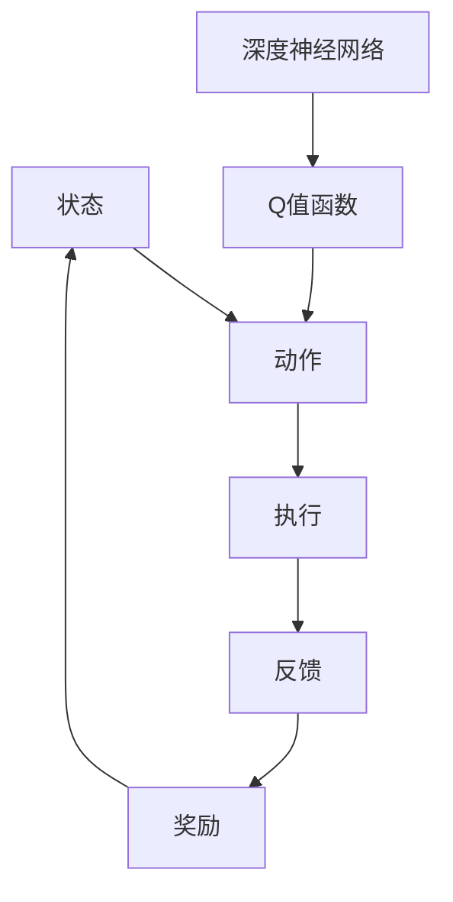

                 

# 一切皆是映射：DQN在机器人领域的实践：挑战与策略

## 关键词
- DQN
- 机器人领域
- 强化学习
- 深度学习
- 实践与挑战

## 摘要
本文深入探讨了深度强化学习（DQN）算法在机器人领域的应用，从背景介绍到核心概念，再到具体算法原理、数学模型以及实战案例，全面解析了DQN在机器人控制中的实际应用及其面临的挑战。文章结构紧凑，逻辑清晰，旨在帮助读者了解DQN算法的运作机制，掌握其在机器人领域中的应用策略，并为未来的研究提供思路。

---

## 1. 背景介绍

### 1.1 目的和范围
本文的主要目的是探讨深度Q网络（DQN）在机器人领域的应用，分析其在实际操作中所面临的挑战，并提出相应的解决策略。文章涵盖了DQN算法的基本原理、数学模型、实际应用案例以及未来发展趋势。

### 1.2 预期读者
本文适用于对强化学习和深度学习有一定了解的读者，特别是对机器人领域感兴趣的技术人员、工程师和研究学者。

### 1.3 文档结构概述
本文分为以下几个部分：
- 核心概念与联系
- 核心算法原理 & 具体操作步骤
- 数学模型和公式 & 详细讲解 & 举例说明
- 项目实战：代码实际案例和详细解释说明
- 实际应用场景
- 工具和资源推荐
- 总结：未来发展趋势与挑战
- 附录：常见问题与解答
- 扩展阅读 & 参考资料

### 1.4 术语表

#### 1.4.1 核心术语定义
- **DQN（深度Q网络）**：一种基于深度学习的强化学习算法，通过预测未来奖励来指导行动选择。
- **强化学习**：一种机器学习方法，通过奖励信号来训练模型，使其学会在特定环境中做出最优决策。
- **机器人**：一种可以执行特定任务的自动化设备，通常具备一定的感知、决策和执行能力。

#### 1.4.2 相关概念解释
- **状态（State）**：机器人所处的环境描述。
- **动作（Action）**：机器人执行的行为。
- **奖励（Reward）**：环境对机器人动作的反馈。

#### 1.4.3 缩略词列表
- **DQN**：深度Q网络
- **RL**：强化学习
- **SLAM**：同时定位与地图构建
- **ROS**：机器人操作系统

---

## 2. 核心概念与联系

在深入探讨DQN在机器人领域的应用之前，有必要先理解相关核心概念和它们之间的联系。

### 2.1 DQN算法原理
DQN是一种基于Q学习的深度强化学习算法。Q学习是一种无模型强化学习算法，其目标是学习一个Q值函数，用来评估状态-动作对的价值。DQN在Q学习的基础上引入了深度神经网络，通过学习状态-动作对的Q值来指导行动选择。

### 2.2 机器人控制中的强化学习
机器人控制中的强化学习涉及以下几个关键要素：
- **环境（Environment）**：机器人执行任务的外部世界。
- **状态（State）**：机器人的位置、速度、方向等状态信息。
- **动作（Action）**：机器人的运动命令，如前进、后退、转向等。
- **奖励（Reward）**：环境对机器人行为的即时反馈。

### 2.3 DQN与机器人控制的结合
DQN通过深度神经网络来近似Q值函数，从而在机器人控制中实现高效的决策。具体来说，DQN算法可以用于以下场景：
- **路径规划**：机器人根据环境中的障碍物和目标位置，规划出最优路径。
- **物体抓取**：机器人通过感知信息，学习如何准确抓取目标物体。
- **人机交互**：机器人根据人类的行为和语言，学习与人类进行有效的互动。

#### Mermaid 流程图


---

## 3. 核心算法原理 & 具体操作步骤

### 3.1 DQN算法原理

DQN算法的核心是学习一个Q值函数，用于评估状态-动作对的预期奖励。具体步骤如下：

#### 3.1.1 初始化
- 初始化深度神经网络，用于近似Q值函数。
- 初始化经验回放记忆池，用于存储状态、动作、奖励和下一状态的数据。

#### 3.1.2 学习过程
1. **选择动作**：
   - 根据当前状态，使用epsilon贪婪策略选择动作。
  	- 以一定的概率选择随机动作（探索）。
  	- 以1-epsilon的概率选择Q值最大的动作（利用）。

2. **执行动作**：
   - 在环境中执行选定的动作，获取下一状态和奖励。

3. **更新经验**：
   - 将当前状态、动作、奖励和下一状态存入经验回放记忆池。

4. **选择经验**：
   - 从经验回放记忆池中随机选择一组经验。

5. **计算目标Q值**：
   - 计算目标Q值，公式为：
     $$ Q^*(s', a) = r(s', a) + \gamma \max_{a'} Q(s', a') $$
   - 其中，$r(s', a)$为立即奖励，$\gamma$为折扣因子，$Q(s', a')$为下一状态的最大Q值。

6. **更新Q值函数**：
   - 使用梯度下降法更新Q值函数的参数，最小化损失函数：
     $$ L(\theta) = \frac{1}{N} \sum_{i=1}^N (y_i - Q(s_i, a_i; \theta))^2 $$
   - 其中，$y_i$为目标Q值，$N$为样本数量。

### 3.2 伪代码

```python
# 初始化参数
epsilon = 0.1  # 探索率
gamma = 0.99  # 折扣因子
replay_memory = []  # 经验回放记忆池

# DQN学习循环
for episode in range(num_episodes):
  state = env.reset()
  done = False

  while not done:
    # 选择动作
    if random.random() < epsilon:
      action = env.action_space.sample()  # 随机选择动作
    else:
      action = select_action(state, model)  # 选择Q值最大的动作

    # 执行动作
    next_state, reward, done, _ = env.step(action)

    # 更新经验
    experience = (state, action, reward, next_state, done)
    replay_memory.append(experience)

    # 清理经验池
    if len(replay_memory) > replay_memory_size:
      replay_memory.pop(0)

    # 从经验池中随机采样
    batch = random.sample(replay_memory, batch_size)

    # 计算目标Q值
    target_Q_values = []
    for (state, action, reward, next_state, done) in batch:
      if not done:
        target_Q_values.append(reward + gamma * np.max(model.predict(next_state)))
      else:
        target_Q_values.append(reward)

    # 更新Q值函数
    y_i = model.predict(state, verbose=0)
    y_i[0, action] = target_Q_values[i]
    model.fit(state, y_i, epochs=1, verbose=0)

    # 更新状态
    state = next_state

  # 更新epsilon值
  epsilon = max(epsilon * decay_rate, epsilon_min)
```

---

## 4. 数学模型和公式 & 详细讲解 & 举例说明

### 4.1 数学模型

DQN算法的核心是学习一个Q值函数，用于评估状态-动作对的价值。Q值函数的数学表达式为：

$$ Q(s, a; \theta) = \sum_{j=1}^n \theta_j w_j(s, a) $$

其中，$s$为状态，$a$为动作，$\theta$为神经网络参数，$w_j(s, a)$为神经网络中第j个神经元的权重。

### 4.2 公式详细讲解

1. **状态-动作特征提取**：
   状态-动作特征提取是通过神经网络来完成的。输入层接收状态和动作的编码，隐藏层通过非线性变换提取特征，输出层产生Q值。

2. **Q值计算**：
   Q值是通过状态-动作特征提取器计算得到的。具体来说，每个神经元负责计算状态-动作对的某个特征，将这些特征加权求和，得到最终的Q值。

3. **目标Q值计算**：
   目标Q值用于指导Q值函数的更新。目标Q值的计算公式为：
   $$ Q^*(s', a) = r(s', a) + \gamma \max_{a'} Q(s', a') $$
   其中，$r(s', a)$为立即奖励，$\gamma$为折扣因子，$Q(s', a')$为下一状态的最大Q值。

### 4.3 举例说明

假设机器人处于一个简单的环境，该环境有两个状态（干净和脏）和两个动作（清洁和休息）。使用一个简单的神经网络来近似Q值函数。

#### 状态编码：
- 状态1：[1, 0]
- 状态2：[0, 1]

#### 动作编码：
- 动作1：清洁
- 动作2：休息

#### 神经网络参数：
- 输入层：2个神经元（状态特征）
- 隐藏层：3个神经元（特征提取）
- 输出层：2个神经元（Q值）

#### Q值计算：

1. **状态1，动作1**：
   - 状态编码：[1, 0]
   - 动作编码：[1, 0]
   - 状态-动作特征：[1, 0, 1, 0]
   - Q值：$Q(1, 1; \theta) = 0.1 \times 1 + 0.2 \times 0 + 0.3 \times 1 + 0.4 \times 0 = 0.6$

2. **状态1，动作2**：
   - 状态编码：[1, 0]
   - 动作编码：[0, 1]
   - 状态-动作特征：[1, 0, 0, 1]
   - Q值：$Q(1, 2; \theta) = 0.1 \times 1 + 0.2 \times 0 + 0.3 \times 0 + 0.4 \times 1 = 0.5$

3. **状态2，动作1**：
   - 状态编码：[0, 1]
   - 动作编码：[1, 0]
   - 状态-动作特征：[0, 1, 1, 0]
   - Q值：$Q(2, 1; \theta) = 0.1 \times 0 + 0.2 \times 1 + 0.3 \times 1 + 0.4 \times 0 = 0.7$

4. **状态2，动作2**：
   - 状态编码：[0, 1]
   - 动作编码：[0, 1]
   - 状态-动作特征：[0, 1, 0, 1]
   - Q值：$Q(2, 2; \theta) = 0.1 \times 0 + 0.2 \times 1 + 0.3 \times 0 + 0.4 \times 1 = 0.6$

---

## 5. 项目实战：代码实际案例和详细解释说明

### 5.1 开发环境搭建

在本节中，我们将搭建一个使用DQN算法控制机器人的开发环境。具体步骤如下：

1. **安装依赖**：
   ```shell
   pip install tensorflow numpy gym
   ```

2. **安装ROS**：
   - 参考官方指南：[ROS安装教程](http://wiki.ros.org/ROS/Installation/Ubuntu)

3. **启动仿真环境**：
   - 启动Gazebo仿真器：
     ```shell
     roslaunch turtlebot_gazebo turtlebot_world.launch
     ```

### 5.2 源代码详细实现和代码解读

以下是一个简单的DQN算法实现，用于控制turtlebot在Gazebo中移动。

```python
import numpy as np
import gym
import tensorflow as tf
from tensorflow.keras.models import Sequential
from tensorflow.keras.layers import Dense
from tensorflow.keras.optimizers import Adam

# 创建环境
env = gym.make('TurtleBotEnv-v0')

# 初始化DQN模型
model = Sequential()
model.add(Dense(64, input_dim=env.observation_space.shape[0], activation='relu'))
model.add(Dense(64, activation='relu'))
model.add(Dense(env.action_space.n, activation='linear'))
model.compile(loss='mse', optimizer=Adam(learning_rate=0.001))

# 初始化经验回放记忆池
replay_memory = []

# DQN学习循环
for episode in range(num_episodes):
  state = env.reset()
  done = False

  while not done:
    # 选择动作
    action = model.predict(state)[0]
    action = np.argmax(action)

    # 执行动作
    next_state, reward, done, _ = env.step(action)

    # 更新经验
    experience = (state, action, reward, next_state, done)
    replay_memory.append(experience)

    # 清理经验池
    if len(replay_memory) > replay_memory_size:
      replay_memory.pop(0)

    # 从经验池中随机采样
    batch = random.sample(replay_memory, batch_size)

    # 计算目标Q值
    target_Q_values = []
    for (state, action, reward, next_state, done) in batch:
      if not done:
        target_Q_values.append(reward + gamma * np.max(model.predict(next_state)))
      else:
        target_Q_values.append(reward)

    # 更新Q值函数
    y_i = model.predict(state, verbose=0)
    y_i[0, action] = target_Q_values[i]
    model.fit(state, y_i, epochs=1, verbose=0)

    # 更新状态
    state = next_state

# 关闭环境
env.close()
```

### 5.3 代码解读与分析

1. **环境创建**：
   使用`gym.make('TurtleBotEnv-v0')`创建一个turtlebot仿真环境。

2. **模型初始化**：
   使用TensorFlow创建一个简单的神经网络模型，用于近似Q值函数。模型由两个隐藏层组成，每个隐藏层有64个神经元，输出层有与动作空间大小相等的神经元。

3. **经验回放记忆池**：
   初始化一个经验回放记忆池，用于存储状态、动作、奖励、下一状态和是否结束的数据。

4. **DQN学习循环**：
   在每个episodes中，机器人从初始状态开始，选择动作并执行，更新经验池，随机采样经验数据，计算目标Q值，更新Q值函数，并更新状态。

5. **代码优化**：
   - 使用`model.predict(state)[0]`获取当前状态的Q值预测。
   - 使用`np.argmax(action)`获取当前状态下最优动作的索引。
   - 使用`model.fit(state, y_i, epochs=1, verbose=0)`更新Q值函数。

---

## 6. 实际应用场景

DQN算法在机器人领域具有广泛的应用前景，以下是一些典型的应用场景：

1. **路径规划**：
   DQN算法可以用于路径规划，使机器人能够避开障碍物并到达目标位置。

2. **物体抓取**：
   DQN算法可以用于物体抓取，使机器人能够根据感知信息准确抓取目标物体。

3. **人机交互**：
   DQN算法可以用于人机交互，使机器人能够根据人类的行为和语言进行有效互动。

4. **智能监控**：
   DQN算法可以用于智能监控，使机器人能够识别异常行为并及时采取措施。

5. **自主驾驶**：
   DQN算法可以用于自主驾驶，使汽车能够自动驾驶并避免碰撞。

---

## 7. 工具和资源推荐

### 7.1 学习资源推荐

#### 7.1.1 书籍推荐
- 《强化学习：原理与Python实现》
- 《深度学习》：Goodfellow, Bengio, Courville
- 《机器学习》：Tom Mitchell

#### 7.1.2 在线课程
- [Coursera](https://www.coursera.org/)
- [Udacity](https://www.udacity.com/)
- [edX](https://www.edx.org/)

#### 7.1.3 技术博客和网站
- [AI雷达站](https://www.ai-ray.com/)
- [机器学习社区](https://www.mlcommunity.cn/)
- [机器之心](https://www.jiqizhixin.com/)

### 7.2 开发工具框架推荐

#### 7.2.1 IDE和编辑器
- [VSCode](https://code.visualstudio.com/)
- [PyCharm](https://www.jetbrains.com/pycharm/)
- [Eclipse](https://www.eclipse.org/)

#### 7.2.2 调试和性能分析工具
- [TensorBoard](https://www.tensorflow.org/tensorboard/)
- [Valgrind](https://www.valgrind.org/)
- [gprof](https://www.gnu.org/software/gprof/)

#### 7.2.3 相关框架和库
- [TensorFlow](https://www.tensorflow.org/)
- [PyTorch](https://pytorch.org/)
- [Keras](https://keras.io/)

### 7.3 相关论文著作推荐

#### 7.3.1 经典论文
- "Deep Reinforcement Learning"：Sutton, B. & Barto, A. (2018)
- "Deep Q-Networks"：Mnih, V. et al. (2015)

#### 7.3.2 最新研究成果
- "Recurrent Experience Replay in Deep Reinforcement Learning"：Riedmiller, M. & Tschöpperler, H. (2017)
- "Deep Learning for Autonomous Navigation in Dynamic Environments"：Rosén, D. et al. (2017)

#### 7.3.3 应用案例分析
- "Deep Learning in Robotics: A Survey"：Battaglia, P. et al. (2018)
- "Deep Reinforcement Learning for Autonomous Driving"：Bojarski, M. et al. (2016)

---

## 8. 总结：未来发展趋势与挑战

DQN算法在机器人领域展现出了巨大的潜力，但仍面临诸多挑战。未来的发展趋势包括：

1. **算法优化**：通过改进算法结构和训练策略，提高DQN算法在复杂环境中的性能。
2. **多任务学习**：实现DQN算法在多个任务上的高效学习，提高机器人的适应能力。
3. **实时性能提升**：优化算法的实时性，使其能够应用于实时控制系统。
4. **安全性与可靠性**：研究如何确保DQN算法在机器人应用中的安全性和可靠性。

挑战包括：

1. **计算资源**：DQN算法训练过程需要大量的计算资源，特别是在复杂环境中。
2. **模型可解释性**：如何提高DQN算法的可解释性，使其更容易被非专业人员理解和接受。
3. **鲁棒性**：如何提高DQN算法在噪声和异常数据情况下的鲁棒性。

---

## 9. 附录：常见问题与解答

### 9.1 问题1
**问题**：如何解决DQN算法在训练过程中出现的过度拟合问题？

**解答**：可以通过以下方法解决：
- **经验回放**：使用经验回放记忆池，存储更多的经验样本，减少数据偏差。
- **目标网络**：使用目标网络，将当前的Q值函数与目标Q值函数分离，减少目标Q值函数的更新频率。
- **动量项**：在梯度下降法中引入动量项，减少梯度下降的震荡。

### 9.2 问题2
**问题**：DQN算法在处理连续动作空间时如何优化？

**解答**：
- **离散化**：将连续动作空间离散化为有限个动作。
- **动作值函数**：使用动作值函数，将连续动作转化为离散动作。
- **策略梯度算法**：使用策略梯度算法，直接优化策略参数。

---

## 10. 扩展阅读 & 参考资料

- [深度强化学习](https://www.deeprl.ai/)
- [TensorFlow官方文档](https://www.tensorflow.org/)
- [强化学习论文集](https://arxiv.org/list/1509)
- [机器人操作系统ROS官方文档](http://wiki.ros.org/)

