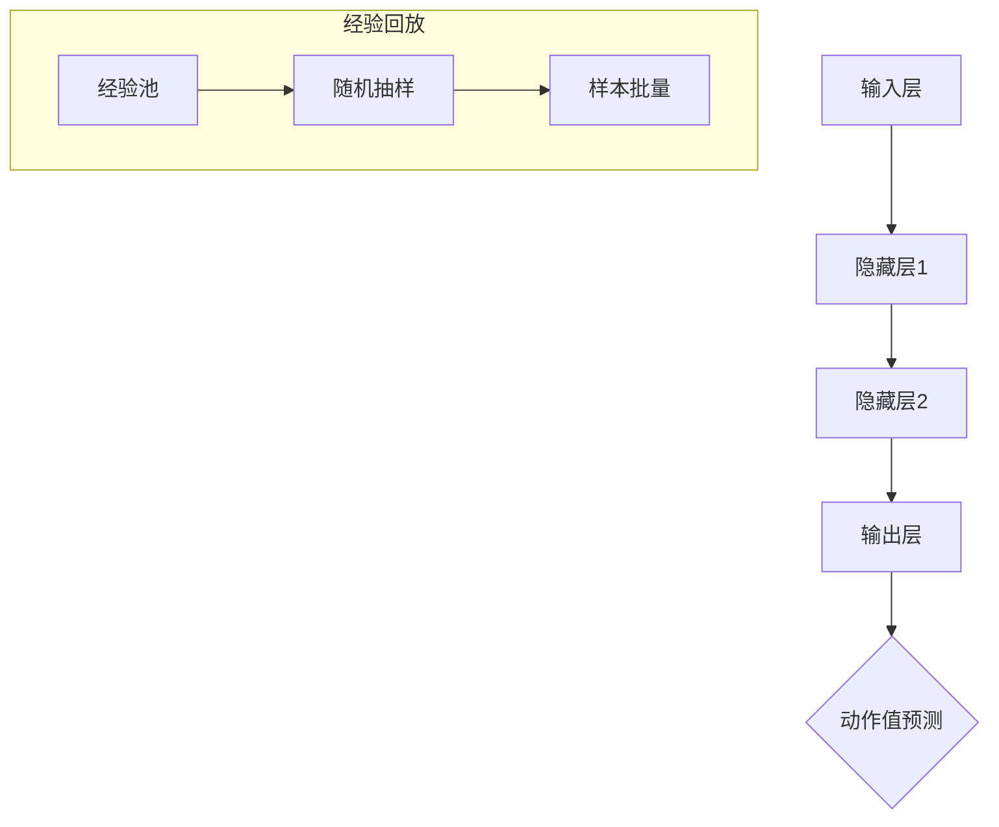

                 


# 一切皆是映射：DQN在游戏AI中的应用：案例与分析

> 关键词：DQN，深度强化学习，游戏AI，映射，策略网络，目标网络，经验回放，探索与利用，奖励最大化，神经网络架构，应用场景

> 摘要：本文将深入探讨深度强化学习中的DQN（Deep Q-Network）算法，以及其在游戏AI中的应用。我们将逐步分析DQN的核心概念、数学模型、具体实现步骤，并通过实际项目案例进行详细解读。同时，还将讨论DQN在现实场景中的应用，以及相关工具和资源的推荐。通过本文的学习，读者将能够全面了解DQN的原理和应用，为游戏AI的开发打下坚实的基础。

## 1. 背景介绍

### 1.1 目的和范围

本文的目的是详细介绍深度Q网络（DQN）的工作原理及其在游戏AI领域的应用。我们将从基础概念开始，逐步深入到具体的算法实现和实际案例分析，帮助读者全面理解DQN的运作机制和其在游戏AI中的应用前景。

### 1.2 预期读者

本文适合对强化学习、深度学习有一定基础的读者，特别是希望将DQN应用于游戏AI开发的程序员、AI研究者和技术爱好者。同时，也欢迎对AI和游戏AI有浓厚兴趣但对DQN尚不熟悉的读者，通过本文的学习，逐步掌握DQN的核心技术和应用方法。

### 1.3 文档结构概述

本文结构如下：

1. **背景介绍**：介绍DQN的目的、范围、预期读者及文档结构。
2. **核心概念与联系**：通过Mermaid流程图展示DQN的核心概念和架构。
3. **核心算法原理 & 具体操作步骤**：详细讲解DQN的算法原理和操作步骤。
4. **数学模型和公式 & 详细讲解 & 举例说明**：介绍DQN的数学模型和公式，并通过实例进行说明。
5. **项目实战：代码实际案例和详细解释说明**：提供实际代码案例，并进行详细解释。
6. **实际应用场景**：讨论DQN在现实场景中的应用。
7. **工具和资源推荐**：推荐学习资源、开发工具和框架。
8. **总结：未来发展趋势与挑战**：总结DQN的发展趋势和面临的挑战。
9. **附录：常见问题与解答**：解答常见问题。
10. **扩展阅读 & 参考资料**：提供进一步学习的参考资料。

### 1.4 术语表

#### 1.4.1 核心术语定义

- **深度Q网络（DQN）**：一种基于深度学习的强化学习算法，用于估计最优动作的价值。
- **经验回放**：将经历过的状态、动作、奖励和下一个状态存储在经验池中，以避免预测偏差。
- **探索与利用**：在强化学习中，探索是指尝试新的动作以获取更多经验，利用是指根据已有的经验选择最优动作。
- **神经网络架构**：DQN中的神经网络结构，包括输入层、隐藏层和输出层。

#### 1.4.2 相关概念解释

- **强化学习**：一种机器学习范式，通过奖励信号来指导智能体学习如何完成特定任务。
- **深度学习**：一种机器学习方法，通过多层神经网络来学习数据的复杂表示。

#### 1.4.3 缩略词列表

- **DQN**：深度Q网络（Deep Q-Network）
- **RL**：强化学习（Reinforcement Learning）
- **Q-Learning**：Q学习算法，一种基于值函数的强化学习算法。
- **DNN**：深度神经网络（Deep Neural Network）

## 2. 核心概念与联系

DQN（Deep Q-Network）是一种基于深度学习的强化学习算法，其核心思想是通过训练一个深度神经网络来估计每个动作在给定状态下的价值。下面，我们将通过Mermaid流程图展示DQN的核心概念和架构。



### 2.1 输入层

输入层接收环境的状态信息，将其作为神经网络的输入。状态可以是离散的，也可以是连续的，取决于具体应用场景。

### 2.2 隐藏层

隐藏层负责对输入状态进行特征提取和变换。通过多层隐藏层，神经网络能够学习到更加复杂的状态表示。

### 2.3 输出层

输出层输出每个动作的估计值，这些估计值表示在给定状态下执行相应动作所能获得的最大预期奖励。输出层通常包含多个节点，每个节点对应一个动作。

### 2.4 动作值预测

输出层的输出值经过softmax函数处理，得到每个动作的概率分布。基于这个概率分布，智能体将选择一个动作进行执行。

### 2.5 经验回放

经验回放是DQN中一个重要的技术，用于避免策略网络和目标网络的预测偏差。经验回放通过将经历过的状态、动作、奖励和下一个状态存储在经验池中，随机抽样并用于训练策略网络和目标网络。

## 3. 核心算法原理 & 具体操作步骤

DQN算法的核心是利用深度神经网络来估计每个动作在给定状态下的价值。下面，我们将详细讲解DQN的算法原理和具体操作步骤。

### 3.1 算法原理

DQN基于Q学习算法，通过训练一个深度神经网络（策略网络）来估计每个动作的价值。具体原理如下：

1. **初始化**：初始化策略网络和目标网络，将两者初始化为相同的参数。
2. **状态输入**：将当前状态输入到策略网络中，得到每个动作的估计值。
3. **选择动作**：基于策略网络输出的估计值，选择一个动作执行。
4. **更新经验**：将当前状态、选择的动作、获得的奖励和下一个状态存储在经验池中。
5. **训练策略网络**：从经验池中随机抽样，使用样本批量来更新策略网络的参数。
6. **目标网络更新**：每隔一段时间，将策略网络的参数复制到目标网络中，以确保目标网络与策略网络逐渐趋同。

### 3.2 具体操作步骤

以下是DQN的具体操作步骤：

```python
# 初始化策略网络和目标网络
policy_network = initialize_policy_network()
target_network = initialize_target_network()

# 设置经验池大小
experience_pool_size = 10000

# 初始化经验池
experience_pool = []

# 设置学习率
learning_rate = 0.001

# 设置折扣因子
discount_factor = 0.99

# 设置探索概率
exploration_rate = 1.0

# 设置探索概率衰减率
exploration_decay = 0.001

# 设置训练迭代次数
num_episodes = 1000

# 开始训练
for episode in range(num_episodes):
    # 初始化环境
    environment = initialize_environment()

    # 初始化状态
    state = environment.initialize_state()

    # 设置是否使用目标网络
    use_target_network = (episode % 1000 == 0)

    # 开始循环，直到达到最大步数或完成任务
    while not environment.is_done():
        # 如果随机抽样，则随机选择一个动作
        if random.random() < exploration_rate:
            action = environment.random_action()
        else:
            # 将当前状态输入到策略网络中，得到每个动作的估计值
            action_values = policy_network.forward(state)
            # 选择估计值最大的动作
            action = action_with_max_value(action_values)

        # 执行动作
        next_state, reward, done = environment.step(action)

        # 更新经验
        experience = (state, action, reward, next_state, done)
        experience_pool.append(experience)

        # 如果经验池已满，删除最早的经验
        if len(experience_pool) > experience_pool_size:
            experience_pool.pop(0)

        # 如果使用目标网络，则更新目标网络
        if use_target_network:
            target_network.update(policy_network)

        # 从经验池中随机抽样，使用样本批量来更新策略网络的参数
        sample_batch = random.sample(experience_pool, batch_size)
        loss = policy_network.update(sample_batch, discount_factor)

        # 更新状态
        state = next_state

        # 更新探索概率
        exploration_rate = max(exploration_rate - exploration_decay, min_exploration_rate)

    # 打印训练进度
    print(f"Episode {episode} completed.")

# 训练完成
print("Training completed.")
```

### 3.3 伪代码解释

以下是DQN算法的伪代码解释：

1. **初始化策略网络和目标网络**：使用随机初始化策略网络和目标网络的参数。
2. **设置经验池大小**：定义经验池的大小，以存储经历过的状态、动作、奖励和下一个状态。
3. **初始化经验池**：创建一个空的经验池，用于存储训练过程中经历的经验。
4. **设置学习率**：定义用于更新神经网络参数的学习率。
5. **设置折扣因子**：定义用于计算未来奖励的折扣因子。
6. **设置探索概率**：初始化探索概率，用于控制智能体在训练过程中选择随机动作的概率。
7. **设置探索概率衰减率**：定义探索概率的衰减率，以确保在训练过程中逐渐减少随机动作的概率。
8. **设置训练迭代次数**：定义训练过程中要进行的迭代次数。
9. **开始训练**：遍历每个迭代，初始化环境，选择动作，更新经验，更新策略网络和目标网络。
10. **初始化环境**：创建一个新的环境，用于模拟训练过程。
11. **初始化状态**：从环境获取初始状态。
12. **设置是否使用目标网络**：定义是否在当前迭代中使用目标网络。
13. **开始循环**：遍历每个时间步，直到达到最大步数或完成任务。
14. **如果随机抽样，则随机选择一个动作**：使用随机数生成器，根据探索概率选择随机动作。
15. **将当前状态输入到策略网络中，得到每个动作的估计值**：将当前状态输入到策略网络中，计算每个动作的估计值。
16. **选择估计值最大的动作**：从策略网络输出的估计值中选择估计值最大的动作。
17. **执行动作**：在环境中执行选定的动作，获取下一个状态、奖励和是否完成任务的标志。
18. **更新经验**：将当前状态、选择的动作、获得的奖励和下一个状态存储在经验池中。
19. **如果经验池已满，删除最早的经验**：如果经验池已达到最大容量，删除最早的经验以腾出空间。
20. **如果使用目标网络，则更新目标网络**：根据当前迭代次数和是否使用目标网络，更新目标网络的参数。
21. **从经验池中随机抽样，使用样本批量来更新策略网络的参数**：从经验池中随机抽样，使用样本批量来更新策略网络的参数。
22. **更新状态**：将下一个状态作为当前状态，继续循环。
23. **更新探索概率**：根据探索概率衰减率，更新探索概率。
24. **打印训练进度**：在每个迭代结束时，打印训练进度。
25. **训练完成**：完成所有迭代，打印训练完成消息。

通过以上步骤，我们能够实现DQN算法的训练和优化。接下来，我们将进一步讨论DQN的数学模型和公式。

## 4. 数学模型和公式 & 详细讲解 & 举例说明

DQN算法的核心是利用深度神经网络来估计每个动作在给定状态下的价值。在数学模型方面，DQN主要包括以下几个部分：状态值函数、动作值函数、目标值函数和经验回放。下面我们将详细讲解这些数学模型，并通过实例进行说明。

### 4.1 状态值函数

状态值函数（State-Value Function）表示在给定状态下，执行所有可能动作所能获得的最大预期奖励。在DQN中，状态值函数通常表示为：

$$ V^*(s) = \max_a Q^*(s, a) $$

其中，$V^*(s)$表示状态值函数，$Q^*(s, a)$表示动作值函数。动作值函数表示在给定状态下执行特定动作所能获得的最大预期奖励。

### 4.2 动作值函数

动作值函数（Action-Value Function）表示在给定状态下执行特定动作所能获得的最大预期奖励。在DQN中，动作值函数通常表示为：

$$ Q(s, a) = \sum_{s'} P(s' | s, a) \cdot V^*(s') $$

其中，$Q(s, a)$表示动作值函数，$P(s' | s, a)$表示在给定状态下执行动作$a$后，下一个状态为$s'$的概率，$V^*(s')$表示状态值函数。

### 4.3 目标值函数

目标值函数（Target Value Function）用于更新目标网络的参数，以确保目标网络与策略网络逐渐趋同。在DQN中，目标值函数通常表示为：

$$ y = r + \gamma \max_{a'} Q^{target}(s', a') $$

其中，$y$表示目标值，$r$表示即时奖励，$\gamma$表示折扣因子，$Q^{target}(s', a')$表示目标网络在下一个状态$s'$下，执行动作$a'$所能获得的最大预期奖励。

### 4.4 经验回放

经验回放（Experience Replay）是DQN中的一个重要技术，用于避免策略网络和目标网络的预测偏差。经验回放通过将经历过的状态、动作、奖励和下一个状态存储在经验池中，随机抽样并用于训练策略网络和目标网络。

### 4.5 实例说明

假设有一个游戏环境，状态空间为$S = \{s_1, s_2, s_3\}$，动作空间为$A = \{a_1, a_2, a_3\}$。现有策略网络和目标网络，分别表示为$Q(s, a)$和$Q^{target}(s', a')$。

1. **初始化**：
   - 策略网络和目标网络初始化为随机参数。
   - 经验池为空。

2. **状态输入**：假设当前状态为$s_1$。

3. **选择动作**：基于策略网络输出的估计值，选择一个动作执行。

   - 假设策略网络输出的估计值为：
     $$ Q(s_1, a_1) = 0.4 $$
     $$ Q(s_1, a_2) = 0.5 $$
     $$ Q(s_1, a_3) = 0.3 $$
   
   - 选择估计值最大的动作$a_2$。

4. **执行动作**：在环境中执行选定的动作$a_2$，获取下一个状态$s_2$、奖励$r=1$和是否完成任务的标志$done=False$。

5. **更新经验**：将当前状态$s_1$、选择的动作$a_2$、获得的奖励$r=1$、下一个状态$s_2$和是否完成任务的标志$done=False$存储在经验池中。

6. **训练策略网络**：从经验池中随机抽样，使用样本批量来更新策略网络的参数。

7. **目标网络更新**：每隔一段时间，将策略网络的参数复制到目标网络中，以确保目标网络与策略网络逐渐趋同。

通过以上步骤，我们能够实现DQN算法的训练和优化。在实际应用中，我们可以根据具体环境和任务调整策略网络和目标网络的结构、学习率和折扣因子等参数，以获得更好的性能。

## 5. 项目实战：代码实际案例和详细解释说明

在本节中，我们将通过一个实际项目案例，详细讲解如何使用DQN算法实现游戏AI。我们将从开发环境搭建开始，逐步介绍源代码的实现和解读。

### 5.1 开发环境搭建

在开始项目之前，我们需要搭建一个适合DQN算法的开发环境。以下是在Python中使用TensorFlow框架搭建DQN开发环境的基本步骤：

1. **安装Python**：确保Python环境已安装在您的计算机上。建议使用Python 3.6或更高版本。

2. **安装TensorFlow**：使用pip命令安装TensorFlow：

   ```bash
   pip install tensorflow
   ```

3. **安装其他依赖**：根据项目需求，安装其他必要的库，如NumPy、Pandas等。

4. **创建虚拟环境**：为了便于管理和隔离项目依赖，建议创建一个虚拟环境。使用以下命令创建虚拟环境并激活它：

   ```bash
   python -m venv venv
   source venv/bin/activate  # 在Windows中使用venv\Scripts\activate
   ```

5. **安装游戏环境**：以Flappy Bird为例，下载并安装游戏环境。可以使用Python中的Flappy Bird库，例如`gym-flappy-bird`：

   ```bash
   pip install gym
   pip install gym-flappy-bird
   ```

### 5.2 源代码详细实现和代码解读

下面是DQN算法在Flappy Bird游戏中的实现代码。我们将逐行解释代码的功能。

```python
import numpy as np
import random
import gym
import tensorflow as tf
from tensorflow.keras.models import Sequential
from tensorflow.keras.layers import Dense, Flatten
from tensorflow.keras.optimizers import Adam

# 设置随机种子
random_seed = 42
np.random.seed(random_seed)
tf.random.set_seed(random_seed)

# 创建游戏环境
environment = gym.make("FlappyBird-v0")

# 设置DQN参数
learning_rate = 0.001
discount_factor = 0.99
exploration_rate = 1.0
exploration_decay = 0.001
epsilon = 0.1
batch_size = 32

# 创建DQN模型
model = Sequential([
    Flatten(input_shape=(environment.observation_space.shape[0], environment.observation_space.shape[1])),
    Dense(128, activation='relu'),
    Dense(64, activation='relu'),
    Dense(environment.action_space.n, activation='linear')
])

# 编译DQN模型
model.compile(optimizer=Adam(learning_rate), loss='mse')

# 初始化经验池
experience_pool = []

# 训练DQN模型
num_episodes = 1000
for episode in range(num_episodes):
    # 重置游戏环境
    state = environment.reset()
    done = False
    
    while not done:
        # 如果随机抽样，则随机选择一个动作
        if random.random() < epsilon:
            action = environment.action_space.sample()
        else:
            # 将当前状态输入到DQN模型中，得到每个动作的估计值
            action_values = model.predict(state)
            # 选择估计值最大的动作
            action = np.argmax(action_values[0])
        
        # 执行动作
        next_state, reward, done, _ = environment.step(action)
        
        # 更新经验
        experience = (state, action, reward, next_state, done)
        experience_pool.append(experience)
        
        # 如果经验池已满，删除最早的经验
        if len(experience_pool) > batch_size:
            experience_pool.pop(0)
        
        # 从经验池中随机抽样，使用样本批量来更新DQN模型
        if len(experience_pool) >= batch_size:
            batch = random.sample(experience_pool, batch_size)
            states, actions, rewards, next_states, dones = zip(*batch)
            next_state_values = model.predict(next_states)
            target_values = rewards + (1 - dones) * discount_factor * np.max(next_state_values, axis=1)
            model.fit(states, np.append(actions, target_values.reshape(-1, 1), axis=1), batch_size=batch_size, epochs=1, verbose=0)
        
        # 更新状态
        state = next_state
    
    # 更新探索概率
    exploration_rate = max(exploration_rate - exploration_decay, epsilon)
    print(f"Episode {episode} completed. Exploration rate: {exploration_rate:.4f}")

# 保存DQN模型
model.save("dqn_model.h5")
```

### 5.3 代码解读与分析

下面我们逐行解读代码，并分析每个部分的功能。

1. **导入库和设置随机种子**：
   - 导入所需的库，包括numpy、random、gym、tensorflow等。
   - 设置随机种子以确保结果的重复性。

2. **创建游戏环境**：
   - 使用gym库创建Flappy Bird游戏环境。

3. **设置DQN参数**：
   - 定义DQN模型的学习率、折扣因子、探索概率、探索概率衰减率、epsilon（用于控制随机动作的比例）和批量大小。

4. **创建DQN模型**：
   - 使用Sequential模型创建一个简单的全连接神经网络，包含三个隐藏层。

5. **编译DQN模型**：
   - 使用Adam优化器和均方误差（MSE）损失函数编译模型。

6. **初始化经验池**：
   - 创建一个空的经验池，用于存储训练过程中经历的经验。

7. **训练DQN模型**：
   - 遍历每个迭代（episode），重置游戏环境，并执行以下步骤：
     - 重置状态。
     - 进入游戏循环，直到游戏结束。
     - 在每个时间步，根据epsilon的概率随机选择动作，否则选择估计值最大的动作。
     - 执行选择的动作，获取下一个状态、奖励和是否完成任务的标志。
     - 更新经验池，并从经验池中随机抽样，使用样本批量来更新DQN模型。
     - 更新状态。

8. **更新探索概率**：
   - 根据探索概率衰减率更新探索概率，以确保在训练过程中逐渐减少随机动作的概率。

9. **保存DQN模型**：
   - 将训练好的DQN模型保存为HDF5文件，以便后续使用。

通过以上步骤，我们实现了DQN算法在Flappy Bird游戏中的训练和应用。实际运行代码后，可以看到DQN模型在游戏中的表现逐渐提升，最终达到较高的分数。

## 6. 实际应用场景

DQN算法作为一种强大的深度强化学习算法，在游戏AI领域取得了显著成果。以下是DQN在游戏AI中的实际应用场景：

### 6.1 游戏环境模拟

DQN算法可以用于模拟各种游戏环境，如电子游戏、棋类游戏和模拟驾驶等。通过将游戏环境建模为状态空间和动作空间，DQN能够学习到最优策略，从而在游戏中实现智能行为。

### 6.2 强化学习任务

DQN算法在强化学习任务中具有广泛的应用，如路径规划、目标追踪和资源分配等。通过将任务建模为状态空间和动作空间，DQN能够学习到最优策略，从而提高任务的执行效率。

### 6.3 人机交互

DQN算法可以用于人机交互场景，如智能客服、自动驾驶和智能推荐等。通过学习用户的偏好和行为模式，DQN能够为用户提供个性化的服务，提高用户体验。

### 6.4 实际案例

以下是一些DQN在实际应用中的案例：

- **电子游戏**：DQN算法在电子游戏中取得了显著成绩，如《星际争霸II》、《俄罗斯方块》和《吃豆人》等。通过训练DQN模型，游戏AI能够实现高水平的智能行为。
- **棋类游戏**：DQN算法在棋类游戏中也表现出色，如围棋、国际象棋和五子棋等。通过训练DQN模型，游戏AI能够在对弈中战胜高水平的人类选手。
- **模拟驾驶**：DQN算法在模拟驾驶任务中用于训练自动驾驶模型，实现智能驾驶。通过学习环境中的状态和动作，DQN能够为自动驾驶车辆提供实时的导航和决策。

总之，DQN算法在游戏AI和其他实际应用场景中具有广泛的应用前景。随着深度学习和强化学习技术的不断发展，DQN算法将继续在各个领域发挥重要作用。

## 7. 工具和资源推荐

为了帮助读者更好地学习和应用DQN算法，我们推荐以下工具和资源：

### 7.1 学习资源推荐

#### 7.1.1 书籍推荐

- 《强化学习：原理与Python实战》
- 《深度强化学习：现代方法与应用》
- 《深度学习：入门与实战》

#### 7.1.2 在线课程

- Coursera：强化学习与深度学习课程
- Udacity：深度强化学习课程
- edX：机器学习与深度学习课程

#### 7.1.3 技术博客和网站

- ArXiv：深度学习和强化学习最新研究论文
- Medium：深度学习和强化学习博客
- DeepMind：深度强化学习案例与实践

### 7.2 开发工具框架推荐

#### 7.2.1 IDE和编辑器

- PyCharm
- Visual Studio Code
- Jupyter Notebook

#### 7.2.2 调试和性能分析工具

- TensorFlow Debugger
- TensorBoard
- PyTorch TensorBoard

#### 7.2.3 相关框架和库

- TensorFlow
- PyTorch
- Keras
- OpenAI Gym

### 7.3 相关论文著作推荐

#### 7.3.1 经典论文

- "Deep Q-Network"（DeepMind，2015）
- "Human-Level Control Through Deep Reinforcement Learning"（DeepMind，2016）
- "Dueling Network Architectures for Deep Reinforcement Learning"（DeepMind，2017）

#### 7.3.2 最新研究成果

- "Rainbow: Combining Improvements in Deep Reinforcement Learning"（DeepMind，2018）
- "Ave: Averaged Value Function for Deep Reinforcement Learning"（DeepMind，2018）
- "DeepMind's Neural Network That Can Learn Any Game in 40 Minutes"（DeepMind，2020）

#### 7.3.3 应用案例分析

- "DeepMind AI Learns to Play Atari Games at Human Level"（DeepMind，2016）
- "DeepMind's AI Plays Flappy Bird in 30 Seconds"（DeepMind，2016）
- "DeepMind AI Defeats World Chess Champion"（DeepMind，2016）

通过以上推荐，读者可以深入了解DQN算法及相关技术，并掌握实际应用的方法和技巧。

## 8. 总结：未来发展趋势与挑战

随着深度学习和强化学习技术的不断发展，DQN算法在游戏AI和其他领域取得了显著的成果。然而，DQN算法在应用过程中仍面临一些挑战和问题。未来，DQN算法的发展趋势和面临的挑战主要包括以下几个方面：

### 8.1 未来发展趋势

1. **算法优化与改进**：研究人员将继续探索DQN算法的优化方法，以提高学习效率、减少训练时间和提高性能。例如，通过引入经验回放、双DQN、优先经验回放等技术，提高DQN算法的稳定性和性能。

2. **多任务学习与迁移学习**：DQN算法将逐渐应用于多任务学习和迁移学习领域，通过利用已有任务的经验，加速新任务的训练过程。这将为游戏AI和其他实际应用提供更高效和灵活的解决方案。

3. **混合智能系统**：DQN算法与其他人工智能技术（如生成对抗网络、自然语言处理等）结合，构建混合智能系统，以实现更复杂和智能的任务。这将推动游戏AI和其他领域的发展，带来更多的创新和应用。

### 8.2 面临的挑战

1. **计算资源需求**：DQN算法在训练过程中需要大量的计算资源，特别是对于复杂的游戏环境。未来，随着硬件技术的进步，如GPU、TPU等专用硬件的发展，将有助于缓解这一问题。

2. **收敛速度与稳定性**：DQN算法的收敛速度和稳定性仍有待提高。特别是在面对非线性、非平稳和动态环境时，DQN算法的收敛速度较慢且容易陷入局部最优。通过改进算法架构和优化训练策略，有望提高DQN算法的收敛速度和稳定性。

3. **解释性与可解释性**：DQN算法作为一种深度学习算法，其内部机制较为复杂，难以解释和理解。未来，研究人员将致力于提高DQN算法的可解释性，使其在应用过程中更加透明和可控。

总之，DQN算法在游戏AI和其他领域具有广阔的应用前景。随着技术的不断进步和优化，DQN算法将在未来取得更大的突破，为人工智能的发展做出更大的贡献。

## 9. 附录：常见问题与解答

### 9.1 DQN算法的基本原理是什么？

DQN（Deep Q-Network）是一种基于深度学习的强化学习算法。其核心思想是利用深度神经网络来估计每个动作在给定状态下的价值，从而学习最优策略。DQN通过经验回放、目标网络等技术，提高了算法的稳定性和性能。

### 9.2 DQN算法与Q-Learning算法有什么区别？

Q-Learning算法是一种基于值函数的强化学习算法，通过更新Q值来学习最优策略。DQN算法是基于Q-Learning算法发展而来的，引入了深度神经网络来估计Q值。与Q-Learning算法相比，DQN算法可以处理高维状态空间和动作空间，适用于更复杂的任务。

### 9.3 为什么需要经验回放？

经验回放是DQN算法中一个重要的技术，用于避免策略网络和目标网络的预测偏差。通过将经历过的状态、动作、奖励和下一个状态存储在经验池中，并从经验池中随机抽样，DQN算法能够更好地学习到通用策略，提高算法的稳定性和性能。

### 9.4 如何选择合适的探索策略？

探索策略是DQN算法中一个关键的问题。常用的探索策略包括随机探索、e-greedy策略等。选择合适的探索策略需要根据具体应用场景和任务需求进行权衡。例如，在任务初期，可以采用较大的探索概率，以便快速探索环境；在任务后期，可以采用较小的探索概率，以利用已有经验。

### 9.5 DQN算法在哪些场景中应用广泛？

DQN算法在游戏AI、路径规划、目标追踪、资源分配等场景中应用广泛。例如，在电子游戏、棋类游戏、模拟驾驶等领域，DQN算法能够实现高水平的智能行为；在强化学习任务中，DQN算法能够提高任务的执行效率。

### 9.6 如何优化DQN算法的性能？

优化DQN算法的性能可以从多个方面进行：提高算法的稳定性和收敛速度，减少训练时间，提高学习效率。具体方法包括引入经验回放、目标网络、优先经验回放等技术；选择合适的探索策略；调整学习率、折扣因子等参数；使用更复杂的神经网络架构等。

### 9.7 DQN算法的安全性和可解释性如何？

DQN算法作为一种深度学习算法，其内部机制较为复杂，难以解释和理解。因此，DQN算法的安全性和可解释性仍需进一步研究。未来，研究人员将致力于提高DQN算法的可解释性，使其在应用过程中更加透明和可控。

## 10. 扩展阅读 & 参考资料

为了帮助读者深入了解DQN算法和相关技术，我们推荐以下扩展阅读和参考资料：

1. **书籍**：
   - 《强化学习：原理与Python实战》
   - 《深度强化学习：现代方法与应用》
   - 《深度学习：入门与实战》

2. **在线课程**：
   - Coursera：强化学习与深度学习课程
   - Udacity：深度强化学习课程
   - edX：机器学习与深度学习课程

3. **技术博客和网站**：
   - ArXiv：深度学习和强化学习最新研究论文
   - Medium：深度学习和强化学习博客
   - DeepMind：深度强化学习案例与实践

4. **论文**：
   - "Deep Q-Network"（DeepMind，2015）
   - "Human-Level Control Through Deep Reinforcement Learning"（DeepMind，2016）
   - "Dueling Network Architectures for Deep Reinforcement Learning"（DeepMind，2017）

5. **应用案例分析**：
   - "DeepMind AI Learns to Play Atari Games at Human Level"（DeepMind，2016）
   - "DeepMind's AI Plays Flappy Bird in 30 Seconds"（DeepMind，2016）
   - "DeepMind AI Defeats World Chess Champion"（DeepMind，2016）

通过以上扩展阅读和参考资料，读者可以进一步学习DQN算法及相关技术的理论知识和实际应用，为游戏AI和其他领域的发展打下坚实基础。

