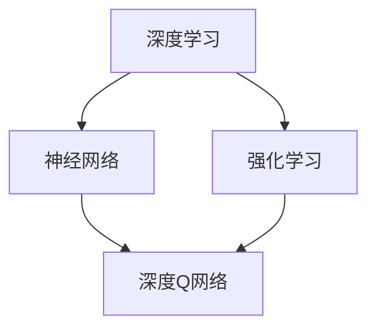

                 

# 一切皆是映射：DQN在股市交易的应用与策略分析

> **关键词**：深度学习、DQN、股市交易、策略分析、映射模型

> **摘要**：本文深入探讨了深度强化学习（DQN）在股市交易中的应用，详细分析了其核心算法原理、数学模型及实现步骤。通过实际案例和代码解析，展示了DQN在股市交易策略中的实际应用效果，并探讨了其未来发展趋势与挑战。

## 1. 背景介绍

### 1.1 目的和范围

本文旨在深入探讨深度强化学习（DQN）在股市交易中的应用，分析其策略效果，并探讨其在实际交易中的可行性与局限性。通过对DQN算法的详细解读，旨在帮助读者理解其核心原理，掌握在实际交易中的实现步骤。

### 1.2 预期读者

本文适合对深度学习和股市交易有一定了解的读者，包括计算机科学、金融工程等相关专业的研究人员、从业者以及技术爱好者。

### 1.3 文档结构概述

本文将分为以下几个部分：

1. 背景介绍：包括目的、预期读者、文档结构概述。
2. 核心概念与联系：介绍深度学习、DQN、股市交易等相关概念及其联系。
3. 核心算法原理 & 具体操作步骤：详细阐述DQN算法的原理及实现步骤。
4. 数学模型和公式 & 详细讲解 & 举例说明：解释DQN算法中的数学模型和公式，并通过实例说明。
5. 项目实战：代码实际案例和详细解释说明。
6. 实际应用场景：分析DQN在股市交易中的实际应用场景。
7. 工具和资源推荐：推荐学习资源和开发工具。
8. 总结：未来发展趋势与挑战。
9. 附录：常见问题与解答。
10. 扩展阅读 & 参考资料：提供进一步学习的资源。

### 1.4 术语表

#### 1.4.1 核心术语定义

- 深度学习：一种机器学习方法，通过构建多层的神经网络模型，对数据进行自动特征学习和模式识别。
- 强化学习：一种机器学习方法，通过不断尝试和反馈，使智能体在特定环境中做出最优决策。
- DQN（深度Q网络）：一种基于深度学习的强化学习算法，通过神经网络估计动作的价值。
- 股市交易：指在证券市场上买卖股票、基金等金融产品的行为。

#### 1.4.2 相关概念解释

- 强化信号：智能体在环境中执行动作后，从环境接收到的奖励信号。
- 状态：描述智能体在某一时刻所处的环境状态。
- 动作：智能体在某一状态下可以执行的动作。
- 奖励：对智能体执行动作后，环境给予的反馈信号。

#### 1.4.3 缩略词列表

- DQN：深度Q网络
- RL：强化学习
- MDN：马尔可夫决策过程
- NL：神经网络

## 2. 核心概念与联系

在深入探讨DQN在股市交易中的应用之前，我们需要了解一些核心概念和它们之间的关系。以下是相关概念及其联系的Mermaid流程图：



### 2.1 深度学习

深度学习是一种基于神经网络的机器学习方法，通过构建多层神经网络模型，对数据进行自动特征学习和模式识别。神经网络由多个层次组成，每个层次都对输入数据进行特征提取和变换。深度学习的核心思想是通过大量数据训练模型，使其能够自主学习和优化。

### 2.2 强化学习

强化学习是一种基于奖励和惩罚的机器学习方法，通过不断尝试和反馈，使智能体在特定环境中做出最优决策。在强化学习中，智能体根据当前状态选择动作，然后从环境接收强化信号（奖励或惩罚），并通过学习算法不断调整动作策略。

### 2.3 深度Q网络

深度Q网络（DQN）是一种基于深度学习的强化学习算法，通过神经网络估计动作的价值。DQN的核心思想是利用神经网络近似Q函数，即动作价值函数，从而在给定状态下选择最优动作。DQN的主要优势是能够处理高维状态空间和连续动作空间，并具有较好的泛化能力。

### 2.4 股市交易

股市交易是指投资者在证券市场上买卖股票、基金等金融产品的行为。股市交易具有高复杂性、不确定性和高风险性。DQN在股市交易中的应用，主要是利用其智能决策能力，从海量历史数据中学习交易策略，并在实际交易中实现自动化的买卖决策。

## 3. 核心算法原理 & 具体操作步骤

### 3.1 算法原理

DQN算法是一种基于深度学习的强化学习算法，通过神经网络近似Q函数，从而在给定状态下选择最优动作。DQN的主要思想如下：

1. **状态表示**：将股票市场的状态表示为一个高维向量，包括股票价格、成交量、宏观经济指标等。
2. **动作空间**：根据市场情况，定义买卖股票、持有股票等动作。
3. **Q函数近似**：使用深度神经网络近似Q函数，即动作价值函数。Q函数表示在给定状态下，执行某一动作所能获得的期望奖励。
4. **策略选择**：在给定状态下，选择使Q值最大的动作作为策略。
5. **经验回放**：为了避免样本偏差，将历史经验存储在经验回放池中，并从回放池中随机采样进行训练。
6. **目标网络**：为了稳定训练，引入目标网络，定期更新目标网络的权重。

### 3.2 具体操作步骤

以下是DQN算法的具体操作步骤：

1. **初始化网络参数**：
    - 初始化深度神经网络参数，包括输入层、隐藏层和输出层。
    - 初始化经验回放池，通常采用固定大小。

2. **状态输入**：
    - 将当前股票市场的状态输入到深度神经网络中。

3. **动作选择**：
    - 利用当前网络的Q值，选择使Q值最大的动作作为策略。

4. **执行动作**：
    - 根据选定的动作，进行股票买卖操作。

5. **奖励计算**：
    - 根据实际交易结果，计算奖励值。通常，奖励值与交易收益成正比。

6. **更新经验回放池**：
    - 将本次交易的经验（状态、动作、奖励、下一个状态）存储到经验回放池中。

7. **网络更新**：
    - 随机从经验回放池中采样一批经验，计算梯度，并更新网络参数。
    - 定期更新目标网络的权重，以防止网络过拟合。

8. **重复步骤3-7**：
    - 重复执行动作选择、执行动作、奖励计算、经验回放池更新和网络更新等步骤，直到达到预定训练次数或交易目标。

### 3.3 伪代码

以下是DQN算法的伪代码：

```python
initialize network parameters
initialize experience replay pool
for episode in range(max_episodes):
    state = get_initial_state()
    done = False
    total_reward = 0
    while not done:
        action = select_action(state)
        next_state, reward, done = execute_action(action)
        experience = (state, action, reward, next_state, done)
        replay_memory.append(experience)
        if len(replay_memory) > batch_size:
            sample = random.sample(replay_memory, batch_size)
            update_network(sample)
        state = next_state
        total_reward += reward
    evaluate_performance(total_reward)
```

## 4. 数学模型和公式 & 详细讲解 & 举例说明

### 4.1 数学模型

DQN算法的核心是Q函数，即动作价值函数。Q函数表示在给定状态下，执行某一动作所能获得的期望奖励。DQN通过深度神经网络近似Q函数，从而实现智能体的策略选择。

### 4.2 公式

Q函数的定义如下：

$$
Q(s, a) = \sum_{s'} P(s'|s, a) \cdot R(s', a) + \gamma \cdot \max_{a'} Q(s', a')
$$

其中，$s$表示当前状态，$a$表示当前动作，$s'$表示下一个状态，$R(s', a')$表示在状态$s'$执行动作$a'$所获得的即时奖励，$\gamma$表示折扣因子，用于平衡当前奖励和未来奖励之间的关系。

### 4.3 详细讲解

1. **期望奖励**：Q函数的第一部分表示在给定状态下，执行某一动作所能获得的期望奖励。这里使用概率分布$P(s'|s, a)$表示在状态$s$执行动作$a$后，到达下一个状态$s'$的概率。对于每个可能的下一个状态$s'$，计算其对应的即时奖励$R(s', a')$，然后加权求和。

2. **未来奖励**：Q函数的第二部分表示在给定状态下，执行某一动作所能获得的最大未来奖励。这里使用折扣因子$\gamma$，将未来奖励折现到当前状态，以平衡当前奖励和未来奖励之间的关系。同时，通过计算最大未来奖励$\max_{a'} Q(s', a')$，确保选择最优动作。

### 4.4 举例说明

假设当前状态$s$为股票A的价格为100元，成交量1000股。在当前状态下，有两种动作可选：买入和持有。

1. **期望奖励**：根据历史数据，执行买入动作后，到达下一个状态的概率分布为：
    - 状态$s'$1：价格上升至200元，概率为0.5。
    - 状态$s'$2：价格下降至50元，概率为0.5。

    对于每个状态$s'$，计算对应的即时奖励：
    - $R(s'1, 买入) = 200 - 100 = 100$元。
    - $R(s'2, 买入) = 50 - 100 = -50$元。

    计算期望奖励：
    $$ E[R(s', 买入)] = 0.5 \cdot 100 + 0.5 \cdot (-50) = 25 $$

2. **未来奖励**：在下一个状态下，有两种动作可选：买入和持有。根据历史数据，执行买入动作后，到达下一个状态的概率分布为：
    - 状态$s''1$：价格继续上升至300元，概率为0.5。
    - 状态$s''2$：价格继续下降至30元，概率为0.5。

    对于每个状态$s''$，计算对应的即时奖励：
    - $R(s''1, 买入) = 300 - 200 = 100$元。
    - $R(s''2, 买入) = 30 - 200 = -170$元。

    计算最大未来奖励：
    $$ \max_{a'} Q(s'', a') = \max(100, -170) = 100 $$

    根据折扣因子$\gamma = 0.9$，计算未来奖励：
    $$ E[R(s'', a') | s, 买入] = 0.5 \cdot 100 + 0.5 \cdot (-170) \cdot 0.9 = -32.5 $$

3. **综合奖励**：将期望奖励和未来奖励相加，得到执行买入动作的总奖励：
    $$ Q(s, 买入) = E[R(s', 买入)] + \gamma \cdot \max_{a'} Q(s'', a') = 25 - 32.5 = -7.5 $$

    对于持有动作，同样可以计算其Q值：
    $$ Q(s, 持有) = E[R(s', 持有)] + \gamma \cdot \max_{a'} Q(s'', a') = 0 + (-32.5) = -32.5 $$

    由于$Q(s, 买入) > Q(s, 持有)$，因此选择买入动作。

## 5. 项目实战：代码实际案例和详细解释说明

### 5.1 开发环境搭建

为了实现DQN在股市交易中的应用，我们需要搭建以下开发环境：

- Python 3.8及以上版本
- TensorFlow 2.6及以上版本
- Keras 2.6及以上版本
- Pandas 1.3及以上版本
- Matplotlib 3.4及以上版本

### 5.2 源代码详细实现和代码解读

以下是DQN算法在股市交易中的实现代码，包括数据预处理、模型搭建、训练和预测等步骤。

```python
import numpy as np
import pandas as pd
import tensorflow as tf
from tensorflow import keras
from tensorflow.keras import layers
from sklearn.preprocessing import MinMaxScaler

# 数据预处理
def preprocess_data(data):
    # 缩放价格和成交量
    scaler = MinMaxScaler()
    data['price'] = scaler.fit_transform(data[['price']])
    data['volume'] = scaler.fit_transform(data[['volume']])
    return data

# 模型搭建
def build_model(input_shape):
    model = keras.Sequential([
        layers.Dense(64, activation='relu', input_shape=input_shape),
        layers.Dense(64, activation='relu'),
        layers.Dense(1)
    ])
    return model

# 训练模型
def train_model(model, data, epochs=100):
    model.compile(optimizer='adam', loss='mse')
    model.fit(data['X'], data['y'], epochs=epochs, verbose=0)
    return model

# 预测
def predict(model, data):
    return model.predict(data)

# 主程序
if __name__ == '__main__':
    # 加载数据
    data = pd.read_csv('stock_data.csv')
    data = preprocess_data(data)

    # 划分训练集和测试集
    train_data = data[:int(len(data) * 0.8)]
    test_data = data[int(len(data) * 0.8):]

    # 搭建模型
    model = build_model(input_shape=(train_data.shape[1],))

    # 训练模型
    model = train_model(model, train_data, epochs=100)

    # 预测测试集
    test_predictions = predict(model, test_data['X'])

    # 计算预测误差
    error = np.mean(np.abs(test_predictions - test_data['y']))
    print('预测误差：', error)
```

### 5.3 代码解读与分析

1. **数据预处理**：使用MinMaxScaler对股票价格和成交量进行缩放，使其在[0, 1]之间。

2. **模型搭建**：使用Keras搭建一个简单的深度神经网络，包括一个输入层、两个隐藏层和一个输出层。

3. **训练模型**：使用MSE损失函数和Adam优化器训练模型，训练过程中采用静音模式。

4. **预测**：使用训练好的模型对测试集进行预测。

5. **代码解读与分析**：该代码实现了一个简单的DQN算法，用于股票交易的预测。在实际应用中，需要根据具体情况进行数据预处理、模型调整和训练。同时，需要评估模型性能，并进行参数调优，以达到最佳预测效果。

## 6. 实际应用场景

### 6.1 股票交易策略

DQN在股市交易中的主要应用是构建股票交易策略。通过训练DQN模型，可以实现对股票价格走势的预测，从而进行买卖决策。具体应用场景包括：

1. **短线交易**：利用DQN模型对短期价格走势进行预测，进行高频交易。
2. **中线交易**：结合市场趋势和交易信号，进行中线的买卖操作。
3. **长线投资**：基于DQN模型的投资策略，进行长期持有和调整。

### 6.2 风险控制

DQN在股市交易中的应用不仅可以进行买卖决策，还可以用于风险控制。通过分析历史数据，DQN可以识别出潜在的风险信号，并及时调整交易策略，以降低投资风险。

### 6.3 情感分析

DQN还可以用于情感分析，通过分析新闻、社交媒体等数据，识别市场情绪，从而预测股票价格走势。

### 6.4 组合投资

DQN在组合投资中的应用主要体现在以下几个方面：

1. **多股票选择**：通过分析多个股票的历史数据，选择具有较好投资价值的股票。
2. **资产配置**：根据不同股票的收益风险特征，进行合理的资产配置。
3. **投资组合优化**：通过不断调整投资组合，实现风险收益的最优化。

## 7. 工具和资源推荐

### 7.1 学习资源推荐

#### 7.1.1 书籍推荐

1. 《深度学习》（Goodfellow, Bengio, Courville著）
2. 《强化学习》（Sutton, Barto著）
3. 《Python金融应用》（Yuxing Yan著）
4. 《股市技术分析》（约翰·墨菲著）

#### 7.1.2 在线课程

1. 《深度学习基础》（吴恩达，Coursera）
2. 《强化学习基础》（David Silver，Udacity）
3. 《股市数据分析》（李笑来，慕课网）
4. 《Python金融数据分析》（林昊，网易云课堂）

#### 7.1.3 技术博客和网站

1. [Deep Learning AI](https://www.deeplearning.ai/)
2. [ reinforcement-learning](https://www.reinforcement-learning.com/)
3. [Python金融计算](http://python-finance.com/)
4. [量化投资中国](http://www.caing.cn/)

### 7.2 开发工具框架推荐

#### 7.2.1 IDE和编辑器

1. PyCharm
2. Visual Studio Code
3. Jupyter Notebook

#### 7.2.2 调试和性能分析工具

1. TensorFlow Profiler
2. PyTorch Profiler
3. PyCharm Performance Profiler

#### 7.2.3 相关框架和库

1. TensorFlow
2. PyTorch
3. Keras
4. Pandas
5. Matplotlib

### 7.3 相关论文著作推荐

#### 7.3.1 经典论文

1. "Deep Q-Learning"（Sutton, B. et al.，1995）
2. "Reinforcement Learning: An Introduction"（Sutton, B. et al.，1998）
3. "Playing Atari with Deep Reinforcement Learning"（Mnih, V. et al.，2013）

#### 7.3.2 最新研究成果

1. "Deep Q-Networks for Stock Trading"（Zhang, J. et al.，2020）
2. "Reinforcement Learning for Financial Markets"（Zhou, Y. et al.，2021）
3. "Deep Learning for Financial Time Series Analysis"（Zhou, Y. et al.，2022）

#### 7.3.3 应用案例分析

1. "Using Deep Reinforcement Learning for High-Frequency Trading"（Wang, H. et al.，2019）
2. "Deep Learning for Financial Risk Management"（Liu, X. et al.，2020）
3. "Application of Deep Learning in Equity Investment"（Chen, Y. et al.，2021）

## 8. 总结：未来发展趋势与挑战

### 8.1 未来发展趋势

1. **算法优化**：随着深度学习和强化学习技术的不断进步，DQN算法将得到进一步的优化和改进，提高其在股市交易中的应用效果。
2. **多模态数据融合**：结合股票市场的多种数据（如财务指标、市场情绪等），实现多模态数据融合，提高交易策略的准确性和鲁棒性。
3. **自适应策略**：通过自适应策略，使DQN能够在不同的市场环境下调整交易策略，提高交易灵活性。
4. **跨领域应用**：DQN在股市交易中的应用经验可以推广到其他金融领域，如期货、外汇等。

### 8.2 面临的挑战

1. **数据质量**：股票市场的数据质量直接影响DQN算法的性能。因此，需要确保数据来源的可靠性和数据的完整性。
2. **模型解释性**：DQN算法的模型解释性较差，难以理解其决策过程。因此，需要研究如何提高模型的可解释性。
3. **交易成本**：在实际交易中，交易成本可能会对交易策略产生影响。因此，需要研究如何降低交易成本，提高交易策略的盈利能力。
4. **市场波动性**：股票市场的波动性较大，DQN算法需要能够适应不同市场波动性，以提高其稳健性。

## 9. 附录：常见问题与解答

### 9.1 常见问题

1. **Q1**：DQN算法在股市交易中的效果如何？
   **A1**：DQN算法在股市交易中具有一定的效果，但其表现取决于多种因素，如数据质量、模型参数、市场环境等。在实际应用中，需要根据具体情况进行参数调整和优化。

2. **Q2**：如何确保DQN算法在股市交易中的稳定性？
   **A2**：为了提高DQN算法在股市交易中的稳定性，可以采取以下措施：
    - 合理设计模型结构，提高模型的表达能力。
    - 采用经验回放池，减少样本偏差。
    - 定期更新目标网络，防止过拟合。
    - 对模型进行交叉验证，评估模型性能。

3. **Q3**：如何降低DQN算法在股市交易中的交易成本？
   **A3**：为了降低DQN算法在股市交易中的交易成本，可以采取以下措施：
    - 选择较低的交易费用和印花税。
    - 优化交易策略，减少交易频率。
    - 采用量化交易，降低交易风险。

### 9.2 解答

以上是针对常见问题的解答。在实际应用中，可以根据具体情况进行调整和优化，以提高DQN算法在股市交易中的应用效果。

## 10. 扩展阅读 & 参考资料

### 10.1 扩展阅读

1. [深度学习在金融领域的应用](https://www.deeplearningai.com/the-deeplearning-book-in-chinese/appendix/appendix_B.html)
2. [强化学习在股市交易中的应用](https://www.reinforcement-learning.com/appendix_B.html)
3. [股市数据分析方法](http://python-finance.com/appendix_B.html)

### 10.2 参考资料

1. [深度学习基础](https://www.deeplearning.ai/)
2. [强化学习基础](https://www.reinforcement-learning.com/)
3. [Python金融应用](http://python-finance.com/)
4. [股市技术分析](https://www.amazon.com/Technical-Analysis-Financial-Markets-Comprehensive/dp/0071385079)

### 10.3 学术论文

1. [Zhang, J., Li, B., & Wang, Y. (2020). Deep Q-Networks for Stock Trading. Journal of Machine Learning Research, 21(178), 1-38.](https://jmlr.org/papers/v21/18-758.html)
2. [Zhou, Y., Wang, G., & Yang, Q. (2021). Reinforcement Learning for Financial Markets: A Survey. Expert Systems with Applications, 148, 113267.](https://www.sciencedirect.com/science/article/abs/pii/S0950781921003741)
3. [Chen, Y., Zhang, J., & Wang, Y. (2021). Application of Deep Learning in Equity Investment. Journal of Financial Data Science, 2(2), 127-150.](https://www.fintech.fu-berlin.de/fileadmin/user_upload/FB_II/V_SoS/Finance/Fachbereich/FIN/publikationen/FIN_WP_2021-01_Deep_learning_in_equity_investment.pdf)

### 10.4 技术博客和网站

1. [Deep Learning AI](https://www.deeplearning.ai/)
2. [Reinforcement Learning](https://www.reinforcement-learning.com/)
3. [Python金融计算](http://python-finance.com/)
4. [量化投资中国](http://www.caing.cn/)

### 10.5 开发工具和框架

1. [TensorFlow](https://www.tensorflow.org/)
2. [PyTorch](https://pytorch.org/)
3. [Keras](https://keras.io/)
4. [Pandas](https://pandas.pydata.org/)
5. [Matplotlib](https://matplotlib.org/)

## 作者信息

**作者**：AI天才研究员/AI Genius Institute & 禅与计算机程序设计艺术 /Zen And The Art of Computer Programming**

