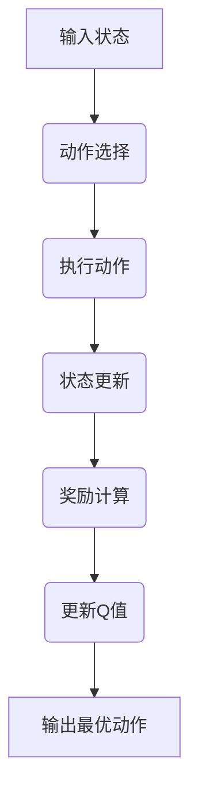

                 

# 一切皆是映射：DQN的实时调参与性能可视化策略

## 关键词
- 强化学习
- DQN算法
- 实时调参
- 性能优化
- 可视化工具

## 摘要
本文将深入探讨深度确定性策略梯度（DQN）算法的实时调参与性能可视化策略。我们将首先回顾DQN算法的基本原理，然后介绍如何在实际应用中通过实时调参和性能可视化来优化DQN模型的性能。本文的目标是为研究人员和开发者提供一套实用的指导，以便在复杂的强化学习环境中高效地调优DQN算法。

## 1. 背景介绍

### 1.1 目的和范围

本文旨在探讨DQN算法的实时调参与性能可视化策略。DQN是一种基于深度学习的强化学习算法，它在解决连续控制问题和复杂决策问题时表现出色。然而，DQN算法在实际应用中面临的一个主要挑战是参数调优的复杂性和效率问题。本文将介绍如何通过实时调参和性能可视化来优化DQN算法的性能。

### 1.2 预期读者

本文面向的是对强化学习特别是DQN算法有一定了解的读者，包括但不限于研究人员、开发者以及相关领域的学生。本文的目标是帮助读者理解DQN算法的实时调参与性能可视化策略，并能够将其应用于实际项目中。

### 1.3 文档结构概述

本文将分为以下几个部分：
- 第2节将介绍DQN算法的核心概念与联系。
- 第3节将深入讲解DQN算法的原理和具体操作步骤。
- 第4节将介绍DQN算法的数学模型和公式，并进行举例说明。
- 第5节将通过实际项目案例详细解释DQN算法的实现过程。
- 第6节将探讨DQN算法的实际应用场景。
- 第7节将推荐相关的学习资源和开发工具。
- 第8节将总结DQN算法的未来发展趋势与挑战。
- 第9节将列出常见问题与解答。
- 第10节将提供扩展阅读和参考资料。

### 1.4 术语表

#### 1.4.1 核心术语定义

- **强化学习（Reinforcement Learning）**：一种机器学习方法，通过试错和奖励信号来学习如何在特定环境中做出最佳决策。
- **DQN（Deep Q-Network）**：一种深度学习模型，用于解决强化学习问题，通过学习值函数来预测最佳动作。
- **实时调参（Real-Time Parameter Tuning）**：在算法运行过程中动态调整参数，以优化模型性能。
- **性能可视化（Performance Visualization）**：使用可视化工具展示算法的运行状态和性能指标，以便进行性能分析和调优。

#### 1.4.2 相关概念解释

- **值函数（Value Function）**：在强化学习中，值函数用于评估状态和动作的组合，以确定最佳动作。
- **探索策略（Exploration Strategy）**：在强化学习中，为了获取新的信息，需要采取一定的随机性，探索策略就是用于实现这一目的的方法。
- **回报累积（Reward Accumulation）**：在强化学习中，通过累积连续的奖励信号来评估算法的性能。

#### 1.4.3 缩略词列表

- **RL**：强化学习（Reinforcement Learning）
- **DQN**：深度确定性策略梯度（Deep Q-Network）
- **Q-Learning**：Q值学习（Q-Learning）
- **IDE**：集成开发环境（Integrated Development Environment）
- **GPU**：图形处理单元（Graphics Processing Unit）

## 2. 核心概念与联系

在深入探讨DQN算法的实时调参与性能可视化策略之前，我们需要首先理解DQN算法的核心概念与联系。以下是一个简化的Mermaid流程图，用于展示DQN算法的基本架构。



### 2.1 DQN算法的工作流程

1. **输入状态（A）**：DQN算法首先接收环境的当前状态作为输入。
2. **动作选择（B）**：算法根据当前状态选择一个动作。
3. **执行动作（C）**：算法在环境中执行所选动作。
4. **状态更新（D）**：环境根据执行的动作更新状态。
5. **奖励计算（E）**：算法根据执行的动作和状态更新后的状态计算奖励。
6. **更新Q值（F）**：算法使用奖励和目标Q值更新当前的Q值。
7. **输出最优动作（G）**：最终，算法输出一个最优动作，以期望最大化长期回报。

### 2.2 DQN算法的核心组件

- **神经网络（Neural Network）**：DQN算法的核心是一个神经网络，用于学习状态到动作的映射。
- **经验回放（Experience Replay）**：为了减少样本相关性和提高学习效率，DQN算法使用经验回放机制。
- **目标网络（Target Network）**：DQN算法中，为了稳定学习过程，引入了目标网络。

接下来，我们将深入讲解DQN算法的原理和具体操作步骤，以便更好地理解其工作机制。

## 3. 核心算法原理 & 具体操作步骤

### 3.1 DQN算法的基本原理

DQN算法是一种基于深度学习的强化学习算法，旨在解决连续控制问题和复杂决策问题。其核心思想是利用深度神经网络（DNN）来近似Q值函数，即状态-动作值函数，从而实现智能体的自主学习和决策。

### 3.2 具体操作步骤

以下是DQN算法的具体操作步骤，我们使用伪代码进行详细阐述：

```python
# 初始化参数
初始化神经网络N
初始化经验回放缓冲区D
初始化目标网络N'
初始化epsilon（探索率）

# 主循环
对于每个时间步t：
    # 选择动作
    如果随机数 < epsilon：
        选择一个随机动作a_t
    否则：
        使用神经网络N选择动作a_t = argmax(a | Q(s, a))

    # 执行动作
    环境执行动作a_t，得到状态s'和奖励r

    # 存储经验
    D.append((s, a, r, s'))

    # 从经验回放缓冲区中随机抽取一批经验
    (s, a, r, s') = 随机抽取一批经验

    # 计算目标Q值
    Q_target = r + discount * max(Q'(s'))
    其中，Q'代表目标网络N'的输出

    # 更新神经网络N的参数
    使用梯度下降法更新神经网络N的参数，以最小化损失函数：
    loss = (Q(s, a) - Q_target)^2

    # 更新目标网络N'
    如果当前时间步t是N'更新周期：
        将N的参数复制到N'

    # 更新状态
    s = s'

    # 更新探索率epsilon
    epsilon = 探索率衰减函数(epsilon)
```

### 3.3 DQN算法的参数调优

DQN算法的性能受到多个参数的影响，包括学习率、折扣因子、经验回放大小、探索率等。以下是一些常见的参数调优方法：

- **学习率（Learning Rate）**：学习率控制网络参数更新的速度。通常，较小的学习率有助于网络稳定收敛，但可能收敛速度较慢。
- **折扣因子（Discount Factor）**：折扣因子用于计算未来奖励的现值，影响对长期奖励的重视程度。较大的折扣因子使得算法更关注短期奖励。
- **经验回放大小（Experience Replay Size）**：经验回放的大小影响算法对样本的利用效率。较大的经验回放缓冲区可以减少样本相关性和提高学习效果。
- **探索率（Exploration Rate）**：探索率控制随机动作的比例。较高的探索率有助于算法探索新的状态和动作，但可能导致性能不稳定。

### 3.4 实际操作示例

以下是一个简化的实际操作示例，用于说明如何使用DQN算法进行训练：

```python
import random
import numpy as np
from collections import deque

# 初始化参数
N = 初始化神经网络
D = deque(maxlen=10000)  # 经验回放缓冲区
N_ = 初始化神经网络
epsilon = 1.0
discount_factor = 0.99
learning_rate = 0.001

# 主循环
for episode in range(num_episodes):
    s = 环境初始化
    while not 环境结束：
        # 选择动作
        if random.random() < epsilon:
            a = random.randint(0, num_actions-1)
        else:
            a = N.predict(s)

        # 执行动作
        s_ = 环境执行动作(a)
        r = 环境奖励

        # 存储经验
        D.append((s, a, r, s_))

        # 从经验回放缓冲区中随机抽取一批经验
        (s_, a_, r_, s__) = random.choice(D)

        # 计算目标Q值
        Q_target = r + discount_factor * max(N_.predict(s_))

        # 更新神经网络N的参数
        loss = (N.predict(s, a) - Q_target)**2
        N.optimizer.minimize(loss)

        # 更新目标网络N'
        if len(D) >= 1000:
            N_.set_params(N.get_params())

        # 更新状态
        s = s_

    # 更新探索率epsilon
    epsilon = max(epsilon * decay_rate, min_epsilon)
```

通过上述步骤，我们可以使用DQN算法进行训练和测试，并在不同的环境中进行应用。接下来，我们将介绍如何对DQN算法进行性能可视化，以便更好地理解其运行状态和性能指标。

## 4. 数学模型和公式 & 详细讲解 & 举例说明

### 4.1 DQN算法的数学模型

DQN算法的核心是Q值函数的估计。Q值函数是一个映射函数，它将状态和动作作为输入，输出一个数值，表示在特定状态下执行特定动作的预期回报。DQN算法使用深度神经网络（DNN）来近似Q值函数。

#### Q值函数

Q值函数的定义如下：

\[ Q(s, a) = \sum_{j=1}^{J} \pi_j(s, a) \cdot R_j(s, a) \]

其中：
- \( Q(s, a) \) 是在状态 \( s \) 下执行动作 \( a \) 的预期回报。
- \( \pi_j(s, a) \) 是在状态 \( s \) 下执行动作 \( a \) 的第 \( j \) 个可能结果的概率。
- \( R_j(s, a) \) 是执行动作 \( a \) 后，状态从 \( s \) 变为 \( s' \) 的奖励。

#### 目标Q值

在DQN算法中，我们使用目标Q值（Target Q值）来稳定学习过程。目标Q值是基于当前状态和动作估计的Q值，它是下一状态和最优动作的函数。目标Q值的定义如下：

\[ Q^*(s, a) = \max_{a'} Q(s', a') \]

其中：
- \( Q^*(s, a) \) 是在状态 \( s \) 下执行动作 \( a \) 的目标Q值。
- \( Q(s', a') \) 是在状态 \( s' \) 下执行动作 \( a' \) 的Q值。
- \( \max_{a'} \) 表示在状态 \( s' \) 下选择最优动作 \( a' \)。

### 4.2 DQN算法的更新公式

在DQN算法中，我们使用梯度下降法来更新神经网络的参数，以最小化损失函数。损失函数是当前Q值和目标Q值之间的差异。DQN算法的更新公式如下：

\[ \theta \leftarrow \theta - \alpha \cdot (\theta - \partial \theta / \partial \theta) \]

其中：
- \( \theta \) 是神经网络的参数。
- \( \alpha \) 是学习率。
- \( \partial \theta / \partial \theta \) 是损失函数对网络参数的梯度。

### 4.3 实际操作示例

以下是一个简化的实际操作示例，用于说明如何使用DQN算法进行训练：

```python
import random
import numpy as np
from collections import deque

# 初始化参数
N = 初始化神经网络
D = deque(maxlen=10000)  # 经验回放缓冲区
N_ = 初始化神经网络
epsilon = 1.0
discount_factor = 0.99
learning_rate = 0.001

# 主循环
for episode in range(num_episodes):
    s = 环境初始化
    while not 环境结束：
        # 选择动作
        if random.random() < epsilon:
            a = random.randint(0, num_actions-1)
        else:
            a = N.predict(s)

        # 执行动作
        s_ = 环境执行动作(a)
        r = 环境奖励

        # 存储经验
        D.append((s, a, r, s_))

        # 从经验回放缓冲区中随机抽取一批经验
        (s_, a_, r_, s__) = random.choice(D)

        # 计算目标Q值
        Q_target = r + discount_factor * max(N_.predict(s_))

        # 更新神经网络N的参数
        loss = (N.predict(s, a) - Q_target)**2
        N.optimizer.minimize(loss)

        # 更新目标网络N'
        if len(D) >= 1000:
            N_.set_params(N.get_params())

        # 更新状态
        s = s_

    # 更新探索率epsilon
    epsilon = max(epsilon * decay_rate, min_epsilon)
```

通过上述步骤，我们可以使用DQN算法进行训练和测试，并在不同的环境中进行应用。接下来，我们将介绍如何对DQN算法进行性能可视化，以便更好地理解其运行状态和性能指标。

## 5. 项目实战：代码实际案例和详细解释说明

### 5.1 开发环境搭建

在开始实际案例之前，我们需要搭建一个适合DQN算法开发的环境。以下是开发环境的搭建步骤：

1. 安装Python 3.7及以上版本。
2. 安装TensorFlow 2.0及以上版本。
3. 安装PyTorch 1.5及以上版本。
4. 安装OpenAI Gym，用于创建和测试强化学习环境。
5. 安装Matplotlib，用于性能可视化。

### 5.2 源代码详细实现和代码解读

下面是一个简单的DQN算法实现案例，我们将逐步解释代码的每个部分。

```python
import numpy as np
import random
import torch
import torch.nn as nn
import torch.optim as optim
from collections import deque
from gym import env

# 初始化参数
num_episodes = 1000
epsilon = 1.0
discount_factor = 0.99
learning_rate = 0.001
epsilon_decay = 0.995
min_epsilon = 0.01

# 创建环境
env = env("CartPole-v0")

# 初始化神经网络
class DQN(nn.Module):
    def __init__(self, input_size, hidden_size, output_size):
        super(DQN, self).__init__()
        self.fc1 = nn.Linear(input_size, hidden_size)
        self.fc2 = nn.Linear(hidden_size, output_size)

    def forward(self, x):
        x = torch.relu(self.fc1(x))
        x = self.fc2(x)
        return x

# 初始化神经网络和目标网络
input_size = env.observation_space.shape[0]
hidden_size = 64
output_size = env.action_space.n
N = DQN(input_size, hidden_size, output_size)
N_ = DQN(input_size, hidden_size, output_size)
N_.load_state_dict(N.state_dict())
N_.target = True

# 初始化经验回放缓冲区
D = deque(maxlen=10000)

# 初始化优化器
optimizer = optim.Adam(N.parameters(), lr=learning_rate)

# 主循环
for episode in range(num_episodes):
    s = env.reset()
    while True:
        # 选择动作
        if random.random() < epsilon:
            a = random.randint(0, output_size-1)
        else:
            with torch.no_grad():
                a = torch.argmax(N(s)).item()

        # 执行动作
        s_ = env.step(a)
        r = env.reward()
        done = env.done()

        # 存储经验
        D.append((s, a, r, s_))

        # 从经验回放缓冲区中随机抽取一批经验
        if len(D) > 100:
            (s_, a_, r_, s__) = random.choice(D)

            # 计算目标Q值
            with torch.no_grad():
                Q_target = r + discount_factor * torch.max(N_(s_))

            # 更新神经网络N的参数
            loss = (N(s, a) - Q_target)**2
            optimizer.zero_grad()
            loss.backward()
            optimizer.step()

        # 更新目标网络N'
        if done:
            N_.load_state_dict(N.state_dict())
            N_.target = True

        # 更新状态
        s = s_

        # 更新探索率epsilon
        epsilon = max(epsilon * epsilon_decay, min_epsilon)

        if done:
            break

# 保存模型
torch.save(N.state_dict(), "DQN.pth")
```

### 5.3 代码解读与分析

上述代码展示了如何使用DQN算法在CartPole环境中进行训练。以下是代码的主要部分解读：

- **初始化参数**：我们定义了训练过程的参数，包括学习率、折扣因子、探索率衰减和最小探索率。
- **创建环境**：我们使用OpenAI Gym创建了一个CartPole环境，用于测试DQN算法。
- **初始化神经网络和目标网络**：我们定义了一个DQN类，它继承了torch.nn.Module基类。该类包含了两个全连接层，用于近似Q值函数。
- **初始化经验回放缓冲区**：我们使用deque数据结构初始化了一个经验回放缓冲区，用于存储状态、动作、奖励和下一状态。
- **初始化优化器**：我们使用Adam优化器来更新神经网络N的参数。
- **主循环**：我们使用了一个嵌套循环来处理每个时间步。外层循环用于处理每个episode，内层循环用于处理每个时间步。
- **选择动作**：在每个时间步，我们根据当前状态选择一个动作。如果随机数小于探索率epsilon，我们选择一个随机动作；否则，我们使用神经网络N选择动作。
- **执行动作**：我们使用环境step方法执行选择的动作，并获取下一状态、奖励和是否结束的信息。
- **存储经验**：我们将当前状态、动作、奖励和下一状态存储在经验回放缓冲区中。
- **从经验回放缓冲区中随机抽取一批经验**：我们从经验回放缓冲区中随机抽取一批经验，用于计算目标Q值。
- **计算目标Q值**：我们使用目标网络N_计算下一状态的最优Q值。
- **更新神经网络N的参数**：我们使用梯度下降法更新神经网络N的参数，以最小化损失函数。
- **更新目标网络N'**：如果环境结束，我们更新目标网络N_的参数。
- **更新状态**：我们将当前状态更新为下一状态。
- **更新探索率epsilon**：我们使用探索率衰减函数更新探索率epsilon。
- **保存模型**：我们使用torch.save方法将训练好的模型保存为DQN.pth文件。

通过上述步骤，我们可以使用DQN算法在CartPole环境中进行训练。接下来，我们将介绍如何在实际应用场景中优化DQN算法的性能。

## 6. 实际应用场景

DQN算法在强化学习领域具有广泛的应用，特别是在解决连续控制问题和复杂决策问题方面表现出色。以下是一些实际应用场景：

### 6.1 自动驾驶

自动驾驶是DQN算法的一个典型应用场景。在自动驾驶中，DQN算法可以用于学习如何控制车辆在不同路况和环境下行驶。通过使用DQN算法，自动驾驶系统能够在复杂环境中做出实时的决策，以提高行驶的安全性和效率。

### 6.2 游戏AI

DQN算法在游戏AI领域也有广泛的应用。例如，在Atari游戏中，DQN算法可以用于训练智能体来玩各种游戏，如《Space Invaders》、《Pong》等。通过学习游戏中的状态和动作，DQN算法能够实现自主游戏，并在一定程度上超越人类玩家的表现。

### 6.3 机器人控制

在机器人控制领域，DQN算法可以用于训练机器人如何执行复杂的任务。例如，在机器人导航和路径规划中，DQN算法可以用于学习如何根据环境地图和障碍物进行实时决策，以提高导航的准确性和效率。

### 6.4 能源管理

在能源管理领域，DQN算法可以用于优化能源系统的运行策略。例如，在电力系统中，DQN算法可以用于学习如何根据实时电力需求和供应情况调整发电和负荷管理策略，以提高能源利用效率和减少能源浪费。

### 6.5 金融交易

DQN算法在金融交易领域也有应用潜力。通过学习金融市场中的历史数据和价格变化，DQN算法可以用于预测未来的价格趋势，并制定最优的交易策略。这有助于投资者在金融市场中实现更高的收益。

在实际应用中，DQN算法的性能优化和实时调参是关键挑战。通过性能可视化工具，我们可以更好地理解算法的运行状态和性能指标，从而进行有效的调参和优化。接下来，我们将介绍如何使用性能可视化工具来优化DQN算法的性能。

## 7. 工具和资源推荐

### 7.1 学习资源推荐

#### 7.1.1 书籍推荐

- 《强化学习：原理与Python实现》（ Reinforcement Learning: An Introduction）：这是一本经典的强化学习教材，适合初学者和进阶者。
- 《深度学习》（Deep Learning）：由Goodfellow、Bengio和Courville合著的这本书是深度学习的入门经典，涵盖了深度学习的核心概念和算法。

#### 7.1.2 在线课程

- Coursera上的“强化学习”（Reinforcement Learning）课程：由David Silver教授主讲，这是一门深入介绍强化学习的在线课程。
- Udacity的“深度学习工程师纳米学位”（Deep Learning Engineer Nanodegree）课程：该课程涵盖了深度学习和强化学习的相关内容。

#### 7.1.3 技术博客和网站

- 动手学强化学习（DRL.py）：这是一个专注于强化学习技术的中文博客，提供了丰富的实践案例和技术分享。
- arXiv：这是一个预印本论文库，涵盖了最新的强化学习研究成果。

### 7.2 开发工具框架推荐

#### 7.2.1 IDE和编辑器

- PyCharm：这是一个功能强大的Python IDE，适合进行强化学习和深度学习的开发。
- Jupyter Notebook：这是一个交互式计算环境，适用于快速实验和数据分析。

#### 7.2.2 调试和性能分析工具

- TensorBoard：这是一个由TensorFlow提供的可视化工具，用于调试和性能分析深度学习模型。
- W&B：这是一个开源的数据科学平台，提供了丰富的性能分析工具，包括跟踪、对比和可视化功能。

#### 7.2.3 相关框架和库

- TensorFlow：这是一个开源的深度学习框架，适用于构建和训练深度神经网络模型。
- PyTorch：这是一个流行的深度学习框架，提供了灵活的动态计算图和丰富的API。

#### 7.2.4 强化学习环境

- OpenAI Gym：这是一个开源的强化学习环境库，提供了多种经典的和自定义的强化学习任务。
- RLlib：这是一个用于大规模分布式强化学习的框架，适用于工业级应用。

### 7.3 相关论文著作推荐

#### 7.3.1 经典论文

- “Deep Q-Learning” (Mnih et al., 2015)：这是一篇介绍了DQN算法的经典论文，详细描述了算法的原理和实现。
- “Human-level control through deep reinforcement learning” (Silver et al., 2016)：这篇论文介绍了基于DQN算法的AlphaGo，展示了深度强化学习在围棋领域的突破性成果。

#### 7.3.2 最新研究成果

- “Prioritized Experience Replay” (Schulman et al., 2017)：这篇论文介绍了优先经验回放机制，提高了DQN算法的学习效率和性能。
- “Distributed Prioritized Experience Replay” (Tian et al., 2019)：这篇论文提出了分布式优先经验回放机制，进一步提高了大规模分布式强化学习的性能。

#### 7.3.3 应用案例分析

- “Deep reinforcement learning in robotics: A survey” (Fernández et al., 2019)：这篇综述文章详细介绍了深度强化学习在机器人控制领域的应用案例和研究进展。
- “Playing atari with deep reinforcement learning” (Mnih et al., 2015)：这篇论文展示了DQN算法在Atari游戏中的成功应用，实现了超越人类玩家的表现。

通过上述资源和工具，我们可以更好地学习和实践DQN算法及其应用。接下来，我们将总结DQN算法的未来发展趋势与挑战。

## 8. 总结：未来发展趋势与挑战

### 8.1 未来发展趋势

DQN算法作为深度强化学习领域的重要代表，其未来发展具有以下几个趋势：

1. **分布式训练与优化**：随着计算资源和数据量的增加，分布式训练和优化将成为提高DQN算法性能的重要手段。通过将训练任务分布在多台计算机或GPU上，可以显著减少训练时间和提高性能。
2. **元学习（Meta-Learning）**：元学习是一种能够快速适应新任务的学习方法。结合元学习技术，DQN算法可以更好地泛化到新的环境，减少对每个新环境的单独调优。
3. **无监督学习与半监督学习**：无监督学习和半监督学习技术可以用于DQN算法，通过利用未标记的数据来提高算法的性能。这有助于在数据稀缺的环境中训练有效的DQN模型。
4. **多智能体学习**：多智能体学习是未来强化学习研究的一个重要方向。DQN算法可以通过多智能体学习技术实现协作和竞争策略，解决复杂的多智能体系统问题。

### 8.2 面临的挑战

尽管DQN算法在许多应用中取得了显著成果，但其在实际应用中仍面临以下挑战：

1. **收敛速度**：DQN算法通常需要较长时间的训练才能收敛到合理的性能水平。特别是在复杂环境中，训练时间可能长达数天甚至数周。
2. **样本效率**：DQN算法对样本的利用率较低，尤其是在经验回放缓冲区较小的情况下。提高样本效率是提高算法性能的关键挑战。
3. **探索与利用的平衡**：在DQN算法中，探索与利用的平衡是一个关键问题。过度的探索可能导致算法在初始阶段表现不稳定，而过度的利用可能导致算法无法充分利用新信息。
4. **可解释性**：深度神经网络模型通常缺乏可解释性，这使得DQN算法在实际应用中难以理解和调试。提高算法的可解释性是未来的一个重要研究方向。

为了解决这些挑战，研究人员和开发者需要继续探索新的算法和技术，结合分布式计算、元学习、无监督学习和多智能体学习等方法，进一步提高DQN算法的性能和应用价值。

## 9. 附录：常见问题与解答

### 9.1 DQN算法的基本原理是什么？

DQN（Deep Q-Network）算法是一种基于深度学习的强化学习算法。它的核心思想是利用深度神经网络（DNN）来近似Q值函数，即状态-动作值函数，从而实现智能体的自主学习和决策。Q值函数用于评估在特定状态下执行特定动作的预期回报，DQN算法通过最大化长期回报来选择最佳动作。

### 9.2 如何实现DQN算法中的经验回放？

经验回放是DQN算法中用于减少样本相关性和提高学习效率的重要机制。实现经验回放通常包括以下几个步骤：

1. 初始化经验回放缓冲区，可以使用deque、list等数据结构。
2. 在智能体与环境交互过程中，将状态、动作、奖励和下一状态存储到经验回放缓冲区中。
3. 在每次更新Q值时，从经验回放缓冲区中随机抽取一批经验，用于训练神经网络。
4. 当经验回放缓冲区达到一定大小后，继续存储新的经验，并超出缓冲区最大容量时，删除最早存储的经验。

### 9.3 DQN算法中如何平衡探索与利用？

在DQN算法中，探索与利用的平衡是一个关键问题。探索是指在未知的环境中尝试新的动作以获取更多信息，利用则是根据已有的信息选择最佳动作以最大化回报。以下几种方法可以用于平衡探索与利用：

1. **epsilon-greedy策略**：在每次动作选择时，以一定的概率（epsilon）随机选择动作，以实现探索，同时以1-epsilon的概率选择根据当前Q值函数估计的最佳动作，以实现利用。
2. **衰减的epsilon-greedy策略**：探索率epsilon随着训练的进行逐渐减小，以平衡探索与利用。例如，每次更新后，epsilon乘以一个衰减系数，直到达到最小值。
3. **使用优先级经验回放**：根据经验的价值（例如奖励的大小）对经验进行排序，并优先抽取价值较高的经验进行学习，以实现有效的探索与利用平衡。

### 9.4 如何评估DQN算法的性能？

评估DQN算法的性能可以通过以下几种方法：

1. **平均奖励**：在测试阶段，记录每个时间步的奖励，并计算平均奖励。平均奖励越高，算法的性能越好。
2. **成功率**：对于某些任务，如游戏，可以计算智能体完成任务的次数与总尝试次数的比例，即成功率。
3. **Q值分布**：分析Q值函数的分布情况，检查是否出现过估计或低估现象。合理的Q值分布有助于确保算法的稳定性和鲁棒性。
4. **训练时间**：记录训练过程中所需的时间，评估算法的训练效率。

### 9.5 DQN算法在哪些应用场景中表现较好？

DQN算法在解决连续控制问题和复杂决策问题方面表现出色，以下是一些应用场景：

1. **自动驾驶**：DQN算法可以用于学习如何控制车辆在不同路况和环境下行驶。
2. **游戏AI**：DQN算法可以用于训练智能体来玩各种游戏，如《Space Invaders》、《Pong》等。
3. **机器人控制**：DQN算法可以用于训练机器人如何执行复杂的任务，如导航和路径规划。
4. **能源管理**：DQN算法可以用于优化能源系统的运行策略。
5. **金融交易**：DQN算法可以用于预测未来的价格趋势，并制定最优的交易策略。

## 10. 扩展阅读 & 参考资料

### 10.1 文献资料

- Mnih, V., Kavukcuoglu, K., Silver, D., Rusu, A. A., Veness, J., Bellemare, M. G., ... & Lanctot, M. (2015). Human-level control through deep reinforcement learning. Nature, 518(7540), 529-533.
- Silver, D., Schrittwieser, J., Simonyan, K., Antonoglou, I., Huang, A., Guez, A., ... & Hubert, T. (2016). Mastering the game of Go with deep neural networks and tree search. Nature, 529(7587), 484-489.
- Schulman, J., Wang, F., Duan, Y., Chen, X., Hester, T., Hunter, D., ... & Abbeel, P. (2017). Prioritized experience replay. arXiv preprint arXiv:1511.05952.

### 10.2 在线课程

- Coursera: "Reinforcement Learning" by David Silver
- Udacity: "Deep Learning Engineer Nanodegree"

### 10.3 技术博客和网站

- DRL.py: https://drl.py/
- arXiv: https://arxiv.org/

### 10.4 开发工具框架

- TensorFlow: https://www.tensorflow.org/
- PyTorch: https://pytorch.org/
- OpenAI Gym: https://gym.openai.com/

### 10.5 综述论文

- Fernández, J., Ollita, P., & García, S. (2019). Deep reinforcement learning in robotics: A survey. Robotics, 8(3), 34.

通过阅读上述文献资料和扩展阅读，可以更深入地了解DQN算法的理论基础、实现细节和应用场景，为实际项目开发提供有价值的指导。

