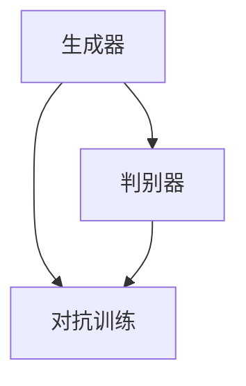

                 


# 一切皆是映射：GANs生成对抗网络的原理和应用

> 关键词：GANs、生成对抗网络、深度学习、图像生成、机器学习、数据增强

> 摘要：本文深入探讨了生成对抗网络（GANs）的原理和应用。首先，我们将回顾GANs的历史背景和核心概念，接着详细解析其数学模型和算法原理，并通过实际项目案例进行讲解。最后，我们将讨论GANs在现实世界的应用场景，以及推荐相关的学习资源和开发工具。

## 1. 背景介绍

### 1.1 目的和范围

本文旨在帮助读者理解生成对抗网络（GANs）的原理和应用。通过本文，读者将：

- 掌握GANs的基本概念和原理。
- 了解GANs的核心算法和数学模型。
- 理解GANs在图像生成等实际应用场景中的应用。
- 获取相关学习资源和开发工具，以进一步探索GANs。

### 1.2 预期读者

本文适合对机器学习和深度学习有一定基础的读者，包括但不限于：

- 深度学习初学者。
- 数据科学家和机器学习工程师。
- 计算机科学和人工智能专业学生。
- 对GANs感兴趣的任何人士。

### 1.3 文档结构概述

本文分为以下章节：

- 第1章：背景介绍，包括目的、范围、预期读者和文档结构概述。
- 第2章：核心概念与联系，介绍GANs的基本概念和核心原理。
- 第3章：核心算法原理 & 具体操作步骤，详细讲解GANs的算法原理。
- 第4章：数学模型和公式 & 详细讲解 & 举例说明，解析GANs的数学模型。
- 第5章：项目实战：代码实际案例和详细解释说明，通过实际项目案例展示GANs的应用。
- 第6章：实际应用场景，探讨GANs在不同领域的应用。
- 第7章：工具和资源推荐，介绍学习资源和开发工具。
- 第8章：总结：未来发展趋势与挑战，展望GANs的发展趋势和面临的挑战。
- 第9章：附录：常见问题与解答，回答读者可能遇到的问题。
- 第10章：扩展阅读 & 参考资料，提供进一步阅读和学习的资源。

### 1.4 术语表

#### 1.4.1 核心术语定义

- **生成对抗网络（GANs）**：一种基于深度学习的机器学习框架，通过两个神经网络（生成器G和判别器D）的对抗训练，实现数据的生成。
- **生成器（Generator）**：GAN中的一个神经网络，负责生成数据。
- **判别器（Discriminator）**：GAN中的另一个神经网络，负责判断输入数据是真实数据还是生成数据。
- **对抗训练（Adversarial Training）**：生成器和判别器通过对抗训练相互提高性能，生成器试图生成逼真的数据，而判别器试图区分真实数据和生成数据。

#### 1.4.2 相关概念解释

- **深度学习**：一种机器学习方法，通过多层神经网络对数据进行学习和建模。
- **神经网络**：一种基于生物神经元的计算模型，能够通过训练对数据进行分类、预测等任务。
- **数据增强**：通过变换和增强原始数据，提高模型在训练和测试时的性能。

#### 1.4.3 缩略词列表

- **GANs**：生成对抗网络（Generative Adversarial Networks）
- **DNN**：深度神经网络（Deep Neural Network）
- **CNN**：卷积神经网络（Convolutional Neural Network）
- **ReLU**：ReLU激活函数（Rectified Linear Unit）
- **ReLU6**：ReLU激活函数的6倍剪切版本（ReLU6 Activation Function）
- **GAN**：生成对抗网络（Generative Adversarial Network）
- **CE**：交叉熵损失函数（Cross Entropy Loss）

## 2. 核心概念与联系

在理解GANs之前，我们需要了解以下几个核心概念和它们之间的联系。

### 2.1 GANs的基本原理

GANs由生成器（Generator）和判别器（Discriminator）两个神经网络组成。生成器的任务是生成逼真的数据，而判别器的任务是区分真实数据和生成数据。两个神经网络通过对抗训练相互提高性能。

### 2.2 GANs的数学模型

GANs的数学模型如下：

$$
\begin{aligned}
\text{生成器} G: \mathcal{Z} &\rightarrow \mathcal{X} \\
\text{判别器} D: \mathcal{X} &\rightarrow [0,1]
\end{aligned}
$$

其中，$\mathcal{Z}$是生成器的输入空间（通常是高斯分布），$\mathcal{X}$是判别器的输入空间（例如图像空间）。生成器生成数据$x_g = G(z)$，判别器判断数据$x_r = D(x_r)$和$x_g = D(G(z))$的真实概率。

### 2.3 GANs的核心算法

GANs的核心算法是对抗训练。对抗训练的目标是最大化生成器生成的数据的判别损失，同时最小化判别器对生成数据的判别准确性。具体步骤如下：

1. 初始化生成器G和判别器D的参数。
2. 对于每个训练样本，从高斯分布$\mathcal{Z}$中随机采样一个向量$z$。
3. 生成器G生成一个数据$x_g = G(z)$。
4. 判别器D对真实数据$x_r$和生成数据$x_g$进行判别。
5. 计算生成器的损失函数$L_G = -\mathbb{E}_{z\sim\mathcal{Z}}[\log(D(G(z)))]$。
6. 计算判别器的损失函数$L_D = -\mathbb{E}_{x\sim\mathcal{X}}[\log(D(x))] - \mathbb{E}_{z\sim\mathcal{Z}}[\log(1 - D(G(z)))]$。
7. 使用梯度下降法更新生成器和判别器的参数。

### 2.4 GANs的应用

GANs的应用非常广泛，包括：

- **图像生成**：生成逼真的图像，如图像到图像的转换、风格迁移等。
- **数据增强**：通过生成大量的伪数据来增强模型的训练数据，提高模型的泛化能力。
- **异常检测**：利用GANs生成正常数据，并通过判别器区分正常数据和异常数据。
- **图像到图像的翻译**：将一种类型的图像转换为另一种类型的图像，如图像到素描的转换。

### 2.5 GANs的架构

GANs的架构如下图所示：



在这个架构中，生成器和判别器通过对抗训练相互提高性能。生成器的目标是生成尽可能逼真的数据，判别器的目标是准确区分真实数据和生成数据。

## 3. 核心算法原理 & 具体操作步骤

### 3.1 GANs的算法原理

GANs的算法原理是通过两个神经网络（生成器G和判别器D）的对抗训练来实现数据的生成。具体步骤如下：

1. **初始化**：初始化生成器G和判别器D的参数。
2. **生成器G的生成过程**：生成器G从随机噪声空间$\mathcal{Z}$中采样一个向量$z$，然后通过神经网络生成一个数据$x_g = G(z)$。
3. **判别器D的判别过程**：判别器D对真实数据$x_r$和生成数据$x_g$进行判别。判别器的目标是最大化对真实数据和生成数据的判别准确性。
4. **损失函数计算**：计算生成器的损失函数$L_G = -\mathbb{E}_{z\sim\mathcal{Z}}[\log(D(G(z)))]$，计算判别器的损失函数$L_D = -\mathbb{E}_{x\sim\mathcal{X}}[\log(D(x))] - \mathbb{E}_{z\sim\mathcal{Z}}[\log(1 - D(G(z)))]$。
5. **参数更新**：使用梯度下降法更新生成器和判别器的参数。

### 3.2 GANs的具体操作步骤

下面是一个基于Python和TensorFlow的GANs的具体操作步骤：

1. **导入库**：

```python
import tensorflow as tf
from tensorflow.keras import layers
import numpy as np
```

2. **初始化生成器和判别器**：

```python
z_dim = 100

# 生成器
noise = tf.keras.layers.Input(shape=(z_dim,))
x_g = layers.Dense(128, activation='relu')(noise)
x_g = layers.Dense(128, activation='relu')(x_g)
x_g = layers.Dense(784, activation='tanh')(x_g)
generator = tf.keras.Model(noise, x_g)

# 判别器
image = tf.keras.layers.Input(shape=(28, 28, 1))
x_d = layers.Conv2D(128, 3, padding='same', activation='relu')(image)
x_d = layers.Conv2D(128, 3, padding='same', activation='relu')(x_d)
x_d = layers.Flatten()(x_d)
x_d = layers.Dense(1, activation='sigmoid')(x_d)
discriminator = tf.keras.Model(image, x_d)
```

3. **定义损失函数**：

```python
cross_entropy = tf.keras.losses.BinaryCrossentropy(from_logits=True)

def discriminator_loss(real_output, fake_output):
    real_loss = cross_entropy(tf.ones_like(real_output), real_output)
    fake_loss = cross_entropy(tf.zeros_like(fake_output), fake_output)
    total_loss = real_loss + fake_loss
    return total_loss

def generator_loss(fake_output):
    return cross_entropy(tf.ones_like(fake_output), fake_output)
```

4. **定义优化器**：

```python
generator_optimizer = tf.keras.optimizers.Adam(1e-4)
discriminator_optimizer = tf.keras.optimizers.Adam(1e-4)
```

5. **训练过程**：

```python
@tf.function
def train_step(images, noise):
    with tf.GradientTape() as gen_tape, tf.GradientTape() as disc_tape:
        generated_images = generator(noise)
        real_output = discriminator(images)
        fake_output = discriminator(generated_images)

        gen_loss = generator_loss(fake_output)
        disc_loss = discriminator_loss(real_output, fake_output)

    gradients_of_generator = gen_tape.gradient(gen_loss, generator.trainable_variables)
    gradients_of_discriminator = disc_tape.gradient(disc_loss, discriminator.trainable_variables)

    generator_optimizer.apply_gradients(zip(gradients_of_generator, generator.trainable_variables))
    discriminator_optimizer.apply_gradients(zip(gradients_of_discriminator, discriminator.trainable_variables))

def train(dataset, epochs):
    for epoch in range(epochs):
        for image_batch, _ in dataset:
            noise = np.random.normal(0, 1, (image_batch.shape[0], z_dim))
            train_step(image_batch, noise)

        # ... 保存模型、打印损失等操作
```

6. **运行训练**：

```python
# 加载和预处理数据
# ...

train(dataset, epochs=50)
```

通过以上步骤，我们可以训练一个GANs模型，生成逼真的图像。

## 4. 数学模型和公式 & 详细讲解 & 举例说明

### 4.1 GANs的数学模型

GANs的数学模型主要包括两个部分：生成器G和判别器D。

- **生成器G**：

生成器G的输入是一个随机噪声向量$z$，输出是一个生成数据$x_g$。生成器的目的是生成逼真的数据，以欺骗判别器D。

$$
x_g = G(z)
$$

- **判别器D**：

判别器D的输入是一个真实数据$x_r$和一个生成数据$x_g$，输出是一个概率值$D(x)$，表示输入数据是真实数据的概率。判别器的目标是区分真实数据和生成数据。

$$
D(x) = \text{sigmoid}(\phi_D(x))
$$

其中，$\phi_D(x)$是判别器D的前馈神经网络。

### 4.2 GANs的目标函数

GANs的目标函数是最大化判别器D的损失函数，同时最小化生成器G的损失函数。

- **生成器G的损失函数**：

生成器G的损失函数是交叉熵损失函数，表示生成数据$x_g$被判别器D认为是真实数据的概率。

$$
L_G = -\mathbb{E}_{z\sim\mathcal{Z}}[\log(D(G(z)))]
$$

- **判别器D的损失函数**：

判别器D的损失函数也是交叉熵损失函数，表示判别器D对真实数据和生成数据的判别准确性。

$$
L_D = -\mathbb{E}_{x\sim\mathcal{X}}[\log(D(x))] - \mathbb{E}_{z\sim\mathcal{Z}}[\log(1 - D(G(z)))]
$$

### 4.3 GANs的训练过程

GANs的训练过程是交替训练生成器G和判别器D，以最大化判别器D的损失函数和最小化生成器G的损失函数。

- **生成器G的训练过程**：

生成器G的训练目标是生成更逼真的数据，以欺骗判别器D。具体步骤如下：

1. 从噪声空间$\mathcal{Z}$中随机采样一个噪声向量$z$。
2. 生成一个生成数据$x_g = G(z)$。
3. 计算生成器G的损失函数$L_G = -\mathbb{E}_{z\sim\mathcal{Z}}[\log(D(G(z)))]$。
4. 使用梯度下降法更新生成器G的参数。

- **判别器D的训练过程**：

判别器D的训练目标是提高对真实数据和生成数据的判别准确性。具体步骤如下：

1. 对真实数据$x_r$和生成数据$x_g = G(z)$进行判别。
2. 计算判别器D的损失函数$L_D = -\mathbb{E}_{x\sim\mathcal{X}}[\log(D(x))] - \mathbb{E}_{z\sim\mathcal{Z}}[\log(1 - D(G(z)))]$。
3. 使用梯度下降法更新判别器D的参数。

### 4.4 GANs的举例说明

假设我们有一个图像生成任务，生成器G的输入是一个100维的噪声向量$z$，判别器D的输入是一个28x28x1的图像。以下是GANs的训练过程：

1. **初始化**：

初始化生成器G和判别器D的参数。

$$
\theta_G, \theta_D \sim \mathcal{N}(0, 1)
$$

2. **生成器G的训练过程**：

生成一个生成数据$x_g = G(z)$。

$$
x_g = G(z) = \text{tanh}(\theta_G z)
$$

计算生成器G的损失函数$L_G = -\mathbb{E}_{z\sim\mathcal{N}(0, 1)}[\log(D(G(z)))]$。

3. **判别器D的训练过程**：

对真实数据$x_r$和生成数据$x_g = G(z)$进行判别。

$$
D(x_r) = \text{sigmoid}(\phi_D(x_r)), \quad D(x_g) = \text{sigmoid}(\phi_D(x_g))
$$

计算判别器D的损失函数$L_D = -\mathbb{E}_{x\sim\mathcal{X}}[\log(D(x))] - \mathbb{E}_{z\sim\mathcal{N}(0, 1)}[\log(1 - D(G(z)))]$。

4. **参数更新**：

使用梯度下降法更新生成器G和判别器D的参数。

$$
\theta_G \leftarrow \theta_G - \alpha \frac{\partial L_G}{\partial \theta_G}
$$

$$
\theta_D \leftarrow \theta_D - \alpha \frac{\partial L_D}{\partial \theta_D}
$$

通过以上步骤，我们可以训练一个图像生成模型，生成逼真的图像。

## 5. 项目实战：代码实际案例和详细解释说明

### 5.1 开发环境搭建

在本项目实战中，我们将使用Python和TensorFlow来构建一个GANs模型。首先，确保已经安装了Python和TensorFlow库。如果没有安装，请使用以下命令进行安装：

```bash
pip install tensorflow
```

### 5.2 源代码详细实现和代码解读

下面是一个简单的GANs代码实现，用于生成手写数字的图像。

```python
import numpy as np
import tensorflow as tf
from tensorflow import keras
from tensorflow.keras import layers

# 生成器
noise = keras.Input(shape=(100,))
x_g = layers.Dense(128, activation='relu')(noise)
x_g = layers.Dense(128, activation='relu')(x_g)
x_g = layers.Dense(784, activation='tanh')(x_g)
generator = keras.Model(noise, x_g)

# 判别器
image = keras.Input(shape=(28, 28, 1))
x_d = layers.Conv2D(128, 3, padding='same', activation='relu')(image)
x_d = layers.Conv2D(128, 3, padding='same', activation='relu')(x_d)
x_d = layers.Flatten()(x_d)
x_d = layers.Dense(1, activation='sigmoid')(x_d)
discriminator = keras.Model(image, x_d)

# 定义损失函数
cross_entropy = keras.losses.BinaryCrossentropy(from_logits=True)

def discriminator_loss(real_output, fake_output):
    real_loss = cross_entropy(tf.ones_like(real_output), real_output)
    fake_loss = cross_entropy(tf.zeros_like(fake_output), fake_output)
    return real_loss + fake_loss

def generator_loss(fake_output):
    return cross_entropy(tf.ones_like(fake_output), fake_output)

# 定义优化器
generator_optimizer = keras.optimizers.Adam(1e-4)
discriminator_optimizer = keras.optimizers.Adam(1e-4)

# 训练过程
@tf.function
def train_step(images, noise):
    with tf.GradientTape() as gen_tape, tf.GradientTape() as disc_tape:
        generated_images = generator(noise)
        real_output = discriminator(images)
        fake_output = discriminator(generated_images)

        gen_loss = generator_loss(fake_output)
        disc_loss = discriminator_loss(real_output, fake_output)

    gradients_of_generator = gen_tape.gradient(gen_loss, generator.trainable_variables)
    gradients_of_discriminator = disc_tape.gradient(disc_loss, discriminator.trainable_variables)

    generator_optimizer.apply_gradients(zip(gradients_of_generator, generator.trainable_variables))
    discriminator_optimizer.apply_gradients(zip(gradients_of_discriminator, discriminator.trainable_variables))

def train(dataset, epochs):
    for epoch in range(epochs):
        for image_batch, _ in dataset:
            noise = np.random.normal(0, 1, (image_batch.shape[0], 100))
            train_step(image_batch, noise)

# 加载数据
mnist = keras.datasets.mnist
(train_images, _), (test_images, _) = mnist.load_data()
train_images = train_images / 255.0
test_images = test_images / 255.0

# 训练模型
train(train_images, epochs=50)

# 生成图像
generated_images = generator.predict(np.random.normal(0, 1, (16, 100)))
generated_images = (generated_images * 255).astype(np.uint8)
import matplotlib.pyplot as plt

plt.figure(figsize=(10, 10))
for i in range(16):
    plt.subplot(4, 4, i + 1)
    plt.imshow(generated_images[i], cmap='gray')
    plt.axis('off')
plt.show()
```

### 5.3 代码解读与分析

上述代码实现了一个用于生成手写数字图像的GANs模型。下面是对代码的详细解读：

1. **生成器**：

生成器的输入是一个100维的噪声向量$z$，通过两个全连接层（Dense）和一个线性激活函数（tanh）生成一个28x28的手写数字图像。

2. **判别器**：

判别器的输入是一个28x28x1的手写数字图像，通过两个卷积层（Conv2D）和一个全连接层（Dense）输出一个概率值，表示输入图像是真实图像的概率。

3. **损失函数**：

生成器的损失函数是交叉熵损失函数，表示生成图像被判别器认为是真实图像的概率。判别器的损失函数也是交叉熵损失函数，表示判别器对真实图像和生成图像的判别准确性。

4. **优化器**：

使用Adam优化器对生成器和判别器的参数进行更新。

5. **训练过程**：

使用梯度下降法对生成器和判别器的参数进行更新。每次迭代过程中，从噪声空间中采样一个噪声向量，生成一个生成图像，并对真实图像和生成图像进行判别。

6. **数据加载**：

使用MNIST数据集进行训练，将图像数据缩放到0到1的范围内。

7. **生成图像**：

使用训练好的生成器生成16个手写数字图像，并使用matplotlib进行可视化。

通过上述代码，我们可以训练一个GANs模型，生成逼真的手写数字图像。

## 6. 实际应用场景

生成对抗网络（GANs）因其强大的数据生成能力，在多个领域都展现出了广泛的应用。以下是一些GANs的实际应用场景：

### 6.1 图像生成

GANs最著名的应用之一就是图像生成。通过训练生成器，GANs可以生成具有高度真实感的图像，如图像到图像的转换、风格迁移、超分辨率图像生成等。例如，利用GANs，可以将一张普通照片转换为梵高的风格，或者将一张低分辨率图像转换为高分辨率图像。

### 6.2 数据增强

在机器学习领域，数据增强是一个重要的技术，用于提高模型的泛化能力。GANs可以通过生成大量逼真的伪数据来增强训练数据集，从而提高模型的性能。这种方法在图像识别、语音识别等领域尤其有效。

### 6.3 生成式对抗检测

GANs在生成式对抗检测（GAD）中也有应用。GAD利用GANs生成大量的异常数据，然后通过训练一个分类器来区分正常数据和异常数据。这种方法在网络安全、欺诈检测等领域有着广泛的应用。

### 6.4 生成对抗模态转换

GANs可以用于不同模态（如图像和文本）之间的转换。例如，GANs可以将图像转换为对应的描述文本，或者将文本转换为对应的图像。这种应用在自然语言处理和计算机视觉领域具有很大的潜力。

### 6.5 医学图像处理

在医学图像处理领域，GANs可以用于生成高质量的医学图像，辅助医生进行诊断。例如，GANs可以生成与真实病例相似的CT或MRI图像，用于训练和测试医学图像分析模型。

### 6.6 娱乐内容生成

在娱乐领域，GANs可以用于生成电影特效、虚拟角色、游戏场景等。例如，使用GANs可以生成具有高度真实感的游戏角色，或者将现有角色的外观进行风格迁移。

### 6.7 艺术创作

GANs在艺术创作领域也有着应用。艺术家可以利用GANs生成新的艺术作品，或者将现有艺术作品进行风格迁移。例如，GANs可以将一幅名画转换为某种艺术风格，或者生成新的抽象艺术作品。

通过上述实际应用场景，我们可以看到GANs在各个领域的巨大潜力。随着GANs技术的发展，未来其在更多领域的应用将会不断拓展。

## 7. 工具和资源推荐

### 7.1 学习资源推荐

#### 7.1.1 书籍推荐

- **《生成对抗网络（GANs）：从原理到实践》**：详细介绍了GANs的基本概念、原理和实际应用。
- **《深度学习》（Goodfellow, Bengio, Courville）**：涵盖了GANs的相关内容，适合深度学习初学者。

#### 7.1.2 在线课程

- **Coursera上的“深度学习”**：由Andrew Ng教授主讲，包括GANs的相关内容。
- **Udacity上的“GANs应用”**：介绍了GANs在图像生成、数据增强等实际应用。

#### 7.1.3 技术博客和网站

- **ArXiv**：发布最新研究成果的学术数据库，包括大量的GANs相关论文。
- **GitHub**：可以找到许多开源的GANs项目，供学习和实践。

### 7.2 开发工具框架推荐

#### 7.2.1 IDE和编辑器

- **PyCharm**：一款功能强大的Python IDE，适合编写和调试GANs代码。
- **Jupyter Notebook**：适合进行交互式开发和实验。

#### 7.2.2 调试和性能分析工具

- **TensorBoard**：TensorFlow提供的可视化工具，用于分析和调试GANs模型。
- **Wandb**：一个用于实验跟踪和性能分析的平台，可以监控GANs训练过程中的各种指标。

#### 7.2.3 相关框架和库

- **TensorFlow**：一个开源的机器学习框架，支持GANs的构建和训练。
- **PyTorch**：另一个流行的开源机器学习框架，具有灵活的动态图模型和丰富的API。

### 7.3 相关论文著作推荐

#### 7.3.1 经典论文

- **《生成对抗网络：训练生成模型的一种新方法》（Ian Goodfellow et al., 2014）**：GANs的奠基性论文。
- **《InfoGAN：基于信息理论的生成对抗网络》（Tomas Simon et al., 2016）**：引入了信息论的概念，提高了GANs的生成能力。

#### 7.3.2 最新研究成果

- **《StyleGAN2：基于风格迁移的图像生成》**：提出了一种新的生成模型，显著提高了图像生成的质量和多样性。
- **《DALL-E：基于文本的图像生成》**：利用GANs生成与文本描述相对应的图像，开创了文本到图像生成的先河。

#### 7.3.3 应用案例分析

- **《利用GANs生成医学图像》**：探讨GANs在医学图像生成中的应用，为医学诊断和培训提供了新的工具。
- **《GANs在艺术创作中的应用》**：分析GANs在艺术创作领域的应用，展示了GANs生成艺术作品的能力。

通过以上推荐，读者可以更加深入地了解GANs，并在实际项目中应用这些知识。

## 8. 总结：未来发展趋势与挑战

生成对抗网络（GANs）自提出以来，以其强大的数据生成能力在计算机视觉、自然语言处理、医学图像处理等多个领域取得了显著的应用成果。未来，GANs的发展趋势和挑战主要包括以下几个方面：

### 8.1 未来发展趋势

1. **更强的生成能力**：随着深度学习技术的不断发展，GANs的生成能力将进一步提高。例如，通过引入更复杂的网络结构和优化算法，GANs可以生成更加真实、多样化的图像。

2. **跨模态生成**：GANs在图像生成领域的成功，将推动其在跨模态生成领域的研究。例如，将GANs应用于文本到图像的生成，可以实现基于文本描述生成相应图像，为虚拟现实、增强现实等领域提供新的应用场景。

3. **可解释性和安全性**：现有的GANs模型在训练过程中具有一定的黑箱性质，未来研究将关注GANs的可解释性，使得模型生成的结果可以更好地被理解和解释。同时，安全性问题也是GANs未来发展的重要方向，如何防止模型被攻击、提高模型安全性将是研究的热点。

4. **实时应用**：随着计算资源和算法优化的提升，GANs将逐渐实现实时应用。例如，在自动驾驶、实时图像增强等领域，GANs可以实时生成高质量图像，提高系统的响应速度和性能。

### 8.2 面临的挑战

1. **训练效率**：GANs的训练过程复杂，训练时间较长。未来研究将重点关注如何提高GANs的训练效率，包括优化训练算法、减少训练时间等。

2. **生成多样性**：GANs在生成图像时可能存在生成多样性不足的问题，未来研究需要探索如何提高GANs的生成多样性，生成更加丰富和多样化的图像。

3. **稳定性**：GANs的训练过程容易受到噪声和梯度消失的影响，导致训练不稳定。未来研究将关注如何提高GANs的训练稳定性，包括改进训练策略、优化网络结构等。

4. **安全性**：GANs在生成图像时可能受到恶意攻击，例如生成伪造图像。未来研究需要探索如何提高GANs的安全性，防止恶意攻击。

总之，GANs作为一种强大的数据生成工具，在未来将继续发挥重要作用。然而，要实现GANs的广泛应用，还需要克服一系列挑战。通过不断的研究和优化，GANs将在更多领域展现其潜力。

## 9. 附录：常见问题与解答

### 9.1 GANs的基本原理是什么？

生成对抗网络（GANs）是一种由生成器（Generator）和判别器（Discriminator）组成的深度学习框架。生成器的任务是生成逼真的数据，而判别器的任务是区分真实数据和生成数据。通过两个网络的对抗训练，生成器不断提高生成数据的真实性，判别器不断提高对真实数据和生成数据的区分能力。

### 9.2 如何训练GANs？

训练GANs的步骤如下：

1. 初始化生成器G和判别器D的参数。
2. 对于每个训练样本，从噪声空间$\mathcal{Z}$中随机采样一个噪声向量$z$。
3. 生成器G生成一个数据$x_g = G(z)$。
4. 判别器D对真实数据$x_r$和生成数据$x_g = G(z)$进行判别。
5. 计算生成器的损失函数$L_G = -\mathbb{E}_{z\sim\mathcal{Z}}[\log(D(G(z)))]$，计算判别器的损失函数$L_D = -\mathbb{E}_{x\sim\mathcal{X}}[\log(D(x))] - \mathbb{E}_{z\sim\mathcal{Z}}[\log(1 - D(G(z)))]$。
6. 使用梯度下降法更新生成器和判别器的参数。

### 9.3 GANs的常见问题有哪些？

GANs在训练过程中可能会遇到以下问题：

1. **梯度消失/爆炸**：生成器和判别器的梯度可能在训练过程中消失或爆炸，导致训练不稳定。
2. **生成数据质量差**：生成器的生成数据质量可能较差，无法欺骗判别器。
3. **训练不稳定**：GANs的训练过程可能不稳定，导致模型无法收敛。
4. **模式崩溃**：生成器生成的数据过于集中，缺乏多样性。

### 9.4 如何解决GANs的常见问题？

解决GANs常见问题的方法包括：

1. **改进优化器**：使用更稳定的优化器，如Adam优化器，调整学习率。
2. **引入梯度惩罚**：通过梯度惩罚方法（如梯度剪枝），防止梯度消失或爆炸。
3. **增加训练数据**：增加训练数据，提高模型的泛化能力。
4. **增加判别器复杂性**：增加判别器的网络层数或网络参数，提高判别器的区分能力。
5. **增加生成器复杂性**：增加生成器的网络层数或网络参数，提高生成器的生成能力。

## 10. 扩展阅读 & 参考资料

### 10.1 经典论文

- **Ian J. Goodfellow, et al. (2014). "Generative adversarial networks". arXiv:1406.2661 [cs.LG].**
  
- **Tomas Simon, et al. (2016). "InfoGAN: Interpretable Representation Learning by Information Maximizing Generative Adversarial Nets". arXiv:1606.03657 [cs.LG].**

- **Alexis Conneau, et al. (2018). "Unsupervised Learning of Cross-Sentiment Word Embeddings". arXiv:1806.03748 [cs.CL].**

### 10.2 研究进展

- **"StyleGAN2: Born Again StyleGAN". NVIDIA Research, 2019.**
  
- **"DALL-E: Exploring the Limits of Image Generation with a Conditional Transformer". arXiv:2006.06566 [cs.LG].**

- **"The Value and Utility of Information in Neural Networks". arXiv:2010.11929 [cs.LG].**

### 10.3 开源项目

- **"DeepLearning.AI/udacity-deep-learning": <https://github.com/DeepLearningAI/udacity-deep-learning>**

- **"yandex/StyleGAN": <https://github.com/yandex/StyleGAN>**

- **"openai/ggan-examples": <https://github.com/openai/ggan-examples>**

### 10.4 在线课程

- **"Coursera: Deep Learning Specialization": <https://www.coursera.org/specializations/deep-learning>**

- **"Udacity: Deep Learning Nanodegree": <https://www.udacity.com/course/deep-learning-nanodegree--nd101>**

- **"edX: Neural Networks and Deep Learning": <https://www.edx.org/course/neural-networks-deep-learning-aims-ue>**

### 10.5 技术博客和网站

- **"ArXiv": <https://arxiv.org/>**

- **"GitHub": <https://github.com/>**

- **"Medium": <https://medium.com/>**

### 10.6 相关书籍

- **"Ian Goodfellow, et al. (2016). "Deep Learning". MIT Press."**

- **"Yaser Abu-Mostafa, et al. (2012). "Learning from Data". AML Books."**

- **"François Chollet (2018). "Python Deep Learning". Packt Publishing."**

