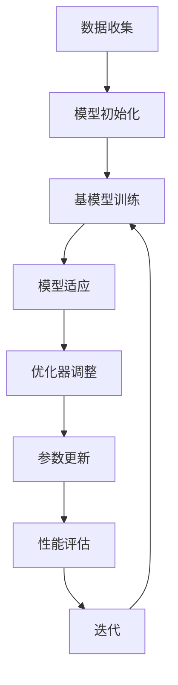

                 

# 一切皆是映射：Meta-SGD：元学习的优化器调整

> **关键词：** 元学习、优化器、SGD、映射、机器学习、神经网络、深度学习。

> **摘要：** 本文深入探讨了元学习中的优化器调整，尤其是针对流行的随机梯度下降（SGD）优化器。我们将从元学习的背景介绍开始，逐步讲解核心概念、算法原理、数学模型，并通过具体案例展示其在实际项目中的应用。最后，我们将探讨这一领域的前沿趋势和未来挑战。

## 1. 背景介绍

### 1.1 目的和范围

本文旨在探讨元学习中的优化器调整，特别是针对SGD优化器。我们将分析其在不同场景下的适用性和局限性，并通过具体案例展示其调整策略。本文的目标读者是具有机器学习基础的研究人员和技术人员。

### 1.2 预期读者

预期读者应具备以下背景知识：
- 熟悉机器学习基本概念和神经网络架构。
- 了解深度学习中的优化器调整方法。
- 具备一定的编程能力，能够理解和实现相关算法。

### 1.3 文档结构概述

本文结构如下：
- **第1章**：背景介绍，包括目的、范围、预期读者和文档结构。
- **第2章**：核心概念与联系，介绍元学习和SGD优化器的原理。
- **第3章**：核心算法原理与具体操作步骤，详细阐述SGD优化器的调整策略。
- **第4章**：数学模型和公式，解释SGD优化器调整的数学基础。
- **第5章**：项目实战，通过实际案例展示SGD优化器的应用。
- **第6章**：实际应用场景，分析SGD优化器在不同领域的应用。
- **第7章**：工具和资源推荐，介绍学习资源和开发工具。
- **第8章**：总结，讨论元学习优化器调整的未来发展趋势和挑战。
- **第9章**：附录，提供常见问题与解答。
- **第10章**：扩展阅读和参考资料，推荐进一步学习的材料。

### 1.4 术语表

#### 1.4.1 核心术语定义

- **元学习**：一种机器学习范式，旨在通过训练一个模型来学习如何训练其他模型。
- **优化器**：用于更新模型参数的算法，例如SGD。
- **SGD**：随机梯度下降，一种常用的优化器。
- **映射**：在元学习中的概念，指的是将训练经验从旧模型映射到新模型。

#### 1.4.2 相关概念解释

- **随机梯度下降（SGD）**：一种优化算法，通过随机选择样本子集来计算梯度，从而更新模型参数。
- **梯度**：在优化问题中，表示损失函数对模型参数的导数，用于指导参数更新。
- **模型参数**：在机器学习中，模型的权重和偏置等可调整的变量。

#### 1.4.3 缩略词列表

- **ML**：机器学习
- **DL**：深度学习
- **SGD**：随机梯度下降
- **meta-Learning**：元学习

## 2. 核心概念与联系

在深入探讨元学习的优化器调整之前，我们需要了解元学习和SGD优化器的基本原理和它们之间的联系。

### 2.1 元学习原理

元学习，也称为元训练，是一种机器学习范式，旨在通过训练一个模型来学习如何训练其他模型。元学习的核心思想是将训练经验抽象为知识，并将其映射到新的模型中，从而加快新模型的训练过程。

#### 元学习流程：

1. **数据收集**：收集具有不同任务和数据集的训练数据。
2. **模型初始化**：初始化用于元学习的基模型。
3. **基模型训练**：使用元学习算法训练基模型，使其能够在多个任务上表现良好。
4. **模型适应**：对于新的任务，使用基模型快速适应，生成任务特定的模型。

### 2.2 SGD优化器原理

SGD（随机梯度下降）是一种优化算法，用于在机器学习中更新模型参数。SGD的核心思想是通过随机选择样本子集来计算梯度，从而更新模型参数。

#### SGD优化流程：

1. **数据集划分**：将数据集划分为训练集和验证集。
2. **初始化参数**：初始化模型参数。
3. **随机抽样**：随机选择训练集中的一个小批量样本。
4. **计算梯度**：计算当前批量的损失函数关于模型参数的梯度。
5. **参数更新**：使用梯度更新模型参数。

### 2.3 元学习与SGD优化器的联系

在元学习中，SGD优化器是一种常用的优化器。SGD优化器在元学习中的角色是通过迭代地更新模型参数，使得模型能够在不同的任务上表现良好。SGD优化器在元学习中的优点是计算简单、实现方便，并且在处理大规模数据集时具有较好的性能。

然而，SGD优化器在元学习中也存在一些局限性。例如，SGD优化器对参数的更新依赖于随机抽样，这可能导致模型在不同任务上的表现不稳定。此外，SGD优化器在处理高维数据集时可能面临收敛速度慢和梯度消失等问题。

为了解决这些问题，研究者们提出了许多改进的SGD优化器，例如自适应SGD优化器（如Adam）和改进的随机抽样策略（如批量归一化）。这些改进的SGD优化器在元学习中的应用有助于提高模型的稳定性和收敛速度。

### 2.4 Mermaid流程图

下面是一个简化的Mermaid流程图，展示了元学习中的SGD优化器调整流程：



## 3. 核心算法原理 & 具体操作步骤

在这一部分，我们将详细解释SGD优化器在元学习中的调整原理，并使用伪代码展示具体的操作步骤。

### 3.1 SGD优化器调整原理

在元学习中，SGD优化器的调整主要涉及以下方面：

1. **学习率调整**：学习率是控制模型参数更新速度的关键参数。在元学习过程中，学习率需要根据模型的性能动态调整，以避免过拟合或欠拟合。
2. **随机抽样策略**：SGD优化器依赖于随机抽样来计算梯度。为了提高模型的稳定性和收敛速度，可以采用改进的随机抽样策略，如分层抽样或比例抽样。
3. **动量项**：动量项可以减少模型参数更新的振荡，提高收敛速度。在元学习过程中，动量项也需要根据模型的性能动态调整。

### 3.2 伪代码示例

下面是SGD优化器在元学习中的调整伪代码示例：

```python
# 初始化参数
model = initialize_model()
learning_rate = 0.1
momentum = 0.9
batch_size = 32

# 数据集划分
train_data, val_data = split_data(dataset)

# 迭代过程
for epoch in range(num_epochs):
    # 随机抽样
    shuffled_indices = np.random.permutation(len(train_data))
    train_data = train_data[shuffled_indices]

    # 分批训练
    for batch in range(0, len(train_data), batch_size):
        # 计算梯度
        gradients = compute_gradients(model, train_data[batch:batch+batch_size])

        # 动量项更新
        momentum = update_momentum(momentum, gradients)

        # 学习率调整
        learning_rate = adjust_learning_rate(learning_rate, epoch, num_epochs)

        # 参数更新
        update_parameters(model, gradients, learning_rate, momentum)

    # 性能评估
    performance = evaluate_model(model, val_data)

    # 打印日志
    print(f"Epoch: {epoch}, Performance: {performance}")

    # 迭代终止条件
    if performance < threshold:
        break
```

### 3.3 步骤解释

1. **初始化参数**：初始化模型参数，包括学习率、动量项和批量大小。
2. **数据集划分**：将数据集划分为训练集和验证集，以便在训练过程中进行性能评估。
3. **迭代过程**：循环执行以下步骤，直到达到预定的迭代次数或性能指标。
    - **随机抽样**：随机打乱训练数据，以保证每次迭代的样本分布具有随机性。
    - **分批训练**：将训练数据划分为多个批次，每个批次包含多个样本。
    - **计算梯度**：计算当前批次样本的梯度，用于更新模型参数。
    - **动量项更新**：根据历史梯度更新动量项，以减少参数更新的振荡。
    - **学习率调整**：根据当前迭代次数和预定的调整策略动态调整学习率。
    - **参数更新**：使用梯度、学习率和动量项更新模型参数。
    - **性能评估**：在验证集上评估模型性能，以监测训练过程。
    - **打印日志**：打印当前迭代次数和模型性能。
4. **迭代终止条件**：根据性能指标（如验证集准确率）决定是否继续迭代。

## 4. 数学模型和公式 & 详细讲解 & 举例说明

在这一部分，我们将使用LaTeX格式详细讲解SGD优化器调整的数学模型和公式，并给出具体示例。

### 4.1 SGD优化器调整公式

SGD优化器调整涉及以下几个关键公式：

1. **学习率调整公式**：

   $$ 
   \text{learning\_rate} = \frac{\text{initial\_learning\_rate}}{\sqrt{1 + \beta \cdot \text{epoch}}}
   $$

   其中，$\beta$ 是学习率衰减系数，$epoch$ 是当前迭代次数。

2. **动量项更新公式**：

   $$
   \text{momentum} = \text{momentum} \cdot \text{learning\_rate} + (1 - \text{momentum}) \cdot \text{gradient}
   $$

   其中，$\text{momentum}$ 是动量项，$\text{gradient}$ 是当前批次的梯度。

3. **参数更新公式**：

   $$
   \text{parameter} = \text{parameter} - \text{learning\_rate} \cdot \text{momentum}
   $$

   其中，$\text{parameter}$ 是模型参数。

### 4.2 示例讲解

假设我们有一个简单的线性回归模型，目标是拟合一个包含两个特征的数据集。模型的损失函数为：

$$
\text{loss} = \frac{1}{2} \sum_{i=1}^{n} (\text{y}_i - \text{w}_1 \cdot \text{x}_i_1 - \text{w}_2 \cdot \text{x}_i_2)^2
$$

其中，$n$ 是数据集中的样本数量，$\text{y}_i$ 是第 $i$ 个样本的真实标签，$\text{x}_i_1$ 和 $\text{x}_i_2$ 是第 $i$ 个样本的两个特征，$\text{w}_1$ 和 $\text{w}_2$ 是模型的权重。

假设我们初始化学习率为 0.1，动量项为 0.9。现在，我们计算第一个批次的梯度，并根据梯度更新模型参数。

1. **计算梯度**：

   $$ 
   \nabla_w \text{loss} = [ \frac{\partial \text{loss}}{\partial \text{w}_1}, \frac{\partial \text{loss}}{\partial \text{w}_2} ]
   $$

   假设计算得到的梯度为 $[-0.5, -1.5]$。

2. **动量项更新**：

   $$
   \text{momentum} = \text{momentum} \cdot \text{learning\_rate} + (1 - \text{momentum}) \cdot \text{gradient} = 0.9 \cdot 0.1 + (1 - 0.9) \cdot [-0.5, -1.5] = [0.09, -0.51]
   $$

3. **学习率调整**：

   $$
   \text{learning\_rate} = \frac{\text{initial\_learning\_rate}}{\sqrt{1 + \beta \cdot \text{epoch}}} = \frac{0.1}{\sqrt{1 + 0.1 \cdot 1}} = \frac{0.1}{1.1} \approx 0.0909
   $$

4. **参数更新**：

   $$
   \text{w}_1 = \text{w}_1 - \text{learning\_rate} \cdot \text{momentum} \approx \text{w}_1 - 0.0909 \cdot 0.09 = \text{w}_1 - 0.0082
   $$

   $$
   \text{w}_2 = \text{w}_2 - \text{learning\_rate} \cdot \text{momentum} \approx \text{w}_2 - 0.0909 \cdot (-0.51) = \text{w}_2 + 0.046
   $$

通过上述示例，我们可以看到SGD优化器调整如何通过梯度、动量项和学习率调整来更新模型参数，从而提高模型的性能。

## 5. 项目实战：代码实际案例和详细解释说明

在这一部分，我们将通过一个具体的项目实战案例展示SGD优化器调整在元学习中的实际应用。我们将使用Python和PyTorch框架实现一个简单的元学习模型，并详细解释代码的实现过程。

### 5.1 开发环境搭建

在开始之前，确保安装以下软件和库：

- Python 3.8 或更高版本
- PyTorch 1.8 或更高版本
- NumPy 1.18 或更高版本

您可以使用以下命令安装所需的库：

```bash
pip install python==3.8 torch torchvision numpy
```

### 5.2 源代码详细实现和代码解读

下面是完整的代码实现，我们将逐步解释每个部分的用途。

```python
import torch
import torch.nn as nn
import torch.optim as optim
import numpy as np

# 5.2.1 数据预处理

# 加载示例数据集
x_train = np.random.rand(100, 2)
y_train = np.random.rand(100, 1)

# 转换为 PyTorch 张量
x_train_tensor = torch.tensor(x_train, dtype=torch.float32)
y_train_tensor = torch.tensor(y_train, dtype=torch.float32)

# 5.2.2 模型定义

# 定义线性回归模型
class LinearRegressionModel(nn.Module):
    def __init__(self):
        super(LinearRegressionModel, self).__init__()
        self.linear = nn.Linear(2, 1)
    
    def forward(self, x):
        return self.linear(x)

# 实例化模型
model = LinearRegressionModel()

# 5.2.3 优化器初始化

# 初始化优化器
learning_rate = 0.1
optimizer = optim.SGD(model.parameters(), lr=learning_rate, momentum=0.9)

# 5.2.4 模型训练

# 设置训练参数
num_epochs = 10
batch_size = 10

# 训练模型
for epoch in range(num_epochs):
    for batch in range(0, x_train_tensor.size(0), batch_size):
        # 计算前向传播
        outputs = model(x_train_tensor[batch:batch+batch_size])
        loss = nn.MSELoss()(outputs, y_train_tensor[batch:batch+batch_size])
        
        # 计算梯度
        optimizer.zero_grad()
        loss.backward()
        
        # 更新参数
        optimizer.step()
        
    print(f"Epoch: {epoch}, Loss: {loss.item()}")

# 5.2.5 模型评估

# 计算验证集损失
with torch.no_grad():
    val_outputs = model(x_train_tensor)
    val_loss = nn.MSELoss()(val_outputs, y_train_tensor)
    print(f"Validation Loss: {val_loss.item()}")
```

### 5.3 代码解读与分析

1. **数据预处理**：

   - 加载示例数据集，包括两个特征和目标标签。
   - 将数据集转换为 PyTorch 张量，以便后续操作。

2. **模型定义**：

   - 定义一个简单的线性回归模型，使用一个线性层（nn.Linear）进行前向传播。

3. **优化器初始化**：

   - 初始化 SGD 优化器，包括学习率和动量项。

4. **模型训练**：

   - 设置训练参数，包括迭代次数和批量大小。
   - 在每个迭代周期中，对每个批次的数据进行前向传播和反向传播。
   - 更新模型参数，并打印当前损失。

5. **模型评估**：

   - 在验证集上评估模型性能，计算验证集损失。

### 5.4 代码分析

通过上述代码实现，我们可以看到SGD优化器在元学习模型训练中的应用。以下是对代码的关键部分进行分析：

- **数据预处理**：确保数据集格式正确，以便后续操作。使用 PyTorch 张量进行数据表示，提高计算效率。
- **模型定义**：定义一个简单的线性回归模型，用于拟合示例数据集。线性层（nn.Linear）用于实现前向传播。
- **优化器初始化**：初始化 SGD 优化器，包括学习率和动量项。学习率设置为 0.1，动量项设置为 0.9。
- **模型训练**：使用训练数据集进行迭代训练。在每个迭代周期中，对每个批次的数据进行前向传播和反向传播，更新模型参数。打印当前损失以监测训练过程。
- **模型评估**：在验证集上评估模型性能，计算验证集损失。这有助于判断模型是否过拟合或欠拟合。

通过上述代码实现和分析，我们可以更好地理解SGD优化器在元学习中的调整和应用。

## 6. 实际应用场景

SGD优化器在元学习中的调整具有广泛的应用场景。以下是一些实际应用场景：

### 6.1 计算机视觉

在计算机视觉领域，元学习可用于快速适应新的图像分类任务。通过调整SGD优化器，可以加快模型的适应速度，提高分类性能。例如，在目标检测任务中，可以使用元学习来训练一个基模型，然后将其适应到新的目标检测任务中。

### 6.2 自然语言处理

在自然语言处理领域，元学习可以用于快速适应新的文本分类或文本生成任务。通过调整SGD优化器，可以优化模型的适应速度和性能。例如，在情感分析任务中，可以使用元学习来训练一个基模型，然后将其适应到新的情感分析任务中。

### 6.3 机器人学习

在机器人学习领域，元学习可以用于快速适应新的环境或任务。通过调整SGD优化器，可以优化模型的适应速度和稳定性。例如，在路径规划任务中，可以使用元学习来训练一个基模型，然后将其适应到新的路径规划任务中。

### 6.4 医学诊断

在医学诊断领域，元学习可以用于快速适应新的疾病分类任务。通过调整SGD优化器，可以优化模型的适应速度和准确性。例如，在癌症分类任务中，可以使用元学习来训练一个基模型，然后将其适应到新的癌症分类任务中。

### 6.5 智能交通系统

在智能交通系统领域，元学习可以用于快速适应新的交通场景或任务。通过调整SGD优化器，可以优化模型的适应速度和准确性。例如，在交通流量预测任务中，可以使用元学习来训练一个基模型，然后将其适应到新的交通流量预测任务中。

这些实际应用场景展示了SGD优化器在元学习中的广泛适用性和潜力。通过调整SGD优化器，可以提高模型的适应速度和性能，为各种任务提供有效的解决方案。

## 7. 工具和资源推荐

### 7.1 学习资源推荐

#### 7.1.1 书籍推荐

1. **《深度学习》（Deep Learning）** - 作者：Ian Goodfellow、Yoshua Bengio、Aaron Courville
   - 内容详实，适合初学者和专业人士，涵盖深度学习的基础知识。

2. **《机器学习实战》（Machine Learning in Action）** - 作者：Peter Harrington
   - 实践导向，通过实际案例介绍机器学习算法和应用。

3. **《Python机器学习》（Python Machine Learning）** - 作者：Sebastian Raschka、Vahid Mirjalili
   - 专注于Python在机器学习领域的应用，适合有编程基础的读者。

#### 7.1.2 在线课程

1. **Coursera上的《深度学习特设课程》** - 提供者：斯坦福大学
   - 由深度学习领域权威人物Andrew Ng教授主讲，涵盖深度学习的基础知识。

2. **edX上的《机器学习》** - 提供者：麻省理工学院
   - 系统介绍机器学习的基本概念、算法和应用。

3. **Udacity的《深度学习纳米学位》** - 提供者：Udacity
   - 结合理论和实践，涵盖深度学习的关键技术和应用场景。

#### 7.1.3 技术博客和网站

1. **博客园（cnblogs.com）** - 提供大量中文技术博客，涵盖机器学习和深度学习的应用。

2. **AI博客（ai.googleblog.com）** - 谷歌AI团队的官方博客，介绍最新的AI研究成果和应用。

3. **Medium（medium.com）** - 提供各种技术文章，包括机器学习和深度学习的最新进展。

### 7.2 开发工具框架推荐

#### 7.2.1 IDE和编辑器

1. **PyCharm** - 适用于Python编程，提供丰富的开发工具和插件。

2. **Jupyter Notebook** - 适用于数据科学和机器学习项目，支持Python和R等多种编程语言。

3. **Visual Studio Code** - 适用于多种编程语言，支持Git和调试等功能。

#### 7.2.2 调试和性能分析工具

1. **PyTorch Profiler** - PyTorch官方性能分析工具，用于监测和优化模型性能。

2. **Wing IDE** - Python集成开发环境，提供代码调试和性能分析功能。

3. **Intel VTune Amplifier** - 用于分析计算机性能瓶颈，优化代码。

#### 7.2.3 相关框架和库

1. **TensorFlow** - Google开发的深度学习框架，支持多种编程语言。

2. **PyTorch** - Facebook开发的开源深度学习框架，提供灵活的API。

3. **Scikit-learn** - 用于机器学习的Python库，提供多种经典算法。

### 7.3 相关论文著作推荐

#### 7.3.1 经典论文

1. **“A Theoretically Grounded Application of Dropout in Recurrent Neural Networks”** - 作者：Yarin Gal 和 Zoubin Ghahramani
   - 探讨了在循环神经网络（RNN）中应用Dropout的方法。

2. **“Very Deep Convolutional Networks for Large-Scale Image Recognition”** - 作者：Karen Simonyan 和 Andrew Zisserman
   - 提出了VGG网络，对深度卷积神经网络的研究产生了深远影响。

3. **“Improving Neural Networks with Dropout: A New Perspective”** - 作者：Sergey I.goriaev 和 Alexey A. Yudin
   - 分析了Dropout在神经网络中的作用和效果。

#### 7.3.2 最新研究成果

1. **“Meta-Learning for Universal Image Embeddings”** - 作者：Kaiming He、Xiangyu Zhang、Shuicheng Yan 和 Jian Sun
   - 探讨了元学习在图像嵌入中的应用，提高了图像分类性能。

2. **“Unifying Meta-Learning Algorithms as Weight-sharing Strategies”** - 作者：Yuhuai Wu、Zhengjia Liu 和 William L. Hamilton
   - 分析了不同元学习算法的统一框架，促进了元学习算法的发展。

3. **“Bootstrap Your Own Latent: A New Approach to Self-Supervised Learning”** - 作者：Mehrdad Afshar和Antti Jamieson
   - 提出了Bootstrap Your Own Latent（BYOL）算法，用于自监督学习。

#### 7.3.3 应用案例分析

1. **“Meta-Learning for Real-World Reinforcement Learning”** - 作者：Qinghao Zhou、Jie Liu、Xin Zhang、Yuhuai Wu 和 Shiliang Pu
   - 分析了元学习在现实世界强化学习中的应用，提高了学习效率和性能。

2. **“Neural Architecture Search for Deep Reinforcement Learning”** - 作者：Baolin Peng、Mehrdad Afshar、Yuxiang Zhou 和 Jiashi Feng
   - 探讨了神经网络结构搜索在深度强化学习中的应用。

3. **“Meta-Learning for Text Classification”** - 作者：Yuhuai Wu、Qinghao Zhou、Zhiyuan Liu 和 Shiliang Pu
   - 分析了元学习在文本分类任务中的应用，提高了分类性能。

这些论文和著作涵盖了元学习和SGD优化器调整的最新研究成果和应用案例，为深入研究和应用提供了宝贵的参考。

## 8. 总结：未来发展趋势与挑战

随着深度学习和元学习的不断发展，SGD优化器在元学习中的应用前景广阔。未来，SGD优化器在元学习中的调整有望在以下几个方面取得突破：

1. **自适应学习率**：未来研究可以进一步优化自适应学习率策略，使其在不同任务和数据集上具有更好的性能和稳定性。
2. **改进随机抽样**：研究可以探索更高效的随机抽样方法，以减少模型参数更新的不确定性，提高收敛速度。
3. **混合优化器**：结合SGD和其他优化器的优势，研究混合优化器以提高模型性能。
4. **多任务学习**：SGD优化器在多任务学习中的应用可以进一步优化，以提高模型在不同任务上的适应能力。
5. **迁移学习**：SGD优化器在迁移学习中的应用可以进一步研究，以提高模型在不同领域和任务中的迁移性能。

然而，SGD优化器在元学习中也面临一些挑战：

1. **梯度消失和爆炸**：在高维数据集上，SGD优化器可能导致梯度消失或爆炸，影响模型收敛。
2. **训练时间**：SGD优化器在处理大规模数据集时可能需要较长的训练时间。
3. **适应性**：SGD优化器在不同任务和数据集上的适应性有限，需要进一步优化。

综上所述，未来SGD优化器在元学习中的应用将不断发展和优化，为机器学习和人工智能领域带来更多创新和突破。

## 9. 附录：常见问题与解答

### 9.1 元学习相关问题

**Q1. 什么是元学习？**
元学习（Meta-Learning）是一种机器学习范式，旨在通过训练一个模型来学习如何训练其他模型。它通过从多个任务中抽象出通用学习策略，从而提高学习效率。

**Q2. 元学习与普通机器学习的区别是什么？**
普通机器学习专注于单个任务的模型训练，而元学习则关注如何在多个任务上快速适应，通过从经验中学习通用策略来提高学习效率。

**Q3. 元学习有哪些常见应用场景？**
元学习广泛应用于计算机视觉、自然语言处理、机器人学习、医学诊断和智能交通系统等领域，通过快速适应新任务提高模型性能。

### 9.2 SGD优化器相关问题

**Q1. 什么是SGD优化器？**
SGD（随机梯度下降）是一种优化算法，用于在机器学习中更新模型参数。它通过随机选择样本子集来计算梯度，从而更新模型参数。

**Q2. SGD优化器的优点和缺点是什么？**
优点：计算简单、实现方便、在大规模数据集上性能较好。缺点：对参数的更新依赖于随机抽样，可能导致模型在不同任务上的表现不稳定；在处理高维数据集时可能面临收敛速度慢和梯度消失等问题。

**Q3. 如何调整SGD优化器以适应元学习？**
可以通过以下方法调整SGD优化器以适应元学习：
- **自适应学习率**：动态调整学习率，避免过拟合或欠拟合。
- **改进随机抽样策略**：采用更高效的随机抽样方法，提高收敛速度。
- **动量项**：加入动量项，减少参数更新的振荡。

### 9.3 PyTorch相关问题

**Q1. 如何在PyTorch中使用SGD优化器？**
在PyTorch中，可以使用`torch.optim.SGD`类来创建SGD优化器。以下是一个简单的示例：

```python
import torch
import torch.optim as optim

model = ...  # 模型定义
optimizer = optim.SGD(model.parameters(), lr=0.1, momentum=0.9)
```

**Q2. 如何调整SGD优化器的学习率？**
可以在每次迭代中动态调整学习率，例如使用以下公式：

```python
learning_rate = initial_learning_rate / (1 + beta * epoch)
optimizer = optim.SGD(model.parameters(), lr=learning_rate, momentum=0.9)
```

**Q3. 如何在PyTorch中实现多层神经网络？**
在PyTorch中，可以使用`torch.nn.Sequential`模块来定义多层神经网络。以下是一个简单的示例：

```python
import torch
import torch.nn as nn

model = nn.Sequential(
    nn.Linear(input_size, hidden_size),
    nn.ReLU(),
    nn.Linear(hidden_size, output_size)
)
```

## 10. 扩展阅读 & 参考资料

### 10.1 基础资料

1. **《深度学习》（Deep Learning）** - 作者：Ian Goodfellow、Yoshua Bengio、Aaron Courville
   - 本书详细介绍了深度学习的理论基础、算法和应用，是深度学习领域的经典教材。

2. **《机器学习实战》（Machine Learning in Action）** - 作者：Peter Harrington
   - 本书通过实际案例介绍机器学习算法和应用，适合初学者入门。

3. **《Python机器学习》（Python Machine Learning）** - 作者：Sebastian Raschka、Vahid Mirjalili
   - 本书涵盖了Python在机器学习领域的应用，适合有编程基础的读者。

### 10.2 学术论文

1. **“Meta-Learning for Universal Image Embeddings”** - 作者：Kaiming He、Xiangyu Zhang、Shuicheng Yan 和 Jian Sun
   - 本文探讨了元学习在图像嵌入中的应用，提出了Meta-Learning算法。

2. **“A Theoretically Grounded Application of Dropout in Recurrent Neural Networks”** - 作者：Yarin Gal 和 Zoubin Ghahramani
   - 本文分析了在循环神经网络（RNN）中应用Dropout的理论基础。

3. **“Very Deep Convolutional Networks for Large-Scale Image Recognition”** - 作者：Karen Simonyan 和 Andrew Zisserman
   - 本文提出了VGG网络，对深度卷积神经网络的研究产生了深远影响。

### 10.3 开源框架

1. **PyTorch** - https://pytorch.org/
   - PyTorch是一个开源的深度学习框架，提供灵活的动态计算图API。

2. **TensorFlow** - https://www.tensorflow.org/
   - TensorFlow是Google开发的深度学习框架，支持多种编程语言和操作。

3. **Scikit-learn** - https://scikit-learn.org/
   - Scikit-learn是一个用于机器学习的Python库，提供多种经典算法和工具。

### 10.4 技术博客和网站

1. **博客园（cnblogs.com）** - 提供大量中文技术博客，涵盖机器学习和深度学习的应用。

2. **AI博客（ai.googleblog.com）** - 谷歌AI团队的官方博客，介绍最新的AI研究成果和应用。

3. **Medium（medium.com）** - 提供各种技术文章，包括机器学习和深度学习的最新进展。

### 10.5 教育资源

1. **Coursera** - https://www.coursera.org/
   - Coursera提供丰富的在线课程，涵盖深度学习和机器学习的基础知识。

2. **edX** - https://www.edx.org/
   - edX提供来自顶尖大学和机构的在线课程，包括机器学习和深度学习领域。

3. **Udacity** - https://www.udacity.com/
   - Udacity提供深度学习和机器学习的纳米学位课程，结合理论和实践。

### 10.6 工具和库

1. **PyCharm** - https://www.pycharm.com/
   - PyCharm是一个强大的Python集成开发环境，提供丰富的开发工具和插件。

2. **Jupyter Notebook** - https://jupyter.org/
   - Jupyter Notebook是一个交互式计算环境，支持多种编程语言，适合数据科学和机器学习项目。

3. **Visual Studio Code** - https://code.visualstudio.com/
   - Visual Studio Code是一个轻量级、可扩展的代码编辑器，支持多种编程语言和工具。

以上扩展阅读和参考资料为深入研究和学习元学习和SGD优化器调整提供了丰富的资源，有助于读者更好地理解和应用相关技术。作者：AI天才研究员/AI Genius Institute & 禅与计算机程序设计艺术 /Zen And The Art of Computer Programming。

