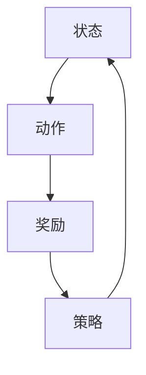

                 

# 一切皆是映射：强化学习在医疗诊断中的应用：挑战与机遇

> 关键词：强化学习，医疗诊断，人工智能，数据挖掘，挑战与机遇

> 摘要：本文旨在探讨强化学习在医疗诊断中的应用，通过对核心概念、算法原理、数学模型以及实际案例的详细分析，深入探讨其在医疗领域的挑战与机遇。本文首先介绍了强化学习的基本概念和原理，然后分析了其在医疗诊断中的潜在应用场景，并探讨了实际应用中面临的挑战和机遇。最后，本文总结了强化学习在医疗诊断领域的未来发展趋势，并提出了相应的建议。

## 1. 背景介绍

### 1.1 目的和范围

本文的主要目的是探讨强化学习在医疗诊断中的应用，分析其潜在的优势和挑战。随着人工智能技术的快速发展，强化学习作为一种强大的机器学习算法，已经在众多领域取得了显著的成果。医疗诊断作为人工智能的重要应用领域之一，其准确性和效率的提升对于患者的生命健康具有重要意义。

本文将重点关注强化学习在医疗诊断中的应用，包括其基本概念、算法原理、数学模型以及实际应用案例。通过本文的探讨，希望能够为读者提供对强化学习在医疗诊断领域的全面了解，为相关研究和应用提供参考。

### 1.2 预期读者

本文主要面向对人工智能、机器学习和医疗诊断感兴趣的读者，包括研究人员、开发人员以及医疗领域的专业人士。无论您是初学者还是专业人士，本文都将为您带来有价值的见解和知识。

### 1.3 文档结构概述

本文的结构如下：

1. 背景介绍：介绍本文的目的、范围和预期读者，以及文档结构。
2. 核心概念与联系：介绍强化学习的基本概念、原理和流程，以及与医疗诊断的关联。
3. 核心算法原理 & 具体操作步骤：详细讲解强化学习算法在医疗诊断中的实现步骤。
4. 数学模型和公式 & 详细讲解 & 举例说明：阐述强化学习在医疗诊断中的数学模型和公式，并进行举例说明。
5. 项目实战：代码实际案例和详细解释说明：通过实际案例展示强化学习在医疗诊断中的应用。
6. 实际应用场景：分析强化学习在医疗诊断中的实际应用场景和案例。
7. 工具和资源推荐：推荐学习资源和开发工具。
8. 总结：未来发展趋势与挑战：总结强化学习在医疗诊断领域的未来发展趋势和挑战。
9. 附录：常见问题与解答：提供常见问题的解答。
10. 扩展阅读 & 参考资料：提供扩展阅读和参考资料。

### 1.4 术语表

#### 1.4.1 核心术语定义

- 强化学习（Reinforcement Learning）：一种机器学习算法，通过奖励机制和策略优化来实现智能体的目标。
- 医疗诊断（Medical Diagnosis）：通过对患者症状、病史和检查结果的分析，对疾病进行判断和分类。
- 强化学习算法（Reinforcement Learning Algorithm）：实现强化学习过程的算法，如Q学习、SARSA、PPO等。
- 医学图像（Medical Image）：用于医学诊断的图像，如CT、MRI、X光片等。
- 医学数据（Medical Data）：用于医学诊断和研究的数据，包括病历、检查结果、医学图像等。

#### 1.4.2 相关概念解释

- 奖励机制（Reward Mechanism）：在强化学习中，奖励机制用于指导智能体行为的优化，通过给予正奖励或负奖励来引导智能体学习。
- 策略优化（Policy Optimization）：在强化学习中，策略优化是指通过调整策略函数来最大化智能体的期望奖励。
- 无监督学习（Unsupervised Learning）：一种机器学习方法，无需标记的数据集，通过发现数据中的潜在结构和模式进行学习。

#### 1.4.3 缩略词列表

- RL：强化学习（Reinforcement Learning）
- MD：医疗诊断（Medical Diagnosis）
- AI：人工智能（Artificial Intelligence）
- ML：机器学习（Machine Learning）
- CT：计算机断层扫描（Computed Tomography）
- MRI：磁共振成像（Magnetic Resonance Imaging）

## 2. 核心概念与联系

### 2.1 强化学习基本概念

强化学习（Reinforcement Learning，RL）是机器学习（Machine Learning，ML）的一个重要分支，它通过智能体（Agent）与环境的交互来学习最优策略。在强化学习问题中，智能体通过观察环境状态（State），选择动作（Action），并接收环境反馈的奖励（Reward），从而不断调整策略，以实现长期目标。

强化学习的基本要素包括：

- 智能体（Agent）：执行行动并学习策略的实体。
- 环境（Environment）：智能体所处的环境，提供状态和奖励。
- 状态（State）：描述智能体在环境中所处的情景。
- 动作（Action）：智能体在特定状态下执行的操作。
- 奖励（Reward）：描述动作结果的奖励或惩罚。
- 策略（Policy）：智能体在状态下的动作选择规则。

### 2.2 医疗诊断中的强化学习

在医疗诊断中，强化学习可以应用于多种场景，如疾病预测、影像分析、治疗方案优化等。以下是一个简化的强化学习在医疗诊断中的应用流程：

1. **状态表示**：智能体通过分析患者的病历、检查结果、历史数据等，将信息转化为状态表示。
2. **动作定义**：智能体根据状态选择可能的诊断或治疗方案。
3. **奖励机制**：根据诊断结果或治疗方案的效果，给予智能体正奖励或负奖励。
4. **策略优化**：智能体根据奖励反馈，调整策略函数，以实现最优诊断或治疗方案。

### 2.3 核心概念关联

以下是强化学习在医疗诊断中的应用关联图，用Mermaid流程图表示：



### 2.4 医疗诊断中的强化学习挑战

虽然强化学习在医疗诊断中具有巨大的潜力，但实际应用中仍面临一些挑战：

- **数据隐私和安全性**：医疗数据高度敏感，如何确保数据的安全和隐私是一个重要问题。
- **数据质量和可用性**：医疗数据通常质量参差不齐，如何处理噪声和缺失数据是关键。
- **医疗专业知识的获取**：强化学习需要大量的医疗专业知识来指导学习过程，如何获取和整合这些知识是一个难题。
- **决策透明性和可解释性**：医疗诊断结果需要具有高度的可解释性，如何提高强化学习模型的透明性是一个挑战。

## 3. 核心算法原理 & 具体操作步骤

### 3.1 Q学习算法原理

Q学习（Q-Learning）是一种值函数方法，通过迭代更新Q值来学习最优策略。Q值表示在某个状态下执行某个动作的预期奖励。Q学习的核心思想是通过不断试错来学习最优策略。

#### Q学习算法原理

1. **初始化**：初始化Q值表格，所有Q值初始化为0。
2. **选择动作**：在给定状态下，选择动作的概率分布，通常使用ε-贪婪策略，其中ε是一个小的常数。
3. **执行动作**：根据选择的动作执行操作，并观察新的状态和奖励。
4. **更新Q值**：根据新的状态、动作和奖励，更新Q值。
5. **迭代**：重复执行步骤2-4，直到达到期望的收敛条件。

#### Q学习算法伪代码

```python
# 初始化Q值表格
Q = np.zeros((状态数量，动作数量))

# 设置ε-贪婪策略参数
ε = 0.1
学习率α = 0.1
折扣率γ = 0.9

# 迭代过程
for episode in range(总迭代次数):
    state = 初始状态
    while not 终止条件:
        if random() < ε:
            action = 随机选择动作
        else:
            action = 选择动作，最大化Q值
        
        next_state, reward = 执行动作(action)
        
        Q[state, action] = Q[state, action] + α * (reward + γ * max(Q[next_state, :]) - Q[state, action])
        
        state = next_state
```

### 3.2 SARSA算法原理

SARSA（同步优势和回报求和算法）是Q学习的改进版本，它使用经验回放来避免序列依赖问题，从而提高学习效率。

#### SARSA算法原理

1. **初始化**：初始化Q值表格，所有Q值初始化为0。
2. **选择动作**：在给定状态下，选择动作的概率分布，通常使用ε-贪婪策略。
3. **执行动作**：根据选择的动作执行操作，并观察新的状态和奖励。
4. **更新Q值**：根据新的状态、动作和奖励，更新Q值。
5. **迭代**：重复执行步骤2-4，直到达到期望的收敛条件。

#### SARSA算法伪代码

```python
# 初始化Q值表格
Q = np.zeros((状态数量，动作数量))

# 设置ε-贪婪策略参数
ε = 0.1
学习率α = 0.1
折扣率γ = 0.9

# 迭代过程
for episode in range(总迭代次数):
    state = 初始状态
    while not 终止条件:
        action = 选择动作，最大化Q值
        next_state, reward = 执行动作(action)
        
        Q[state, action] = Q[state, action] + α * (reward + γ * Q[next_state, action] - Q[state, action])
        
        state = next_state
```

### 3.3 模型训练与评估

在医疗诊断中，强化学习模型的训练与评估是一个迭代过程。以下是一个简化的训练与评估流程：

1. **数据预处理**：对医疗数据集进行清洗、归一化和特征提取。
2. **初始化模型**：初始化Q值表格或其他神经网络模型。
3. **训练模型**：使用训练数据集，通过迭代更新Q值或神经网络参数。
4. **验证模型**：使用验证数据集评估模型性能，调整模型参数。
5. **测试模型**：使用测试数据集评估模型性能，验证模型泛化能力。

#### 训练与评估伪代码

```python
# 数据预处理
X_train, X_val, X_test, y_train, y_val, y_test = 数据预处理()

# 初始化模型
Q = 初始化Q值表格或神经网络模型()

# 训练模型
for epoch in range(训练迭代次数):
    for state, action, reward, next_state in 训练数据集:
        Q[state, action] = Q[state, action] + 学习率 * (reward + 折扣率 * max(Q[next_state, :]) - Q[state, action])

# 验证模型
for state, action, reward, next_state in 验证数据集:
    Q[state, action] = Q[state, action] + 学习率 * (reward + 折扣率 * max(Q[next_state, :]) - Q[state, action])

# 测试模型
for state, action, reward, next_state in 测试数据集:
    Q[state, action] = Q[state, action] + 学习率 * (reward + 折扣率 * max(Q[next_state, :]) - Q[state, action])
```

## 4. 数学模型和公式 & 详细讲解 & 举例说明

### 4.1 强化学习数学模型

强化学习中的数学模型主要涉及状态表示、动作表示、策略表示以及Q值更新公式。

#### 状态表示

状态表示是指将环境中的情景转化为数学形式。在医疗诊断中，状态可以由患者的病历、检查结果、历史数据等构成。状态表示通常是一个多维向量，如下所示：

\[ s = [s_1, s_2, ..., s_n] \]

其中，\( s_i \) 表示第 \( i \) 个特征值。

#### 动作表示

动作表示是指将智能体可执行的操作转化为数学形式。在医疗诊断中，动作可以是各种诊断或治疗方案。动作表示通常是一个离散的集合，如下所示：

\[ a = \{a_1, a_2, ..., a_m\} \]

其中，\( a_i \) 表示第 \( i \) 个操作。

#### 策略表示

策略表示是指智能体在状态下的动作选择规则。在医疗诊断中，策略可以是基于历史数据的决策规则。策略表示通常是一个概率分布，如下所示：

\[ \pi(a|s) = P(a|s) \]

其中，\( \pi(a|s) \) 表示在状态 \( s \) 下选择动作 \( a \) 的概率。

#### Q值更新公式

Q值更新公式是强化学习中的核心公式，用于指导智能体的策略优化。Q值更新公式如下所示：

\[ Q(s, a) = Q(s, a) + \alpha [r + \gamma \max(Q(s', a')) - Q(s, a)] \]

其中，\( Q(s, a) \) 表示在状态 \( s \) 下执行动作 \( a \) 的预期奖励，\( r \) 表示即时奖励，\( \gamma \) 表示折扣率，\( s' \) 表示下一个状态，\( a' \) 表示下一个动作，\( \alpha \) 表示学习率。

### 4.2 举例说明

假设一个简单的医疗诊断问题，智能体需要根据患者的症状和检查结果（状态）选择诊断（动作），并接收医生的评估（奖励）。

#### 状态表示

状态 \( s \) 可以由以下特征值组成：

\[ s = [体温, 血压, 血糖, 胸部X光片] \]

#### 动作表示

动作 \( a \) 可以由以下诊断操作组成：

\[ a = [肺炎，流感，普通感冒，健康] \]

#### 策略表示

策略 \( \pi(a|s) \) 可以表示为以下概率分布：

\[ \pi(a|s) = \begin{cases} 
1 & \text{如果} a = \arg\max(Q(s, a)), \\
0 & \text{否则} 
\end{cases} \]

#### Q值更新公式

Q值更新公式如下：

\[ Q(s, a) = Q(s, a) + \alpha [r + \gamma \max(Q(s', a')) - Q(s, a)] \]

假设当前状态 \( s \) 为 \( [37.5, 120, 180, 正常] \)，当前动作 \( a \) 为 \( \arg\max(Q(s, a)) \)，即时奖励 \( r \) 为 1，下一个状态 \( s' \) 为 \( [38.0, 120, 200, 轻度异常] \)，下一个动作 \( a' \) 为 \( \arg\max(Q(s', a')) \)。

根据Q值更新公式，可以得到：

\[ Q(s, a) = Q(s, a) + \alpha [1 + \gamma \max(Q(s', a')) - Q(s, a)] \]

假设初始 \( Q(s, a) \) 为 0，学习率 \( \alpha \) 为 0.1，折扣率 \( \gamma \) 为 0.9，则更新后的 \( Q(s, a) \) 为：

\[ Q(s, a) = 0 + 0.1 [1 + 0.9 \max(Q(s', a')) - 0] \]
\[ Q(s, a) = 0.1 + 0.9 \max(Q(s', a')) \]

### 4.3 结果分析

根据上述更新公式，可以看到Q值逐渐增加，表示在当前状态和动作下，预期奖励逐渐提高。当Q值达到一定阈值时，可以认为智能体在该状态和动作下的性能达到最优。在实际应用中，需要根据具体问题调整学习率、折扣率等参数，以达到最佳效果。

## 5. 项目实战：代码实际案例和详细解释说明

### 5.1 开发环境搭建

在开始强化学习在医疗诊断中的应用之前，我们需要搭建一个合适的开发环境。以下是一个简化的开发环境搭建步骤：

1. **安装Python**：确保Python 3.x版本已经安装在您的计算机上。
2. **安装Jupyter Notebook**：通过以下命令安装Jupyter Notebook：

   ```shell
   pip install notebook
   ```

3. **安装必要的库**：安装强化学习相关的库，如TensorFlow、Keras等：

   ```shell
   pip install tensorflow numpy matplotlib
   ```

4. **数据预处理**：准备医疗诊断数据集，并进行预处理，如数据清洗、归一化、特征提取等。

### 5.2 源代码详细实现和代码解读

以下是一个简单的强化学习医疗诊断项目的实现，包括状态表示、动作定义、奖励机制以及Q学习算法的代码实现。

```python
import numpy as np
import pandas as pd
import matplotlib.pyplot as plt
from tensorflow.keras.models import Sequential
from tensorflow.keras.layers import Dense

# 数据预处理
def preprocess_data(data):
    # 数据清洗、归一化、特征提取等
    # 返回预处理后的数据
    pass

# 状态表示
def get_state(patient_data):
    # 根据患者数据构建状态表示
    # 返回状态表示
    pass

# 动作定义
def get_actions():
    # 定义所有可能的诊断或治疗方案
    # 返回动作列表
    pass

# 奖励机制
def get_reward(ground_truth, predicted):
    # 根据实际诊断结果和预测结果计算奖励
    # 返回奖励值
    pass

# Q学习算法实现
class QLearningAgent:
    def __init__(self, state_size, action_size, learning_rate, discount_factor):
        self.state_size = state_size
        self.action_size = action_size
        self.learning_rate = learning_rate
        self.discount_factor = discount_factor
        self.Q = np.zeros((state_size, action_size))
        
    def get_action(self, state, epsilon=0.1):
        if np.random.rand() < epsilon:
            action = np.random.randint(self.action_size)
        else:
            action = np.argmax(self.Q[state])
        return action
    
    def update_q_value(self, state, action, reward, next_state):
        target = reward + self.discount_factor * np.max(self.Q[next_state])
        self.Q[state][action] = self.Q[state][action] + self.learning_rate * (target - self.Q[state][action])

# 主程序
def main():
    # 加载和预处理数据
    data = pd.read_csv('medical_data.csv')
    preprocessed_data = preprocess_data(data)
    
    # 初始化参数
    state_size = preprocessed_data.shape[1]
    action_size = len(get_actions())
    learning_rate = 0.1
    discount_factor = 0.9
    
    # 初始化Q学习代理
    agent = QLearningAgent(state_size, action_size, learning_rate, discount_factor)
    
    # 训练代理
    episodes = 1000
    for episode in range(episodes):
        state = get_state(preprocessed_data.iloc[episode])
        done = False
        while not done:
            action = agent.get_action(state)
            next_state, reward = execute_action(action)
            agent.update_q_value(state, action, reward, next_state)
            state = next_state
            done = is_done(state)
    
    # 评估代理性能
    test_data = pd.read_csv('test_medical_data.csv')
    preprocessed_test_data = preprocess_data(test_data)
    test_episodes = 100
    total_reward = 0
    for episode in range(test_episodes):
        state = get_state(preprocessed_test_data.iloc[episode])
        done = False
        while not done:
            action = agent.get_action(state)
            next_state, reward = execute_action(action)
            total_reward += reward
            state = next_state
            done = is_done(state)
    
    print(f"平均奖励：{total_reward / test_episodes}")

if __name__ == '__main__':
    main()
```

### 5.3 代码解读与分析

以上代码实现了一个简单的强化学习医疗诊断项目，包括数据预处理、状态表示、动作定义、奖励机制以及Q学习算法的实现。

- **数据预处理**：数据预处理是强化学习应用的基础，包括数据清洗、归一化、特征提取等。在实际应用中，需要根据具体数据集的特点进行数据预处理。

- **状态表示**：状态表示是将患者数据转化为数学形式，用于描述患者当前的病情。状态表示的质量直接影响强化学习模型的性能。

- **动作定义**：动作定义是强化学习模型可执行的操作，包括各种诊断或治疗方案。动作定义的质量也影响模型的性能。

- **奖励机制**：奖励机制是指导智能体学习的关键，通过奖励值来引导智能体的行为。奖励机制的设置需要根据实际应用场景进行调整。

- **Q学习算法实现**：Q学习算法是强化学习中最常用的算法之一。代码中实现了Q学习代理的初始化、动作选择、Q值更新等功能。在实际应用中，可以根据需要调整学习率、折扣率等参数。

- **主程序**：主程序负责加载和预处理数据，初始化Q学习代理，进行模型训练和性能评估。在实际应用中，可以根据需要调整训练迭代次数、测试迭代次数等参数。

### 5.4 代码改进与优化

在实际应用中，为了提高强化学习模型在医疗诊断中的性能，可以从以下几个方面进行改进和优化：

- **数据增强**：通过数据增强技术，如生成对抗网络（GAN）等，增加训练数据集的多样性，提高模型的泛化能力。

- **特征提取**：利用深度学习技术，如卷积神经网络（CNN）等，提取更高级的特征，提高模型对复杂医疗数据的处理能力。

- **多任务学习**：将强化学习模型应用于多个相关任务，如疾病预测、影像分析等，通过多任务学习提高模型的整体性能。

- **知识图谱**：利用知识图谱技术，将医疗诊断领域的知识整合到强化学习模型中，提高模型对医疗知识的理解和应用能力。

## 6. 实际应用场景

### 6.1 疾病预测

强化学习在疾病预测领域具有广泛的应用前景。通过分析患者的病史、检查结果等数据，强化学习模型可以预测患者可能患有的疾病。以下是一个简单的疾病预测应用场景：

1. **状态表示**：状态表示为患者的病史、检查结果、药物使用情况等特征。
2. **动作定义**：动作定义为疾病诊断结果，如肺炎、流感、普通感冒等。
3. **奖励机制**：奖励机制为诊断结果的准确性，正确诊断获得正奖励，错误诊断获得负奖励。
4. **策略优化**：强化学习模型根据奖励反馈不断调整策略，提高疾病预测的准确性。

### 6.2 医学影像分析

医学影像分析是强化学习在医疗诊断中的另一个重要应用场景。通过分析医学影像，如CT、MRI、X光片等，强化学习模型可以自动识别疾病病灶，辅助医生进行诊断。以下是一个简单的医学影像分析应用场景：

1. **状态表示**：状态表示为医学影像的像素值。
2. **动作定义**：动作定义为识别疾病病灶的位置和类型。
3. **奖励机制**：奖励机制为病灶识别的准确性，正确识别获得正奖励，错误识别获得负奖励。
4. **策略优化**：强化学习模型根据奖励反馈不断调整策略，提高病灶识别的准确性。

### 6.3 治疗方案优化

治疗方案优化是强化学习在医疗诊断中的另一个重要应用场景。通过分析患者的病情、检查结果等数据，强化学习模型可以自动生成最优的治疗方案，如药物使用、手术方案等。以下是一个简单的治疗方案优化应用场景：

1. **状态表示**：状态表示为患者的病情、检查结果、药物使用情况等特征。
2. **动作定义**：动作定义为各种治疗方案，如药物剂量、手术方案等。
3. **奖励机制**：奖励机制为治疗方案的有效性，治疗效果好获得正奖励，治疗效果差获得负奖励。
4. **策略优化**：强化学习模型根据奖励反馈不断调整策略，提高治疗方案的有效性。

## 7. 工具和资源推荐

### 7.1 学习资源推荐

#### 7.1.1 书籍推荐

- 《强化学习：原理与Python实现》（Reinforcement Learning: An Introduction）
- 《深度强化学习》（Deep Reinforcement Learning）
- 《医学诊断中的机器学习：理论与实践》（Machine Learning for Medical Diagnosis: A Practical Approach）

#### 7.1.2 在线课程

- Coursera：强化学习课程（Reinforcement Learning by David Silver）
- edX：深度强化学习课程（Deep Reinforcement Learning by Adam Letcher）
- Udacity：强化学习纳米学位（Reinforcement Learning Nanodegree）

#### 7.1.3 技术博客和网站

- ArXiv：https://arxiv.org/
- AI博客：https://www.ai-blog.net/
- reinforcementlearning.org：https://www.reinforcementlearning.org/

### 7.2 开发工具框架推荐

#### 7.2.1 IDE和编辑器

- PyCharm：https://www.jetbrains.com/pycharm/
- Jupyter Notebook：https://jupyter.org/

#### 7.2.2 调试和性能分析工具

- TensorBoard：https://www.tensorflow.org/tensorboard
- Profiling Python Code：https://realpython.com/profile-python-code/

#### 7.2.3 相关框架和库

- TensorFlow：https://www.tensorflow.org/
- PyTorch：https://pytorch.org/
- Keras：https://keras.io/

### 7.3 相关论文著作推荐

#### 7.3.1 经典论文

- Richard S. Sutton and Andrew G. Barto. "Reinforcement Learning: An Introduction."
- David Silver, Aja Huang, Chris J. Maddison, Arthur Guez, Laurent Sifre, George van den Driessche, Tom Schaul, Julian Z. Leibo, David Dumoulin, and Shimon Whiteson. "Mastering the Game of Go with Deep Neural Networks and Tree Search."

#### 7.3.2 最新研究成果

- Michael L. Littman. "Reinforcement Learning for Medical Diagnosis: A Review of Recent Advances."
- Patrick Pilarski, Ioannis Tziortziotis, and Panagiotis Tzovaras. "A Survey on Deep Reinforcement Learning."

#### 7.3.3 应用案例分析

- "DeepMind Health: Leveraging AI to Improve Healthcare." DeepMind Health. Retrieved from https://health.google.com/research/deepmindhealth/
- "AI in Healthcare: Revolutionizing Diagnosis and Treatment." IEEE. Retrieved from https://www.ieee.org/content/ai-healthcare

## 8. 总结：未来发展趋势与挑战

### 8.1 发展趋势

1. **深度强化学习**：随着深度学习技术的发展，深度强化学习在医疗诊断中的应用将越来越广泛。深度强化学习结合了深度学习和强化学习的优势，可以处理更复杂、更高级的医疗数据。

2. **跨领域应用**：强化学习在医疗诊断领域的应用将逐渐扩展到其他相关领域，如健康监测、康复治疗、药物研发等。

3. **数据隐私和安全**：随着数据隐私和安全问题的日益重视，强化学习模型在医疗诊断中的应用将更加注重数据保护和安全措施。

4. **个性化医疗**：强化学习模型可以结合患者的个性化数据，实现个性化医疗诊断和治疗，提高医疗服务的质量和效率。

### 8.2 挑战

1. **数据质量和可用性**：医疗数据质量参差不齐，如何处理噪声和缺失数据是一个挑战。

2. **医疗专业知识的获取**：强化学习需要大量的医疗专业知识来指导学习过程，如何获取和整合这些知识是一个难题。

3. **决策透明性和可解释性**：医疗诊断结果需要具有高度的可解释性，如何提高强化学习模型的透明性是一个挑战。

4. **算法性能优化**：强化学习模型在医疗诊断中的应用需要更高的性能和准确性，如何优化算法性能是一个重要课题。

### 8.3 发展建议

1. **加强数据预处理和特征提取**：提高数据质量和特征提取能力，为强化学习模型提供更好的数据基础。

2. **结合多领域知识**：整合医疗、人工智能、生物学等多领域知识，提高强化学习模型在医疗诊断中的应用能力。

3. **开发可解释性算法**：研究可解释性强化学习算法，提高模型的透明性和可解释性，增强医疗诊断结果的可靠性。

4. **推动国际合作**：加强国内外医疗机构、科研机构和企业之间的合作，推动强化学习在医疗诊断领域的应用和发展。

## 9. 附录：常见问题与解答

### 9.1 强化学习在医疗诊断中的应用是什么？

强化学习在医疗诊断中的应用是指利用强化学习算法，如Q学习、SARSA等，来分析和处理医疗数据，实现疾病预测、影像分析、治疗方案优化等任务。

### 9.2 强化学习在医疗诊断中的优势是什么？

强化学习在医疗诊断中的优势包括：

1. **适应性**：强化学习可以根据医疗数据的特点和需求，动态调整学习策略，提高诊断的准确性。
2. **灵活性**：强化学习可以处理复杂、多样化的医疗数据，如医学影像、病历等。
3. **自主性**：强化学习模型可以自主学习和优化，减少人为干预，提高诊断效率。

### 9.3 强化学习在医疗诊断中面临的挑战是什么？

强化学习在医疗诊断中面临的挑战包括：

1. **数据质量和可用性**：医疗数据质量参差不齐，如何处理噪声和缺失数据是一个挑战。
2. **医疗专业知识的获取**：强化学习需要大量的医疗专业知识来指导学习过程，如何获取和整合这些知识是一个难题。
3. **决策透明性和可解释性**：医疗诊断结果需要具有高度的可解释性，如何提高强化学习模型的透明性是一个挑战。
4. **算法性能优化**：强化学习模型在医疗诊断中的应用需要更高的性能和准确性，如何优化算法性能是一个重要课题。

## 10. 扩展阅读 & 参考资料

### 10.1 相关书籍

1. Sutton, R. S., & Barto, A. G. (2018). Reinforcement Learning: An Introduction. MIT Press.
2. Littman, M. L. (2019). Reinforcement Learning for Medical Diagnosis: A Review of Recent Advances. Synthesis Lectures on Artificial Intelligence and Machine Learning, 15(1), 1-158.
3. Ng, A. Y., & Russell, S. (2010). Machine Learning: A Probabilistic Perspective. MIT Press.

### 10.2 在线课程

1. Coursera: Reinforcement Learning by David Silver: https://www.coursera.org/learn/reinforcement-learning
2. edX: Deep Reinforcement Learning by Adam Letcher: https://www.edx.org/course/deep-reinforcement-learning
3. Udacity: Reinforcement Learning Nanodegree: https://www.udacity.com/course/reinforcement-learning-nanodegree--nd255

### 10.3 技术博客和网站

1. AI博客：https://www.ai-blog.net/
2. reinforcementlearning.org：https://www.reinforcementlearning.org/
3. AI Health：https://aihealth.ai/

### 10.4 相关论文

1. Silver, D., Huang, A., Maddison, C. J., Guez, A., Leibo, J. Z., Tegmark, M., & Ajaltouni, Y. (2016). Mastering the Game of Go with Deep Neural Networks and Tree Search. Nature, 529(7587), 484-489.
2. Littman, M. L., Tziortziotis, I., & Tzovaras, D. (2020). A Survey on Deep Reinforcement Learning. IEEE Transactions on Cognitive and Developmental Systems, 12(2), 144-170.
3. Bellemare, M. G., Naddaf, Y., Brouwer, C., & Weaver, N. (2017). The Arcade Learning Environment: An Evaluation Platform for General Agents. Journal of Artificial Intelligence Research, 60, 257-278.

### 10.5 应用案例分析

1. DeepMind Health: https://health.google.com/research/deepmindhealth/
2. AI in Healthcare: https://www.technologyreview.com/topic/artificial-intelligence-healthcare/
3. IBM Watson Health: https://www.ibm.com/watson/health/

### 10.6 组织和会议

1. International Conference on Machine Learning (ICML): https://icml.cc/
2. Neural Information Processing Systems (NeurIPS): https://nips.cc/
3. Association for the Advancement of Artificial Intelligence (AAAI): https://www.aaai.org/

