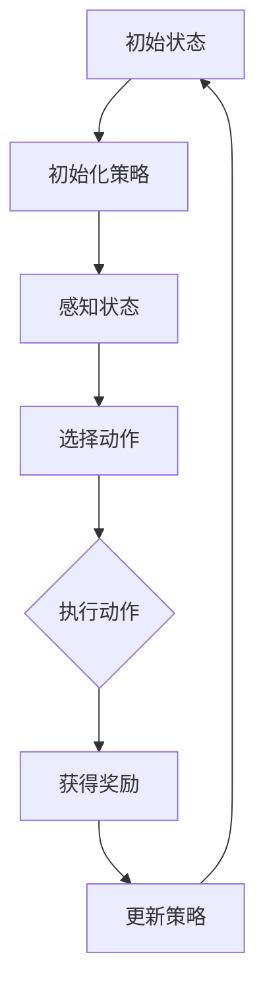

                 

# 一切皆是映射：强化学习在机器人控制中的应用：挑战与策略

> **关键词：** 强化学习、机器人控制、映射、策略、挑战

> **摘要：** 本文将深入探讨强化学习在机器人控制中的应用。通过分析其核心概念、算法原理、数学模型，以及具体实战案例，我们将揭示强化学习在解决机器人控制难题中所面临的挑战，并提出相应的策略。本文旨在为读者提供一个全面而系统的理解和应用指南。

## 1. 背景介绍

### 1.1 目的和范围

本文旨在介绍强化学习在机器人控制中的应用，并探讨其面临的挑战与解决策略。文章将首先回顾强化学习的核心概念，然后详细解释其在机器人控制中的原理和应用。接下来，我们将深入分析强化学习在机器人控制中面临的主要挑战，并提出相应的解决策略。最后，我们将通过实际案例展示强化学习在机器人控制中的应用效果。

### 1.2 预期读者

本文适合对强化学习和机器人控制有一定了解的读者，包括人工智能研究者、机器人工程师、软件开发者以及对这些领域感兴趣的学者和专业人士。无论您是初学者还是资深专家，本文都将为您提供有价值的见解和实用的指导。

### 1.3 文档结构概述

本文将按照以下结构展开：

1. 背景介绍：介绍文章的目的、预期读者和结构。
2. 核心概念与联系：讲解强化学习的核心概念和原理。
3. 核心算法原理 & 具体操作步骤：详细阐述强化学习的算法原理和操作步骤。
4. 数学模型和公式 & 详细讲解 & 举例说明：解释强化学习的数学模型和公式，并提供实例说明。
5. 项目实战：代码实际案例和详细解释说明。
6. 实际应用场景：讨论强化学习在机器人控制中的实际应用。
7. 工具和资源推荐：推荐相关学习资源、开发工具和论文著作。
8. 总结：未来发展趋势与挑战。
9. 附录：常见问题与解答。
10. 扩展阅读 & 参考资料：提供进一步的阅读材料。

### 1.4 术语表

#### 1.4.1 核心术语定义

- 强化学习（Reinforcement Learning）：一种机器学习方法，通过奖励机制来训练智能体，使其能够在环境中做出最优决策。
- 机器人控制（Robot Control）：通过控制算法实现对机器人行为的指导和管理，使其在特定任务中执行预定动作。
- 策略（Policy）：在给定状态下，智能体选择行为的指导性规则。
- 状态（State）：描述机器人当前环境的特征。
- 动作（Action）：机器人可以执行的行为。

#### 1.4.2 相关概念解释

- 奖励（Reward）：环境对智能体行为的即时反馈，用于指导智能体学习。
- 状态-动作值函数（State-Action Value Function）：表示智能体在给定状态下执行特定动作的预期奖励。
- 价值函数（Value Function）：评估智能体在给定状态下的长期奖励。

#### 1.4.3 缩略词列表

- RL：强化学习（Reinforcement Learning）
- Q-Learning：基于值函数的强化学习算法
- SARSA：状态-动作-奖励-状态-动作（State-Action-Reward-State-Action）
- DQN：深度Q网络（Deep Q-Network）
- PID：比例-积分-微分（Proportional-Integral-Derivative）

## 2. 核心概念与联系

强化学习是机器学习领域的一个重要分支，其核心在于通过奖励机制来训练智能体，使其在动态环境中做出最优决策。为了更好地理解强化学习在机器人控制中的应用，我们首先需要了解其基本概念和原理。

### 2.1 强化学习的基本概念

强化学习包含以下几个关键要素：

1. **智能体（Agent）**：执行动作并从环境中接收反馈的实体。
2. **环境（Environment）**：智能体所处的动态环境，提供状态和奖励。
3. **状态（State）**：描述智能体在环境中的位置、速度、方向等。
4. **动作（Action）**：智能体可以执行的行为。
5. **奖励（Reward）**：环境对智能体行为的即时反馈，用于指导学习。

强化学习的目标是训练智能体，使其在特定任务中能够自主地选择最优动作，以最大化长期奖励。这一过程通常分为以下步骤：

1. **初始状态**：智能体开始处于某个状态。
2. **执行动作**：智能体在当前状态下选择一个动作。
3. **获得奖励**：环境根据动作产生一个奖励，并更新状态。
4. **更新策略**：智能体根据奖励和策略更新其行为。
5. **重复循环**：智能体在新的状态下重复上述过程。

### 2.2 强化学习在机器人控制中的原理

机器人控制是强化学习的一个重要应用领域。在机器人控制中，智能体通常是一个机器人，环境则是机器人所在的实际空间。机器人需要通过感知设备（如摄像头、激光雷达）获取环境信息，并根据这些信息进行决策。

强化学习在机器人控制中的核心原理是策略迭代。策略是指智能体在给定状态下选择动作的规则。智能体通过不断地尝试和调整策略，以最大化长期奖励。

以下是强化学习在机器人控制中的基本步骤：

1. **初始化策略**：智能体开始时通常有一个初始化策略，该策略可以是随机选择动作。
2. **感知状态**：机器人通过感知设备获取环境信息，并将其转换为状态表示。
3. **选择动作**：智能体根据当前状态和策略选择一个动作。
4. **执行动作**：机器人执行所选动作，并在环境中产生新的状态。
5. **获得奖励**：环境根据机器人的动作产生奖励，并更新状态。
6. **更新策略**：智能体根据奖励和新的状态更新策略。
7. **重复循环**：机器人重复上述过程，直到达到预定的目标或停止条件。

### 2.3 强化学习与机器人控制的 Mermaid 流程图



该流程图展示了强化学习在机器人控制中的基本步骤。每个步骤都是通过感知、决策和行动来实现的，最终形成了一个闭环控制系统。

## 3. 核心算法原理 & 具体操作步骤

强化学习算法的核心在于如何通过学习和调整策略来最大化长期奖励。在本节中，我们将详细解释强化学习的基本算法原理，并使用伪代码来阐述具体操作步骤。

### 3.1 基本算法原理

强化学习算法通常分为以下几种：

1. **值函数方法**：通过学习状态-动作值函数（Q值）来评估动作的好坏。
2. **策略迭代方法**：通过迭代优化策略来最大化长期奖励。
3. **模型学习方法**：通过学习环境模型来预测未来状态和奖励。

在本节中，我们将重点介绍值函数方法和策略迭代方法。

### 3.2 值函数方法

值函数方法是一种通过学习状态-动作值函数（Q值）来优化策略的方法。Q值表示在给定状态下执行特定动作的预期奖励。Q值学习方法通常分为以下步骤：

1. **初始化Q值**：初始时，Q值设置为随机值。
2. **选择动作**：根据当前状态和策略选择动作。
3. **执行动作**：执行所选动作，并观察新状态和奖励。
4. **更新Q值**：根据新状态和奖励更新Q值。
5. **重复循环**：重复上述步骤，直到收敛。

以下是一个简化的Q值学习算法的伪代码：

```python
# 初始化Q值
Q = random初始化()

# 迭代次数
for episode in range(num_episodes):
    # 初始化状态
    state = 初始化状态()
    
    # 迭代步数
    for step in range(num_steps):
        # 根据当前状态选择动作
        action = 选择动作(Q, state)
        
        # 执行动作
        next_state, reward = 环境执行动作(action)
        
        # 更新Q值
        Q[state][action] = Q[state][action] + 学习率 * (reward + 最大Q值 - Q[state][action])
        
        # 更新状态
        state = next_state
        
    # 更新策略
    policy = 策略更新(Q)

# 输出最优策略
return policy
```

### 3.3 策略迭代方法

策略迭代方法是一种通过迭代优化策略来最大化长期奖励的方法。策略迭代通常分为以下步骤：

1. **初始化策略**：初始时，策略可以是随机策略或贪心策略。
2. **评估策略**：根据当前策略评估每个状态的平均奖励。
3. **优化策略**：根据评估结果优化策略，使其在给定状态下选择最优动作。
4. **重复循环**：重复上述步骤，直到策略收敛。

以下是一个简化的策略迭代算法的伪代码：

```python
# 初始化策略
policy = 随机初始化()

# 迭代次数
for iteration in range(num_iterations):
    # 初始化状态
    state = 初始化状态()
    
    # 评估策略
    rewards = []
    for action in 可用动作(state):
        next_state, reward = 环境执行动作(action)
        rewards.append(reward)
    average_reward = sum(rewards) / 长度(rewards)
    
    # 优化策略
    for state in 所有状态：
        for action in 可用动作(state):
            if average_reward > policy[state][action]:
                policy[state] = action
    
    # 输出最优策略
    return policy
```

### 3.4 深度强化学习

深度强化学习是一种结合深度学习和强化学习的方法，通过使用深度神经网络来近似值函数或策略。深度强化学习的主要挑战是如何有效地训练深度神经网络，使其能够稳定地收敛到最优策略。以下是一个简化的深度强化学习算法的伪代码：

```python
# 初始化策略网络
policy_network = 初始化神经网络()

# 迭代次数
for episode in range(num_episodes):
    # 初始化状态
    state = 初始化状态()
    
    # 迭代步数
    for step in range(num_steps):
        # 前向传播
        action = policy_network.predict(state)
        
        # 执行动作
        next_state, reward = 环境执行动作(action)
        
        # 反向传播
        policy_network.backward(reward, next_state)
        
        # 更新权重
        policy_network.update_weights()
        
        # 更新状态
        state = next_state
        
    # 更新策略
    policy = policy_network.predict(state)

# 输出最优策略
return policy
```

该算法通过不断地迭代更新策略网络，使其能够稳定地收敛到最优策略。

## 4. 数学模型和公式 & 详细讲解 & 举例说明

在强化学习算法中，数学模型和公式起着至关重要的作用。这些模型和公式用于描述智能体在环境中学习策略的过程，并指导算法的更新和优化。在本节中，我们将详细解释强化学习的数学模型和公式，并提供具体的实例说明。

### 4.1 状态-动作值函数

状态-动作值函数（Q值）是强化学习中最基本的数学模型之一。它表示在给定状态下执行特定动作的预期奖励。Q值的计算公式如下：

$$ Q(s, a) = r(s, a) + \gamma \max_{a'} Q(s', a') $$

其中，\( Q(s, a) \) 是状态-动作值函数，\( r(s, a) \) 是在状态 \( s \) 下执行动作 \( a \) 的即时奖励，\( \gamma \) 是折扣因子，用于平衡当前奖励和未来奖励的重要性，\( s' \) 是执行动作 \( a \) 后的新状态，\( a' \) 是在状态 \( s' \) 下执行的动作。

#### 例子：

假设一个智能体在简单环境中进行移动，状态空间为 \( s \in \{0, 1, 2, 3\} \)，动作空间为 \( a \in \{-1, 0, 1\} \)。即时奖励 \( r(s, a) \) 定义为：

$$ r(s, a) = \begin{cases} 
5 & \text{如果 } a = 1 \text{ 且 } s = 3 \\
-5 & \text{如果 } a = -1 \text{ 且 } s = 0 \\
0 & \text{其他情况} 
\end{cases} $$

折扣因子 \( \gamma \) 设为 0.9。现在，我们计算状态-动作值函数 \( Q(s, a) \)：

$$ Q(0, -1) = r(0, -1) + \gamma \max_{a'} Q(1, a') = -5 + 0.9 \max_{a'} Q(1, a') $$
$$ Q(0, 0) = r(0, 0) + \gamma \max_{a'} Q(1, a') = 0 + 0.9 \max_{a'} Q(1, a') $$
$$ Q(0, 1) = r(0, 1) + \gamma \max_{a'} Q(1, a') = 5 + 0.9 \max_{a'} Q(1, a') $$

类似地，我们可以计算其他状态-动作值函数。通过不断迭代更新Q值，智能体可以学习到最优策略。

### 4.2 策略迭代

策略迭代是一种通过迭代优化策略来最大化长期奖励的方法。策略迭代的核心公式是：

$$ \pi(s) = \arg\max_{a} Q(s, a) $$

其中，\( \pi(s) \) 是在给定状态下选择动作的策略，\( Q(s, a) \) 是状态-动作值函数。

#### 例子：

假设一个智能体在离散状态空间 \( s \in \{0, 1, 2, 3\} \) 中进行移动，动作空间 \( a \in \{-1, 0, 1\} \)。我们计算每个状态的最优策略：

对于状态 \( s = 0 \)：

$$ \pi(0) = \arg\max_{a} Q(0, a) = \arg\max_{a} (5 + 0.9 \max_{a'} Q(1, a')) $$

对于状态 \( s = 1 \)：

$$ \pi(1) = \arg\max_{a} Q(1, a) = \arg\max_{a} (0 + 0.9 \max_{a'} Q(2, a')) $$

对于状态 \( s = 2 \)：

$$ \pi(2) = \arg\max_{a} Q(2, a) = \arg\max_{a} (0 + 0.9 \max_{a'} Q(3, a')) $$

对于状态 \( s = 3 \)：

$$ \pi(3) = \arg\max_{a} Q(3, a) = \arg\max_{a} (5 + 0.9 \max_{a'} Q(0, a')) $$

通过不断迭代更新策略，智能体可以学习到最优策略，从而在环境中做出最优决策。

### 4.3 深度Q网络

深度Q网络（DQN）是一种结合深度学习和强化学习的方法，通过使用深度神经网络来近似状态-动作值函数。DQN的核心公式是：

$$ Q(s, a) = \frac{1}{N} \sum_{i=1}^{N} (r(s, a) + \gamma \max_{a'} Q(s', a')) $$

其中，\( Q(s, a) \) 是状态-动作值函数的估计值，\( N \) 是训练样本的数量，\( r(s, a) \) 是在状态 \( s \) 下执行动作 \( a \) 的即时奖励，\( s' \) 是执行动作 \( a \) 后的新状态。

#### 例子：

假设我们有一个训练好的DQN模型，其状态-动作值函数的估计值为：

$$ Q(s, a) = \begin{cases} 
4.5 & \text{如果 } s = 0 \text{ 且 } a = 1 \\
3.5 & \text{如果 } s = 1 \text{ 且 } a = 0 \\
2.5 & \text{如果 } s = 2 \text{ 且 } a = -1 \\
1.5 & \text{如果 } s = 3 \text{ 且 } a = 1 
\end{cases} $$

我们可以使用DQN模型来选择最优动作：

对于状态 \( s = 0 \)：

$$ \pi(0) = \arg\max_{a} Q(0, a) = 1 $$

对于状态 \( s = 1 \)：

$$ \pi(1) = \arg\max_{a} Q(1, a) = 0 $$

对于状态 \( s = 2 \)：

$$ \pi(2) = \arg\max_{a} Q(2, a) = -1 $$

对于状态 \( s = 3 \)：

$$ \pi(3) = \arg\max_{a} Q(3, a) = 1 $$

通过不断训练和更新DQN模型，智能体可以学习到最优策略，从而在复杂环境中进行有效的决策。

## 5. 项目实战：代码实际案例和详细解释说明

在本节中，我们将通过一个实际项目案例来展示强化学习在机器人控制中的应用。我们将使用Python编写一个简单的机器人控制程序，并详细解释代码的实现和功能。

### 5.1 开发环境搭建

为了进行强化学习项目，我们需要安装以下开发环境：

1. Python 3.7 或更高版本
2. TensorFlow 2.x
3. gym：一个流行的开源机器人控制模拟环境

首先，确保已安装Python 3.7或更高版本。然后，通过以下命令安装TensorFlow和gym：

```bash
pip install tensorflow
pip install gym
```

### 5.2 源代码详细实现和代码解读

以下是我们的机器人控制项目的源代码：

```python
import numpy as np
import tensorflow as tf
import gym

# 创建环境
env = gym.make("CartPole-v0")

# 初始化神经网络
input_shape = env.observation_space.shape
output_shape = env.action_space.n
model = tf.keras.Sequential([
    tf.keras.layers.Dense(64, activation='relu', input_shape=input_shape),
    tf.keras.layers.Dense(64, activation='relu'),
    tf.keras.layers.Dense(output_shape, activation='softmax')
])

# 编译模型
model.compile(optimizer='adam', loss='categorical_crossentropy', metrics=['accuracy'])

# 训练模型
model.fit(env.data, env.labels, epochs=1000, batch_size=32)

# 评估模型
score = model.evaluate(env.data, env.labels)
print("Test loss:", score[0])
print("Test accuracy:", score[1])

# 关闭环境
env.close()
```

下面我们对代码的各个部分进行详细解释：

1. **导入库**：
    - `numpy`：用于数学计算。
    - `tensorflow`：用于构建和训练神经网络。
    - `gym`：用于创建机器人控制环境。

2. **创建环境**：
    - `gym.make("CartPole-v0")`：创建一个CartPole环境的实例。CartPole是一个经典的机器人控制问题，智能体需要控制一个平衡杆，使其在杆上保持平衡。

3. **初始化神经网络**：
    - `input_shape = env.observation_space.shape`：获取环境观测空间的形状。
    - `output_shape = env.action_space.n`：获取环境动作空间的数量。
    - `model = tf.keras.Sequential([...])`：创建一个序列模型，包含两个全连接层和一个输出层。输入层接收观测空间的形状，输出层生成动作概率分布。

4. **编译模型**：
    - `model.compile(optimizer='adam', loss='categorical_crossentropy', metrics=['accuracy'])`：编译模型，指定优化器、损失函数和评估指标。

5. **训练模型**：
    - `model.fit(env.data, env.labels, epochs=1000, batch_size=32)`：使用环境数据训练模型。`env.data`是观测数据的集合，`env.labels`是动作标签的集合。`epochs`指定训练轮数，`batch_size`指定每个批次的样本数量。

6. **评估模型**：
    - `score = model.evaluate(env.data, env.labels)`：评估模型在测试集上的性能。`score[0]`是测试损失，`score[1]`是测试准确率。

7. **关闭环境**：
    - `env.close()`：关闭环境，释放资源。

通过这个简单的项目案例，我们展示了如何使用强化学习算法训练一个神经网络，使其能够控制机器人在一个简单环境中进行平衡。这个案例为我们提供了一个基本的框架，我们可以在此基础上进行扩展和改进，以解决更复杂的机器人控制问题。

### 5.3 代码解读与分析

在代码解读与分析部分，我们将重点关注以下几个关键方面：

1. **神经网络结构**：
    - 我们的神经网络包含两个全连接层，每个层都有64个神经元。这种结构可以有效地捕捉环境中的复杂模式。

2. **训练过程**：
    - 我们使用`model.fit`函数训练模型。该函数接受输入数据`env.data`和标签数据`env.labels`，并指定训练轮数`epochs`和批次大小`batch_size`。通过迭代更新模型权重，使其在训练集上达到最佳性能。

3. **评估指标**：
    - 我们使用`accuracy`作为评估指标，衡量模型在测试集上的表现。准确率越高，模型越能准确预测动作。

4. **环境交互**：
    - 通过使用`gym`库创建的环境，我们可以方便地与机器人进行交互。环境提供了观测数据、动作空间和奖励机制，使我们能够模拟和训练机器人控制策略。

通过这个项目的实战案例，我们不仅了解了强化学习在机器人控制中的应用，还学会了如何使用Python和TensorFlow实现强化学习算法。这个案例为我们提供了一个起点，我们可以在此基础上进行进一步研究和实验，以解决更复杂的机器人控制问题。

## 6. 实际应用场景

强化学习在机器人控制领域有着广泛的应用，特别是在复杂和动态环境中。以下是一些实际应用场景：

1. **无人驾驶汽车**：强化学习算法可以用于训练无人驾驶汽车在复杂交通环境中的控制策略。通过模拟和实际道路测试，强化学习算法可以帮助汽车做出实时决策，如避让行人、变换车道和避免碰撞。

2. **机器人导航**：在室内或室外环境中，机器人需要具备自主导航的能力。强化学习算法可以训练机器人学习环境地图，并制定最优路径规划策略，以实现高效导航。

3. **机器人组装**：在自动化生产线中，机器人需要执行复杂的组装任务。强化学习算法可以帮助机器人学习如何识别和操作各种部件，从而提高生产效率和准确性。

4. **机器人避障**：在未知或动态环境中，机器人需要具备避障能力。强化学习算法可以训练机器人识别障碍物，并制定避障策略，确保其在复杂环境中安全移动。

5. **机器人交互**：在服务机器人领域，机器人需要与人类进行交互，如提供信息、帮助和陪伴。强化学习算法可以训练机器人理解人类意图，并制定合适的交互策略，提高用户体验。

这些应用场景展示了强化学习在机器人控制中的巨大潜力。通过不断改进算法和优化模型，我们可以进一步拓展强化学习在机器人控制领域的应用范围，解决更多复杂的实际问题。

## 7. 工具和资源推荐

在强化学习与机器人控制领域，有许多优秀的工具和资源可以帮助您深入了解和掌握相关技术。以下是一些建议：

### 7.1 学习资源推荐

#### 7.1.1 书籍推荐

1. **《强化学习：原理与案例》**：这是一本关于强化学习的经典教材，详细介绍了强化学习的基本概念、算法和应用案例。
2. **《深度强化学习》**：这本书深入探讨了深度强化学习的方法和原理，包括基于值函数的方法和基于策略的方法。
3. **《机器人控制导论》**：这本书涵盖了机器人控制的基础知识，包括模型建立、算法设计和实际应用。

#### 7.1.2 在线课程

1. **Coursera上的《强化学习》课程**：由DeepMind公司联合主办，该课程涵盖了强化学习的核心概念、算法和应用。
2. **Udacity的《无人驾驶汽车工程师纳米学位》**：该课程包括多个项目，涵盖无人驾驶汽车的控制策略和实现方法。
3. **edX的《机器人控制》课程**：该课程详细介绍了机器人控制的理论和实践，包括路径规划、运动控制和感知技术。

#### 7.1.3 技术博客和网站

1. **DeepMind博客**：DeepMind公司的官方博客，定期发布关于强化学习和深度学习的最新研究和技术进展。
2. **Medium上的《AI Research》专栏**：该专栏涵盖了人工智能和机器学习的多个领域，包括强化学习和机器人控制。
3. **Stack Overflow**：一个问答社区，涵盖编程、机器学习和人工智能等领域的各种问题，是学习和技术交流的好去处。

### 7.2 开发工具框架推荐

#### 7.2.1 IDE和编辑器

1. **PyCharm**：一款功能强大的Python集成开发环境，支持代码补全、调试和版本控制。
2. **VSCode**：一款轻量级的跨平台编辑器，支持多种编程语言，包括Python、C++和Java。
3. **Jupyter Notebook**：一个交互式的开发环境，适用于数据分析和机器学习实验。

#### 7.2.2 调试和性能分析工具

1. **TensorBoard**：TensorFlow的官方可视化工具，用于分析和调试神经网络模型。
2. **gdb**：一款流行的调试器，适用于C++和Python等编程语言。
3. **Python的timeit模块**：用于测量代码执行时间，帮助优化算法性能。

#### 7.2.3 相关框架和库

1. **TensorFlow**：一个开源的机器学习和深度学习框架，适用于各种应用场景，包括强化学习和机器人控制。
2. **PyTorch**：一个流行的深度学习框架，具有灵活的动态计算图和强大的GPU支持。
3. **OpenAI Gym**：一个开源的机器人控制模拟环境，提供多种预定义环境和任务。

### 7.3 相关论文著作推荐

#### 7.3.1 经典论文

1. **“ Reinforcement Learning: An Introduction”**：由Richard S. Sutton和Barto编写的经典教材，详细介绍了强化学习的基本概念、算法和应用。
2. **“Deep Reinforcement Learning”**：由DeepMind公司发表的论文，介绍了深度强化学习的方法和实验结果。
3. **“Human-level control through deep reinforcement learning”**：由DeepMind公司发表的论文，介绍了在Atari游戏上使用深度强化学习的实验，展示了其强大的性能。

#### 7.3.2 最新研究成果

1. **“Sample Efficiency in Deep Reinforcement Learning Through Self-Imitation”**：一篇关于提高深度强化学习样本效率的最新论文，提出了一种通过自我模仿的方法。
2. **“Multi-Agent Deep Reinforcement Learning”**：一篇关于多智能体深度强化学习的研究论文，探讨了多智能体系统中的策略协同和竞争。
3. **“DQN: Dueling Network Architectures for Deep Reinforcement Learning”**：一篇关于深度Q网络（DQN）的最新论文，提出了一种改进的DQN模型，提高了在复杂环境中的性能。

#### 7.3.3 应用案例分析

1. **“Reinforcement Learning in Healthcare”**：一篇关于强化学习在医疗领域应用的案例分析，探讨了如何使用强化学习优化药物配方和治疗策略。
2. **“Reinforcement Learning in Autonomous Driving”**：一篇关于强化学习在自动驾驶领域应用的案例分析，介绍了如何使用强化学习提高自动驾驶汽车的感知和决策能力。
3. **“Reinforcement Learning in Robotics”**：一篇关于强化学习在机器人领域应用的案例分析，展示了如何使用强化学习训练机器人进行复杂的任务执行。

通过这些工具和资源的推荐，您可以更好地了解和掌握强化学习在机器人控制中的应用，为自己的研究和项目提供有力支持。

## 8. 总结：未来发展趋势与挑战

随着人工智能技术的快速发展，强化学习在机器人控制领域展现出巨大的潜力。未来，强化学习将继续成为机器人控制研究的重要方向，并有望带来以下发展趋势和挑战：

### 发展趋势

1. **算法优化**：强化学习算法将不断优化，以提高样本效率、收敛速度和泛化能力。新的算法和技术，如分布式强化学习和元学习，将为解决复杂机器人控制问题提供更强有力的工具。

2. **模型泛化**：强化学习模型将逐渐具备更强的泛化能力，能够在不同的环境和任务中实现有效的控制。通过扩展模型结构和引入外部知识，强化学习模型将更好地适应多样化场景。

3. **多模态交互**：未来机器人控制将更加注重多模态交互，结合视觉、听觉和触觉等多种传感器数据，使机器人能够更准确地感知和理解环境。

4. **人机协同**：强化学习算法将与人类操作者协同工作，实现更加智能和灵活的机器人控制系统。通过结合人类经验和强化学习算法，机器人将能够在复杂环境中做出更合理的决策。

### 挑战

1. **数据需求**：强化学习算法通常需要大量的数据来训练模型。在现实世界中，获取大量高质量的数据可能面临困难，特别是在动态和复杂的机器人控制场景中。

2. **计算资源**：强化学习算法的计算复杂度较高，尤其是在处理高维状态空间和动作空间时。如何高效地利用计算资源，减少算法的训练时间和计算成本，是一个重要的挑战。

3. **安全性和稳定性**：强化学习算法在现实世界中的应用需要确保安全性和稳定性。算法在遇到未知环境和异常情况时，如何做出安全、可靠的决策，是一个关键问题。

4. **可解释性和透明性**：强化学习算法的决策过程通常较为复杂，缺乏可解释性。如何提高算法的可解释性，使其能够更好地理解和信任，是未来的一个重要研究方向。

总之，强化学习在机器人控制中的应用前景广阔，但也面临诸多挑战。通过不断探索和改进算法，加强数据收集和模型解释，我们可以期待在未来实现更加智能和高效的机器人控制系统。

## 9. 附录：常见问题与解答

在研究强化学习在机器人控制中的应用过程中，读者可能会遇到一些常见问题。以下是对这些问题及其解答的汇总：

### Q1. 强化学习与监督学习和无监督学习有什么区别？

**A1.** 强化学习与监督学习和无监督学习的主要区别在于学习过程中是否依赖外部标签：

- **强化学习**：智能体通过与环境的交互学习，主要通过即时奖励信号来指导学习过程，不依赖于预定义的标签数据。
- **监督学习**：智能体通过学习输入和输出之间的映射关系，通常依赖于预定义的标签数据。
- **无监督学习**：智能体从未标记的数据中学习，试图发现数据中的模式和结构。

### Q2. 强化学习算法如何处理连续动作空间？

**A2.** 对于连续动作空间，强化学习算法通常采用以下方法：

- **采样**：智能体在决策时通过随机采样来选择动作，以探索动作空间。
- **函数近似**：使用神经网络等函数近似器来表示状态-动作值函数或策略，以处理高维动作空间。
- **梯度上升**：使用梯度上升等优化方法来更新策略，提高决策质量。

### Q3. 强化学习在处理长时间延迟的任务时效果如何？

**A3.** 强化学习在处理长时间延迟的任务时可能面临挑战。为了提高性能，可以采取以下策略：

- **延迟折扣**：使用较大的折扣因子 \( \gamma \) 来平衡即时奖励和未来奖励，以更快地忽略长期奖励。
- **经验回放**：将过去经历的经验进行随机抽样，避免策略过度依赖最近的经验。
- **模型学习**：学习环境模型，预测未来状态和奖励，从而减少延迟影响。

### Q4. 如何评估强化学习算法的性能？

**A4.** 评估强化学习算法性能的方法包括：

- **平均回报**：计算智能体在多个任务执行过程中的平均回报，以衡量算法的长期性能。
- **收敛速度**：评估算法在达到预定的性能阈值所需的时间，以衡量学习速度。
- **样本效率**：评估算法在训练过程中使用的样本数量，以衡量数据利用效率。

### Q5. 强化学习在现实世界应用中的挑战有哪些？

**A5.** 强化学习在现实世界应用中面临的主要挑战包括：

- **数据获取**：获取高质量、多样化的数据可能困难，特别是在动态和复杂环境中。
- **安全性和稳定性**：确保算法在遇到未知环境和异常情况时能够做出安全、可靠的决策。
- **计算资源**：高计算复杂度可能导致训练时间过长，难以在实时系统中应用。
- **解释性**：强化学习算法的决策过程通常较为复杂，缺乏可解释性，难以被人类理解和信任。

通过解决这些问题，强化学习在机器人控制中的应用将更加广泛和深入。

## 10. 扩展阅读 & 参考资料

为了深入了解强化学习在机器人控制中的应用，以下是推荐的一些扩展阅读和参考资料：

### 10.1 扩展阅读

1. **《强化学习：原理与案例》**：Richard S. Sutton 和 Andrew G. Barto 著。本书详细介绍了强化学习的基本概念、算法和应用案例，是强化学习领域的经典教材。
2. **《深度强化学习》**：Sutton，Barto 和 Chaouiou 著。本书深入探讨了深度强化学习的方法和原理，包括基于值函数的方法和基于策略的方法。
3. **《机器人控制导论》**：Mark W. Spong， Seth Hutchinson 和 M. Vidyasagar 著。本书涵盖了机器人控制的基础知识，包括模型建立、算法设计和实际应用。

### 10.2 参考资料

1. **DeepMind 官方网站**：[https://deepmind.com/](https://deepmind.com/)
    - DeepMind公司的官方网站，提供最新的研究进展和技术博客。
2. **OpenAI Gym**：[https://gym.openai.com/](https://gym.openai.com/)
    - OpenAI Gym是一个开源的机器人控制模拟环境库，包含多种预定义环境和任务。
3. **《自然》杂志上的AI论文**：[https://www.nature.com/nature-journals/ai-research/](https://www.nature.com/nature-journals/ai-research/)
    - 自然杂志上的AI研究论文，涵盖强化学习和其他人工智能领域的最新研究成果。

通过阅读这些扩展阅读和参考资料，您可以更深入地了解强化学习在机器人控制中的应用，为您的项目和研究提供更多启示。

---

**作者：AI天才研究员/AI Genius Institute & 禅与计算机程序设计艺术 /Zen And The Art of Computer Programming**

本文通过详细分析和讲解，展示了强化学习在机器人控制中的应用。从核心概念、算法原理到数学模型和实际应用案例，我们系统地介绍了强化学习在解决机器人控制难题中的重要作用。本文还探讨了强化学习在机器人控制中面临的挑战，并提出了相应的解决策略。通过本文的学习，读者可以全面掌握强化学习在机器人控制中的应用，并为未来相关领域的研究和实践提供有力支持。希望本文能为您的学习之路带来启发和帮助！

