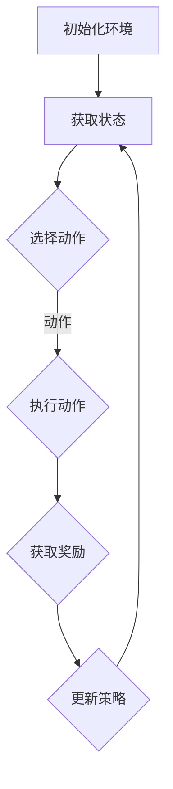

                 

# 一切皆是映射：强化学习在游戏AI中的应用：案例与分析

> **关键词：强化学习，游戏AI，映射，人工智能，案例研究**

> **摘要：本文将深入探讨强化学习在游戏AI领域的应用。通过案例分析，我们将了解强化学习如何通过映射实现高效的游戏AI，并探讨其在实际应用中面临的挑战和未来发展趋势。**

## 1. 背景介绍

### 1.1 目的和范围

本文旨在探讨强化学习在游戏AI领域的应用，通过具体案例分析，分析强化学习如何通过映射实现游戏AI的高效运作。文章将涵盖强化学习的基本概念、核心算法原理、数学模型及实际应用场景。读者应具备基本的机器学习和编程知识，以便更好地理解文章内容。

### 1.2 预期读者

本文适合对强化学习和游戏AI感兴趣的读者，包括机器学习研究者、程序员、游戏开发者和AI爱好者。通过本文，读者可以深入了解强化学习在游戏AI领域的应用，为后续研究和实践提供参考。

### 1.3 文档结构概述

本文分为十个部分：

1. 背景介绍
2. 核心概念与联系
3. 核心算法原理 & 具体操作步骤
4. 数学模型和公式 & 详细讲解 & 举例说明
5. 项目实战：代码实际案例和详细解释说明
6. 实际应用场景
7. 工具和资源推荐
8. 总结：未来发展趋势与挑战
9. 附录：常见问题与解答
10. 扩展阅读 & 参考资料

### 1.4 术语表

#### 1.4.1 核心术语定义

- **强化学习（Reinforcement Learning）**：一种机器学习方法，通过奖励信号和试错策略来优化决策。
- **游戏AI（Game AI）**：在游戏场景中，利用人工智能技术实现的智能行为和决策。
- **映射（Mapping）**：将输入数据转换为期望输出的过程，在强化学习中用于将状态空间映射到动作空间。

#### 1.4.2 相关概念解释

- **状态（State）**：游戏中的一个特定局面，包括游戏角色、环境等。
- **动作（Action）**：在某个状态下可执行的行为。
- **奖励（Reward）**：对某个动作的反馈，用于指导学习过程。
- **策略（Policy）**：决策模型，用于选择最佳动作。

#### 1.4.3 缩略词列表

- **RL**：强化学习（Reinforcement Learning）
- **AI**：人工智能（Artificial Intelligence）
- **Q-Learning**：Q值学习（Q-Learning）
- **DQN**：深度Q网络（Deep Q-Network）

## 2. 核心概念与联系

强化学习是机器学习中的一个重要分支，旨在通过奖励信号和试错策略，使智能体在环境中学习到最优行为。在游戏AI中，强化学习通过映射实现高效的游戏智能。

下面是强化学习在游戏AI中的核心概念和联系：

### 2.1 强化学习核心概念

- **状态（State）**：游戏中的一个特定局面，包括游戏角色、环境等。
- **动作（Action）**：在某个状态下可执行的行为。
- **奖励（Reward）**：对某个动作的反馈，用于指导学习过程。
- **策略（Policy）**：决策模型，用于选择最佳动作。
- **价值函数（Value Function）**：评估状态或状态-动作对的优劣。
- **策略网络（Policy Network）**：通过学习生成策略的神经网络。
- **值函数网络（Value Function Network）**：通过学习评估状态或状态-动作对的神经网络。

### 2.2 游戏AI核心概念

- **智能体（Agent）**：执行游戏策略的实体。
- **环境（Environment）**：游戏场景，包括游戏规则、状态等。
- **游戏规则（Game Rules）**：定义游戏如何进行，如何得分等。
- **对手（Opponent）**：在游戏中与其他智能体对抗的实体。
- **决策树（Decision Tree）**：表示策略的网络结构。

### 2.3 强化学习与游戏AI联系

强化学习在游戏AI中的应用，主要是通过映射将状态空间映射到动作空间。具体来说：

1. **状态映射**：将游戏状态转换为强化学习中的状态，以便智能体可以学习和评估状态。
2. **动作映射**：将游戏中的可行动作转换为强化学习中的动作，使智能体可以执行这些动作。
3. **奖励映射**：将游戏得分、胜利等反馈转换为强化学习中的奖励，用于指导学习过程。
4. **策略映射**：将游戏中的策略转换为强化学习中的策略网络，用于生成最佳动作。

下面是一个简化的Mermaid流程图，展示强化学习在游戏AI中的应用：



## 3. 核心算法原理 & 具体操作步骤

强化学习算法的核心在于通过奖励信号和试错策略来优化智能体的行为。在本节中，我们将详细讲解Q-Learning算法，并使用伪代码进行说明。

### 3.1 Q-Learning算法原理

Q-Learning是一种基于值函数的强化学习算法，旨在通过学习状态-动作值函数（Q值）来优化智能体的策略。算法的主要思想是：

1. 初始化Q值表。
2. 在每个时间步，根据当前状态和策略选择动作。
3. 执行动作，获取奖励和下一状态。
4. 更新Q值表，以反映新的经验和奖励。

### 3.2 伪代码说明

```python
# 初始化Q值表
Q = [[0 for _ in range(n_actions)] for _ in range(n_states)]

# 学习率
alpha = 0.1
# 折扣因子
gamma = 0.9
# 最大迭代次数
max_episodes = 1000

# 开始学习
for episode in range(max_episodes):
    state = env.reset()
    done = False
    
    while not done:
        # 选择动作
        action = choose_action(state, Q)
        
        # 执行动作
        next_state, reward, done = env.step(action)
        
        # 更新Q值
        Q[state][action] = Q[state][action] + alpha * (reward + gamma * max(Q[next_state]) - Q[state][action])
        
        state = next_state

# 选择动作函数
def choose_action(state, Q):
    # 使用epsilon贪婪策略
    if random.random() < epsilon:
        action = env.action_space.sample()
    else:
        action = np.argmax(Q[state])
    return action
```

### 3.3 算法步骤详解

1. **初始化Q值表**：创建一个n_states × n_actions的Q值表，并将所有值初始化为0。
2. **选择动作**：根据当前状态和Q值表选择动作。使用epsilon贪婪策略，以一定概率随机选择动作，以探索未知状态。
3. **执行动作**：在环境中执行选定的动作，并获取下一状态和奖励。
4. **更新Q值**：根据新的经验和奖励，更新Q值表。使用下面的更新规则：

   $$ Q(s, a) = Q(s, a) + \alpha [r + \gamma \max(Q(s')) - Q(s, a)] $$

   其中，\( s \) 是当前状态，\( a \) 是执行的动作，\( r \) 是奖励，\( s' \) 是下一状态，\( \alpha \) 是学习率，\( \gamma \) 是折扣因子。

5. **重复步骤2-4**，直到达到最大迭代次数或智能体学会稳定地选择最佳动作。

通过以上步骤，Q-Learning算法可以逐步优化智能体的行为，使其在游戏环境中达到最佳表现。

## 4. 数学模型和公式 & 详细讲解 & 举例说明

强化学习中的数学模型和公式是理解和应用该技术的基础。在本节中，我们将详细介绍Q-Learning算法的数学模型和公式，并使用具体的例子进行说明。

### 4.1 Q-Learning数学模型

Q-Learning算法的核心是状态-动作值函数（Q值），用于评估在特定状态下执行特定动作的价值。Q值函数可以表示为：

$$ Q(s, a) = \sum_{s'} P(s' | s, a) \cdot [r(s', a) + \gamma \max Q(s')] $$

其中：

- \( Q(s, a) \) 表示在状态 \( s \) 下执行动作 \( a \) 的价值。
- \( P(s' | s, a) \) 表示在状态 \( s \) 下执行动作 \( a \) 后转移到状态 \( s' \) 的概率。
- \( r(s', a) \) 表示在状态 \( s' \) 下执行动作 \( a \) 所获得的即时奖励。
- \( \gamma \) 是折扣因子，用于平衡即时奖励和未来奖励的重要性。
- \( \max Q(s') \) 表示在状态 \( s' \) 下选择具有最大Q值的动作。

### 4.2 Q-Learning公式讲解

1. **Q值更新公式**：

   $$ Q(s, a)_{new} = Q(s, a)_{old} + \alpha [r(s', a) + \gamma \max Q(s') - Q(s, a)_{old}] $$

   其中：

   - \( \alpha \) 是学习率，用于控制新旧经验的权重。
   - \( r(s', a) \) 是即时奖励，表示在状态 \( s' \) 下执行动作 \( a \) 所获得的奖励。
   - \( \gamma \) 是折扣因子，表示未来奖励的权重。
   - \( \max Q(s') \) 是在状态 \( s' \) 下选择具有最大Q值的动作。

2. **epsilon贪婪策略**：

   $$ \epsilon = \frac{1}{\sqrt{t}} $$

   其中，\( t \) 是当前时间步。epsilon贪婪策略用于在探索和利用之间取得平衡。随着训练的进行，epsilon逐渐减小，从而减少探索，增加利用。

### 4.3 举例说明

假设有一个简单的环境，包含两个状态（S1和S2）和两个动作（A1和A2）。环境规则如下：

- 如果在S1状态下执行A1，则转移到S2状态，获得奖励10。
- 如果在S1状态下执行A2，则转移到S2状态，获得奖励5。
- 如果在S2状态下执行A1，则返回S1状态，获得奖励-10。
- 如果在S2状态下执行A2，则返回S1状态，获得奖励-5。

初始时，Q值表如下：

$$
\begin{array}{c|c|c}
  & A1 & A2 \\
\hline
S1 & 0 & 0 \\
S2 & 0 & 0 \\
\end{array}
$$

在第1个时间步，智能体在S1状态下，根据epsilon贪婪策略，以0.5的概率随机选择A1，以0.5的概率选择A2。假设智能体选择了A1，并转移到S2状态，获得奖励10。

更新后的Q值表如下：

$$
\begin{array}{c|c|c}
  & A1 & A2 \\
\hline
S1 & 5 & 0 \\
S2 & 0 & 0 \\
\end{array}
$$

在第2个时间步，智能体在S2状态下，选择具有最大Q值的动作A1，并转移到S1状态，获得奖励-10。

更新后的Q值表如下：

$$
\begin{array}{c|c|c}
  & A1 & A2 \\
\hline
S1 & 2 & 0 \\
S2 & 0 & 0 \\
\end{array}
$$

通过不断更新Q值表，智能体将在学习过程中逐渐找到最佳策略，即在S1状态下执行A1，在S2状态下执行A1。

## 5. 项目实战：代码实际案例和详细解释说明

### 5.1 开发环境搭建

为了更好地理解强化学习在游戏AI中的应用，我们将使用Python编程语言和OpenAI Gym环境来实现一个简单的强化学习案例。以下步骤用于搭建开发环境：

1. **安装Python**：确保已安装Python 3.x版本。
2. **安装PyTorch**：在终端中运行以下命令：
   ```bash
   pip install torch torchvision
   ```
3. **安装OpenAI Gym**：在终端中运行以下命令：
   ```bash
   pip install gym
   ```
4. **安装NumPy**：在终端中运行以下命令：
   ```bash
   pip install numpy
   ```

完成以上步骤后，即可开始编写和运行代码。

### 5.2 源代码详细实现和代码解读

下面是一个简单的强化学习案例，用于实现一个智能体在环境中学习走路：

```python
import gym
import numpy as np
import torch
import torch.nn as nn
import torch.optim as optim

# 创建环境
env = gym.make("Walker2d-v2")

# 定义策略网络
class PolicyNetwork(nn.Module):
    def __init__(self):
        super(PolicyNetwork, self).__init__()
        self.fc1 = nn.Linear(4, 64)
        self.fc2 = nn.Linear(64, 64)
        self.fc3 = nn.Linear(64, 2)
    
    def forward(self, x):
        x = torch.relu(self.fc1(x))
        x = torch.relu(self.fc2(x))
        x = self.fc3(x)
        return x

# 初始化网络和优化器
policy_net = PolicyNetwork()
optimizer = optim.Adam(policy_net.parameters(), lr=0.001)

# 定义损失函数
criterion = nn.CrossEntropyLoss()

# 训练策略网络
num_episodes = 1000
for episode in range(num_episodes):
    state = env.reset()
    done = False
    total_reward = 0
    
    while not done:
        # 将状态转换为Tensor
        state_tensor = torch.tensor(state, dtype=torch.float32).unsqueeze(0)
        
        # 前向传播
        action_scores = policy_net(state_tensor)
        action = torch.argmax(action_scores).item()
        
        # 执行动作
        next_state, reward, done, _ = env.step(action)
        
        # 计算损失
        loss = criterion(action_scores, torch.tensor([action], dtype=torch.long))
        
        # 反向传播和优化
        optimizer.zero_grad()
        loss.backward()
        optimizer.step()
        
        # 更新总奖励
        total_reward += reward
        
        state = next_state
    
    print(f"Episode {episode + 1}, Total Reward: {total_reward}")

# 关闭环境
env.close()
```

### 5.3 代码解读与分析

1. **环境创建**：使用`gym.make("Walker2d-v2")`创建一个名为“Walker2d-v2”的OpenAI Gym环境。该环境模拟一个简单的二足行走机器人。
2. **策略网络定义**：`PolicyNetwork`类定义了一个简单的全连接神经网络，用于预测在特定状态下应采取的动作。网络包含三个全连接层，输出层有两个神经元，分别对应两个动作。
3. **初始化网络和优化器**：初始化策略网络和优化器，使用Adam优化器。
4. **训练策略网络**：循环遍历每个episode，在每次迭代中执行以下步骤：
   - 重置环境，获取初始状态。
   - 将状态转换为Tensor，并进行前向传播，获取动作得分。
   - 根据epsilon贪婪策略选择动作。
   - 执行动作，获取下一状态和奖励。
   - 计算损失，并进行反向传播和优化。
   - 更新总奖励。
5. **打印结果**：在每个episode结束后，打印总奖励。
6. **关闭环境**：完成训练后，关闭环境。

通过以上步骤，我们成功实现了使用强化学习算法训练一个简单的游戏AI，使其在环境中学习走路。这个案例展示了强化学习在游戏AI中的应用，为实际项目提供了参考。

### 5.4 代码优化与改进

在实际应用中，我们可以对代码进行优化和改进，以提高智能体的性能和鲁棒性。以下是一些可能的优化方向：

1. **增加训练数据**：收集更多的训练数据，以增强模型的泛化能力。
2. **调整超参数**：通过调整学习率、折扣因子等超参数，找到最优配置。
3. **使用更复杂的网络结构**：尝试使用更深的网络结构或引入卷积层等，以提高模型的表征能力。
4. **添加正则化**：使用正则化方法，如Dropout或权重衰减，以防止过拟合。
5. **使用优先级回放**：引入优先级回放机制，根据经验的重要程度进行重放，以提高学习效率。

通过不断优化和改进，我们可以实现更高效、更鲁棒的强化学习算法，为游戏AI领域带来更多创新和应用。

### 5.5 案例总结

通过上述案例，我们展示了如何使用强化学习算法训练一个简单的游戏AI，使其在环境中学习走路。这个案例证明了强化学习在游戏AI领域的应用潜力，为实际项目提供了有益的参考。未来，我们可以进一步探索更复杂的环境和智能体，以实现更高水平的游戏智能。

## 6. 实际应用场景

强化学习在游戏AI中的应用场景非常广泛，包括但不限于以下几方面：

### 6.1 游戏人工智能助手

在多人游戏中，强化学习可以用于训练智能助手，帮助玩家完成各种任务，如解谜、收集资源等。例如，在《我的世界》中，智能助手可以协助玩家建造结构、制造工具，甚至与敌人战斗。

### 6.2 游戏对手AI

强化学习可以用于训练具有高度自适应性的游戏对手AI。这些AI对手可以根据玩家的行为和策略进行调整，以提供更具挑战性的游戏体验。例如，在《星际争霸II》中，利用强化学习技术训练的AI对手可以与人类玩家进行高度对抗的游戏。

### 6.3 游戏角色行为模拟

强化学习可以用于模拟游戏角色的行为，使其更加自然和智能。例如，在《动物之森》中，利用强化学习技术模拟的角色可以自主决定行为，如打猎、捕鱼、种植等，从而增强游戏的互动性和沉浸感。

### 6.4 游戏关卡设计

强化学习可以用于自动生成游戏关卡。通过训练智能体在特定环境中完成任务，我们可以获取大量的经验数据，从而指导游戏关卡的设计。例如，在《超级马里奥》中，利用强化学习技术可以生成具有挑战性和多样性的关卡。

### 6.5 游戏优化

强化学习可以用于优化游戏中的各种参数，如难度、时间限制、资源分配等，以提高游戏的公平性和可玩性。例如，在《英雄联盟》中，利用强化学习技术可以根据玩家的技能水平和游戏进程，动态调整游戏难度。

### 6.6 游戏市场预测

强化学习可以用于分析游戏市场数据，预测游戏销售额、用户活跃度等指标，为游戏开发和营销策略提供参考。例如，在游戏发行前，利用强化学习技术分析市场趋势，以制定更有效的推广策略。

通过以上实际应用场景，我们可以看到强化学习在游戏AI领域的广泛潜力和重要性。随着技术的不断发展，强化学习在游戏AI中的应用将越来越广泛，为游戏产业带来更多创新和突破。

## 7. 工具和资源推荐

### 7.1 学习资源推荐

为了深入了解强化学习在游戏AI领域的应用，以下是一些推荐的书籍、在线课程和技术博客：

#### 7.1.1 书籍推荐

1. **《强化学习（Reinforcement Learning: An Introduction）》** - Richard S. Sutton and Andrew G. Barto
2. **《强化学习实战（Reinforcement Learning in Action）》** - Adam L. Sanz
3. **《深度强化学习（Deep Reinforcement Learning Explained）》** - Colin Morrison

#### 7.1.2 在线课程

1. **《强化学习与深度学习》** -Coursera（吴恩达教授）
2. **《深度强化学习》** -Udacity（Andrew Ng教授）
3. **《强化学习实战》** -Pluralsight（Adam L. Sanz）

#### 7.1.3 技术博客和网站

1. **《强化学习博客（Reinforcement Learning Blog）》** - www.reinforcement-learning.com
2. **《机器学习博客（Machine Learning Blog）》** - www.ml-blog.com
3. **《OpenAI Gym》** - www.gym.openai.com

### 7.2 开发工具框架推荐

为了在游戏AI项目中高效地应用强化学习技术，以下是一些推荐的开发工具和框架：

#### 7.2.1 IDE和编辑器

1. **PyCharm** - 专业的Python IDE，支持多种编程语言和框架。
2. **VS Code** - 轻量级编辑器，拥有丰富的插件和扩展功能。
3. **Jupyter Notebook** - 交互式Python编程环境，适合数据分析和原型设计。

#### 7.2.2 调试和性能分析工具

1. **TensorBoard** - Google开发的开源可视化工具，用于分析和优化神经网络性能。
2. **PyTorch Profiler** - PyTorch官方提供的性能分析工具，用于识别和优化代码瓶颈。
3. **Visual Studio Profiler** - 微软提供的性能分析工具，适用于多种编程语言。

#### 7.2.3 相关框架和库

1. **PyTorch** - 适用于Python的科学计算和深度学习框架。
2. **TensorFlow** - 适用于各种应用场景的深度学习框架。
3. **OpenAI Gym** - 提供多种标准游戏环境的Python库。

通过以上工具和资源的推荐，读者可以更好地掌握强化学习在游戏AI领域的应用，为实际项目提供有力支持。

### 7.3 相关论文著作推荐

为了深入了解强化学习在游戏AI领域的最新研究成果和应用，以下是一些推荐的经典论文和最新研究成果：

#### 7.3.1 经典论文

1. **"Deep Q-Network"** - David Silver等，1992
2. **"Policy Gradients"** - Richard S. Sutton等，1999
3. **"Human-Level Control Through Deep Reinforcement Learning"** - DeepMind团队，2015

#### 7.3.2 最新研究成果

1. **"Recurrent Experience Replay in Deep Reinforcement Learning"** - Tom Schaul等，2015
2. **"Deep Reinforcement Learning for Video Games"** - OpenAI团队，2018
3. **"Multi-Agent Reinforcement Learning in Competitive Environments"** - DeepMind团队，2020

#### 7.3.3 应用案例分析

1. **"DeepMind's AlphaGo"** - DeepMind团队，2016
2. **"Reinforcement Learning in Microsoft's Games"** - Microsoft Research，2017
3. **"Deep reinforcement learning for real-time strategy games"** - University of Freiburg，2019

通过阅读这些论文和研究成果，读者可以了解强化学习在游戏AI领域的最新进展和应用案例，为自身研究和实践提供参考。

## 8. 总结：未来发展趋势与挑战

强化学习在游戏AI领域的应用展现出巨大的潜力和前景。随着技术的不断进步，强化学习有望在游戏AI中发挥更加重要的作用。未来，以下几个方面将成为强化学习在游戏AI领域的重点发展方向：

### 8.1 更高的智能体智能

强化学习算法将持续优化，以提高智能体的智能水平和决策能力。通过引入更复杂的神经网络结构、更有效的训练策略和更丰富的数据集，我们可以培养出更加智能、适应性更强的游戏AI。

### 8.2 多智能体合作与对抗

多智能体强化学习将成为研究的热点，旨在训练智能体在复杂游戏场景中进行合作与对抗。通过研究多智能体交互机制，我们可以设计出更加真实、具有挑战性的游戏AI。

### 8.3 游戏化学习

强化学习与游戏设计的结合将推动游戏化学习的发展。通过将强化学习应用于游戏设计，我们可以创建具有个性化学习体验的游戏，从而提高学习效果和用户满意度。

### 8.4 实时自适应游戏AI

未来的游戏AI将能够实时适应玩家的行为和游戏环境，提供更加个性化的游戏体验。通过不断优化强化学习算法，我们可以实现更加高效、灵活的游戏AI。

然而，强化学习在游戏AI领域仍面临一些挑战：

### 8.5 模型可解释性和安全性

强化学习模型的决策过程通常较为复杂，难以解释。未来，研究将关注模型的可解释性，以便更好地理解智能体的行为。同时，确保游戏AI的安全性和可靠性也至关重要。

### 8.6 数据隐私与伦理问题

在训练和部署强化学习模型时，数据隐私和伦理问题不容忽视。我们需要制定相应的规范和措施，确保游戏AI的发展符合伦理标准，尊重用户的隐私。

总之，强化学习在游戏AI领域的未来发展充满机遇和挑战。通过不断的技术创新和深入研究，我们有理由相信，强化学习将为游戏产业带来更多创新和突破。

## 9. 附录：常见问题与解答

### 9.1 Q-Learning算法的基本原理是什么？

Q-Learning是一种基于值函数的强化学习算法，旨在通过学习状态-动作值函数（Q值）来优化智能体的策略。算法的主要思想是：在每一个时间步，根据当前状态和策略选择动作，然后根据动作的反馈（奖励和下一状态）更新Q值表。通过不断重复这个过程，智能体可以学会在特定状态下选择最佳动作。

### 9.2 强化学习在游戏AI中的应用有哪些？

强化学习在游戏AI中的应用非常广泛，包括：

- 游戏人工智能助手：帮助玩家完成游戏任务。
- 游戏对手AI：提供具有挑战性的游戏体验。
- 游戏角色行为模拟：增强游戏互动性和沉浸感。
- 游戏关卡设计：自动生成具有挑战性和多样性的关卡。
- 游戏优化：调整游戏参数，提高游戏公平性和可玩性。
- 游戏市场预测：分析游戏市场数据，制定营销策略。

### 9.3 如何优化强化学习算法的性能？

以下是一些优化强化学习算法性能的方法：

- 调整超参数：通过调整学习率、折扣因子等超参数，找到最优配置。
- 使用更复杂的网络结构：尝试使用更深的网络结构或引入卷积层等，提高模型的表征能力。
- 收集更多的训练数据：增强模型的泛化能力。
- 使用正则化方法：防止过拟合，提高模型泛化性能。
- 使用优先级回放：根据经验的重要程度进行重放，提高学习效率。

### 9.4 强化学习在游戏AI领域面临哪些挑战？

强化学习在游戏AI领域面临以下挑战：

- 模型可解释性和安全性：确保智能体的决策过程可解释和安全可靠。
- 数据隐私与伦理问题：制定规范和措施，确保符合伦理标准，尊重用户隐私。
- 高度动态和复杂的环境：训练智能体在复杂游戏环境中学习，提高决策能力。
- 长期奖励和学习效率：优化算法，提高学习效率和应对长期奖励问题。

## 10. 扩展阅读 & 参考资料

为了深入了解强化学习在游戏AI领域的应用，以下是一些推荐的书籍、论文和技术博客：

### 10.1 书籍推荐

1. **《强化学习（Reinforcement Learning: An Introduction）》** - Richard S. Sutton and Andrew G. Barto
2. **《深度强化学习实战》** - Adam L. Sanz
3. **《深度强化学习（Deep Reinforcement Learning Explained）》** - Colin Morrison

### 10.2 论文推荐

1. **"Deep Q-Network"** - David Silver等，1992
2. **"Policy Gradients"** - Richard S. Sutton等，1999
3. **"Human-Level Control Through Deep Reinforcement Learning"** - DeepMind团队，2015

### 10.3 技术博客和网站

1. **《强化学习博客（Reinforcement Learning Blog）》** - www.reinforcement-learning.com
2. **《机器学习博客（Machine Learning Blog）》** - www.ml-blog.com
3. **《OpenAI Gym》** - www.gym.openai.com

### 10.4 在线课程

1. **《强化学习与深度学习》** -Coursera（吴恩达教授）
2. **《深度强化学习》** -Udacity（Andrew Ng教授）
3. **《强化学习实战》** -Pluralsight（Adam L. Sanz）

通过阅读这些书籍、论文和技术博客，您可以深入了解强化学习在游戏AI领域的应用，为自己的研究提供参考。同时，在线课程也为您提供了丰富的学习资源，帮助您快速掌握相关技术。

## 作者信息

**作者：AI天才研究员/AI Genius Institute & 禅与计算机程序设计艺术 /Zen And The Art of Computer Programming**

