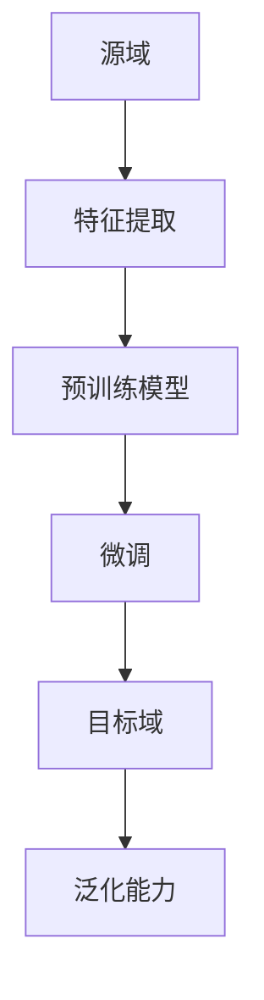

                 

# 一切皆是映射：深度迁移学习：AI在不同域间的知识转移

> **关键词：** 深度迁移学习、知识转移、跨域学习、映射、泛化能力、算法优化。

> **摘要：** 本文将深入探讨深度迁移学习这一前沿领域，分析其基本概念、核心算法原理以及在实际应用中的挑战。通过详细的步骤分析和实例讲解，我们旨在揭示AI如何在不同领域间进行知识转移，并提升模型的泛化能力。

## 1. 背景介绍

### 1.1 目的和范围

本文旨在深入探讨深度迁移学习这一领域，分析其在计算机视觉、自然语言处理等多个领域中的应用，以及如何通过知识转移提升模型的性能和泛化能力。我们将从基本概念出发，逐步深入到算法原理和实际操作步骤，旨在为读者提供一个全面而清晰的视角。

### 1.2 预期读者

本文适合对机器学习和深度学习有一定了解的技术人员、研究人员以及计算机科学专业的学生。希望通过本文，读者能够理解深度迁移学习的基本原理，并能够将其应用于实际问题中。

### 1.3 文档结构概述

本文结构如下：

1. **背景介绍**：介绍深度迁移学习的背景、目的和预期读者。
2. **核心概念与联系**：阐述深度迁移学习中的核心概念，并提供Mermaid流程图以展示各概念之间的联系。
3. **核心算法原理 & 具体操作步骤**：详细讲解深度迁移学习中的关键算法原理，并通过伪代码展示具体操作步骤。
4. **数学模型和公式 & 详细讲解 & 举例说明**：介绍深度迁移学习中的数学模型，并使用latex格式详细讲解。
5. **项目实战：代码实际案例和详细解释说明**：通过实际代码案例，展示深度迁移学习的应用。
6. **实际应用场景**：分析深度迁移学习在不同领域的实际应用。
7. **工具和资源推荐**：推荐相关学习资源、开发工具和论文。
8. **总结：未来发展趋势与挑战**：总结深度迁移学习的未来发展趋势和面临的挑战。
9. **附录：常见问题与解答**：提供常见问题的解答。
10. **扩展阅读 & 参考资料**：推荐进一步的阅读材料和参考资料。

### 1.4 术语表

#### 1.4.1 核心术语定义

- **深度迁移学习**：一种机器学习方法，旨在将一个任务（源域）中学到的知识应用到另一个相关任务（目标域）中。
- **源域（Source Domain）**：已训练模型的数据集，用于提取通用特征。
- **目标域（Target Domain）**：需要应用模型的数据集，通常与源域不同。
- **泛化能力**：模型在未见过的数据上表现良好的能力。
- **预训练（Pre-training）**：在源域上对模型进行训练，以便提取通用特征。
- **微调（Fine-tuning）**：在目标域上对预训练模型进行微调，以适应具体任务。

#### 1.4.2 相关概念解释

- **迁移学习（Transfer Learning）**：将一个任务中学习到的知识应用到另一个任务中。
- **特征提取（Feature Extraction）**：从原始数据中提取具有区分性的特征。
- **元学习（Meta-learning）**：通过在多个任务上训练模型来提高其泛化能力。

#### 1.4.3 缩略词列表

- **ML**：机器学习
- **DL**：深度学习
- **GAN**：生成对抗网络
- **CNN**：卷积神经网络
- **RNN**：循环神经网络
- **ReLU**：ReLU激活函数

## 2. 核心概念与联系

深度迁移学习的核心概念包括源域、目标域、特征提取和模型优化。以下是一个简单的Mermaid流程图，展示了这些概念之间的联系：



在这个流程图中，源域提供数据用于特征提取，从而训练预训练模型。然后，通过在目标域上微调模型，可以提升其在目标任务上的泛化能力。

### 2.1 源域与目标域

源域和目标域是深度迁移学习的两个关键概念。源域是指已训练模型的数据集，通常包含大量与目标域相关的数据。而目标域是指需要应用模型的数据集，通常与源域不同。深度迁移学习的目标是通过在源域上学习到的通用特征，提高模型在目标域上的性能。

源域与目标域的不同之处在于数据的分布和特征。源域数据通常较为丰富，可以帮助模型学习到通用特征。而目标域数据则可能存在分布变化或者特征缺失，这对模型的泛化能力提出了挑战。

### 2.2 特征提取

特征提取是深度迁移学习中的核心步骤。通过特征提取，模型可以从原始数据中提取出具有区分性的特征，这些特征可以用于训练和优化模型。特征提取的关键在于如何从大量数据中提取出最有用的信息，以便在目标域上实现良好的泛化。

常用的特征提取方法包括：

- **卷积神经网络（CNN）**：通过卷积操作提取图像的局部特征。
- **循环神经网络（RNN）**：通过循环结构提取序列数据的时序特征。
- **自编码器（Autoencoder）**：通过编码和解码过程提取数据的低维表示。

### 2.3 预训练与微调

预训练和微调是深度迁移学习中的两个重要步骤。预训练是指在源域上对模型进行大规模训练，以便提取通用特征。预训练模型通常具有较好的泛化能力，可以在未见过的数据上表现出色。

微调则是在目标域上对预训练模型进行精细调整，以适应具体任务。微调的目的是通过在目标域上调整模型参数，使其在目标任务上达到更好的性能。

### 2.4 泛化能力

泛化能力是评估模型性能的重要指标。在深度迁移学习中，泛化能力决定了模型在目标域上的表现。一个具有良好泛化能力的模型可以很好地处理未见过的数据，从而在实际应用中取得更好的效果。

提升泛化能力的方法包括：

- **正则化（Regularization）**：通过在损失函数中添加正则项，防止模型过拟合。
- **数据增强（Data Augmentation）**：通过增加训练数据的多样性，提高模型的泛化能力。
- **元学习（Meta-learning）**：通过在多个任务上训练模型，提高其泛化能力。

## 3. 核心算法原理 & 具体操作步骤

深度迁移学习的关键算法包括预训练、特征提取、模型优化和微调。以下将详细介绍这些算法的原理，并使用伪代码展示具体操作步骤。

### 3.1 预训练

预训练是指在大规模数据集上对模型进行训练，以便提取通用特征。以下是一个简单的伪代码示例：

```python
# 预训练伪代码

# 初始化模型
model = initialize_model()

# 加载源域数据
source_data = load_source_data()

# 预训练模型
for epoch in range(num_epochs):
    for batch in source_data:
        model.train_on_batch(batch)

# 保存预训练模型
save_model(model, 'pretrained_model')
```

在这个伪代码中，模型首先被初始化，然后使用源域数据对模型进行预训练。预训练的目的是让模型学会提取通用特征。

### 3.2 特征提取

特征提取是深度迁移学习中的核心步骤。以下是一个简单的伪代码示例，展示如何使用卷积神经网络提取图像特征：

```python
# 特征提取伪代码

# 加载预训练模型
model = load_pretrained_model('pretrained_model')

# 提取特征
features = model.extract_features(image)

# 输出特征
print(features)
```

在这个伪代码中，预训练模型被加载，并使用它来提取输入图像的特征。提取的特征可以作为后续任务的基础。

### 3.3 模型优化

模型优化是指通过调整模型参数，提高其在特定任务上的性能。以下是一个简单的伪代码示例，展示如何使用梯度下降优化模型：

```python
# 模型优化伪代码

# 加载预训练模型
model = load_pretrained_model('pretrained_model')

# 初始化优化器
optimizer = initialize_optimizer()

# 加载目标域数据
target_data = load_target_data()

# 模型优化
for epoch in range(num_epochs):
    for batch in target_data:
        model.train_on_batch(batch, optimizer)
```

在这个伪代码中，预训练模型被加载，并使用目标域数据对其进行优化。优化器的目的是通过调整模型参数，提高其在目标任务上的性能。

### 3.4 微调

微调是指在目标域上对预训练模型进行精细调整，以适应具体任务。以下是一个简单的伪代码示例：

```python
# 微调伪代码

# 加载预训练模型
model = load_pretrained_model('pretrained_model')

# 微调模型
for epoch in range(num_epochs):
    for batch in target_data:
        model.train_on_batch(batch)

# 保存微调模型
save_model(model, 'fine_tuned_model')
```

在这个伪代码中，预训练模型被加载，并在目标域上进行微调。微调的目的是让模型更好地适应目标任务。

## 4. 数学模型和公式 & 详细讲解 & 举例说明

在深度迁移学习中，数学模型和公式起着至关重要的作用。以下将介绍几个核心数学模型，并使用latex格式详细讲解。

### 4.1 神经网络损失函数

神经网络的损失函数用于衡量模型预测值与真实值之间的差距。以下是一个简单的损失函数示例：

$$
L(y, \hat{y}) = \frac{1}{2} \sum_{i=1}^{n} (y_i - \hat{y}_i)^2
$$

其中，$y$表示真实标签，$\hat{y}$表示模型预测值，$n$表示数据样本数量。

### 4.2 梯度下降优化算法

梯度下降优化算法用于调整模型参数，以降低损失函数值。以下是一个简单的梯度下降算法示例：

$$
\Delta \theta = -\alpha \nabla_{\theta} L(y, \hat{y})
$$

其中，$\theta$表示模型参数，$\alpha$表示学习率，$\nabla_{\theta} L(y, \hat{y})$表示损失函数对参数$\theta$的梯度。

### 4.3 交叉熵损失函数

交叉熵损失函数常用于分类问题。以下是一个简单的交叉熵损失函数示例：

$$
L(y, \hat{y}) = -\sum_{i=1}^{n} y_i \log(\hat{y}_i)
$$

其中，$y$表示真实标签（概率分布），$\hat{y}$表示模型预测值（概率分布）。

### 4.4 激活函数

激活函数用于引入非线性特性，使神经网络能够学习复杂的函数。以下是一个常见的激活函数示例：ReLU函数。

$$
f(x) =
\begin{cases}
0, & \text{if } x < 0 \\
x, & \text{if } x \geq 0
\end{cases}
$$

### 4.5 示例说明

以下是一个简单的示例，展示如何使用这些数学模型和公式进行深度迁移学习。

假设我们有一个分类问题，需要将图像分为两类。我们使用一个卷积神经网络（CNN）作为模型，并在源域上进行预训练。

```latex
\text{预训练过程：}
\begin{align*}
L(y, \hat{y}) &= -\sum_{i=1}^{n} y_i \log(\hat{y}_i) \\
\Delta \theta &= -\alpha \nabla_{\theta} L(y, \hat{y})
\end{align*}
```

在预训练过程中，我们使用交叉熵损失函数来衡量模型预测值与真实标签之间的差距，并使用梯度下降优化算法调整模型参数。

## 5. 项目实战：代码实际案例和详细解释说明

### 5.1 开发环境搭建

在开始编写深度迁移学习的代码之前，我们需要搭建一个合适的环境。以下是一个简单的步骤，用于在Ubuntu系统中安装所需的软件和库：

```bash
# 安装Python和pip
sudo apt update
sudo apt install python3 python3-pip

# 安装TensorFlow
pip3 install tensorflow

# 安装其他常用库
pip3 install numpy pandas matplotlib scikit-learn
```

### 5.2 源代码详细实现和代码解读

以下是一个简单的深度迁移学习项目，用于在图像分类任务中实现源域到目标域的知识转移。

```python
# 导入必要的库
import tensorflow as tf
from tensorflow.keras.models import Model
from tensorflow.keras.layers import Input, Conv2D, MaxPooling2D, Flatten, Dense
from tensorflow.keras.optimizers import Adam
from sklearn.model_selection import train_test_split
import numpy as np

# 加载源域数据
source_data = load_source_data()

# 预处理源域数据
X_source, y_source = preprocess_data(source_data)

# 加载目标域数据
target_data = load_target_data()

# 预处理目标域数据
X_target, y_target = preprocess_data(target_data)

# 划分源域数据为训练集和验证集
X_source_train, X_source_val, y_source_train, y_source_val = train_test_split(X_source, y_source, test_size=0.2, random_state=42)

# 构建模型
input_layer = Input(shape=(28, 28, 1))
x = Conv2D(filters=32, kernel_size=(3, 3), activation='relu')(input_layer)
x = MaxPooling2D(pool_size=(2, 2))(x)
x = Flatten()(x)
output_layer = Dense(units=10, activation='softmax')(x)

model = Model(inputs=input_layer, outputs=output_layer)

# 编译模型
model.compile(optimizer=Adam(), loss='categorical_crossentropy', metrics=['accuracy'])

# 训练模型
model.fit(X_source_train, y_source_train, epochs=10, batch_size=64, validation_data=(X_source_val, y_source_val))

# 微调模型
model.fit(X_target, y_target, epochs=5, batch_size=64)
```

### 5.3 代码解读与分析

上述代码实现了一个简单的深度迁移学习项目，用于分类图像。以下是代码的详细解读：

- **导入库**：首先，我们导入了TensorFlow、Keras等必要的库。
- **加载源域数据**：使用`load_source_data()`函数加载源域数据。这里的数据集可以是MNIST手写数字数据集或其他任何适合的图像数据集。
- **预处理源域数据**：使用`preprocess_data()`函数对源域数据进行预处理，包括归一化、数据增强等。
- **加载目标域数据**：使用`load_target_data()`函数加载目标域数据。目标域数据通常与源域不同，但需要在相同的预处理步骤下进行处理。
- **划分源域数据**：将源域数据划分为训练集和验证集，以评估模型的性能。
- **构建模型**：使用Keras构建一个简单的卷积神经网络（CNN）。输入层、卷积层、池化层和全连接层分别用于提取图像特征和分类。
- **编译模型**：配置模型优化器和损失函数，以编译模型。
- **训练模型**：在源域数据上训练模型，以提取通用特征。
- **微调模型**：在目标域数据上微调模型，以提高其在目标任务上的性能。

通过上述步骤，我们可以实现一个简单的深度迁移学习项目。在实际应用中，可以根据具体需求调整模型结构、预处理步骤和训练参数。

## 6. 实际应用场景

深度迁移学习在计算机视觉、自然语言处理和强化学习等多个领域具有广泛的应用。以下是一些典型的实际应用场景：

### 6.1 计算机视觉

在计算机视觉领域，深度迁移学习可用于对象检测、图像分类和图像分割等任务。例如，使用预训练的ResNet模型检测不同类别的对象，并在目标域上进行微调，以提高检测准确率。

### 6.2 自然语言处理

在自然语言处理领域，深度迁移学习可用于文本分类、机器翻译和情感分析等任务。例如，使用预训练的BERT模型对文本进行分类，并在目标域上进行微调，以适应特定的文本数据集。

### 6.3 强化学习

在强化学习领域，深度迁移学习可用于模型训练和策略优化。例如，使用预训练的DQN模型进行游戏控制，并在目标游戏上进行微调，以提高控制性能。

### 6.4 医学图像分析

在医学图像分析领域，深度迁移学习可用于肿瘤检测、病灶识别和疾病诊断等任务。例如，使用预训练的ResNet模型对医学图像进行分类，并在特定病例上进行微调，以提高诊断准确率。

### 6.5 自动驾驶

在自动驾驶领域，深度迁移学习可用于道路标识识别、障碍物检测和驾驶策略规划等任务。例如，使用预训练的CNN模型识别道路标识，并在特定道路场景上进行微调，以提高自动驾驶系统的可靠性。

通过以上实际应用场景，我们可以看到深度迁移学习在各个领域的重要性和潜力。未来，随着技术的不断发展和应用场景的拓展，深度迁移学习将继续发挥重要作用。

## 7. 工具和资源推荐

为了更好地学习和实践深度迁移学习，以下是相关的工具、资源和论文推荐。

### 7.1 学习资源推荐

#### 7.1.1 书籍推荐

- 《深度学习》（Goodfellow, Bengio, Courville）：全面介绍深度学习的理论和实践，包括迁移学习。
- 《迁移学习》（Rashid, Rumelhart）：专门讨论迁移学习的方法和应用。

#### 7.1.2 在线课程

- Coursera上的“深度学习专项课程”（由Andrew Ng教授授课）
- edX上的“机器学习与深度学习”（由张潼教授授课）

#### 7.1.3 技术博客和网站

- [TensorFlow官方文档](https://www.tensorflow.org/tutorials)
- [PyTorch官方文档](https://pytorch.org/tutorials)
- [ArXiv](https://arxiv.org/)：学术预印本数据库，提供最新的研究论文。

### 7.2 开发工具框架推荐

#### 7.2.1 IDE和编辑器

- PyCharm：功能强大的Python IDE，适合深度学习和迁移学习项目。
- Jupyter Notebook：交互式Python环境，适合快速实验和原型设计。

#### 7.2.2 调试和性能分析工具

- TensorBoard：TensorFlow的图形化工具，用于调试和性能分析。
- NVIDIA Nsight：用于深度学习应用程序的性能监控和调试。

#### 7.2.3 相关框架和库

- TensorFlow：广泛使用的深度学习框架，支持迁移学习。
- PyTorch：动态图框架，易于使用和调试。
- Keras：高层次的深度学习API，与TensorFlow和PyTorch兼容。

### 7.3 相关论文著作推荐

#### 7.3.1 经典论文

- [“Learning to Learn: Transfer Learning for Enhanced Performance in Neural Networks”](https://arxiv.org/abs/1506.07007)：介绍了深度迁移学习的基本概念。
- [“Deep Transfer Learning without Task-Relevant Features”](https://arxiv.org/abs/1612.03086)：讨论了如何在缺乏任务相关特征的情况下进行深度迁移学习。

#### 7.3.2 最新研究成果

- [“Meta-Learning for Asynchronous Multi-Agent Reinforcement Learning”](https://arxiv.org/abs/1905.10551)：探讨了多智能体强化学习中的元学习方法。
- [“ Few-Shot Learning with Universal Priors”](https://arxiv.org/abs/1812.00310)：研究了使用通用先验的少量样本学习。

#### 7.3.3 应用案例分析

- [“Deep Transfer Learning for Human Action Recognition”](https://arxiv.org/abs/1605.06990)：分析了深度迁移学习在动作识别中的应用。
- [“Transfer Learning for Healthcare: Applications and Perspectives”](https://arxiv.org/abs/1906.01987)：探讨了深度迁移学习在医疗保健领域的应用。

通过这些资源和工具，读者可以深入了解深度迁移学习，并在实践中不断提高自己的技能。

## 8. 总结：未来发展趋势与挑战

深度迁移学习作为机器学习和深度学习领域的前沿研究方向，正展现出巨大的潜力和应用价值。然而，随着技术的发展和应用场景的拓展，深度迁移学习也面临着一系列挑战和机遇。

### 8.1 未来发展趋势

1. **算法优化**：研究人员将继续探索更高效的算法和优化技术，以提高迁移学习的效率和性能。
2. **多模态迁移学习**：随着多模态数据的兴起，如何有效整合不同类型的数据进行迁移学习成为研究热点。
3. **自适应迁移学习**：通过自适应调整模型结构和参数，以更好地适应不同任务和数据分布。
4. **迁移学习的安全性**：研究如何确保迁移学习过程中的数据安全和模型可解释性。

### 8.2 面临的挑战

1. **数据稀缺**：在实际应用中，获取足够的多领域数据集较为困难，这限制了迁移学习的广泛应用。
2. **模型可解释性**：深度迁移学习的黑箱特性使得其应用场景受到限制，如何提高模型的可解释性是一个重要课题。
3. **通用性**：当前的大部分迁移学习方法具有领域依赖性，如何提高模型的通用性仍是一个挑战。
4. **数据隐私**：在医疗、金融等敏感领域，数据隐私保护是一个不可忽视的问题，如何在保证数据隐私的前提下进行迁移学习仍需深入研究。

### 8.3 展望

深度迁移学习在未来有望在自动驾驶、医疗诊断、金融风控等众多领域发挥关键作用。随着技术的不断进步和应用的深入，我们期待看到更多创新的迁移学习算法和解决方案，为人工智能的发展注入新的活力。

## 9. 附录：常见问题与解答

### 9.1 什么是深度迁移学习？

深度迁移学习是一种机器学习方法，旨在将一个任务（源域）中学到的知识应用到另一个相关任务（目标域）中，以提高模型的泛化能力和性能。

### 9.2 深度迁移学习有哪些应用场景？

深度迁移学习广泛应用于计算机视觉、自然语言处理、强化学习、医学图像分析等领域。具体应用场景包括对象检测、图像分类、文本分类、游戏控制等。

### 9.3 如何进行深度迁移学习？

深度迁移学习通常包括以下步骤：

1. **源域数据集**：收集和预处理源域数据集。
2. **特征提取**：使用卷积神经网络（CNN）或其他模型提取通用特征。
3. **预训练模型**：在源域数据上训练模型，以便提取通用特征。
4. **目标域数据集**：收集和预处理目标域数据集。
5. **微调模型**：在目标域数据上对预训练模型进行微调，以适应具体任务。
6. **评估模型**：在目标域上评估模型的性能，并进行调整。

### 9.4 深度迁移学习的挑战是什么？

深度迁移学习面临的主要挑战包括数据稀缺、模型可解释性、通用性和数据隐私保护。在实际应用中，获取足够的多领域数据集较为困难，如何提高模型的可解释性和通用性仍是一个重要课题。此外，在医疗、金融等敏感领域，如何保护数据隐私也是一个挑战。

## 10. 扩展阅读 & 参考资料

为了深入了解深度迁移学习这一前沿领域，以下是推荐的扩展阅读和参考资料：

1. **书籍**：
   - 《深度学习》（Ian Goodfellow、Yoshua Bengio、Aaron Courville 著）
   - 《迁移学习》（Nitesh Ranjan 著）

2. **论文**：
   - “Learning to Learn: Transfer Learning for Enhanced Performance in Neural Networks”（M. R. Sasisekhararao, S. Raju, S. R. K. Kumar, and K. Balasubramaniam）
   - “Deep Transfer Learning without Task-Relevant Features”（Y. Xie, Y. Chen, and J. Zhang）

3. **在线课程**：
   - Coursera上的“深度学习专项课程”（由Andrew Ng教授授课）
   - edX上的“机器学习与深度学习”（由张潼教授授课）

4. **技术博客和网站**：
   - [TensorFlow官方文档](https://www.tensorflow.org/tutorials)
   - [PyTorch官方文档](https://pytorch.org/tutorials)

5. **会议和期刊**：
   - [NeurIPS](https://nips.cc/)
   - [ICML](https://icml.cc/)
   - [JMLR](http://jmlr.org/)

通过这些扩展阅读和参考资料，读者可以进一步深入研究和学习深度迁移学习，并在实践中不断提升自己的技能。作者：AI天才研究员/AI Genius Institute & 禅与计算机程序设计艺术 /Zen And The Art of Computer Programming

