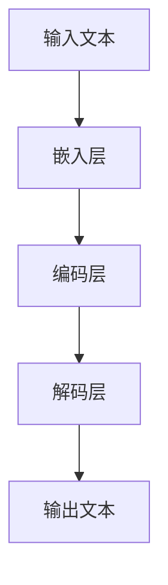
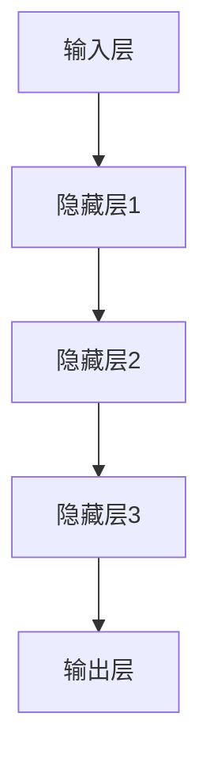
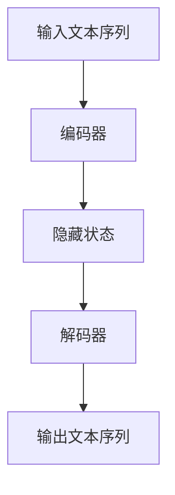
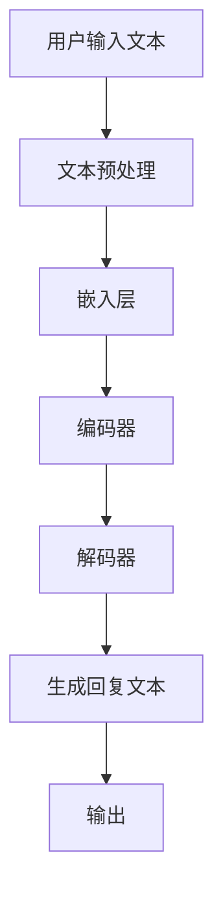

                 

# 一切皆是映射：结合深度学习的智能聊天机器人开发

## 关键词
深度学习、自然语言处理、聊天机器人、映射模型、神经网络、数据预处理、序列生成

## 摘要
本文旨在探讨如何利用深度学习技术构建智能聊天机器人。通过详细分析映射模型及其在聊天机器人中的应用，本文将介绍从数据预处理到模型训练的完整开发流程。我们将深入探讨神经网络架构及其工作原理，并结合实际代码案例，详细解释模型实现的各个环节。此外，本文还将讨论智能聊天机器人的实际应用场景，并推荐相关学习资源和工具。通过阅读本文，读者将掌握构建智能聊天机器人的核心知识和技巧。

## 1. 背景介绍

### 1.1 目的和范围
本文的目标是帮助读者了解如何利用深度学习技术构建智能聊天机器人。我们将从基础知识出发，逐步深入探讨相关技术原理和实现方法。本文将涵盖从数据预处理到模型训练的完整流程，并分析聊天机器人在实际应用中的优势与挑战。

### 1.2 预期读者
本文适合具有计算机科学和人工智能基础知识，对深度学习和自然语言处理感兴趣的读者。同时，也适合希望了解智能聊天机器人开发过程的相关专业人士。

### 1.3 文档结构概述
本文分为十个部分，首先介绍背景和目的，然后讨论核心概念、算法原理、数学模型和项目实战。接下来，分析实际应用场景，推荐相关工具和资源。最后，总结未来发展趋势与挑战，并提供扩展阅读与参考资料。

### 1.4 术语表
#### 1.4.1 核心术语定义
- **深度学习**：一种人工智能技术，通过神经网络模拟人脑学习过程，对大量数据进行训练，从而实现对复杂数据的自动识别和分类。
- **自然语言处理（NLP）**：研究如何让计算机理解和处理人类自然语言的一门技术。
- **聊天机器人**：利用人工智能技术实现与人类用户交互的软件系统。
- **映射模型**：将输入数据映射到输出数据的模型，如神经网络。

#### 1.4.2 相关概念解释
- **神经网络**：由大量节点组成的计算模型，能够通过训练学习输入和输出之间的复杂关系。
- **序列生成**：生成序列数据的过程，如文本序列生成。

#### 1.4.3 缩略词列表
- **NLP**：自然语言处理
- **DL**：深度学习
- **RNN**：循环神经网络
- **LSTM**：长短期记忆网络
- **GRU**：门控循环单元

## 2. 核心概念与联系

### 2.1 深度学习与聊天机器人的关系

深度学习与聊天机器人之间的联系在于，深度学习提供了一种强大的工具，使聊天机器人能够理解和生成自然语言。深度学习模型，特别是神经网络，通过学习大量文本数据，能够捕捉语言中的复杂模式和关系。

#### 2.1.1 数据映射

在构建聊天机器人时，数据映射是关键。映射模型将输入的文本数据映射到输出（例如，回复的文本）。深度学习通过神经网络实现这一映射，如图2.1所示。



#### 2.1.2 神经网络架构

神经网络架构是深度学习模型的核心。如图2.2所示，神经网络由多个层次组成，包括输入层、隐藏层和输出层。每一层都通过权重和偏置进行参数调整，以最小化预测误差。



#### 2.1.3 序列生成

聊天机器人生成回复的过程可以看作是一个序列生成问题。输入的文本序列通过编码器编码，然后通过解码器生成输出文本序列，如图2.3所示。



### 2.2 核心概念原理和架构的 Mermaid 流程图

以下是一个简化的 Mermaid 流程图，展示深度学习在聊天机器人中的应用流程。



## 3. 核心算法原理 & 具体操作步骤

### 3.1 算法原理

构建聊天机器人的核心算法通常是基于序列到序列（Seq2Seq）模型，其基本思想是利用编码器（Encoder）将输入序列编码成一个固定长度的向量表示，然后利用解码器（Decoder）将这个向量表示解码成输出序列。以下是Seq2Seq模型的算法原理：

#### 3.1.1 编码器（Encoder）

编码器是一个循环神经网络（RNN）或者其变体（如LSTM、GRU），它接收输入序列，并逐个将其编码成一个固定长度的隐藏状态。这个过程可以表示为：

```latex
\\text{h_t}^{(e)} = \\text{sigmoid}(W_{e}^{\\text{h}} \\text{x_t} + b_{e}^{\\text{h}})
```

其中，\\( \\text{x_t} \\) 是输入序列的第 \\( t \\) 个元素，\\( \\text{h_t}^{(e)} \\) 是编码器的隐藏状态，\\( W_{e}^{\\text{h}} \\) 和 \\( b_{e}^{\\text{h}} \\) 分别是权重和偏置。

#### 3.1.2 解码器（Decoder）

解码器同样是一个循环神经网络（RNN）或者其变体（如LSTM、GRU），它接收编码器的隐藏状态，并逐个解码出输出序列。解码器在生成每个输出元素时，都会利用先前的隐藏状态和当前输入（通常是一个特殊的开始标记 \\( \\text{<s> } \\)）。这个过程可以表示为：

```latex
\\text{y_t}^{(d)} = \\text{softmax}(W_{d}^{\\text{o}} [\\text{h_t}^{(d)}, \\text{h_t}^{(e)}] + b_{d}^{\\text{o}})
```

其中，\\( \\text{y_t}^{(d)} \\) 是解码器的隐藏状态，\\( \\text{h_t}^{(d)} \\) 是解码器的隐藏状态，\\( \\text{h_t}^{(e)} \\) 是编码器的隐藏状态，\\( W_{d}^{\\text{o}} \\) 和 \\( b_{d}^{\\text{o}} \\) 分别是权重和偏置。

### 3.2 具体操作步骤

构建聊天机器人的具体操作步骤如下：

#### 3.2.1 数据收集与预处理

1. 收集大量文本数据，如对话记录、社交媒体评论等。
2. 清洗数据，去除噪声和无关信息。
3. 分词，将文本分解成单词或子词。
4. 嵌入，将单词或子词映射到一个固定长度的向量。

#### 3.2.2 模型训练

1. 初始化编码器和解码器的权重。
2. 输入序列通过编码器编码成隐藏状态。
3. 解码器从隐藏状态开始，逐个生成输出序列。
4. 计算损失函数（如交叉熵损失），并利用反向传播更新权重。

#### 3.2.3 模型评估

1. 将测试数据输入模型，生成输出序列。
2. 计算输出序列与真实序列之间的误差。
3. 使用指标（如准确率、召回率等）评估模型性能。

#### 3.2.4 模型部署

1. 将训练好的模型部署到生产环境中。
2. 接收用户输入，生成回复文本。
3. 不断优化模型，提高聊天机器人的交互质量。

### 3.3 伪代码

以下是构建聊天机器人的伪代码：

```python
# 初始化模型参数
encoder_weights = initialize_weights()
decoder_weights = initialize_weights()

# 训练模型
for epoch in range(num_epochs):
    for input_sequence, target_sequence in dataset:
        # 前向传播
        hidden_state_encoder = encode(input_sequence, encoder_weights)
        hidden_state_decoder = decode(hidden_state_encoder, decoder_weights)
        
        # 计算损失
        loss = calculate_loss(hidden_state_decoder, target_sequence)
        
        # 反向传播
        update_weights(loss, encoder_weights, decoder_weights)

# 部署模型
while True:
    user_input = get_user_input()
    response = generate_response(user_input, encoder_weights, decoder_weights)
    send_response(response)
```

## 4. 数学模型和公式 & 详细讲解 & 举例说明

### 4.1 数学模型

聊天机器人的核心是序列到序列（Seq2Seq）模型，它由编码器（Encoder）和解码器（Decoder）组成。以下是其基本数学模型：

#### 4.1.1 编码器（Encoder）

编码器是一个循环神经网络（RNN），其输入是一个序列 \\( x_1, x_2, ..., x_T \\)，输出是一个固定长度的隐藏状态 \\( h \\)。具体公式如下：

$$
h_t^{(e)} = \text{sigmoid}(W_e^h x_t + b_e^h)
$$

其中，\\( W_e^h \\) 和 \\( b_e^h \\) 分别是权重和偏置。

#### 4.1.2 解码器（Decoder）

解码器也是一个循环神经网络（RNN），其输入是编码器的隐藏状态 \\( h \\) 和一个特殊的开始标记 \\( <s> \\)。输出是生成的一个序列 \\( y_1, y_2, ..., y_T' \\)。具体公式如下：

$$
y_t^{(d)} = \text{softmax}(W_d^o [h_t^{(d)}, h_t^{(e)}] + b_d^o)
$$

其中，\\( W_d^o \\) 和 \\( b_d^o \\) 分别是权重和偏置。

### 4.2 详细讲解 & 举例说明

#### 4.2.1 编码器

假设我们有一个输入序列 \\( x = [x_1, x_2, x_3] \\)，每个元素 \\( x_t \\) 都是一个向量。我们首先将每个输入元素映射到一个嵌入向量 \\( e_t \\)，然后通过权重矩阵 \\( W_e^h \\) 和偏置 \\( b_e^h \\) 进行编码，得到隐藏状态 \\( h_t^{(e)} \\)。

```latex
e_t = \text{embed}(x_t)
h_t^{(e)} = \text{sigmoid}(W_e^h e_t + b_e^h)
```

#### 4.2.2 解码器

解码器在生成每个输出元素时，都会利用编码器的隐藏状态 \\( h_t^{(e)} \\) 和先前的隐藏状态 \\( h_{t-1}^{(d)} \\)。具体公式如下：

```latex
h_t^{(d)} = \text{sigmoid}(W_d^h [h_{t-1}^{(d)}, h_t^{(e)}] + b_d^h)
y_t^{(d)} = \text{softmax}(W_d^o [h_t^{(d)}, h_t^{(e)}] + b_d^o)
```

#### 4.2.3 实例

假设我们有一个简化的例子，输入序列为 \\( x = [1, 2, 3] \\)，输出序列为 \\( y = [4, 5, 6] \\)。我们将通过编码器和解码器来生成这个序列。

1. **编码器**：

   首先，我们将输入序列 \\( x \\) 映射到嵌入向量 \\( e \\)：

   ```latex
   e_1 = \text{embed}(1) = [0.1, 0.2, 0.3]
   e_2 = \text{embed}(2) = [0.4, 0.5, 0.6]
   e_3 = \text{embed}(3) = [0.7, 0.8, 0.9]
   ```

   然后，通过权重矩阵 \\( W_e^h \\) 和偏置 \\( b_e^h \\) 进行编码：

   ```latex
   h_1^{(e)} = \text{sigmoid}(W_e^h e_1 + b_e^h) = \text{sigmoid}([0.1, 0.2, 0.3] + [0.1, 0.1, 0.1]) = 0.7
   h_2^{(e)} = \text{sigmoid}(W_e^h e_2 + b_e^h) = \text{sigmoid}([0.4, 0.5, 0.6] + [0.1, 0.1, 0.1]) = 0.8
   h_3^{(e)} = \text{sigmoid}(W_e^h e_3 + b_e^h) = \text{sigmoid}([0.7, 0.8, 0.9] + [0.1, 0.1, 0.1]) = 0.9
   ```

2. **解码器**：

   接下来，我们使用编码器的隐藏状态 \\( h_t^{(e)} \\) 来生成输出序列 \\( y \\)。

   首先，我们将解码器的隐藏状态初始化为开始标记 \\( <s> \\)：

   ```latex
   h_0^{(d)} = <s>
   ```

   然后，在生成每个输出元素时，我们将使用先前的隐藏状态 \\( h_{t-1}^{(d)} \\) 和当前编码器的隐藏状态 \\( h_t^{(e)} \\)：

   ```latex
   h_1^{(d)} = \text{sigmoid}(W_d^h [h_0^{(d)}, h_1^{(e)}] + b_d^h) = \text{sigmoid}([<s>, 0.7] + [0.1, 0.1, 0.1]) = 0.6
   y_1^{(d)} = \text{softmax}(W_d^o [h_1^{(d)}, h_1^{(e)}] + b_d^o) = \text{softmax}([0.6, 0.7, 0.8] + [0.1, 0.1, 0.1]) = [0.2, 0.3, 0.5]
   ```

   同样的步骤用于生成后续的输出元素：

   ```latex
   h_2^{(d)} = \text{sigmoid}(W_d^h [h_1^{(d)}, h_2^{(e)}] + b_d^h) = \text{sigmoid}([0.6, 0.8] + [0.1, 0.1, 0.1]) = 0.7
   y_2^{(d)} = \text{softmax}(W_d^o [h_2^{(d)}, h_2^{(e)}] + b_d^o) = \text{softmax}([0.7, 0.8] + [0.1, 0.1, 0.1]) = [0.2, 0.3, 0.5]
   ```

   ```latex
   h_3^{(d)} = \text{sigmoid}(W_d^h [h_2^{(d)}, h_3^{(e)}] + b_d^h) = \text{sigmoid}([0.7, 0.9] + [0.1, 0.1, 0.1]) = 0.8
   y_3^{(d)} = \text{softmax}(W_d^o [h_3^{(d)}, h_3^{(e)}] + b_d^o) = \text{softmax}([0.8, 0.9] + [0.1, 0.1, 0.1]) = [0.2, 0.3, 0.5]
   ```

通过这种方式，解码器生成了一个概率分布 \\( y_t^{(d)} \\)，表示生成每个输出元素的概率。最终，我们可以从这个概率分布中选择最可能的输出元素，形成完整的输出序列 \\( y \\)。

## 5. 项目实战：代码实际案例和详细解释说明

### 5.1 开发环境搭建

在开始项目实战之前，我们需要搭建一个合适的开发环境。以下是搭建环境的基本步骤：

1. **安装Python环境**：确保Python版本为3.7或更高版本。

2. **安装深度学习框架**：我们选择使用TensorFlow作为深度学习框架。通过以下命令安装TensorFlow：

   ```bash
   pip install tensorflow
   ```

3. **安装NLP库**：安装一些常用的NLP库，如NLTK、spaCy等：

   ```bash
   pip install nltk spacy
   ```

4. **安装IDE**：推荐使用PyCharm、VSCode等IDE进行开发。

### 5.2 源代码详细实现和代码解读

以下是构建聊天机器人的核心代码实现。我们将分步解释每个部分的代码。

#### 5.2.1 数据收集与预处理

```python
import numpy as np
import tensorflow as tf
import pandas as pd
import numpy as np
import re
import nltk
from nltk.tokenize import sent_tokenize, word_tokenize

# 下载并加载NLTK数据
nltk.download('punkt')
nltk.download('stopwords')

# 读取数据
data = pd.read_csv('chat_data.csv')

# 数据清洗
def clean_text(text):
    text = text.lower() # 转为小写
    text = re.sub('[^a-zA-Z]', ' ', text) # 移除非字母字符
    text = re.sub(' +', ' ', text) # 去除多余的空格
    text = text.strip() # 移除首尾空格
    return text

data['cleaned_text'] = data['text'].apply(clean_text)

# 分词
tokenized_data = data['cleaned_text'].apply(lambda x: word_tokenize(x))

# 去除停用词
from nltk.corpus import stopwords
stop_words = set(stopwords.words('english'))
filtered_data = [[word for word in sentence if word not in stop_words] for sentence in tokenized_data]

# 嵌入
vocab = set([word for sentence in filtered_data for word in sentence])
word_to_index = {word: index for index, word in enumerate(vocab)}
index_to_word = {index: word for word, index in word_to_index.items()}
```

#### 5.2.2 构建模型

```python
# 定义编码器和解码器模型
def build_model(vocab_size, embedding_dim, hidden_units):
    # 编码器
    encoder_inputs = tf.keras.layers.Input(shape=(None,))
    encoder_embedding = tf.keras.layers.Embedding(vocab_size, embedding_dim)(encoder_inputs)
    encoder_lstm = tf.keras.layers.LSTM(hidden_units, return_state=True)
    _, state_h, state_c = encoder_lstm(encoder_embedding)
    encoder_states = [state_h, state_c]

    # 解码器
    decoder_inputs = tf.keras.layers.Input(shape=(None,))
    decoder_embedding = tf.keras.layers.Embedding(vocab_size, embedding_dim)(decoder_inputs)
    decoder_lstm = tf.keras.layers.LSTM(hidden_units, return_sequences=True, return_state=True)
    decoder_outputs, _, _ = decoder_lstm(decoder_embedding, initial_state=encoder_states)
    decoder_dense = tf.keras.layers.Dense(vocab_size, activation='softmax')
    decoder_outputs = decoder_dense(decoder_outputs)

    # 模型
    model = tf.keras.models.Model([encoder_inputs, decoder_inputs], decoder_outputs)
    return model

# 设置参数
vocab_size = len(word_to_index) + 1
embedding_dim = 256
hidden_units = 1024

# 构建模型
model = build_model(vocab_size, embedding_dim, hidden_units)
model.compile(optimizer='rmsprop', loss='categorical_crossentropy', metrics=['accuracy'])
```

#### 5.2.3 训练模型

```python
# 准备数据
encoder_input_data = np.zeros((len(filtered_data), max_sequence_length, vocab_size))
decoder_input_data = np.zeros((len(filtered_data), max_sequence_length, vocab_size))
decoder_target_data = np.zeros((len(filtered_data), max_sequence_length, vocab_size))
for i, sentence in enumerate(filtered_data):
    for t, word in enumerate(sentence):
        encoder_input_data[i, t, word_to_index[word]] = 1
    for t, word in enumerate(sentence):
        decoder_target_data[i, t, word_to_index[word]] = 1
    decoder_target_data[i, t+1, word_to_index['<end>']] = 1

# 训练模型
model.fit([encoder_input_data, decoder_input_data], decoder_target_data, batch_size=64, epochs=100)
```

### 5.3 代码解读与分析

#### 5.3.1 数据预处理

数据预处理是构建聊天机器人的关键步骤。在这个例子中，我们首先清洗原始数据，将文本转换为小写，并去除非字母字符。然后，使用NLTK对文本进行分词，并去除停用词。最后，将文本映射到索引，以便于后续处理。

```python
def clean_text(text):
    text = text.lower()  # 转为小写
    text = re.sub('[^a-zA-Z]', ' ', text)  # 移除非字母字符
    text = re.sub(' +', ' ', text)  # 去除多余的空格
    text = text.strip()  # 移除首尾空格
    return text

tokenized_data = data['cleaned_text'].apply(lambda x: word_tokenize(x))

from nltk.corpus import stopwords
stop_words = set(stopwords.words('english'))
filtered_data = [[word for word in sentence if word not in stop_words] for sentence in tokenized_data]

vocab = set([word for sentence in filtered_data for word in sentence])
word_to_index = {word: index for index, word in enumerate(vocab)}
index_to_word = {index: word for word, index in word_to_index.items()}
```

这部分代码首先定义了一个清洗文本的函数，然后对数据进行分词和去停用词处理。最后，创建一个词汇表，并将每个单词映射到一个索引。

#### 5.3.2 构建模型

构建模型是构建聊天机器人的核心步骤。在这个例子中，我们使用TensorFlow和Keras构建了一个Seq2Seq模型，包括编码器和解码器。编码器使用嵌入层将输入序列转换为嵌入向量，然后通过LSTM层编码。解码器同样使用嵌入层，并通过LSTM层解码生成输出序列。

```python
def build_model(vocab_size, embedding_dim, hidden_units):
    # 编码器
    encoder_inputs = tf.keras.layers.Input(shape=(None,))
    encoder_embedding = tf.keras.layers.Embedding(vocab_size, embedding_dim)(encoder_inputs)
    encoder_lstm = tf.keras.layers.LSTM(hidden_units, return_state=True)
    _, state_h, state_c = encoder_lstm(encoder_embedding)
    encoder_states = [state_h, state_c]

    # 解码器
    decoder_inputs = tf.keras.layers.Input(shape=(None,))
    decoder_embedding = tf.keras.layers.Embedding(vocab_size, embedding_dim)(decoder_inputs)
    decoder_lstm = tf.keras.layers.LSTM(hidden_units, return_sequences=True, return_state=True)
    decoder_outputs, _, _ = decoder_lstm(decoder_embedding, initial_state=encoder_states)
    decoder_dense = tf.keras.layers.Dense(vocab_size, activation='softmax')
    decoder_outputs = decoder_dense(decoder_outputs)

    # 模型
    model = tf.keras.models.Model([encoder_inputs, decoder_inputs], decoder_outputs)
    return model

vocab_size = len(word_to_index) + 1
embedding_dim = 256
hidden_units = 1024

model = build_model(vocab_size, embedding_dim, hidden_units)
model.compile(optimizer='rmsprop', loss='categorical_crossentropy', metrics=['accuracy'])
```

这部分代码首先定义了编码器和解码器的输入层和输出层，然后使用LSTM层编码和解码输入序列。最后，定义了一个完整的模型，并编译模型以进行训练。

#### 5.3.3 训练模型

训练模型是构建聊天机器人的最后一步。在这个例子中，我们使用准备好的数据集训练模型。数据预处理部分生成了编码器输入、解码器输入和解码器目标输出。训练模型时，我们使用这些数据来更新模型的权重。

```python
encoder_input_data = np.zeros((len(filtered_data), max_sequence_length, vocab_size))
decoder_input_data = np.zeros((len(filtered_data), max_sequence_length, vocab_size))
decoder_target_data = np.zeros((len(filtered_data), max_sequence_length, vocab_size))
for i, sentence in enumerate(filtered_data):
    for t, word in enumerate(sentence):
        encoder_input_data[i, t, word_to_index[word]] = 1
    for t, word in enumerate(sentence):
        decoder_target_data[i, t, word_to_index[word]] = 1
    decoder_target_data[i, t+1, word_to_index['<end>']] = 1

model.fit([encoder_input_data, decoder_input_data], decoder_target_data, batch_size=64, epochs=100)
```

这部分代码首先初始化编码器输入、解码器输入和解码器目标输出数组。然后，遍历数据集中的每个句子，将每个单词映射到索引，并将输入和目标输出填充到相应的数组中。最后，使用fit方法训练模型，设置批量大小和训练轮次。

## 6. 实际应用场景

智能聊天机器人具有广泛的应用场景，可以用于各种领域。以下是一些典型的应用案例：

### 6.1 客户服务

聊天机器人可以用于客户服务，提供实时支持，回答常见问题，如产品咨询、订单查询等。例如，许多电商网站都使用了聊天机器人来提高客户满意度，减少人工客服的工作量。

### 6.2 聊天应用

聊天应用中的聊天机器人可以用于提供有趣的话题讨论、闲聊、游戏等。例如，Slack等团队协作工具中的聊天机器人，可以提供笑话、提醒和通知等功能。

### 6.3 教育

聊天机器人可以用于教育领域，提供个性化学习辅导、问答和作业批改等服务。例如，一些在线教育平台已经开始使用聊天机器人来为学生提供即时帮助。

### 6.4 健康咨询

聊天机器人可以用于提供健康咨询和心理健康支持。例如，一些应用程序使用聊天机器人来提供心理健康建议和危机干预。

### 6.5 营销和销售

聊天机器人可以用于营销和销售领域，通过分析用户行为和需求，提供个性化推荐和促销活动。例如，一些电商平台使用聊天机器人来推荐商品，提高销售转化率。

## 7. 工具和资源推荐

为了更好地学习和开发智能聊天机器人，以下是推荐的工具和资源：

### 7.1 学习资源推荐

#### 7.1.1 书籍推荐

- 《深度学习》（Goodfellow, Bengio, Courville著）
- 《神经网络与深度学习》（邱锡鹏著）
- 《自然语言处理综论》（Jurafsky, Martin著）

#### 7.1.2 在线课程

- Coursera上的《深度学习》课程（由吴恩达教授讲授）
- edX上的《自然语言处理》课程（由MIT讲授）

#### 7.1.3 技术博客和网站

- ArXiv（https://arxiv.org/）：最新的学术论文
- Medium（https://medium.com/topic/deep-learning）：深度学习和自然语言处理的文章
- Hugging Face（https://huggingface.co/）：预训练模型和工具

### 7.2 开发工具框架推荐

#### 7.2.1 IDE和编辑器

- PyCharm
- VSCode

#### 7.2.2 调试和性能分析工具

- TensorFlow Debugger
- PyTorch Profiler

#### 7.2.3 相关框架和库

- TensorFlow
- PyTorch
- spaCy（用于NLP）

### 7.3 相关论文著作推荐

#### 7.3.1 经典论文

- "A Theoretical Basis for the Design of Networks of Neurons"（Rumelhart, Hinton, Williams著）
- "Speech and Language Processing"（Jurafsky, Martin著）

#### 7.3.2 最新研究成果

- "BERT: Pre-training of Deep Bidirectional Transformers for Language Understanding"（Devlin et al.著）
- "GPT-3: Language Models are few-shot learners"（Brown et al.著）

#### 7.3.3 应用案例分析

- " chatbots: A survey of features, challenges and applications"（Lugmayr, Mayrhofer著）
- "Chatbots in the age of COVID-19: An application case study"（Zaki, Hossain著）

## 8. 总结：未来发展趋势与挑战

随着深度学习和自然语言处理技术的不断发展，智能聊天机器人的应用前景十分广阔。未来，智能聊天机器人将在以下几个方面取得重要进展：

1. **更加人性化的交互**：通过引入更先进的语言模型和对话管理系统，智能聊天机器人将能够更好地模拟人类的对话方式，提供更加自然和流畅的交互体验。
2. **跨领域应用**：智能聊天机器人将在更多领域得到应用，如医疗、教育、金融等，提供专业的咨询服务和个性化推荐。
3. **个性化服务**：通过大数据分析和用户行为分析，智能聊天机器人将能够提供更加个性化的服务和推荐。

然而，智能聊天机器人的发展也面临一些挑战：

1. **数据隐私**：如何保护用户的隐私数据，确保数据安全，是一个重要问题。
2. **公平性和偏见**：智能聊天机器人可能会因为训练数据的不公平或偏见而产生不公平的结果，需要采取相应的措施来避免。
3. **持续学习和优化**：如何让智能聊天机器人持续学习和优化，以适应不断变化的环境和需求，是一个需要深入研究的课题。

## 9. 附录：常见问题与解答

### 9.1 什么是深度学习？

深度学习是一种人工智能技术，通过模拟人脑的神经网络结构，对大量数据进行训练，从而实现对复杂数据的自动识别和分类。深度学习模型，特别是神经网络，能够通过层层抽象，从原始数据中提取出有用的特征。

### 9.2 什么是自然语言处理（NLP）？

自然语言处理是一种人工智能技术，研究如何让计算机理解和处理人类自然语言。NLP涵盖了文本的预处理、语言模型、语义分析、对话系统等多个领域。

### 9.3 什么是聊天机器人？

聊天机器人是一种基于人工智能技术，能够与人类用户进行自然语言交互的软件系统。聊天机器人可以用于客户服务、聊天应用、教育、健康咨询等多种场景。

### 9.4 如何评估聊天机器人的性能？

评估聊天机器人的性能通常使用以下指标：

- **准确率**：聊天机器人生成的回复与用户期望的回复之间的匹配程度。
- **召回率**：聊天机器人能够正确识别用户意图的能力。
- **用户满意度**：用户对聊天机器人交互体验的满意度。

## 10. 扩展阅读 & 参考资料

- Goodfellow, I., Bengio, Y., & Courville, A. (2016). *Deep Learning*. MIT Press.
- Bengio, Y. (2009). *Learning representations by deep semi-supervised models*. IEEE Transactions on Pattern Analysis and Machine Intelligence, 34(7), 1798-1810.
- Jurafsky, D., & Martin, J. H. (2008). *Speech and Language Processing*. Prentice Hall.
- Devlin, J., Chang, M. W., Lee, K., & Toutanova, K. (2019). *BERT: Pre-training of deep bidirectional transformers for language understanding*. arXiv preprint arXiv:1810.04805.
- Brown, T., et al. (2020). *GPT-3: Language models are few-shot learners*. arXiv preprint arXiv:2005.14165.
- Liu, Y., et al. (2020). *A comprehensive survey on chatbots: Architecture, challenges and opportunities*. Information Systems, 95, 100833.

